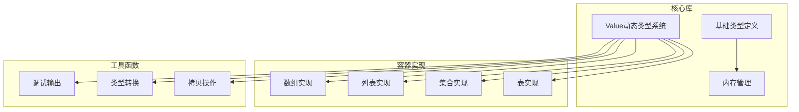
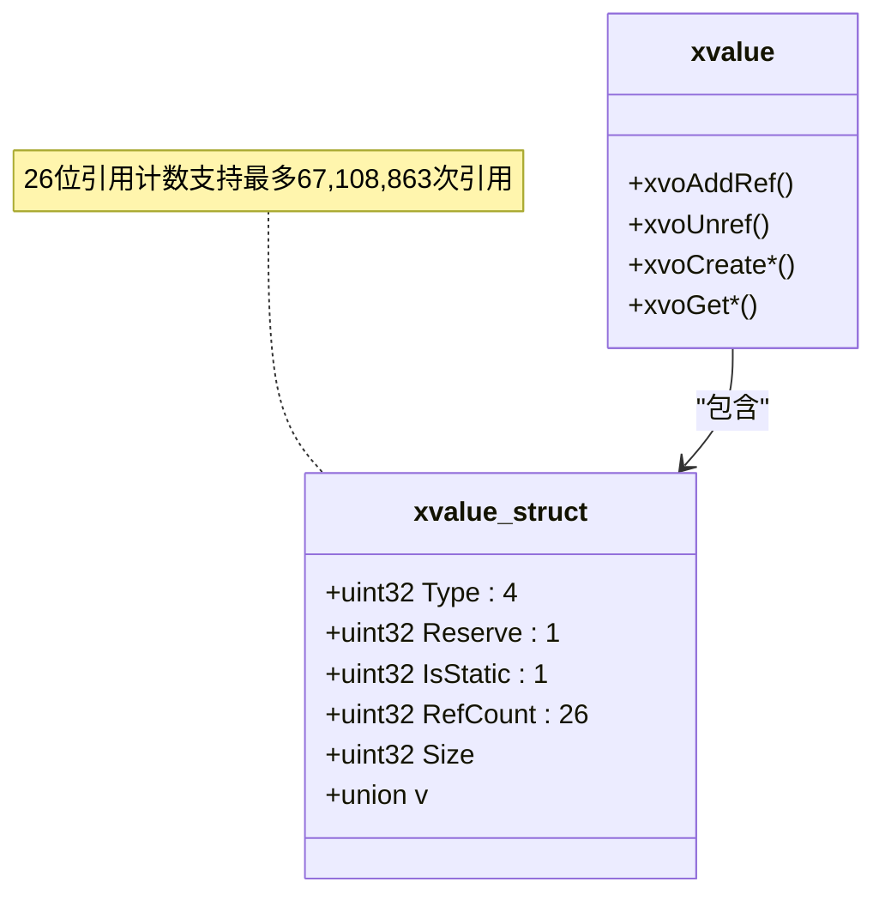
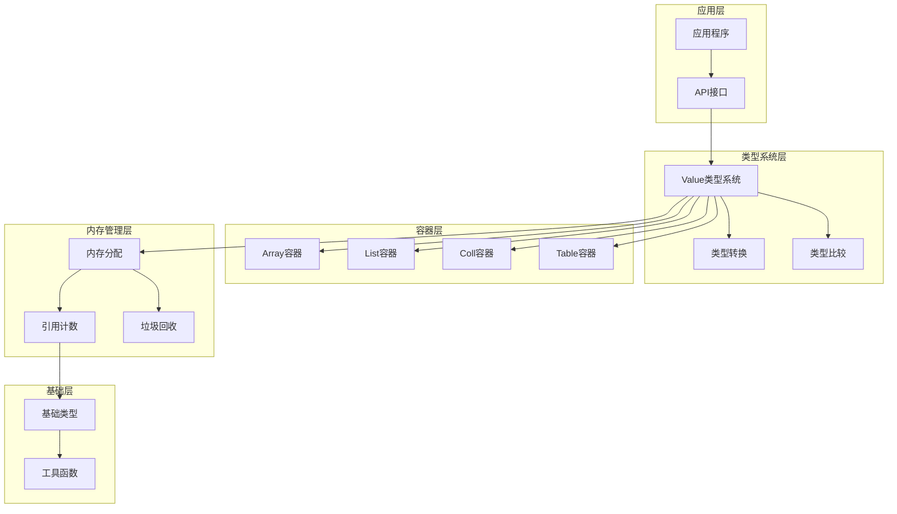
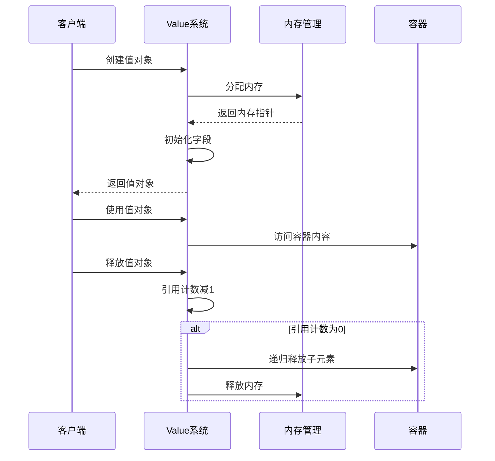
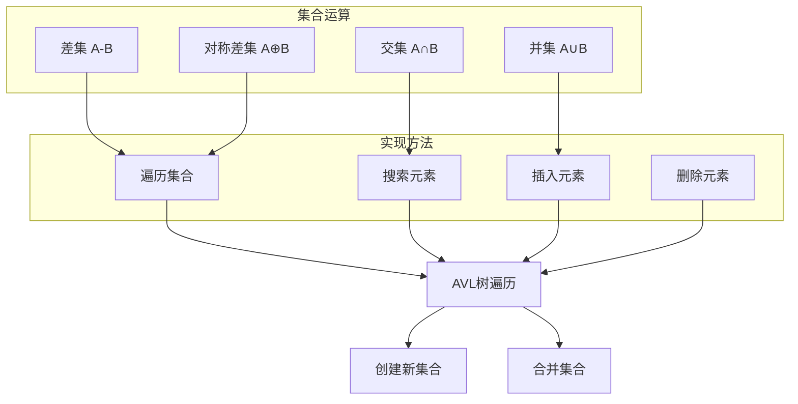
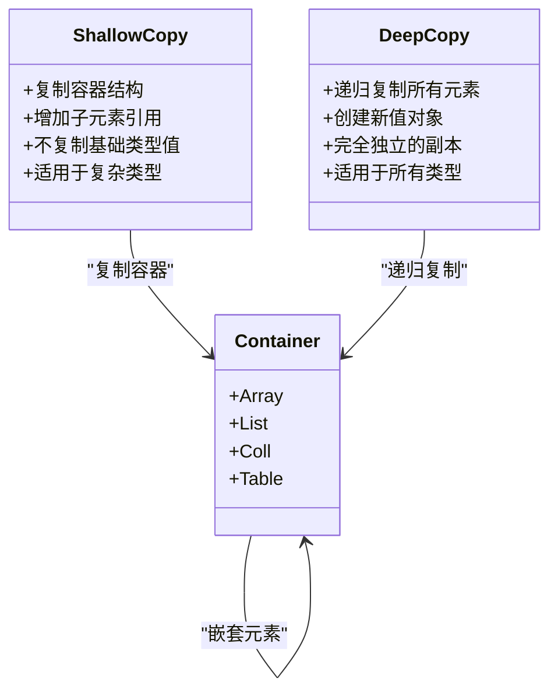
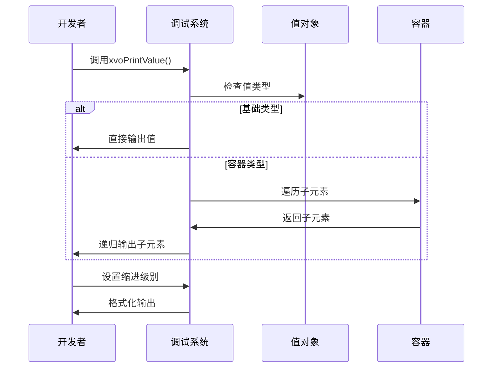
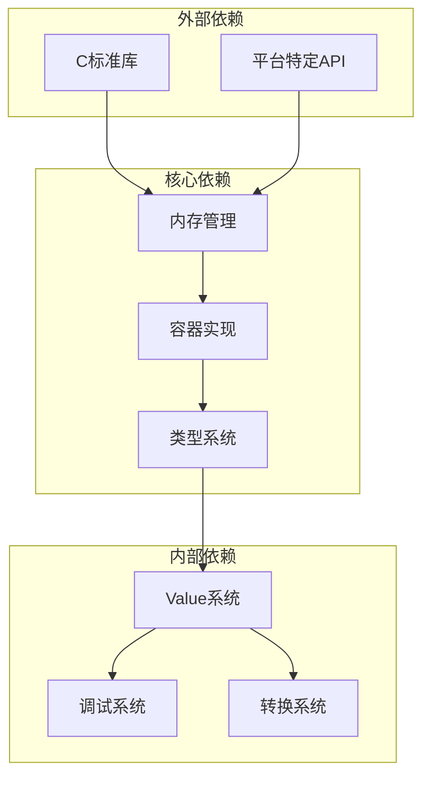
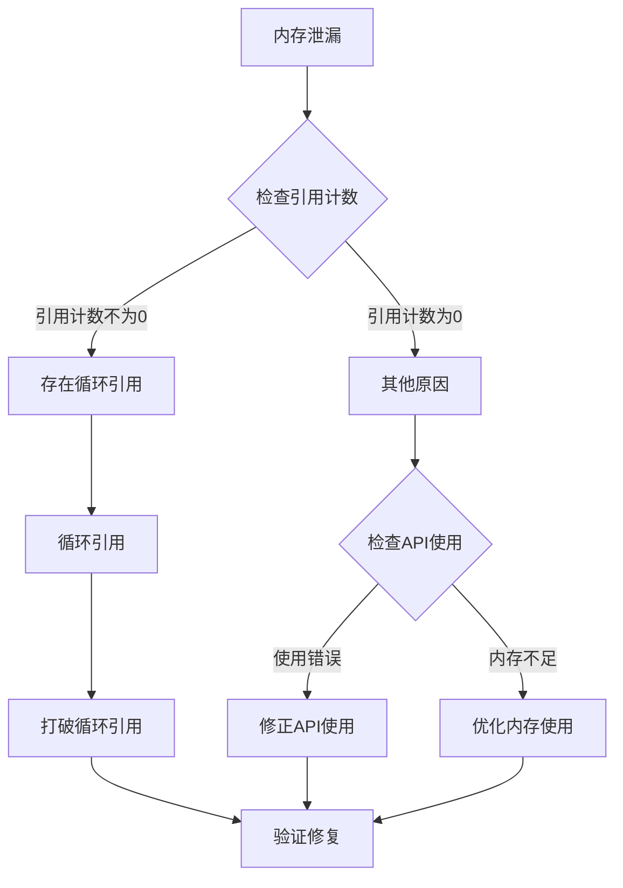

# 动态类型系统

<cite>
**本文档引用的文件**
- [lib/value.h](file://lib/value.h)
- [docs/api-value.md](file://docs/api-value.md)
- [docs/types.md](file://docs/types.md)
- [test/test_value.h](file://test/test_value.h)
- [xrt.h](file://xrt.h)
</cite>

## 目录
1. [简介](#简介)
2. [项目结构](#项目结构)
3. [核心组件](#核心组件)
4. [架构概览](#架构概览)
5. [详细组件分析](#详细组件分析)
6. [依赖分析](#依赖分析)
7. [性能考虑](#性能考虑)
8. [故障排除指南](#故障排除指南)
9. [结论](#结论)
10. [附录](#附录)

## 简介

XRT动态类型系统是一个功能完整的16种数据类型库，提供了完整的引用计数自动内存管理、类型转换、集合操作和调试功能。该系统支持Empty、Null、Bool、Int、Float、Text、Time、Point、Func、Array、List、Coll、Table、Struct、Object、Custom等数据类型，并实现了高效的内存管理和丰富的操作接口。

## 项目结构

XRT动态类型系统主要由以下核心组件构成：



**图表来源**
- [lib/value.h](file://lib/value.h#L1-L1640)
- [docs/api-value.md](file://docs/api-value.md#L1-L1238)

**章节来源**
- [lib/value.h](file://lib/value.h#L1-L1640)
- [docs/types.md](file://docs/types.md#L1-L725)

## 核心组件

### 数据类型系统

XRT动态类型系统定义了16种数据类型，每种类型都有其特定的用途和特性：

| 类型 | 常量 | 描述 | 存储方式 |
|------|------|------|----------|
| Empty | XVO_DT_EMPTY | 空值类型 | 特殊标记 |
| Null | XVO_DT_NULL | 空值 | 静态单例 |
| Bool | XVO_DT_BOOL | 布尔值 | 1位布尔值 |
| Int | XVO_DT_INT | 整数值 | 64位整数 |
| Float | XVO_DT_FLOAT | 浮点数 | 64位双精度 |
| Text | XVO_DT_TEXT | 字符串 | UTF-8编码 |
| Time | XVO_DT_TIME | 时间值 | 64位时间戳 |
| Point | XVO_DT_POINT | 指针值 | void*指针 |
| Func | XVO_DT_FUNC | 函数指针 | 函数指针 |
| Array | XVO_DT_ARRAY | 动态数组 | 指针数组 |
| List | XVO_DT_LIST | 有序列表 | AVL树 |
| Coll | XVO_DT_COLL | 集合 | AVL树 |
| Table | XVO_DT_TABLE | 字典表 | 哈希表 |
| Struct | XVO_DT_STRUCT | 结构体 | 内存块 |
| Object | XVO_DT_OBJECT | 对象实例 | 结构体指针 |
| Custom | XVO_DT_CUSTOM | 自定义类型 | 任意指针 |

### 引用计数机制

系统采用26位引用计数机制，每个值对象包含以下字段：



**图表来源**
- [lib/value.h](file://lib/value.h#L49-L70)

**章节来源**
- [lib/value.h](file://lib/value.h#L32-L96)
- [docs/api-value.md](file://docs/api-value.md#L46-L74)

## 架构概览

XRT动态类型系统采用分层架构设计，从底层的内存管理到上层的类型系统，形成了完整的抽象层次：



**图表来源**
- [lib/value.h](file://lib/value.h#L101-L316)
- [xrt.h](file://xrt.h#L122-L184)

## 详细组件分析

### 值对象管理

#### 创建和销毁机制

系统提供了完整的值对象生命周期管理：



**图表来源**
- [lib/value.h](file://lib/value.h#L101-L167)
- [lib/value.h](file://lib/value.h#L59-L96)

#### 引用计数操作

引用计数机制确保了内存的安全管理：

**章节来源**
- [lib/value.h](file://lib/value.h#L33-L43)
- [lib/value.h](file://lib/value.h#L59-L96)

### 类型转换系统

#### 自动类型转换规则

系统实现了丰富的类型转换机制：

```mermaid
flowchart TD
Start([输入值]) --> CheckType{检查类型}
CheckType --> |NULL| NullConvert[转换为布尔值: FALSE]
CheckType --> |BOOL| BoolConvert[转换为整数: 0或1<br/>转换为浮点数: 0.0或1.0<br/>转换为字符串: "true"或"false"]
CheckType --> |INT| IntConvert[转换为浮点数: 截断<br/>转换为布尔值: 非0为TRUE<br/>转换为字符串: 数字字符串]
CheckType --> |FLOAT| FloatConvert[转换为整数: 截断<br/>转换为布尔值: 非0.0为TRUE<br/>转换为字符串: 浮点字符串]
CheckType --> |TEXT| TextConvert[尝试解析为数字<br/>否则为0或FALSE]
CheckType --> |TIME| TimeConvert[转换为字符串: 格式化时间]
CheckType --> |POINT| PointConvert[转换为字符串: 指针地址]
CheckType --> |FUNC| FuncConvert[转换为字符串: 函数地址]
CheckType --> |ARRAY| ArrayConvert[转换为字符串: 数组描述]
CheckType --> |LIST| ListConvert[转换为字符串: 列表描述]
CheckType --> |COLL| CollConvert[转换为字符串: 集合描述]
CheckType --> |TABLE| TableConvert[转换为字符串: 表描述]
CheckType --> |CLASS| ClassConvert[转换为字符串: 结构体描述]
CheckType --> |CUSTOM| CustomConvert[转换为字符串: 自定义描述]
NullConvert --> End([输出值])
BoolConvert --> End
IntConvert --> End
FloatConvert --> End
TextConvert --> End
TimeConvert --> End
PointConvert --> End
FuncConvert --> End
ArrayConvert --> End
ListConvert --> End
CollConvert --> End
TableConvert --> End
ClassConvert --> End
CustomConvert --> End
```

**图表来源**
- [lib/value.h](file://lib/value.h#L321-L425)

**章节来源**
- [lib/value.h](file://lib/value.h#L321-L425)
- [docs/api-value.md](file://docs/api-value.md#L360-L420)

### 集合操作实现

#### 集合运算算法

系统实现了完整的集合运算功能：



**图表来源**
- [lib/value.h](file://lib/value.h#L914-L1017)

**章节来源**
- [lib/value.h](file://lib/value.h#L914-L1017)
- [docs/api-value.md](file://docs/api-value.md#L815-L855)

### 拷贝操作

#### 浅拷贝与深拷贝

系统提供了两种拷贝模式：



**图表来源**
- [lib/value.h](file://lib/value.h#L1370-L1498)

**章节来源**
- [lib/value.h](file://lib/value.h#L1370-L1498)
- [docs/api-value.md](file://docs/api-value.md#L1001-L1048)

### 调试功能

#### 调试输出系统

系统提供了强大的调试功能：



**图表来源**
- [lib/value.h](file://lib/value.h#L1518-L1637)

**章节来源**
- [lib/value.h](file://lib/value.h#L1518-L1637)
- [docs/api-value.md](file://docs/api-value.md#L1052-L1090)

## 依赖分析

### 组件耦合关系

XRT动态类型系统具有清晰的依赖层次：



**图表来源**
- [xrt.h](file://xrt.h#L32-L44)
- [lib/value.h](file://lib/value.h#L1-L50)

### 性能依赖

系统在设计时充分考虑了性能因素：

**章节来源**
- [lib/value.h](file://lib/value.h#L1-L50)
- [docs/types.md](file://docs/types.md#L24-L61)

## 性能考虑

### 内存管理优化

#### 引用计数优化

系统采用了多项内存管理优化技术：

1. **26位引用计数**：支持大量引用而不会溢出
2. **静态单例**：Null和Bool类型使用静态单例，避免重复分配
3. **批量释放**：容器类型支持批量释放子元素
4. **内存池**：底层使用内存池减少分配开销

#### 访问模式优化

1. **内联函数**：常用操作使用内联函数提高性能
2. **缓存友好**：数据结构设计考虑CPU缓存
3. **延迟分配**：按需分配内存，避免浪费

### 算法复杂度

| 操作 | 时间复杂度 | 空间复杂度 |
|------|------------|------------|
| 创建值 | O(1) | O(1) |
| 引用计数 | O(1) | O(1) |
| 类型转换 | O(1) | O(1) |
| 数组访问 | O(1) | O(1) |
| 列表访问 | O(log n) | O(1) |
| 集合操作 | O(n log n) | O(n) |
| 表操作 | O(log n) | O(1) |
| 拷贝操作 | O(n) | O(n) |

## 故障排除指南

### 常见问题诊断

#### 内存泄漏问题



**图表来源**
- [lib/value.h](file://lib/value.h#L59-L96)

#### 类型转换错误

系统提供了完善的错误检测机制：

**章节来源**
- [lib/value.h](file://lib/value.h#L321-L425)
- [test/test_value.h](file://test/test_value.h#L266-L564)

### 调试技巧

#### 使用调试输出

```c
// 基本调试输出
xvoPrintValue(value, 0, 0, 0, NULL);

// 数组调试输出
xvoPrintValue(array, 0, 1, index, NULL);

// 表调试输出  
xvoPrintValue(table, 0, 2, 0, key);
```

#### 性能监控

1. **内存使用监控**：定期检查引用计数
2. **操作时间测量**：使用高精度计时器
3. **内存泄漏检测**：使用调试版本进行检测

**章节来源**
- [lib/value.h](file://lib/value.h#L1518-L1637)
- [docs/api-value.md](file://docs/api-value.md#L1052-L1090)

## 结论

XRT动态类型系统是一个设计精良、功能完整的类型系统。它提供了：

1. **完整的16种数据类型**：满足各种应用场景需求
2. **高效的内存管理**：26位引用计数确保内存安全
3. **丰富的操作接口**：涵盖数据操作的各个方面
4. **强大的调试功能**：内置调试输出和错误检测
5. **优秀的性能表现**：优化的数据结构和算法

该系统适合用于构建高性能的应用程序，特别是在需要动态类型支持和复杂数据结构管理的场景中。

## 附录

### 最佳实践

#### 内存管理最佳实践

1. **及时释放**：使用完值对象后立即释放
2. **避免循环引用**：谨慎使用嵌套引用
3. **合理使用托管模式**：对于常量字符串使用托管模式
4. **预分配容量**：对于动态数组预分配容量

#### 性能优化建议

1. **批量操作**：使用批量操作减少函数调用开销
2. **选择合适容器**：根据使用场景选择合适的容器类型
3. **避免不必要的拷贝**：使用引用而不是拷贝
4. **利用缓存**：复用常用的值对象

#### 调试和测试

1. **单元测试**：为关键功能编写单元测试
2. **集成测试**：测试不同类型组合的场景
3. **性能测试**：定期进行性能基准测试
4. **内存测试**：使用内存检测工具进行测试

**章节来源**
- [docs/api-value.md](file://docs/api-value.md#L1166-L1218)
- [test/test_value.h](file://test/test_value.h#L1-L1004)