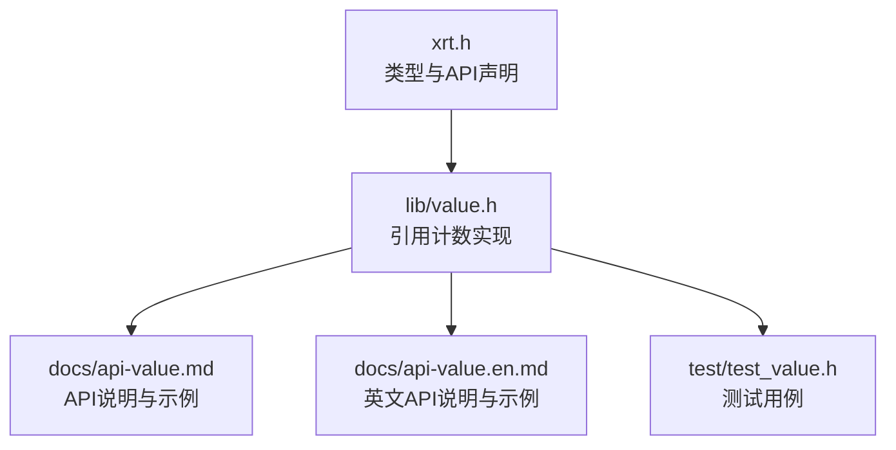
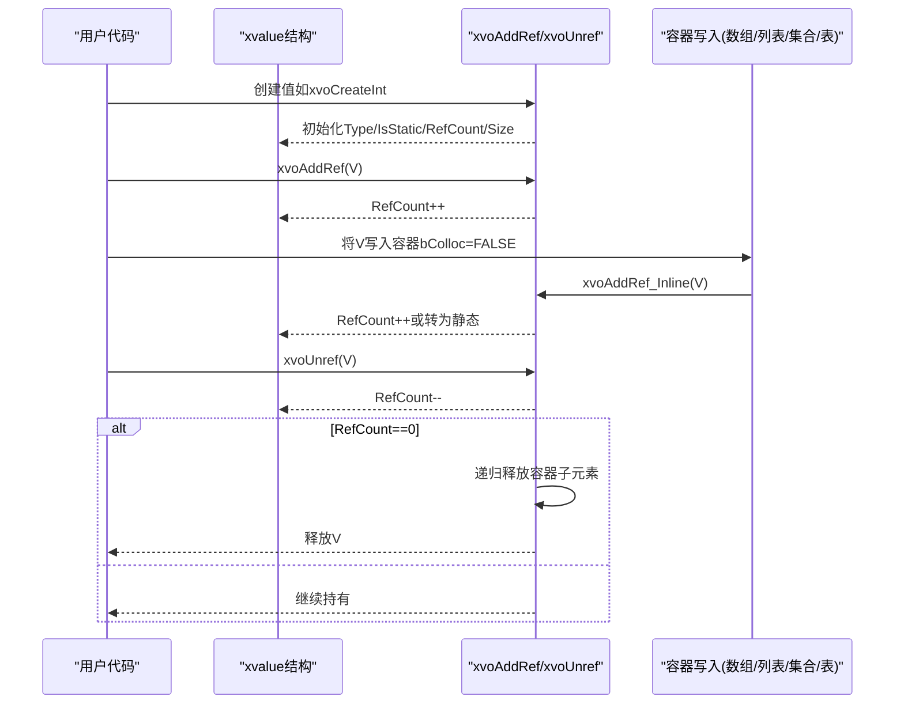
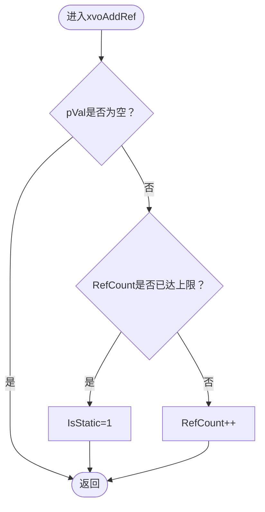
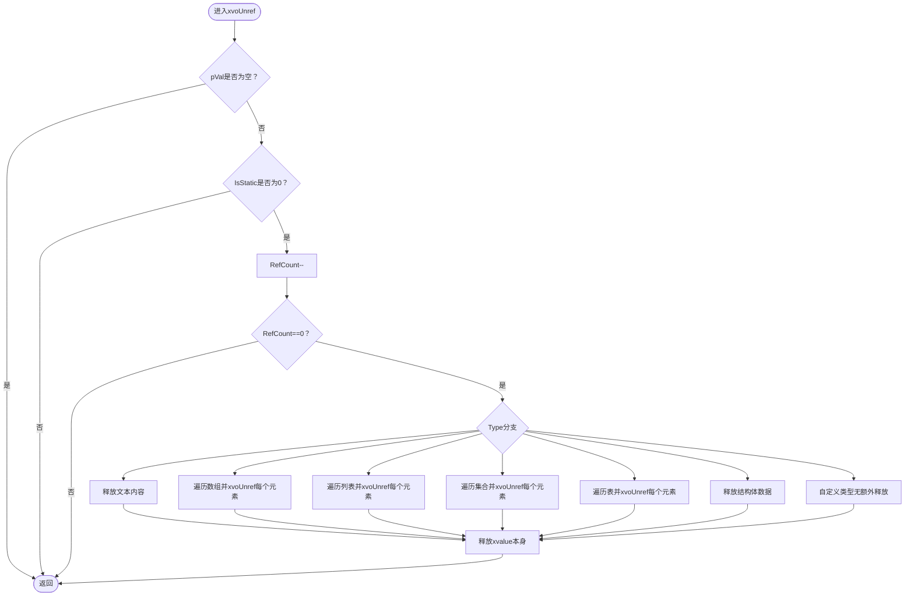
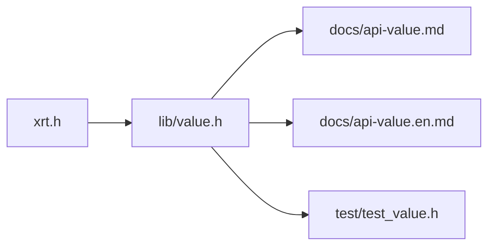

# 引用计数机制

<cite>
**本文引用的文件**
- [xrt.h](file://xrt.h)
- [value.h](file://lib/value.h)
- [api-value.md](file://docs/api-value.md)
- [api-value.en.md](file://docs/api-value.en.md)
- [README.md](file://README.md)
- [test_value.h](file://test/test_value.h)
</cite>

## 目录
1. [简介](#简介)
2. [项目结构](#项目结构)
3. [核心组件](#核心组件)
4. [架构总览](#架构总览)
5. [详细组件分析](#详细组件分析)
6. [依赖关系分析](#依赖关系分析)
7. [性能考量](#性能考量)
8. [故障排查指南](#故障排查指南)
9. [结论](#结论)
10. [附录](#附录)

## 简介
本文件聚焦于XRT动态类型系统的“引用计数”机制，系统性阐述：
- 26位引用计数的工作原理与上限
- 计数器溢出处理策略（自动转为静态值）
- 静态值优化策略（null/true/false 单例）
- xvoAddRef与xvoUnref的实现细节与触发时机
- 自动内存管理的触发条件与回收流程
- 性能优化机制与最佳实践
- 常见陷阱与调试技巧
- 具体使用示例路径（以代码片段路径代替具体代码）

## 项目结构
围绕引用计数的核心代码主要位于以下位置：
- 类型与API声明：xrt.h（包含xvalue结构、引用计数字段、API原型）
- 引用计数实现与容器操作：lib/value.h（包含xvoAddRef、xvoUnref、容器写入时的引用管理）
- 文档与示例：docs/api-value.md、docs/api-value.en.md（API说明、示例与最佳实践）
- 测试用例：test/test_value.h（覆盖基础类型与引用计数行为）

图表来源
- [xrt.h](file://xrt.h#L1910-L1957)
- [value.h](file://lib/value.h#L32-L96)
- [api-value.md](file://docs/api-value.md#L46-L121)
- [api-value.en.md](file://docs/api-value.en.md#L113-L1221)
- [test_value.h](file://test/test_value.h#L573-L708)

章节来源
- [xrt.h](file://xrt.h#L1890-L2089)
- [value.h](file://lib/value.h#L1-L1640)
- [api-value.md](file://docs/api-value.md#L1-L200)
- [api-value.en.md](file://docs/api-value.en.md#L113-L1221)
- [test_value.h](file://test/test_value.h#L573-L708)

## 核心组件
- xvalue结构：包含Type、IsStatic、RefCount、Size以及联合体vXxx，其中RefCount为26位。
- 引用计数API：xvoAddRef、xvoUnref、xvoAddRef_Inline（内联版本）。
- 静态值单例：null、true、false使用IsStatic=1的静态单例，无需释放。
- 容器写入时的引用管理：Array/List/Coll/Table在追加/插入/设置值时根据bColloc决定是否对值执行xvoAddRef_Inline。

章节来源
- [xrt.h](file://xrt.h#L1910-L1957)
- [value.h](file://lib/value.h#L32-L96)
- [api-value.md](file://docs/api-value.md#L46-L121)

## 架构总览
XRT的动态类型系统通过xvalue统一承载不同数据类型，引用计数贯穿创建、传递、写入与销毁全过程。容器类型在写入时负责维护子元素的引用计数，确保树形结构的生命周期由根节点统一管理。

图表来源
- [value.h](file://lib/value.h#L32-L96)
- [value.h](file://lib/value.h#L541-L601)
- [value.h](file://lib/value.h#L723-L743)
- [value.h](file://lib/value.h#L1139-L1165)

## 详细组件分析

### 26位引用计数与溢出处理
- 结构字段：xvalue的RefCount为26位，最大值为0x3FFFFFF（约6710.89万）。
- 溢出策略：当xvoAddRef检测到计数已达上限，会将IsStatic置1，使该值不再参与常规释放流程，避免计数溢出导致的悬挂指针风险。
- 静态值优化：null、true、false使用IsStatic=1的静态单例，无需手动释放；其他基础类型（如文本）在bColloc=TRUE时可直接托管外部指针，避免复制与释放开销。

图表来源
- [xrt.h](file://xrt.h#L1910-L1957)
- [value.h](file://lib/value.h#L32-L43)

章节来源
- [xrt.h](file://xrt.h#L1910-L1957)
- [value.h](file://lib/value.h#L32-L43)
- [api-value.md](file://docs/api-value.md#L46-L121)

### xvoAddRef与xvoUnref实现细节
- xvoAddRef：对非空值增加引用计数；若已达到上限则转为静态值。
- xvoUnref：仅对IsStatic=0的值递减计数；当计数降至0时，按类型递归释放容器内的子元素，最后释放自身。
- 容器写入：Array/Insert/Set、List/Set、Table/Set在bColloc=FALSE且值非静态时，会调用xvoAddRef_Inline对子元素增加引用计数，确保容器拥有所有权。

图表来源
- [value.h](file://lib/value.h#L59-L96)

章节来源
- [value.h](file://lib/value.h#L32-L96)
- [value.h](file://lib/value.h#L541-L601)
- [value.h](file://lib/value.h#L723-L743)
- [value.h](file://lib/value.h#L1139-L1165)

### 容器写入时的引用管理
- Array：Append/Insert/Set在bColloc=FALSE且值非静态时，调用xvoAddRef_Inline。
- List：SetValue在bColloc=FALSE且值非静态时，调用xvoAddRef_Inline。
- Table：SetValue在bColloc=FALSE且值非静态时，调用xvoAddRef_Inline。
- 这些规则保证容器对其子元素拥有所有权，释放时自动递归清理。

章节来源
- [value.h](file://lib/value.h#L541-L601)
- [value.h](file://lib/value.h#L723-L743)
- [value.h](file://lib/value.h#L1139-L1165)

### 静态值优化策略
- null/true/false使用IsStatic=1的静态单例，无需释放。
- 文本类型在bColloc=TRUE时直接托管外部指针，避免复制与释放成本。
- 这些策略显著降低频繁创建/销毁带来的分配与释放开销。

章节来源
- [value.h](file://lib/value.h#L4-L28)
- [value.h](file://lib/value.h#L137-L167)
- [api-value.md](file://docs/api-value.md#L125-L151)

### 自动内存管理触发时机与回收策略
- 触发时机：每次xvoUnref调用都会检查计数是否为0，若是则立即释放。
- 回收策略：容器类型在释放前先递归释放其子元素，确保树形结构的完整性。
- 静态值不参与释放流程，避免误删共享单例。

章节来源
- [value.h](file://lib/value.h#L59-L96)

### 性能优化机制
- 26位引用计数上限与静态值降级：防止极端高并发下的计数溢出与额外逻辑。
- 内联函数：xvoAddRef_Inline减少函数调用开销。
- 托管模式（bColloc）：对常量字符串采用托管而非复制，节省内存与CPU。
- 预分配容量：Array/Alloc接口减少扩容次数，降低多次分配与复制的成本。

章节来源
- [xrt.h](file://xrt.h#L1949-L1957)
- [api-value.en.md](file://docs/api-value.en.md#L1202-L1218)

## 依赖关系分析
- xrt.h定义xvalue结构与API原型，是上层调用的基础。
- lib/value.h实现引用计数与容器写入逻辑，依赖底层内存分配与容器实现。
- 文档与测试用例验证API行为与最佳实践。

图表来源
- [xrt.h](file://xrt.h#L1890-L2089)
- [value.h](file://lib/value.h#L1-L1640)
- [api-value.md](file://docs/api-value.md#L1-L200)
- [api-value.en.md](file://docs/api-value.en.md#L113-L1221)
- [test_value.h](file://test/test_value.h#L573-L708)

章节来源
- [xrt.h](file://xrt.h#L1890-L2089)
- [value.h](file://lib/value.h#L1-L1640)
- [api-value.md](file://docs/api-value.md#L1-L200)
- [api-value.en.md](file://docs/api-value.en.md#L113-L1221)
- [test_value.h](file://test/test_value.h#L573-L708)

## 性能考量
- 26位计数上限与静态值降级：在极端高并发场景下避免计数溢出与额外逻辑。
- 内联优化：xvoAddRef_Inline减少调用开销。
- bColloc托管：对常量字符串避免复制与释放。
- 预分配：减少扩容次数，提升写入吞吐。
- 容器递归释放：确保树形结构一致性，避免悬挂指针。

## 故障排查指南
- 常见问题
  - 忘记释放：导致内存泄漏。确保每次xvoAddRef都有对应xvoUnref。
  - 错误的bColloc：bColloc=FALSE时，容器会持有引用，需确认外部是否还需使用该值。
  - 循环引用：容器之间互相持有引用可能导致无法释放。应避免循环持有。
  - 静态值误释放：null/true/false无需释放，释放会导致未定义行为。
- 调试技巧
  - 使用xvoPrintValue打印结构，观察引用计数与子元素状态。
  - 在关键路径添加日志，记录xvoAddRef/xvoUnref调用次数与结果。
  - 使用测试用例验证基本行为（如整数、数组、表的创建与释放）。

章节来源
- [api-value.en.md](file://docs/api-value.en.md#L1189-L1218)
- [test_value.h](file://test/test_value.h#L573-L708)

## 结论
XRT的引用计数机制以26位计数为核心，结合静态值降级与托管模式，实现了高效、安全的自动内存管理。通过容器写入时的引用管理与递归释放策略，确保复杂数据结构的生命周期可控。遵循最佳实践与调试技巧，可在保证性能的同时避免常见的内存问题。

## 附录
- 正确使用示例（以路径代替代码）
  - 基本引用计数示例：[示例路径](file://docs/api-value.en.md#L113-L1221)
  - 容器写入与引用管理示例：[示例路径](file://docs/api-value.en.md#L1166-L1221)
  - 测试用例参考：[示例路径](file://test/test_value.h#L573-L708)
- 相关API说明
  - xvalue结构与引用计数字段：[说明路径](file://docs/api-value.md#L46-L74)
  - xvoAddRef/xvoUnref说明：[说明路径](file://docs/api-value.md#L78-L121)
  - 文档总览与特性：[说明路径](file://README.md#L127-L157)