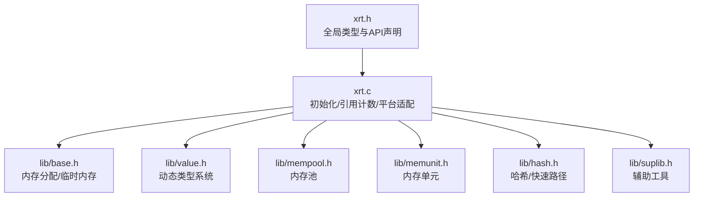
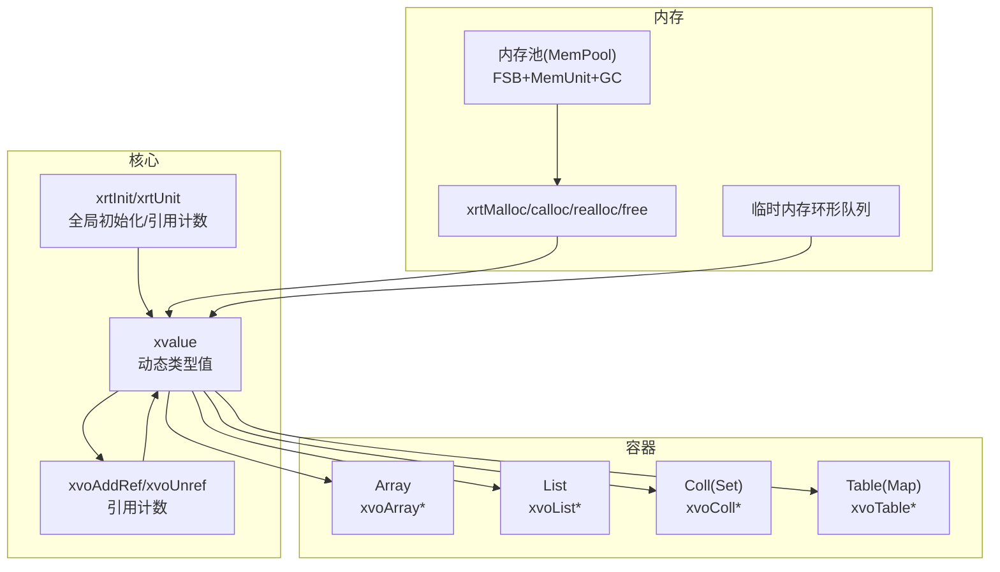
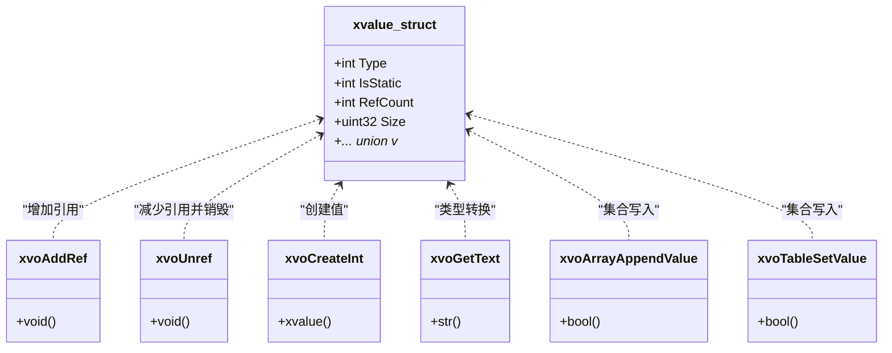
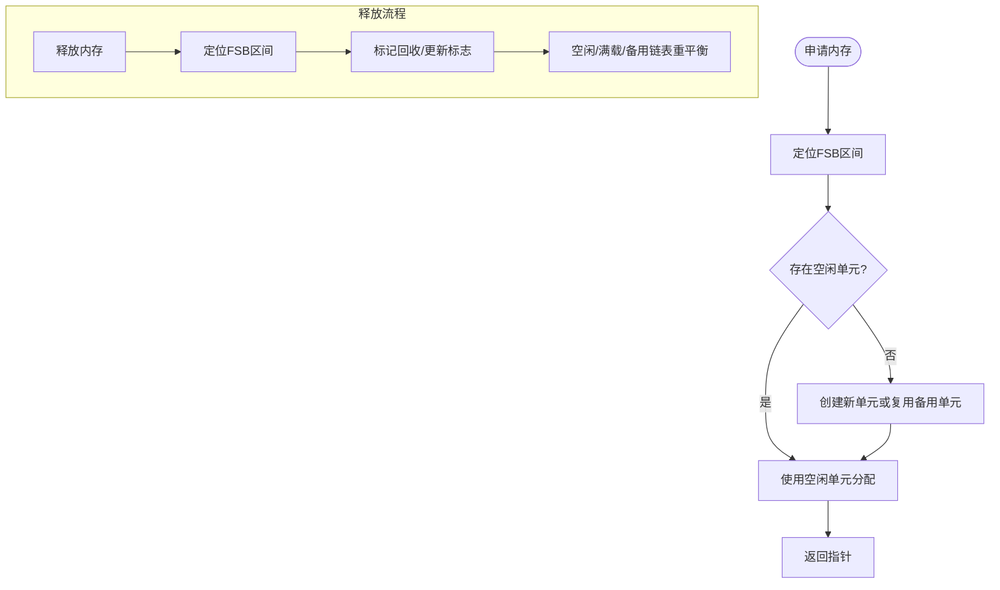
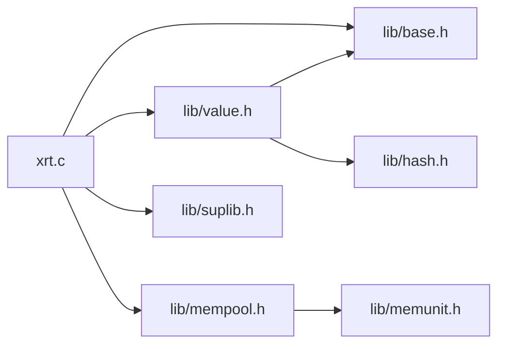

# 性能优化指南

<cite>
**本文档引用的文件**
- [xrt.h](file://xrt.h)
- [xrt.c](file://xrt.c)
- [value.h](file://lib/value.h)
- [mempool.h](file://lib/mempool.h)
- [base.h](file://lib/base.h)
- [test_value.h](file://test/test_value.h)
- [test_mempool.h](file://test/test_mempool.h)
- [test.c](file://test.c)
- [memunit.h](file://lib/memunit.h)
- [hash.h](file://lib/hash.h)
- [suplib.h](file://lib/suplib.h)
</cite>

## 目录
1. [简介](#简介)
2. [项目结构](#项目结构)
3. [核心组件](#核心组件)
4. [架构总览](#架构总览)
5. [详细组件分析](#详细组件分析)
6. [依赖关系分析](#依赖关系分析)
7. [性能考量](#性能考量)
8. [故障排查指南](#故障排查指南)
9. [结论](#结论)
10. [附录](#附录)

## 简介
本指南聚焦于XRT动态类型系统的性能优化，围绕引用计数开销、内存分配成本、类型转换代价等关键性能因素，结合源码实现与测试用例，给出可落地的优化策略与最佳实践。文档同时覆盖高频创建场景的内存池使用、大数据集合的批量操作、复杂对象的生命周期管理，并提供性能监控方法、瓶颈识别技巧与调优策略。

## 项目结构
XRT采用“核心头文件 + 子库模块”的组织方式，核心入口负责全局初始化与引用计数，各功能子库（基础、字符串、时间、文件、网络、动态类型、内存池等）按模块化封装，便于按需使用与性能优化。

图表来源
- [xrt.h](file://xrt.h#L1-L200)
- [xrt.c](file://xrt.c#L87-L186)
- [base.h](file://lib/base.h#L1-L132)
- [value.h](file://lib/value.h#L1-L120)
- [mempool.h](file://lib/mempool.h#L1-L120)
- [memunit.h](file://lib/memunit.h#L1-L120)
- [hash.h](file://lib/hash.h#L63-L120)
- [suplib.h](file://lib/suplib.h#L1-L55)

章节来源
- [xrt.h](file://xrt.h#L1-L200)
- [xrt.c](file://xrt.c#L87-L186)

## 核心组件
- 全局初始化与引用计数：xrtInit/xrtUnit负责全局状态初始化与引用计数，避免重复初始化与资源泄漏。
- 基础内存接口：xrtMalloc/xrtCalloc/xrtRealloc/xrtFree与临时内存环形队列，支撑上层动态类型与集合的内存需求。
- 动态类型系统：xvalue结构与引用计数机制，统一管理各类值（标量、字符串、数组、列表、集合、表、类、自定义），提供浅拷贝/深拷贝与集合运算。
- 内存池：基于FSB（Flexible Small Block）的分段树结构，针对小/大内存块分别优化；配合内存单元（MemUnit）与GC标记回收，降低碎片与系统调用频次。
- 辅助与工具：字符串长度、内存查找、哈希实现等，提供性能敏感路径的加速。

章节来源
- [xrt.c](file://xrt.c#L87-L226)
- [base.h](file://lib/base.h#L1-L132)
- [value.h](file://lib/value.h#L31-L96)
- [mempool.h](file://lib/mempool.h#L35-L145)
- [memunit.h](file://lib/memunit.h#L45-L100)
- [hash.h](file://lib/hash.h#L63-L120)
- [suplib.h](file://lib/suplib.h#L4-L32)

## 架构总览
XRT动态类型系统通过“值对象 + 引用计数 + 集合容器 + 内存池”的组合实现高性能动态数据处理。值对象在创建时分配，引用计数为0时销毁；集合容器在写入/合并时遵循“引用转移/复制”策略；内存池按块大小分段，减少频繁系统调用与碎片。

图表来源
- [xrt.c](file://xrt.c#L87-L226)
- [value.h](file://lib/value.h#L31-L96)
- [mempool.h](file://lib/mempool.h#L35-L145)
- [base.h](file://lib/base.h#L49-L84)

## 详细组件分析

### 动态类型系统（value.h）
- 引用计数与销毁：xvoUnref在计数归零时递归销毁容器及其元素，避免悬挂引用与内存泄漏。
- 创建与转换：xvoCreate系列按需分配，xvoGet*系列提供跨类型的无损转换（如整数/浮点/布尔/文本/时间/指针/函数/集合/表/类/自定义）。
- 集合操作：Array/List/Coll/Table提供插入/设置/合并/差并交/清空/排序等，均考虑引用语义与内存释放。
- 拷贝策略：xvoCopy对复杂类型做“引用转移”，xvoDeepCopy对复杂类型做“递归复制”，平衡性能与安全性。

图表来源
- [value.h](file://lib/value.h#L31-L96)
- [value.h](file://lib/value.h#L100-L316)
- [value.h](file://lib/value.h#L320-L517)
- [value.h](file://lib/value.h#L521-L700)
- [value.h](file://lib/value.h#L800-L1035)
- [value.h](file://lib/value.h#L1113-L1286)
- [value.h](file://lib/value.h#L1370-L1498)

章节来源
- [value.h](file://lib/value.h#L31-L96)
- [value.h](file://lib/value.h#L100-L316)
- [value.h](file://lib/value.h#L320-L517)
- [value.h](file://lib/value.h#L521-L700)
- [value.h](file://lib/value.h#L800-L1035)
- [value.h](file://lib/value.h#L1113-L1286)
- [value.h](file://lib/value.h#L1370-L1498)

### 内存池（mempool.h）
- FSB分段树：针对小块内存（如1-512字节）与大块内存（如513-4096字节）分别建立二叉树，按大小范围选择合适的内存单元。
- MemUnit单元：每个单元最多容纳256个对象槽，采用环形空闲列表与计数管理，提升局部性与缓存友好性。
- GC回收：支持标记回收，将未标记对象回收，避免碎片累积；同时维护“空闲/满载/备用”链表，减少单元创建/销毁开销。

图表来源
- [mempool.h](file://lib/mempool.h#L147-L261)
- [mempool.h](file://lib/mempool.h#L335-L385)
- [mempool.h](file://lib/mempool.h#L427-L465)

章节来源
- [mempool.h](file://lib/mempool.h#L35-L145)
- [mempool.h](file://lib/mempool.h#L147-L261)
- [mempool.h](file://lib/mempool.h#L335-L385)
- [mempool.h](file://lib/mempool.h#L427-L465)

### 基础内存接口（base.h）
- 临时内存环形队列：xrtTempMemory按环形索引复用最近分配的内存，xrtFreeTempMemory统一释放，适合短生命周期临时缓冲。
- 错误处理：xrtSetError/xrtClearError提供线程不安全的错误记录与释放策略，避免频繁分配。

章节来源
- [base.h](file://lib/base.h#L49-L84)
- [base.h](file://lib/base.h#L88-L129)

### 性能测试与基准（test_value.h, test_mempool.h）
- 动态类型测试：覆盖Array/List/Coll/Table的创建、插入、设置、合并、清空、拷贝、集合运算等，验证引用语义与内存释放。
- 内存池测试：展示FSB树结构打印、对象创建、批量分配与释放、GC前后状态变化，验证内存池容量与回收行为。

章节来源
- [test_value.h](file://test/test_value.h#L1-L262)
- [test_value.h](file://test/test_value.h#L266-L564)
- [test_value.h](file://test/test_value.h#L568-L1004)
- [test_mempool.h](file://test/test_mempool.h#L24-L184)

## 依赖关系分析
- 初始化依赖：xrt.c在启动时引入各子库头文件，确保API可用；全局引用计数避免重复初始化。
- 动态类型依赖：value.h依赖基础内存接口与集合容器实现；集合容器依赖底层数据结构（数组、列表、字典、AVL树）。
- 内存池依赖：mempool.h依赖memunit.h与BSMM（块结构内存管理器）；提供统一的分配/释放/GC接口。
- 工具依赖：suplib.h提供字符串长度与内存查找等辅助能力；hash.h提供高性能哈希实现，服务于字典与集合。

图表来源
- [xrt.c](file://xrt.c#L54-L84)
- [value.h](file://lib/value.h#L1-L120)
- [mempool.h](file://lib/mempool.h#L1-L40)
- [memunit.h](file://lib/memunit.h#L1-L60)
- [hash.h](file://lib/hash.h#L63-L120)
- [suplib.h](file://lib/suplib.h#L1-L55)

章节来源
- [xrt.c](file://xrt.c#L54-L84)

## 性能考量

### 引用计数开销
- 优势：避免共享对象的深拷贝，减少CPU与内存分配；在集合合并/赋值时通过“引用转移”降低复制成本。
- 注意：过度引用导致延迟释放，应尽早解除强引用；注意循环引用风险（可通过弱引用策略或显式解除）。

章节来源
- [value.h](file://lib/value.h#L31-L96)
- [value.h](file://lib/value.h#L521-L700)
- [value.h](file://lib/value.h#L800-L1035)
- [value.h](file://lib/value.h#L1113-L1286)

### 内存分配成本
- 系统调用：频繁的小块分配会触发系统调用，建议使用内存池；临时缓冲使用环形临时内存。
- 碎片化：内存池按大小分段，配合MemUnit的空闲槽与GC回收，降低碎片；合理设置GC周期。

章节来源
- [base.h](file://lib/base.h#L49-L84)
- [mempool.h](file://lib/mempool.h#L147-L261)
- [mempool.h](file://lib/mempool.h#L335-L385)

### 类型转换代价
- 无损转换：xvoGet*在不同类型间进行转换时，尽量利用已有表示（如整数/浮点/布尔/文本/时间），避免重复解析。
- 文本转换：字符串到数值转换使用高效实现，避免不必要的中间对象。

章节来源
- [value.h](file://lib/value.h#L320-L425)

### 高频创建场景优化
- 内存池：优先使用xrtMemPoolAlloc/xrtMemPoolFree，按块大小选择合适配置（小块/大块方案）。
- 临时内存：短生命周期对象使用xrtTempMemory，减少长期驻留内存压力。
- 批量操作：集合的批量插入/合并优于逐项操作，减少引用计数与内存分配次数。

章节来源
- [mempool.h](file://lib/mempool.h#L147-L261)
- [base.h](file://lib/base.h#L49-L84)
- [value.h](file://lib/value.h#L521-L700)
- [value.h](file://lib/value.h#L800-L1035)
- [value.h](file://lib/value.h#L1113-L1286)

### 大数据集合优化
- 批量接口：优先使用批量分配（xvoArrayAlloc）、批量合并（xvoArrayMerge、xvoListMerge、xvoTableMerge）与批量清空（xvoArrayClear、xvoListClear、xvoTableClear、xvoCollClear）。
- 避免重复拷贝：在可能情况下使用“引用转移”，减少浅拷贝/深拷贝带来的额外成本。

章节来源
- [value.h](file://lib/value.h#L627-L700)
- [value.h](file://lib/value.h#L774-L791)
- [value.h](file://lib/value.h#L1197-L1214)
- [value.h](file://lib/value.h#L1261-L1272)
- [value.h](file://lib/value.h#L1084-L1095)

### 复杂对象生命周期管理
- 明确所有权：在集合写入时决定“引用转移”还是“复制”，避免双重释放或悬挂引用。
- 及时清理：使用clear/destroy接口释放容器与元素；对临时对象使用xrtFreeTempMemory集中释放。

章节来源
- [value.h](file://lib/value.h#L521-L700)
- [value.h](file://lib/value.h#L800-L1035)
- [value.h](file://lib/value.h#L1113-L1286)
- [base.h](file://lib/base.h#L74-L84)

### 性能监控与调优
- 计时器：使用xrtTimer进行高精度计时，测量关键路径耗时；结合xrtSleep进行延迟模拟与稳定性验证。
- 基准测试：参考test_value.h与test_mempool.h中的测试用例，构造相同规模的数据集，对比不同策略的性能差异。
- 观察指标：关注分配次数、释放次数、GC回收数量、集合操作耗时、内存峰值与碎片率。

章节来源
- [test.c](file://test.c#L54-L179)
- [test_value.h](file://test/test_value.h#L1-L262)
- [test_mempool.h](file://test/test_mempool.h#L24-L184)

## 故障排查指南
- 引用计数异常：若出现内存泄漏或提前释放，检查xvoAddRef/xvoUnref配对，确认集合写入时的bColloc参数与引用转移逻辑。
- 内存池问题：若分配失败或GC后仍占用内存，检查FSB区间映射、MemUnit空闲槽与GC标记状态。
- 临时内存泄漏：确认使用xrtFreeTempMemory在合适时机释放，避免长时间持有临时缓冲。
- 错误定位：通过xrtSetError设置错误信息，结合xrtLastError查看最近错误，辅助定位问题。

章节来源
- [value.h](file://lib/value.h#L31-L96)
- [mempool.h](file://lib/mempool.h#L335-L385)
- [base.h](file://lib/base.h#L88-L129)

## 结论
XRT动态类型系统通过“值对象 + 引用计数 + 集合容器 + 内存池”的设计，在保证灵活性的同时兼顾性能。优化的关键在于：合理使用内存池与临时内存、批量操作集合、明确引用语义、及时清理生命周期对象，并通过计时器与基准测试持续评估与调优。

## 附录

### 性能测试案例与对比分析
- 动态类型操作：参考test_value.h中的Array/List/Coll/Table完整操作测试，对比批量与逐项操作的性能差异。
- 内存池分配：参考test_mempool.h中的FSB树结构、批量分配与释放、GC前后状态变化，评估不同块大小策略的吞吐与延迟。
- 建议：在相同硬件与数据规模下，分别测试“内存池 + 批量操作 + 引用转移”与“系统分配 + 逐项操作 + 深拷贝”的差异，形成基线数据。

章节来源
- [test_value.h](file://test/test_value.h#L568-L1004)
- [test_mempool.h](file://test/test_mempool.h#L24-L184)