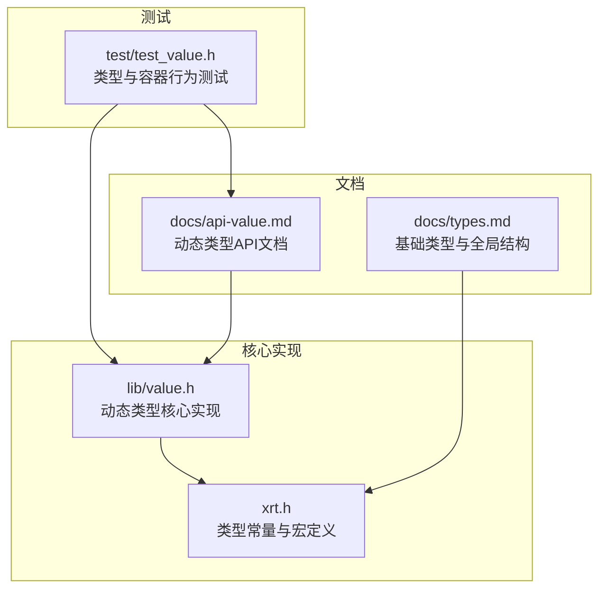
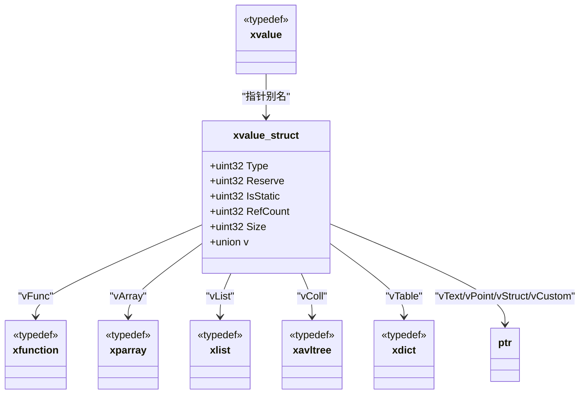
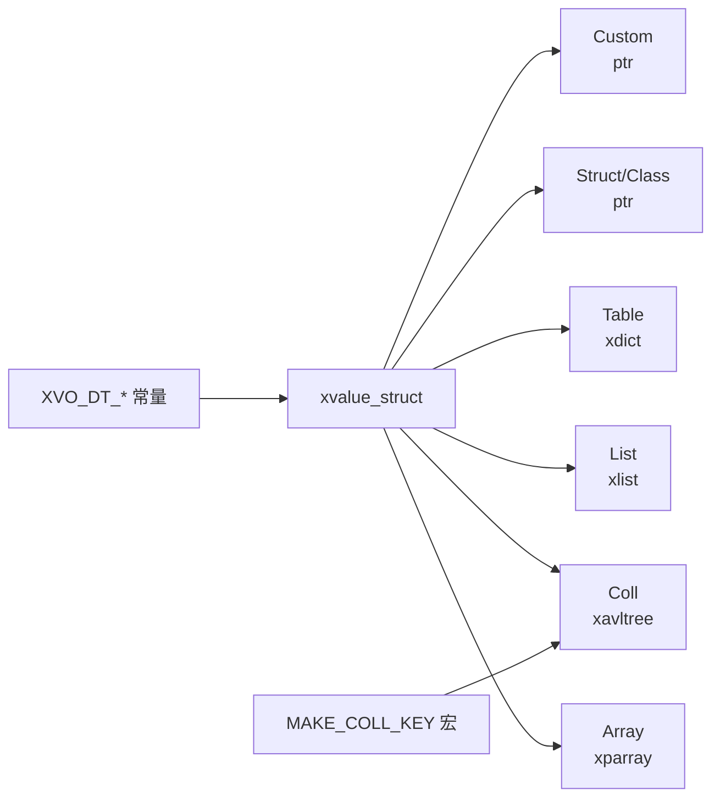

# 数据类型概览

<cite>
**本文档引用的文件**
- [lib/value.h](file://lib/value.h)
- [docs/api-value.md](file://docs/api-value.md)
- [docs/types.md](file://docs/types.md)
- [xrt.h](file://xrt.h)
- [test/test_value.h](file://test/test_value.h)
</cite>

## 目录
1. [简介](#简介)
2. [项目结构](#项目结构)
3. [核心组件](#核心组件)
4. [架构总览](#架构总览)
5. [详细组件分析](#详细组件分析)
6. [依赖关系分析](#依赖关系分析)
7. [性能考量](#性能考量)
8. [故障排除指南](#故障排除指南)
9. [结论](#结论)

## 简介
本文件面向XRT动态类型系统，系统性梳理16种数据类型的定义、特性与用途，涵盖：
- Empty（空值）
- Null（空引用）
- Bool（布尔值）
- Int（整数值）
- Float（浮点数值）
- Text（文本值）
- Time（时间值）
- Point（指针值）
- Func（函数值）
- Array（数组）
- List（列表）
- Coll（集合）
- Table（表格）
- Struct（结构体）
- Object（对象）
- Custom（自定义）

重点说明每种类型的存储方式、内存布局、访问接口以及典型应用场景，并提供类型选择指南与性能优化建议。

## 项目结构
XRT动态类型系统主要由以下模块构成：
- 动态类型核心：定义xvalue结构、类型常量、创建/读取/类型判断/容器操作等API
- 文档：类型系统与API文档，包含类型常量、结构体定义、操作接口说明
- 测试：覆盖各类型的创建、转换、容器操作、拷贝等行为验证

图表来源
- [lib/value.h](file://lib/value.h#L49-L70)
- [xrt.h](file://xrt.h#L2117-L2129)
- [docs/api-value.md](file://docs/api-value.md#L25-L74)
- [docs/types.md](file://docs/types.md#L285-L328)
- [test/test_value.h](file://test/test_value.h#L14-L262)

章节来源
- [lib/value.h](file://lib/value.h#L49-L70)
- [docs/api-value.md](file://docs/api-value.md#L25-L74)
- [docs/types.md](file://docs/types.md#L285-L328)
- [xrt.h](file://xrt.h#L2117-L2129)
- [test/test_value.h](file://test/test_value.h#L14-L262)

## 核心组件
- xvalue结构体：统一承载16种数据类型，包含类型标识、引用计数、大小字段与联合体存储
- 类型常量：XVO_DT_*系列常量标识具体类型
- 创建/读取API：针对每种类型提供创建与读取接口
- 容器API：Array/List/Coll/Table的增删改查与集合运算
- 拷贝与打印：浅拷贝/深拷贝与调试打印

章节来源
- [lib/value.h](file://lib/value.h#L49-L70)
- [docs/api-value.md](file://docs/api-value.md#L25-L74)
- [docs/api-value.md](file://docs/api-value.md#L360-L470)
- [docs/api-value.md](file://docs/api-value.md#L541-L704)
- [docs/api-value.md](file://docs/api-value.md#L707-L784)
- [docs/api-value.md](file://docs/api-value.md#L787-L858)
- [docs/api-value.md](file://docs/api-value.md#L926-L992)
- [docs/api-value.md](file://docs/api-value.md#L1370-L1498)
- [docs/api-value.md](file://docs/api-value.md#L1518-L1637)

## 架构总览
XRT动态类型系统采用“统一值对象 + 容器嵌套”的设计：
- 统一值对象：xvalue作为所有数据的载体，内部通过联合体存储不同类型的数据
- 容器类型：Array/List/Coll/Table分别封装底层数据结构，提供统一的增删改查接口
- 引用计数：自动管理内存生命周期，避免泄漏与悬挂指针
- 类型转换：提供跨类型读取接口，支持常见隐式转换

图表来源
- [lib/value.h](file://lib/value.h#L49-L70)
- [docs/api-value.md](file://docs/api-value.md#L46-L74)

章节来源
- [lib/value.h](file://lib/value.h#L49-L70)
- [docs/api-value.md](file://docs/api-value.md#L46-L74)

## 详细组件分析

### Empty（空值）
- 定义与特性
  - 语义：表示“未赋值”或“空占位”
  - 存储：静态单例，无需释放
  - 访问：xvoCreateNull返回静态空值；xvoIsNull用于判空
- 典型场景
  - 初始化占位、默认值、条件分支中的“无值”状态
- 性能与注意事项
  - 静态单例，创建与释放成本为0
  - 不参与引用计数，避免误释放

章节来源
- [lib/value.h](file://lib/value.h#L101-L104)
- [docs/api-value.md](file://docs/api-value.md#L125-L137)
- [docs/api-value.md](file://docs/api-value.md#L474-L484)

### Null（空引用）
- 定义与特性
  - 语义：表示“空指针”或“未绑定”
  - 存储：与Empty相同，静态单例
  - 访问：xvoIsNull用于判空；xvoType可区分NULL与其它类型
- 典型场景
  - 容器元素初始值、函数返回值的“无结果”指示
- 性能与注意事项
  - 与Empty共享实现，零成本

章节来源
- [lib/value.h](file://lib/value.h#L101-L104)
- [docs/api-value.md](file://docs/api-value.md#L125-L137)
- [docs/api-value.md](file://docs/api-value.md#L474-L484)

### Bool（布尔值）
- 定义与特性
  - 存储：联合体vBool，占用1字节
  - 创建：xvoCreateBool返回静态单例（TRUE/FALSE）
  - 读取：xvoGetBool支持自动类型转换
- 典型场景
  - 条件判断、逻辑运算、状态标记
- 性能与注意事项
  - 静态单例，创建/释放为O(1)，内存占用最小

章节来源
- [lib/value.h](file://lib/value.h#L105-L112)
- [docs/api-value.md](file://docs/api-value.md#L141-L151)
- [docs/api-value.md](file://docs/api-value.md#L362-L377)

### Int（整数值）
- 定义与特性
  - 存储：联合体vInt，int64
  - 创建：xvoCreateInt
  - 读取：xvoGetInt；支持与Bool/Float/Text的隐式转换
- 典型场景
  - 计数、索引、ID、货币（curr别名）
- 性能与注意事项
  - 64位整数，跨平台一致；转换时注意精度损失

章节来源
- [lib/value.h](file://lib/value.h#L113-L124)
- [docs/api-value.md](file://docs/api-value.md#L154-L164)
- [docs/api-value.md](file://docs/api-value.md#L380-L396)

### Float（浮点数值）
- 定义与特性
  - 存储：联合体vFloat，double
  - 创建：xvoCreateFloat
  - 读取：xvoGetFloat；支持与Int/Bool的隐式转换
- 典型场景
  - 科学计算、比率、坐标、时间间隔
- 性能与注意事项
  - 双精度，计算精度高；注意浮点误差累积

章节来源
- [lib/value.h](file://lib/value.h#L125-L136)
- [docs/api-value.md](file://docs/api-value.md#L167-L175)
- [docs/api-value.md](file://docs/api-value.md#L399-L407)

### Text（文本值）
- 定义与特性
  - 存储：联合体vText，指向字符串；Size为字节长度
  - 创建：xvoCreateText，支持托管与复制两种模式
  - 读取：xvoGetText；非TEXT类型会返回临时字符串
- 典型场景
  - 文本处理、日志、配置、网络传输
- 性能与注意事项
  - 托管模式避免复制，提升性能；复制模式保证生命周期安全

章节来源
- [lib/value.h](file://lib/value.h#L137-L167)
- [docs/api-value.md](file://docs/api-value.md#L178-L205)
- [docs/api-value.md](file://docs/api-value.md#L410-L420)

### Time（时间值）
- 定义与特性
  - 存储：联合体vTime，int64（秒）
  - 创建：xvoCreateTime、xvoCreateTimeSerial
  - 读取：xvoGetTime；xvoGetText返回格式化字符串
- 典型场景
  - 日志时间戳、定时任务、时区转换
- 性能与注意事项
  - 64位秒级时间戳，跨平台一致；格式化输出使用临时缓冲

章节来源
- [lib/value.h](file://lib/value.h#L168-L191)
- [docs/api-value.md](file://docs/api-value.md#L209-L235)
- [docs/api-value.md](file://docs/api-value.md#L423-L431)

### Point（指针值）
- 定义与特性
  - 存储：联合体vPoint，void*
  - 创建：xvoCreatePoint
  - 读取：xvoGetPoint
- 典型场景
  - 指向外部资源、缓存指针、轻量代理
- 性能与注意事项
  - 仅保存指针，不负责资源释放；需确保生命周期安全

章节来源
- [lib/value.h](file://lib/value.h#L192-L203)
- [docs/api-value.md](file://docs/api-value.md#L238-L246)
- [docs/api-value.md](file://docs/api-value.md#L434-L442)

### Func（函数值）
- 定义与特性
  - 存储：联合体vFunc，函数指针类型
  - 创建：xvoCreateFunc
  - 读取：xvoGetFunc
- 典型场景
  - 回调注册、策略模式、事件处理
- 性能与注意事项
  - 仅保存函数指针，不负责上下文；调用方需保证签名匹配

章节来源
- [lib/value.h](file://lib/value.h#L204-L215)
- [docs/api-value.md](file://docs/api-value.md#L249-L259)
- [docs/api-value.md](file://docs/api-value.md#L445-L453)

### Array（数组）
- 定义与特性
  - 存储：联合体vArray，底层为指针数组
  - 创建：xvoCreateArray
  - 操作：追加、插入、设置、交换、删除、清空、合并、排序、预分配
- 典型场景
  - 动态序列、批量数据处理、队列/栈
- 性能与注意事项
  - 动态扩容；bColloc参数影响引用计数与内存管理

章节来源
- [lib/value.h](file://lib/value.h#L216-L232)
- [docs/api-value.md](file://docs/api-value.md#L262-L272)
- [docs/api-value.md](file://docs/api-value.md#L541-L704)

### List（列表）
- 定义与特性
  - 存储：联合体vList，底层为稀疏列表（键为int64）
  - 创建：xvoCreateList
  - 操作：设置、获取、存在性检查、删除、清空、合并、设置父列表
- 典型场景
  - 稀疏索引、键值映射、继承查找链
- 性能与注意事项
  - 父列表支持继承查找；注意键的分布与查找复杂度

章节来源
- [lib/value.h](file://lib/value.h#L233-L249)
- [docs/api-value.md](file://docs/api-value.md#L275-L285)
- [docs/api-value.md](file://docs/api-value.md#L707-L784)

### Coll（集合）
- 定义与特性
  - 存储：联合体vColl，底层为AVL树，自动去重与排序
  - 创建：xvoCreateColl
  - 操作：添加、存在性检查、删除、清空、合并；支持差集/交集/并集/对称差集
- 典型场景
  - 去重集合、有序集合、集合运算
- 性能与注意事项
  - 基于哈希与AVL树的组合，平衡查找与插入性能

章节来源
- [lib/value.h](file://lib/value.h#L250-L267)
- [docs/api-value.md](file://docs/api-value.md#L288-L298)
- [docs/api-value.md](file://docs/api-value.md#L787-L858)
- [docs/api-value.md](file://docs/api-value.md#L914-L1017)

### Table（表格）
- 定义与特性
  - 存储：联合体vTable，底层为字典（字符串键）
  - 创建：xvoCreateTable
  - 操作：设置、获取、存在性检查、删除、清空、合并、设置父表
- 典型场景
  - 键值存储、配置表、命名空间隔离
- 性能与注意事项
  - 字符串键哈希；父表支持继承查找

章节来源
- [lib/value.h](file://lib/value.h#L268-L284)
- [docs/api-value.md](file://docs/api-value.md#L301-L311)
- [docs/api-value.md](file://docs/api-value.md#L1113-L1286)

### Struct（结构体）
- 定义与特性
  - 存储：联合体vStruct，指向用户自定义结构体
  - 创建：xvoCreateClass(size)
  - 访问：xvoGetClass返回原始指针
- 典型场景
  - 自定义数据模型、对象封装、内存池管理
- 性能与注意事项
  - 仅持有裸指针，不负责释放；需确保生命周期

章节来源
- [lib/value.h](file://lib/value.h#L285-L304)
- [docs/api-value.md](file://docs/api-value.md#L314-L345)
- [docs/api-value.md](file://docs/api-value.md#L498-L506)

### Object（对象）
- 定义与特性
  - 语义：与Struct一致，强调“对象”语义
  - 实现：通过xvoCreateClass(size) + xvoGetClass(ptr)实现
- 典型场景
  - 面向对象风格的数据封装
- 性能与注意事项
  - 与Struct完全相同，无额外开销

章节来源
- [lib/value.h](file://lib/value.h#L285-L304)
- [docs/api-value.md](file://docs/api-value.md#L314-L345)

### Custom（自定义）
- 定义与特性
  - 存储：联合体vCustom，指向任意用户数据
  - 创建：xvoCreateCustom(ptr)
  - 访问：xvoGetCustom(ptr)
- 典型场景
  - 第三方库集成、插件机制、跨语言桥接
- 性能与注意事项
  - 仅持有裸指针；释放责任由使用者承担

章节来源
- [lib/value.h](file://lib/value.h#L305-L316)
- [docs/api-value.md](file://docs/api-value.md#L349-L357)
- [docs/api-value.md](file://docs/api-value.md#L508-L517)

## 依赖关系分析
- 类型常量与结构体定义
  - 类型常量：XVO_DT_*系列
  - 结构体：xvalue_struct包含Type/Size/RefCount/IsStatic/联合体v
- 容器依赖
  - Array依赖指针数组（xparray）
  - List依赖稀疏列表（xlist）
  - Coll依赖AVL树（xavltree）
  - Table依赖字典（xdict）
- Hash与集合
  - Coll使用MAKE_COLL_KEY宏构建键，结合哈希与类型信息

图表来源
- [docs/api-value.md](file://docs/api-value.md#L27-L44)
- [lib/value.h](file://lib/value.h#L49-L70)
- [xrt.h](file://xrt.h#L2117-L2129)

章节来源
- [docs/api-value.md](file://docs/api-value.md#L27-L44)
- [lib/value.h](file://lib/value.h#L49-L70)
- [xrt.h](file://xrt.h#L2117-L2129)

## 性能考量
- 引用计数
  - 自动释放，避免泄漏；注意避免循环引用
- 容器扩容
  - Array支持预分配（xvoArrayAlloc）降低多次扩容成本
- 字符串托管
  - Text支持托管模式，避免不必要的字符串复制
- 集合键构造
  - Coll键包含类型与哈希，兼顾唯一性与查找效率
- 拷贝策略
  - xvoCopy与xvoDeepCopy在复杂容器中差异显著，需按需选择

章节来源
- [docs/api-value.md](file://docs/api-value.md#L78-L120)
- [docs/api-value.md](file://docs/api-value.md#L682-L687)
- [docs/api-value.md](file://docs/api-value.md#L1370-L1498)

## 故障排除指南
- 常见问题
  - 空指针访问：使用xvoIsNull与类型检查
  - 内存泄漏：确保对非静态值调用xvoUnref
  - 容器越界：Array/List/Table均提供存在性检查与边界保护
  - 类型不匹配：使用xvoType与xvoGetType宏确认元素类型
- 调试技巧
  - 使用xvoPrintValue输出结构与值，快速定位问题
  - 测试用例覆盖Array Remove、List Merge、Table Merge、Coll运算等关键路径

章节来源
- [docs/api-value.md](file://docs/api-value.md#L1502-L1637)
- [test/test_value.h](file://test/test_value.h#L267-L564)

## 结论
XRT动态类型系统以统一的xvalue结构为核心，通过16种数据类型与容器抽象，实现了灵活而高效的动态数据管理。合理选择数据类型、正确管理引用计数、善用容器操作与拷贝策略，是发挥系统性能与稳定性的关键。建议在实际工程中：
- 优先使用静态单例（Empty/Null/Bool）以降低开销
- 对文本使用托管模式减少复制
- 对复杂容器使用浅拷贝/深拷贝策略
- 通过测试用例验证关键路径行为