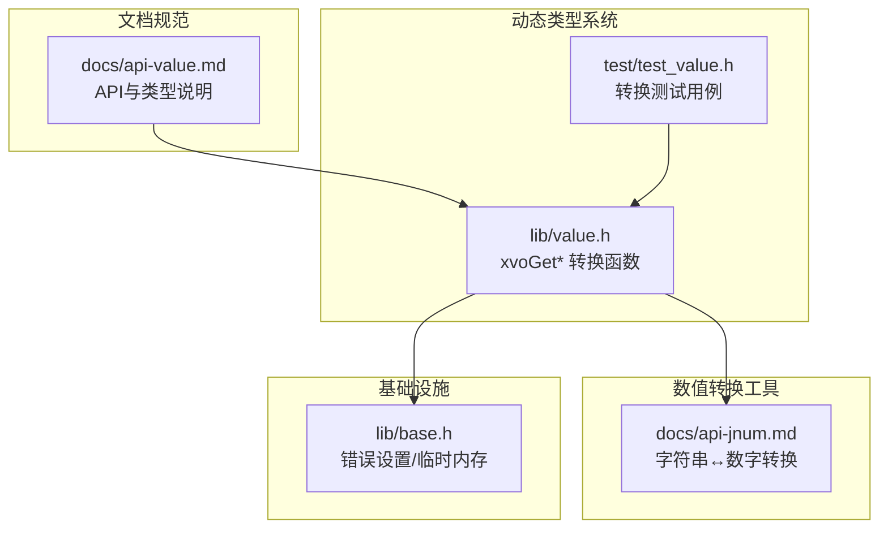
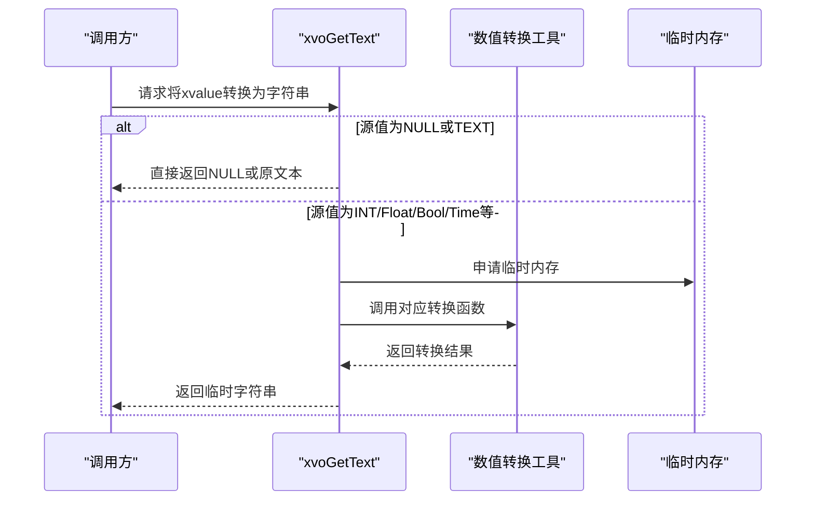
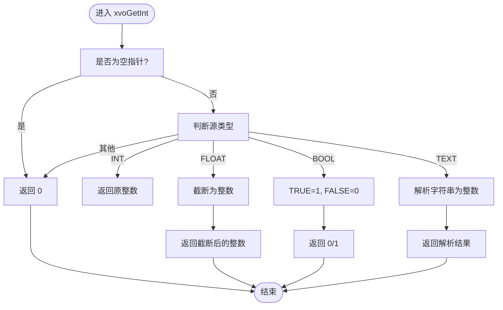
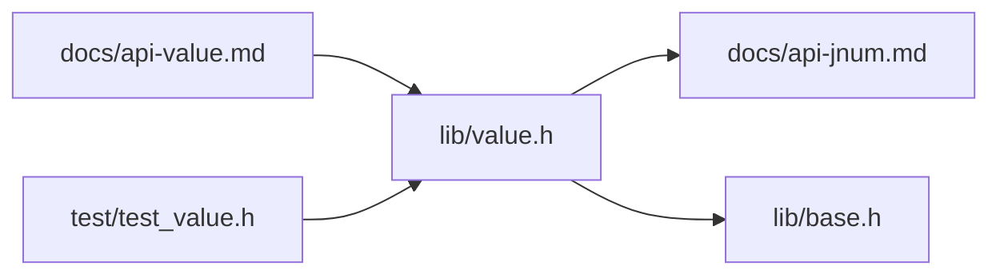

# 类型转换规则

<cite>
**本文引用的文件**
- [lib/value.h](file://lib/value.h)
- [docs/api-value.md](file://docs/api-value.md)
- [docs/api-jnum.md](file://docs/api-jnum.md)
- [lib/base.h](file://lib/base.h)
- [test/test_value.h](file://test/test_value.h)
</cite>

## 目录
1. [简介](#简介)
2. [项目结构](#项目结构)
3. [核心组件](#核心组件)
4. [架构总览](#架构总览)
5. [详细组件分析](#详细组件分析)
6. [依赖关系分析](#依赖关系分析)
7. [性能考量](#性能考量)
8. [故障排查指南](#故障排查指南)
9. [结论](#结论)
10. [附录](#附录)

## 简介
本文件系统性梳理XRT动态类型系统中的类型转换规则，聚焦于xvoGetBool、xvoGetInt、xvoGetFloat、xvoGetText等转换函数的实现逻辑、转换策略、精度处理与异常情况，并结合官方文档与测试用例，给出最佳实践、性能建议与常见错误规避方法。读者可据此在不同语言层面对XRT的动态值进行安全、可控的类型转换。

## 项目结构
围绕类型转换的核心代码位于动态类型库与文档中：
- 动态类型实现与转换函数：lib/value.h
- 动态类型API文档：docs/api-value.md
- 数值转换工具（字符串↔数字）：docs/api-jnum.md
- 错误设置与临时内存：lib/base.h
- 转换行为验证：test/test_value.h

图表来源
- [lib/value.h](file://lib/value.h#L320-L519)
- [docs/api-value.md](file://docs/api-value.md#L1-L120)
- [docs/api-jnum.md](file://docs/api-jnum.md#L1-L200)
- [lib/base.h](file://lib/base.h#L49-L101)
- [test/test_value.h](file://test/test_value.h#L600-L679)

章节来源
- [lib/value.h](file://lib/value.h#L320-L519)
- [docs/api-value.md](file://docs/api-value.md#L1-L120)
- [docs/api-jnum.md](file://docs/api-jnum.md#L1-L200)
- [lib/base.h](file://lib/base.h#L49-L101)
- [test/test_value.h](file://test/test_value.h#L600-L679)

## 核心组件
- 动态值结构与类型常量：XVO_DT_*，包含NULL、BOOL、INT、FLOAT、TEXT、TIME、POINT、FUNC、ARRAY、LIST、COLL、TABLE、CLASS、CUSTOM等。
- 转换函数族：xvoGetBool、xvoGetInt、xvoGetFloat、xvoGetText等，负责将动态值按规则转换为目标类型。
- 数值转换工具：xrtStrToI64、xrtStrToNum、xrtI64ToStr、xrtNumToStr等，支撑文本与数值之间的转换。
- 错误与临时内存：xrtSetError、xrtTempMemory等，用于错误上报与临时字符串的生命周期管理。

章节来源
- [docs/api-value.md](file://docs/api-value.md#L25-L74)
- [docs/api-jnum.md](file://docs/api-jnum.md#L145-L200)
- [lib/base.h](file://lib/base.h#L49-L101)

## 架构总览
XRT动态类型系统以统一的xvalue结构承载不同类型的值，转换函数根据目标类型与源值类型执行分支判断，必要时借助数值转换工具完成跨类型转换。非TEXT类型转换为字符串时，采用临时内存生成短生命周期字符串，避免外部释放负担。

图表来源
- [lib/value.h](file://lib/value.h#L367-L425)
- [docs/api-jnum.md](file://docs/api-jnum.md#L56-L142)
- [lib/base.h](file://lib/base.h#L49-L84)

## 详细组件分析

### xvoGetBool 转换规则
- 输入为空指针或NULL类型：返回FALSE
- 输入为BOOL类型：直接返回原值
- 输入为INT类型：非零返回TRUE，零返回FALSE
- 输入为FLOAT类型：非零返回TRUE，零返回FALSE
- 其他类型：返回TRUE

该策略体现了“非零即真”的通用布尔化原则；对于容器等复杂类型，统一视为真值，便于条件判断。

章节来源
- [lib/value.h](file://lib/value.h#L321-L334)
- [docs/api-value.md](file://docs/api-value.md#L362-L378)

### xvoGetInt 转换规则
- 输入为空指针：返回0
- 输入为INT类型：直接返回原值
- 输入为FLOAT类型：截断为整数（向零取整）
- 输入为BOOL类型：TRUE返回1，FALSE返回0
- 输入为TEXT类型：解析字符串为整数
- 其他类型：返回0

注意：浮点数截断可能导致精度损失；字符串解析失败时返回0。

章节来源
- [lib/value.h](file://lib/value.h#L335-L350)
- [docs/api-value.md](file://docs/api-value.md#L380-L396)
- [docs/api-jnum.md](file://docs/api-jnum.md#L145-L167)

### xvoGetFloat 转换规则
- 输入为空指针：返回0.0
- 输入为FLOAT类型：直接返回原值
- 输入为INT类型：整数转双精度
- 输入为BOOL类型：TRUE返回1.0，FALSE返回0.0
- 输入为TEXT类型：解析字符串为浮点数
- 其他类型：返回0.0

注意：字符串解析支持科学计数法与普通格式。

章节来源
- [lib/value.h](file://lib/value.h#L351-L366)
- [docs/api-value.md](file://docs/api-value.md#L399-L408)
- [docs/api-jnum.md](file://docs/api-jnum.md#L183-L200)

### xvoGetText 转换规则
- 输入为空指针或NULL类型：返回空字符串
- 输入为TEXT类型：直接返回原文本
- 输入为INT类型：整数转字符串
- 输入为FLOAT类型：浮点数转字符串
- 输入为BOOL类型：返回"true"或"false"
- 输入为TIME类型：解析时间序列并格式化为字符串
- 输入为POINT/FUNC/ARRAY/LIST/COLL/TABLE/CLASS/CUSTOM类型：返回描述性字符串（如"[point:...]"）

注意：非TEXT类型转换得到的字符串来自临时内存，调用方无需释放；NULL与空字符串的区分由返回值语义保证。

章节来源
- [lib/value.h](file://lib/value.h#L367-L425)
- [docs/api-value.md](file://docs/api-value.md#L410-L421)
- [docs/api-jnum.md](file://docs/api-jnum.md#L56-L142)
- [lib/base.h](file://lib/base.h#L49-L84)

### 转换流程图（以xvoGetInt为例）

图表来源
- [lib/value.h](file://lib/value.h#L335-L350)
- [docs/api-jnum.md](file://docs/api-jnum.md#L145-L167)

### 转换策略对比：隐式与显式
- 隐式转换：xvoGet*系列函数在运行时自动根据源类型选择转换路径，无需调用方显式声明类型。
- 显式转换：当需要严格控制精度或错误处理时，可先通过xvoType判断类型，再调用特定转换工具或进行二次校验。

章节来源
- [docs/api-value.md](file://docs/api-value.md#L360-L470)

### 特殊值与边界情况
- NULL输入：xvoGetBool返回FALSE；xvoGetInt/xvoGetFloat返回0/0.0；xvoGetText返回空字符串。
- TEXT解析失败：xvoGetInt/xvoGetFloat在解析失败时返回0/0.0，调用方可通过xvoGetSize或xvoType辅助判断。
- 浮点截断：xvoGetInt对浮点数进行截断（向零取整），可能丢失小数部分。
- 临时字符串：xvoGetText对非TEXT类型生成临时字符串，生命周期受临时内存管理影响，不应长期持有。

章节来源
- [lib/value.h](file://lib/value.h#L321-L425)
- [lib/base.h](file://lib/base.h#L49-L84)

### 转换函数实现要点
- 类型判断优先：先判空，再按类型分支，最后兜底返回默认值。
- 文本解析：依赖xrtStrToI64、xrtStrToNum等工具，支持多种数值格式。
- 字符串生成：使用xrtI64ToStr、xrtNumToStr与临时内存，确保返回值可用且无需外部释放。
- 容器与复杂类型：转换为描述性字符串，便于调试与日志输出。

章节来源
- [lib/value.h](file://lib/value.h#L320-L519)
- [docs/api-jnum.md](file://docs/api-jnum.md#L56-L142)
- [lib/base.h](file://lib/base.h#L49-L84)

## 依赖关系分析
- xvoGet* 依赖数值转换工具（字符串↔数字）与临时内存管理。
- 文档与测试共同约束转换行为，确保API一致性与回归稳定性。

图表来源
- [lib/value.h](file://lib/value.h#L320-L519)
- [docs/api-jnum.md](file://docs/api-jnum.md#L145-L200)
- [lib/base.h](file://lib/base.h#L49-L101)
- [docs/api-value.md](file://docs/api-value.md#L1-L120)
- [test/test_value.h](file://test/test_value.h#L600-L679)

## 性能考量
- 避免不必要的字符串转换：优先使用xvoGetInt/xvoGetFloat等原生数值接口，减少文本解析成本。
- 控制临时字符串使用：xvoGetText返回的临时字符串仅在当前上下文有效，避免跨调用传递。
- 批量转换优化：在循环中复用缓冲区或尽量减少重复转换，降低频繁申请/释放临时内存的开销。
- 类型预判：在高频路径上先用xvoType判断类型，减少分支判断次数。

## 故障排查指南
- 转换结果异常
  - 检查输入是否为NULL或未知类型，确认xvoType与xvoGetSize辅助定位。
  - 对浮点截断敏感的场景，优先使用xvoGetFloat并自行处理精度。
- 文本解析失败
  - 确认TEXT内容符合期望格式（十进制、十六进制、科学计数法等）。
  - 使用xvoGetSize与xvoGetText进行二次校验，避免误判。
- 临时字符串生命周期问题
  - 不要将xvoGetText返回的临时字符串保存至全局或跨调用，应在同一作用域内使用。
- 错误上报
  - 若涉及底层资源分配失败，可通过xrtSetError获取错误信息，便于诊断。

章节来源
- [lib/value.h](file://lib/value.h#L320-L519)
- [lib/base.h](file://lib/base.h#L88-L132)

## 结论
XRT动态类型系统通过xvoGet*系列函数提供了简洁一致的类型转换能力，覆盖基础类型与复杂类型的双向转换需求。遵循本文的转换规则、精度处理与异常处理建议，可在保证正确性的前提下获得良好的性能表现。建议在关键路径上结合类型预判与缓存策略，进一步提升系统稳定性与吞吐量。

## 附录
- 示例与边界用例参考：test/test_value.h中对整数、浮点、文本、时间等类型的转换验证。
- 数值转换工具：docs/api-jnum.md中对字符串与数字互转的详细说明。

章节来源
- [test/test_value.h](file://test/test_value.h#L600-L679)
- [docs/api-jnum.md](file://docs/api-jnum.md#L145-L200)