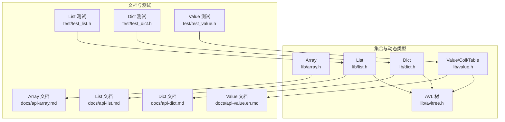
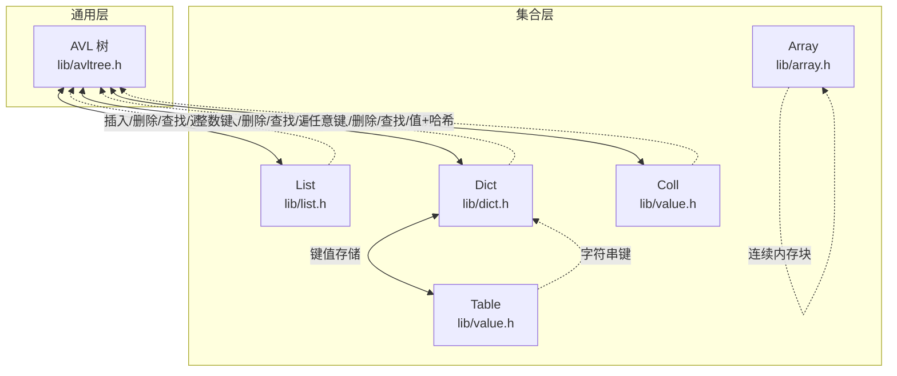
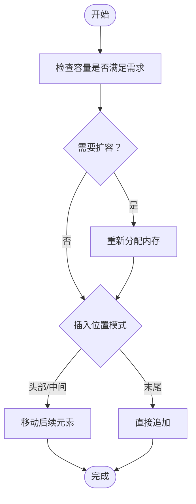
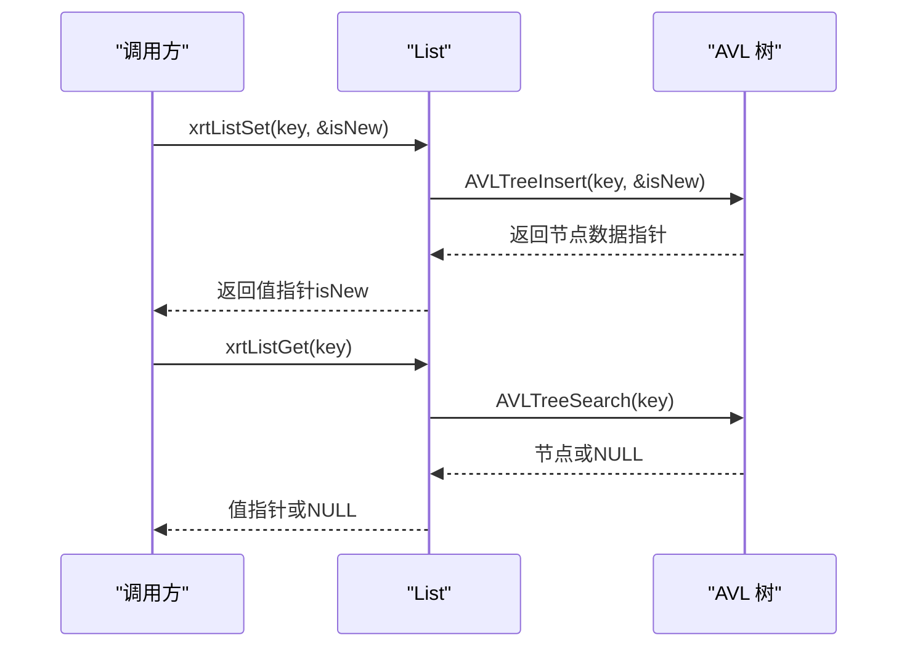
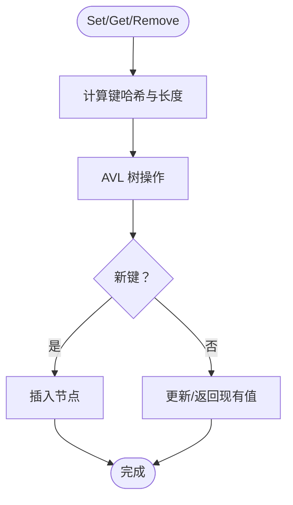
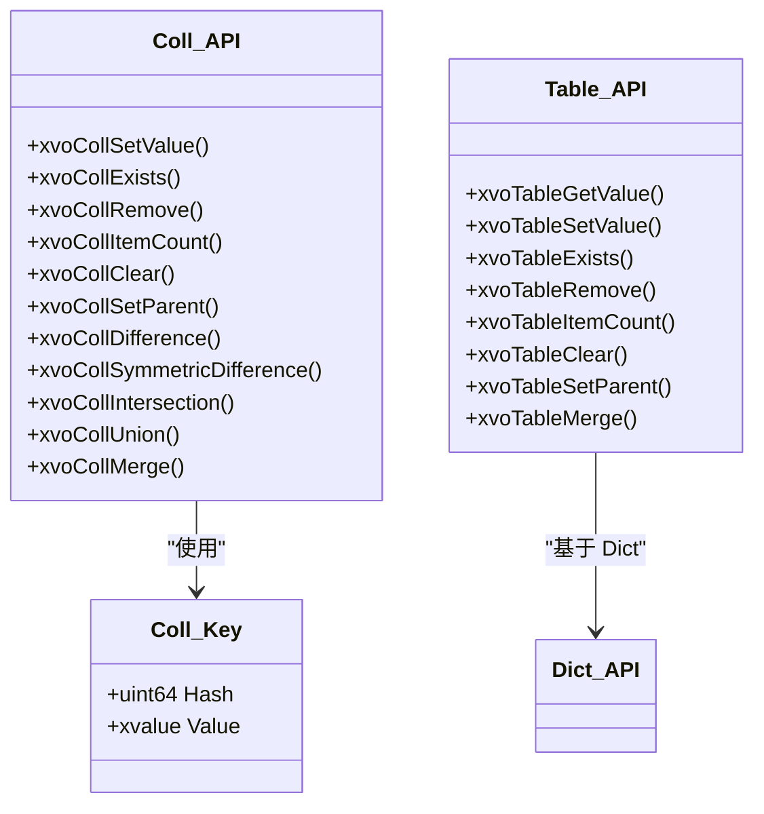
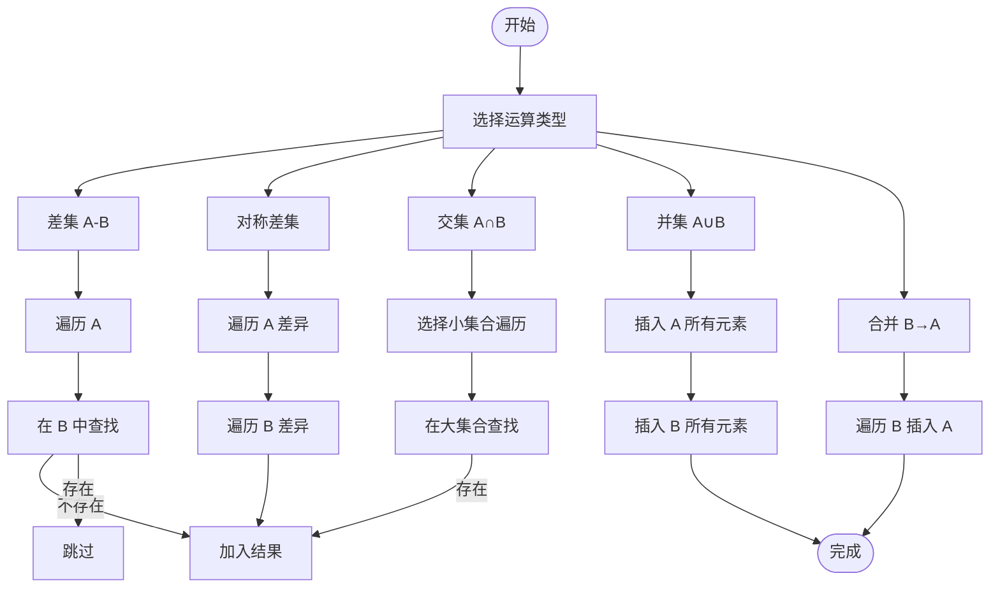
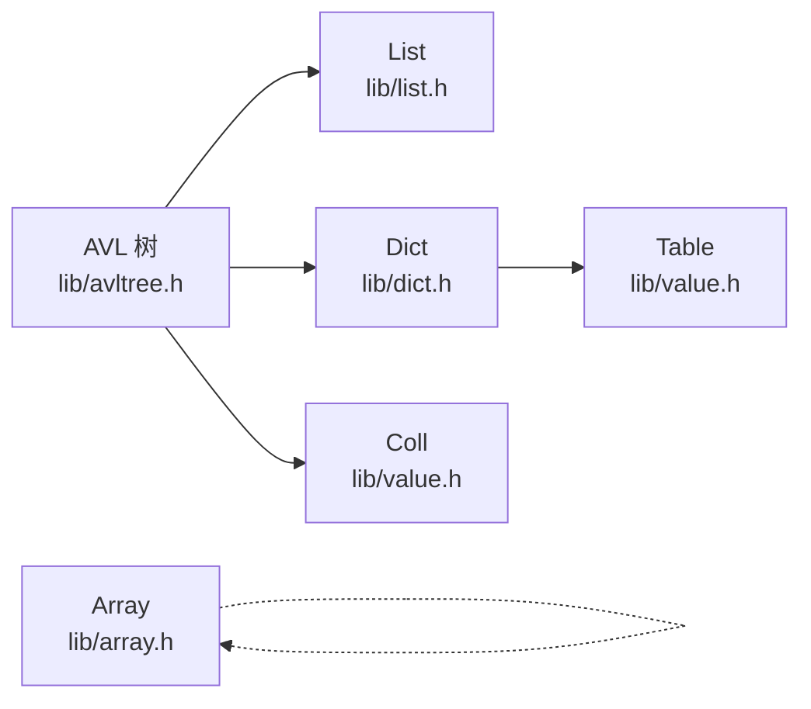

# 集合操作

<cite>
**本文引用的文件**
- [lib/array.h](file://lib/array.h)
- [lib/list.h](file://lib/list.h)
- [lib/dict.h](file://lib/dict.h)
- [lib/avltree.h](file://lib/avltree.h)
- [lib/value.h](file://lib/value.h)
- [docs/api-array.md](file://docs/api-array.md)
- [docs/api-list.md](file://docs/api-list.md)
- [docs/api-dict.md](file://docs/api-dict.md)
- [docs/api-value.en.md](file://docs/api-value.en.md)
- [xrt.h](file://xrt.h)
- [test/test_list.h](file://test/test_list.h)
- [test/test_dict.h](file://test/test_dict.h)
- [test/test_value.h](file://test/test_value.h)
</cite>

## 目录
1. [简介](#简介)
2. [项目结构](#项目结构)
3. [核心组件](#核心组件)
4. [架构总览](#架构总览)
5. [详细组件分析](#详细组件分析)
6. [依赖关系分析](#依赖关系分析)
7. [性能考量](#性能考量)
8. [故障排查指南](#故障排查指南)
9. [结论](#结论)
10. [附录](#附录)

## 简介
本文件系统化梳理 XRT 动态类型系统中的集合操作能力，覆盖以下主题：
- 集合类型：Array（数组）、List（基于 AVL 的整数键列表）、Coll（集合）、Table（基于 Dict 的键值表）
- 集合运算：差集、交集、并集、对称差集的算法实现、时间复杂度与使用场景
- 基本操作：添加、删除、查找、遍历、排序等
- 性能优化：内存管理、批量预分配、缓存键哈希、减少内存拷贝
- 并发安全：当前实现的线程安全边界与建议
- 实战示例：结合官方文档与测试用例给出典型用法

## 项目结构
围绕集合操作的相关源码与文档分布如下：
- 集合基础数据结构与操作：
  - Array：lib/array.h
  - List：lib/list.h（基于 AVL 树）
  - Dict：lib/dict.h（基于 AVL 树，作为 Table 的底层）
  - AVL 树：lib/avltree.h（通用 AVL 实现）
  - 动态类型集合 Coll/Table：lib/value.h（动态类型系统）
- API 文档与示例：
  - Array 文档：docs/api-array.md
  - List 文档：docs/api-list.md
  - Dict 文档：docs/api-dict.md
  - 动态类型集合运算文档：docs/api-value.en.md
- 接口声明：
  - xrt.h（导出 API 声明，含 Coll/Array/List/Table 的集合运算与基本操作）
- 测试用例：
  - test/test_list.h、test/test_dict.h、test/test_value.h

图表来源
- [lib/array.h](file://lib/array.h#L1-L180)
- [lib/list.h](file://lib/list.h#L1-L188)
- [lib/dict.h](file://lib/dict.h#L1-L204)
- [lib/avltree.h](file://lib/avltree.h#L1-L126)
- [lib/value.h](file://lib/value.h#L850-L1049)
- [docs/api-array.md](file://docs/api-array.md#L1-L800)
- [docs/api-list.md](file://docs/api-list.md#L1-L800)
- [docs/api-dict.md](file://docs/api-dict.md#L1-L800)
- [docs/api-value.en.md](file://docs/api-value.en.md#L800-L844)
- [test/test_list.h](file://test/test_list.h#L1-L274)
- [test/test_dict.h](file://test/test_dict.h#L1-L291)
- [test/test_value.h](file://test/test_value.h#L448-L491)

章节来源
- [lib/array.h](file://lib/array.h#L1-L180)
- [lib/list.h](file://lib/list.h#L1-L188)
- [lib/dict.h](file://lib/dict.h#L1-L204)
- [lib/avltree.h](file://lib/avltree.h#L1-L126)
- [lib/value.h](file://lib/value.h#L850-L1049)
- [docs/api-array.md](file://docs/api-array.md#L1-L800)
- [docs/api-list.md](file://docs/api-list.md#L1-L800)
- [docs/api-dict.md](file://docs/api-dict.md#L1-L800)
- [docs/api-value.en.md](file://docs/api-value.en.md#L800-L844)
- [test/test_list.h](file://test/test_list.h#L1-L274)
- [test/test_dict.h](file://test/test_dict.h#L1-L291)
- [test/test_value.h](file://test/test_value.h#L448-L491)

## 核心组件
- Array（数组）
  - 提供连续内存块管理，支持追加、插入、删除、交换、排序、安全/不安全/内联访问等
  - 关键函数：xrtArrayCreate、xrtArrayDestroy、xrtArrayInit、xrtArrayUnit、xrtArrayAlloc、xrtArrayInsert、xrtArrayAppend、xrtArraySwap、xrtArrayRemove、xrtArrayGet、xrtArrayGet_Unsafe、xrtArraySort
- List（整数键列表）
  - 基于 AVL 树，键为 int64，支持稀疏存储、自动排序遍历
  - 关键函数：xrtListCreate、xrtListDestroy、xrtListInit、xrtListUnit、xrtListSet、xrtListSetPtr、xrtListGet、xrtListGetPtr、xrtListRemove、xrtListRemovePtr、xrtListExists、xrtListCount、xrtListWalk
- Dict（字典）
  - 基于 AVL 树，键为任意二进制数据，支持值或指针存储
  - 关键函数：xrtDictCreate、xrtDictDestroy、xrtDictInit、xrtDictUnit、xrtDictSet、xrtDictSetPtr、xrtDictGet、xrtDictGetPtr、xrtDictRemove、xrtDictRemovePtr、xrtDictExists、xrtDictCount、xrtDictWalk
- Coll（集合）
  - 动态类型系统中的集合，基于 AVL 树，元素以“值+哈希”唯一标识
  - 关键函数：xvoCollSetValue、xvoCollExists、xvoCollRemove、xvoCollItemCount、xvoCollClear、xvoCollSetParent、xvoCollDifference、xvoCollSymmetricDifference、xvoCollIntersection、xvoCollUnion、xvoCollMerge
- Table（表）
  - 动态类型系统中的表，基于 Dict（xrtDict）实现键值存储
  - 关键函数：xvoTableGetValue、xvoTableSetValue、xvoTableExists、xvoTableRemove、xvoTableItemCount、xvoTableClear、xvoTableSetParent、xvoTableMerge

章节来源
- [lib/array.h](file://lib/array.h#L5-L180)
- [lib/list.h](file://lib/list.h#L18-L188)
- [lib/dict.h](file://lib/dict.h#L29-L204)
- [lib/value.h](file://lib/value.h#L898-L1049)
- [lib/value.h](file://lib/value.h#L1113-L1286)
- [xrt.h](file://xrt.h#L2067-L2142)

## 架构总览
XRT 的集合操作以“通用 AVL 树”为核心，不同集合类型在其之上提供语义化的 API：
- Array：面向连续索引的结构体数组，强调内存连续与随机访问
- List：面向整数键的稀疏集合，强调 O(log n) 的键值操作与有序遍历
- Dict：面向任意二进制键的键值存储，作为 Table 的底层
- Coll：面向动态类型的集合，元素以“类型+值”的哈希作为唯一标识
- Table：面向字符串键的表，提供键值读写与合并

图表来源
- [lib/avltree.h](file://lib/avltree.h#L1-L126)
- [lib/array.h](file://lib/array.h#L1-L180)
- [lib/list.h](file://lib/list.h#L1-L188)
- [lib/dict.h](file://lib/dict.h#L1-L204)
- [lib/value.h](file://lib/value.h#L850-L1049)
- [lib/value.h](file://lib/value.h#L1113-L1286)

## 详细组件分析

### Array（数组）
- 数据结构与内存管理
  - xarray_struct 包含内存指针、元素大小、当前计数、已分配容量、扩容步长
  - 支持预分配 xrtArrayAlloc 与裁剪；清空 xrtArrayUnit；销毁 xrtArrayDestroy
- 基本操作
  - 插入：xrtArrayInsert（中间插入/追加模式），涉及内存移动
  - 追加：xrtArrayAppend（封装插入到末尾）
  - 删除：xrtArrayRemove（中段删除需移动后续元素）
  - 交换：xrtArraySwap（临时缓冲交换）
  - 访问：xrtArrayGet（安全）、xrtArrayGet_Unsafe（不安全）、xrtArrayGet_Inline（内联）
  - 排序：xrtArraySort（基于 qsort 的比较函数）
- 复杂度与特性
  - 插入/删除（中间）：O(n)
  - 访问/交换：O(1)
  - 排序：O(n log n)
  - 内存连续，适合大量随机访问与批量处理

图表来源
- [lib/array.h](file://lib/array.h#L76-L105)
- [lib/array.h](file://lib/array.h#L130-L150)

章节来源
- [lib/array.h](file://lib/array.h#L5-L180)
- [docs/api-array.md](file://docs/api-array.md#L65-L700)

### List（整数键列表）
- 数据结构
  - 内部为 AVL 树，节点存储 int64 键与用户数据
  - 支持稀疏存储、按键升序遍历
- 基本操作
  - 设置/获取/删除：xrtListSet、xrtListGet、xrtListRemove
  - 指针值专用：xrtListSetPtr、xrtListGetPtr、xrtListRemovePtr
  - 存在性：xrtListExists
  - 计数与遍历：xrtListCount、xrtListWalk
- 复杂度与特性
  - Set/Get/Remove：O(log n)
  - Walk：O(n)
  - 支持负索引与跳跃索引，内存高效

图表来源
- [lib/list.h](file://lib/list.h#L49-L121)
- [lib/avltree.h](file://lib/avltree.h#L62-L90)

章节来源
- [lib/list.h](file://lib/list.h#L18-L188)
- [docs/api-list.md](file://docs/api-list.md#L112-L793)
- [test/test_list.h](file://test/test_list.h#L20-L274)

### Dict（字典）
- 数据结构
  - Dict_Key 包含键指针、长度、哈希；节点存储键与用户数据
  - 支持可选内存池管理键内存
- 基本操作
  - Set/Get/Remove：xrtDictSet、xrtDictGet、xrtDictRemove
  - 指针值：xrtDictSetPtr、xrtDictGetPtr、xrtDictRemovePtr
  - 存在性与计数：xrtDictExists、xrtDictCount
  - 遍历：xrtDictWalk（中序遍历）
- 复杂度与特性
  - Set/Get/Remove：O(log n)
  - Walk：O(n)
  - 键为任意二进制数据，适合字符串键、复合键

图表来源
- [lib/dict.h](file://lib/dict.h#L4-L25)
- [lib/dict.h](file://lib/dict.h#L29-L153)
- [lib/avltree.h](file://lib/avltree.h#L62-L105)

章节来源
- [lib/dict.h](file://lib/dict.h#L29-L204)
- [docs/api-dict.md](file://docs/api-dict.md#L150-L727)
- [test/test_dict.h](file://test/test_dict.h#L20-L291)

### Coll（集合）与 Table（表）
- Coll（集合）
  - 基于 AVL 树，元素以“类型+值”的哈希作为唯一标识
  - 关键函数：xvoCollSetValue、xvoCollExists、xvoCollRemove、xvoCollItemCount、xvoCollClear、xvoCollSetParent、xvoCollDifference、xvoCollSymmetricDifference、xvoCollIntersection、xvoCollUnion、xvoCollMerge
  - 哈希构造与比较：MAKE_COLL_KEY、Coll_CompProc
- Table（表）
  - 基于 Dict（xrtDict）实现，键为字符串，值为动态类型
  - 关键函数：xvoTableGetValue、xvoTableSetValue、xvoTableExists、xvoTableRemove、xvoTableItemCount、xvoTableClear、xvoTableSetParent、xvoTableMerge

图表来源
- [lib/value.h](file://lib/value.h#L861-L894)
- [lib/value.h](file://lib/value.h#L898-L1049)
- [lib/value.h](file://lib/value.h#L1113-L1286)
- [xrt.h](file://xrt.h#L2118-L2142)

章节来源
- [lib/value.h](file://lib/value.h#L861-L1049)
- [lib/value.h](file://lib/value.h#L1113-L1286)
- [docs/api-value.en.md](file://docs/api-value.en.md#L800-L844)
- [xrt.h](file://xrt.h#L2067-L2142)

### 集合运算（差集、交集、并集、对称差集）
- 差集（A - B）：遍历 A，若 B 中不存在则加入结果
- 对称差集：遍历 A 的差异 + 遍历 B 的差异
- 交集：遍历较小集合，在较大集合中查找并收集
- 并集：将两个集合的元素分别插入结果集合
- 合并：将另一个集合的元素并入目标集合（就地修改）

图表来源
- [lib/value.h](file://lib/value.h#L914-L1035)
- [docs/api-value.en.md](file://docs/api-value.en.md#L815-L832)

章节来源
- [lib/value.h](file://lib/value.h#L914-L1035)
- [docs/api-value.en.md](file://docs/api-value.en.md#L815-L832)
- [test/test_value.h](file://test/test_value.h#L448-L491)

## 依赖关系分析
- Array 与 List/Dict/Value 无直接耦合，独立管理内存与数据
- List/Dict 均依赖 AVL 树实现，共享统一的插入/删除/查找/遍历逻辑
- Coll/Table 基于 AVL 树与 Dict，形成“值+哈希”与“字符串键”的差异化语义
- xrt.h 汇总导出各集合类型的 API 声明，便于上层应用统一调用

图表来源
- [lib/avltree.h](file://lib/avltree.h#L1-L126)
- [lib/list.h](file://lib/list.h#L1-L188)
- [lib/dict.h](file://lib/dict.h#L1-L204)
- [lib/value.h](file://lib/value.h#L850-L1049)
- [lib/value.h](file://lib/value.h#L1113-L1286)
- [lib/array.h](file://lib/array.h#L1-L180)

章节来源
- [lib/avltree.h](file://lib/avltree.h#L1-L126)
- [lib/list.h](file://lib/list.h#L1-L188)
- [lib/dict.h](file://lib/dict.h#L1-L204)
- [lib/value.h](file://lib/value.h#L850-L1049)
- [lib/value.h](file://lib/value.h#L1113-L1286)
- [lib/array.h](file://lib/array.h#L1-L180)

## 性能考量
- 时间复杂度
  - Array：中间插入/删除 O(n)，访问/交换 O(1)，排序 O(n log n)
  - List/Dict/Coll：Set/Get/Remove O(log n)，Walk O(n)
  - Table：基于 Dict，复杂度一致
- 内存管理
  - 预分配：Array 使用增量步长扩容，减少频繁 realloc
  - 缓存键哈希：Dict/Coll 使用预计算哈希，避免重复计算
  - 指针值：List/Dict/Table 的 SetPtr/GetPtr/RemovePtr 避免深拷贝
- 并发安全
  - 当前实现未提供内置互斥锁；多线程环境下应自行加锁或采用无共享设计
- 优化建议
  - 批量操作：先 xrtArrayAlloc 预估容量，再批量插入
  - 避免重复哈希：复用 Dict_Key 或使用 xvoCollSetValueWithKey
  - 减少引用计数开销：必要时使用 bColloc=false（按需引用）
  - 遍历优化：优先使用内联访问（xrtArrayGet_Inline）或回调遍历（xrtListWalk/xrtDictWalk）

[本节为通用指导，无需特定文件引用]

## 故障排查指南
- Array
  - 索引越界：使用 xrtArrayGet（安全）而非 xrtArrayGet_Unsafe
  - 内存泄漏：确保 xrtArrayDestroy 前已释放元素内部动态内存
- List
  - 键不存在：xrtListExists 检查后再访问；遍历时注意回调返回值可中断
  - 指针值释放：使用 xrtListRemovePtr 后需手动释放返回的指针
- Dict
  - 键内存管理：启用内存池时注意键生命周期；销毁前释放值指针
  - 哈希冲突：Dict 使用哈希+键值比较，冲突概率低但需保证键唯一性
- Coll/Table
  - 元素去重：Coll 以“值+哈希”判重；注意类型与值完全一致才视为相同
  - 合并冲突：TableMerge 支持覆盖或跳过，根据业务选择 bReWrite

章节来源
- [lib/array.h](file://lib/array.h#L152-L166)
- [lib/list.h](file://lib/list.h#L141-L149)
- [lib/dict.h](file://lib/dict.h#L135-L153)
- [lib/value.h](file://lib/value.h#L1040-L1073)
- [lib/value.h](file://lib/value.h#L1197-L1214)

## 结论
XRT 的集合体系以 AVL 树为核心，提供了从数组到稀疏列表、从字典到动态类型的完整能力谱系。对于集合运算，Coll 提供了完善的差集、交集、并集、对称差集与合并操作，具备良好的扩展性与性能表现。结合预分配、键哈希缓存与指针值存储等优化手段，可在多数场景下获得稳定且高效的运行效果。

[本节为总结性内容，无需特定文件引用]

## 附录
- 示例与实战
  - Array 批量处理与排序：参见 docs/api-array.md 中的示例
  - List 稀疏数组与双向映射：参见 docs/api-list.md 中的示例
  - Dict 配置管理与对象缓存：参见 docs/api-dict.md 中的示例
  - Coll 集合运算测试：参见 test/test_value.h 中的交/并/差/对称差测试
- 相关接口声明
  - xrt.h 中导出的 Array/List/Table/Coll 相关 API 声明与便捷宏

章节来源
- [docs/api-array.md](file://docs/api-array.md#L703-L800)
- [docs/api-list.md](file://docs/api-list.md#L635-L793)
- [docs/api-dict.md](file://docs/api-dict.md#L731-L800)
- [test/test_value.h](file://test/test_value.h#L448-L491)
- [xrt.h](file://xrt.h#L2067-L2142)