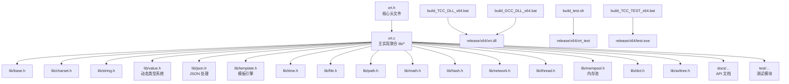
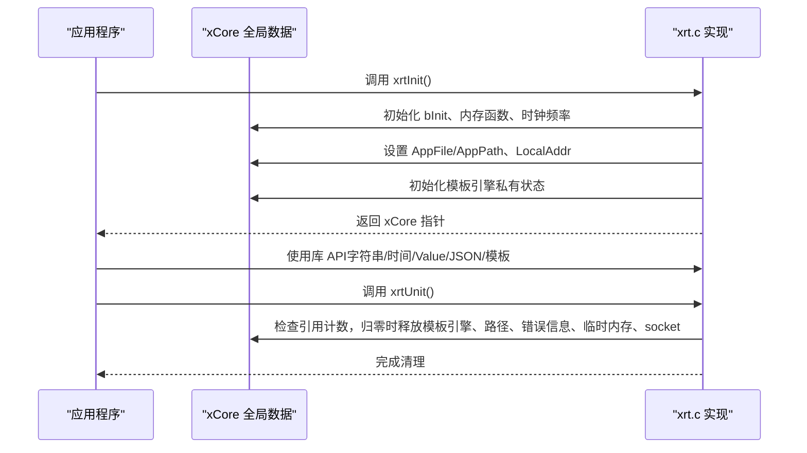
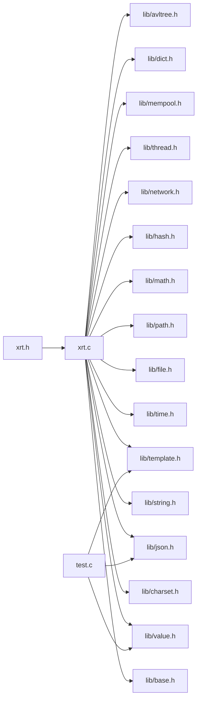

# 快速开始

<cite>
**本文引用的文件**
- [README.md](file://README.md)
- [xrt.h](file://xrt.h)
- [xrt.c](file://xrt.c)
- [build.sh](file://build.sh)
- [build_TCC_DLL_x64.bat](file://build_TCC_DLL_x64.bat)
- [build_GCC_DLL_x64.bat](file://build_GCC_DLL_x64.bat)
- [build_TCC_TEST_x64.bat](file://build_TCC_TEST_x64.bat)
- [build_test.sh](file://build_test.sh)
- [test.c](file://test.c)
- [lib/value.h](file://lib/value.h)
- [test/test_value.h](file://test/test_value.h)
- [test/test_json.h](file://test/test_json.h)
- [test/test_template.h](file://test/test_template.h)
</cite>

## 目录
1. [简介](#简介)
2. [项目结构](#项目结构)
3. [核心组件](#核心组件)
4. [架构总览](#架构总览)
5. [详细组件分析](#详细组件分析)
6. [依赖关系分析](#依赖关系分析)
7. [性能注意事项](#性能注意事项)
8. [故障排查指南](#故障排查指南)
9. [结论](#结论)
10. [附录](#附录)

## 简介
XRT 是一个轻量级、高性能、功能完备的 C 语言运行时库，提供现代化的基础设施能力。它采用单头文件设计，零外部依赖，支持跨平台编译，并提供 32 个功能模块与 2320 行 API 声明。其核心特性包括：
- 零依赖设计与单头文件架构
- 32 模块化子库与全平台支持
- 四大编译器兼容（TCC、GCC、Clang、MSVC）
- 极致性能优化（内存池、引用计数、内联优化）
- 16 种动态类型系统与智能内存管理
- 企业级模板引擎与内置 JSON 处理

## 项目结构
XRT 的项目组织清晰，主要由以下部分组成：
- 核心头文件与实现：xrt.h（API 声明）、xrt.c（聚合实现）
- 子库模块：lib/ 下的各功能模块头文件
- 文档：docs/ 下的 API 文档
- 测试：test/ 下的各模块测试文件
- 构建脚本：Windows 批处理与 Linux/macOS Shell 脚本
- 发行产物：release/ 下的编译输出

图表来源
- [xrt.h](file://xrt.h#L1-L200)
- [xrt.c](file://xrt.c#L54-L84)
- [build_TCC_DLL_x64.bat](file://build_TCC_DLL_x64.bat#L1-L2)
- [build_GCC_DLL_x64.bat](file://build_GCC_DLL_x64.bat#L1-L2)
- [build_test.sh](file://build_test.sh#L1-L6)
- [build_TCC_TEST_x64.bat](file://build_TCC_TEST_x64.bat#L1-L11)

章节来源
- [README.md](file://README.md#L355-L398)

## 核心组件
- 初始化与清理：xrtInit()/xrtUnit() 提供全局状态初始化与资源释放
- 内存管理：xrtMalloc/xrtFree/xrtTempMemory 提供基础内存分配与环形临时内存
- 字符串与字符集：统一的字符串处理与 UTF-8/16/32 转换
- 时间处理：xrtNow/xrtTimeToStr/xrtDateAdd 等时间计算与格式化
- 动态类型系统：Value 类型（16 种），支持数组、列表、集合、表等容器
- JSON 处理：SAX 模式解析与生成，支持注释、尾逗号、十六进制等
- 模板引擎：变量替换、条件、循环、子模板、脚本扩展等语法

章节来源
- [xrt.h](file://xrt.h#L188-L193)
- [xrt.h](file://xrt.h#L211-L227)
- [xrt.h](file://xrt.h#L253-L284)
- [xrt.h](file://xrt.h#L456-L646)
- [xrt.h](file://xrt.h#L649-L769)
- [xrt.h](file://xrt.h#L800-L840)
- [lib/value.h](file://lib/value.h#L100-L200)

## 架构总览
XRT 的核心初始化流程如下：
- 应用调用 xrtInit() 初始化全局状态
- 设置内存函数、随机数、时钟频率、应用路径、本机 IP、模板引擎私有初始化
- 应用使用完成后调用 xrtUnit()，在引用计数归零时释放资源

图表来源
- [xrt.c](file://xrt.c#L87-L186)
- [xrt.c](file://xrt.c#L190-L226)

章节来源
- [xrt.c](file://xrt.c#L87-L186)
- [xrt.c](file://xrt.c#L190-L226)

## 详细组件分析

### 安装与编译（从 GitHub 克隆到构建）
- 克隆仓库与进入目录
- Windows 平台
  - 使用 TCC 编译 64 位测试程序：build_TCC_TEST_x64.bat
  - 使用 GCC 编译 64 位 DLL：build_GCC_DLL_x64.bat
- Linux/macOS 平台
  - 编译测试程序：bash build_test.sh

章节来源
- [README.md](file://README.md#L203-L229)
- [build_TCC_TEST_x64.bat](file://build_TCC_TEST_x64.bat#L1-L11)
- [build_GCC_DLL_x64.bat](file://build_GCC_DLL_x64.bat#L1-L2)
- [build_test.sh](file://build_test.sh#L1-L6)

### 基础使用示例（内存管理、字符串、时间）
- 初始化库：xrtInit()
- 字符串处理：xrtReplace、xrtFree
- 时间处理：xrtNow、xrtTimeToStr
- 资源清理：xrtUnit()

章节来源
- [README.md](file://README.md#L230-L256)

### 动态类型系统（Value）基础示例
- 创建数组与表：xvoCreateArray、xvoCreateTable
- 添加元素：xvoArrayAppend*、xvoTableSet*
- 读取元素：xvoTableGetText
- 引用计数：xvoAddRef、xvoUnref
- 资源释放：xrtUnit()

章节来源
- [README.md](file://README.md#L258-L288)
- [lib/value.h](file://lib/value.h#L32-L96)
- [lib/value.h](file://lib/value.h#L100-L200)

### JSON 处理基础示例
- 解析 JSON：xrtParseJSON 或 xrtParseJSON_File
- 生成 JSON：xrtStringifyJSON 或 xrtStringifyJSON_File
- 读取字段：xvoTableGetText
- 释放资源：xvoUnref、xrtFree

章节来源
- [README.md](file://README.md#L290-L321)
- [test/test_json.h](file://test/test_json.h#L4-L102)

### 模板引擎基础示例
- 创建变量表：xvoCreateTable、xvoTableSetText/SetInt
- 解析模板：xteParse
- 生成输出：xteMake
- 释放资源：xteParseFree、xvoUnref、xrtFree

章节来源
- [README.md](file://README.md#L323-L351)
- [test/test_template.h](file://test/test_template.h#L4-L200)

## 依赖关系分析
- xrt.c 聚合所有 lib/* 子库头文件，形成统一实现
- xrt.h 定义全局数据结构与 API 声明
- 测试入口 test.c 引入各模块测试头文件，演示 API 使用
- 构建脚本分别针对 TCC/GCC/Shell 环境生成 DLL/可执行文件

图表来源
- [xrt.c](file://xrt.c#L54-L84)
- [test.c](file://test.c#L11-L43)

章节来源
- [xrt.c](file://xrt.c#L54-L84)
- [test.c](file://test.c#L11-L43)

## 性能注意事项
- 内存池与引用计数：Value 类型采用 26 位引用计数，配合多级内存池，降低频繁分配/释放带来的开销
- 内联优化：关键路径提供 Inline 版本，减少函数调用开销
- 高效哈希与平衡树：nmhash32x/rapidhash 与 AVL 树，保证查找/插入/删除的 O(log n) 复杂度
- 临时内存：32 槽位环形自动释放，避免函数内临时值的显式释放

章节来源
- [README.md](file://README.md#L61-L69)
- [lib/value.h](file://lib/value.h#L32-L96)

## 故障排查指南
- 初始化失败或未生效：确认调用了 xrtInit() 并在程序退出时调用 xrtUnit()
- 内存泄漏：使用 xrtFree 释放由库分配的字符串；对于 Value 类型，使用 xvoUnref 释放引用
- 编码问题：使用 xrtUTF8to16/xrtUTF16to8 等接口进行字符集转换；必要时使用 xrtDetectCharset 判断编码
- 时间解析异常：使用 xrtStrToTime 或 xrtTimeParse 进行智能解析；注意格式占位符与空格处理
- JSON 解析错误：检查输入是否符合支持的格式（注释、尾逗号、十六进制、特殊浮点数等）
- 模板渲染异常：确认模板语法正确，变量路径存在且类型匹配

章节来源
- [xrt.h](file://xrt.h#L229-L236)
- [xrt.h](file://xrt.h#L253-L284)
- [xrt.h](file://xrt.h#L554-L646)
- [test/test_json.h](file://test/test_json.h#L4-L102)
- [test/test_template.h](file://test/test_template.h#L4-L200)

## 结论
通过本快速开始指南，您可以在最短时间内完成 XRT 的安装与编译，并掌握内存管理、字符串处理、时间处理等基础用法。同时，借助动态类型系统、JSON 处理与模板引擎的示例，您可以快速构建实用的工具与服务端应用。建议在实际项目中结合测试样例进一步探索各模块的高级特性。

## 附录

### 构建选项与平台支持
- 编译器支持：TCC（毫秒级编译）、GCC、Clang、MSVC
- 平台支持：Windows、Linux、macOS（x86/x64/ARM64）
- 构建目标：DLL、OBJ、TEST

章节来源
- [README.md](file://README.md#L402-L429)

### API 快速参考（摘自 README）
- 内存管理：xrtMalloc、xrtCalloc、xrtRealloc、xrtFree、xrtTempMemory
- 字符集转换：xrtUTF8to16、xrtUTF16to8、xrtConvCharset、xrtIsUTF8、xrtDetectCharset
- 字符串操作：xrtCopyStr、xrtFindStr、xrtReplace、xrtSplit、xrtFormat、xrtTrim、xrtBase64Encode/Decode
- 文件操作：xrtOpen、xrtClose、xrtFileReadAll、xrtFileWriteAll、xrtDirScan、xrtDirCreateAll
- 时间处理：xrtNow、xrtDateSerial、xrtDateAdd、xrtTimeToStr、xrtDateDiff
- 动态类型：xvoCreate*、xvoAddRef、xvoUnref、xvoArray*/xvoTable* 等
- JSON：xrtParseJSON、xrtParseJSON_File、xrtStringifyJSON、xrtStringifyJSON_File
- 模板引擎：xteParse、xteMake、xteResolvePath、xteExprEvalBool

章节来源
- [README.md](file://README.md#L431-L536)