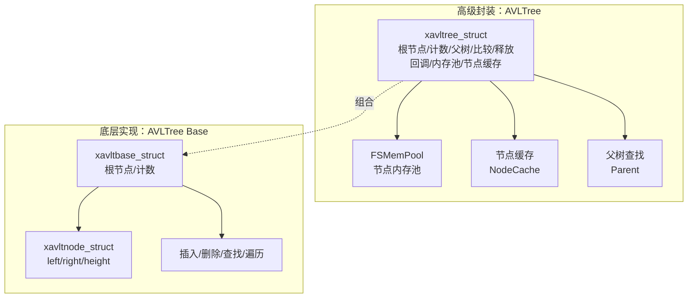
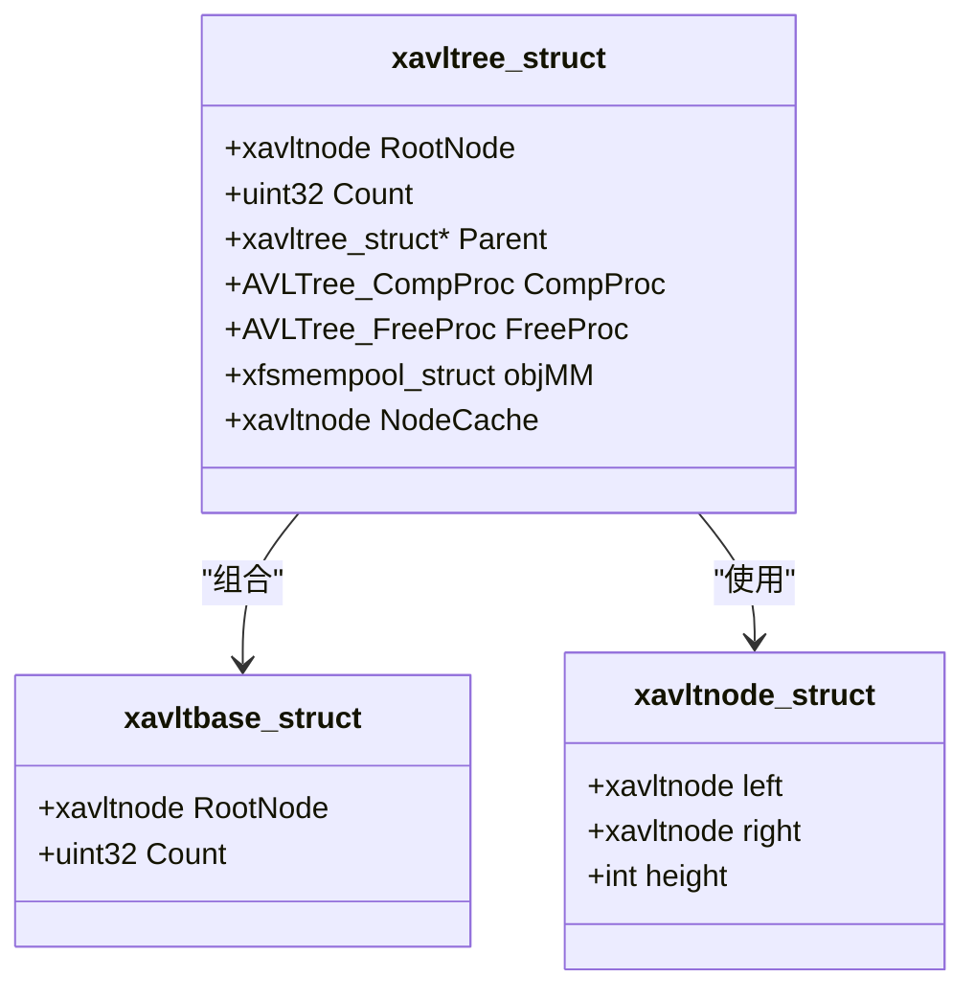
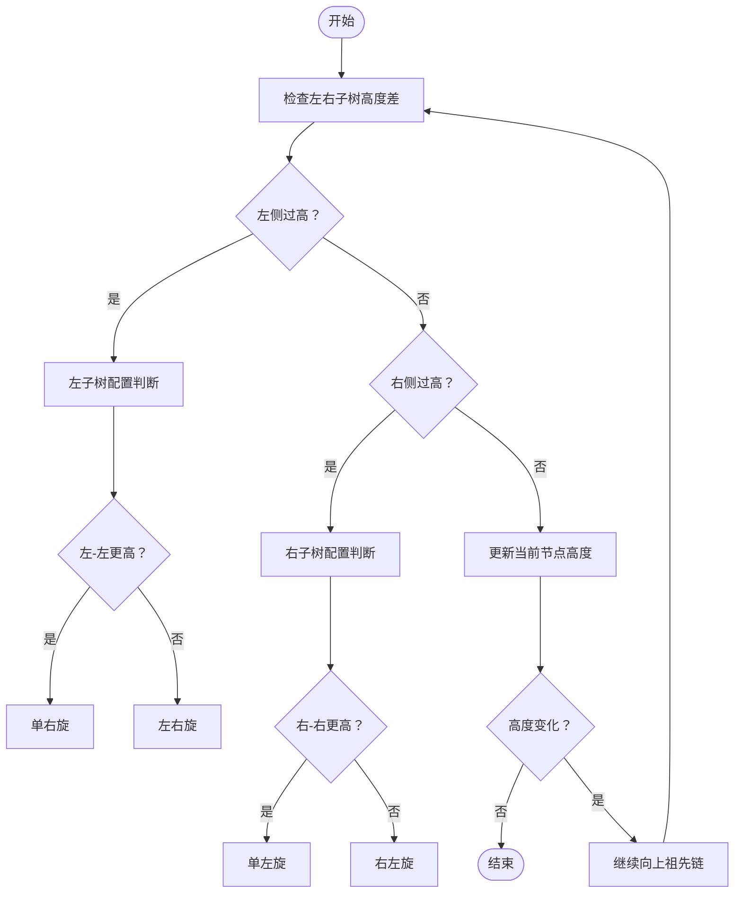
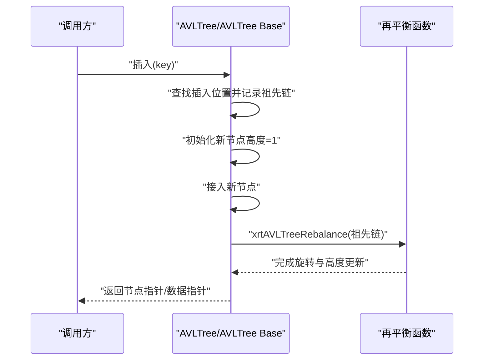
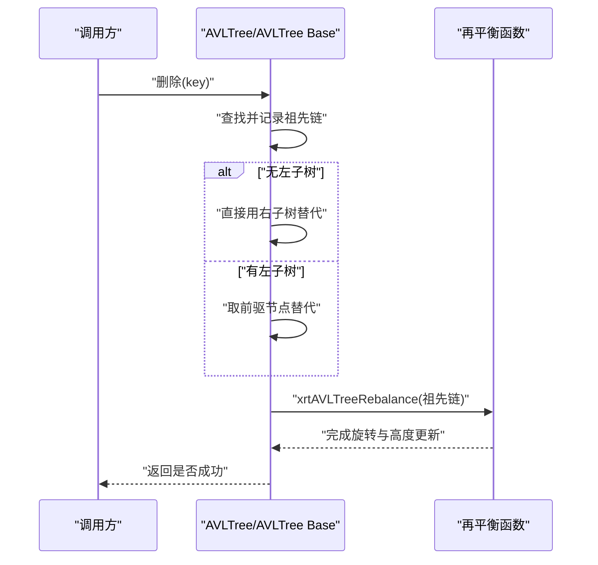
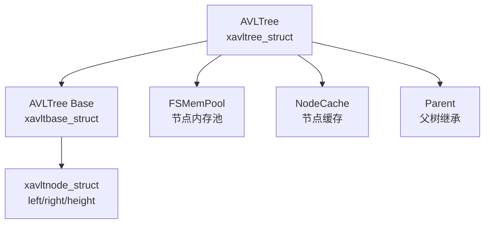

# AVL平衡树

<cite>
**本文引用的文件**
- [lib/avltree.h](file://lib/avltree.h)
- [lib/avltree_base.h](file://lib/avltree_base.h)
- [docs/api-avltree.md](file://docs/api-avltree.md)
- [docs/api-avltree-base.md](file://docs/api-avltree-base.md)
- [test/test_avltree.h](file://test/test_avltree.h)
- [lib/base.h](file://lib/base.h)
- [lib/mempool.h](file://lib/mempool.h)
</cite>

## 目录
1. [简介](#简介)
2. [项目结构](#项目结构)
3. [核心组件](#核心组件)
4. [架构概览](#架构概览)
5. [详细组件分析](#详细组件分析)
6. [依赖分析](#依赖分析)
7. [性能考量](#性能考量)
8. [故障排查指南](#故障排查指南)
9. [结论](#结论)
10. [附录](#附录)

## 简介
本文件系统性梳理XRT库中的AVL平衡树模块，覆盖AVL树的平衡算法与实现原理、节点高度计算、旋转操作（左旋、右旋、左右旋、右左旋）、插入与删除时的平衡维护机制、API使用方法、性能特征分析，以及典型应用场景与优化调试技巧。文档同时对比“AVLTree”（高级封装）与“AVLTree Base”（底层实现）的差异，帮助读者在不同场景下做出合适的选择。

## 项目结构
AVL树模块由两层组成：
- AVLTree Base：提供底层的自平衡二叉搜索树操作，用户自行管理节点内存，支持插入、删除、查找、遍历与迭代器。
- AVLTree：在AVLTree Base之上，集成FSMemPool自动内存管理、节点缓存、父树继承查找与节点释放回调，简化使用。

图表来源
- [lib/avltree.h](file://lib/avltree.h#L59-L68)
- [lib/avltree_base.h](file://lib/avltree_base.h#L78-L89)
- [docs/api-avltree.md](file://docs/api-avltree.md#L36-L47)
- [docs/api-avltree-base.md](file://docs/api-avltree-base.md#L24-L34)

章节来源
- [lib/avltree.h](file://lib/avltree.h#L5-L126)
- [lib/avltree_base.h](file://lib/avltree_base.h#L78-L110)
- [docs/api-avltree.md](file://docs/api-avltree.md#L23-L49)
- [docs/api-avltree-base.md](file://docs/api-avltree-base.md#L24-L34)

## 核心组件
- 节点结构与树结构
  - 节点：包含左右子节点指针与高度字段；用户数据紧随其后。
  - 树：包含根节点、节点计数、比较函数、可选释放回调、FSMemPool内存池、节点缓存、父树指针。
- 平衡维护
  - 插入/删除后沿祖先链向上更新高度并进行再平衡，确保任意节点左右子树高度差不超过1。
- API族
  - AVLTree：创建/销毁、初始化/释放、插入（带新节点标记）、删除、查找、遍历、迭代器。
  - AVLTree Base：插入/删除/查找、遍历、宏工具（节点数据与基址互转、根节点数据访问、初始化/清空）。

章节来源
- [lib/avltree_base.h](file://lib/avltree_base.h#L78-L110)
- [lib/avltree.h](file://lib/avltree.h#L59-L68)
- [docs/api-avltree.md](file://docs/api-avltree.md#L51-L82)
- [docs/api-avltree-base.md](file://docs/api-avltree-base.md#L76-L120)

## 架构概览
AVLTree在AVLTree Base之上增加了自动内存管理与便捷功能：
- 自动内存管理：FSMemPool负责节点分配与回收，减少用户负担。
- 节点缓存：连续插入时复用缓存节点，降低分配开销。
- 继承树：支持Parent指针，未命中时在父树中继续查找。
- 释放回调：删除节点时可触发自定义释放逻辑。

图表来源
- [lib/avltree_base.h](file://lib/avltree_base.h#L78-L110)
- [lib/avltree.h](file://lib/avltree.h#L59-L68)

章节来源
- [lib/avltree.h](file://lib/avltree.h#L5-L126)
- [docs/api-avltree.md](file://docs/api-avltree.md#L36-L47)

## 详细组件分析

### 平衡算法与旋转机制
AVL树通过“祖先链+高度更新+旋转”维持平衡。插入/删除后，沿祖先链自底向上检查每个节点的左右子树高度差，必要时执行旋转并更新高度。

- 左侧过高（右-左高差 < -1）
  - 若左子树的左子树高度 ≥ 右子树高度：执行单右旋。
  - 否则：先左子树右旋，再整体右旋（左右旋）。
- 右侧过高（右-左高差 > 1）
  - 若右子树的右子树高度 ≥ 左子树高度：执行单左旋。
  - 否则：先右子树左旋，再整体左旋（右左旋）。
- 无需旋转：仅更新当前节点高度，若高度不变可提前停止。

图表来源
- [lib/avltree_base.h](file://lib/avltree_base.h#L5-L134)

章节来源
- [lib/avltree_base.h](file://lib/avltree_base.h#L5-L134)

### 节点高度计算与维护
- 叶子节点高度为1。
- 非空节点高度 = max(左子树高度, 右子树高度) + 1。
- 插入/删除后沿祖先链逐级更新高度，遇到高度不变即停止（剪枝优化）。

章节来源
- [lib/avltree_base.h](file://lib/avltree_base.h#L12-L13)

### 旋转操作详解
- 单右旋（LL型）：适用于左子树的左子树更高。
- 单左旋（RR型）：适用于右子树的右子树更高。
- 左右旋（LR型）：先左子树右旋，再整体右旋。
- 右左旋（RL型）：先右子树左旋，再整体左旋。

章节来源
- [lib/avltree_base.h](file://lib/avltree_base.h#L27-L68)
- [lib/avltree_base.h](file://lib/avltree_base.h#L81-L120)

### 插入流程与平衡调整
- 查找插入位置（沿比较函数方向移动），记录祖先链。
- 初始化新节点高度为1，接入树中。
- 调用再平衡函数，沿祖先链自底向上更新高度并旋转。
- 更新计数。

图表来源
- [lib/avltree_base.h](file://lib/avltree_base.h#L137-L170)

章节来源
- [lib/avltree_base.h](file://lib/avltree_base.h#L137-L170)

### 删除流程与平衡恢复
- 查找待删节点，记录祖先链。
- 若无左子树：直接用右子树替代；否则：在左子树中取“前驱节点”（右链最右）替代当前位置，并调整祖先链。
- 调用再平衡函数，沿祖先链自底向上更新高度并旋转。
- 更新计数。

图表来源
- [lib/avltree_base.h](file://lib/avltree_base.h#L173-L237)

章节来源
- [lib/avltree_base.h](file://lib/avltree_base.h#L173-L237)

### 查找流程
- 从根节点出发，依据比较函数在左右子树间移动，直到命中或到达空指针。
- AVLTree还支持在未命中时在父树中继续查找。

章节来源
- [lib/avltree_base.h](file://lib/avltree_base.h#L240-L254)
- [lib/avltree.h](file://lib/avltree.h#L108-L123)

### 遍历与迭代器
- 中序遍历（有序）：左-根-右。
- 扩展遍历：支持前序/中序/后序回调，便于统计、打印等。
- 迭代器：基于栈的非递归中序遍历，支持Begin/Next/End。

章节来源
- [lib/avltree_base.h](file://lib/avltree_base.h#L257-L316)
- [lib/avltree_base.h](file://lib/avltree_base.h#L325-L420)

### API使用方法
- AVLTree
  - 创建/销毁：xrtAVLTreeCreate/xrtAVLTreeDestroy
  - 初始化/释放：xrtAVLTreeInit/xrtAVLTreeUnit
  - 插入：xrtAVLTreeInsert（返回数据指针，可获“是否新节点”标记）
  - 删除：xrtAVLTreeRemove（返回布尔）
  - 查找：xrtAVLTreeSearch（支持父树继承查找）
  - 遍历：xrtAVLTreeWalk/WalkEx（宏别名）
  - 迭代器：xrtAVLTreeIterBegin/IterNext/IterEnd
- AVLTree Base
  - 插入/删除/查找：xrtAVLTB_Insert/xrtAVLTB_Remove/xrtAVLTB_Search
  - 遍历：xrtAVLTB_Walk/WalkEx
  - 宏工具：xrtAVLTreeGetNodeBase/xrtAVLTreeGetNodeData/xrtAVLTreeGetRootData
  - 初始化/清空：xrtAVLTB_Init/xrtAVLTB_Unit

章节来源
- [docs/api-avltree.md](file://docs/api-avltree.md#L169-L574)
- [docs/api-avltree-base.md](file://docs/api-avltree-base.md#L272-L565)

## 依赖分析
- AVLTree依赖AVLTree Base提供的树操作与再平衡逻辑。
- AVLTree内部组合FSMemPool与节点缓存，简化内存管理。
- 比较函数与释放回调由用户定义，贯穿插入/删除/查找/遍历过程。
- 迭代器基于栈实现，避免递归深度问题。

图表来源
- [lib/avltree.h](file://lib/avltree.h#L59-L68)
- [lib/avltree_base.h](file://lib/avltree_base.h#L78-L110)

章节来源
- [lib/avltree.h](file://lib/avltree.h#L5-L126)
- [lib/avltree_base.h](file://lib/avltree_base.h#L78-L110)

## 性能考量
- 时间复杂度
  - 查找/插入/删除：均摊O(log n)，其中n为节点数。
  - 遍历：O(n)。
- 空间复杂度
  - 存储：O(n)。
  - 递归遍历：O(h)，h为树高≈O(log n)；迭代器遍历：O(h)。
- 常数因子与优化
  - 节点缓存：连续插入时减少分配开销。
  - 祖先链自底向上更新：遇到高度不变即停止，避免不必要的旋转。
  - 迭代器非递归实现：降低栈压力。
- 内存管理
  - AVLTree使用FSMemPool统一管理节点内存，减少碎片与分配成本。
  - AVLTree Base要求用户自行管理节点生命周期，适合自定义内存策略或嵌入式场景。

章节来源
- [docs/api-avltree.md](file://docs/api-avltree.md#L27-L33)
- [docs/api-avltree-base.md](file://docs/api-avltree-base.md#L28-L33)
- [lib/avltree.h](file://lib/avltree.h#L29-L31)
- [lib/mempool.h](file://lib/mempool.h#L1-L200)

## 故障排查指南
- 插入/删除后树不平衡
  - 检查比较函数是否稳定（相等时应返回0）。
  - 确认祖先链记录正确，再平衡函数调用时机准确。
- 内存泄漏
  - 使用AVLTree时，删除节点会自动释放；使用AVLTree Base时需先遍历释放所有节点再清空树。
- 迭代器异常
  - 确保Begin/Next/End成对使用；避免在迭代过程中修改树结构。
- 父树查找未命中
  - 确认Parent指针设置正确，且父树中确实包含目标键。

章节来源
- [docs/api-avltree-base.md](file://docs/api-avltree-base.md#L800-L834)
- [lib/avltree.h](file://lib/avltree.h#L93-L105)
- [lib/avltree_base.h](file://lib/avltree_base.h#L325-L420)

## 结论
XRT的AVL树模块提供了高性能、易用的自平衡二叉搜索树实现。AVLTree在AVLTree Base之上增强了自动内存管理、节点缓存与父树继承查找，适合一般应用场景；AVLTree Base则面向需要精细控制内存与结构的用户。通过合理的比较函数设计、利用节点缓存与迭代器、遵循正确的内存释放流程，可在多种场景中获得稳定的O(log n)性能表现。

## 附录
- 实际使用示例
  - 整数索引、字符串键索引、继承树（父子树协同查找）等示例可参考文档中的示例代码片段。
- 性能优化与调试技巧
  - 优先使用AVLTree以减少内存管理开销。
  - 对高频连续插入场景启用节点缓存。
  - 使用迭代器进行大规模遍历，避免递归深度限制。
  - 严格实现比较函数，确保符号返回稳定，避免溢出风险。

章节来源
- [docs/api-avltree.md](file://docs/api-avltree.md#L578-L721)
- [docs/api-avltree-base.md](file://docs/api-avltree-base.md#L760-L794)