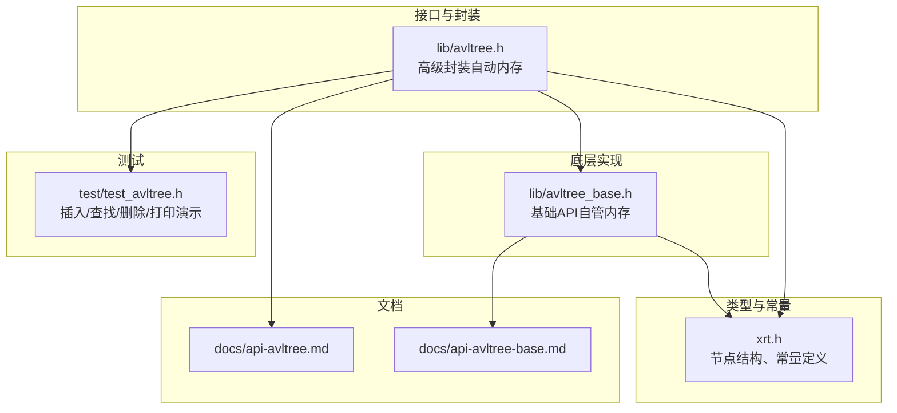
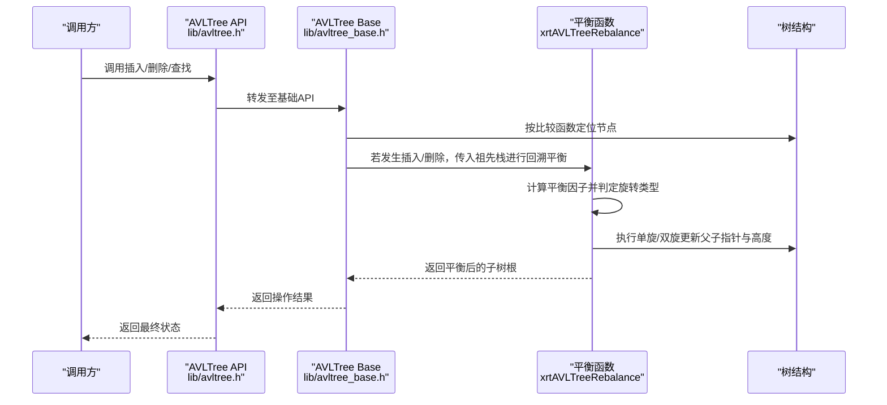
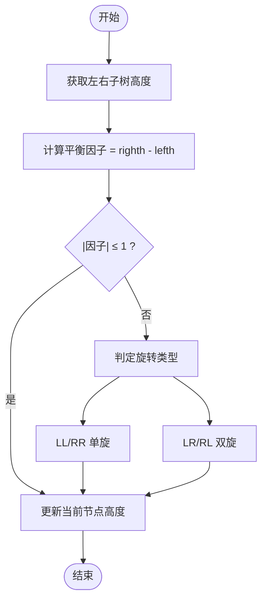
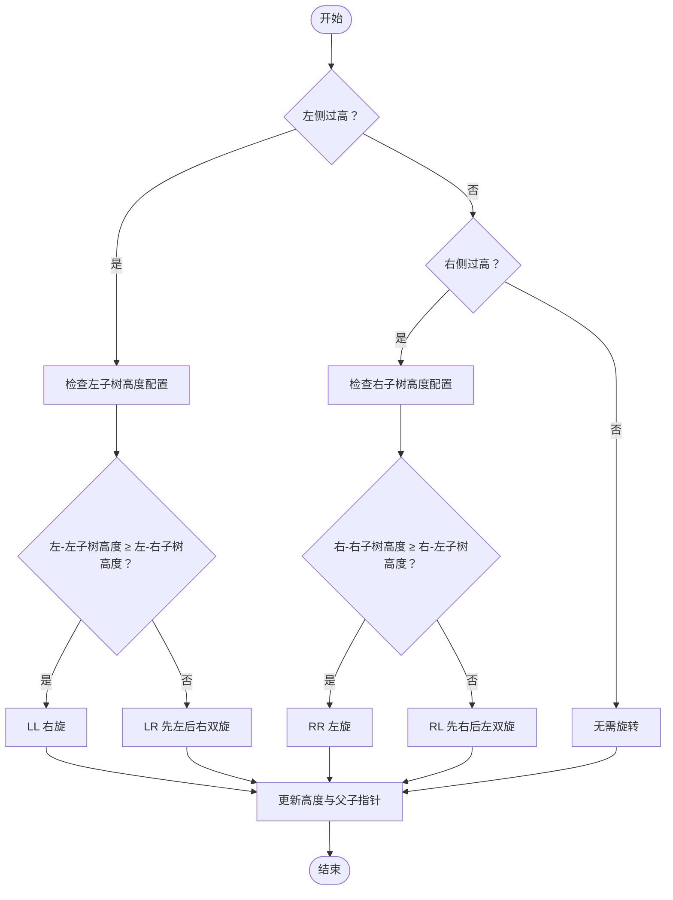
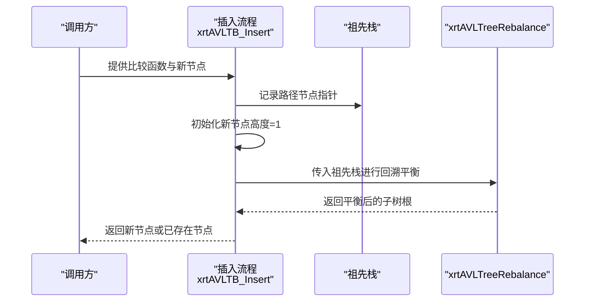
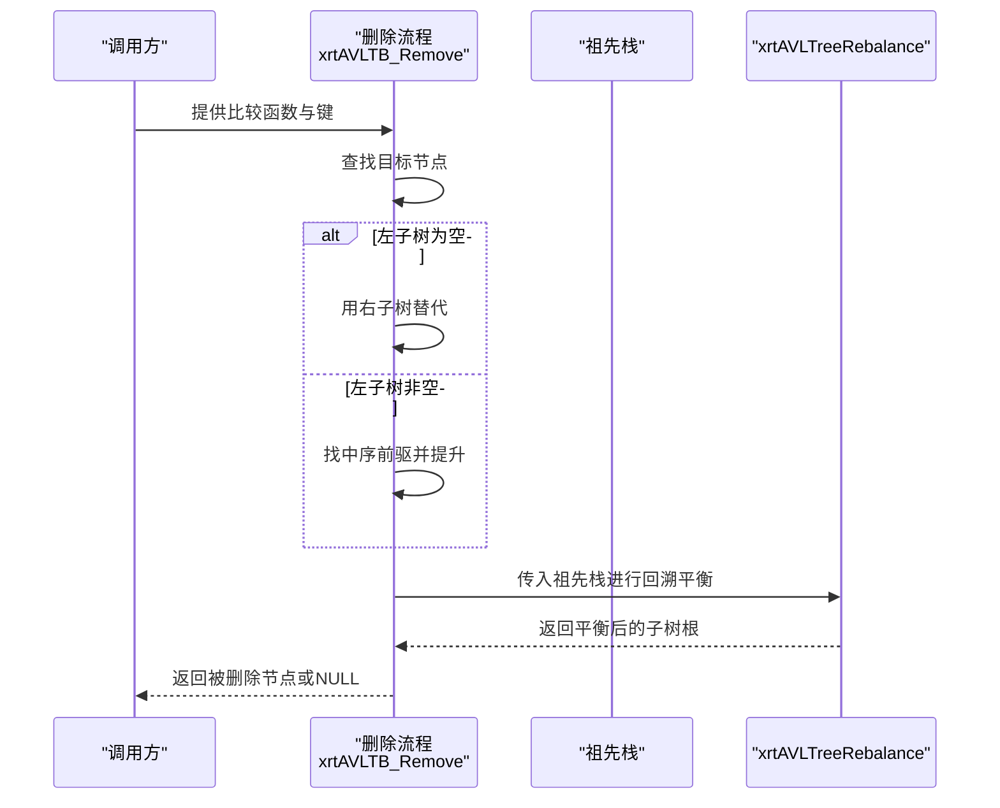
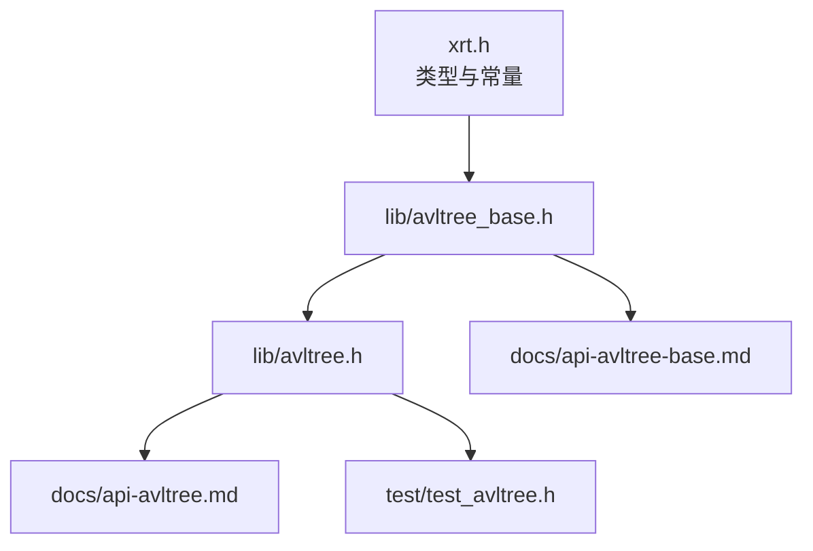

# AVL平衡算法

<cite>
**本文引用的文件**
- [lib/avltree.h](file://lib/avltree.h)
- [lib/avltree_base.h](file://lib/avltree_base.h)
- [xrt.h](file://xrt.h)
- [docs/api-avltree.md](file://docs/api-avltree.md)
- [docs/api-avltree-base.md](file://docs/api-avltree-base.md)
- [test/test_avltree.h](file://test/test_avltree.h)
</cite>

## 目录
1. [简介](#简介)
2. [项目结构](#项目结构)
3. [核心组件](#核心组件)
4. [架构总览](#架构总览)
5. [详细组件分析](#详细组件分析)
6. [依赖关系分析](#依赖关系分析)
7. [性能考量](#性能考量)
8. [故障排查指南](#故障排查指南)
9. [结论](#结论)
10. [附录](#附录)

## 简介
本文件系统化梳理仓库中AVL平衡算法的实现与使用，重点覆盖：
- 节点高度与平衡因子的计算方式
- 四种旋转操作（LL右旋、RR左旋、LR先左后右双旋、RL先右后左双旋）的触发条件与实现要点
- 插入与删除后的平衡维护流程
- 时间复杂度与平衡性保证
- 结合源码的可视化图示与测试用例说明

## 项目结构
AVL树相关代码位于以下模块：
- 接口与封装层：lib/avltree.h（高级封装，自动内存管理）
- 底层实现层：lib/avltree_base.h（基础API，用户自管内存）
- 类型与常量定义：xrt.h（节点结构、最大高度常量等）
- 文档：docs/api-avltree.md、docs/api-avltree-base.md
- 测试：test/test_avltree.h（演示插入、查找、删除、打印）

**图表来源**
- [lib/avltree.h](file://lib/avltree.h#L1-L126)
- [lib/avltree_base.h](file://lib/avltree_base.h#L1-L423)
- [xrt.h](file://xrt.h#L1470-L1669)
- [docs/api-avltree.md](file://docs/api-avltree.md#L1-L200)
- [docs/api-avltree-base.md](file://docs/api-avltree-base.md#L1-L120)
- [test/test_avltree.h](file://test/test_avltree.h#L1-L120)

**章节来源**
- [lib/avltree.h](file://lib/avltree.h#L1-L126)
- [lib/avltree_base.h](file://lib/avltree_base.h#L1-L120)
- [xrt.h](file://xrt.h#L1470-L1669)

## 核心组件
- 节点结构与高度
  - 节点包含左右子节点指针与高度字段；叶子节点高度为1。
  - 高度用于计算平衡因子：平衡因子 = 右子树高度 - 左子树高度。
- 平衡规则
  - 任意节点的平衡因子应在[-1, 1]范围内；若超出则进行旋转恢复。
- 最大高度常量
  - 定义为46，确保树高与节点数量上限的平衡性。
- 关键API
  - 插入/删除/查找：基础API与高级封装均提供。
  - 遍历与迭代器：支持中序遍历与迭代器按需创建。

**章节来源**
- [xrt.h](file://xrt.h#L1477-L1492)
- [docs/api-avltree-base.md](file://docs/api-avltree-base.md#L35-L48)
- [docs/api-avltree.md](file://docs/api-avltree.md#L25-L47)

## 架构总览
AVL树的平衡维护由“插入/删除路径上的祖先节点”驱动，自底向上逐层检查与修复。核心流程如下：

**图表来源**
- [lib/avltree.h](file://lib/avltree.h#L62-L105)
- [lib/avltree_base.h](file://lib/avltree_base.h#L137-L237)
- [lib/avltree_base.h](file://lib/avltree_base.h#L5-L134)

**章节来源**
- [lib/avltree.h](file://lib/avltree.h#L62-L123)
- [lib/avltree_base.h](file://lib/avltree_base.h#L137-L237)

## 详细组件分析

### 节点高度与平衡因子
- 节点高度：叶子为1，空子树高度为0。
- 平衡因子：右子树高度 - 左子树高度。
- 平衡条件：绝对值不超过1。

**图表来源**
- [lib/avltree_base.h](file://lib/avltree_base.h#L12-L13)
- [lib/avltree_base.h](file://lib/avltree_base.h#L15-L133)

**章节来源**
- [lib/avltree_base.h](file://lib/avltree_base.h#L12-L13)
- [lib/avltree_base.h](file://lib/avltree_base.h#L15-L133)

### 四种旋转操作与触发条件

- 触发条件
  - 插入/删除后，自底向上回溯祖先栈，若某节点平衡因子绝对值超过1，则触发旋转。
- 旋转类型判定
  - 左侧过高（平衡因子 < -1）：检查左子树的左右子树高度，决定LL或LR。
  - 右侧过高（平衡因子 > 1）：检查右子树的左右子树高度，决定RR或RL。
- 实现要点
  - 更新父子指针与高度字段。
  - 将旋转后的子树根写回祖先栈对应位置，继续向上回溯。

**图表来源**
- [lib/avltree_base.h](file://lib/avltree_base.h#L15-L133)

**章节来源**
- [lib/avltree_base.h](file://lib/avltree_base.h#L15-L133)

### 插入操作与平衡维护
- 路径记录：沿比较函数路径记录祖先节点指针栈。
- 节点初始化：新节点高度为1，插入到叶子位置。
- 平衡回溯：自底向上调用平衡函数，逐层修正高度与旋转。

**图表来源**
- [lib/avltree_base.h](file://lib/avltree_base.h#L137-L170)

**章节来源**
- [lib/avltree_base.h](file://lib/avltree_base.h#L137-L170)

### 删除操作与平衡维护
- 查找删除节点：沿比较函数定位。
- 删除策略：
  - 若左子树为空，直接用右子树替代。
  - 否则取左子树最大节点（中序前驱）替代当前位置，并将该前驱的左子树提升。
- 平衡回溯：同样传入祖先栈进行回溯平衡。

**图表来源**
- [lib/avltree_base.h](file://lib/avltree_base.h#L173-L237)

**章节来源**
- [lib/avltree_base.h](file://lib/avltree_base.h#L173-L237)

### 查找操作
- 沿比较函数在左右子树间移动，直到命中或到达空指针。
- 高级封装支持“继承树”查找：若当前树未找到，可继续在父树中查找。

**章节来源**
- [lib/avltree_base.h](file://lib/avltree_base.h#L240-L254)
- [lib/avltree.h](file://lib/avltree.h#L108-L123)

### 遍历与迭代器
- 中序遍历：按升序访问节点。
- 迭代器：按需创建，使用固定大小路径栈，避免递归开销。

**章节来源**
- [lib/avltree_base.h](file://lib/avltree_base.h#L257-L316)
- [lib/avltree_base.h](file://lib/avltree_base.h#L325-L420)

## 依赖关系分析

**图表来源**
- [xrt.h](file://xrt.h#L1477-L1492)
- [lib/avltree_base.h](file://lib/avltree_base.h#L1-L120)
- [lib/avltree.h](file://lib/avltree.h#L1-L126)
- [docs/api-avltree.md](file://docs/api-avltree.md#L1-L80)
- [docs/api-avltree-base.md](file://docs/api-avltree-base.md#L1-L120)
- [test/test_avltree.h](file://test/test_avltree.h#L1-L120)

**章节来源**
- [xrt.h](file://xrt.h#L1477-L1492)
- [lib/avltree_base.h](file://lib/avltree_base.h#L1-L120)
- [lib/avltree.h](file://lib/avltree.h#L1-L126)

## 性能考量
- 时间复杂度
  - 插入/删除/查找均为O(log n)，其中n为节点数。
  - 旋转操作为O(1)，每次最多执行常数次旋转。
- 空间复杂度
  - 插入/删除路径上的祖先栈最多为树高，即O(h)，h≤46。
- 平衡性保证
  - 通过平衡因子约束与旋转操作，确保树高始终满足O(log n)。

[本节为通用性能讨论，不直接分析具体文件]

## 故障排查指南
- 插入失败返回NULL
  - 可能原因：达到最大高度限制或节点缓存不足。
  - 处理：检查AVLTree_MAX_HEIGHT与节点分配策略。
- 删除失败返回NULL
  - 可能原因：键不存在或达到最大高度限制。
  - 处理：确认键值与比较函数一致性。
- 高度异常
  - 检查平衡函数是否正确更新高度与父子指针。
- 迭代器问题
  - 确保迭代器生命周期内树结构未被破坏；必要时调用迭代器结束函数。

**章节来源**
- [lib/avltree_base.h](file://lib/avltree_base.h#L139-L159)
- [lib/avltree_base.h](file://lib/avltree_base.h#L193-L196)
- [lib/avltree_base.h](file://lib/avltree_base.h#L325-L420)

## 结论
本仓库实现了完整的AVL平衡算法，具备：
- 明确的节点高度与平衡因子定义
- 四种旋转的完整实现与触发条件
- 插入/删除后的自底向上平衡维护
- 高级封装与基础API双层接口，满足不同使用场景
- 严格的常量与文档支撑，便于理解与维护

[本节为总结性内容，不直接分析具体文件]

## 附录

### 旋转类型与触发条件对照
- LL（右旋）：左侧过高且左-左子树高度更高
- RR（左旋）：右侧过高且右-右子树高度更高
- LR（先左后右双旋）：左侧过高且左-右子树高度更高
- RL（先右后左双旋）：右侧过高且右-左子树高度更高

**章节来源**
- [lib/avltree_base.h](file://lib/avltree_base.h#L15-L133)

### API参考（关键路径）
- 高级封装入口：插入/删除/查找/遍历
  - [lib/avltree.h](file://lib/avltree.h#L62-L123)
- 底层实现入口：插入/删除/查找/遍历
  - [lib/avltree_base.h](file://lib/avltree_base.h#L137-L254)
- 类型与常量
  - [xrt.h](file://xrt.h#L1477-L1492)
- 文档
  - [docs/api-avltree.md](file://docs/api-avltree.md#L169-L497)
  - [docs/api-avltree-base.md](file://docs/api-avltree-base.md#L274-L485)
- 测试
  - [test/test_avltree.h](file://test/test_avltree.h#L41-L431)