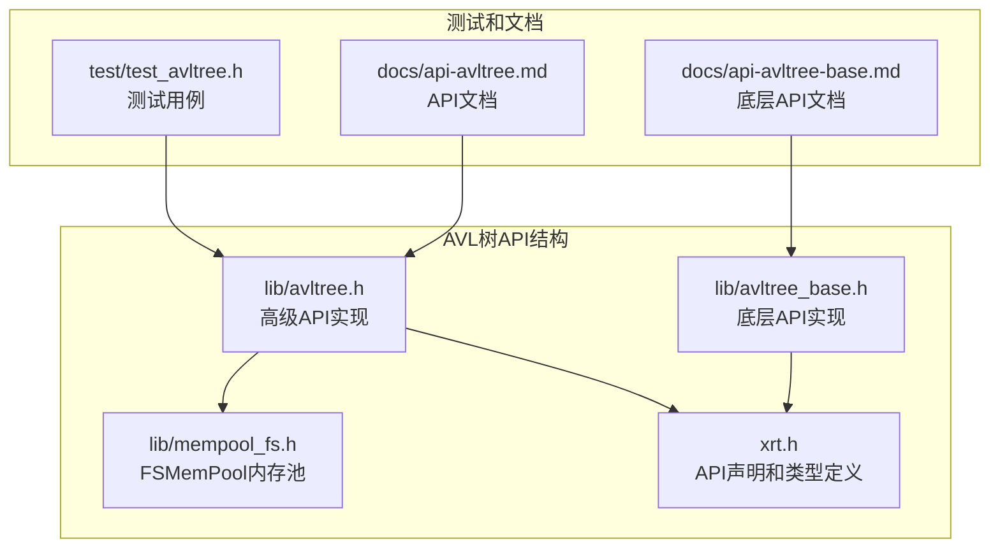
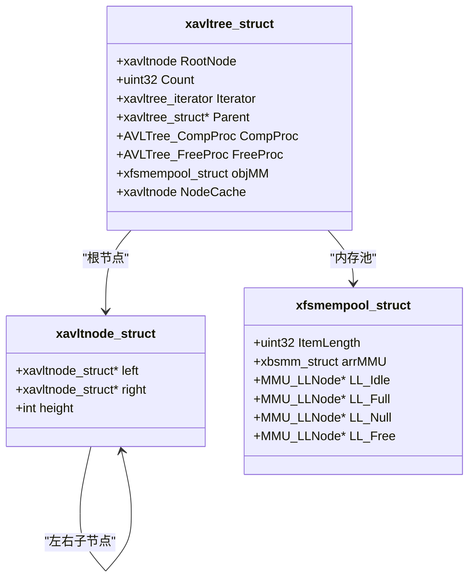
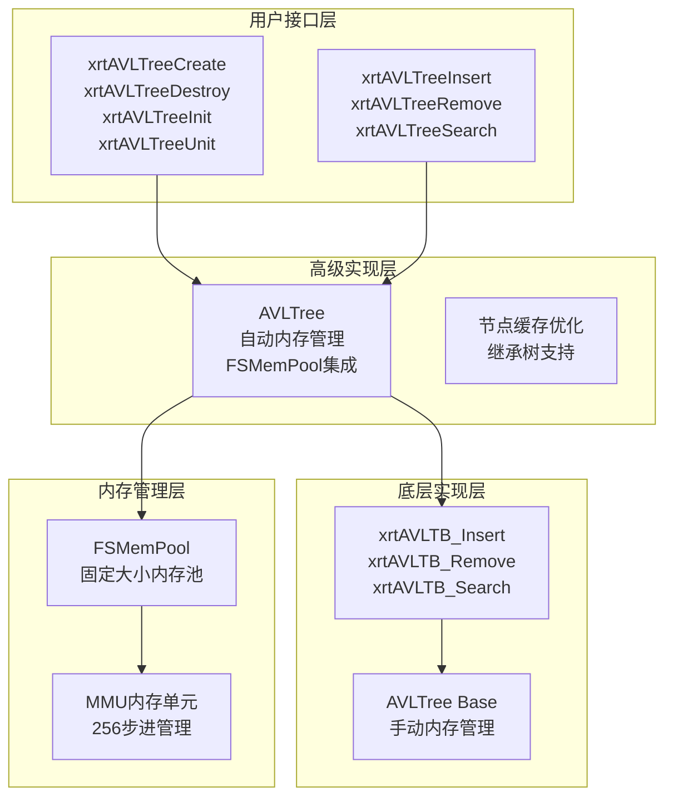
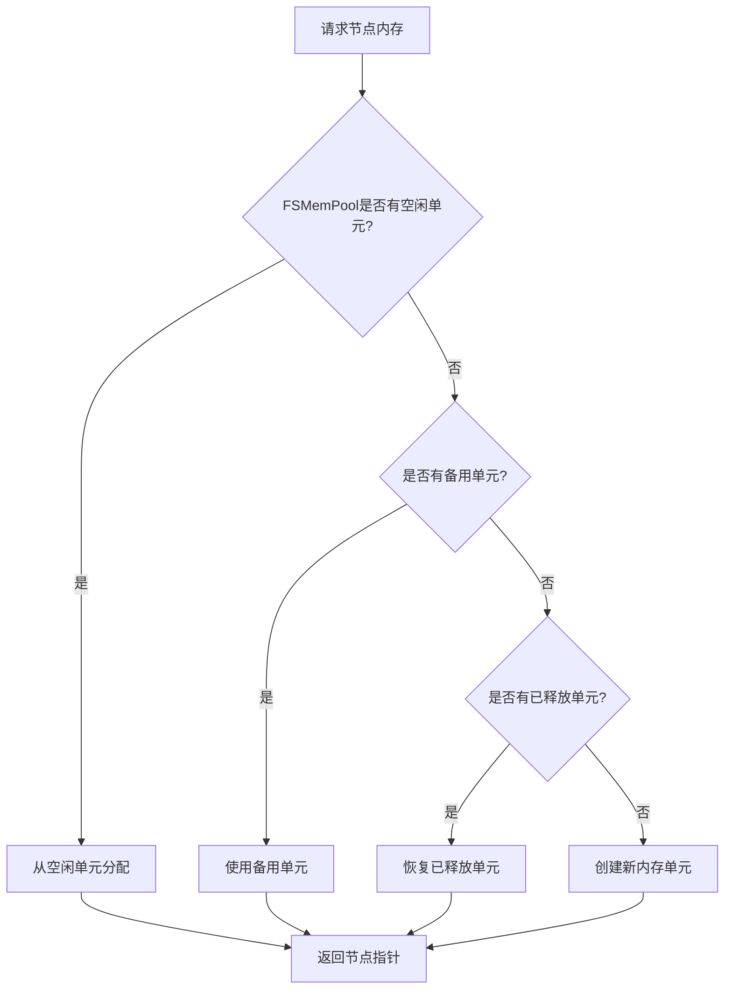
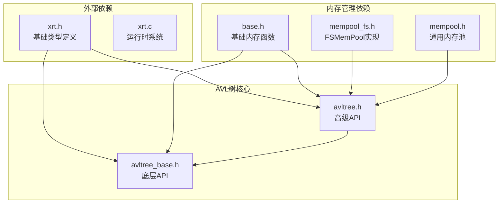

# AVL树API参考

<cite>
**本文档引用的文件**
- [lib/avltree.h](file://lib/avltree.h)
- [lib/avltree_base.h](file://lib/avltree_base.h)
- [lib/mempool_fs.h](file://lib/mempool_fs.h)
- [xrt.h](file://xrt.h)
- [test/test_avltree.h](file://test/test_avltree.h)
- [docs/api-avltree.md](file://docs/api-avltree.md)
- [docs/api-avltree-base.md](file://docs/api-avltree-base.md)
</cite>

## 目录
1. [简介](#简介)
2. [项目结构](#项目结构)
3. [核心组件](#核心组件)
4. [架构概览](#架构概览)
5. [详细组件分析](#详细组件分析)
6. [依赖关系分析](#依赖关系分析)
7. [性能考虑](#性能考虑)
8. [故障排除指南](#故障排除指南)
9. [结论](#结论)

## 简介

AVL树是一种自平衡二叉搜索树，能够在插入和删除操作后自动保持平衡，确保操作的时间复杂度始终为O(log n)。本项目提供了两层AVL树实现：高级API（AVLTree）和底层API（AVLTree Base），满足不同层次的使用需求。

AVL树的核心特点包括：
- **自动平衡**：通过旋转操作维持树的平衡
- **高效查询**：O(log n)时间复杂度的查找、插入、删除
- **有序遍历**：支持中序遍历输出有序序列
- **内存管理**：高级API提供自动内存管理机制

## 项目结构

AVL树API位于项目的lib目录下，主要包含以下文件：



**图表来源**
- [lib/avltree.h](file://lib/avltree.h#L1-L126)
- [lib/avltree_base.h](file://lib/avltree_base.h#L1-L423)
- [lib/mempool_fs.h](file://lib/mempool_fs.h#L1-L200)
- [xrt.h](file://xrt.h#L1570-L1626)

**章节来源**
- [lib/avltree.h](file://lib/avltree.h#L1-L126)
- [lib/avltree_base.h](file://lib/avltree_base.h#L1-L423)
- [lib/mempool_fs.h](file://lib/mempool_fs.h#L1-L200)
- [xrt.h](file://xrt.h#L1570-L1626)

## 核心组件

### AVL树数据结构

AVL树由以下核心组件构成：



**图表来源**
- [xrt.h](file://xrt.h#L1576-L1586)
- [xrt.h](file://xrt.h#L1577-L1586)

### 回调函数类型

AVL树API使用以下回调函数类型：

| 回调函数 | 类型定义 | 参数说明 | 返回值 |
|---------|----------|----------|--------|
| AVLTree_CompProc | `int (*)(ptr pNode, ptr pKey)` | `pNode`: 节点数据指针<br>`pKey`: 比较键指针 | `< 0`: 小于<br>`= 0`: 等于<br>`> 0`: 大于 |
| AVLTree_FreeProc | `void (*)(ptr objTree, ptr pNode)` | `objTree`: 树对象<br>`pNode`: 节点数据指针 | 无返回值 |

**章节来源**
- [xrt.h](file://xrt.h#L1501-L1532)
- [xrt.h](file://xrt.h#L1573-L1574)

## 架构概览

AVL树API采用分层架构设计，提供高级和底层两种使用方式：



**图表来源**
- [lib/avltree.h](file://lib/avltree.h#L4-L59)
- [lib/avltree_base.h](file://lib/avltree_base.h#L136-L254)
- [lib/mempool_fs.h](file://lib/mempool_fs.h#L24-L49)

## 详细组件分析

### 构造和析构函数

#### xrtAVLTreeCreate - 创建AVL树

**函数原型：**
```c
XXAPI xavltree xrtAVLTreeCreate(uint32 iItemLength, AVLTree_CompProc procComp);
```

**参数说明：**
- `iItemLength`: 节点数据大小（字节）
- `procComp`: 比较函数指针

**返回值：**
- 成功：树对象指针
- 失败：`NULL`

**使用示例：**
```c
// 创建整数AVL树
int compareInt(ptr pNode, ptr pKey) {
    return *(int*)pNode - *(int*)pKey;
}

xavltree tree = xrtAVLTreeCreate(sizeof(int), compareInt);
```

**注意事项：**
- 需要调用`xrtAVLTreeDestroy`释放内存
- 比较函数必须正确实现，返回值必须遵循约定

**章节来源**
- [lib/avltree.h](file://lib/avltree.h#L5-L12)
- [xrt.h](file://xrt.h#L1588-L1589)

#### xrtAVLTreeDestroy - 销毁AVL树

**函数原型：**
```c
XXAPI void xrtAVLTreeDestroy(xavltree objAVLT);
```

**功能说明：**
- 释放所有节点和树结构
- 如果设置了`FreeProc`，会先遍历调用释放回调

**使用示例：**
```c
xrtAVLTreeDestroy(tree);
```

**错误处理：**
- 参数为`NULL`时安全返回
- 会自动处理内存泄漏

**章节来源**
- [lib/avltree.h](file://lib/avltree.h#L15-L21)
- [xrt.h](file://xrt.h#L1591-L1592)

#### xrtAVLTreeInit - 初始化

**函数原型：**
```c
XXAPI void xrtAVLTreeInit(xavltree objAVLT, uint32 iItemLength, AVLTree_CompProc procComp);
```

**使用场景：**
- 栈上分配的结构体
- 嵌入式系统中的静态分配

**使用示例：**
```c
xavltree_struct treeData;
xrtAVLTreeInit(&treeData, sizeof(int), compareInt);
```

**配合函数：**
- `xrtAVLTreeUnit` - 释放内部资源
- `xrtAVLTreeRemoveAll` - 删除所有节点
- `xrtAVLTreeClear` - 清空树

**章节来源**
- [lib/avltree.h](file://lib/avltree.h#L24-L32)
- [xrt.h](file://xrt.h#L1594-L1595)

#### xrtAVLTreeUnit - 释放

**函数原型：**
```c
XXAPI void xrtAVLTreeUnit(xavltree objAVLT);
```

**功能说明：**
- 释放内置FSMemPool和所有节点
- 不释放结构体本身的内存

**使用示例：**
```c
xrtAVLTreeUnit(&treeData); // 释放内部资源
// treeData结构体仍可用，但树为空
```

**章节来源**
- [lib/avltree.h](file://lib/avltree.h#L51-L59)
- [xrt.h](file://xrt.h#L1597-L1598)

### 节点操作API

#### xrtAVLTreeInsert - 插入节点

**函数原型：**
```c
XXAPI ptr xrtAVLTreeInsert(xavltree objAVLT, ptr pKey, bool* bNew);
```

**参数说明：**
- `objAVLT`: 树对象
- `pKey`: 键指针（用于比较）
- `bNew`: 输出参数，指示是否为新节点（可为`NULL`）

**返回值：**
- 成功：节点数据指针
- 失败：`NULL`

**行为说明：**
- 如果键已存在，返回已有节点的数据指针，`*bNew = FALSE`
- 如果键不存在，创建新节点，`*bNew = TRUE`
- 新节点需要在返回后填充数据

**使用示例：**
```c
bool isNew;
int* data = (int*)xrtAVLTreeInsert(tree, &key, &isNew);
if (isNew) {
    *data = key; // 填充新节点数据
}
```

**错误处理：**
- 内存分配失败返回`NULL`
- 节点缓存机制优化连续插入性能

**章节来源**
- [lib/avltree.h](file://lib/avltree.h#L62-L90)
- [xrt.h](file://xrt.h#L1600-L1601)

#### xrtAVLTreeRemove - 删除节点

**函数原型：**
```c
XXAPI bool xrtAVLTreeRemove(xavltree objAVLT, ptr pKey);
```

**返回值：**
- `TRUE`: 成功删除
- `FALSE`: 键不存在

**行为说明：**
- 删除后会自动释放节点内存
- 如果设置了`FreeProc`，删除前会先调用释放回调

**使用示例：**
```c
if (xrtAVLTreeRemove(tree, &key)) {
    printf("删除成功\n");
} else {
    printf("键不存在\n");
}
```

**算法复杂度：**
- 时间复杂度：O(log n)
- 空间复杂度：O(1)

**章节来源**
- [lib/avltree.h](file://lib/avltree.h#L93-L105)
- [xrt.h](file://xrt.h#L1603-L1604)

#### xrtAVLTreeSearch - 查找节点

**函数原型：**
```c
XXAPI ptr xrtAVLTreeSearch(xavltree objAVLT, ptr pKey);
```

**返回值：**
- 找到：节点数据指针
- 未找到：`NULL`

**特殊功能：**
- 继承查找：如果当前树未找到且设置了`Parent`，会继续在父树中查找

**使用示例：**
```c
int* found = (int*)xrtAVLTreeSearch(tree, &key);
if (found) {
    printf("找到: %d\n", *found);
}
```

**应用场景：**
- 缓存系统中的键值查找
- 数据库索引的快速检索

**章节来源**
- [lib/avltree.h](file://lib/avltree.h#L108-L123)
- [xrt.h](file://xrt.h#L1606-L1607)

### 内存管理机制

#### FSMemPool集成

AVL树使用FSMemPool进行高效的内存管理：



**图表来源**
- [lib/mempool_fs.h](file://lib/mempool_fs.h#L52-L125)

**优势特性：**
- **节点缓存**：减少频繁内存分配的开销
- **自动垃圾回收**：FSMemPool支持GC功能
- **固定大小分配**：避免内存碎片

**章节来源**
- [lib/avltree.h](file://lib/avltree.h#L29-L31)
- [lib/mempool_fs.h](file://lib/mempool_fs.h#L24-L49)

## 依赖关系分析

AVL树API的依赖关系如下：



**图表来源**
- [lib/avltree.h](file://lib/avltree.h#L1-L126)
- [lib/avltree_base.h](file://lib/avltree_base.h#L1-L423)
- [lib/mempool_fs.h](file://lib/mempool_fs.h#L1-L200)
- [xrt.h](file://xrt.h#L1-L200)

**依赖特点：**
- **低耦合**：AVL树API独立于具体内存管理实现
- **可扩展**：支持不同的内存分配策略
- **类型安全**：通过宏定义确保类型一致性

**章节来源**
- [lib/avltree.h](file://lib/avltree.h#L1-L126)
- [lib/avltree_base.h](file://lib/avltree_base.h#L1-L423)
- [lib/mempool_fs.h](file://lib/mempool_fs.h#L1-L200)

## 性能考虑

### 时间复杂度分析

| 操作 | 最好情况 | 平均情况 | 最坏情况 | 说明 |
|------|----------|----------|----------|------|
| 查找 | O(1) | O(log n) | O(log n) | 平衡树保证 |
| 插入 | O(log n) | O(log n) | O(log n) | 旋转调整 |
| 删除 | O(log n) | O(log n) | O(log n) | 旋转调整 |
| 遍历 | O(n) | O(n) | O(n) | 中序遍历 |

### 空间复杂度

- **节点存储**：每个节点占用`sizeof(xavltnode_struct) + iItemLength`字节
- **内存池开销**：FSMemPool额外占用约`10-15%`的内存
- **平衡信息**：每个节点存储高度信息，占用`sizeof(int)`字节

### 性能优化技巧

1. **批量插入优化**：利用节点缓存机制
2. **比较函数优化**：避免不必要的字符串比较
3. **内存预分配**：对于大量插入场景，考虑预估内存需求

### 使用场景建议

**适合使用AVL树的场景：**
- 需要稳定O(log n)性能的查找操作
- 数据频繁更新的动态集合
- 需要有序遍历的应用

**不适合使用AVL树的场景：**
- 数据基本不变的静态集合
- 对内存使用极其敏感的嵌入式系统
- 需要极高插入性能的场景（红黑树可能更合适）

## 故障排除指南

### 常见问题及解决方案

#### 1. 内存泄漏问题

**症状：** 程序运行时间越长，内存使用量持续增长

**原因：**
- 忘记调用`xrtAVLTreeDestroy`
- 没有正确设置`FreeProc`回调

**解决方案：**
```c
// 确保正确释放
xrtAVLTreeDestroy(tree);
// 或者
xrtAVLTreeUnit(tree);
xrtFree(tree);
```

#### 2. 比较函数错误

**症状：** 查找结果异常，插入后数据丢失

**原因：** 比较函数实现不符合约定

**正确实现示例：**
```c
int compareInt(ptr pNode, ptr pKey) {
    int a = *(int*)pNode;
    int b = *(int*)pKey;
    if (a < b) return -1;
    if (a > b) return 1;
    return 0;
}
```

#### 3. 继承树查找失败

**症状：** 设置了Parent但查找不到父树中的数据

**原因：** 比较函数与父树数据类型不匹配

**解决方案：**
```c
// 确保父子树使用相同的比较函数
childTree->Parent = parentTree;
// 父子树的比较函数必须一致
```

#### 4. 内存分配失败

**症状：** `xrtAVLTreeInsert`返回`NULL`

**原因：**
- 内存不足
- 节点缓存耗尽

**解决方案：**
```c
// 检查返回值
bool isNew;
int* data = (int*)xrtAVLTreeInsert(tree, &key, &isNew);
if (!data) {
    // 处理内存分配失败
    printf("内存分配失败\n");
}
```

**章节来源**
- [lib/avltree.h](file://lib/avltree.h#L62-L90)
- [lib/avltree.h](file://lib/avltree.h#L15-L21)

### 调试技巧

1. **启用错误报告**：使用`xrtSetError`捕获错误信息
2. **验证数据完整性**：检查节点数据的生命周期
3. **监控内存使用**：定期检查FSMemPool的状态

## 结论

AVL树API提供了功能完整、性能优异的自平衡二叉搜索树实现。通过分层设计，既满足了普通开发者的需求，又为高级用户提供灵活的定制能力。

**主要优势：**
- **高性能**：稳定的O(log n)操作性能
- **易用性**：高级API提供自动内存管理
- **灵活性**：支持多种内存管理和比较策略
- **可靠性**：完善的错误处理和调试支持

**最佳实践：**
- 选择合适的比较函数实现
- 正确管理内存生命周期
- 根据使用场景选择合适的API层级
- 充分利用FSMemPool的性能优势

通过合理使用AVL树API，可以构建高效、可靠的键值存储系统，适用于各种需要快速查找和有序遍历的应用场景。