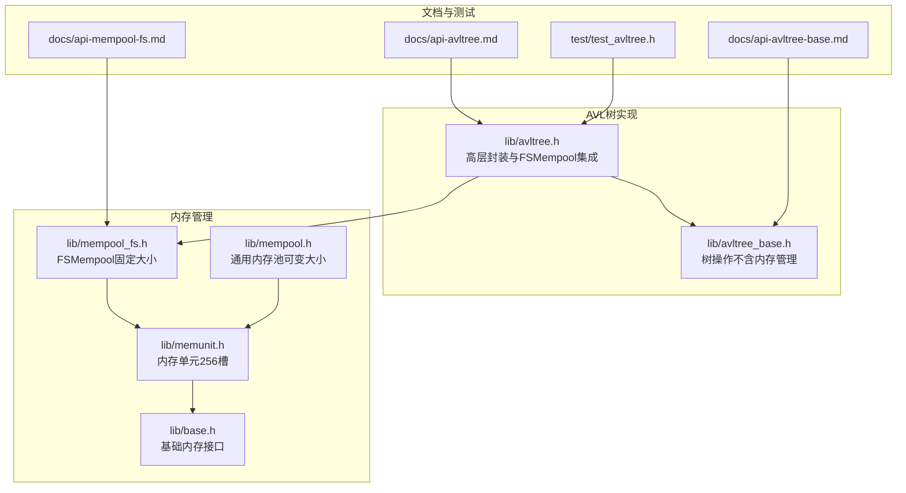
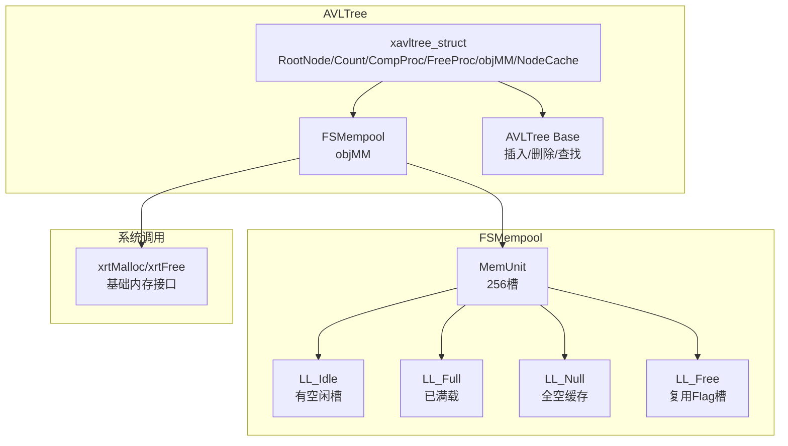
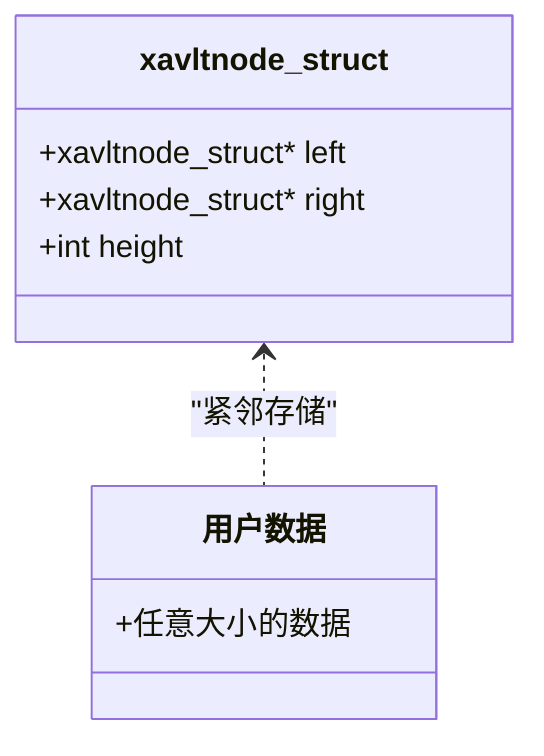
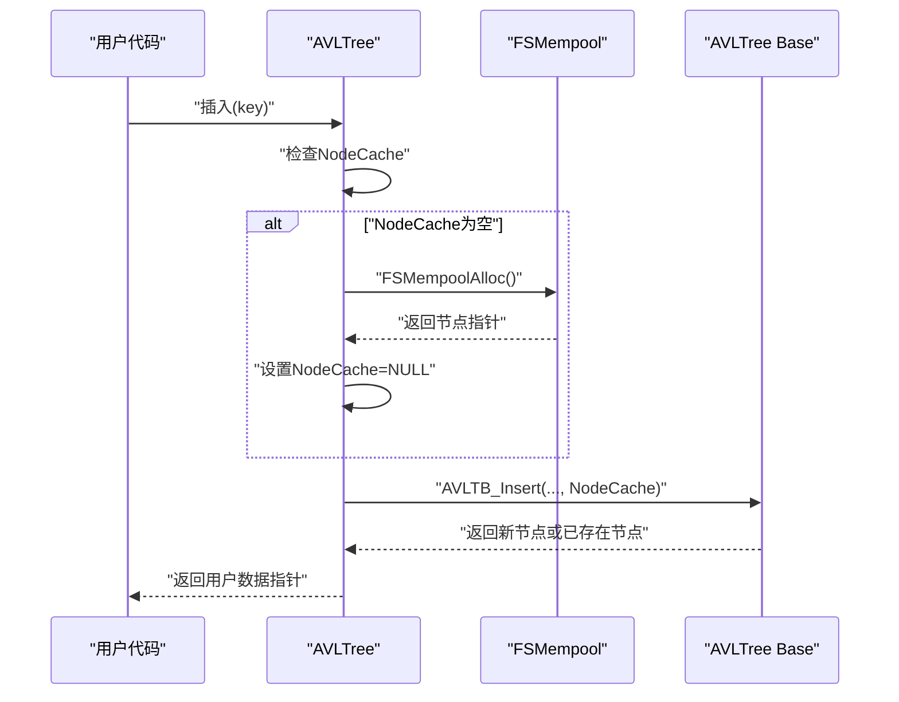
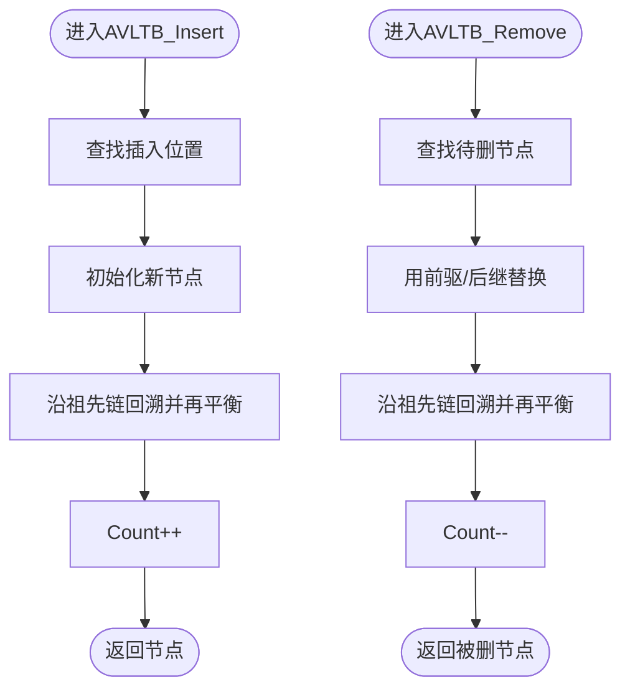
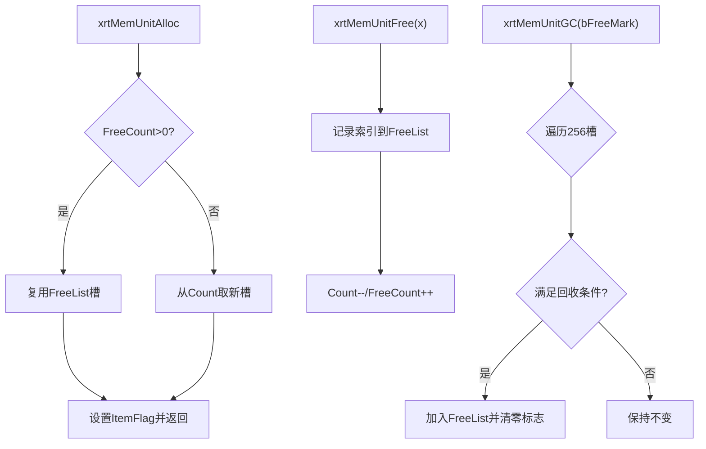
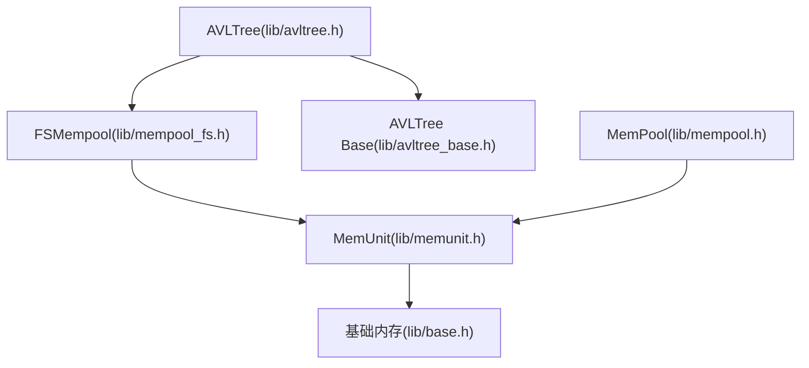

# 内存管理与性能优化

<cite>
**本文档引用的文件**
- [lib/avltree.h](file://lib/avltree.h)
- [lib/avltree_base.h](file://lib/avltree_base.h)
- [lib/mempool_fs.h](file://lib/mempool_fs.h)
- [lib/mempool.h](file://lib/mempool.h)
- [lib/memunit.h](file://lib/memunit.h)
- [lib/base.h](file://lib/base.h)
- [docs/api-avltree.md](file://docs/api-avltree.md)
- [docs/api-avltree-base.md](file://docs/api-avltree-base.md)
- [docs/api-mempool-fs.md](file://docs/api-mempool-fs.md)
- [test/test_avltree.h](file://test/test_avltree.h)
</cite>

## 目录
1. [简介](#简介)
2. [项目结构](#项目结构)
3. [核心组件](#核心组件)
4. [架构概览](#架构概览)
5. [详细组件分析](#详细组件分析)
6. [依赖关系分析](#依赖关系分析)
7. [性能考量](#性能考量)
8. [故障排查指南](#故障排查指南)
9. [结论](#结论)
10. [附录](#附录)

## 简介
本文件聚焦于AVL树的内存管理与性能优化，系统阐述以下主题：
- AVL树节点内存布局与数据存储方式
- 固定大小内存池（xrtFSMemPool）的使用与优势
- 节点缓存机制（NodeCache）的设计与优化效果
- 减少内存碎片、提升分配效率、降低系统调用开销的策略
- 批量操作优化、内存预分配、缓存友好的数据访问模式
- 内存使用监控与调试方法（含泄漏检测思路）
- 性能测试与优化案例研究（基于仓库现有测试）

## 项目结构
AVL树相关实现位于lib目录，配套API文档位于docs目录，测试样例位于test目录。关键文件如下：
- AVL树高层封装：lib/avltree.h
- AVL树基础操作（不含内存管理）：lib/avltree_base.h
- 固定大小内存池（FSMempool）：lib/mempool_fs.h
- 通用内存池（MemPool）：lib/mempool.h
- 内存单元（MemUnit）：lib/memunit.h
- 基础内存接口：lib/base.h
- 文档：docs/api-avltree.md、docs/api-avltree-base.md、docs/api-mempool-fs.md
- 测试：test/test_avltree.h

**图表来源**
- [lib/avltree.h](file://lib/avltree.h#L1-L126)
- [lib/avltree_base.h](file://lib/avltree_base.h#L1-L423)
- [lib/mempool_fs.h](file://lib/mempool_fs.h#L1-L257)
- [lib/mempool.h](file://lib/mempool.h#L1-L468)
- [lib/memunit.h](file://lib/memunit.h#L1-L143)
- [lib/base.h](file://lib/base.h#L1-L132)
- [docs/api-avltree.md](file://docs/api-avltree.md#L1-L940)
- [docs/api-avltree-base.md](file://docs/api-avltree-base.md#L1-L797)
- [docs/api-mempool-fs.md](file://docs/api-mempool-fs.md#L1-L735)
- [test/test_avltree.h](file://test/test_avltree.h#L1-L434)

**章节来源**
- [lib/avltree.h](file://lib/avltree.h#L1-L126)
- [lib/avltree_base.h](file://lib/avltree_base.h#L1-L423)
- [lib/mempool_fs.h](file://lib/mempool_fs.h#L1-L257)
- [lib/mempool.h](file://lib/mempool.h#L1-L468)
- [lib/memunit.h](file://lib/memunit.h#L1-L143)
- [lib/base.h](file://lib/base.h#L1-L132)
- [docs/api-avltree.md](file://docs/api-avltree.md#L1-L940)
- [docs/api-avltree-base.md](file://docs/api-avltree-base.md#L1-L797)
- [docs/api-mempool-fs.md](file://docs/api-mempool-fs.md#L1-L735)
- [test/test_avltree.h](file://test/test_avltree.h#L1-L434)

## 核心组件
- AVLTree（高层封装）：自动管理节点内存，内置FSMempool，支持节点缓存、继承树、释放回调。
- AVLTree Base（基础操作）：仅提供树结构操作，节点内存由用户管理。
- FSMemPool（固定大小内存池）：为固定大小对象（如AVL节点）提供高效分配与回收，支持GC。
- MemUnit（内存单元）：单个256槽位的内存块，提供O(1)分配与释放。
- 通用内存池（MemPool）：支持可变大小对象分配，内部使用FSB树与多链表管理。

**章节来源**
- [lib/avltree.h](file://lib/avltree.h#L5-L59)
- [lib/avltree_base.h](file://lib/avltree_base.h#L137-L237)
- [lib/mempool_fs.h](file://lib/mempool_fs.h#L24-L49)
- [lib/memunit.h](file://lib/memunit.h#L5-L86)
- [lib/mempool.h](file://lib/mempool.h#L35-L145)

## 架构概览
AVLTree的内存管理采用“高层封装 + 固定大小内存池”的组合：
- AVLTree在创建时初始化FSMempool，节点大小为“节点结构 + 用户数据”。
- 插入时优先使用NodeCache（预分配节点），减少分配次数；删除时将节点交还FSMempool。
- FSMemPool内部使用MemUnit（256槽）与四链表（Idle/Full/Null/Free）管理，实现O(1)分配与低碎片。

**图表来源**
- [lib/avltree.h](file://lib/avltree.h#L24-L59)
- [lib/mempool_fs.h](file://lib/mempool_fs.h#L24-L125)
- [lib/memunit.h](file://lib/memunit.h#L5-L86)
- [lib/base.h](file://lib/base.h#L5-L45)

**章节来源**
- [lib/avltree.h](file://lib/avltree.h#L24-L105)
- [lib/mempool_fs.h](file://lib/mempool_fs.h#L24-L125)
- [lib/memunit.h](file://lib/memunit.h#L5-L86)
- [lib/base.h](file://lib/base.h#L5-L45)

## 详细组件分析

### AVL树内存布局与数据存储
- 节点结构：xavltnode_struct包含left、right、height三个字段，作为用户数据的前导结构，便于通过“节点指针”与“用户数据指针”互转。
- 数据存储：用户数据紧随节点结构之后，通过“&node[1]”访问。
- 内存对齐：FSMempool在初始化时将节点大小设为“节点结构大小 + 用户数据大小”，确保节点整体对齐与紧凑布局。

**图表来源**
- [lib/avltree_base.h](file://lib/avltree_base.h#L84-L88)
- [docs/api-avltree-base.md](file://docs/api-avltree-base.md#L50-L64)

**章节来源**
- [lib/avltree_base.h](file://lib/avltree_base.h#L84-L88)
- [docs/api-avltree-base.md](file://docs/api-avltree-base.md#L50-L64)

### 固定大小内存池（xrtFSMemPool）与节点缓存
- FSMemPool初始化：记录ItemLength（即“节点结构大小 + 用户数据大小”），并建立四链表管理MemUnit。
- 节点缓存（NodeCache）：插入前若NodeCache为空则从FSMempool预分配一个节点，避免频繁分配；若该缓存被使用则清空，等待下一次使用。
- 删除回收：删除节点后将节点指针交还FSMempool，FSMempool根据链表状态进行Idle/Full/Null/Free分类管理。

**图表来源**
- [lib/avltree.h](file://lib/avltree.h#L62-L90)
- [lib/mempool_fs.h](file://lib/mempool_fs.h#L52-L125)

**章节来源**
- [lib/avltree.h](file://lib/avltree.h#L62-L90)
- [lib/mempool_fs.h](file://lib/mempool_fs.h#L52-L125)

### AVL树基础操作与再平衡
- 插入/删除/查找：基于比较函数在AVLTree Base中实现，维护节点高度与平衡。
- 再平衡：根据左右子树高度差进行旋转，保证树高始终为O(log N)。

**图表来源**
- [lib/avltree_base.h](file://lib/avltree_base.h#L137-L237)

**章节来源**
- [lib/avltree_base.h](file://lib/avltree_base.h#L137-L237)

### 通用内存池（MemPool）与FSB树
- MemPool支持可变大小对象分配，内部通过FSB树（四叉搜索树）将请求大小映射到合适的MemUnit。
- 四链表管理：Idle/Full/Null/Free，避免频繁创建/销毁MemUnit，降低系统调用开销。

**图表来源**
- [lib/mempool.h](file://lib/mempool.h#L148-L261)
- [lib/mempool.h](file://lib/mempool.h#L335-L385)

**章节来源**
- [lib/mempool.h](file://lib/mempool.h#L148-L261)
- [lib/mempool.h](file://lib/mempool.h#L335-L385)

### 内存单元（MemUnit）与GC
- MemUnit为固定大小的256槽内存块，分配时优先复用已释放槽，释放时记录索引以便后续复用。
- GC：支持标记-清除，按模式回收被标记或未标记的对象，完成后重新分类MemUnit。

**图表来源**
- [lib/memunit.h](file://lib/memunit.h#L22-L86)
- [lib/memunit.h](file://lib/memunit.h#L89-L140)

**章节来源**
- [lib/memunit.h](file://lib/memunit.h#L22-L86)
- [lib/memunit.h](file://lib/memunit.h#L89-L140)

## 依赖关系分析
- AVLTree依赖FSMempool进行节点分配与回收；FSMempool依赖MemUnit与四链表管理。
- AVLTree Base独立于内存管理，仅依赖比较函数与节点指针。
- 通用内存池（MemPool）与FSMempool共享MemUnit，但前者支持可变大小与更复杂的FSB树组织。

**图表来源**
- [lib/avltree.h](file://lib/avltree.h#L30-L100)
- [lib/mempool_fs.h](file://lib/mempool_fs.h#L24-L125)
- [lib/memunit.h](file://lib/memunit.h#L5-L86)
- [lib/avltree_base.h](file://lib/avltree_base.h#L137-L237)
- [lib/mempool.h](file://lib/mempool.h#L35-L145)
- [lib/base.h](file://lib/base.h#L5-L45)

**章节来源**
- [lib/avltree.h](file://lib/avltree.h#L30-L100)
- [lib/mempool_fs.h](file://lib/mempool_fs.h#L24-L125)
- [lib/memunit.h](file://lib/memunit.h#L5-L86)
- [lib/avltree_base.h](file://lib/avltree_base.h#L137-L237)
- [lib/mempool.h](file://lib/mempool.h#L35-L145)
- [lib/base.h](file://lib/base.h#L5-L45)

## 性能考量
- 减少内存碎片
  - FSMemPool为固定大小对象设计，避免可变大小分配导致的外部碎片。
  - MemUnit内部使用连续内存与固定槽位，避免内部碎片。
- 提升分配效率
  - FSMemPool分配为O(1)，优先从Idle链表或NodeCache获取，减少系统调用。
  - MemUnit分配优先复用FreeList槽，避免扫描空槽。
- 降低系统调用开销
  - 通过MemUnit页式管理与四链表复用，减少xrtMalloc/xrtFree调用频率。
- 批量操作优化
  - 预分配NodeCache或一次性创建多个节点，减少多次分配与再平衡。
  - 批量释放时遵循“先释放子节点，再释放父节点”的顺序，利于FSMempool回收。
- 缓存友好访问
  - 将节点结构置于用户数据前部，保证“节点指针”与“用户数据指针”相邻，提升CPU缓存命中率。
- GC策略
  - 在周期性任务中执行FSMempool GC，回收未使用的节点，维持低碎片与稳定性能。

**章节来源**
- [docs/api-mempool-fs.md](file://docs/api-mempool-fs.md#L21-L32)
- [lib/mempool_fs.h](file://lib/mempool_fs.h#L52-L125)
- [lib/memunit.h](file://lib/memunit.h#L22-L86)
- [docs/api-avltree-base.md](file://docs/api-avltree-base.md#L760-L797)

## 故障排查指南
- 内存泄漏检测
  - 利用FSMempool GC进行标记-清除，定位未使用的节点；结合测试用例验证回收前后节点数量变化。
  - 参考测试中对Count与arrMMU状态的断言，确保插入/删除/回收流程正确。
- 性能瓶颈分析
  - 观察FSMempool的arrMMU.Count与PageMMU.AllocCount变化，确认是否存在频繁创建/销毁MemUnit。
  - 检查NodeCache命中率：若NodeCache频繁为空，可考虑增大批量插入规模或预热NodeCache。
- 内存使用统计
  - 通过测试用例中的状态打印（如Count、arrMMU.Count、PageMMU.AllocCount）进行基线记录与回归对比。
- 常见问题
  - 跨池释放：确保使用正确的FSMempool释放节点，避免跨池释放导致未定义行为。
  - 未设置FreeProc：若节点数据包含动态资源，应在销毁前设置FreeProc以避免资源泄露。

**章节来源**
- [test/test_avltree.h](file://test/test_avltree.h#L41-L245)
- [lib/avltree.h](file://lib/avltree.h#L15-L59)
- [docs/api-mempool-fs.md](file://docs/api-mempool-fs.md#L636-L666)

## 结论
AVL树在本库中通过FSMempool实现了高效的固定大小对象内存管理，配合节点缓存与四链表管理，显著降低了分配成本与碎片率。结合MemUnit的256槽位设计与GC机制，可在高频插入/删除场景下保持稳定的性能表现。通过合理的批量操作与缓存友好的数据布局，可进一步优化内存局部性与CPU缓存命中率，从而获得更好的吞吐与延迟特性。

## 附录
- 实际性能测试与优化案例
  - 测试用例展示了插入/查找/删除后的状态变化，可用于评估不同操作序列下的内存使用与性能影响。
  - 建议在大规模批量插入场景中预热NodeCache与FSMempool，以减少首次分配开销。
  - 在需要回收大量临时节点的场景中，定期执行FSMempool GC，有助于维持内存池健康状态。

**章节来源**
- [test/test_avltree.h](file://test/test_avltree.h#L41-L245)
- [docs/api-avltree.md](file://docs/api-avltree.md#L578-L721)
- [docs/api-mempool-fs.md](file://docs/api-mempool-fs.md#L670-L702)