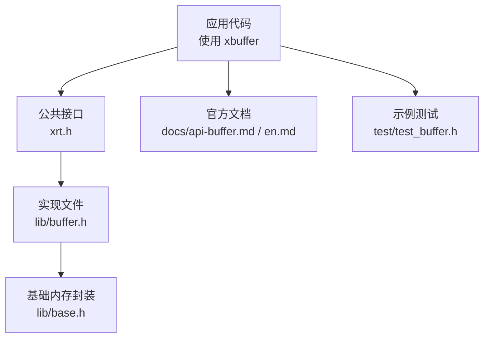
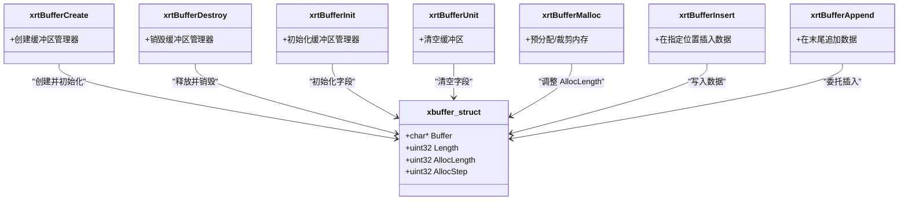
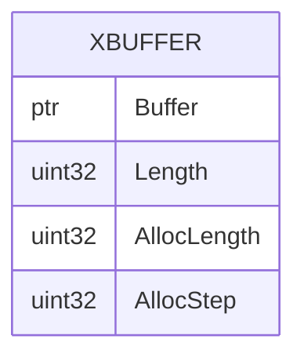
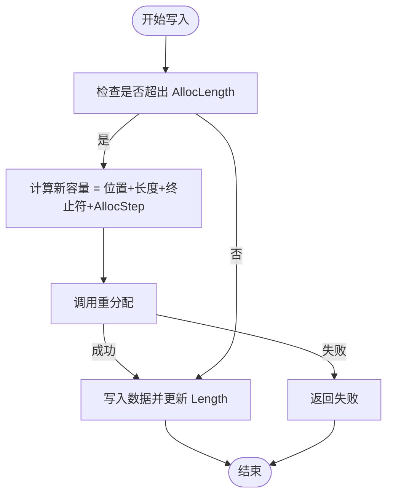
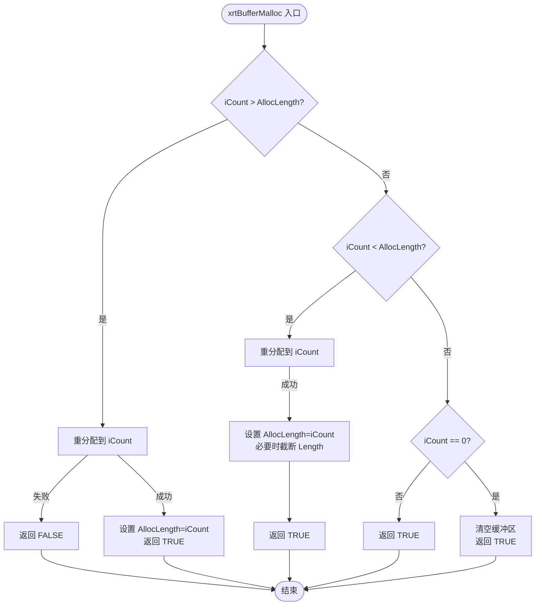
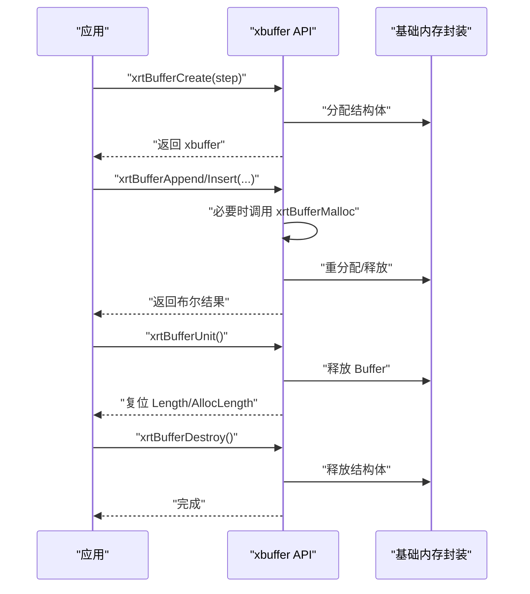
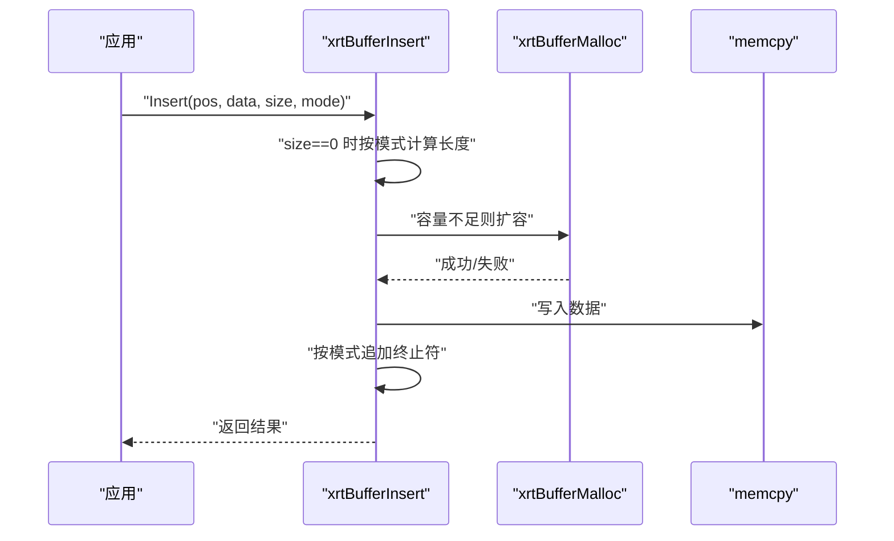
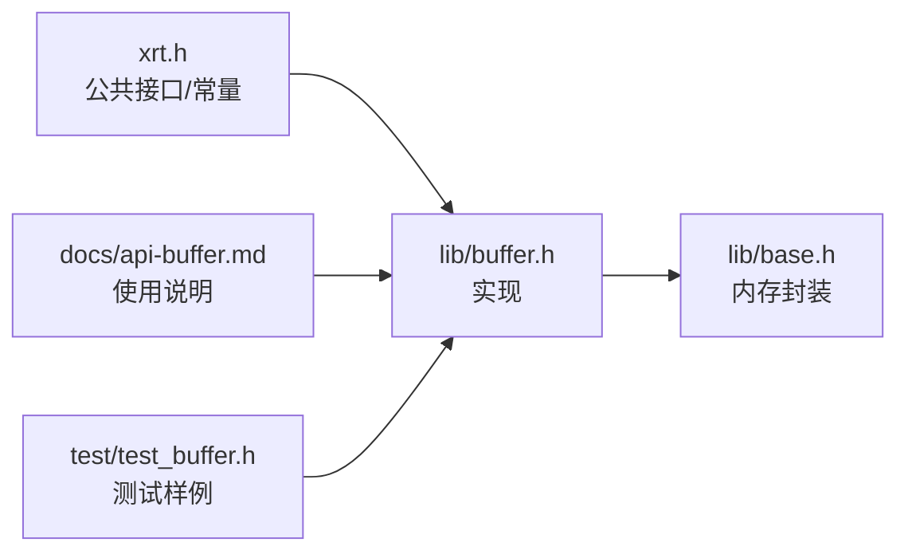

# 动态缓冲区 (xbuffer)

<cite>
**本文引用的文件**
- [xrt.h](file://xrt.h)
- [buffer.h](file://lib/buffer.h)
- [api-buffer.md](file://docs/api-buffer.md)
- [api-buffer.en.md](file://docs/api-buffer.en.md)
- [base.h](file://lib/base.h)
- [test_buffer.h](file://test/test_buffer.h)
</cite>

## 目录
1. [简介](#简介)
2. [项目结构](#项目结构)
3. [核心组件](#核心组件)
4. [架构总览](#架构总览)
5. [组件详解](#组件详解)
6. [依赖关系分析](#依赖关系分析)
7. [性能考量](#性能考量)
8. [故障排查指南](#故障排查指南)
9. [结论](#结论)
10. [附录](#附录)

## 简介
本文件系统性阐述 XRT 动态缓冲区模块（xbuffer）的设计理念与实现机制，涵盖自动扩容策略、内存分配算法、缓冲区管理流程；详细说明生命周期管理（创建、初始化、销毁）、内存分配策略（增量分配、裁剪机制）、数据插入与追加操作；提供完整的 API 使用指南（参数说明、返回值处理、内存优化技巧），并结合实际示例展示在不同场景下的使用方法，最后给出性能调优建议与常见问题解决方案。

## 项目结构
xbuffer 属于 XRT 核心库的一部分，位于公共头文件与具体实现文件中，并配有官方文档与测试样例：
- 公共接口与常量定义：xrt.h
- 实现文件：lib/buffer.h
- 官方文档：docs/api-buffer.md、docs/api-buffer.en.md
- 基础内存分配封装：lib/base.h
- 示例测试：test/test_buffer.h

**图表来源**
- [xrt.h](file://xrt.h#L1010-L1052)
- [buffer.h](file://lib/buffer.h#L1-L116)
- [base.h](file://lib/base.h#L1-L70)
- [api-buffer.md](file://docs/api-buffer.md#L1-L672)
- [test_buffer.h](file://test/test_buffer.h#L1-L204)

**章节来源**
- [xrt.h](file://xrt.h#L1010-L1052)
- [buffer.h](file://lib/buffer.h#L1-L116)
- [api-buffer.md](file://docs/api-buffer.md#L1-L672)
- [test_buffer.h](file://test/test_buffer.h#L1-L204)

## 核心组件
- 数据结构：xbuffer_struct（包含 Buffer、Length、AllocLength、AllocStep）
- 关键 API：
  - 创建/销毁：xrtBufferCreate、xrtBufferDestroy
  - 初始化/清空：xrtBufferInit、xrtBufferUnit（别名 xrtBufferClear）
  - 内存管理：xrtBufferMalloc
  - 数据写入：xrtBufferInsert、xrtBufferAppend

这些组件共同构成一个轻量、可扩展、易用的动态内存缓冲区管理器，支持二进制与多字符串编码模式。

**章节来源**
- [xrt.h](file://xrt.h#L1010-L1052)
- [buffer.h](file://lib/buffer.h#L1-L116)

## 架构总览
xbuffer 的运行时架构围绕“结构体 + 动态内存 + 基础分配封装”展开。应用通过公共接口创建/销毁缓冲区，内部通过基础内存封装进行分配与重分配，保证跨平台一致性与错误处理。

**图表来源**
- [xrt.h](file://xrt.h#L1010-L1052)
- [buffer.h](file://lib/buffer.h#L1-L116)

## 组件详解

### 设计理念与数据模型
- 动态增长：通过 AllocStep 控制每次扩容的增量，避免频繁重分配。
- 字符串模式：支持二进制与多种字符串编码（ANSI/UTF-8/UTF-16/UTF-32），在需要时自动追加终止符。
- 生命周期：支持堆上创建（xrtBufferCreate）与栈上/嵌入式初始化（xrtBufferInit），统一通过 xrtBufferUnit/xrtBufferDestroy 管理资源。

**图表来源**
- [xrt.h](file://xrt.h#L1021-L1027)

**章节来源**
- [xrt.h](file://xrt.h#L1011-L1027)

### 自动扩容策略
- 扩容条件：当目标写入位置超出当前 AllocLength 时触发。
- 扩容公式：新容量 = 当前位置 + 写入长度 + 字符串模式所需终止符长度 + AllocStep。
- 作用：减少多次小步扩容带来的系统调用与拷贝成本。

**图表来源**
- [buffer.h](file://lib/buffer.h#L75-L113)

**章节来源**
- [buffer.h](file://lib/buffer.h#L75-L113)

### 内存分配算法与裁剪机制
- 增量分配：当请求容量大于当前 AllocLength 时，通过重分配扩大 Buffer。
- 裁剪机制：当请求容量小于当前 AllocLength 时，重分配并可能截断 Length（若新容量小于等于 Length）。
- 清空语义：当请求容量为 0 时，等价于清空缓冲区。

**图表来源**
- [buffer.h](file://lib/buffer.h#L41-L72)

**章节来源**
- [buffer.h](file://lib/buffer.h#L41-L72)

### 生命周期管理
- 创建：xrtBufferCreate 分配管理结构体并初始化 AllocStep。
- 初始化：xrtBufferInit 仅初始化字段，适用于栈上或嵌入式结构体。
- 使用：通过 xrtBufferAppend/xrtBufferInsert 写入数据。
- 清空：xrtBufferUnit 释放内部 Buffer 并复位长度。
- 销毁：xrtBufferDestroy 释放内部 Buffer 与结构体本身。

**图表来源**
- [buffer.h](file://lib/buffer.h#L1-L38)
- [base.h](file://lib/base.h#L1-L70)

**章节来源**
- [buffer.h](file://lib/buffer.h#L1-L38)
- [base.h](file://lib/base.h#L1-L70)

### 数据插入与追加
- xrtBufferInsert：在指定位置写入数据，支持自动长度计算与字符串模式终止符追加。
- xrtBufferAppend：委托至 xrtBufferInsert，写入到末尾。
- 字符串模式：根据 XBUF_* 常量决定追加的终止符长度与字节数。

**图表来源**
- [buffer.h](file://lib/buffer.h#L75-L113)

**章节来源**
- [buffer.h](file://lib/buffer.h#L75-L113)

### API 完整使用指南
- 常量定义
  - 字符串模式：XBUF_BINARY、XBUF_ANSI、XBUF_UTF8、XBUF_UTF16、XBUF_UTF32
  - 默认步长：XBUFFER_ALLOC_STEP（64KB）
- 数据结构：xbuffer_struct（Buffer、Length、AllocLength、AllocStep）
- 关键 API
  - xrtBufferCreate(iStep)：创建缓冲区管理器
  - xrtBufferDestroy(pBuf)：销毁缓冲区管理器
  - xrtBufferInit(pBuf, iStep)：初始化栈上/嵌入式结构体
  - xrtBufferUnit(pBuf)/xrtBufferClear：清空缓冲区
  - xrtBufferMalloc(pBuf, iCount)：预分配/裁剪内存
  - xrtBufferInsert(pBuf, iPos, pData, iSize, bStrMode)：中间插入
  - xrtBufferAppend(pBuf, pData, iSize, bStrMode)：末尾追加

返回值与参数要点
- 所有写入类 API 返回布尔值，表示成功/失败。
- 字符串模式下，iSize=0 时由函数自动计算长度；bStrMode>0 时自动追加相应长度的终止符。
- xrtBufferMalloc(iCount=0) 等价于清空缓冲区。

**章节来源**
- [xrt.h](file://xrt.h#L1011-L1052)
- [api-buffer.md](file://docs/api-buffer.md#L20-L37)
- [api-buffer.md](file://docs/api-buffer.md#L40-L61)
- [api-buffer.md](file://docs/api-buffer.md#L66-L106)
- [api-buffer.md](file://docs/api-buffer.md#L110-L126)
- [api-buffer.md](file://docs/api-buffer.md#L128-L166)
- [api-buffer.md](file://docs/api-buffer.md#L170-L187)
- [api-buffer.md](file://docs/api-buffer.md#L191-L243)
- [api-buffer.md](file://docs/api-buffer.md#L248-L351)
- [api-buffer.md](file://docs/api-buffer.md#L391-L551)

### 实际使用示例（场景化）
- 动态数据包构建：逐步写入包头、命令码、负载长度与数据，最终输出二进制包。
- 字符串拼接：构建 SQL 语句，使用二进制/ANSI 模式组合字段与关键字。
- 文件内容缓存：多次追加分片数据，最后追加终止符，形成完整缓存。
- UTF-16 字符串缓冲区：转换编码后写入，注意覆盖写入时避免重复追加终止符。

示例路径参考
- 动态数据包构建：参见 [api-buffer.md](file://docs/api-buffer.md#L395-L438)
- 字符串拼接：参见 [api-buffer.md](file://docs/api-buffer.md#L448-L482)
- 文件内容缓存：参见 [api-buffer.md](file://docs/api-buffer.md#L489-L514)
- UTF-16 字符串缓冲区：参见 [api-buffer.md](file://docs/api-buffer.md#L520-L550)

**章节来源**
- [api-buffer.md](file://docs/api-buffer.md#L391-L551)

## 依赖关系分析
- xbuffer 依赖基础内存封装（xrtMalloc/xrtCalloc/xrtRealloc/xrtFree）以实现跨平台一致的内存管理。
- 文档与测试文件为 API 使用提供了权威参考与验证样例。

**图表来源**
- [xrt.h](file://xrt.h#L1010-L1052)
- [buffer.h](file://lib/buffer.h#L1-L116)
- [base.h](file://lib/base.h#L1-L70)
- [api-buffer.md](file://docs/api-buffer.md#L1-L672)
- [test_buffer.h](file://test/test_buffer.h#L1-L204)

**章节来源**
- [xrt.h](file://xrt.h#L1010-L1052)
- [buffer.h](file://lib/buffer.h#L1-L116)
- [base.h](file://lib/base.h#L1-L70)
- [api-buffer.md](file://docs/api-buffer.md#L1-L672)
- [test_buffer.h](file://test/test_buffer.h#L1-L204)

## 性能考量
- 预分配策略：在已知数据总量时，优先使用 xrtBufferMalloc 预分配，避免多次扩容。
- 合理设置 AllocStep：对于小数据场景可减小步长，减少内存浪费；大数据场景建议使用默认步长以降低重分配次数。
- 内存裁剪：在收尾阶段使用 xrtBufferMalloc(buf, buf->Length + 1) 释放多余容量，确保终止符可用。
- 嵌入式使用：将 xbuffer_struct 嵌入业务结构体，使用 xrtBufferInit 初始化，减少一次额外分配。

最佳实践参考
- 预分配内存：参见 [api-buffer.md](file://docs/api-buffer.md#L558-L585)
- 嵌入式缓冲区：参见 [api-buffer.md](file://docs/api-buffer.md#L591-L629)
- 内存裁剪：参见 [api-buffer.md](file://docs/api-buffer.md#L635-L656)

**章节来源**
- [api-buffer.md](file://docs/api-buffer.md#L554-L656)

## 故障排查指南
- 写入失败：检查 xrtBufferInsert/xrtBufferAppend 的返回值；若返回失败，通常意味着扩容或重分配失败。
- 未正确释放：确保使用 xrtBufferDestroy 或 xrtBufferUnit 释放资源；避免内存泄漏。
- 终止符问题：使用字符串模式时，函数会自动追加相应长度的终止符；覆盖写入时需注意避免重复追加。
- 长度与容量混淆：Length 表示有效数据长度，AllocLength 表示已分配容量；裁剪时需考虑终止符占用的 1~4 字节。

参考示例
- 基础测试流程与断言：参见 [test_buffer.h](file://test/test_buffer.h#L5-L204)

**章节来源**
- [test_buffer.h](file://test/test_buffer.h#L5-L204)

## 结论
xbuffer 提供了简洁高效的动态内存缓冲区管理能力，通过合理的扩容策略、清晰的生命周期管理与丰富的字符串模式支持，能够满足从简单字符串拼接到复杂二进制协议构建等多种场景。配合官方文档与测试样例，开发者可快速掌握其使用方法并在性能与可靠性之间取得良好平衡。

## 附录
- 常用 API 快速索引
  - 创建/销毁：xrtBufferCreate、xrtBufferDestroy
  - 初始化/清空：xrtBufferInit、xrtBufferUnit（别名 xrtBufferClear）
  - 内存管理：xrtBufferMalloc
  - 数据写入：xrtBufferInsert、xrtBufferAppend
- 相关文档与示例
  - 中文文档：参见 [api-buffer.md](file://docs/api-buffer.md#L1-L672)
  - 英文文档：参见 [api-buffer.en.md](file://docs/api-buffer.en.md#L399-L593)