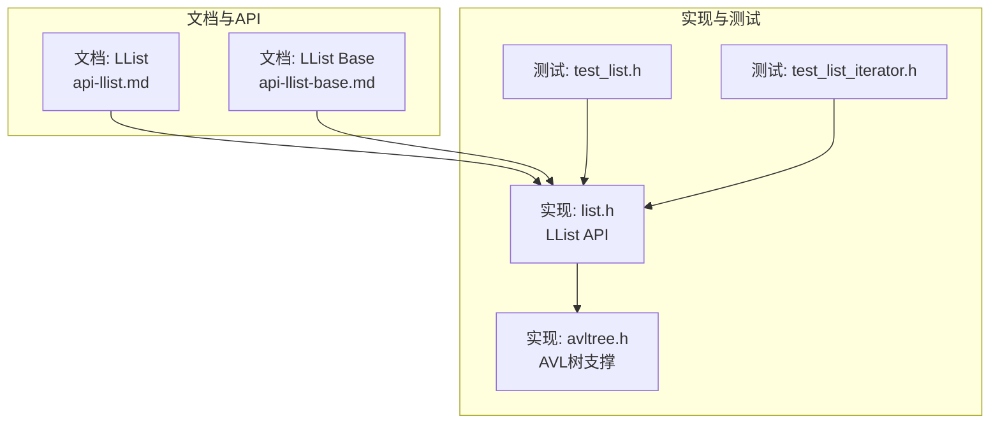
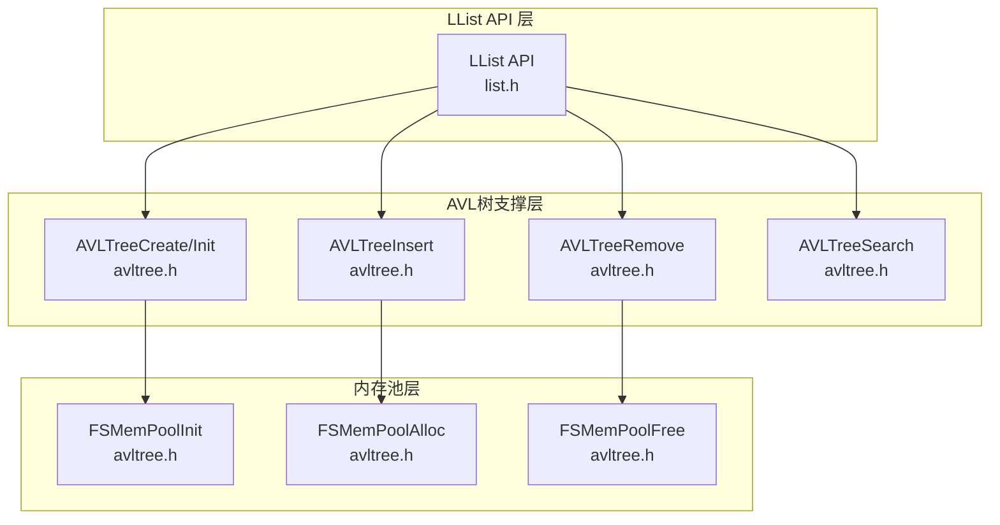
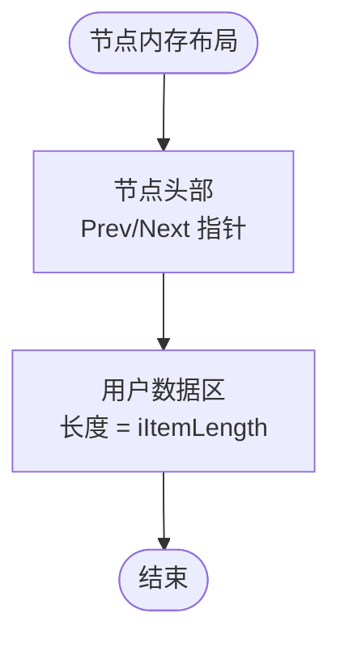
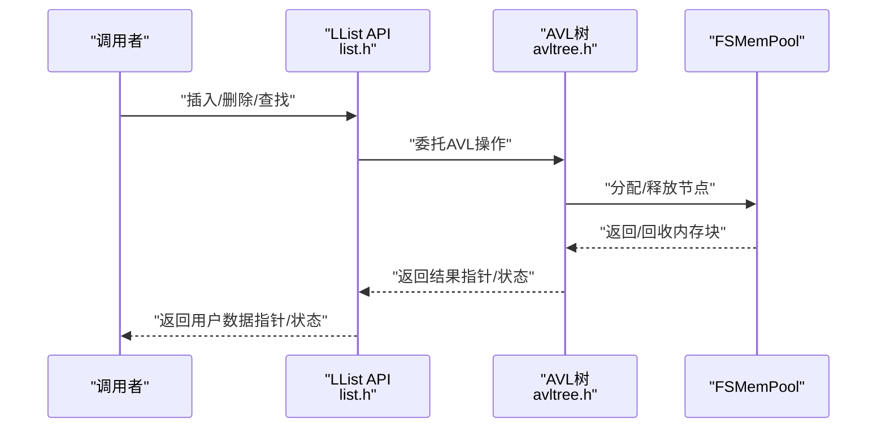
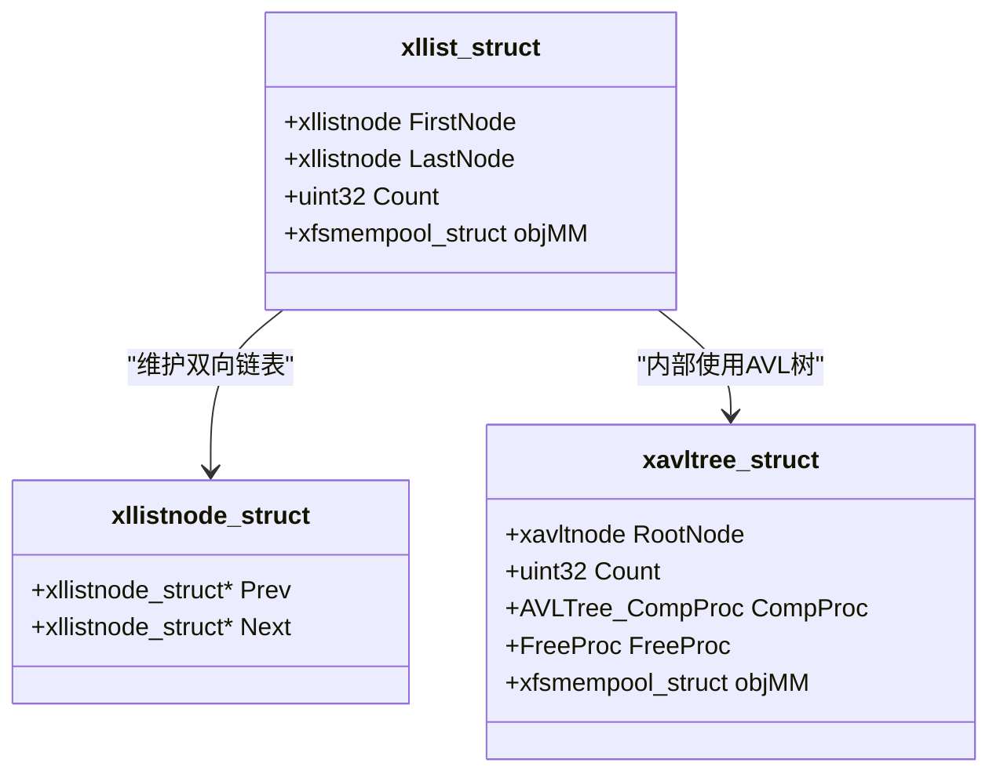
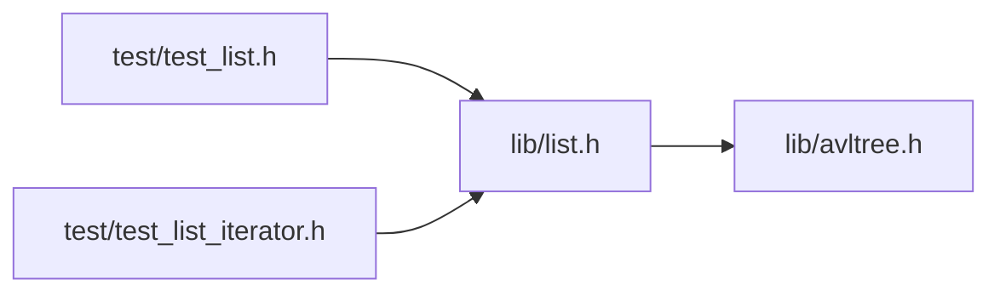

# 双向链表

<cite>
**本文引用的文件**
- [api-llist.md](file://docs/api-llist.md)
- [api-llist-base.md](file://docs/api-llist-base.md)
- [list.h](file://lib/list.h)
- [avltree.h](file://lib/avltree.h)
- [test_list.h](file://test/test_list.h)
- [test_list_iterator.h](file://test/test_list_iterator.h)
</cite>

## 目录
1. [简介](#简介)
2. [项目结构](#项目结构)
3. [核心组件](#核心组件)
4. [架构总览](#架构总览)
5. [详细组件分析](#详细组件分析)
6. [依赖关系分析](#依赖关系分析)
7. [性能考量](#性能考量)
8. [故障排查指南](#故障排查指南)
9. [结论](#结论)
10. [附录](#附录)

## 简介
本文件面向XRT双向链表模块，系统化阐述其设计与实现要点，涵盖节点结构、指针管理、内存布局；核心操作（插入、删除、查找、遍历）的时间复杂度与流程；内存管理机制（节点分配策略、FSMemPool集成、GC支持）；API使用指南（迭代器、自定义比较、排序思路）；性能分析与典型使用场景（频繁插入删除、队列、LRU缓存），并给出内存优化与调试建议。

## 项目结构
XRT提供了两套链表实现：
- 高级链表（LList）：自动内存管理，基于FSMemPool，支持O(1)插入/删除与双向遍历。
- 基础链表（LList Base）：底层操作，用户自行管理节点内存，适合自定义内存管理与嵌入式场景。

下图概览两类链表的关系与职责边界：

图表来源
- [api-llist.md](file://docs/api-llist.md#L1-L31)
- [api-llist-base.md](file://docs/api-llist-base.md#L1-L31)
- [list.h](file://lib/list.h#L18-L47)
- [avltree.h](file://lib/avltree.h#L4-L32)
- [test_list.h](file://test/test_list.h#L21-L274)
- [test_list_iterator.h](file://test/test_list_iterator.h#L6-L196)

章节来源
- [api-llist.md](file://docs/api-llist.md#L1-L31)
- [api-llist-base.md](file://docs/api-llist-base.md#L1-L31)

## 核心组件
- 高级链表（LList）
  - 自动内存管理：节点由FSMemPool分配与释放，支持垃圾回收。
  - O(1)插入/删除：通过链表节点前后指针直接调整，无需扫描。
  - 双向遍历：支持正向与反向遍历。
  - 关键API：创建/销毁、插入（前/后）、删除、查找、遍历、计数等。
- 基础链表（LList Base）
  - 用户自管节点内存：插入/删除均不负责分配/释放节点。
  - 零开销：无额外内存管理逻辑。
  - 适用于多链表共享节点、嵌入式与自定义内存管理。

章节来源
- [api-llist.md](file://docs/api-llist.md#L22-L32)
- [api-llist-base.md](file://docs/api-llist-base.md#L21-L31)

## 架构总览
LList在内部以AVL树组织键值映射，并将“用户数据”紧随键值之后存储，从而在保持有序的同时，仍能通过链表节点指针进行O(1)的插入/删除。FSMemPool负责节点内存的批量分配与回收，支持GC。

图表来源
- [list.h](file://lib/list.h#L18-L47)
- [avltree.h](file://lib/avltree.h#L4-L32)
- [avltree.h](file://lib/avltree.h#L62-L105)

## 详细组件分析

### 节点结构与内存布局
- LList节点内存布局（文档描述）：
  - 节点头部：双向指针（Prev/Next）。
  - 用户数据区：紧随节点头部之后，长度由创建时指定。
- LList Base节点内存布局：
  - 用户自定义节点结构需将链表节点作为首个成员，确保节点指针与结构体指针可互转。

图表来源
- [api-llist.md](file://docs/api-llist.md#L33-L47)
- [api-llist-base.md](file://docs/api-llist-base.md#L50-L62)

章节来源
- [api-llist.md](file://docs/api-llist.md#L33-L47)
- [api-llist-base.md](file://docs/api-llist-base.md#L50-L62)

### 核心操作与复杂度
- 插入（前/后）：O(1)。通过调整相邻节点的Prev/Next指针完成。
- 删除：O(1)。摘除节点并交还内存池。
- 查找：基于AVL树，平均O(log N)，最坏O(N)退化为线性。
- 遍历：线性时间O(N)。支持正向与反向遍历。
- 计数：O(1)。维护Count字段。

章节来源
- [api-llist.md](file://docs/api-llist.md#L26-L31)
- [list.h](file://lib/list.h#L18-L47)

### 内存管理机制
- 分配策略
  - LList：节点由FSMemPool批量分配，减少碎片与调用开销。
  - LList Base：用户自分配，可接入任意分配器（如BSMM、自研内存池）。
- 回收与GC
  - LList：删除节点后立即归还FSMemPool；FSMemPool支持GC，便于周期性回收。
  - LList Base：删除后需用户自行释放节点内存。
- 内存池集成
  - AVL树初始化时绑定FSMemPool，节点键值与数据连续存储于同一块内存中，提升局部性与缓存命中。

图表来源
- [list.h](file://lib/list.h#L18-L47)
- [avltree.h](file://lib/avltree.h#L62-L105)

章节来源
- [api-llist.md](file://docs/api-llist.md#L26-L31)
- [avltree.h](file://lib/avltree.h#L24-L32)
- [avltree.h](file://lib/avltree.h#L62-L105)

### API使用指南
- 基本生命周期
  - 创建：LList创建时指定用户数据长度；销毁时释放所有节点与内存池。
  - 初始化/释放：支持栈上/嵌入式场景的初始化与释放。
- 节点操作
  - 插入（前/后）：在指定节点前/后插入新节点，返回新节点指针，用户数据位于“节点+1”处。
  - 删除：从链表摘除并归还内存池。
  - 查找/计数/遍历：通过链表指针或迭代器访问。
- 迭代器与遍历
  - 文档提供多种遍历与迭代器示例，包括宏迭代、类型化宏迭代、提前退出等。
- 自定义比较与排序
  - LList内部使用AVL树，比较函数由上层传入；若需按键排序，可利用AVL树的有序性质进行线性遍历。
  - 对于更复杂的排序需求，可在遍历时收集到数组再使用外部排序算法。

章节来源
- [api-llist.md](file://docs/api-llist.md#L80-L227)
- [api-llist.md](file://docs/api-llist.md#L229-L551)
- [api-llist.md](file://docs/api-llist.md#L555-L736)
- [test_list_iterator.h](file://test/test_list_iterator.h#L54-L152)

### 性能分析与使用场景
- 频繁插入/删除
  - LList在任意位置插入/删除均为O(1)，适合动态集合管理。
- 队列实现
  - 以链表实现队列，入队/出队均在端点进行，时间复杂度O(1)。
- LRU缓存
  - 利用链表的O(1)移动能力，结合哈希定位，实现O(1)的命中更新与淘汰。
- 性能权衡
  - AVL树保证有序性，但带来O(log N)的查找成本；若仅需O(1)插入/删除且不要求有序，可考虑基础链表或哈希+链表组合。

章节来源
- [api-llist.md](file://docs/api-llist.md#L555-L736)
- [list.h](file://lib/list.h#L18-L47)

### 类与关系示意（代码级）

图表来源
- [api-llist.md](file://docs/api-llist.md#L55-L77)
- [api-llist.md](file://docs/api-llist.md#L68-L67)
- [list.h](file://lib/list.h#L38-L47)

## 依赖关系分析
- LList API依赖AVL树实现键值管理与内存池集成。
- AVL树初始化时绑定FSMemPool，节点键值与数据连续存储，降低碎片并提升缓存效率。
- 测试用例覆盖基本增删改查、遍历与大样本压力测试，验证性能与正确性。

图表来源
- [list.h](file://lib/list.h#L18-L47)
- [avltree.h](file://lib/avltree.h#L4-L32)
- [test_list.h](file://test/test_list.h#L21-L274)
- [test_list_iterator.h](file://test/test_list_iterator.h#L6-L196)

章节来源
- [list.h](file://lib/list.h#L18-L47)
- [avltree.h](file://lib/avltree.h#L4-L32)
- [test_list.h](file://test/test_list.h#L21-L274)
- [test_list_iterator.h](file://test/test_list_iterator.h#L6-L196)

## 性能考量
- 时间复杂度
  - 插入/删除：O(1)
  - 查找：平均O(log N)，最坏O(N)
  - 遍历：O(N)
- 空间与内存
  - LList：节点键值+数据连续存储，减少碎片；FSMemPool批量分配降低系统调用开销。
  - LList Base：用户自控内存，可按需定制分配策略。
- GC与回收
  - LList支持GC，适合长生命周期应用；短生命周期对象建议及时销毁以避免内存占用。

## 故障排查指南
- 常见问题
  - 访问用户数据错误：应使用“节点指针+1”获取用户数据起始地址，而非直接将节点指针当作数据指针。
  - 遍历时删除：应先保存下一个节点指针，再删除当前节点，避免破坏链表结构。
  - LList Base未释放节点：删除节点后需用户自行释放，否则造成内存泄漏。
- 调试技巧
  - 使用测试用例验证：参考测试文件中的遍历、迭代、压力测试，快速定位问题。
  - 观察内存池状态：关注FSMemPool的页/块统计信息，确认分配与回收是否正常。

章节来源
- [api-llist.md](file://docs/api-llist.md#L761-L792)
- [api-llist-base.md](file://docs/api-llist-base.md#L751-L800)
- [test_list.h](file://test/test_list.h#L21-L274)
- [test_list_iterator.h](file://test/test_list_iterator.h#L6-L196)

## 结论
XRT的双向链表模块提供了两种互补实现：高级链表强调易用与自动内存管理，基础链表强调灵活性与零开销。二者均以O(1)的插入/删除满足高频变更场景，结合AVL树与FSMemPool，在性能与内存管理之间取得良好平衡。根据具体需求选择合适的实现，并遵循正确的遍历与内存管理实践，可获得稳定高效的链表使用体验。

## 附录
- 术语
  - LList：自动内存管理的双向链表。
  - LList Base：底层链表操作，用户自管节点内存。
  - AVL树：用于键值管理与有序性保障。
  - FSMemPool：内存池，负责节点内存的批量分配与回收。
- 参考路径
  - LList API文档：[api-llist.md](file://docs/api-llist.md)
  - LList Base API文档：[api-llist-base.md](file://docs/api-llist-base.md)
  - 实现与支撑：[list.h](file://lib/list.h)、[avltree.h](file://lib/avltree.h)
  - 测试用例：[test_list.h](file://test/test_list.h)、[test_list_iterator.h](file://test/test_list_iterator.h)