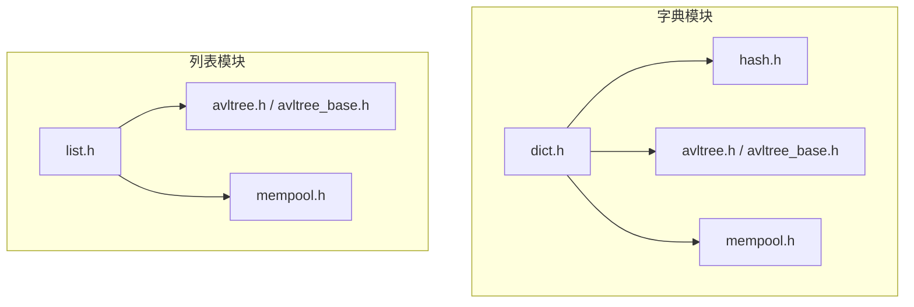
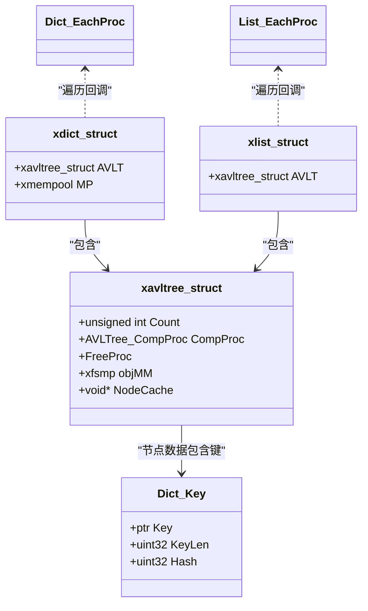
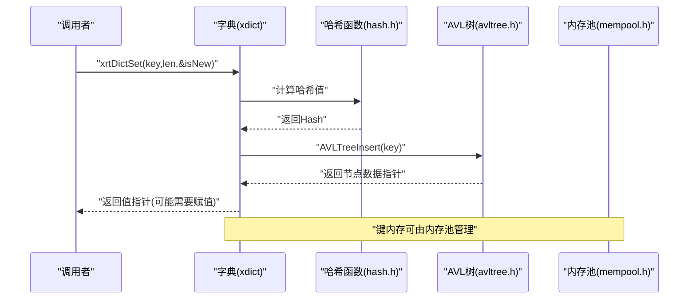
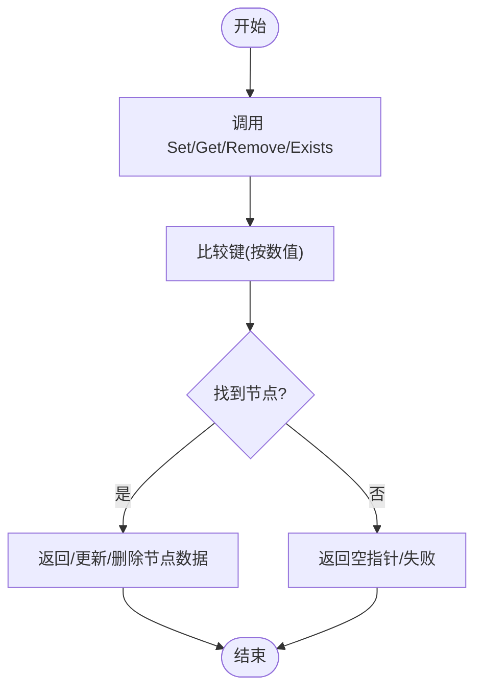
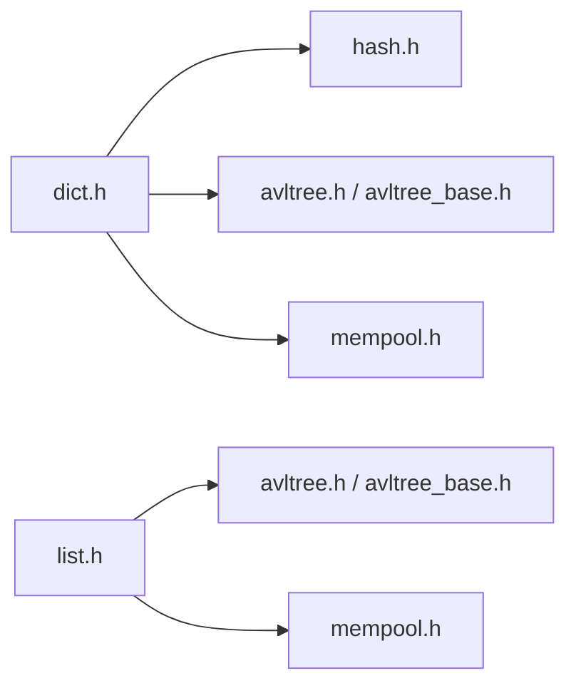

# 字典和列表

<cite>
**本文引用的文件**
- [lib/dict.h](file://lib/dict.h)
- [lib/list.h](file://lib/list.h)
- [lib/avltree.h](file://lib/avltree.h)
- [lib/avltree_base.h](file://lib/avltree_base.h)
- [lib/hash.h](file://lib/hash.h)
- [lib/mempool.h](file://lib/mempool.h)
- [docs/api-dict.md](file://docs/api-dict.md)
- [docs/api-list.md](file://docs/api-list.md)
- [test/test_dict.h](file://test/test_dict.h)
- [test/test_list.h](file://test/test_list.h)
</cite>

## 目录
1. [简介](#简介)
2. [项目结构](#项目结构)
3. [核心组件](#核心组件)
4. [架构总览](#架构总览)
5. [详细组件分析](#详细组件分析)
6. [依赖关系分析](#依赖关系分析)
7. [性能考量](#性能考量)
8. [故障排查指南](#故障排查指南)
9. [结论](#结论)
10. [附录](#附录)

## 简介
本文件系统化梳理 XRT 库中的“字典（dict.h）”和“列表（list.h）”模块，重点阐述：
- 字典的键值对存储机制、哈希计算与键比较流程、内存管理与遍历；
- 列表的整数键存储结构、内存管理与遍历；
- 两者均基于 AVL 树实现，具备 O(log n) 的查找/插入/删除性能；
- 提供完整的 API 使用指南、典型应用场景、性能分析与优化建议。

## 项目结构
- 字典与列表均位于 lib 目录，分别提供头文件接口与实现细节；
- 底层依赖 AVL 树（avltree.h、avltree_base.h）、哈希函数（hash.h）、内存池（mempool.h）；
- 文档与测试分别位于 docs 与 test 目录，便于对照学习与验证。

图表来源
- [lib/dict.h](file://lib/dict.h#L1-L204)
- [lib/list.h](file://lib/list.h#L1-L188)
- [lib/avltree.h](file://lib/avltree.h#L1-L126)
- [lib/avltree_base.h](file://lib/avltree_base.h#L1-L200)
- [lib/hash.h](file://lib/hash.h#L1-L1234)
- [lib/mempool.h](file://lib/mempool.h#L1-L200)

章节来源
- [lib/dict.h](file://lib/dict.h#L1-L204)
- [lib/list.h](file://lib/list.h#L1-L188)
- [lib/avltree.h](file://lib/avltree.h#L1-L126)
- [lib/avltree_base.h](file://lib/avltree_base.h#L1-L200)
- [lib/hash.h](file://lib/hash.h#L1-L1234)
- [lib/mempool.h](file://lib/mempool.h#L1-L200)

## 核心组件
- 字典（xdict）：基于 AVL 树的键值对容器，键为任意二进制数据，值可为固定大小数据或指针；支持内存池管理键内存。
- 列表（xlist）：基于 AVL 树的整数键容器，键为 int64，值可为固定大小数据或指针；支持稀疏存储与按键升序遍历。
- 底层支撑：
  - AVL 树：提供平衡二叉搜索树的插入、删除、查找与遍历；
  - 哈希函数：为字典键提供快速比较的哈希值（32/64 位）；
  - 内存池：高效管理节点与键内存，减少频繁分配带来的碎片与开销。

章节来源
- [lib/dict.h](file://lib/dict.h#L29-L68)
- [lib/list.h](file://lib/list.h#L18-L47)
- [lib/avltree.h](file://lib/avltree.h#L24-L59)
- [lib/avltree_base.h](file://lib/avltree_base.h#L137-L170)
- [lib/hash.h](file://lib/hash.h#L594-L602)
- [lib/mempool.h](file://lib/mempool.h#L35-L145)

## 架构总览
字典与列表共享相同的 AVL 树抽象，差异在于键类型与比较逻辑：
- 字典：键为二进制数据，使用哈希值与长度辅助快速比较，最终以 memcmp 完成精确比较；
- 列表：键为 int64，直接按数值比较；
- 两者均通过内存池管理节点与键内存，支持回调遍历。

图表来源
- [lib/dict.h](file://lib/dict.h#L58-L90)
- [lib/list.h](file://lib/list.h#L63-L72)
- [lib/avltree.h](file://lib/avltree.h#L24-L32)

章节来源
- [lib/dict.h](file://lib/dict.h#L58-L90)
- [lib/list.h](file://lib/list.h#L63-L72)
- [lib/avltree.h](file://lib/avltree.h#L24-L32)

## 详细组件分析

### 字典（dict.h）
- 键结构与哈希计算
  - Dict_Key 包含键指针、长度与哈希值；
  - 平台相关宏选择 32/64 位哈希函数；
  - 比较流程：先比较哈希，再比较长度，最后以 memcmp 比较内容。
- API 操作
  - 创建/销毁/初始化/释放：xrtDictCreate/xrtDictDestroy/xrtDictInit/xrtDictUnit；
  - 设置/获取/删除/存在性检查：xrtDictSet/xrtDictGet/xrtDictRemove/xrtDictExists；
  - 指针模式：xrtDictSetPtr/xrtDictGetPtr/xrtDictRemovePtr；
  - 遍历：xrtDictWalk；
  - 元素计数：xrtDictCount。
- 内存管理
  - 可绑定内存池（MP），键内存由内存池或标准分配器管理；
  - FreeProc 在删除节点时负责释放键内存；
  - 遍历回调支持中断（返回 false）。
- 性能与复杂度
  - 基于 AVL 树，查找/插入/删除均为 O(log n)；
  - 哈希值用于快速筛选，但最终仍需精确比较，避免冲突导致的额外开销。

图表来源
- [lib/dict.h](file://lib/dict.h#L71-L103)
- [lib/hash.h](file://lib/hash.h#L594-L602)
- [lib/avltree.h](file://lib/avltree.h#L62-L90)
- [lib/mempool.h](file://lib/mempool.h#L148-L200)

章节来源
- [lib/dict.h](file://lib/dict.h#L4-L25)
- [lib/dict.h](file://lib/dict.h#L71-L165)
- [lib/dict.h](file://lib/dict.h#L174-L201)
- [lib/hash.h](file://lib/hash.h#L594-L602)
- [lib/avltree.h](file://lib/avltree.h#L62-L90)
- [lib/mempool.h](file://lib/mempool.h#L148-L200)

### 列表（list.h）
- 键结构与比较
  - 键为 int64，比较函数按数值大小比较；
  - 通过 AVL 树实现稀疏存储与按键升序遍历。
- API 操作
  - 创建/销毁/初始化/释放：xrtListCreate/xrtListDestroy/xrtListInit/xrtListUnit；
  - 设置/获取/删除/存在性检查：xrtListSet/xrtListGet/xrtListRemove/xrtListExists；
  - 指针模式：xrtListSetPtr/xrtListGetPtr/xrtListRemovePtr；
  - 遍历：xrtListWalk；
  - 元素计数：xrtListCount。
- 内存管理
  - 节点内存由内存池统一管理；
  - 删除时释放节点与值（如值为指针，需自行释放）。
- 性能与复杂度
  - 基于 AVL 树，查找/插入/删除均为 O(log n)；
  - 支持负索引与跳跃索引，适合稀疏场景。

图表来源
- [lib/list.h](file://lib/list.h#L50-L149)
- [lib/avltree.h](file://lib/avltree.h#L93-L123)

章节来源
- [lib/list.h](file://lib/list.h#L5-L14)
- [lib/list.h](file://lib/list.h#L50-L149)
- [lib/list.h](file://lib/list.h#L158-L185)
- [lib/avltree.h](file://lib/avltree.h#L93-L123)

### 遍历与回调
- 字典遍历：中序遍历 AVL 树，按键的哈希值排序输出；
- 列表遍历：中序遍历 AVL 树，按键升序输出；
- 回调返回 true 继续，false 中断。

章节来源
- [lib/dict.h](file://lib/dict.h#L174-L201)
- [lib/list.h](file://lib/list.h#L158-L185)

## 依赖关系分析
- 字典依赖
  - 哈希函数：用于快速比较与键排序；
  - AVL 树：提供平衡搜索树能力；
  - 内存池：可选的键内存管理；
- 列表依赖
  - AVL 树：提供平衡搜索树能力；
  - 内存池：统一节点内存管理。

图表来源
- [lib/dict.h](file://lib/dict.h#L4-L9)
- [lib/list.h](file://lib/list.h#L1-L14)
- [lib/avltree.h](file://lib/avltree.h#L1-L126)
- [lib/avltree_base.h](file://lib/avltree_base.h#L1-L200)
- [lib/hash.h](file://lib/hash.h#L1-L1234)
- [lib/mempool.h](file://lib/mempool.h#L1-L200)

章节来源
- [lib/dict.h](file://lib/dict.h#L4-L9)
- [lib/list.h](file://lib/list.h#L1-L14)
- [lib/avltree.h](file://lib/avltree.h#L1-L126)
- [lib/avltree_base.h](file://lib/avltree_base.h#L1-L200)
- [lib/hash.h](file://lib/hash.h#L1-L1234)
- [lib/mempool.h](file://lib/mempool.h#L1-L200)

## 性能考量
- 时间复杂度
  - 字典/列表：查找/插入/删除均为 O(log n)；
  - 遍历：O(n)（中序遍历）。
- 空间复杂度
  - 字典/列表：每个节点包含键与用户数据，空间与元素数量线性相关；
  - 内存池可降低频繁分配的开销，提升吞吐。
- 哈希函数
  - 字典使用 32/64 位哈希函数，加速键比较；
  - 哈希碰撞会增加后续比较成本，建议选择高质量哈希并合理设计键分布。
- 实测参考
  - 测试用例展示了百万级插入与千万级查询的耗时统计思路，可用于性能评估与对比。

章节来源
- [lib/avltree_base.h](file://lib/avltree_base.h#L137-L170)
- [test/test_dict.h](file://test/test_dict.h#L170-L241)
- [test/test_list.h](file://test/test_list.h#L159-L226)

## 故障排查指南
- 常见问题
  - 销毁顺序：字典/列表销毁前，若值为指针，需确保释放外部资源；
  - 内存泄漏：启用内存池时，确保正确初始化与释放；
  - 遍历中断：回调返回 false 可提前退出，注意业务逻辑一致性。
- 定位手段
  - 使用测试样例进行压力测试与回归验证；
  - 关注节点计数与内存池状态变化，定位异常增长。

章节来源
- [docs/api-dict.md](file://docs/api-dict.md#L205-L218)
- [docs/api-list.md](file://docs/api-list.md#L160-L170)
- [test/test_dict.h](file://test/test_dict.h#L256-L278)
- [test/test_list.h](file://test/test_list.h#L241-L261)

## 结论
- 字典与列表均以 AVL 树为核心，提供稳定的 O(log n) 性能；
- 字典支持任意二进制键与哈希加速，列表支持整数键与稀疏存储；
- 通过内存池与回调遍历，满足高并发与复杂业务场景；
- 建议结合具体场景选择合适的数据结构，并关注哈希质量与内存管理策略。

## 附录

### API 使用速查（字典）
- 创建/销毁/初始化/释放：xrtDictCreate/xrtDictDestroy/xrtDictInit/xrtDictUnit
- 设置/获取/删除/存在性：xrtDictSet/xrtDictGet/xrtDictRemove/xrtDictExists
- 指针模式：xrtDictSetPtr/xrtDictGetPtr/xrtDictRemovePtr
- 遍历与计数：xrtDictWalk/xrtDictCount

章节来源
- [docs/api-dict.md](file://docs/api-dict.md#L152-L218)
- [docs/api-dict.md](file://docs/api-dict.md#L281-L335)
- [docs/api-dict.md](file://docs/api-dict.md#L339-L388)
- [docs/api-dict.md](file://docs/api-dict.md#L412-L463)
- [docs/api-dict.md](file://docs/api-dict.md#L467-L482)
- [docs/api-dict.md](file://docs/api-dict.md#L496-L543)
- [docs/api-dict.md](file://docs/api-dict.md#L547-L586)
- [docs/api-dict.md](file://docs/api-dict.md#L590-L632)
- [docs/api-dict.md](file://docs/api-dict.md#L675-L727)

### API 使用速查（列表）
- 创建/销毁/初始化/释放：xrtListCreate/xrtListDestroy/xrtListInit/xrtListUnit
- 设置/获取/删除/存在性：xrtListSet/xrtListGet/xrtListRemove/xrtListExists
- 指针模式：xrtListSetPtr/xrtListGetPtr/xrtListRemovePtr
- 遍历与计数：xrtListWalk/xrtListCount

章节来源
- [docs/api-list.md](file://docs/api-list.md#L114-L154)
- [docs/api-list.md](file://docs/api-list.md#L236-L291)
- [docs/api-list.md](file://docs/api-list.md#L295-L340)
- [docs/api-list.md](file://docs/api-list.md#L344-L392)
- [docs/api-list.md](file://docs/api-list.md#L396-L408)
- [docs/api-list.md](file://docs/api-list.md#L411-L456)
- [docs/api-list.md](file://docs/api-list.md#L460-L498)
- [docs/api-list.md](file://docs/api-list.md#L502-L535)
- [docs/api-list.md](file://docs/api-list.md#L578-L627)

### 实际使用示例（摘自文档）
- 字典：配置管理、对象缓存、双向映射等场景示例；
- 列表：稀疏数组、动态对象集合、双向映射等场景示例。

章节来源
- [docs/api-dict.md](file://docs/api-dict.md#L731-L785)
- [docs/api-dict.md](file://docs/api-dict.md#L789-L800)
- [docs/api-list.md](file://docs/api-list.md#L635-L667)
- [docs/api-list.md](file://docs/api-list.md#L672-L730)
- [docs/api-list.md](file://docs/api-list.md#L734-L771)