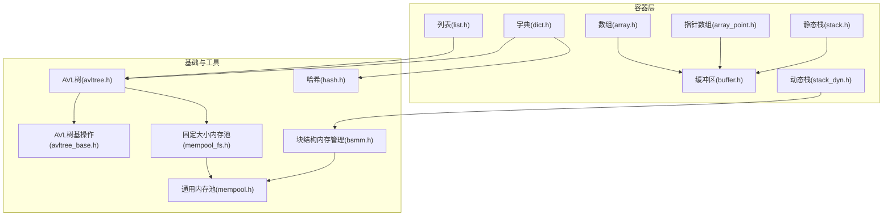
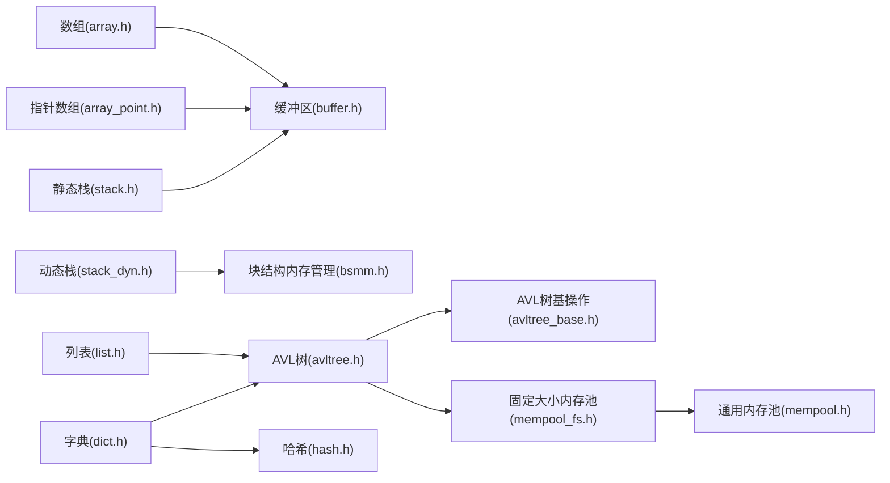
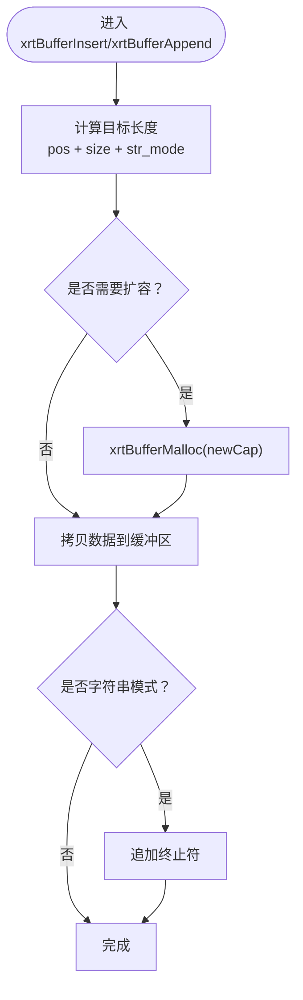
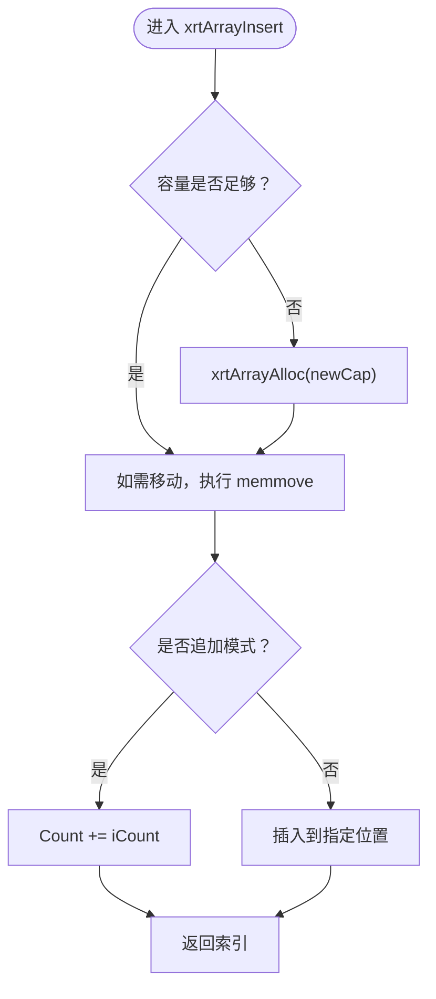
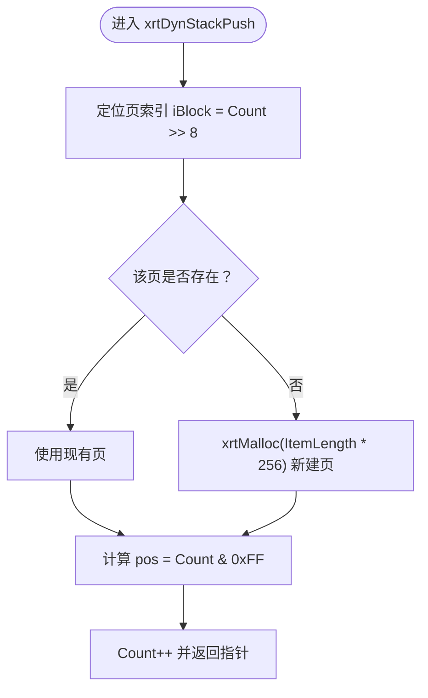
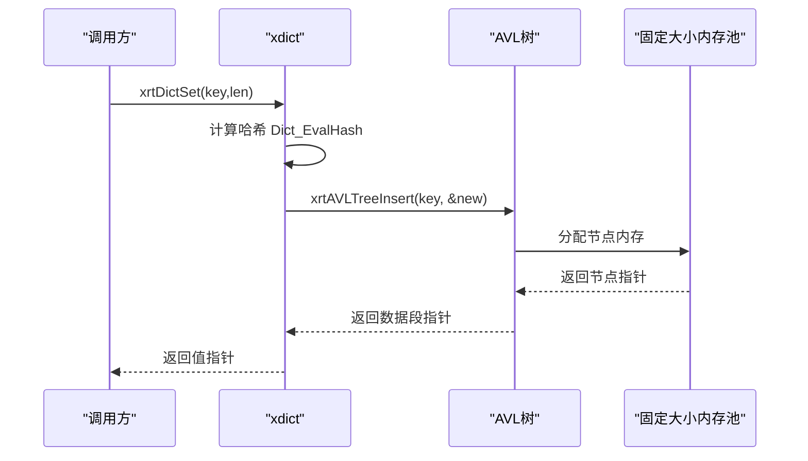
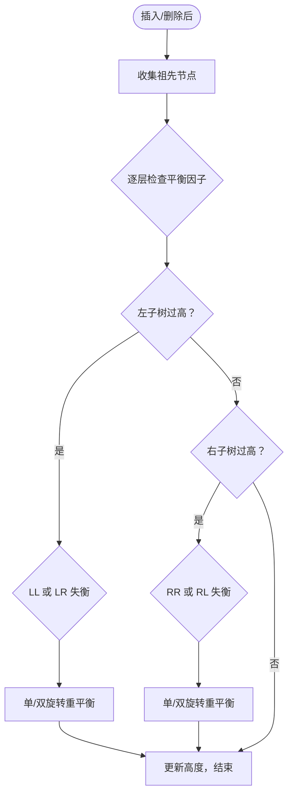
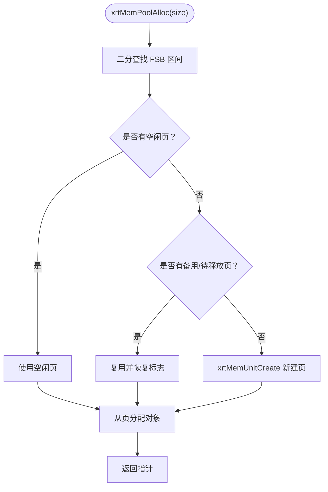
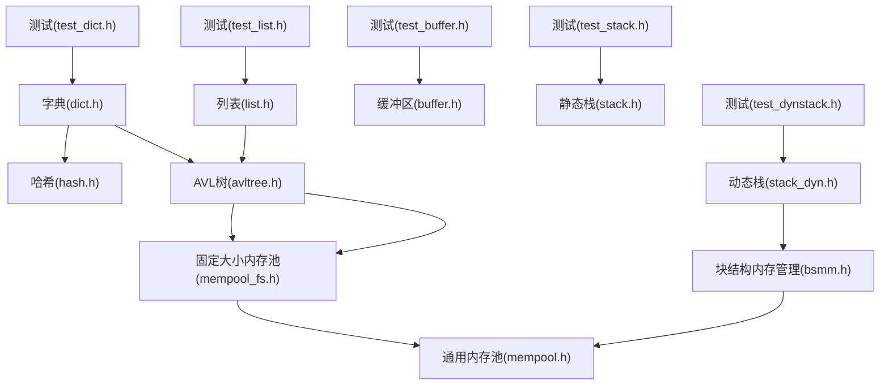

# 数据结构

<cite>
**本文引用的文件**
- [lib/array.h](file://lib/array.h)
- [lib/array_point.h](file://lib/array_point.h)
- [lib/buffer.h](file://lib/buffer.h)
- [lib/stack.h](file://lib/stack.h)
- [lib/stack_dyn.h](file://lib/stack_dyn.h)
- [lib/list.h](file://lib/list.h)
- [lib/dict.h](file://lib/dict.h)
- [lib/avltree.h](file://lib/avltree.h)
- [lib/avltree_base.h](file://lib/avltree_base.h)
- [lib/mempool.h](file://lib/mempool.h)
- [lib/mempool_fs.h](file://lib/mempool_fs.h)
- [lib/bsmm.h](file://lib/bsmm.h)
- [lib/hash.h](file://lib/hash.h)
- [test/test_buffer.h](file://test/test_buffer.h)
- [test/test_stack.h](file://test/test_stack.h)
- [test/test_dynstack.h](file://test/test_dynstack.h)
- [test/test_list.h](file://test/test_list.h)
- [test/test_dict.h](file://test/test_dict.h)
</cite>

## 目录
1. [简介](#简介)
2. [项目结构](#项目结构)
3. [核心组件](#核心组件)
4. [架构总览](#架构总览)
5. [详细组件分析](#详细组件分析)
6. [依赖关系分析](#依赖关系分析)
7. [性能考量](#性能考量)
8. [故障排查指南](#故障排查指南)
9. [结论](#结论)
10. [附录](#附录)

## 简介
本文件系统化梳理 XRT 数据结构模块，覆盖动态缓冲区、数组、栈（静态/动态）、双向链表（基于 AVL 的有序映射）、字典（基于 AVL 的哈希映射）等核心容器。文档重点阐述：
- 设计理念与实现要点
- 自动扩容与内存优化策略
- API 接口与复杂度特征
- 内存池集成与性能调优建议
- 数据结构选择指南与使用示例

## 项目结构
XRT 数据结构模块位于 lib 目录，配套测试位于 test 目录。各模块职责清晰，相互解耦并通过公共内存池与工具函数协同工作。

图表来源
- [lib/array.h](file://lib/array.h#L1-L180)
- [lib/array_point.h](file://lib/array_point.h#L1-L199)
- [lib/buffer.h](file://lib/buffer.h#L1-L116)
- [lib/stack.h](file://lib/stack.h#L1-L135)
- [lib/stack_dyn.h](file://lib/stack_dyn.h#L1-L162)
- [lib/list.h](file://lib/list.h#L1-L188)
- [lib/dict.h](file://lib/dict.h#L1-L204)
- [lib/avltree.h](file://lib/avltree.h#L1-L126)
- [lib/avltree_base.h](file://lib/avltree_base.h#L1-L423)
- [lib/mempool_fs.h](file://lib/mempool_fs.h#L1-L257)
- [lib/mempool.h](file://lib/mempool.h#L1-L468)
- [lib/bsmm.h](file://lib/bsmm.h#L1-L94)
- [lib/hash.h](file://lib/hash.h#L1-L800)

章节来源
- [lib/array.h](file://lib/array.h#L1-L180)
- [lib/buffer.h](file://lib/buffer.h#L1-L116)
- [lib/stack.h](file://lib/stack.h#L1-L135)
- [lib/stack_dyn.h](file://lib/stack_dyn.h#L1-L162)
- [lib/list.h](file://lib/list.h#L1-L188)
- [lib/dict.h](file://lib/dict.h#L1-L204)
- [lib/avltree.h](file://lib/avltree.h#L1-L126)
- [lib/avltree_base.h](file://lib/avltree_base.h#L1-L423)
- [lib/mempool_fs.h](file://lib/mempool_fs.h#L1-L257)
- [lib/mempool.h](file://lib/mempool.h#L1-L468)
- [lib/bsmm.h](file://lib/bsmm.h#L1-L94)
- [lib/hash.h](file://lib/hash.h#L1-L800)

## 核心组件
- 动态缓冲区（xbuffer）
  - 自动扩容步进：按 AllocStep 增长，避免频繁 Realloc
  - 支持字符串模式自动追加终止符
  - 提供插入/追加/裁剪/清空等操作
- 数组（xarray）
  - 256 步进扩容策略（通过 AllocStep 实现）
  - 支持中间插入/追加/删除/交换/排序
- 静态栈（xstack）
  - 栈内存内嵌于结构体之后，容量固定
  - O(1) 压栈/出栈/取栈顶
- 动态栈（xdynstack）
  - 以 256 项为页的块结构管理，按需增长
  - 出栈延迟释放整页，降低碎片与分配次数
- 列表（xlist）
  - 基于 AVL 的有序映射，键为 int64
  - 提供 Set/Get/Remove/遍历等操作
- 字典（xdict）
  - 基于 AVL 的哈希映射，键为可变长度字节串
  - 内部使用哈希函数计算键哈希，冲突由 AVL 解决
- AVL 平衡树（xavltree）
  - 自平衡插入/删除/查找
  - 提供迭代器与遍历回调
- 内存池（xmempool/xfsmpool）
  - 通用内存池与固定大小内存池
  - 两级链表管理空闲/满载/备用页，支持 GC

章节来源
- [lib/buffer.h](file://lib/buffer.h#L1-L116)
- [lib/array.h](file://lib/array.h#L1-L180)
- [lib/stack.h](file://lib/stack.h#L1-L135)
- [lib/stack_dyn.h](file://lib/stack_dyn.h#L1-L162)
- [lib/list.h](file://lib/list.h#L1-L188)
- [lib/dict.h](file://lib/dict.h#L1-L204)
- [lib/avltree.h](file://lib/avltree.h#L1-L126)
- [lib/avltree_base.h](file://lib/avltree_base.h#L1-L423)
- [lib/mempool.h](file://lib/mempool.h#L1-L468)
- [lib/mempool_fs.h](file://lib/mempool_fs.h#L1-L257)
- [lib/bsmm.h](file://lib/bsmm.h#L1-L94)
- [lib/hash.h](file://lib/hash.h#L1-L800)

## 架构总览
XRT 数据结构模块采用“容器 + 基础树 + 内存池”的分层设计：
- 容器层：数组、缓冲区、栈、列表、字典
- 基础层：AVL 树与树基操作，哈希函数
- 内存层：通用内存池与固定大小内存池，块结构内存管理

图表来源
- [lib/array.h](file://lib/array.h#L1-L180)
- [lib/array_point.h](file://lib/array_point.h#L1-L199)
- [lib/buffer.h](file://lib/buffer.h#L1-L116)
- [lib/stack.h](file://lib/stack.h#L1-L135)
- [lib/stack_dyn.h](file://lib/stack_dyn.h#L1-L162)
- [lib/list.h](file://lib/list.h#L1-L188)
- [lib/dict.h](file://lib/dict.h#L1-L204)
- [lib/avltree.h](file://lib/avltree.h#L1-L126)
- [lib/avltree_base.h](file://lib/avltree_base.h#L1-L423)
- [lib/mempool_fs.h](file://lib/mempool_fs.h#L1-L257)
- [lib/mempool.h](file://lib/mempool.h#L1-L468)
- [lib/bsmm.h](file://lib/bsmm.h#L1-L94)
- [lib/hash.h](file://lib/hash.h#L1-L800)

## 详细组件分析

### 动态缓冲区（xbuffer）与自动扩容
- 设计要点
  - 以 AllocStep 为步进增量分配，减少 Realloc 次数
  - 支持多种字符串编码模式，自动追加终止符
  - 插入/追加均触发扩容判断，保证写入安全
- 关键流程

图表来源
- [lib/buffer.h](file://lib/buffer.h#L75-L113)

- 性能特征
  - 时间复杂度：扩容时 O(n)（Realloc + 拷贝），常规写入摊还接近 O(1)
  - 空间复杂度：O(capacity)，按 AllocStep 增长
- 内存优化
  - 通过较大的 AllocStep 降低扩容频率
  - 字符串模式自动终止符，避免重复处理

章节来源
- [lib/buffer.h](file://lib/buffer.h#L1-L116)

### 数组（xarray）与 256 步进扩容
- 设计要点
  - 以 AllocStep 为步进增长，插入时若容量不足则扩容至 Count + iCount + Step
  - 支持中间插入/追加/删除/交换/排序
- 关键流程

图表来源
- [lib/array.h](file://lib/array.h#L77-L99)

- 性能特征
  - 插入/删除：平均 O(n)（涉及 memmove）
  - 排序：qsort，O(n log n)
  - 访问：O(1)
- 内存优化
  - 通过 AllocStep 控制扩容粒度，减少频繁 Realloc

章节来源
- [lib/array.h](file://lib/array.h#L1-L180)

### 静态栈（xstack）与动态栈（xdynstack）
- 静态栈（xstack）
  - 内存紧邻结构体，容量固定，适合已知规模且追求零分配场景
  - 压栈/出栈/取栈顶均为 O(1)
- 动态栈（xdynstack）
  - 以 256 项为页的块结构管理，按需增长
  - 出栈延迟释放整页，降低碎片与分配次数
- 关键流程

图表来源
- [lib/stack_dyn.h](file://lib/stack_dyn.h#L44-L68)

- 性能特征
  - 压栈/出栈/取栈顶：摊还 O(1)
  - 出栈延迟释放：当页使用量低于阈值时释放整页
- 内存优化
  - 256 项/页的块结构，减少频繁小块分配
  - 出栈阈值控制（Count + 288）避免过度释放

章节来源
- [lib/stack.h](file://lib/stack.h#L1-L135)
- [lib/stack_dyn.h](file://lib/stack_dyn.h#L1-L162)
- [lib/bsmm.h](file://lib/bsmm.h#L1-L94)

### 列表（xlist）与字典（xdict）
- 列表（xlist）
  - 基于 AVL 的有序映射，键为 int64
  - 提供 Set/Get/Remove/遍历等操作
- 字典（xdict）
  - 基于 AVL 的哈希映射，键为可变长度字节串
  - 内部使用哈希函数计算键哈希，冲突由 AVL 解决
- 关键流程

图表来源
- [lib/dict.h](file://lib/dict.h#L71-L103)
- [lib/avltree.h](file://lib/avltree.h#L62-L90)
- [lib/mempool_fs.h](file://lib/mempool_fs.h#L52-L125)

- 性能特征
  - Set/Get/Remove：平均 O(log n)
  - 遍历：O(n)
- 内存优化
  - 固定大小内存池按页管理，减少碎片
  - AVL 自平衡，避免退化为链表

章节来源
- [lib/list.h](file://lib/list.h#L1-L188)
- [lib/dict.h](file://lib/dict.h#L1-L204)
- [lib/avltree.h](file://lib/avltree.h#L1-L126)
- [lib/avltree_base.h](file://lib/avltree_base.h#L1-L423)
- [lib/mempool_fs.h](file://lib/mempool_fs.h#L1-L257)
- [lib/hash.h](file://lib/hash.h#L594-L602)

### AVL 平衡树（xavltree）与平衡维护
- 设计要点
  - 插入/删除后通过祖先栈回溯重平衡
  - 左旋/右旋处理四种不平衡情形
- 关键流程

图表来源
- [lib/avltree_base.h](file://lib/avltree_base.h#L5-L134)

- 性能特征
  - 插入/删除/查找：O(log n)
  - 遍历：O(n)
- 内存优化
  - 固定大小内存池分配节点，减少碎片

章节来源
- [lib/avltree.h](file://lib/avltree.h#L1-L126)
- [lib/avltree_base.h](file://lib/avltree_base.h#L1-L423)
- [lib/mempool_fs.h](file://lib/mempool_fs.h#L1-L257)

### 内存池（xmempool/xfsmpool）与块结构管理
- 通用内存池（xmempool）
  - 多级区间树（FSB）组织不同大小的内存块
  - 空闲/满载/备用/待释放链表管理页
  - 支持 GC 标记回收
- 固定大小内存池（xfsmpool）
  - 专为固定大小对象设计，按页管理
  - 与块结构内存管理（bsmm）配合
- 关键流程

图表来源
- [lib/mempool.h](file://lib/mempool.h#L148-L261)
- [lib/mempool_fs.h](file://lib/mempool_fs.h#L52-L125)
- [lib/bsmm.h](file://lib/bsmm.h#L52-L82)

- 性能特征
  - 分配/释放：摊还 O(1)
  - GC：遍历空闲/满载页，按标记回收
- 内存优化
  - 页级管理减少碎片
  - 备用页避免临界状态下的频繁创建/销毁

章节来源
- [lib/mempool.h](file://lib/mempool.h#L1-L468)
- [lib/mempool_fs.h](file://lib/mempool_fs.h#L1-L257)
- [lib/bsmm.h](file://lib/bsmm.h#L1-L94)

## 依赖关系分析
- 容器与内存池
  - 列表/字典底层依赖 AVL 树与固定大小内存池
  - 动态栈依赖块结构内存管理与通用内存池
- 哈希与键
  - 字典使用哈希函数计算键哈希，冲突由 AVL 解决
- 测试验证
  - 通过测试用例验证扩容、插入/删除、遍历、压力测试等行为

图表来源
- [lib/dict.h](file://lib/dict.h#L1-L204)
- [lib/hash.h](file://lib/hash.h#L594-L602)
- [lib/avltree.h](file://lib/avltree.h#L1-L126)
- [lib/mempool_fs.h](file://lib/mempool_fs.h#L1-L257)
- [lib/mempool.h](file://lib/mempool.h#L1-L468)
- [lib/stack_dyn.h](file://lib/stack_dyn.h#L1-L162)
- [lib/bsmm.h](file://lib/bsmm.h#L1-L94)
- [test/test_buffer.h](file://test/test_buffer.h#L1-L204)
- [test/test_stack.h](file://test/test_stack.h#L1-L253)
- [test/test_dynstack.h](file://test/test_dynstack.h#L1-L289)
- [test/test_list.h](file://test/test_list.h#L1-L274)
- [test/test_dict.h](file://test/test_dict.h#L1-L291)

章节来源
- [lib/dict.h](file://lib/dict.h#L1-L204)
- [lib/avltree.h](file://lib/avltree.h#L1-L126)
- [lib/mempool_fs.h](file://lib/mempool_fs.h#L1-L257)
- [lib/mempool.h](file://lib/mempool.h#L1-L468)
- [lib/stack_dyn.h](file://lib/stack_dyn.h#L1-L162)
- [lib/bsmm.h](file://lib/bsmm.h#L1-L94)
- [test/test_buffer.h](file://test/test_buffer.h#L1-L204)
- [test/test_stack.h](file://test/test_stack.h#L1-L253)
- [test/test_dynstack.h](file://test/test_dynstack.h#L1-L289)
- [test/test_list.h](file://test/test_list.h#L1-L274)
- [test/test_dict.h](file://test/test_dict.h#L1-L291)

## 性能考量
- 扩容策略
  - 动态缓冲区与数组采用步进式扩容，显著降低 Realloc 频率
  - 动态栈以 256 项为页，按需增长并延迟释放整页
- 访问与遍历
  - 静态栈与数组访问为 O(1)
  - AVL 结构的字典/列表为 O(log n)
- 内存池
  - 通用内存池与固定大小内存池减少碎片，提升分配/释放吞吐
  - GC 可按需回收未使用对象
- 哈希质量
  - 字典使用高性能哈希函数，减少冲突概率

[本节为通用指导，无需列出具体文件来源]

## 故障排查指南
- 分配失败
  - 检查内存池初始化与可用页数量
  - 观察错误日志输出（如“add memory unit failed”）
- 栈溢出
  - 静态栈超出 MaxCount 将返回空指针
  - 动态栈按页增长，确认 ItemLength 与页大小匹配
- AVL 操作异常
  - 确认键比较函数正确实现
  - 检查节点内存是否被正确释放
- 字符串模式问题
  - 确认字符串模式参数与实际数据一致
  - 注意自动终止符的追加

章节来源
- [lib/stack.h](file://lib/stack.h#L18-L25)
- [lib/stack_dyn.h](file://lib/stack_dyn.h#L44-L68)
- [lib/mempool.h](file://lib/mempool.h#L197-L211)
- [lib/mempool_fs.h](file://lib/mempool_fs.h#L97-L101)

## 结论
XRT 数据结构模块通过“容器 + AVL + 内存池”的组合，实现了高可用、低碎片、可扩展的数据结构体系。动态缓冲区与数组的步进扩容、动态栈的页式管理、字典/列表的 AVL 平衡，以及内存池的两级链表管理，共同构成了高效稳定的运行时基础设施。结合测试用例与性能特征，可在不同场景下选择合适的数据结构并进行针对性调优。

[本节为总结性内容，无需列出具体文件来源]

## 附录

### 数据结构选择指南
- 需要连续内存、固定容量、零分配：静态栈（xstack）
- 需要动态增长、零碎片：动态栈（xdynstack）
- 需要顺序访问、频繁插入/删除：数组（xarray）
- 需要动态字符拼接：缓冲区（xbuffer）
- 需要键值映射、有序遍历：列表（xlist）
- 需要键值映射、高性能查找：字典（xdict）

### 使用示例（基于测试用例）
- 缓冲区
  - 创建、追加、插入、生成网页、释放与销毁
- 静态栈
  - 创建、压栈/出栈、越界保护、遍历
- 动态栈
  - 创建、压栈/出栈、越界保护、多页增长
- 列表
  - 创建、Set/Get/Remove、遍历、百万级压力测试
- 字典
  - 创建、Set/Get/Remove、遍历、百万级压力测试

章节来源
- [test/test_buffer.h](file://test/test_buffer.h#L1-L204)
- [test/test_stack.h](file://test/test_stack.h#L1-L253)
- [test/test_dynstack.h](file://test/test_dynstack.h#L1-L289)
- [test/test_list.h](file://test/test_list.h#L1-L274)
- [test/test_dict.h](file://test/test_dict.h#L1-L291)