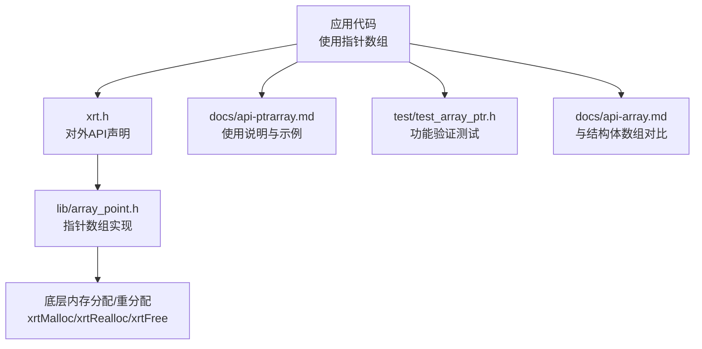
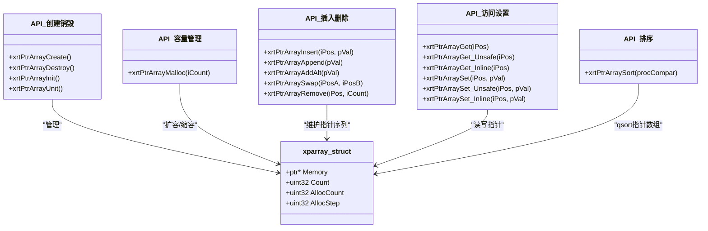
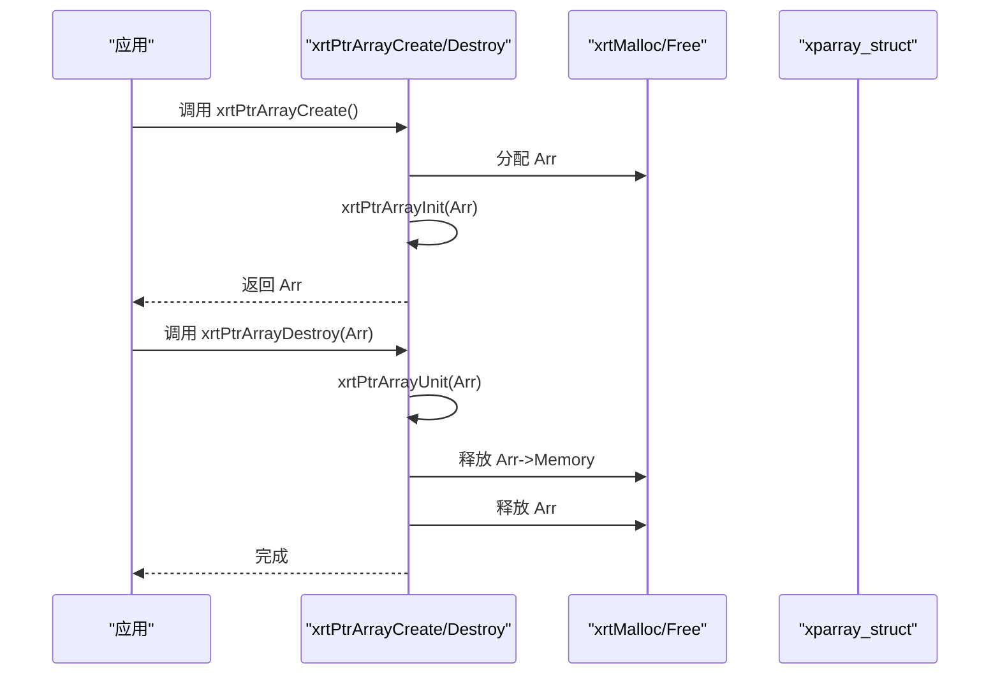
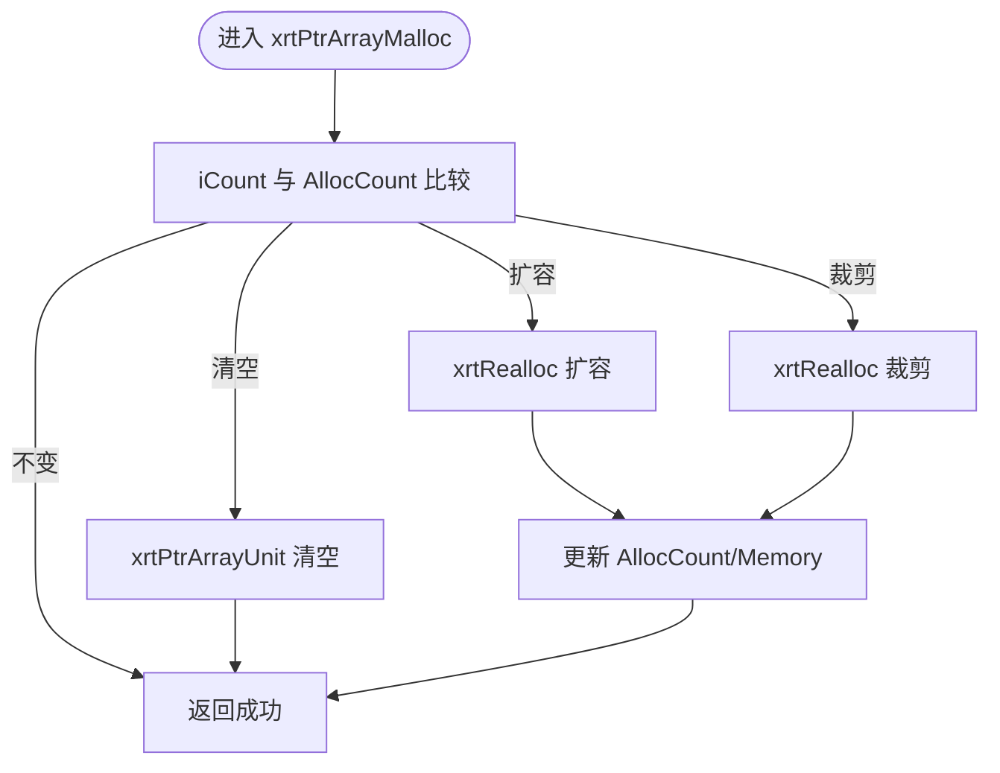
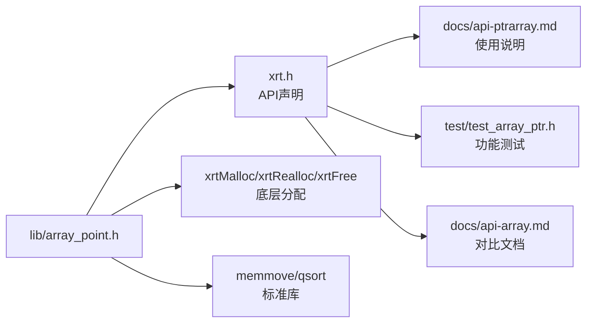

# 指针数组

<cite>
**本文引用的文件**
- [lib/array_point.h](file://lib/array_point.h)
- [xrt.h](file://xrt.h)
- [docs/api-ptrarray.md](file://docs/api-ptrarray.md)
- [test/test_array_ptr.h](file://test/test_array_ptr.h)
- [docs/api-array.md](file://docs/api-array.md)
</cite>

## 目录
1. [简介](#简介)
2. [项目结构](#项目结构)
3. [核心组件](#核心组件)
4. [架构概览](#架构概览)
5. [详细组件分析](#详细组件分析)
6. [依赖关系分析](#依赖关系分析)
7. [性能考量](#性能考量)
8. [故障排查指南](#故障排查指南)
9. [结论](#结论)
10. [附录](#附录)

## 简介
本文件系统化阐述 XRT 指针数组模块（PtrArray）的设计与实现，重点覆盖：
- 指针数组与结构体数组的根本差异与适用场景
- 指针数组的内存管理模式（指针存储、对象生命周期、内存泄漏防护）
- 核心 API 的创建、初始化、销毁流程
- 指针数组特有操作：指针赋值、复制、释放、动态调整
- 实际使用示例：对象管理、回调函数存储、动态类型处理
- 性能特征：内存占用、访问速度、缓存友好性
- 最佳实践：生命周期管理、避免内存泄漏与悬空指针

## 项目结构
指针数组模块位于 lib/array_point.h，对外通过 xrt.h 暴露统一 API；官方文档位于 docs/api-ptrarray.md；测试样例位于 test/test_array_ptr.h；与结构体数组对比参考 docs/api-array.md。

图表来源
- [lib/array_point.h](file://lib/array_point.h#L1-L199)
- [xrt.h](file://xrt.h#L1064-L1129)
- [docs/api-ptrarray.md](file://docs/api-ptrarray.md#L1-L946)
- [test/test_array_ptr.h](file://test/test_array_ptr.h#L1-L371)
- [docs/api-array.md](file://docs/api-array.md#L847-L856)

章节来源
- [lib/array_point.h](file://lib/array_point.h#L1-L199)
- [xrt.h](file://xrt.h#L1064-L1129)
- [docs/api-ptrarray.md](file://docs/api-ptrarray.md#L1-L946)
- [test/test_array_ptr.h](file://test/test_array_ptr.h#L1-L371)
- [docs/api-array.md](file://docs/api-array.md#L847-L856)

## 核心组件
- 数据结构：xparray_struct（指针数组管理器），包含指针数组内存、当前元素数、已分配容量、扩容步长
- 关键 API：
  - 创建/销毁：xrtPtrArrayCreate、xrtPtrArrayDestroy、xrtPtrArrayInit、xrtPtrArrayUnit
  - 容量管理：xrtPtrArrayMalloc
  - 插入/追加/查找空隙：xrtPtrArrayInsert、xrtPtrArrayAppend、xrtPtrArrayAddAlt
  - 交换/删除：xrtPtrArraySwap、xrtPtrArrayRemove
  - 访问：xrtPtrArrayGet、xrtPtrArrayGet_Unsafe、xrtPtrArrayGet_Inline；设置：xrtPtrArraySet、xrtPtrArraySet_Unsafe、xrtPtrArraySet_Inline
  - 排序：xrtPtrArraySort

章节来源
- [xrt.h](file://xrt.h#L1064-L1129)
- [lib/array_point.h](file://lib/array_point.h#L4-L199)
- [docs/api-ptrarray.md](file://docs/api-ptrarray.md#L63-L196)

## 架构概览
指针数组采用“指针容器 + 动态扩容”的设计，内部仅保存指向对象的指针，不持有对象实体。对象的生命周期由调用方控制，指针数组只负责指针的存储与管理。

图表来源
- [xrt.h](file://xrt.h#L1064-L1129)
- [lib/array_point.h](file://lib/array_point.h#L4-L199)

## 详细组件分析

### 数据结构与内存模型
- xparray_struct
  - Memory：指向指针数组的内存块，每个元素为一个指针
  - Count：当前元素数量（可直接读取）
  - AllocCount：已分配容量（元素个数）
  - AllocStep：扩容步长，默认 256
- 内存管理策略
  - 按 AllocStep 增量扩容，减少频繁重分配
  - xrtPtrArrayMalloc 支持扩容、裁剪、清空三种模式
  - xrtPtrArrayUnit 仅释放内部指针数组，不释放结构体本身（适用于栈上/嵌入式）

章节来源
- [xrt.h](file://xrt.h#L1064-L1073)
- [lib/array_point.h](file://lib/array_point.h#L23-L37)
- [lib/array_point.h](file://lib/array_point.h#L40-L71)

### 生命周期与内存泄漏防护
- 指针数组只保存指针，不持有对象实体
- 销毁指针数组时不会释放指针所指向的对象内存
- 正确做法：在销毁前先释放每个元素指向的对象，再销毁数组
- AddAlt 提供“空位复用”能力，便于对象池场景下的回收与重用

章节来源
- [docs/api-ptrarray.md](file://docs/api-ptrarray.md#L112-L115)
- [docs/api-ptrarray.md](file://docs/api-ptrarray.md#L303-L357)
- [docs/api-ptrarray.md](file://docs/api-ptrarray.md#L872-L899)

### 核心 API 流程

#### 创建与销毁
- xrtPtrArrayCreate：分配管理器结构体并初始化
- xrtPtrArrayDestroy：释放内部内存并释放管理器结构体
- xrtPtrArrayInit/xrtPtrArrayUnit：用于栈上/嵌入式结构体的初始化与清理

图表来源
- [lib/array_point.h](file://lib/array_point.h#L4-L20)

章节来源
- [lib/array_point.h](file://lib/array_point.h#L4-L20)
- [xrt.h](file://xrt.h#L1075-L1085)

#### 容量管理与动态调整
- xrtPtrArrayMalloc：按目标容量扩容/裁剪/清空
- xrtPtrArrayInsert：必要时按 AllocStep 扩容，支持中间插入与内存移动
- xrtPtrArrayAppend：末尾追加
- xrtPtrArrayAddAlt：优先复用 NULL 空位，否则末尾追加

图表来源
- [lib/array_point.h](file://lib/array_point.h#L40-L71)

章节来源
- [lib/array_point.h](file://lib/array_point.h#L40-L71)
- [lib/array_point.h](file://lib/array_point.h#L74-L101)
- [lib/array_point.h](file://lib/array_point.h#L103-L113)

#### 指针赋值、复制与访问
- 设置：xrtPtrArraySet/Set_Unsafe/Set_Inline
- 访问：xrtPtrArrayGet/Get_Unsafe/Get_Inline
- 复制：通过 Set 或 Insert/Append 将另一个指针赋给目标位置
- 安全版本进行边界检查，不安全版本性能更高但需调用者保证索引有效

章节来源
- [xrt.h](file://xrt.h#L1111-L1125)
- [lib/array_point.h](file://lib/array_point.h#L154-L185)

#### 排序与交换
- xrtPtrArraySwap：交换两个位置的指针
- xrtPtrArraySort：基于 qsort 对指针数组排序（比较函数需按 qsort 规范）

章节来源
- [lib/array_point.h](file://lib/array_point.h#L115-L131)
- [lib/array_point.h](file://lib/array_point.h#L187-L196)

### 与结构体数组的对比与适用场景
- 存储方式：指针数组存储指针；结构体数组存储结构体本身
- 元素大小：指针数组固定 sizeof(ptr)，结构体数组为具体结构体大小
- 内存布局：结构体数组连续存储更缓存友好；指针数组为间接访问
- 适用场景：大量小型结构体适合结构体数组；大型对象或需要共享引用/动态类型适合指针数组
- 排序性能：指针数组只需交换指针，结构体数组需移动整个结构体

章节来源
- [docs/api-array.md](file://docs/api-array.md#L847-L856)

### 实际使用示例与最佳实践
- 对象集合管理：添加/遍历/释放对象，注意在销毁数组前释放每个对象
- 字符串列表：复制字符串到数组，遍历时逐个释放
- 对象池：利用 AddAlt 复用空位，删除时将对应位置置 NULL
- 预分配容量：已知元素数量时提前 xrtPtrArrayMalloc，避免多次扩容
- 高性能遍历：使用 Get_Inline/Set_Inline，但需确保索引有效

章节来源
- [docs/api-ptrarray.md](file://docs/api-ptrarray.md#L698-L836)
- [docs/api-ptrarray.md](file://docs/api-ptrarray.md#L840-L928)

## 依赖关系分析
- 外部依赖：底层内存分配接口（xrtMalloc/xrtRealloc/xrtFree）、标准库 memmove、qsort
- 内部依赖：xparray_struct 作为唯一数据载体，所有 API 基于该结构体进行操作
- 与其它模块的关系：与结构体数组模块形成互补；与 BSMM/内存单元模块配合实现复杂对象管理

图表来源
- [lib/array_point.h](file://lib/array_point.h#L1-L199)
- [xrt.h](file://xrt.h#L1064-L1129)
- [docs/api-ptrarray.md](file://docs/api-ptrarray.md#L1-L946)
- [test/test_array_ptr.h](file://test/test_array_ptr.h#L1-L371)
- [docs/api-array.md](file://docs/api-array.md#L847-L856)

章节来源
- [lib/array_point.h](file://lib/array_point.h#L1-L199)
- [xrt.h](file://xrt.h#L1064-L1129)
- [docs/api-ptrarray.md](file://docs/api-ptrarray.md#L1-L946)
- [test/test_array_ptr.h](file://test/test_array_ptr.h#L1-L371)
- [docs/api-array.md](file://docs/api-array.md#L847-L856)

## 性能考量
- 内存占用
  - 指针数组每元素占用固定大小（sizeof(ptr)），适合存储大型对象或不同类型的对象
  - 结构体数组每元素占用结构体大小，适合大量小型对象
- 访问速度
  - 指针数组访问为二级指针寻址，可能降低缓存命中率
  - 结构体数组为连续内存，缓存友好，遍历更快
- 扩容策略
  - 按 AllocStep（默认 256）批量扩容，减少 realloc 次数
  - 插入中间元素涉及 memmove，时间复杂度 O(n)
- 排序与交换
  - 指针数组排序仅交换指针，开销小
  - 结构体数组排序需移动整个结构体，开销大

章节来源
- [xrt.h](file://xrt.h#L1064-L1065)
- [lib/array_point.h](file://lib/array_point.h#L74-L95)
- [docs/api-array.md](file://docs/api-array.md#L847-L856)

## 故障排查指南
- 常见错误
  - 忘记释放对象内存：销毁数组前应逐个释放对象，避免泄漏
  - 索引越界：安全版本会返回 NULL/失败，不安全版本可能导致未定义行为
  - 悬空指针：删除元素后未置 NULL，后续 AddAlt 无法复用
- 调试建议
  - 使用安全版本 API 进行开发阶段校验
  - 在关键路径打印 Count/AllocCount，确认扩容是否符合预期
  - 单元测试参考 test/test_array_ptr.h 的完整流程

章节来源
- [docs/api-ptrarray.md](file://docs/api-ptrarray.md#L872-L899)
- [test/test_array_ptr.h](file://test/test_array_ptr.h#L1-L371)

## 结论
XRT 指针数组模块通过“指针容器 + 动态扩容”的设计，提供了灵活的对象管理能力，特别适用于大型对象、动态类型与共享引用场景。正确理解其内存模型与生命周期管理，遵循预分配、显式释放、安全访问的最佳实践，可显著提升稳定性与性能。

## 附录
- API 一览（名称与用途）
  - 创建/销毁：xrtPtrArrayCreate、xrtPtrArrayDestroy、xrtPtrArrayInit、xrtPtrArrayUnit
  - 容量：xrtPtrArrayMalloc
  - 插入/追加/复用：xrtPtrArrayInsert、xrtPtrArrayAppend、xrtPtrArrayAddAlt
  - 交换/删除：xrtPtrArraySwap、xrtPtrArrayRemove
  - 访问/设置：xrtPtrArrayGet/Get_Unsafe/Get_Inline、xrtPtrArraySet/Set_Unsafe/Set_Inline
  - 排序：xrtPtrArraySort

章节来源
- [xrt.h](file://xrt.h#L1075-L1129)
- [lib/array_point.h](file://lib/array_point.h#L4-L199)
- [docs/api-ptrarray.md](file://docs/api-ptrarray.md#L63-L196)