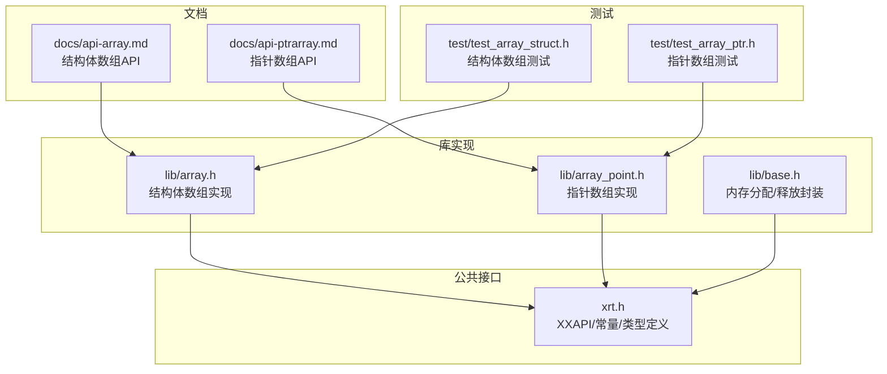
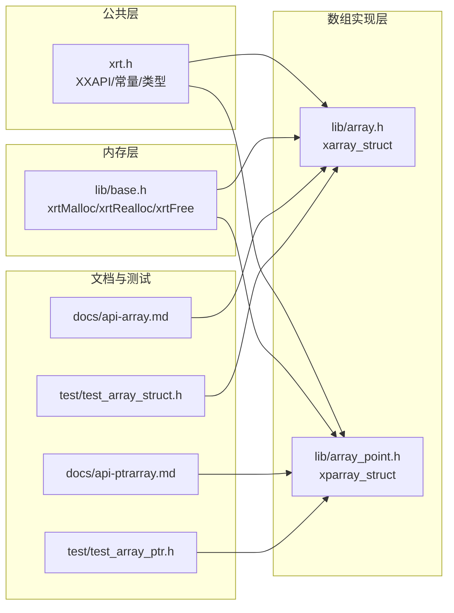
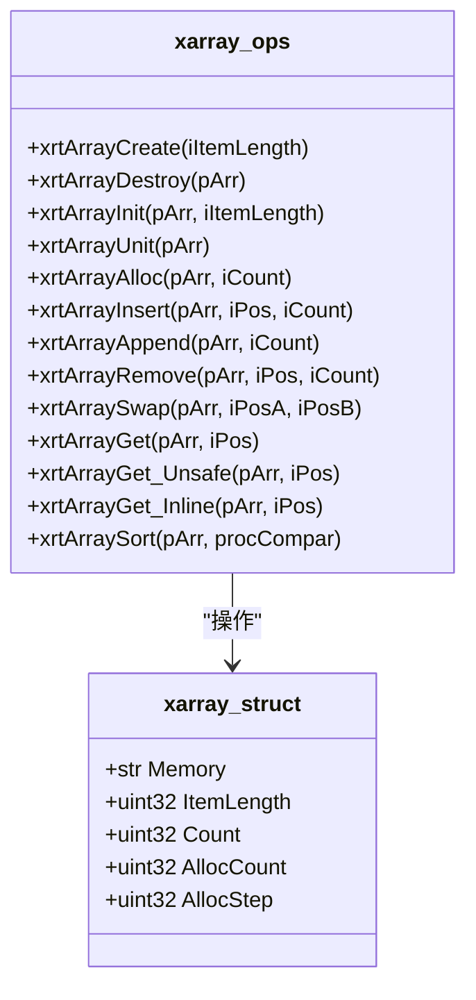
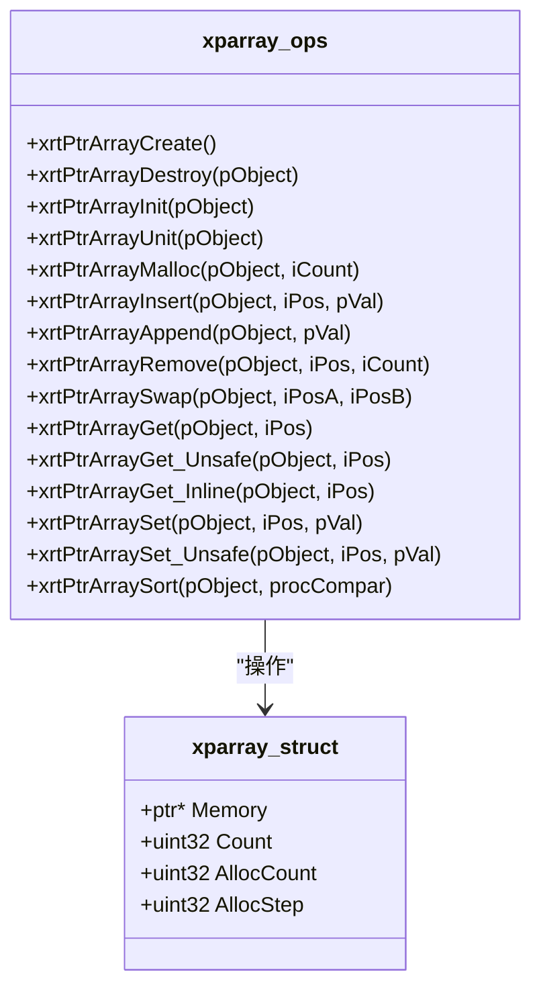
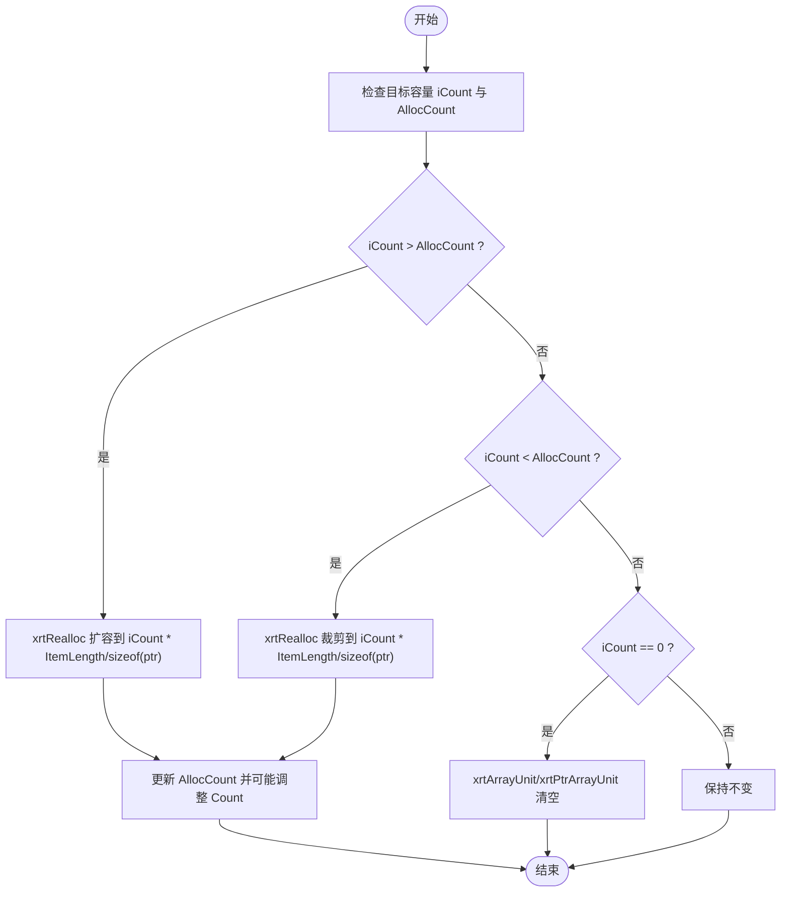
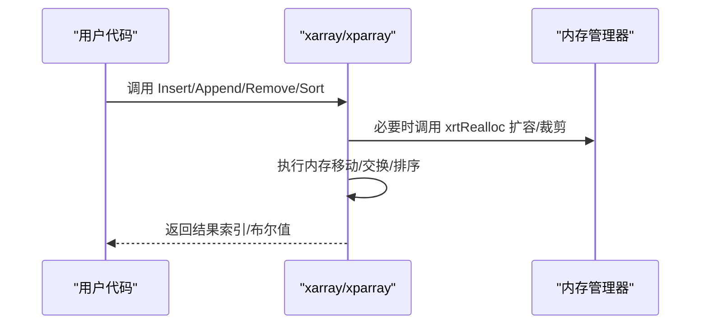
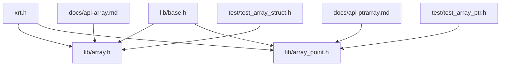

# 数组结构

<cite>
**本文引用的文件**
- [lib/array.h](file://lib/array.h)
- [lib/array_point.h](file://lib/array_point.h)
- [docs/api-array.md](file://docs/api-array.md)
- [docs/api-ptrarray.md](file://docs/api-ptrarray.md)
- [test/test_array_struct.h](file://test/test_array_struct.h)
- [test/test_array_ptr.h](file://test/test_array_ptr.h)
- [xrt.h](file://xrt.h)
- [lib/base.h](file://lib/base.h)
</cite>

## 目录
1. [简介](#简介)
2. [项目结构](#项目结构)
3. [核心组件](#核心组件)
4. [架构概览](#架构概览)
5. [详细组件分析](#详细组件分析)
6. [依赖关系分析](#依赖关系分析)
7. [性能考量](#性能考量)
8. [故障排查指南](#故障排查指南)
9. [结论](#结论)
10. [附录](#附录)

## 简介
本文件系统化梳理 XRT 数组模块，覆盖结构体数组（array.h）与指针数组（array_point.h）两类实现，重点阐述：
- 数组结构设计与内存布局差异
- 动态扩容机制（256 步进策略）与内存管理
- 访问模式与 API 使用方法（添加、删除、查找、排序）
- 性能特征分析（时间/空间复杂度）
- 实际使用示例与内存优化、性能调优建议

## 项目结构
数组模块位于 lib 目录下，配套文档位于 docs 目录，测试样例位于 test 目录。核心接口与常量定义集中在公共头文件中。

图表来源
- [lib/array.h](file://lib/array.h#L1-L180)
- [lib/array_point.h](file://lib/array_point.h#L1-L199)
- [lib/base.h](file://lib/base.h#L1-L132)
- [xrt.h](file://xrt.h#L1132-L1147)

章节来源
- [lib/array.h](file://lib/array.h#L1-L180)
- [lib/array_point.h](file://lib/array_point.h#L1-L199)
- [docs/api-array.md](file://docs/api-array.md#L1-L873)
- [docs/api-ptrarray.md](file://docs/api-ptrarray.md#L1-L946)
- [test/test_array_struct.h](file://test/test_array_struct.h#L1-L374)
- [test/test_array_ptr.h](file://test/test_array_ptr.h#L1-L371)
- [xrt.h](file://xrt.h#L1132-L1147)
- [lib/base.h](file://lib/base.h#L1-L132)

## 核心组件
- 结构体数组（xarray）：连续内存存储结构体内容，适合大量小型结构体；支持按元素大小（ItemLength）进行内存布局与访问。
- 指针数组（xparray）：存储指针，适合大型对象或需要共享引用的场景；元素大小固定为指针宽度。
- 扩容步长：默认 256（XARRAY_PREASSIGNSTEP / XPARRAY_PREASSIGNSTEP），减少频繁 realloc 次数。
- 访问模式：提供安全版（带边界检查）、不安全版（无检查，内联版本用于高性能遍历）。

章节来源
- [docs/api-array.md](file://docs/api-array.md#L20-L62)
- [docs/api-ptrarray.md](file://docs/api-ptrarray.md#L20-L60)
- [xrt.h](file://xrt.h#L1141-L1147)

## 架构概览
数组模块通过统一的内存分配/释放封装（xrtMalloc/xrtRealloc/xrtFree）与公共类型定义（XXAPI、ptr、uint32 等）实现跨平台与一致的 API 行为。

图表来源
- [xrt.h](file://xrt.h#L1132-L1147)
- [lib/base.h](file://lib/base.h#L1-L132)
- [lib/array.h](file://lib/array.h#L1-L180)
- [lib/array_point.h](file://lib/array_point.h#L1-L199)
- [docs/api-array.md](file://docs/api-array.md#L1-L873)
- [docs/api-ptrarray.md](file://docs/api-ptrarray.md#L1-L946)
- [test/test_array_struct.h](file://test/test_array_struct.h#L1-L374)
- [test/test_array_ptr.h](file://test/test_array_ptr.h#L1-L371)

## 详细组件分析

### 结构体数组（xarray）
- 数据结构：包含连续内存块、元素大小、当前计数、已分配容量、扩容步长。
- 关键操作：
  - 创建/销毁：xrtArrayCreate/xrtArrayDestroy
  - 初始化/释放：xrtArrayInit/xrtArrayUnit（用于内嵌结构体）
  - 内存预分配/裁剪：xrtArrayAlloc
  - 插入/追加/删除：xrtArrayInsert/xrtArrayAppend/xrtArrayRemove
  - 交换：xrtArraySwap
  - 访问：xrtArrayGet（安全）、xrtArrayGet_Unsafe（不安全）、xrtArrayGet_Inline（内联）
  - 排序：xrtArraySort（基于 qsort）

图表来源
- [lib/array.h](file://lib/array.h#L24-L177)
- [xrt.h](file://xrt.h#L1144-L1147)

章节来源
- [lib/array.h](file://lib/array.h#L1-L180)
- [docs/api-array.md](file://docs/api-array.md#L39-L114)

### 指针数组（xparray）
- 数据结构：包含指针数组、当前计数、已分配容量、扩容步长。
- 关键操作：
  - 创建/销毁：xrtPtrArrayCreate/xrtPtrArrayDestroy
  - 初始化/释放：xrtPtrArrayInit/xrtPtrArrayUnit
  - 内存预分配/裁剪：xrtPtrArrayMalloc
  - 插入/追加/删除：xrtPtrArrayInsert/xrtPtrArrayAppend/xrtPtrArrayRemove
  - 交换：xrtPtrArraySwap
  - 访问与设置：xrtPtrArrayGet/Set（安全/不安全/内联）
  - 排序：xrtPtrArraySort（基于 qsort）

图表来源
- [lib/array_point.h](file://lib/array_point.h#L22-L196)
- [xrt.h](file://xrt.h#L1111-L1129)

章节来源
- [lib/array_point.h](file://lib/array_point.h#L1-L199)
- [docs/api-ptrarray.md](file://docs/api-ptrarray.md#L39-L114)

### 动态扩容机制与内存管理
- 扩容步长：默认 256（XARRAY_PREASSIGNSTEP / XPARRAY_PREASSIGNSTEP），插入或预分配时按步长增长，降低频繁 realloc 的开销。
- 内存管理：
  - 创建：xrtMalloc 分配管理器与连续内存块
  - 释放：xrtFree 释放内存块；销毁时释放管理器结构体
  - 预分配/裁剪：xrtRealloc 调整容量，必要时更新 Count
- 索引规则：从 1 开始（0 表示不存在），便于与文档示例保持一致。

图表来源
- [lib/array.h](file://lib/array.h#L43-L74)
- [lib/array_point.h](file://lib/array_point.h#L40-L71)

章节来源
- [docs/api-array.md](file://docs/api-array.md#L20-L36)
- [docs/api-ptrarray.md](file://docs/api-ptrarray.md#L20-L36)
- [lib/array.h](file://lib/array.h#L43-L74)
- [lib/array_point.h](file://lib/array_point.h#L40-L71)

### 访问模式与 API 使用
- 安全访问：xrtArrayGet / xrtPtrArrayGet，返回元素指针或 NULL（越界）
- 不安全访问：xrtArrayGet_Unsafe / xrtPtrArrayGet_Unsafe，无边界检查，性能更高
- 内联访问：xrtArrayGet_Inline / xrtPtrArrayGet_Inline，内联版本，适用于已知索引有效的大规模遍历
- 设置访问：xrtPtrArraySet / xrtPtrArraySet_Unsafe，仅指针数组支持设置元素指针

章节来源
- [docs/api-array.md](file://docs/api-array.md#L590-L700)
- [docs/api-ptrarray.md](file://docs/api-ptrarray.md#L513-L662)

### 插入/删除/排序流程
- 插入：xrtArrayInsert / xrtPtrArrayInsert，必要时移动内存，插入后返回首个新元素索引
- 删除：xrtArrayRemove / xrtPtrArrayRemove，支持中段删除与末尾删除
- 排序：xrtArraySort / xrtPtrArraySort，基于 qsort 的比较函数

图表来源
- [lib/array.h](file://lib/array.h#L76-L177)
- [lib/array_point.h](file://lib/array_point.h#L73-L196)

章节来源
- [lib/array.h](file://lib/array.h#L76-L177)
- [lib/array_point.h](file://lib/array_point.h#L73-L196)

### 实际使用示例与场景
- 结构体数组：适合大量小型结构体（如学生成绩、任务记录）的批量处理与排序。
- 指针数组：适合大型对象或需要共享引用的场景（如对象池、字符串列表）。
- 测试样例展示了两者的完整生命周期与常见操作。

章节来源
- [test/test_array_struct.h](file://test/test_array_struct.h#L20-L374)
- [test/test_array_ptr.h](file://test/test_array_ptr.h#L11-L371)
- [docs/api-array.md](file://docs/api-array.md#L703-L806)
- [docs/api-ptrarray.md](file://docs/api-ptrarray.md#L698-L836)

## 依赖关系分析
- 公共依赖：XXAPI、ptr、uint32、str 等类型定义来自 xrt.h；内存分配/释放来自 lib/base.h。
- 组件耦合：数组实现依赖内存管理器；API 与文档/测试相互映射验证。

图表来源
- [xrt.h](file://xrt.h#L1132-L1147)
- [lib/base.h](file://lib/base.h#L1-L132)
- [lib/array.h](file://lib/array.h#L1-L180)
- [lib/array_point.h](file://lib/array_point.h#L1-L199)
- [docs/api-array.md](file://docs/api-array.md#L1-L873)
- [docs/api-ptrarray.md](file://docs/api-ptrarray.md#L1-L946)
- [test/test_array_struct.h](file://test/test_array_struct.h#L1-L374)
- [test/test_array_ptr.h](file://test/test_array_ptr.h#L1-L371)

章节来源
- [xrt.h](file://xrt.h#L1132-L1147)
- [lib/base.h](file://lib/base.h#L1-L132)
- [lib/array.h](file://lib/array.h#L1-L180)
- [lib/array_point.h](file://lib/array_point.h#L1-L199)

## 性能考量
- 时间复杂度
  - 插入/删除（中段）：O(n)，涉及内存移动
  - 追加（末尾）：摊还 O(1)，按 256 步进扩容
  - 交换：O(1)
  - 排序：O(n log n)（基于 qsort）
- 空间复杂度
  - 结构体数组：O(n * ItemLength)，连续内存
  - 指针数组：O(n * sizeof(ptr)) + 各元素独立内存
- 性能优化建议
  - 已知数量时使用 xrtArrayAlloc/xrtPtrArrayMalloc 预分配，避免多次扩容
  - 大规模遍历时使用内联访问（xrtArrayGet_Inline / xrtPtrArrayGet_Inline）
  - 指针数组排序更高效（仅交换指针），适合大型对象

章节来源
- [docs/api-array.md](file://docs/api-array.md#L810-L873)
- [docs/api-ptrarray.md](file://docs/api-ptrarray.md#L840-L946)

## 故障排查指南
- 索引越界
  - 使用安全访问 API（xrtArrayGet / xrtPtrArrayGet）检测返回值
  - 确认索引从 1 开始，且不超过 Count
- 内存泄漏
  - 结构体数组：销毁前释放元素内部动态内存（如字符串、子结构）
  - 指针数组：销毁前释放每个元素指向的内存
- 频繁扩容导致性能下降
  - 使用预分配 API 提前设定容量
- 排序异常
  - 确保比较函数正确实现，遵循 qsort 规范

章节来源
- [docs/api-array.md](file://docs/api-array.md#L822-L832)
- [docs/api-ptrarray.md](file://docs/api-ptrarray.md#L872-L899)

## 结论
XRT 数组模块以统一的内存管理与清晰的 API 设计，提供了高效的结构体数组与指针数组实现。通过 256 步进扩容策略与多种访问模式（安全/不安全/内联），在易用性与性能之间取得平衡。合理使用预分配与内联访问，可在大规模数据处理中获得显著收益。

## 附录
- 常量与类型
  - XARRAY_PREASSIGNSTEP / XPARRAY_PREASSIGNSTEP：默认扩容步长 256
  - XXAPI：导出宏，控制函数可见性
  - ptr、uint32、str 等基础类型定义见 xrt.h

章节来源
- [xrt.h](file://xrt.h#L1141-L1147)
- [xrt.h](file://xrt.h#L1132-L1147)