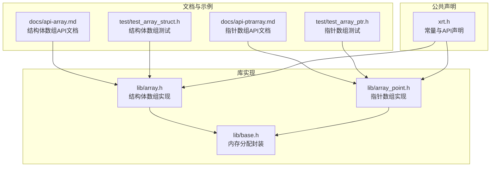
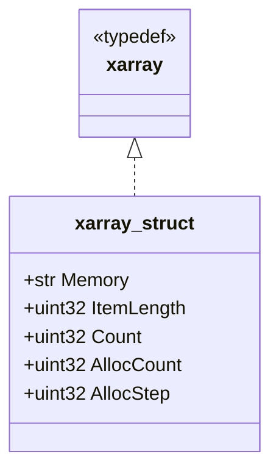
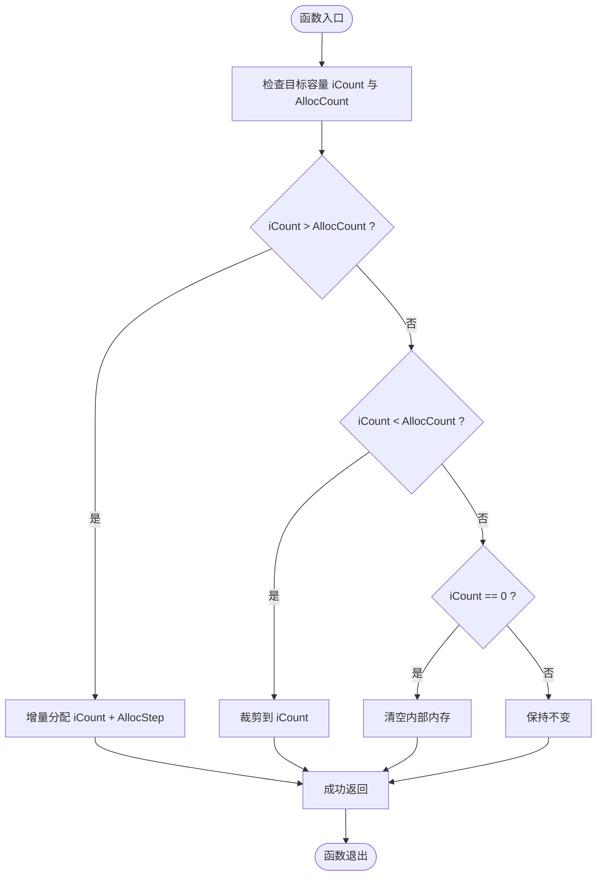
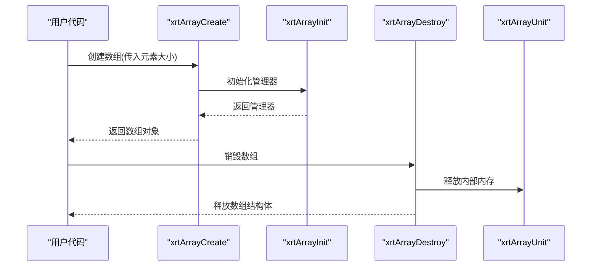
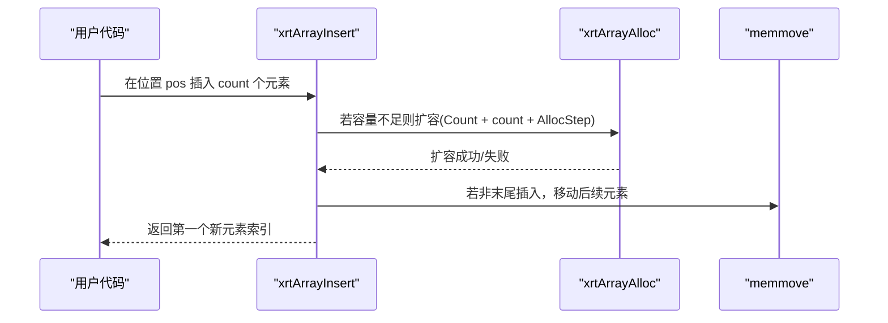
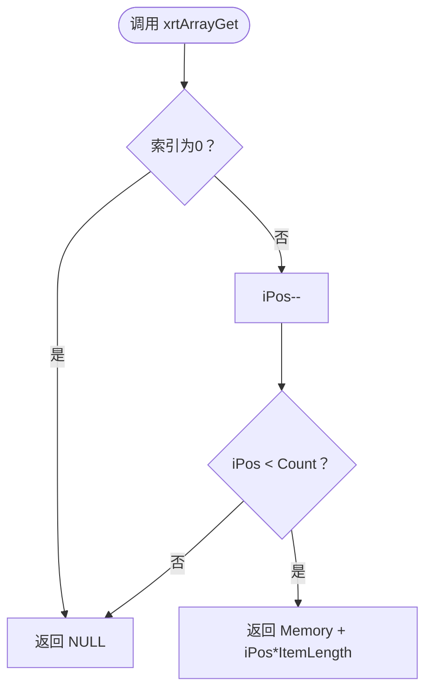
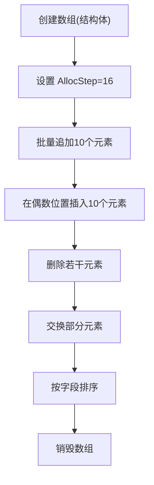
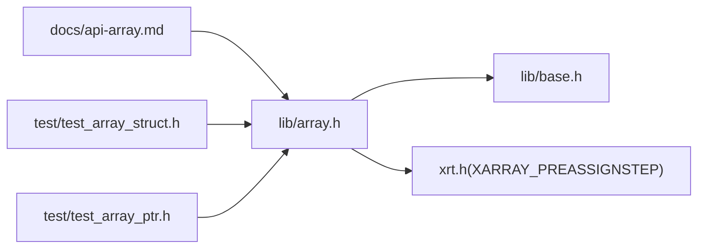

# 结构体数组

<cite>
**本文引用的文件**
- [lib/array.h](file://lib/array.h)
- [lib/array_point.h](file://lib/array_point.h)
- [docs/api-array.md](file://docs/api-array.md)
- [docs/api-ptrarray.md](file://docs/api-ptrarray.md)
- [test/test_array_struct.h](file://test/test_array_struct.h)
- [test/test_array_ptr.h](file://test/test_array_ptr.h)
- [lib/base.h](file://lib/base.h)
- [xrt.h](file://xrt.h)
- [test.c](file://test.c)
</cite>

## 目录
1. [简介](#简介)
2. [项目结构](#项目结构)
3. [核心组件](#核心组件)
4. [架构概览](#架构概览)
5. [详细组件分析](#详细组件分析)
6. [依赖关系分析](#依赖关系分析)
7. [性能考量](#性能考量)
8. [故障排查指南](#故障排查指南)
9. [结论](#结论)
10. [附录](#附录)

## 简介
本文件系统性地解析 XRT 结构体数组模块，聚焦于 lib/array.h 中的 xarray 结构体数组设计与实现，涵盖内存布局、动态扩容策略（256 步进分配）、内存管理机制，以及核心 API 的行为与复杂度分析。同时提供完整使用示例与最佳实践，帮助开发者高效、安全地使用该模块。

## 项目结构
- 结构体数组核心实现位于 lib/array.h，提供通用结构体数组的创建、销毁、扩容、插入、追加、删除、交换、访问与排序等能力。
- 文档位于 docs/api-array.md，提供 API 定义、使用说明与示例。
- 测试样例位于 test/test_array_struct.h（结构体数组）与 test/test_array_ptr.h（指针数组），演示典型用法与行为验证。
- 内存分配接口封装在 lib/base.h 中，统一通过 xrtMalloc/xrtRealloc/xrtFree 等函数进行内存管理。
- 常量定义与对外 API 声明位于 xrt.h，其中包含 XARRAY_PREASSIGNSTEP（默认 256）等关键配置。

图表来源
- [lib/array.h](file://lib/array.h#L1-L180)
- [lib/array_point.h](file://lib/array_point.h#L1-L199)
- [lib/base.h](file://lib/base.h#L1-L132)
- [docs/api-array.md](file://docs/api-array.md#L1-L800)
- [docs/api-ptrarray.md](file://docs/api-ptrarray.md#L1-L200)
- [test/test_array_struct.h](file://test/test_array_struct.h#L1-L374)
- [test/test_array_ptr.h](file://test/test_array_ptr.h#L1-L371)
- [xrt.h](file://xrt.h#L1060-L1196)

章节来源
- [lib/array.h](file://lib/array.h#L1-L180)
- [docs/api-array.md](file://docs/api-array.md#L1-L800)
- [test/test_array_struct.h](file://test/test_array_struct.h#L1-L374)
- [test/test_array_ptr.h](file://test/test_array_ptr.h#L1-L371)
- [lib/base.h](file://lib/base.h#L1-L132)
- [xrt.h](file://xrt.h#L1060-L1196)

## 核心组件
- xarray_struct：结构体数组管理器，包含连续内存块、元素大小、当前计数、已分配容量与预分配步长。
- 关键 API：
  - 初始化与销毁：xrtArrayCreate、xrtArrayDestroy、xrtArrayInit、xrtArrayUnit
  - 内存管理：xrtArrayAlloc
  - 数组操作：xrtArrayInsert（中间插入）、xrtArrayAppend（末尾添加）、xrtArrayRemove（删除成员）、xrtArraySwap（交换成员）
  - 访问与排序：xrtArrayGet、xrtArrayGet_Unsafe、xrtArrayGet_Inline、xrtArraySort
- 扩容策略：默认每次扩容步长为 256（XARRAY_PREASSIGNSTEP），减少频繁 realloc 的次数，提升批量写入性能。

章节来源
- [lib/array.h](file://lib/array.h#L24-L177)
- [xrt.h](file://xrt.h#L1141-L1195)

## 架构概览
结构体数组采用“连续内存块 + 管理器结构”的设计，管理器结构体保存元数据，连续内存块存储具体元素。通过预分配步长控制扩容节奏，配合内存移动实现插入/删除操作。

图表来源
- [xrt.h](file://xrt.h#L1144-L1151)

## 详细组件分析

### xarray 结构体数组内存布局与动态扩容
- 内存布局
  - Memory：指向连续内存块，存储所有元素；每个元素占用 ItemLength 字节。
  - Count：当前元素个数。
  - AllocCount：已分配容量（元素个数）。
  - AllocStep：每次扩容的步长，默认 256。
- 动态扩容策略
  - xrtArrayAlloc：当目标容量大于 AllocCount 时，按 iCount + AllocStep 进行增量分配；当 iCount 小于 AllocCount 时进行裁剪；iCount 为 0 时清空。
  - xrtArrayInsert：若插入后总元素数超过 AllocCount，则扩容至 Count + iCount + AllocStep，然后执行内存移动（memmove）。
  - xrtArrayAppend：直接委托 xrtArrayInsert(pArr, Count, iCount)。
- 内存管理机制
  - 创建：xrtArrayCreate 分配管理器结构体并调用 xrtArrayInit 初始化。
  - 销毁：xrtArrayDestroy 调用 xrtArrayUnit 释放内部内存，再释放管理器结构体。
  - 单独释放内部内存：xrtArrayUnit 仅释放 Memory，重置 Count/AllocCount，保留管理器结构体。

图表来源
- [lib/array.h](file://lib/array.h#L43-L74)

章节来源
- [lib/array.h](file://lib/array.h#L4-L74)
- [xrt.h](file://xrt.h#L1141-L1151)

### 核心API详解与使用示例

#### 初始化与销毁
- xrtArrayCreate：创建数组对象，内部调用 xrtArrayInit 初始化。
- xrtArrayDestroy：销毁数组对象，释放内部内存与自身结构体。
- xrtArrayInit：初始化管理器结构体，设置 ItemLength、Count、AllocCount、AllocStep。
- xrtArrayUnit：释放内部内存，重置 Count/AllocCount，保留结构体。

图表来源
- [lib/array.h](file://lib/array.h#L5-L40)
- [xrt.h](file://xrt.h#L1153-L1163)

章节来源
- [lib/array.h](file://lib/array.h#L5-L40)
- [docs/api-array.md](file://docs/api-array.md#L67-L209)

#### 数组操作API
- xrtArrayInsert（中间插入）
  - 行为：在指定位置插入 iCount 个元素；若 iCount 为 0 视为 1；插入后若超出容量则按 AllocStep 扩容；必要时执行 memmove 移动后续元素。
  - 返回：成功返回第一个新元素的索引（1-based），失败返回 0。
- xrtArrayAppend（末尾添加）
  - 行为：委托 xrtArrayInsert(pArr, Count, iCount)。
- xrtArrayRemove（删除成员）
  - 行为：删除从 iPos 开始的 iCount 个元素；越界或 iCount 为 0 时失败；中段删除执行 memmove。
- xrtArraySwap（交换成员）
  - 行为：交换两个位置的元素；使用临时缓冲区进行三步 memmove；索引范围检查严格（从 1 开始）。

图表来源
- [lib/array.h](file://lib/array.h#L76-L99)
- [lib/array.h](file://lib/array.h#L43-L74)

章节来源
- [lib/array.h](file://lib/array.h#L76-L150)
- [docs/api-array.md](file://docs/api-array.md#L269-L513)

#### 元素访问与排序
- xrtArrayGet：安全访问，带边界检查，返回元素指针或 NULL。
- xrtArrayGet_Unsafe：不安全版本，无边界检查，性能更高。
- xrtArrayGet_Inline：内联版本，无函数调用开销，适合高性能遍历。
- xrtArraySort：基于 qsort 的排序，比较函数遵循 qsort 约定。

图表来源
- [lib/array.h](file://lib/array.h#L152-L166)
- [xrt.h](file://xrt.h#L1187-L1192)

章节来源
- [lib/array.h](file://lib/array.h#L152-L177)
- [docs/api-array.md](file://docs/api-array.md#L590-L700)

### 使用示例与最佳实践

#### 示例一：结构体数组的基本操作
- 创建数组、设置 AllocStep、批量追加、中间插入、删除、交换、排序与销毁。
- 参考路径：[test/test_array_struct.h](file://test/test_array_struct.h#L20-L371)

示例流程（概念图）

图表来源
- [test/test_array_struct.h](file://test/test_array_struct.h#L20-L371)

章节来源
- [test/test_array_struct.h](file://test/test_array_struct.h#L20-L371)

#### 示例二：指针数组的批量扩容
- 演示 AllocStep=256 的批量扩容行为，从 10 个元素增长到 285 个元素，容量逐步从 256 增长到 512。
- 参考路径：[test/test_array_ptr.h](file://test/test_array_ptr.h#L11-L371)

章节来源
- [test/test_array_ptr.h](file://test/test_array_ptr.h#L11-L371)

#### 最佳实践
- 预分配：在大批量写入前使用 xrtArrayAlloc 预设容量，避免多次扩容带来的 memmove 开销。
- 索引规范：始终使用 1-based 索引，注意边界检查。
- 内存释放：结构体数组元素若包含动态内存，需在销毁数组前自行释放，数组只负责释放连续内存块。
- 性能优化：遍历时可使用 xrtArrayGet_Inline 提升性能，但需确保索引有效。

章节来源
- [docs/api-array.md](file://docs/api-array.md#L1-L800)

## 依赖关系分析
- 实现依赖
  - lib/array.h 依赖 lib/base.h 的内存分配接口（xrtMalloc/xrtRealloc/xrtFree）。
  - 常量 XARRAY_PREASSIGNSTEP 在 xrt.h 中定义，供 lib/array.h 使用。
- 接口契约
  - API 声明与常量定义集中在 xrt.h，实现位于 lib/array.h。
  - 文档与测试分别位于 docs 与 test，形成“文档-实现-测试”闭环。

图表来源
- [lib/array.h](file://lib/array.h#L1-L180)
- [lib/base.h](file://lib/base.h#L1-L132)
- [xrt.h](file://xrt.h#L1141-L1151)
- [docs/api-array.md](file://docs/api-array.md#L1-L800)
- [test/test_array_struct.h](file://test/test_array_struct.h#L1-L374)
- [test/test_array_ptr.h](file://test/test_array_ptr.h#L1-L371)

章节来源
- [lib/array.h](file://lib/array.h#L1-L180)
- [lib/base.h](file://lib/base.h#L1-L132)
- [xrt.h](file://xrt.h#L1141-L1151)
- [docs/api-array.md](file://docs/api-array.md#L1-L800)
- [test/test_array_struct.h](file://test/test_array_struct.h#L1-L374)
- [test/test_array_ptr.h](file://test/test_array_ptr.h#L1-L371)

## 性能考量
- 时间复杂度
  - 插入（xrtArrayInsert）：均摊 O(1)，最坏 O(n)（需要 memmove 移动后续元素）。
  - 追加（xrtArrayAppend）：均摊 O(1)，最坏 O(n)（末尾插入可能触发扩容）。
  - 删除（xrtArrayRemove）：O(n)（memmove 移动后续元素）。
  - 访问（xrtArrayGet/Get_Unsafe/Get_Inline）：O(1)。
  - 排序（xrtArraySort）：O(n log n)（基于 qsort）。
- 空间复杂度
  - O(n)，其中 n 为元素个数；AllocCount 可能大于 n，但通常接近 n。
- 扩容策略
  - 默认步长 256，减少频繁 realloc 次数，提高批量写入效率；可通过设置 AllocStep 调整。

章节来源
- [lib/array.h](file://lib/array.h#L43-L99)
- [docs/api-array.md](file://docs/api-array.md#L1-L800)
- [xrt.h](file://xrt.h#L1141-L1151)

## 故障排查指南
- 索引越界
  - 使用 xrtArrayGet 时若索引为 0 或超过 Count，返回 NULL；请检查索引是否从 1 开始且小于等于 Count。
- 扩容失败
  - xrtArrayAlloc/xrtArrayInsert 内部依赖 xrtRealloc，若失败返回 FALSE；检查系统可用内存与内存碎片情况。
- 元素包含动态内存
  - 销毁数组前需自行释放元素内的动态内存，否则会导致内存泄漏。
- 性能问题
  - 大批量写入未预分配：使用 xrtArrayAlloc 预设容量，降低扩容与 memmove 次数。
  - 遍历时频繁函数调用开销：使用 xrtArrayGet_Inline 替代 xrtArrayGet，但需确保索引有效。

章节来源
- [lib/array.h](file://lib/array.h#L152-L177)
- [lib/base.h](file://lib/base.h#L29-L45)
- [docs/api-array.md](file://docs/api-array.md#L1-L800)

## 结论
XRT 结构体数组模块以简洁的连续内存块设计与 256 步进扩容策略，提供了高效的结构体数组管理能力。通过完善的初始化/销毁、插入/删除、访问与排序 API，结合文档与测试样例，开发者可以安全、高效地构建面向结构体的动态数组。建议在批量写入场景下预分配容量，并在遍历时选择合适的访问方式以获得最佳性能。

## 附录
- 常量与API声明参考：[xrt.h](file://xrt.h#L1141-L1195)
- 结构体数组API文档：[docs/api-array.md](file://docs/api-array.md#L1-L800)
- 指针数组API文档：[docs/api-ptrarray.md](file://docs/api-ptrarray.md#L1-L200)
- 测试样例
  - 结构体数组：[test/test_array_struct.h](file://test/test_array_struct.h#L1-L374)
  - 指针数组：[test/test_array_ptr.h](file://test/test_array_ptr.h#L1-L371)
- 主程序入口（测试调度）：[test.c](file://test.c#L54-L179)