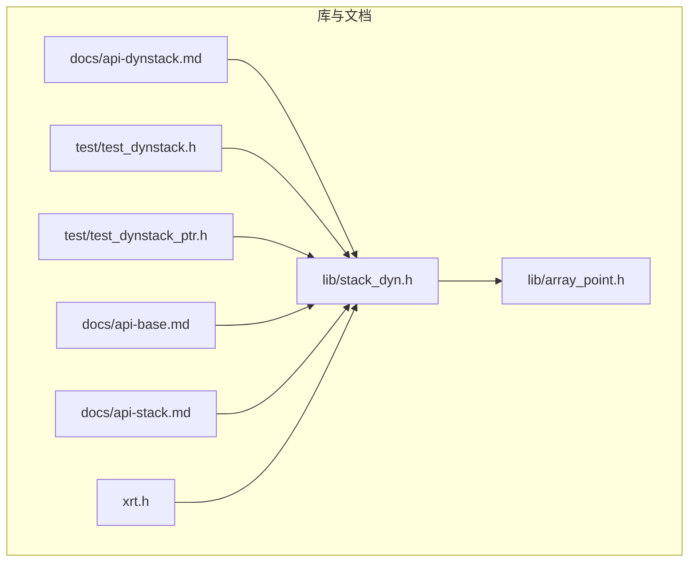
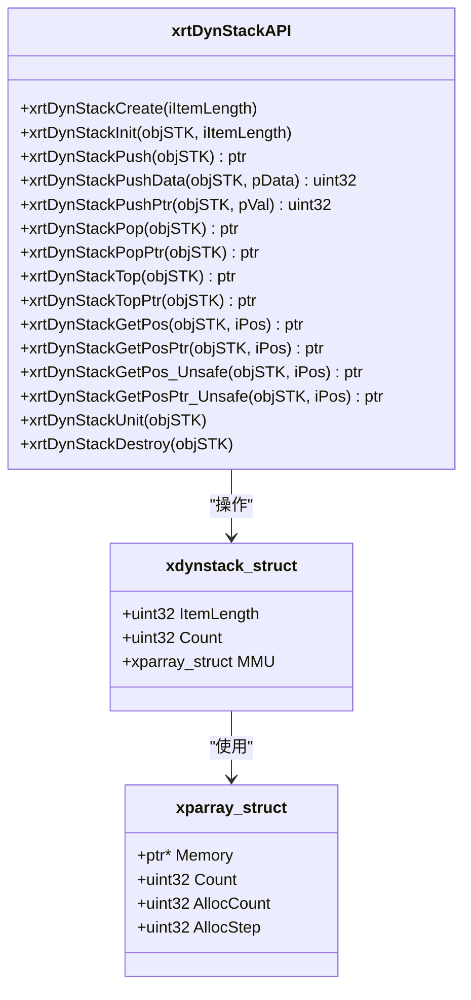
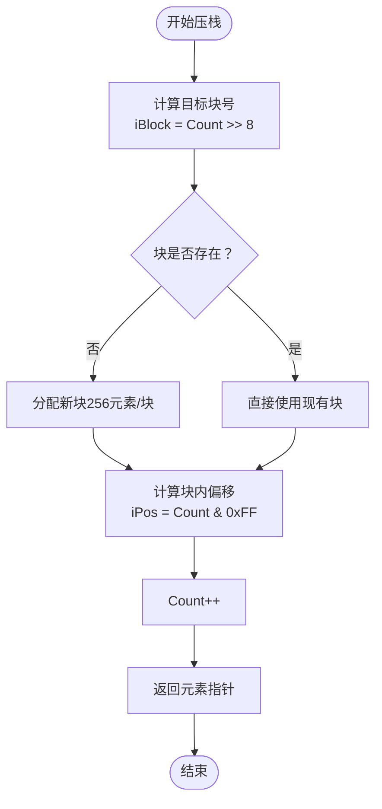

# 动态栈

<cite>
**本文引用的文件列表**
- [lib/stack_dyn.h](file://lib/stack_dyn.h)
- [docs/api-dynstack.md](file://docs/api-dynstack.md)
- [test/test_dynstack.h](file://test/test_dynstack.h)
- [test/test_dynstack_ptr.h](file://test/test_dynstack_ptr.h)
- [lib/array_point.h](file://lib/array_point.h)
- [docs/api-base.md](file://docs/api-base.md)
- [docs/api-stack.md](file://docs/api-stack.md)
- [xrt.h](file://xrt.h)
</cite>

## 目录
1. [简介](#简介)
2. [项目结构](#项目结构)
3. [核心组件](#核心组件)
4. [架构总览](#架构总览)
5. [详细组件分析](#详细组件分析)
6. [依赖关系分析](#依赖关系分析)
7. [性能考量](#性能考量)
8. [故障排查指南](#故障排查指南)
9. [结论](#结论)
10. [附录](#附录)

## 简介
本文件系统化梳理XRT动态栈模块（DynStack），围绕设计理念、实现方式、内存池集成与性能优化展开，覆盖创建与初始化、自动扩容规则、核心操作（压栈、出栈、栈顶访问）、与内存池的关系、性能特征、最佳实践及典型应用场景。同时提供与静态栈的对比与选择建议，帮助读者在不同场景下做出合理决策。

## 项目结构
动态栈位于XRT库的“lib”目录下，配套API文档位于“docs”，测试样例位于“test”。其内部通过指针数组（PtrArray）作为内存块管理器，采用“块级分配、按需增长”的策略，实现无深度限制的动态扩容。

图表来源
- [lib/stack_dyn.h](file://lib/stack_dyn.h#L1-L162)
- [lib/array_point.h](file://lib/array_point.h#L1-L199)
- [docs/api-dynstack.md](file://docs/api-dynstack.md#L1-L887)
- [test/test_dynstack.h](file://test/test_dynstack.h#L1-L289)
- [test/test_dynstack_ptr.h](file://test/test_dynstack_ptr.h#L1-L262)
- [docs/api-base.md](file://docs/api-base.md#L260-L459)
- [docs/api-stack.md](file://docs/api-stack.md#L1-L200)
- [xrt.h](file://xrt.h#L1060-L1184)

章节来源
- [lib/stack_dyn.h](file://lib/stack_dyn.h#L1-L162)
- [docs/api-dynstack.md](file://docs/api-dynstack.md#L1-L887)

## 核心组件
- 动态栈结构体：包含元素大小、当前计数、内存块管理器（PtrArray）三要素。
- 内存块管理器：以“块”为单位管理内存，每块容纳固定数量元素，按需分配新块。
- 核心API族：创建/销毁、初始化/释放、压栈/出栈、栈顶访问、随机访问等。

章节来源
- [lib/stack_dyn.h](file://lib/stack_dyn.h#L24-L41)
- [docs/api-dynstack.md](file://docs/api-dynstack.md#L68-L95)

## 架构总览
动态栈采用“两级寻址”模型：外层结构体记录全局状态；内层通过PtrArray管理多个内存块，每个块固定容量。压栈时根据当前计数计算目标块号，若块存在则直接使用，否则分配新块；出栈时采用延迟释放策略，避免频繁分配/释放导致的抖动。

图表来源
- [lib/stack_dyn.h](file://lib/stack_dyn.h#L5-L162)
- [lib/array_point.h](file://lib/array_point.h#L23-L37)
- [xrt.h](file://xrt.h#L1060-L1184)

## 详细组件分析

### 数据结构与内存布局
- 结构体字段
  - ItemLength：元素大小（字节）。结构体模式为结构体大小；指针模式为指针大小。
  - Count：当前元素数量，即栈顶位置。
  - MMU：内存块管理器（PtrArray），每块固定容量，按需分配。
- 内存布局
  - 外层结构体仅保存少量元数据；
  - MMU维护若干内存块指针，每个块固定容纳一定数量元素（见下节“扩容与块容量”）。

章节来源
- [docs/api-dynstack.md](file://docs/api-dynstack.md#L68-L95)
- [lib/stack_dyn.h](file://lib/stack_dyn.h#L24-L41)

### 创建与初始化
- 创建
  - 通过创建函数分配并初始化动态栈结构体，随后进行内部初始化。
- 初始化
  - 设置元素大小、计数为0；
  - 初始化内存块管理器（PtrArray），并设定预分配步长。
- 销毁与释放
  - 销毁函数释放所有内存块并释放栈结构体；
  - 单独释放函数仅释放内部资源，不释放结构体本身，适用于栈上/嵌入式场景。

章节来源
- [lib/stack_dyn.h](file://lib/stack_dyn.h#L5-L21)
- [lib/stack_dyn.h](file://lib/stack_dyn.h#L24-L41)
- [docs/api-dynstack.md](file://docs/api-dynstack.md#L100-L162)

### 自动扩容机制与块容量
- 块容量
  - 每块固定容纳固定数量元素（实现中以位运算确定块号与块内偏移，体现块容量为256）。
- 扩容规则
  - 压栈时根据当前计数计算目标块号；若该块已存在则直接使用；否则分配新块（256元素/块）。
- 延迟释放策略
  - 出栈时，若空闲容量超过阈值（空闲容量超过约288个元素），才释放最后一个块，避免临界状态下的频繁分配/释放。

图表来源
- [lib/stack_dyn.h](file://lib/stack_dyn.h#L44-L68)

章节来源
- [lib/stack_dyn.h](file://lib/stack_dyn.h#L44-L68)
- [docs/api-dynstack.md](file://docs/api-dynstack.md#L274-L282)

### 核心操作详解
- 压栈
  - 结构体模式：返回可直接写入的元素指针；
  - 数据模式：复制给定数据到新元素；
  - 指针模式：将指针值压入。
- 出栈
  - 结构体模式：返回栈顶元素指针并减少计数；
  - 指针模式：返回栈顶存储的指针值；
  - 延迟释放：满足条件时释放最后一个块。
- 栈顶访问
  - 结构体模式：返回栈顶元素指针；
  - 指针模式：返回栈顶指针值。
- 随机访问
  - 提供安全与不安全版本，均基于两级寻址定位元素。

章节来源
- [lib/stack_dyn.h](file://lib/stack_dyn.h#L44-L162)
- [docs/api-dynstack.md](file://docs/api-dynstack.md#L224-L588)

### 与内存池的集成
- 内存分配来源
  - 动态栈内部通过通用内存分配接口进行块级分配与释放，遵循XRT统一的内存管理规范。
- 集成关系
  - 动态栈不直接依赖特定内存池实现，而是通过通用分配/释放API完成内存块的生命周期管理。
  - 若业务侧使用XRT内存池，动态栈的内存块仍由通用分配接口负责，二者可并行使用，但无强耦合。

章节来源
- [docs/api-base.md](file://docs/api-base.md#L260-L459)
- [lib/stack_dyn.h](file://lib/stack_dyn.h#L53-L62)

### 与静态栈的对比
- 容量与布局
  - 动态栈：无上限、分块管理；
  - 静态栈：固定容量、连续内存。
- 性能与适用性
  - 动态栈：O(1)访问，两级寻址；按需分配，更省空间但有管理开销；
  - 静态栈：O(1)访问，直接偏移；预分配，避免频繁分配/释放。
- 选择建议
  - 深度可预知且追求极致性能：静态栈；
  - 深度不可预知或递归深度大：动态栈。

章节来源
- [docs/api-dynstack.md](file://docs/api-dynstack.md#L762-L777)
- [docs/api-stack.md](file://docs/api-stack.md#L21-L56)

### 实际应用示例与场景
- 深度优先搜索（DFS）：使用动态栈存储状态，自动扩容适应深度变化。
- 表达式求值：使用动态栈存储操作数，支持后缀表达式求值。
- 撤销/重做：使用两个动态栈分别维护撤销与重做历史。

章节来源
- [docs/api-dynstack.md](file://docs/api-dynstack.md#L590-L758)

## 依赖关系分析
- 组件耦合
  - 动态栈与指针数组（PtrArray）强耦合，后者提供块指针数组的动态管理能力。
  - 动态栈与通用内存分配API弱耦合，便于替换底层分配策略。
- 外部依赖
  - 依赖XRT基础API（如内存分配/释放）与类型定义（如指针类型）。
- 潜在风险
  - 随机访问的不安全版本若越界，可能导致未定义行为；
  - 出栈延迟释放策略在极端情况下可能短暂占用较多内存。

图表来源
- [lib/stack_dyn.h](file://lib/stack_dyn.h#L28-L57)
- [lib/array_point.h](file://lib/array_point.h#L23-L37)
- [docs/api-base.md](file://docs/api-base.md#L260-L459)

章节来源
- [lib/stack_dyn.h](file://lib/stack_dyn.h#L24-L41)
- [lib/array_point.h](file://lib/array_point.h#L23-L37)

## 性能考量
- 时间复杂度
  - 压栈/出栈/栈顶访问均为O(1)。
  - 随机访问为O(1)，但涉及两级寻址。
- 内存效率
  - 按需分配，避免静态栈的预分配浪费；
  - 延迟释放策略降低频繁分配/释放带来的抖动，提升整体吞吐。
- 扩容成本
  - 新块分配为O(1)摊还成本；
  - 随着元素增多，块数量线性增长，但每次扩容只增加一个块。
- 延迟释放阈值
  - 当空闲容量超过约288个元素时释放最后一个块，平衡内存占用与分配频率。

章节来源
- [lib/stack_dyn.h](file://lib/stack_dyn.h#L93-L98)
- [docs/api-dynstack.md](file://docs/api-dynstack.md#L429-L435)

## 故障排查指南
- 常见问题
  - 压栈失败：检查内存分配是否成功，确认未发生错误。
  - 随机访问越界：使用安全版本或确保索引合法；不安全版本可能导致未定义行为。
  - 出栈后内存未及时回收：理解延迟释放策略，必要时等待后续出栈触发释放。
- 排查步骤
  - 确认创建/初始化流程正确；
  - 在关键路径打印Count与MMU.Count，观察块数量变化；
  - 使用安全访问接口验证索引范围；
  - 如需立即回收，可在业务逻辑中控制出栈节奏。

章节来源
- [lib/stack_dyn.h](file://lib/stack_dyn.h#L53-L62)
- [lib/stack_dyn.h](file://lib/stack_dyn.h#L124-L159)
- [test/test_dynstack.h](file://test/test_dynstack.h#L1-L289)
- [test/test_dynstack_ptr.h](file://test/test_dynstack_ptr.h#L1-L262)

## 结论
动态栈通过“块级分配+按需扩容+延迟释放”的设计，在保证O(1)访问性能的同时，提供了无深度限制的灵活性。它特别适用于深度不可预知、递归或大规模数据处理场景。结合XRT通用内存管理API，动态栈既可独立使用，也可与业务侧其他组件协同工作。对于深度可控且追求极致性能的场景，静态栈仍是优选；对于需要弹性与易用性的场景，动态栈更具优势。

## 附录

### API参考（概览）
- 创建与销毁
  - 创建：xrtDynStackCreate
  - 销毁：xrtDynStackDestroy
  - 初始化/释放：xrtDynStackInit / xrtDynStackUnit
- 压栈
  - 结构体模式：xrtDynStackPush
  - 数据模式：xrtDynStackPushData
  - 指针模式：xrtDynStackPushPtr
- 出栈
  - 结构体模式：xrtDynStackPop
  - 指针模式：xrtDynStackPopPtr
- 栈顶与随机访问
  - 栈顶：xrtDynStackTop / xrtDynStackTopPtr
  - 随机访问：xrtDynStackGetPos / xrtDynStackGetPosPtr
  - 不安全版本：xrtDynStackGetPos_Unsafe / xrtDynStackGetPosPtr_Unsafe

章节来源
- [lib/stack_dyn.h](file://lib/stack_dyn.h#L5-L162)
- [docs/api-dynstack.md](file://docs/api-dynstack.md#L100-L588)

### 最佳实践
- 容量预估
  - 若深度可预知，优先考虑静态栈以获得更低开销；
  - 若深度波动较大，动态栈更合适。
- 内存优化
  - 合理使用延迟释放策略，避免频繁出栈导致的内存碎片；
  - 对于超大规模数据，可考虑分批处理或外部缓冲。
- 常见陷阱
  - 随机访问不安全版本越界；
  - 忘记释放资源（销毁或Unit）；
  - 在多线程环境下未加锁保护。

章节来源
- [docs/api-dynstack.md](file://docs/api-dynstack.md#L780-L800)