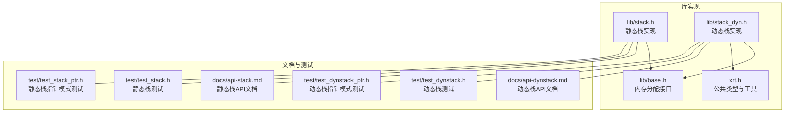
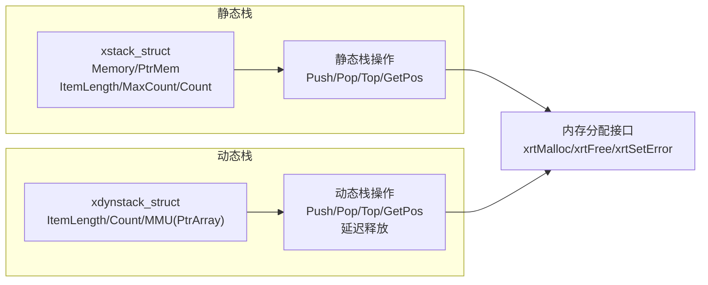
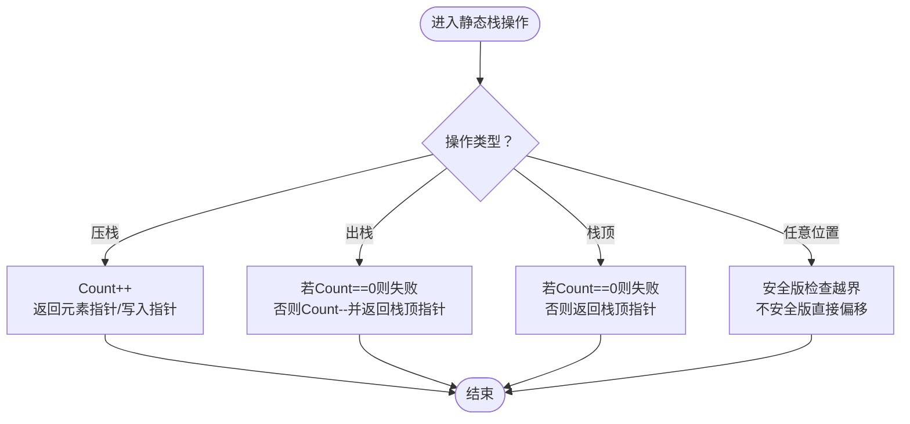
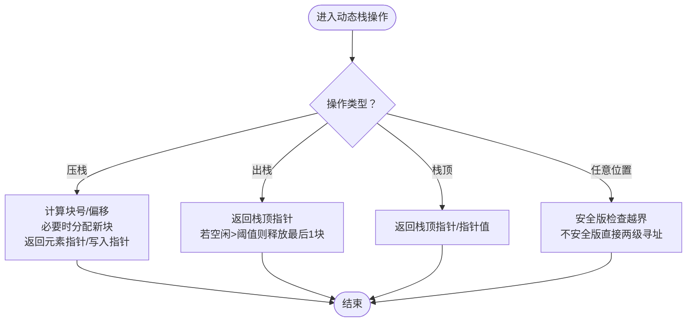
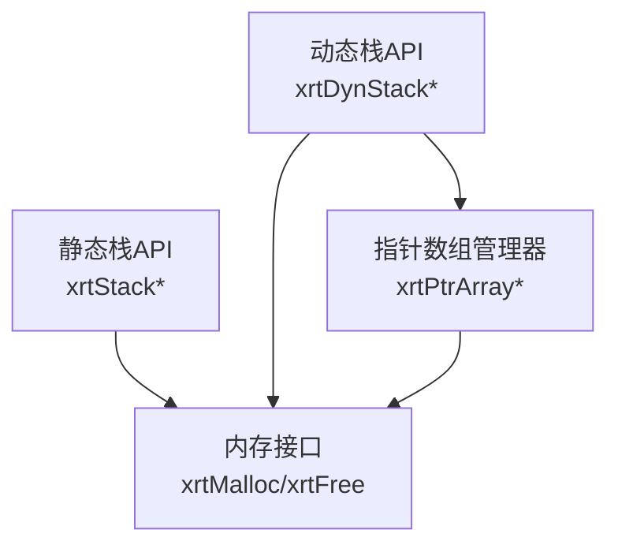

# 栈结构

<cite>
**本文引用的文件**
- [lib/stack.h](file://lib/stack.h)
- [lib/stack_dyn.h](file://lib/stack_dyn.h)
- [docs/api-stack.md](file://docs/api-stack.md)
- [docs/api-dynstack.md](file://docs/api-dynstack.md)
- [test/test_stack.h](file://test/test_stack.h)
- [test/test_stack_ptr.h](file://test/test_stack_ptr.h)
- [test/test_dynstack.h](file://test/test_dynstack.h)
- [test/test_dynstack_ptr.h](file://test/test_dynstack_ptr.h)
- [lib/base.h](file://lib/base.h)
- [xrt.h](file://xrt.h)
</cite>

## 目录
1. [简介](#简介)
2. [项目结构](#项目结构)
3. [核心组件](#核心组件)
4. [架构总览](#架构总览)
5. [详细组件分析](#详细组件分析)
6. [依赖关系分析](#依赖关系分析)
7. [性能考量](#性能考量)
8. [故障排查指南](#故障排查指南)
9. [结论](#结论)
10. [附录](#附录)

## 简介
本文件系统化梳理XRT栈模块，涵盖静态栈与动态栈的设计理念、实现细节、内存管理策略、容量控制与API使用方法，并结合测试用例与官方文档，给出性能分析、最佳实践与常见问题排查建议。读者可据此在表达式求值、递归/回溯算法等场景中正确选择与高效使用栈。

## 项目结构
XRT栈模块位于lib目录下，分别提供静态栈与动态栈两套实现；配套有详尽的用户文档与单元测试，便于理解与验证。

图表来源
- [lib/stack.h](file://lib/stack.h#L1-L135)
- [lib/stack_dyn.h](file://lib/stack_dyn.h#L1-L162)
- [lib/base.h](file://lib/base.h#L1-L132)
- [xrt.h](file://xrt.h#L1060-L1125)
- [docs/api-stack.md](file://docs/api-stack.md#L1-L718)
- [docs/api-dynstack.md](file://docs/api-dynstack.md#L1-L887)
- [test/test_stack.h](file://test/test_stack.h#L1-L253)
- [test/test_stack_ptr.h](file://test/test_stack_ptr.h#L1-L229)
- [test/test_dynstack.h](file://test/test_dynstack.h#L1-L289)
- [test/test_dynstack_ptr.h](file://test/test_dynstack_ptr.h#L1-L262)

章节来源
- [lib/stack.h](file://lib/stack.h#L1-L135)
- [lib/stack_dyn.h](file://lib/stack_dyn.h#L1-L162)
- [docs/api-stack.md](file://docs/api-stack.md#L1-L718)
- [docs/api-dynstack.md](file://docs/api-dynstack.md#L1-L887)

## 核心组件
- 静态栈（stack.h）
  - 固定容量，内存连续分配，适合深度可预知、追求极致性能的场景。
  - 支持“结构体模式”和“指针模式”，通过ItemLength区分。
  - 提供压栈、出栈、栈顶访问、任意位置访问等API族。
- 动态栈（stack_dyn.h）
  - 无固定容量上限，按需分块扩展（每块256元素），适合深度不可预知或递归深度较大的场景。
  - 内部以指针数组管理器（PtrArray）维护内存块列表，延迟释放策略避免频繁分配/释放带来的抖动。
  - 提供与静态栈一致的API族，含指针模式版本。

章节来源
- [lib/stack.h](file://lib/stack.h#L1-L135)
- [lib/stack_dyn.h](file://lib/stack_dyn.h#L1-L162)
- [docs/api-stack.md](file://docs/api-stack.md#L21-L121)
- [docs/api-dynstack.md](file://docs/api-dynstack.md#L66-L95)

## 架构总览
静态栈与动态栈共享统一的LIFO语义与API命名风格，二者在内存布局、容量控制与性能特征上形成互补。

图表来源
- [lib/stack.h](file://lib/stack.h#L23-L48)
- [lib/stack_dyn.h](file://lib/stack_dyn.h#L5-L41)
- [lib/base.h](file://lib/base.h#L4-L45)

## 详细组件分析

### 静态栈（stack.h）
- 数据结构
  - 联合体Memory/PtrMem根据模式切换访问方式；ItemLength记录每个元素字节数；MaxCount为容量上限；Count为当前元素数。
- LIFO操作机制
  - 压栈：Count自增后返回目标元素的内存指针（结构体模式）或写入指针（指针模式）。
  - 出栈：Count自减后返回栈顶元素指针；注意返回指针在下一次Push前有效。
  - 栈顶访问：返回当前栈顶元素指针（结构体模式）或栈顶指针值（指针模式）。
  - 任意位置访问：提供安全与不安全版本，索引从1开始。
- 内存管理策略
  - 创建时一次性分配连续内存，大小为结构体头+容量×元素字节数；销毁时直接释放。
  - 不涉及碎片化与分块管理，内存局部性好。
- 容量控制
  - Push/Pop前需自行检查Count与MaxCount，避免越界。
- API要点
  - 结构体模式：xrtStackPush、xrtStackPushData、xrtStackPop、xrtStackTop、xrtStackGetPos。
  - 指针模式：xrtStackPushPtr、xrtStackPopPtr、xrtStackTopPtr、xrtStackGetPosPtr。
  - 销毁：xrtStackDestroy宏即xrtFree。

图表来源
- [lib/stack.h](file://lib/stack.h#L17-L132)

章节来源
- [lib/stack.h](file://lib/stack.h#L1-L135)
- [docs/api-stack.md](file://docs/api-stack.md#L21-L48)
- [docs/api-stack.md](file://docs/api-stack.md#L124-L480)
- [test/test_stack.h](file://test/test_stack.h#L13-L253)
- [test/test_stack_ptr.h](file://test/test_stack_ptr.h#L5-L229)

### 动态栈（stack_dyn.h）
- 数据结构
  - xdynstack_struct包含ItemLength、Count与MMU（PtrArray）三要素；MMU负责管理内存块数组。
- LIFO操作机制
  - 压栈：计算块号与块内偏移，必要时分配新块；返回元素指针或写入指针。
  - 出栈：返回栈顶指针后，若空闲容量超过阈值（Count + 288），延迟释放最后1块内存。
  - 栈顶访问：Top/TopPtr返回栈顶元素指针或指针值。
  - 任意位置访问：提供安全与不安全版本。
- 内存管理策略
  - 每块固定存储256个元素，按需分配；MMU以AllocStep为步长扩容。
  - 延迟释放策略降低频繁分配/释放导致的抖动。
- 容量控制
  - 无固定上限，自动扩展；适合深度不可预知的场景。
- API要点
  - 创建/销毁：xrtDynStackCreate/xrtDynStackDestroy；也可使用xrtDynStackInit/xrtDynStackUnit配合栈上使用。
  - 结构体模式：xrtDynStackPush、xrtDynStackPushData、xrtDynStackPop、xrtDynStackTop、xrtDynStackGetPos。
  - 指针模式：xrtDynStackPushPtr、xrtDynStackPopPtr、xrtDynStackTopPtr、xrtDynStackGetPosPtr。

图表来源
- [lib/stack_dyn.h](file://lib/stack_dyn.h#L43-L159)
- [xrt.h](file://xrt.h#L1067-L1125)

章节来源
- [lib/stack_dyn.h](file://lib/stack_dyn.h#L1-L162)
- [docs/api-dynstack.md](file://docs/api-dynstack.md#L66-L95)
- [docs/api-dynstack.md](file://docs/api-dynstack.md#L224-L587)
- [test/test_dynstack.h](file://test/test_dynstack.h#L13-L289)
- [test/test_dynstack_ptr.h](file://test/test_dynstack_ptr.h#L5-L262)

### 静态栈与动态栈对比
- 容量：静态栈固定，动态栈无限扩展。
- 内存布局：静态栈连续，动态栈分块（每块256元素）。
- 性能：静态栈O(1)直接偏移，动态栈O(1)两级寻址；静态栈内存局部性更好。
- 适用场景：静态栈适合深度可预知，动态栈适合深度不可预知或递归深度较大。

章节来源
- [docs/api-dynstack.md](file://docs/api-dynstack.md#L762-L777)
- [docs/api-stack.md](file://docs/api-stack.md#L609-L633)

## 依赖关系分析
- 静态栈
  - 依赖内存分配接口（xrtMalloc/xrtFree），创建时一次性分配，销毁时直接释放。
- 动态栈
  - 依赖内存分配接口与指针数组管理器（PtrArray），内部以MMU管理内存块数组。
  - MMU默认步长为256，按需扩容；延迟释放策略基于空闲容量阈值。

图表来源
- [lib/stack.h](file://lib/stack.h#L5-L15)
- [lib/stack_dyn.h](file://lib/stack_dyn.h#L5-L41)
- [lib/base.h](file://lib/base.h#L4-L45)
- [xrt.h](file://xrt.h#L1067-L1125)

章节来源
- [lib/stack.h](file://lib/stack.h#L5-L15)
- [lib/stack_dyn.h](file://lib/stack_dyn.h#L5-L41)
- [lib/base.h](file://lib/base.h#L4-L45)
- [xrt.h](file://xrt.h#L1067-L1125)

## 性能考量
- 时间复杂度
  - 静态栈与动态栈的压栈、出栈、栈顶访问均为O(1)。
- 空间复杂度
  - 静态栈：固定为MaxCount×ItemLength；额外开销小。
  - 动态栈：每块256元素，MMU管理器带来少量额外开销；按需增长，更节省峰值内存。
- 局部性与延迟释放
  - 静态栈连续内存局部性更好，缓存命中率更高。
  - 动态栈采用延迟释放策略，避免在Count接近MaxCount时的频繁释放，减少抖动。

章节来源
- [docs/api-dynstack.md](file://docs/api-dynstack.md#L27-L32)
- [docs/api-dynstack.md](file://docs/api-dynstack.md#L429-L435)

## 故障排查指南
- 栈溢出/越界
  - 静态栈：Push/PushData/PushPtr返回NULL表示已满；应自行检查Count与MaxCount。
  - 动态栈：Push/PushData/PushPtr返回NULL表示分配失败；检查内存可用性与错误回调。
- 悬挂指针
  - 静态栈Pop返回的指针在下一次Push前有效，建议立即使用或复制。
- 内存泄漏
  - 静态栈：xrtStackDestroy即xrtFree，确保释放。
  - 动态栈：xrtDynStackDestroy释放所有内存块与MMU；栈上使用需配合xrtDynStackUnit清理。
- 错误上报
  - 动态栈在添加内存块失败时会设置错误信息，可通过错误接口获取。

章节来源
- [lib/stack.h](file://lib/stack.h#L17-L48)
- [lib/stack_dyn.h](file://lib/stack_dyn.h#L43-L68)
- [lib/base.h](file://lib/base.h#L88-L132)

## 结论
XRT提供了高性能且易用的静态栈与灵活可扩展的动态栈。静态栈适合已知深度、追求极致性能的场景；动态栈适合深度不可预知、递归深度较大的场景。通过合理的容量规划、指针模式选择与延迟释放策略，可在保证性能的同时获得良好的内存利用率。

## 附录

### API速查与使用场景
- 静态栈（结构体模式）
  - 创建：xrtStackCreate(MaxCount, ItemLength)
  - 压栈：xrtStackPush / xrtStackPushData
  - 出栈：xrtStackPop
  - 栈顶：xrtStackTop
  - 任意位置：xrtStackGetPos / xrtStackGetPos_Unsafe
  - 销毁：xrtStackDestroy
- 静态栈（指针模式）
  - 压栈：xrtStackPushPtr
  - 出栈：xrtStackPopPtr
  - 栈顶：xrtStackTopPtr
  - 任意位置：xrtStackGetPosPtr / xrtStackGetPosPtr_Unsafe
- 动态栈（结构体模式）
  - 创建：xrtDynStackCreate(ItemLength)
  - 压栈：xrtDynStackPush / xrtDynStackPushData
  - 出栈：xrtDynStackPop
  - 栈顶：xrtDynStackTop
  - 任意位置：xrtDynStackGetPos / xrtDynStackGetPos_Unsafe
  - 销毁：xrtDynStackDestroy 或 xrtDynStackUnit + xrtDynStackDestroy
- 动态栈（指针模式）
  - 压栈：xrtDynStackPushPtr
  - 出栈：xrtDynStackPopPtr
  - 栈顶：xrtDynStackTopPtr
  - 任意位置：xrtDynStackGetPosPtr / xrtDynStackGetPosPtr_Unsafe

章节来源
- [docs/api-stack.md](file://docs/api-stack.md#L124-L480)
- [docs/api-dynstack.md](file://docs/api-dynstack.md#L224-L587)

### 实际应用示例（路径指引）
- 表达式求值（静态栈）
  - 参考：docs/api-stack.md 示例“表达式求值”
- 括号匹配（静态栈）
  - 参考：docs/api-stack.md 示例“括号匹配”
- 路径回溯（静态栈）
  - 参考：docs/api-stack.md 示例“路径回溯”
- DFS（动态栈）
  - 参考：docs/api-dynstack.md 示例“深度优先搜索”
- 后缀表达式求值（动态栈）
  - 参考：docs/api-dynstack.md 示例“表达式求值”
- 撤销/重做（动态栈）
  - 参考：docs/api-dynstack.md 示例“撤销/重做功能”

章节来源
- [docs/api-stack.md](file://docs/api-stack.md#L483-L605)
- [docs/api-dynstack.md](file://docs/api-dynstack.md#L590-L758)

### 最佳实践
- 选择合适栈类型
  - 已知最大深度 → 静态栈；深度不可预知 → 动态栈。
- 栈满检查
  - 静态栈：Push前检查Count与MaxCount；动态栈：Push失败时检查错误。
- 避免悬挂指针
  - 静态栈Pop返回的指针在下一次Push前有效，建议立即使用或复制。
- 内存优化
  - 动态栈合理利用延迟释放策略，避免在临界状态频繁分配/释放。
  - 静态栈尽量一次性估算容量，减少重复创建销毁。

章节来源
- [docs/api-stack.md](file://docs/api-stack.md#L609-L700)
- [docs/api-dynstack.md](file://docs/api-dynstack.md#L780-L799)