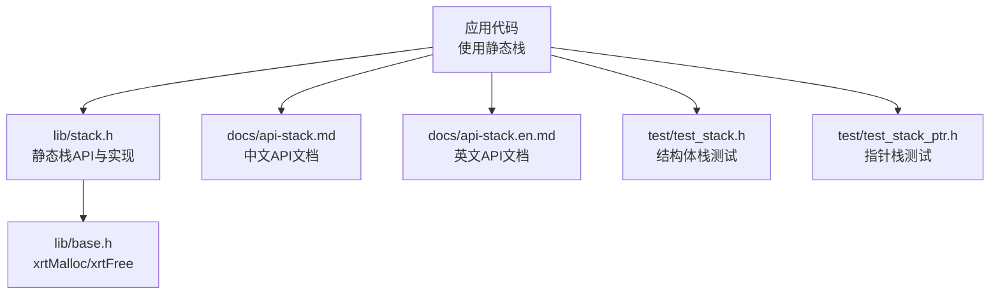
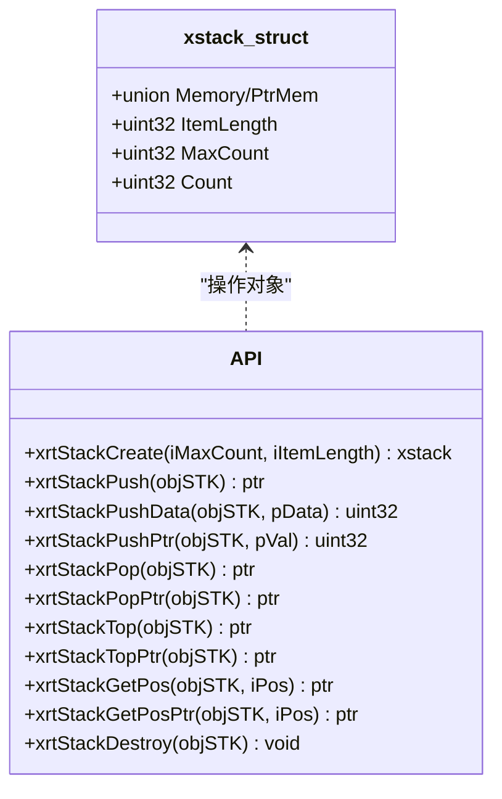
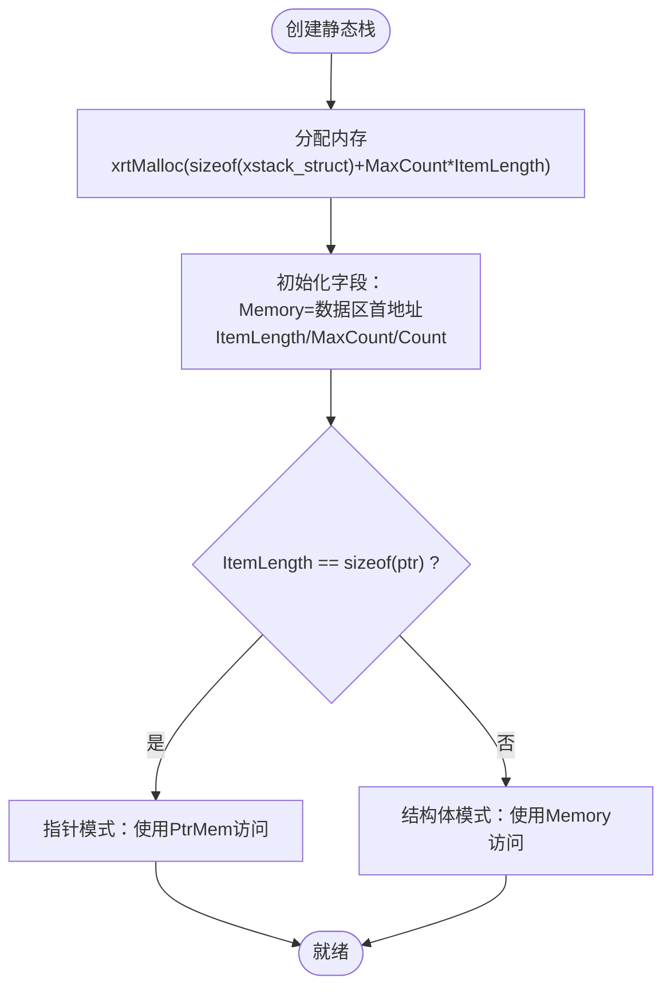
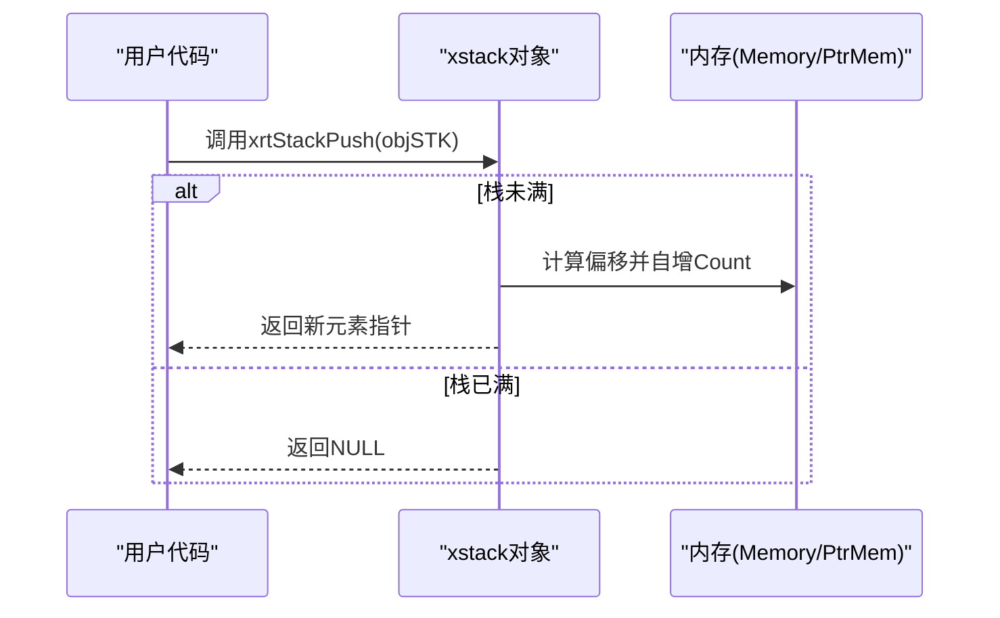
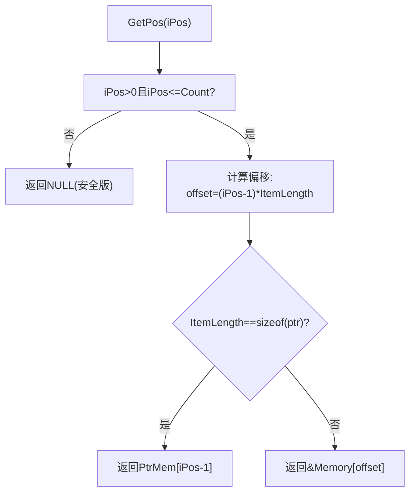
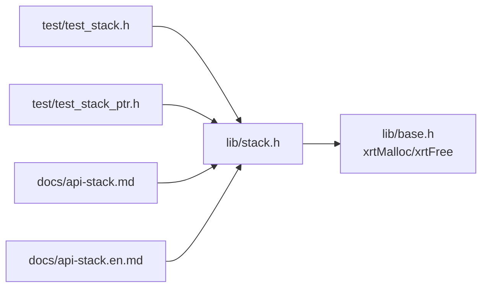

# 静态栈

<cite>
**本文引用的文件列表**
- [lib/stack.h](file://lib/stack.h)
- [docs/api-stack.md](file://docs/api-stack.md)
- [docs/api-stack.en.md](file://docs/api-stack.en.md)
- [docs/api-dynstack.en.md](file://docs/api-dynstack.en.md)
- [test/test_stack.h](file://test/test_stack.h)
- [test/test_stack_ptr.h](file://test/test_stack_ptr.h)
- [lib/base.h](file://lib/base.h)
- [docs/api-base.md](file://docs/api-base.md)
- [docs/types.en.md](file://docs/types.en.md)
</cite>

## 目录
1. [简介](#简介)
2. [项目结构与定位](#项目结构与定位)
3. [核心组件总览](#核心组件总览)
4. [架构概览](#架构概览)
5. [详细组件分析](#详细组件分析)
6. [依赖关系分析](#依赖关系分析)
7. [性能与复杂度](#性能与复杂度)
8. [故障排查指南](#故障排查指南)
9. [结论](#结论)
10. [附录：常见应用场景与示例路径](#附录常见应用场景与示例路径)

## 简介
本篇文档系统化阐述XRT静态栈模块的设计原理与实现机制，重点围绕xstack结构体的内存布局、固定容量特性与性能优势展开；详解静态栈的创建流程（xrtStackCreate）、内存分配策略与容量限制；全面讲解栈操作API（压栈、出栈、栈顶访问、任意位置元素访问）；并结合测试用例与官方文档，给出内存使用特征、时间复杂度、适用场景与选型建议，以及在编译器符号表、表达式求值、函数调用栈等典型场景中的应用思路与示例路径。

## 项目结构与定位
- 静态栈位于库目录的头文件中，提供完整的API与实现；配套有中文与英文API文档，涵盖数据结构、操作、使用场景与最佳实践。
- 测试用例分别演示了结构体栈与指针栈的完整生命周期与边界行为，便于理解API语义与错误处理。
- 内存管理通过全局回调函数实现，静态栈的内存一次性分配、统一释放，简化了资源管理。

**图表来源**
- [lib/stack.h](file://lib/stack.h#L1-L135)
- [lib/base.h](file://lib/base.h#L1-L132)
- [docs/api-stack.md](file://docs/api-stack.md#L1-L718)
- [docs/api-stack.en.md](file://docs/api-stack.en.md#L1-L636)
- [test/test_stack.h](file://test/test_stack.h#L1-L253)
- [test/test_stack_ptr.h](file://test/test_stack_ptr.h#L1-L229)

**章节来源**
- [lib/stack.h](file://lib/stack.h#L1-L135)
- [docs/api-stack.md](file://docs/api-stack.md#L1-L718)
- [docs/api-stack.en.md](file://docs/api-stack.en.md#L1-L636)
- [test/test_stack.h](file://test/test_stack.h#L1-L253)
- [test/test_stack_ptr.h](file://test/test_stack_ptr.h#L1-L229)
- [lib/base.h](file://lib/base.h#L1-L132)

## 核心组件总览
- xstack结构体：包含联合体Memory/PtrMem、元素大小ItemLength、最大容量MaxCount、当前计数Count，支持结构体模式与指针模式。
- 关键API：
  - 创建：xrtStackCreate
  - 压栈：xrtStackPush、xrtStackPushData、xrtStackPushPtr
  - 出栈：xrtStackPop、xrtStackPopPtr
  - 栈顶访问：xrtStackTop、xrtStackTopPtr
  - 任意位置访问：xrtStackGetPos、xrtStackGetPos_Unsafe、xrtStackGetPosPtr、xrtStackGetPosPtr_Unsafe
  - 销毁：xrtStackDestroy（宏即xrtFree）

**章节来源**
- [docs/api-stack.md](file://docs/api-stack.md#L21-L55)
- [docs/api-stack.en.md](file://docs/api-stack.en.md#L21-L56)
- [lib/stack.h](file://lib/stack.h#L5-L135)

## 架构概览
静态栈采用“单块连续内存”的设计，创建时一次性分配栈头+数据区，内部通过偏移量进行O(1)随机访问。结构体模式下，元素直接存储于连续内存；指针模式下，元素以指针形式存储，内部通过联合体在Memory与PtrMem之间切换访问方式。

**图表来源**
- [docs/api-stack.md](file://docs/api-stack.md#L21-L55)
- [lib/stack.h](file://lib/stack.h#L5-L135)

## 详细组件分析

### xstack结构体与内存布局
- 联合体设计：Memory用于结构体模式下的直接存储；PtrMem用于指针模式下的指针数组。
- 连续内存：创建时一次性分配sizeof(xstack_struct)+iMaxCount*iItemLength，避免碎片化与多次分配开销。
- 模式切换：根据ItemLength是否等于sizeof(ptr)决定使用Memory还是PtrMem访问。

**图表来源**
- [lib/stack.h](file://lib/stack.h#L5-L15)
- [docs/api-stack.md](file://docs/api-stack.md#L21-L55)

**章节来源**
- [docs/api-stack.md](file://docs/api-stack.md#L21-L55)
- [docs/api-stack.en.md](file://docs/api-stack.en.md#L21-L56)
- [lib/stack.h](file://lib/stack.h#L5-L15)

### 创建过程与内存分配策略
- 参数：iMaxCount（最大深度）、iItemLength（元素字节数）
- 分配策略：一次性分配，避免动态扩容带来的碎片与延迟；适合已知上限的场景。
- 容量限制：Count达到MaxCount后，后续Push操作失败（返回空指针或0）。
- 销毁策略：xrtStackDestroy即xrtFree，释放整块内存，简单高效。

**章节来源**
- [lib/stack.h](file://lib/stack.h#L5-L15)
- [docs/api-stack.md](file://docs/api-stack.md#L109-L122)

### 压栈操作（Push）
- xrtStackPush：返回新元素的可写指针，适合结构体模式；返回NULL表示栈满。
- xrtStackPushData：复制传入数据到新位置，返回1-based位置；失败返回0。
- xrtStackPushPtr：存储指针值，适合指针模式；失败返回0。
- 指针模式优化：当ItemLength==sizeof(ptr)时，直接写入PtrMem，避免额外拷贝。

**图表来源**
- [lib/stack.h](file://lib/stack.h#L18-L48)

**章节来源**
- [lib/stack.h](file://lib/stack.h#L18-L48)
- [docs/api-stack.md](file://docs/api-stack.md#L124-L274)

### 出栈操作（Pop）
- xrtStackPop：返回栈顶元素指针（在下次Push前有效），空栈返回NULL。
- xrtStackPopPtr：返回存储的指针值；空栈返回NULL。
- 注意：Pop返回的指针在下一次Push后可能被覆盖，应尽快使用或复制。

**章节来源**
- [lib/stack.h](file://lib/stack.h#L51-L71)
- [docs/api-stack.md](file://docs/api-stack.md#L277-L347)

### 栈顶访问（Top）
- xrtStackTop：返回栈顶元素指针（不弹出）。
- xrtStackTopPtr：返回栈顶指针值（不弹出）。
- 与Pop的区别在于不减少Count。

**章节来源**
- [lib/stack.h](file://lib/stack.h#L74-L92)
- [docs/api-stack.md](file://docs/api-stack.md#L351-L398)

### 任意位置元素访问（GetPos）
- xrtStackGetPos：安全版本，越界返回NULL。
- xrtStackGetPos_Unsafe：不安全版本，越界行为未定义。
- xrtStackGetPosPtr / xrtStackGetPosPtr_Unsafe：针对指针模式的访问。
- 1-based索引，1表示栈底，Count表示栈顶。

**图表来源**
- [lib/stack.h](file://lib/stack.h#L95-L132)

**章节来源**
- [lib/stack.h](file://lib/stack.h#L95-L132)
- [docs/api-stack.md](file://docs/api-stack.md#L402-L481)

### 指针栈与结构体栈的差异
- 结构体栈：元素直接存储在Memory中，适合小对象或需要连续内存的场景。
- 指针栈：元素为指针，适合管理外部对象或大结构体，避免拷贝成本。

**章节来源**
- [docs/api-stack.md](file://docs/api-stack.md#L49-L55)
- [docs/api-stack.en.md](file://docs/api-stack.en.md#L49-L56)

## 依赖关系分析
- 内部依赖：API均基于xstack结构体字段进行O(1)偏移计算，无间接依赖。
- 外部依赖：内存分配依赖全局回调（xCore.malloc/calloc/realloc/free），创建时通过xrtMalloc完成一次性分配；销毁时通过xrtFree释放。

**图表来源**
- [lib/stack.h](file://lib/stack.h#L1-L135)
- [lib/base.h](file://lib/base.h#L1-L132)
- [test/test_stack.h](file://test/test_stack.h#L1-L253)
- [test/test_stack_ptr.h](file://test/test_stack_ptr.h#L1-L229)
- [docs/api-stack.md](file://docs/api-stack.md#L1-L718)
- [docs/api-stack.en.md](file://docs/api-stack.en.md#L1-L636)

**章节来源**
- [lib/stack.h](file://lib/stack.h#L1-L135)
- [lib/base.h](file://lib/base.h#L1-L132)

## 性能与复杂度
- 时间复杂度：所有操作均为O(1)，基于连续内存的直接偏移访问。
- 空间复杂度：O(MaxCount*ItemLength)，一次性分配，无额外指针开销。
- 性能优势：
  - 无动态扩容与碎片化问题
  - 缓存局部性好（连续内存）
  - 指针模式下避免大对象拷贝
- 适用场景：
  - 已知最大深度（如编译器语法分析、表达式求值、固定规模的函数调用栈）
  - 对性能敏感且内存可控的嵌入式或实时系统
- 与动态栈对比（参考官方文档）：
  - 静态栈：固定容量、连续内存、极致性能
  - 动态栈：自动扩展、按需分配、深度不确定

**章节来源**
- [docs/api-dynstack.en.md](file://docs/api-dynstack.en.md#L762-L777)
- [docs/api-stack.md](file://docs/api-stack.md#L609-L636)

## 故障排查指南
- 栈满：Push返回NULL或0，应检查Count与MaxCount的关系，必要时预检或改用动态栈。
- 悬挂指针：Pop返回的指针在下一次Push前有效，避免跨次使用；如需保留，应复制数据。
- 越界访问：安全版GetPos在越界时返回NULL；不安全版可能导致未定义行为。
- 指针模式误用：确保ItemLength与sizeof(ptr)一致，否则访问逻辑会走通用分支。
- 内存泄漏：确保调用xrtStackDestroy（即xrtFree）释放整块内存。

**章节来源**
- [lib/stack.h](file://lib/stack.h#L18-L48)
- [docs/api-stack.md](file://docs/api-stack.md#L327-L328)
- [docs/api-stack.md](file://docs/api-stack.md#L418-L419)

## 结论
XRT静态栈通过“单块连续内存+O(1)偏移”的设计，在已知深度的场景下提供了极高的性能与确定性的内存占用。其API简洁、语义清晰，配合测试用例与官方文档，易于在编译器、解释器、表达式求值、路径回溯等场景中落地。对于深度未知或深度极大且不可预测的场景，建议参考动态栈方案。

## 附录：常见应用场景与示例路径
- 表达式求值：使用结构体栈存储数字或中间结果，按需Pop/Top进行计算。
  - 示例路径：[docs/api-stack.md](file://docs/api-stack.md#L485-L518)
- 括号匹配：使用字符栈进行括号匹配，遇到右括号时Pop校验。
  - 示例路径：[docs/api-stack.md](file://docs/api-stack.md#L522-L566)
- 路径回溯：使用结构体栈记录坐标，回溯时逐个Pop输出。
  - 示例路径：[docs/api-stack.md](file://docs/api-stack.md#L570-L605)
- 编译器符号表：使用指针栈存储符号项指针，避免拷贝大对象。
  - 示例路径：[test/test_stack_ptr.h](file://test/test_stack_ptr.h#L1-L229)
- 函数调用栈：在解释器或虚拟机中模拟调用帧，使用指针栈保存返回地址与局部变量指针。
  - 示例路径：[docs/api-stack.md](file://docs/api-stack.md#L611-L633)