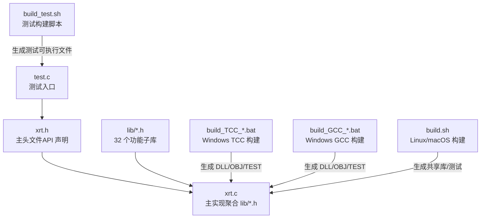
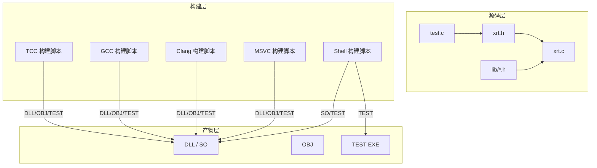
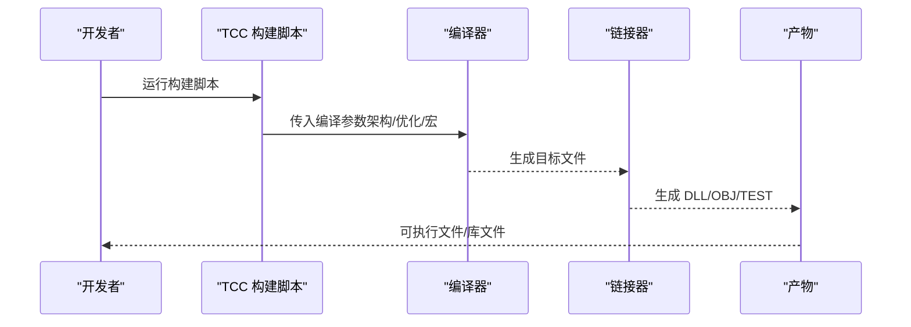
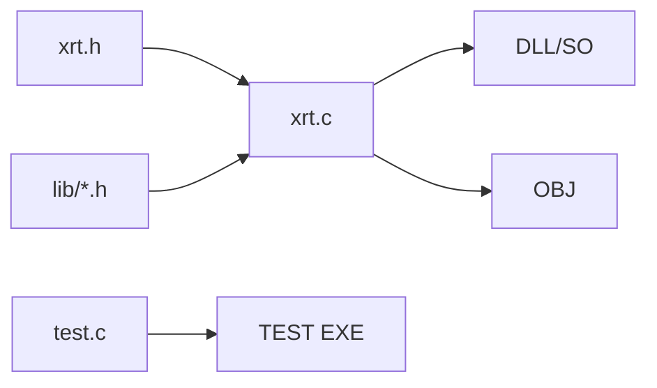

# 构建与部署

<cite>
**本文引用的文件**
- [README.md](file://README.md)
- [xrt.h](file://xrt.h)
- [xrt.c](file://xrt.c)
- [test.c](file://test.c)
- [build.sh](file://build.sh)
- [build_test.sh](file://build_test.sh)
- [build_GCC_DLL_x64.bat](file://build_GCC_DLL_x64.bat)
- [build_TCC_DLL_x64.bat](file://build_TCC_DLL_x64.bat)
- [build_TCC_DLL_x86.bat](file://build_TCC_DLL_x86.bat)
- [build_TCC_OBJ_x64.bat](file://build_TCC_OBJ_x64.bat)
- [build_TCC_OBJ_x86.bat](file://build_TCC_OBJ_x86.bat)
- [build_TCC_TEST_x64.bat](file://build_TCC_TEST_x64.bat)
- [build_TCC_TEST_x86.bat](file://build_TCC_TEST_x86.bat)
- [平台判断.txt](file://平台判断.txt)
- [数据类型约定.txt](file://数据类型约定.txt)
</cite>

## 目录
1. [简介](#简介)
2. [项目结构](#项目结构)
3. [核心组件](#核心组件)
4. [架构总览](#架构总览)
5. [详细组件分析](#详细组件分析)
6. [依赖关系分析](#依赖关系分析)
7. [性能考量](#性能考量)
8. [故障排除指南](#故障排除指南)
9. [结论](#结论)
10. [附录](#附录)

## 简介
本指南面向跨平台构建与部署 XRT（X Runtime Library）。XRT 是一个功能完备的 C 语言运行时库，提供内存管理、字符集转换、文件处理、数据结构、动态类型系统、JSON 处理、模板引擎等能力。项目支持四大编译器（TCC、GCC、Clang、MSVC）与三大平台（Windows、Linux、macOS），并提供 DLL、OBJ、TEST 三种构建目标。

本指南将系统讲解：
- 跨平台构建系统与编译器支持
- Windows/Linux/macOS 平台的具体构建步骤与配置
- 构建目标（DLL、OBJ、TEST）的特性与适用场景
- 发布流程、版本管理与分发策略
- 持续集成与自动化部署建议
- 构建优化技巧与常见问题排查

## 项目结构
XRT 采用“单头文件 + 多子库”的架构设计，核心 API 定义于主头文件，实际实现通过包含各子库头文件聚合而成。构建脚本位于根目录，分别针对不同编译器与目标平台提供批处理与 Shell 脚本。

图表来源
- [xrt.h](file://xrt.h#L114-L118)
- [xrt.c](file://xrt.c#L54-L83)
- [build_TCC_DLL_x64.bat](file://build_TCC_DLL_x64.bat#L1)
- [build_GCC_DLL_x64.bat](file://build_GCC_DLL_x64.bat#L1)
- [build.sh](file://build.sh#L3-L4)
- [build_test.sh](file://build_test.sh#L3-L5)

章节来源
- [README.md](file://README.md#L355-L398)
- [xrt.h](file://xrt.h#L114-L118)
- [xrt.c](file://xrt.c#L54-L83)

## 核心组件
- 主头文件与导出宏
  - 通过条件编译与导出宏控制 DLL 导出行为，确保跨平台一致的 API 可见性。
- 主实现文件
  - 聚合 32 个子库头文件，形成统一的运行时实现。
- 测试入口
  - 汇聚 31 个测试模块，支持按需启用与批量执行。
- 构建脚本
  - 针对不同编译器与目标提供批处理与 Shell 脚本，覆盖 DLL、OBJ、TEST 三类输出。

章节来源
- [xrt.h](file://xrt.h#L114-L118)
- [xrt.c](file://xrt.c#L54-L83)
- [test.c](file://test.c#L11-L43)
- [README.md](file://README.md#L402-L429)

## 架构总览
XRT 的构建与部署围绕“单头文件 + 多子库 + 跨编译器 + 多平台”展开。下图展示从源码到产物的关键路径与目标类型：

图表来源
- [xrt.h](file://xrt.h#L114-L118)
- [xrt.c](file://xrt.c#L54-L83)
- [build_TCC_DLL_x64.bat](file://build_TCC_DLL_x64.bat#L1)
- [build_GCC_DLL_x64.bat](file://build_GCC_DLL_x64.bat#L1)
- [build.sh](file://build.sh#L3-L4)
- [build_test.sh](file://build_test.sh#L3-L5)

## 详细组件分析

### 跨平台与编译器支持
- 平台判定
  - 通过预定义宏判断 Windows、Linux、macOS 等平台，确保条件编译正确。
- 编译器支持
  - TCC：快速编译，适合开发调试与脚本式使用。
  - GCC：成熟稳定，优化良好，适合生产环境与跨平台编译。
  - Clang：LLVM 后端，诊断信息清晰，适合 macOS/iOS 开发。
  - MSVC：Windows 原生支持，适合 Visual Studio 集成。

章节来源
- [平台判断.txt](file://平台判断.txt#L4-L14)
- [平台判断.txt](file://平台判断.txt#L18-L28)
- [README.md](file://README.md#L404-L412)

### Windows 平台构建
- TCC 构建
  - DLL（x64/x86）：生成动态链接库，链接必要系统库。
  - OBJ（x64/x86）：生成静态目标文件，便于进一步链接。
  - TEST（x64/x86）：生成测试可执行文件，直接运行验证。
- GCC 构建（Windows）
  - 生成 64 位 DLL，链接 Windows 网络库与系统库。
- MSVC/Clang
  - 作为替代编译器，可在 Visual Studio 或 Xcode 中直接打开工程进行构建（本仓库提供批处理脚本以覆盖常用场景）。

章节来源
- [build_TCC_DLL_x64.bat](file://build_TCC_DLL_x64.bat#L1)
- [build_TCC_DLL_x86.bat](file://build_TCC_DLL_x86.bat#L1)
- [build_TCC_OBJ_x64.bat](file://build_TCC_OBJ_x64.bat#L1)
- [build_TCC_OBJ_x86.bat](file://build_TCC_OBJ_x86.bat#L1)
- [build_TCC_TEST_x64.bat](file://build_TCC_TEST_x64.bat#L1)
- [build_TCC_TEST_x86.bat](file://build_TCC_TEST_x86.bat#L1)
- [build_GCC_DLL_x64.bat](file://build_GCC_DLL_x64.bat#L1)

### Linux/macOS 平台构建
- Shell 脚本
  - 一键生成 64 位共享库与测试可执行文件，简化跨平台构建流程。
- 共享库与测试
  - 共享库用于动态链接；测试可执行文件用于功能验证。

章节来源
- [build.sh](file://build.sh#L3-L4)
- [build_test.sh](file://build_test.sh#L3-L5)

### 构建目标与适用场景
- DLL（动态链接库）
  - 适用于需要动态加载与共享库复用的场景，减少可执行文件体积，便于更新与维护。
- OBJ（静态目标文件）
  - 适用于需要进一步链接到自定义可执行文件或静态库的场景，便于控制最终产物。
- TEST（测试可执行文件）
  - 适用于快速验证功能与回归测试，便于 CI/CD 环境中执行自动化测试。

章节来源
- [README.md](file://README.md#L421-L428)

### 数据类型与导出约定
- 数据类型约定
  - 统一的类型别名与命名规范，确保跨平台一致性与可读性。
- 导出宏
  - 通过导出宏控制 DLL 导出，保证在不同平台与编译器下的 API 可见性。

章节来源
- [数据类型约定.txt](file://数据类型约定.txt#L1-L23)
- [xrt.h](file://xrt.h#L114-L118)

### 构建流程时序（以 TCC 为例）

图表来源
- [build_TCC_DLL_x64.bat](file://build_TCC_DLL_x64.bat#L1)
- [build_TCC_OBJ_x64.bat](file://build_TCC_OBJ_x64.bat#L1)
- [build_TCC_TEST_x64.bat](file://build_TCC_TEST_x64.bat#L1)

## 依赖关系分析
- 内部依赖
  - 主头文件与实现文件之间存在直接包含关系；实现文件聚合 32 个子库头文件，形成统一运行时。
- 外部依赖
  - Windows：链接系统库（如网络与系统接口）。
  - Linux/macOS：依赖标准 C 库与系统接口。
- 构建脚本依赖
  - TCC/GCC/Clang/MSVC 的可用性与版本差异会影响编译参数与产物形态。

图表来源
- [xrt.h](file://xrt.h#L114-L118)
- [xrt.c](file://xrt.c#L54-L83)
- [test.c](file://test.c#L11-L43)

章节来源
- [xrt.c](file://xrt.c#L54-L83)
- [test.c](file://test.c#L11-L43)

## 性能考量
- 编译优化
  - 使用优化等级与链接时垃圾回收选项，减小产物体积并提升运行时性能。
- 构建目标选择
  - DLL 适合动态加载与共享复用；OBJ 适合进一步链接；TEST 适合快速验证。
- 平台特定优化
  - Windows 下注意链接系统库；Linux/macOS 下注意共享库路径与权限。

章节来源
- [build.sh](file://build.sh#L3-L4)
- [build_test.sh](file://build_test.sh#L3-L5)
- [build_GCC_DLL_x64.bat](file://build_GCC_DLL_x64.bat#L1)

## 故障排除指南
- 平台宏未生效
  - 检查平台宏定义与编译器宏，确保条件编译分支正确。
- 链接错误（Windows）
  - 确认链接了必要的系统库（如网络与系统接口），并检查库路径与架构匹配。
- TCC 编译失败
  - 检查 TCC 版本与标准支持，必要时切换到 GCC/Clang/MSVC。
- 测试无法运行
  - 确认测试可执行文件路径与权限，检查控制台编码设置（Windows 下设置 UTF-8 输出）。

章节来源
- [平台判断.txt](file://平台判断.txt#L4-L14)
- [build_TCC_DLL_x64.bat](file://build_TCC_DLL_x64.bat#L1)
- [test.c](file://test.c#L56-L58)

## 结论
XRT 的构建与部署体系以“单头文件 + 多子库 + 跨编译器 + 多平台”为核心，配合完善的构建脚本与测试流程，能够高效支撑跨平台开发与交付。通过合理选择构建目标与编译器，结合平台特定优化与故障排除策略，可以显著提升开发效率与产物质量。

## 附录

### 构建目标对比与适用场景
- DLL
  - 优点：共享复用、易于更新、体积小
  - 适用：动态加载、插件化架构、多应用共享
- OBJ
  - 优点：灵活链接、可控最终产物
  - 适用：静态库封装、进一步定制链接
- TEST
  - 优点：快速验证、便于自动化
  - 适用：CI/CD、回归测试、演示验证

章节来源
- [README.md](file://README.md#L421-L428)

### 发布流程与版本管理建议
- 版本标记
  - 建议采用语义化版本（主.次.补丁），并在发布前更新 API 文档与变更记录。
- 产物打包
  - 将 DLL/SO、OBJ、测试可执行文件按架构分类打包，附带 API 文档与使用示例。
- 分发策略
  - 提供包管理器与下载镜像，确保跨平台一致性与可追溯性。

章节来源
- [README.md](file://README.md#L431-L536)

### 持续集成与自动化部署
- 触发条件
  - 提交触发构建与测试，合并主干执行发布打包。
- 平台矩阵
  - 覆盖 Windows（TCC/GCC/MSVC）、Linux（GCC/Clang）、macOS（Clang）。
- 自动化步骤
  - 执行构建脚本、运行测试、上传制品、生成发布说明。

章节来源
- [build_TCC_DLL_x64.bat](file://build_TCC_DLL_x64.bat#L1)
- [build_GCC_DLL_x64.bat](file://build_GCC_DLL_x64.bat#L1)
- [build.sh](file://build.sh#L3-L4)
- [build_test.sh](file://build_test.sh#L3-L5)