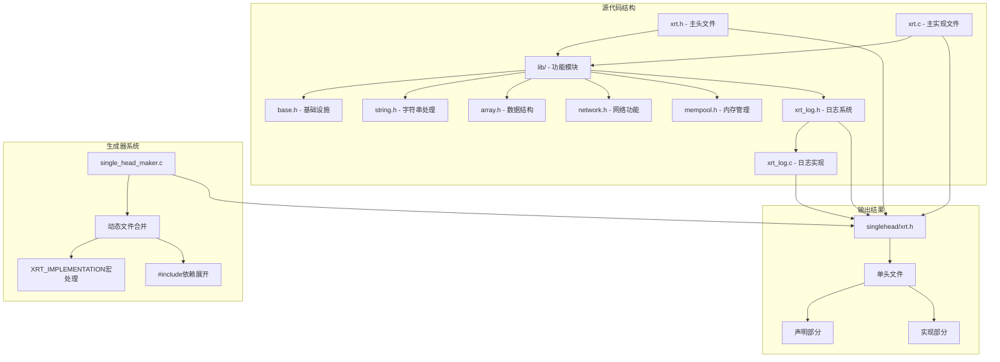
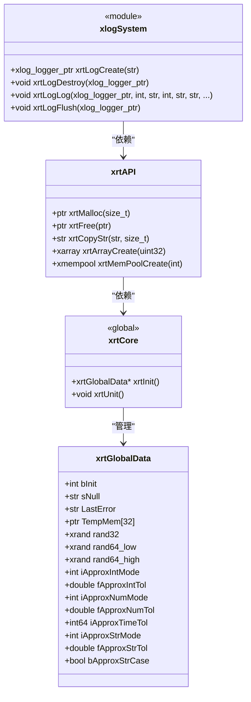
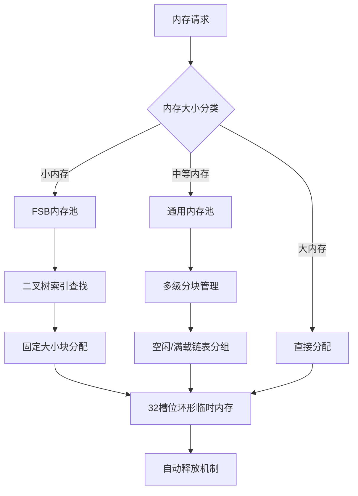
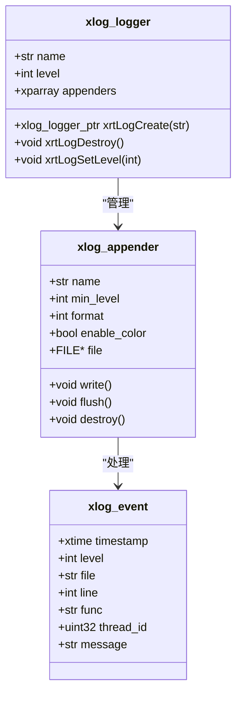
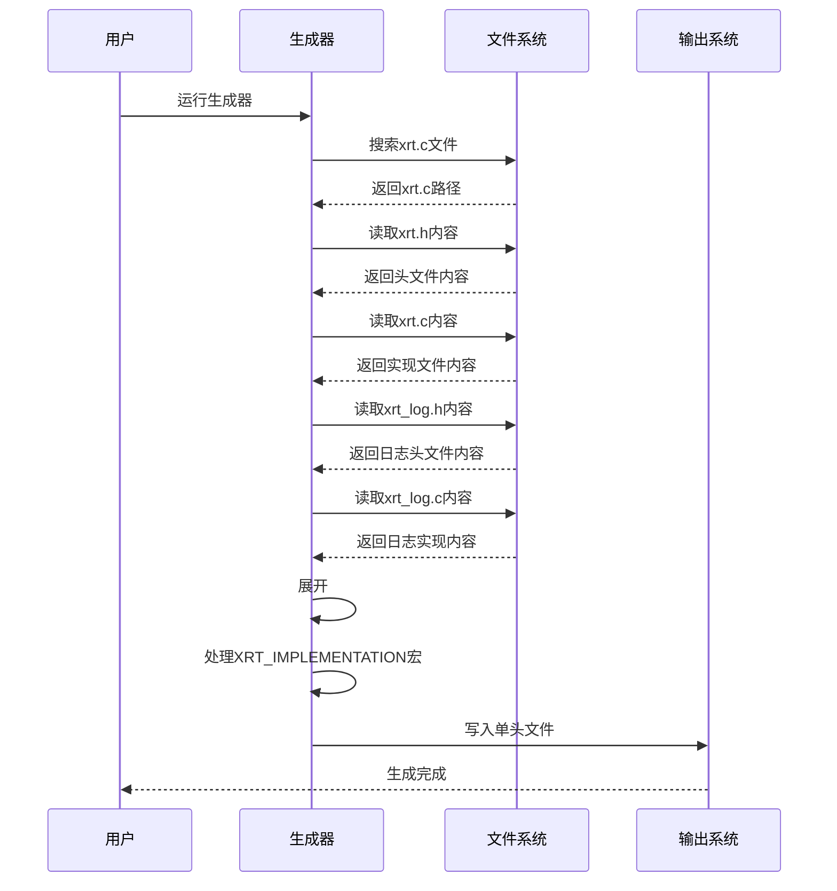
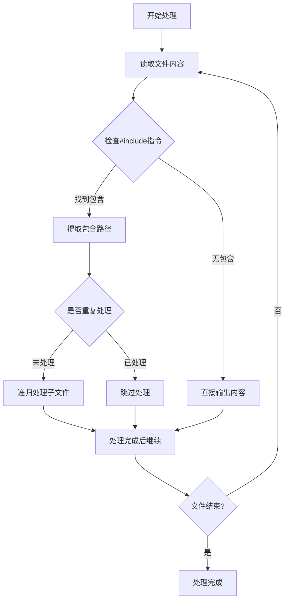
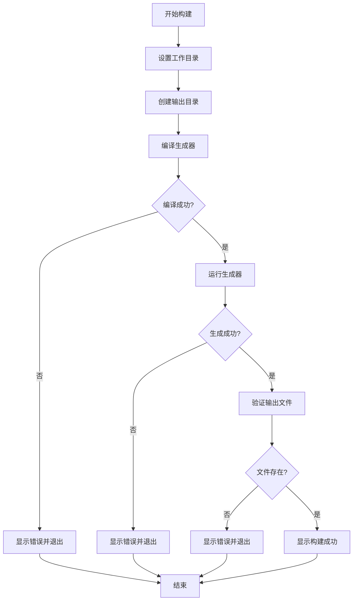
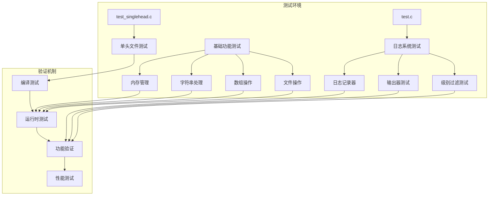
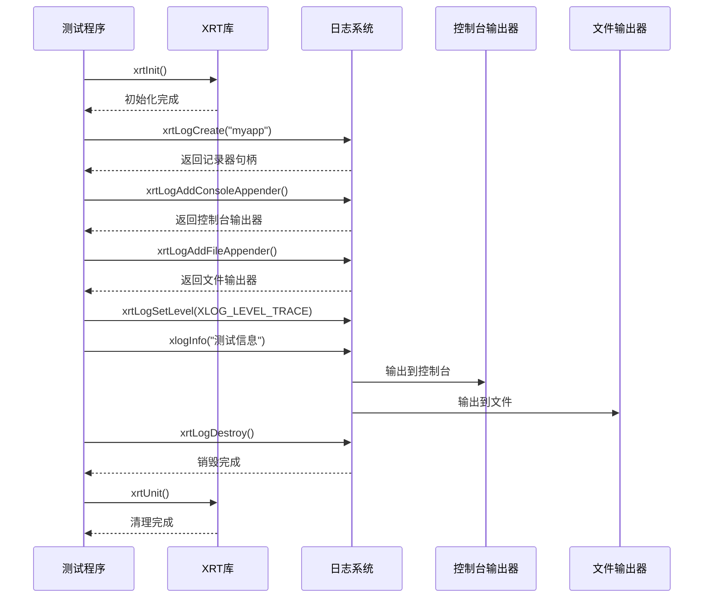

# 单头文件分发系统

<cite>
**本文档引用的文件**
- [xrt.h](file://xrt.h)
- [xrt.c](file://xrt.c)
- [single_head_maker.c](file://tools/single_head_maker/single_head_maker.c)
- [single_head_maker.exe](file://tools/single_head_maker/single_head_maker.exe)
- [README.md](file://tools/single_head_maker/README.md)
- [build_single_head.bat](file://build_single_head.bat)
- [test_singlehead.c](file://singlehead/test_singlehead.c)
- [xrt_log.h](file://dev/log/xrt_log.h)
- [xrt_log.c](file://dev/log/xrt_log.c)
- [test.c](file://dev/log/test.c)
- [build.bat](file://dev/log/build.bat)
- [base.h](file://lib/base.h)
- [string.h](file://lib/string.h)
- [array.h](file://lib/array.h)
- [network.h](file://lib/network.h)
- [mempool.h](file://lib/mempool.h)
- [xrt.h](file://singlehead/xrt.h)
</cite>

## 更新摘要
**所做更改**
- 新增开发日志框架集成章节，详细介绍日志系统的特性和使用方法
- 更新单头文件生成器支持，反映对新日志模块的集成能力
- 增加日志系统的API参考和使用示例
- 补充日志功能的测试验证和故障排除指南

## 目录
1. [项目概述](#项目概述)
2. [系统架构](#系统架构)
3. [核心组件分析](#核心组件分析)
4. [开发日志框架集成](#开发日志框架集成)
5. [单头文件生成器](#单头文件生成器)
6. [构建流程](#构建流程)
7. [使用指南](#使用指南)
8. [测试验证](#测试验证)
9. [性能分析](#性能分析)
10. [故障排除](#故障排除)
11. [总结](#总结)

## 项目概述

单头文件分发系统是XRT（X Runtime Library）项目中的一个重要组成部分，旨在将整个C语言运行时库打包为单一的头文件形式，实现"零依赖、零配置"的便捷使用体验。

### 系统特点

- **零依赖设计**：除标准C库外无任何外部依赖
- **单文件架构**：核心API统一定义在单个头文件中
- **跨平台支持**：支持Windows、Linux、macOS三大平台
- **即时可用**：引入即用，无需复杂的编译配置
- **完整功能**：包含32个功能模块，2320行API声明
- **现代化扩展**：支持新增的日志框架集成

### 技术优势

- **编译器兼容**：支持TCC、GCC、Clang、MSVC四大编译器
- **内存优化**：多级内存池架构，极致性能表现
- **类型系统**：16种动态类型，26位引用计数自动管理
- **模板引擎**：企业级模板处理能力
- **JSON处理**：SAX模式解析，低内存占用
- **日志系统**：完整的开发日志框架，支持多种输出格式

## 系统架构

单头文件分发系统采用模块化设计，通过智能的文件合并策略实现功能完整性与使用的简洁性。



**图表来源**
- [xrt.h](file://xrt.h#L1-L800)
- [xrt.c](file://xrt.c#L1-L200)
- [single_head_maker.c](file://tools/single_head_maker/single_head_maker.c#L1-L537)
- [xrt_log.h](file://dev/log/xrt_log.h#L1-L114)
- [xrt_log.c](file://dev/log/xrt_log.c#L1-L328)

### 核心架构组件

1. **主头文件系统**：定义所有公共API和数据结构
2. **模块化子库**：按功能划分的独立模块
3. **日志系统模块**：新增的开发日志框架
4. **生成器工具**：智能文件合并和处理引擎
5. **输出管理系统**：单头文件的最终生成和验证

## 核心组件分析

### 主头文件结构

主头文件采用分层设计，将功能按照逻辑相关性组织：



**图表来源**
- [xrt.h](file://xrt.h#L176-L272)
- [xrt.h](file://xrt.h#L274-L283)
- [xrt_log.h](file://dev/log/xrt_log.h#L67-L85)

### 内存管理系统

系统实现了多层次的内存管理架构：



**图表来源**
- [mempool.h](file://lib/mempool.h#L1-L200)

### 动态类型系统

Value类型系统提供了16种数据类型的统一管理：

| 类型 | 说明 | 用途 |
|------|------|------|
| Empty | 不存在的数据 | 空值占位 |
| Null | 空值 | 空引用表示 |
| Bool | 布尔值 | 真/假判断 |
| Int | 64位整数 | 数值计算 |
| Float | 双精度浮点 | 精确计算 |
| Text | 字符串 | 文本处理 |
| Time | 时间戳 | 日期时间 |
| Point | 指针 | 内存引用 |
| Func | 函数指针 | 回调处理 |
| Array | 动态数组 | 序列数据 |
| List | 整数索引列表 | 稀疏数据 |
| Coll | 集合 | 去重集合 |
| Table | 字典 | 键值对 |
| Struct | 结构体 | 复合数据 |
| Object | 对象 | 面向对象 |
| Custom | 自定义 | 扩展类型 |

**章节来源**
- [xrt.h](file://xrt.h#L136-L137)
- [xrt.h](file://xrt.h#L274-L275)

## 开发日志框架集成

### 日志系统概述

XRT日志系统是一个功能完整的开发日志框架，提供了灵活的日志记录、分级过滤和多输出器支持。该系统作为新增模块被集成到单头文件分发系统中，为开发者提供了一套完整的日志解决方案。

### 核心概念

1. **日志级别**：从TRACE到FATAL的九级日志级别
2. **日志记录器**：管理日志输出的容器
3. **输出器**：负责实际日志输出的组件
4. **日志事件**：包含完整日志信息的事件结构

### 日志级别体系

| 级别 | 数值 | 描述 | 用途 |
|------|------|------|------|
| TRACE | 0 | 跟踪信息 | 详细调试信息 |
| DEBUG | 1 | 调试信息 | 一般调试信息 |
| SUCCESS | 2 | 成功信息 | 操作成功状态 |
| INFO | 3 | 一般信息 | 程序运行信息 |
| SECTION | 4 | 章节标记 | 分段标识 |
| TITLE | 5 | 标题信息 | 标题标识 |
| WARN | 6 | 警告信息 | 警告状态 |
| ERROR | 7 | 错误信息 | 错误状态 |
| FATAL | 8 | 致命错误 | 程序异常 |

### 日志记录器架构



**图表来源**
- [xrt_log.h](file://dev/log/xrt_log.h#L56-L61)
- [xrt_log.h](file://dev/log/xrt_log.h#L43-L54)
- [xrt_log.h](file://dev/log/xrt_log.h#L32-L41)

### 输出器类型

1. **控制台输出器**：支持彩色输出，适合开发调试
2. **文件输出器**：支持日志文件轮转，适合生产环境
3. **自定义输出器**：支持用户自定义输出格式

### 日志格式支持

1. **文本格式**：包含完整时间戳、文件名、行号等信息
2. **简单格式**：精简的日志输出格式

### API参考

#### 日志记录器管理

```c
// 创建日志记录器
xlog_logger_ptr xrtLogCreate(const char* name);

// 销毁日志记录器
void xrtLogDestroy(xlog_logger_ptr logger);

// 设置日志级别
void xrtLogSetLevel(xlog_logger_ptr logger, int level);
```

#### 输出器管理

```c
// 添加控制台输出器
xlog_appender_ptr xrtLogAddConsoleAppender(xlog_logger_ptr logger);

// 添加文件输出器
xlog_appender_ptr xrtLogAddFileAppender(xlog_logger_ptr logger, 
                                       const char* file_path, 
                                       size_t max_file_size, 
                                       int max_backup_count);

// 设置输出器级别
void xrtLogSetAppenderLevel(xlog_appender_ptr appender, int level);

// 设置彩色输出
void xrtLogSetColor(xlog_appender_ptr appender, bool enable);
```

#### 日志输出

```c
// 核心日志输出函数
void xrtLogLog(xlog_logger_ptr logger, int level, 
              const char* file, int line, const char* func, 
              const char* fmt, ...);

// 刷新所有输出器
void xrtLogFlush(xlog_logger_ptr logger);
```

#### 快捷宏

```c
// 基础日志宏
#define xrtLogTrace(logger, ...)
#define xrtLogDebug(logger, ...)
#define xrtLogSuccess(logger, ...)
#define xrtLogInfo(logger, ...)
#define xrtLogSection(logger, ...)
#define xrtLogTitle(logger, ...)
#define xrtLogWarn(logger, ...)
#define xrtLogError(logger, ...)
#define xrtLogFatal(logger, ...)

// 默认记录器快捷宏
#define xlogTrace(...)
#define xlogDebug(...)
#define xlogSuccess(...)
#define xlogInfo(...)
#define xlogSection(...)
#define xlogTitle(...)
#define xlogWarn(...)
#define xlogError(...)
#define xlogFatal(...)
```

### 使用示例

#### 基础使用

```c
#include "xrt.h"

int main() {
    // 初始化XRT
    xrtInit();
    
    // 创建日志记录器
    xlog_logger_ptr logger = xrtLogCreate("myapp");
    xrtLogSetLevel(logger, XLOG_LEVEL_TRACE);
    
    // 添加控制台输出器
    xlog_appender_ptr console = xrtLogAddConsoleAppender(logger);
    xrtLogSetColor(console, true);
    
    // 添加文件输出器
    xlog_appender_ptr file = xrtLogAddFileAppender(logger, "app.log", 1024*1024, 5);
    
    // 设置为默认记录器
    xrtSetDefaultLogger(logger);
    
    // 使用日志
    xlogInfo("应用程序启动");
    xlogWarn("这是一个警告信息");
    xlogError("发生了一个错误");
    
    // 销毁日志记录器
    xrtLogDestroy(logger);
    xrtUnit();
    
    return 0;
}
```

#### 高级配置

```c
// 创建专门的错误日志记录器
xlog_logger_ptr errorLogger = xrtLogCreate("error");
xrtLogSetLevel(errorLogger, XLOG_LEVEL_ERROR);

// 只输出到文件，不显示在控制台
xlog_appender_ptr errorFile = xrtLogAddFileAppender(errorLogger, "error.log", 1024*1024, 3);

// 设置全局默认记录器
xrtSetDefaultLogger(errorLogger);
```

**章节来源**
- [xrt_log.h](file://dev/log/xrt_log.h#L67-L112)
- [xrt_log.c](file://dev/log/xrt_log.c#L144-L177)
- [xrt_log.c](file://dev/log/xrt_log.c#L188-L235)

## 单头文件生成器

单头文件生成器是系统的核心工具，负责将复杂的多文件架构转换为单一的头文件。

### 生成器架构



**图表来源**
- [single_head_maker.c](file://tools/single_head_maker/single_head_maker.c#L481-L536)

### 文件处理流程

生成器采用递归文件处理策略：



**图表来源**
- [single_head_maker.c](file://tools/single_head_maker/single_head_maker.c#L226-L321)

### 关键处理特性

1. **智能包含处理**：自动展开所有`#include`依赖关系
2. **宏定义管理**：正确处理`XRT_IMPLEMENTATION`宏
3. **重复检测**：防止循环包含和重复处理
4. **格式保持**：保留原始代码格式和缩进
5. **路径标准化**：统一处理不同平台的路径分隔符
6. **模块集成**：支持新增的日志模块集成

**章节来源**
- [single_head_maker.c](file://tools/single_head_maker/single_head_maker.c#L108-L139)
- [single_head_maker.c](file://tools/single_head_maker/single_head_maker.c#L226-L321)

## 构建流程

系统提供了完整的自动化构建流程，确保单头文件的正确生成和验证。

### 构建脚本分析



**图表来源**
- [build_single_head.bat](file://build_single_head.bat#L1-L97)

### 构建步骤详解

1. **环境准备**：设置脚本目录和输出目录
2. **工具编译**：使用TCC编译单头文件生成器
3. **文件生成**：运行生成器创建单头文件
4. **结果验证**：检查输出文件的完整性和大小
5. **清理收尾**：显示构建结果和使用说明

### 输出文件结构

生成的单头文件采用标准的单头文件格式：

```c
// MIT许可证声明
// 使用说明和版本信息

#ifndef XRT_SINGLE_HEADER
#define XRT_SINGLE_HEADER

// ========================================
// 头文件部分（声明和类型定义）
// ========================================
// 包含所有lib/*.h的声明内容
// 包含dev/log/xrt_log.h的声明内容

#ifdef XRT_IMPLEMENTATION
// ========================================
// 实现部分（函数实现）
// ========================================
// 包含xrt.c的内容（不包含xrt.h的include）
// 包含dev/log/xrt_log.c的内容
#endif

#endif // XRT_SINGLE_HEADER
```

**章节来源**
- [build_single_head.bat](file://build_single_head.bat#L28-L63)
- [single_head_maker.c](file://tools/single_head_maker/single_head_maker.c#L324-L420)

## 使用指南

### 单头文件使用模式

单头文件遵循标准的单头文件使用模式：

```c
// 在且仅在一个源文件中定义实现
#define XRT_IMPLEMENTATION
#include "xrt.h"

int main() {
    xrtInit();
    
    // 使用XRT功能
    str text = xrtCopyStr("Hello, XRT!", 0);
    printf("%s\n", text);
    
    // 使用日志功能
    xlog_logger_ptr logger = xrtLogCreate("myapp");
    xlogInfo("日志系统正常工作");
    xrtLogDestroy(logger);
    
    xrtUnit();
    return 0;
}
```

### 多文件项目集成

在多文件项目中，每个源文件只需包含：

```c
// 在所有其他源文件中
#include "xrt.h"

void my_function() {
    // 直接使用XRT函数
    str result = xrtFormat("Processing %d items", count);
    
    // 使用日志功能
    xlogDebug("处理进度: %d%%", progress);
}
```

### 编译器兼容性

系统支持四种主要编译器：

| 编译器 | 特点 | 适用场景 |
|--------|------|----------|
| TCC | 毫秒级编译速度 | 快速开发调试 |
| GCC | 成熟稳定，优化好 | 生产环境 |
| Clang | LLVM后端，诊断清晰 | macOS/iOS开发 |
| MSVC | Windows原生支持 | Visual Studio集成 |

### 日志系统使用

#### 基础日志使用

```c
// 初始化日志系统
xlog_logger_ptr logger = xrtLogCreate("MyApp");
xrtLogSetLevel(logger, XLOG_LEVEL_INFO);

// 添加输出器
xlog_appender_ptr console = xrtLogAddConsoleAppender(logger);
xlog_appender_ptr file = xrtLogAddFileAppender(logger, "app.log", 1024*1024, 3);

// 设置为默认记录器
xrtSetDefaultLogger(logger);

// 使用日志宏
xlogInfo("应用程序启动");
xlogWarn("配置文件缺失");
xlogError("数据库连接失败");

xrtLogDestroy(logger);
```

#### 高级日志配置

```c
// 创建专门的日志记录器
xlog_logger_ptr errorLogger = xrtLogCreate("error");
xrtLogSetLevel(errorLogger, XLOG_LEVEL_ERROR);

// 只输出到文件
xlog_appender_ptr errorFile = xrtLogAddFileAppender(errorLogger, "error.log", 1024*1024, 2);

// 设置全局默认记录器
xrtSetDefaultLogger(errorLogger);
```

**章节来源**
- [README.md](file://tools/single_head_maker/README.md#L74-L104)
- [test.c](file://dev/log/test.c#L1-L56)

## 测试验证

系统提供了完整的测试验证机制，确保单头文件的功能完整性和正确性。

### 测试架构



**图表来源**
- [test_singlehead.c](file://singlehead/test_singlehead.c#L1-L68)
- [test.c](file://dev/log/test.c#L1-L56)

### 测试用例分析

测试程序验证了核心功能：

1. **初始化测试**：验证`xrtInit()`和`xrtUnit()`的正确性
2. **内存池测试**：验证内存池的创建、分配和释放
3. **数组操作测试**：验证数组的创建、插入和销毁
4. **字符串处理测试**：验证基本的字符串操作功能
5. **日志系统测试**：验证日志记录器、输出器和级别过滤功能

### 日志系统测试

日志系统的测试涵盖了以下方面：

1. **记录器创建**：验证`xrtLogCreate()`和`xrtLogDestroy()`的正确性
2. **输出器配置**：验证控制台和文件输出器的设置
3. **级别过滤**：验证不同日志级别的输出行为
4. **格式化输出**：验证日志消息的格式化和输出
5. **默认记录器**：验证全局默认日志记录器的使用

### 测试执行流程



**图表来源**
- [test.c](file://dev/log/test.c#L14-L42)

**章节来源**
- [test_singlehead.c](file://singlehead/test_singlehead.c#L1-L68)
- [test.c](file://dev/log/test.c#L1-L56)

## 性能分析

单头文件分发系统在性能方面表现出色，采用了多项优化技术。

### 内存管理优化

系统实现了多层次的内存管理策略：

1. **环形临时内存**：32槽位循环使用，自动释放
2. **多级内存池**：针对不同内存大小的优化分配
3. **引用计数GC**：26位引用计数，自动内存管理

### 编译性能

单头文件的优势在于编译时的性能表现：

- **编译时间**：首次编译可能较慢，但后续编译极快
- **链接时间**：无需链接，直接编译
- **部署时间**：单文件部署，无需配置

### 运行时性能

系统在运行时采用了多项优化：

- **内联函数**：关键路径提供内联版本
- **缓存友好**：数据结构设计考虑缓存局部性
- **零拷贝优化**：在可能的情况下避免不必要的数据复制

### 日志系统性能

日志系统在性能方面也进行了优化：

- **异步输出**：控制台输出器支持异步刷新
- **缓冲机制**：文件输出器使用缓冲减少磁盘I/O
- **级别过滤**：在输出前进行级别过滤，减少不必要的格式化
- **内存管理**：日志消息使用XRT内存池管理

## 故障排除

### 常见问题及解决方案

#### 问题1：找不到xrt.c文件

**症状**：生成器无法找到xrt.c文件

**原因**：
- 当前工作目录不在XRT项目目录树内
- xrt.c文件被移动或重命名

**解决方案**：
```bash
# 使用-c参数指定xrt.c路径
single_head_maker.exe -c ../xrt.c

# 或者使用-s参数指定源代码目录
single_head_maker.exe -s ../
```

#### 问题2：编译失败

**症状**：生成的单头文件导致编译错误

**原因**：
- 在多个源文件中定义了`XRT_IMPLEMENTATION`
- 缺少必要的头文件包含

**解决方案**：
```c
// 只在且仅在一个源文件中定义
#define XRT_IMPLEMENTATION
#include "xrt.h"

// 在其他所有源文件中
#include "xrt.h"
// 不要定义XRT_IMPLEMENTATION
```

#### 问题3：输出目录创建失败

**症状**：生成器无法创建输出目录

**原因**：权限不足或磁盘空间不足

**解决方案**：
```bash
# 以管理员权限运行
sudo ./build_single_head.bat

# 或者手动创建目录
mkdir singlehead
```

#### 问题4：日志系统无法输出

**症状**：日志信息没有正确输出

**原因**：
- 日志级别设置过高
- 输出器配置错误
- 默认记录器未设置

**解决方案**：
```c
// 确保设置合适的日志级别
xrtLogSetLevel(logger, XLOG_LEVEL_DEBUG);

// 检查输出器是否正确添加
xlog_appender_ptr console = xrtLogAddConsoleAppender(logger);
if (!console) {
    fprintf(stderr, "无法创建控制台输出器\n");
}

// 设置为默认记录器
xrtSetDefaultLogger(logger);
```

### 调试技巧

1. **查看生成过程**：运行生成器时观察控制台输出
2. **检查文件完整性**：验证生成的单头文件大小
3. **测试编译**：使用简单的测试程序验证功能
4. **查看错误信息**：仔细阅读编译器的错误提示
5. **日志级别测试**：通过降低日志级别验证输出功能

**章节来源**
- [README.md](file://tools/single_head_maker/README.md#L177-L202)
- [build.bat](file://dev/log/build.bat#L1-L62)

## 总结

单头文件分发系统是XRT项目的重要创新，它成功地将复杂的多文件架构简化为单一的头文件形式，实现了"零依赖、零配置"的便捷使用体验。

### 系统优势

1. **使用简单**：只需包含一个头文件即可使用全部功能
2. **部署便捷**：单文件部署，无需复杂的配置
3. **跨平台**：支持三大主流操作系统
4. **性能优异**：多级内存池和优化的算法设计
5. **功能完整**：包含32个功能模块，2320行API声明
6. **现代化扩展**：支持新增的日志框架集成

### 技术创新

1. **智能文件合并**：动态展开#include依赖关系
2. **宏定义处理**：正确处理XRT_IMPLEMENTATION宏
3. **自动化构建**：完整的构建和验证流程
4. **格式保持**：保留原始代码格式和风格
5. **模块集成**：支持新增模块的无缝集成

### 日志系统特色

1. **完整的日志级别体系**：从TRACE到FATAL的九级日志
2. **灵活的输出器配置**：支持控制台和文件输出
3. **智能级别过滤**：高效的日志级别控制
4. **彩色输出支持**：增强的控制台日志可读性
5. **文件轮转机制**：支持日志文件大小限制和备份

### 适用场景

- **快速原型开发**：需要快速验证想法的场景
- **小型项目**：不需要复杂依赖管理的项目
- **学习用途**：C语言学习和教学的理想工具
- **嵌入式开发**：资源受限环境下的应用
- **生产环境监控**：需要可靠日志记录的应用

单头文件分发系统代表了现代C语言库设计的发展方向，它在保持功能完整性的同时，最大化地简化了用户的使用体验。通过智能的文件合并技术和完善的构建流程，系统为C语言开发者提供了一个既强大又易用的运行时库解决方案。

新增的日志框架进一步增强了系统的实用性，为开发者提供了完整的日志记录能力，使得XRT不仅是一个功能强大的运行时库，更是一个完整的开发工具包。