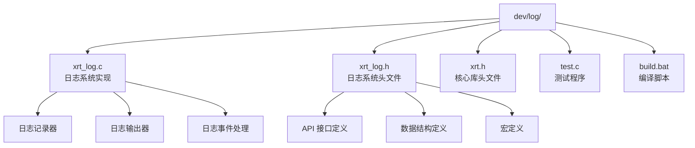
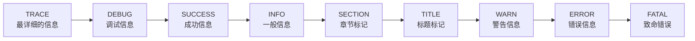
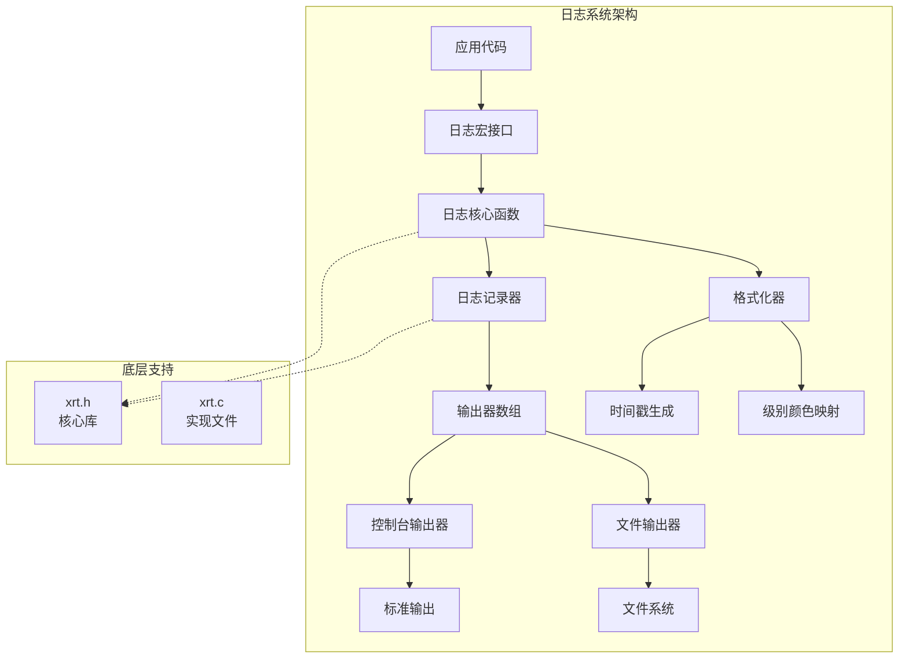
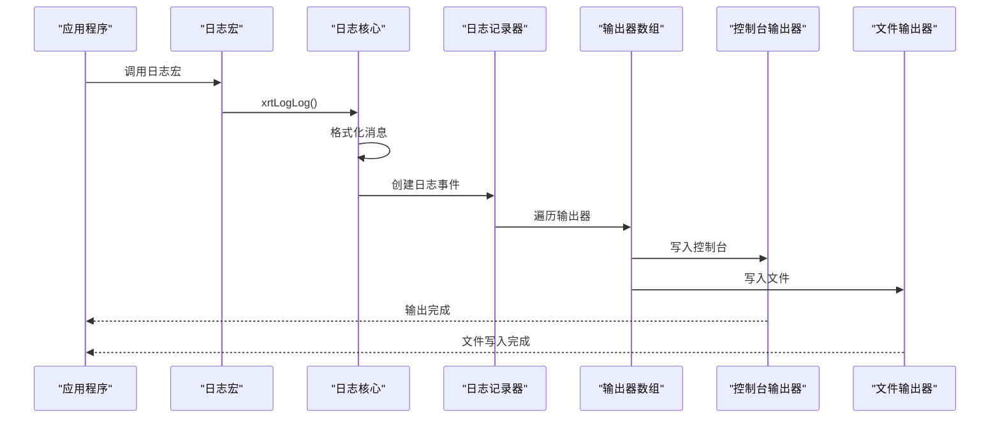
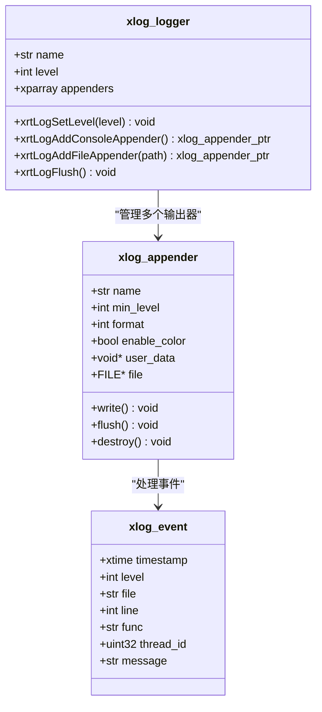
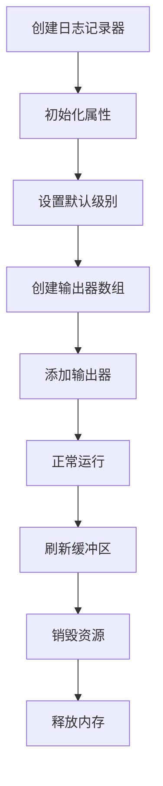
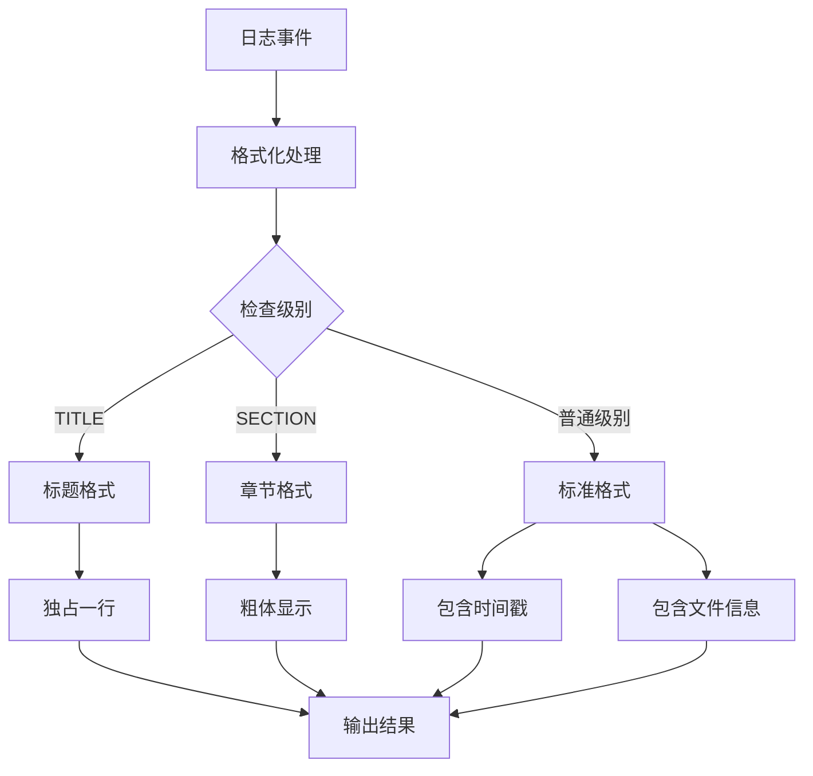
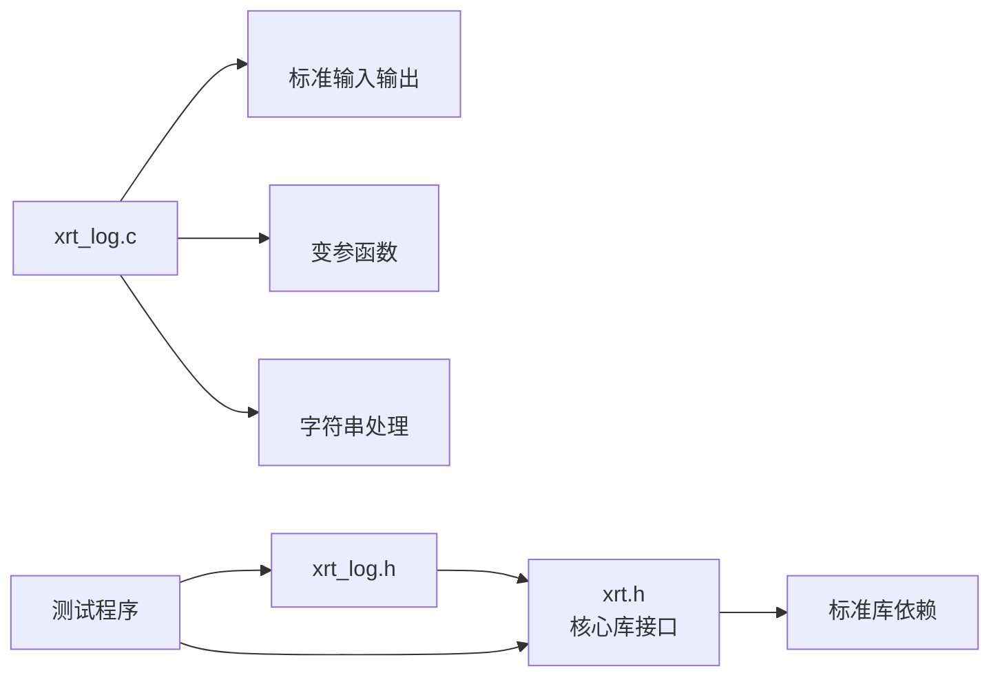
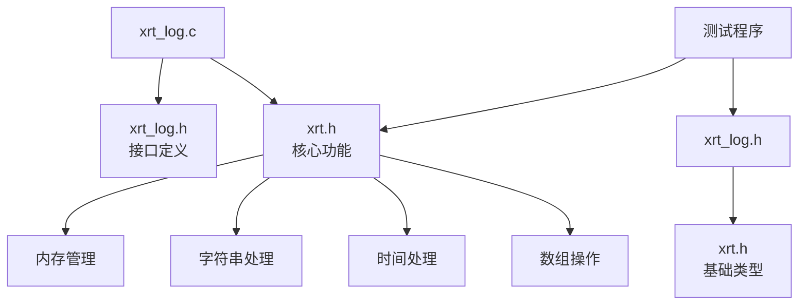

# 开发日志系统

<cite>
**本文档引用的文件**
- [xrt_log.c](file://dev/log/xrt_log.c)
- [xrt_log.h](file://dev/log/xrt_log.h)
- [xrt.h](file://dev/log/xrt.h)
- [test.c](file://dev/log/test.c)
- [build.bat](file://dev/log/build.bat)
- [README.md](file://README.md)
</cite>

## 目录
1. [简介](#简介)
2. [项目结构](#项目结构)
3. [核心组件](#核心组件)
4. [架构概览](#架构概览)
5. [详细组件分析](#详细组件分析)
6. [依赖关系分析](#依赖关系分析)
7. [性能考虑](#性能考虑)
8. [故障排除指南](#故障排除指南)
9. [结论](#结论)

## 简介

XRT 日志系统是一个轻量级、高性能的日志记录库，专为 C 语言开发者设计。该系统提供了完整的日志功能，包括多种日志级别、彩色输出、文件记录、以及灵活的配置选项。

### 主要特性

- **多平台支持**：支持 Windows、Linux、macOS 等主流操作系统
- **零依赖设计**：除标准 C 库外无任何外部依赖
- **高性能**：采用优化的数据结构和算法，确保日志记录的高效性
- **灵活配置**：支持多种日志级别、输出格式和目标
- **线程安全**：提供基本的线程安全性保证
- **单头文件**：采用单头文件设计，易于集成和使用

## 项目结构

XRT 日志系统位于 `dev/log` 目录下，主要包含以下文件：



**图表来源**
- [xrt_log.c](file://dev/log/xrt_log.c#L1-L328)
- [xrt_log.h](file://dev/log/xrt_log.h#L1-L114)

**章节来源**
- [xrt_log.c](file://dev/log/xrt_log.c#L1-L328)
- [xrt_log.h](file://dev/log/xrt_log.h#L1-L114)
- [build.bat](file://dev/log/build.bat#L1-L62)

## 核心组件

### 日志级别系统

XRT 日志系统定义了完整的日志级别体系，从最低级别的 TRACE 到最高级别的 FATAL：



**图表来源**
- [xrt_log.h](file://dev/log/xrt_log.h#L14-L24)

### 日志事件结构

每个日志事件包含以下关键信息：

| 字段名 | 类型 | 描述 |
|--------|------|------|
| timestamp | xtime | 事件发生的时间戳 |
| level | int | 日志级别（0-8） |
| file | str | 触发日志的源文件名 |
| line | int | 触发日志的代码行号 |
| func | str | 触发日志的函数名 |
| thread_id | uint32 | 线程标识符 |
| message | str | 实际的日志消息内容 |

**章节来源**
- [xrt_log.h](file://dev/log/xrt_log.h#L32-L41)

## 架构概览

XRT 日志系统采用模块化的架构设计，主要由以下几个核心组件构成：



**图表来源**
- [xrt_log.c](file://dev/log/xrt_log.c#L144-L177)
- [xrt_log.h](file://dev/log/xrt_log.h#L44-L61)

### 数据流图



**图表来源**
- [xrt_log.c](file://dev/log/xrt_log.c#L254-L301)
- [xrt_log.h](file://dev/log/xrt_log.h#L82-L85)

## 详细组件分析

### 日志记录器（Logger）

日志记录器是日志系统的核心组件，负责管理日志级别和输出器配置：



**图表来源**
- [xrt_log.h](file://dev/log/xrt_log.h#L57-L61)
- [xrt_log.h](file://dev/log/xrt_log.h#L44-L54)
- [xrt_log.h](file://dev/log/xrt_log.h#L32-L41)

#### 日志记录器生命周期



**图表来源**
- [xrt_log.c](file://dev/log/xrt_log.c#L144-L177)

**章节来源**
- [xrt_log.c](file://dev/log/xrt_log.c#L144-L177)
- [xrt_log.h](file://dev/log/xrt_log.h#L57-L61)

### 输出器系统

XRT 日志系统支持多种输出器类型，每种输出器都有特定的功能和用途：

#### 控制台输出器

控制台输出器专门用于将日志信息输出到标准输出流，支持彩色显示：

| 属性 | 描述 | 默认值 |
|------|------|--------|
| name | 输出器名称 | "console" |
| min_level | 最低日志级别 | TRACE |
| format | 输出格式 | TEXT |
| enable_color | 彩色输出开关 | TRUE |
| file | 文件句柄 | stdout |
| write | 写入函数 | xrtLogConsole_Write |
| flush | 刷新函数 | xrtLogConsole_Flush |
| destroy | 销毁函数 | xrtLogConsole_Destroy |

#### 文件输出器

文件输出器用于将日志信息写入到指定的文件中：

| 属性 | 描述 | 默认值 |
|------|------|--------|
| name | 输出器名称 | "file" |
| min_level | 最低日志级别 | TRACE |
| format | 输出格式 | TEXT |
| enable_color | 彩色输出开关 | FALSE |
| file | 文件句柄 | 指向文件的指针 |
| write | 写入函数 | xrtLogFile_Write |
| flush | 刷新函数 | xrtLogFile_Flush |
| destroy | 销毁函数 | xrtLogFile_Destroy |

**章节来源**
- [xrt_log.c](file://dev/log/xrt_log.c#L188-L235)

### 格式化系统

日志系统提供了灵活的格式化功能，支持不同的输出格式和样式：

#### 文本格式化

文本格式是最常用的格式，支持时间戳、级别信息、文件位置等详细信息：



**图表来源**
- [xrt_log.c](file://dev/log/xrt_log.c#L47-L84)

**章节来源**
- [xrt_log.c](file://dev/log/xrt_log.c#L47-L84)

### 颜色系统

为了提高日志的可读性和区分度，系统提供了完整的颜色支持：

| 日志级别 | ANSI 颜色代码 | 颜色效果 |
|----------|---------------|----------|
| TRACE | 90 | 深灰色 |
| DEBUG | 37;1 | 亮灰色（粗体） |
| SUCCESS | 32 | 绿色 |
| INFO | 39 | 默认色 |
| SECTION | 39;1 | 默认色（粗体） |
| TITLE | 30;1 | 黑色（粗体） |
| WARN | 33 | 黄色 |
| ERROR | 31 | 红色 |
| FATAL | 35 | 紫色 |

**章节来源**
- [xrt_log.c](file://dev/log/xrt_log.c#L13-L27)

## 依赖关系分析

### 外部依赖

XRT 日志系统的设计遵循零依赖原则，只依赖于标准 C 库：



**图表来源**
- [xrt_log.c](file://dev/log/xrt_log.c#L1-L3)
- [xrt_log.h](file://dev/log/xrt_log.h#L10-L11)

### 内部依赖关系



**图表来源**
- [xrt_log.c](file://dev/log/xrt_log.c#L1-L3)
- [xrt_log.h](file://dev/log/xrt_log.h#L10-L11)

**章节来源**
- [xrt_log.c](file://dev/log/xrt_log.c#L1-L3)
- [xrt_log.h](file://dev/log/xrt_log.h#L10-L11)

## 性能考虑

### 内存管理

XRT 日志系统采用了高效的内存管理策略：

1. **动态内存分配**：使用 `xrtMalloc` 和 `xrtFree` 进行内存管理
2. **消息缓冲区**：使用 `vsnprintf` 预计算消息大小，避免多次分配
3. **输出器复用**：输出器对象在生命周期内重复使用

### 线程安全性

系统提供了基本的线程安全性保证：

- **全局状态**：使用全局默认日志记录器
- **输出器同步**：每个输出器独立处理，避免相互影响
- **内存访问**：避免在日志过程中进行长时间的阻塞操作

### I/O 性能优化

1. **缓冲输出**：使用 `fflush` 确保及时输出
2. **格式化优化**：预计算格式化字符串大小
3. **条件过滤**：在进入格式化之前进行级别过滤

## 故障排除指南

### 常见问题及解决方案

#### 日志不显示彩色

**问题描述**：在某些终端环境中日志不显示彩色效果

**可能原因**：
- 终端不支持 ANSI 颜色代码
- 控制台编码设置问题

**解决方案**：
```c
// 禁用彩色输出
xrtLogSetColor(console_appender, FALSE);
```

#### 文件写入失败

**问题描述**：日志文件无法创建或写入

**可能原因**：
- 文件路径权限不足
- 磁盘空间不足
- 文件被其他进程占用

**解决方案**：
```c
// 检查文件句柄有效性
if (file_appender->file == NULL) {
    // 处理错误：文件打开失败
    printf("错误：无法打开日志文件\n");
}
```

#### 内存泄漏问题

**问题描述**：应用程序运行一段时间后出现内存泄漏

**排查步骤**：
1. 确保正确调用 `xrtLogDestroy`
2. 检查自定义输出器的内存释放
3. 验证日志消息的正确释放

**解决方案**：
```c
// 正确的资源清理流程
xrtLogFlush(logger);
xrtLogDestroy(logger);
```

**章节来源**
- [xrt_log.c](file://dev/log/xrt_log.c#L159-L177)
- [xrt_log.c](file://dev/log/xrt_log.c#L304-L315)

### 调试技巧

#### 启用详细日志

```c
// 设置为最详细的日志级别
xrtLogSetLevel(logger, XLOG_LEVEL_TRACE);

// 或者使用默认记录器
xrtLogSetLevel(xrtGetDefaultLogger(), XLOG_LEVEL_TRACE);
```

#### 检查输出器状态

```c
// 遍历所有输出器并检查状态
for (int i = 0; i < logger->appenders->Count; i++) {
    xlog_appender_ptr appender = xrtPtrArrayGet(logger->appenders, i + 1);
    printf("输出器: %s, 状态: %s\n", 
           appender->name, 
           appender->file ? "有效" : "无效");
}
```

## 结论

XRT 日志系统是一个设计精良、功能完备的日志记录库，具有以下显著特点：

### 技术优势

1. **简洁高效**：采用单头文件设计，零外部依赖
2. **功能丰富**：支持多种日志级别、输出格式和目标
3. **性能优异**：优化的内存管理和 I/O 操作
4. **易于使用**：直观的 API 设计和丰富的示例代码

### 应用场景

- **开发调试**：详细的日志级别支持开发过程中的问题定位
- **生产监控**：稳定的文件输出和错误报告机制
- **系统监控**：实时的状态更新和异常告警
- **数据分析**：结构化的日志格式便于后续处理

### 发展建议

1. **增强功能**：可以考虑添加日志轮转、远程日志等功能
2. **性能优化**：进一步优化大流量日志的处理能力
3. **扩展性**：支持更多的输出目标（网络、数据库等）
4. **配置管理**：提供更灵活的配置文件支持

XRT 日志系统为 C 语言开发者提供了一个强大而易用的日志解决方案，是构建高质量 C 语言应用程序的理想选择。