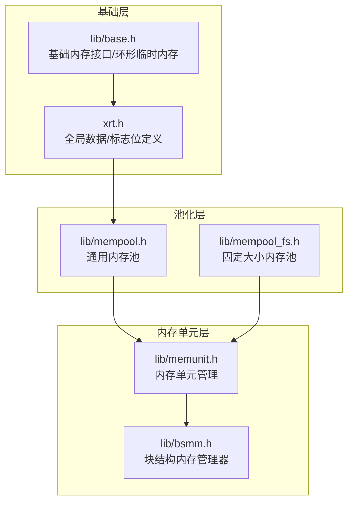
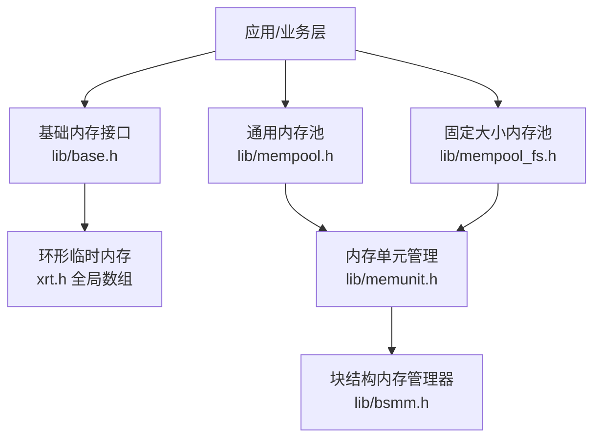
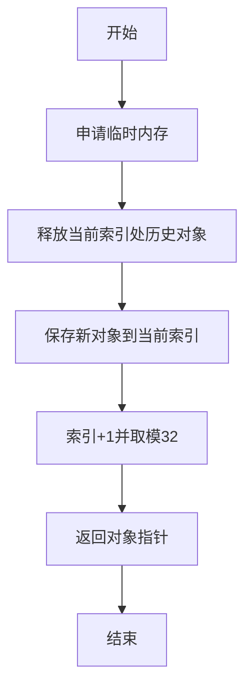
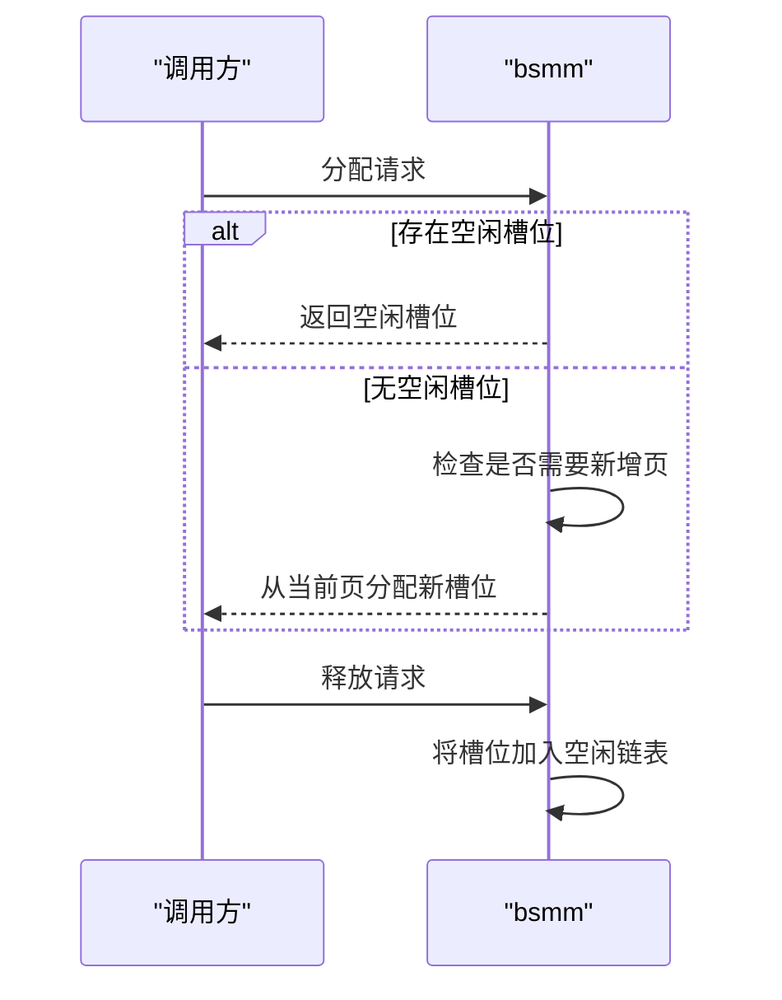
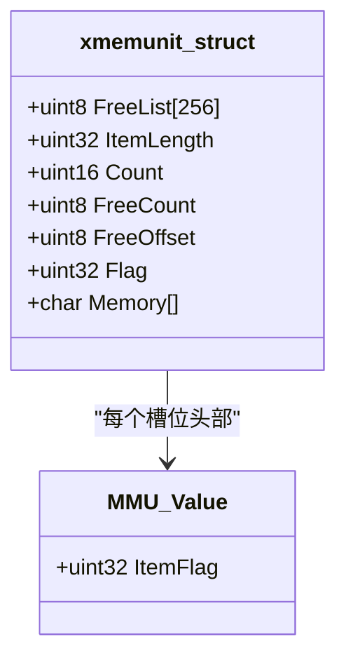
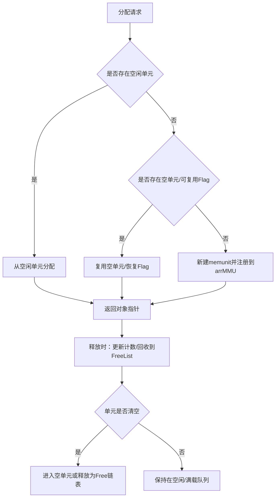
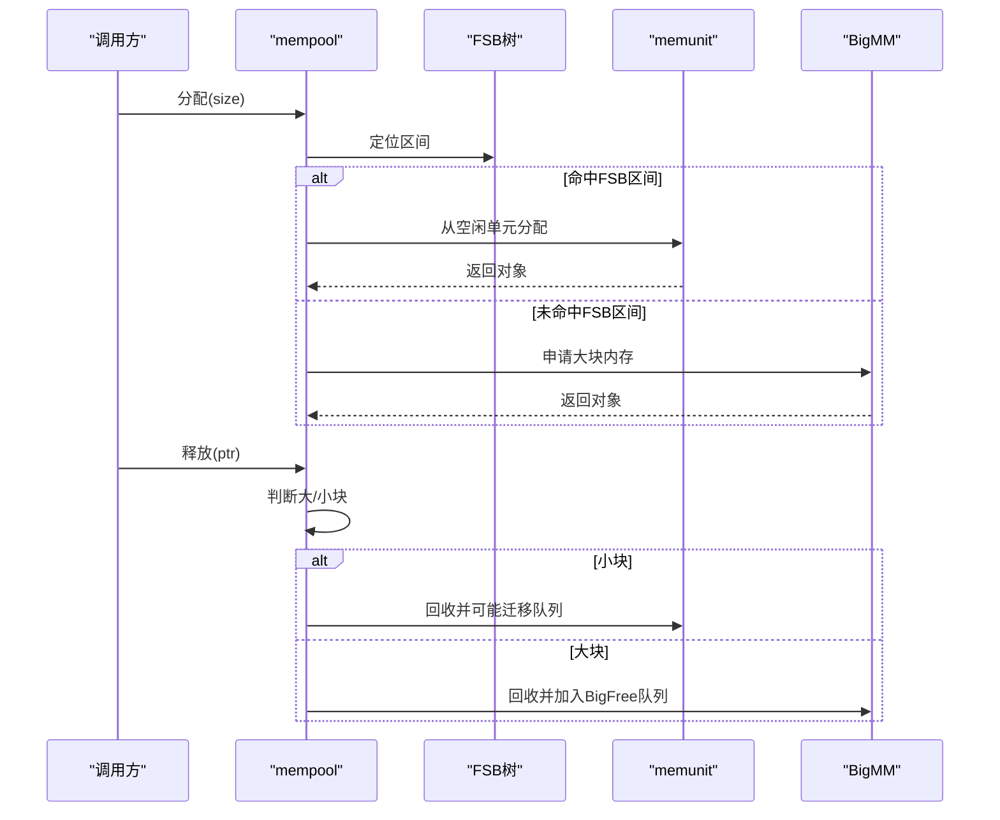
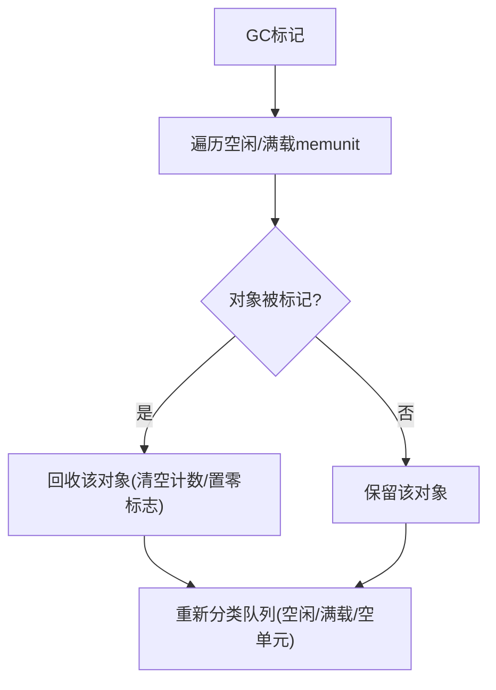
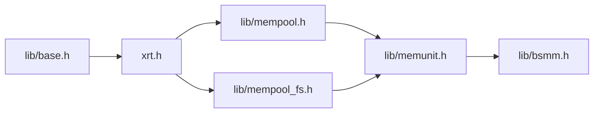

# 内存管理架构

<cite>
**本文引用的文件**
- [lib/mempool.h](file://lib/mempool.h)
- [lib/mempool_fs.h](file://lib/mempool_fs.h)
- [lib/memunit.h](file://lib/memunit.h)
- [lib/bsmm.h](file://lib/bsmm.h)
- [lib/base.h](file://lib/base.h)
- [xrt.h](file://xrt.h)
- [test/test_mempool.h](file://test/test_mempool.h)
</cite>

## 目录
1. [引言](#引言)
2. [项目结构](#项目结构)
3. [核心组件](#核心组件)
4. [架构总览](#架构总览)
5. [关键组件详解](#关键组件详解)
6. [依赖关系分析](#依赖关系分析)
7. [性能考量与优化](#性能考量与优化)
8. [故障排查指南](#故障排查指南)
9. [结论](#结论)
10. [附录](#附录)

## 引言
本文件系统性梳理XRT项目的内存管理架构，重点覆盖以下主题：
- 32槽位环形临时内存的设计与使用场景（线程不安全但高效）
- 多级内存池协同：bsmm块结构内存管理、memunit内存单元管理、mempool_fs固定大小内存池、mempool通用内存池
- 26位引用计数与GC标记回收机制
- 内存分配策略、碎片优化与批量回收优化
- 性能对比与最佳实践

## 项目结构
XRT内存管理相关代码主要分布在以下模块：
- 基础内存接口与环形临时内存：lib/base.h、xrt.h
- 多级内存池与分配器：lib/mempool.h、lib/mempool_fs.h、lib/memunit.h、lib/bsmm.h
- 测试与验证：test/test_mempool.h

图表来源
- [lib/base.h](file://lib/base.h#L49-L84)
- [xrt.h](file://xrt.h#L1260-L1276)
- [lib/mempool.h](file://lib/mempool.h#L35-L119)
- [lib/mempool_fs.h](file://lib/mempool_fs.h#L24-L33)
- [lib/memunit.h](file://lib/memunit.h#L5-L19)
- [lib/bsmm.h](file://lib/bsmm.h#L24-L30)

章节来源
- [lib/base.h](file://lib/base.h#L49-L84)
- [xrt.h](file://xrt.h#L156-L158)
- [lib/mempool.h](file://lib/mempool.h#L35-L119)
- [lib/mempool_fs.h](file://lib/mempool_fs.h#L24-L33)
- [lib/memunit.h](file://lib/memunit.h#L5-L19)
- [lib/bsmm.h](file://lib/bsmm.h#L24-L30)

## 核心组件
- 环形临时内存（线程不安全）：基于全局数组的32槽位循环索引，按需释放过期槽位，适合单线程生命周期内临时缓存。
- bsmm块结构内存管理器：按页（每页256个槽位）管理结构体实例，支持空闲链表复用，降低频繁malloc/free开销。
- memunit内存单元：每个单元固定256个槽位，内部维护“已释放槽位列表”和“计数”，支持快速复用与GC标记回收。
- mempool_fs固定大小内存池：面向等长对象的池化分配，链表维护空闲/满载/空单元/已释放Flag四类队列，提升吞吐。
- mempool通用内存池：按大小范围构建二叉FSB树，结合memunit与bsmm，兼顾小/大内存的高效分配。

章节来源
- [lib/base.h](file://lib/base.h#L49-L84)
- [lib/bsmm.h](file://lib/bsmm.h#L24-L30)
- [lib/memunit.h](file://lib/memunit.h#L5-L19)
- [lib/mempool_fs.h](file://lib/mempool_fs.h#L24-L33)
- [lib/mempool.h](file://lib/mempool.h#L35-L119)

## 架构总览
XRT内存管理采用“基础接口层 → 单元/块管理层 → 池化管理层”的三级架构。其中：
- 基础接口层提供统一的内存申请/释放与环形临时内存能力
- 单元/块管理层提供固定槽位的复用与空闲链表复用
- 池化管理层通过树形区间选择与多级队列组织，实现高并发下的低碎片与低延迟

图表来源
- [lib/base.h](file://lib/base.h#L49-L84)
- [xrt.h](file://xrt.h#L156-L158)
- [lib/mempool.h](file://lib/mempool.h#L148-L261)
- [lib/mempool_fs.h](file://lib/mempool_fs.h#L52-L125)
- [lib/memunit.h](file://lib/memunit.h#L22-L41)
- [lib/bsmm.h](file://lib/bsmm.h#L52-L82)

## 关键组件详解

### 1) 环形临时内存（32槽位，线程不安全）
- 设计要点
  - 全局数组保存最近32次临时分配；每次新分配前，释放当前索引处的历史对象
  - 索引按32循环前进，形成环形队列，避免长期持有临时对象导致内存膨胀
  - 适合单线程生命周期内的短期缓存，如解析/序列化过程中的中间缓冲
- 使用场景
  - 解析JSON/XML等文本时的临时缓冲
  - 网络收发过程中的短期数据暂存
  - 批量任务中同一阶段的临时对象集合
- 注意事项
  - 线程不安全，多线程需自行加锁或使用线程本地存储
  - 仅适用于生命周期短、可预期释放的场景

图表来源
- [lib/base.h](file://lib/base.h#L49-L84)
- [xrt.h](file://xrt.h#L156-L158)

章节来源
- [lib/base.h](file://lib/base.h#L49-L84)
- [xrt.h](file://xrt.h#L156-L158)

### 2) bsmm块结构内存管理器
- 功能概述
  - 以页为单位管理结构体实例，每页256个槽位
  - 维护空闲链表，优先复用已释放槽位，减少系统调用
  - 当计数达到页容量时，追加新页，支持动态扩容
- 关键流程
  - 分配：优先从空闲链表取槽位；若无空闲则从当前页末尾增长
  - 释放：将槽位加入空闲链表，供后续复用

图表来源
- [lib/bsmm.h](file://lib/bsmm.h#L52-L82)

章节来源
- [lib/bsmm.h](file://lib/bsmm.h#L24-L30)
- [lib/bsmm.h](file://lib/bsmm.h#L52-L82)

### 3) memunit内存单元管理
- 设计要点
  - 每个单元固定256个槽位，内部维护“已释放槽位列表”和“计数”
  - 分配时优先复用已释放槽位，降低碎片
  - 支持GC标记回收：通过标志位区分“被标记/未标记”，批量清理
- 标志位与计数
  - 标志位包含“USE位”“GC位”“单元ID前缀”“槽位索引”
  - 计数上限为255，超过后进入满载队列，避免溢出

图表来源
- [xrt.h](file://xrt.h#L1279-L1287)
- [xrt.h](file://xrt.h#L1260-L1261)

章节来源
- [lib/memunit.h](file://lib/memunit.h#L5-L19)
- [lib/memunit.h](file://lib/memunit.h#L22-L41)
- [lib/memunit.h](file://lib/memunit.h#L44-L86)
- [lib/memunit.h](file://lib/memunit.h#L89-L140)
- [xrt.h](file://xrt.h#L1260-L1276)

### 4) mempool_fs固定大小内存池
- 设计要点
  - 面向等长对象的池化分配，内部以memunit为槽位单元
  - 维护四类链表：空闲（可分配）、满载（等待释放）、空单元（备用）、已释放Flag（复用Flag）
  - 分配优先使用空闲单元；满载单元迁移到满载队列；清空单元进入空单元或释放
- GC回收
  - 遍历空闲/满载单元，按标记位批量回收被标记或未标记的对象，并重新分类

图表来源
- [lib/mempool_fs.h](file://lib/mempool_fs.h#L52-L125)
- [lib/mempool_fs.h](file://lib/mempool_fs.h#L128-L198)
- [lib/mempool_fs.h](file://lib/mempool_fs.h#L224-L254)

章节来源
- [lib/mempool_fs.h](file://lib/mempool_fs.h#L24-L33)
- [lib/mempool_fs.h](file://lib/mempool_fs.h#L52-L125)
- [lib/mempool_fs.h](file://lib/mempool_fs.h#L128-L198)
- [lib/mempool_fs.h](file://lib/mempool_fs.h#L224-L254)

### 5) mempool通用内存池
- 设计要点
  - 通过二叉FSB树按大小范围选择合适的memunit块长
  - 对应FSB区间内的memunit采用相同块长，提高命中率
  - 大块内存走独立路径，使用BigMM链表与头部记录索引/标志
- 分配与释放
  - 分配：根据请求大小在FSB树上定位区间，优先空闲memunit；必要时创建新单元或复用已释放Flag
  - 释放：根据标志位判断是大块还是小块；小块走memunit回收流程，大块走BigMM回收队列
- GC回收
  - 递归遍历FSB树下所有空闲/满载memunit，按标记位批量回收
  - 大块内存按标志位批量释放或清除标记

图表来源
- [lib/mempool.h](file://lib/mempool.h#L148-L261)
- [lib/mempool.h](file://lib/mempool.h#L335-L385)
- [lib/mempool.h](file://lib/mempool.h#L427-L465)

章节来源
- [lib/mempool.h](file://lib/mempool.h#L35-L119)
- [lib/mempool.h](file://lib/mempool.h#L148-L261)
- [lib/mempool.h](file://lib/mempool.h#L335-L385)
- [lib/mempool.h](file://lib/mempool.h#L387-L465)

### 6) 26位引用计数与GC标记回收机制
- 标志位布局（32位）
  - USE位：标识对象处于使用中
  - GC位：GC回收标记位
  - 掩码与扩展位：用于区分小块/大块内存
  - 单元ID前缀与槽位索引：组合唯一定位对象所在memunit与槽位
- 引用计数说明
  - 代码中未实现传统意义上的“引用计数”字段；而是通过“USE位+GC位+槽位索引”实现对象状态与回收控制
  - “26位”描述更贴合标志位中可用于存储“单元ID前缀/槽位索引”的位宽，而非严格26位计数
- GC流程
  - 标记阶段：对目标对象设置GC位
  - 回收阶段：按标记位批量回收被标记或未标记的对象，并重新分类队列

图表来源
- [xrt.h](file://xrt.h#L1263-L1276)
- [lib/memunit.h](file://lib/memunit.h#L89-L140)
- [lib/mempool.h](file://lib/mempool.h#L387-L426)

章节来源
- [xrt.h](file://xrt.h#L1263-L1276)
- [lib/memunit.h](file://lib/memunit.h#L89-L140)
- [lib/mempool.h](file://lib/mempool.h#L387-L426)

### 7) 分配策略与碎片优化
- 分配策略
  - mempool_fs：优先空闲单元；空闲不足时复用Flag或新建memunit；满载迁移到满载队列
  - memunit：优先复用FreeList中的已释放槽位；避免碎片化
  - bsmm：优先空闲链表；无空闲时按页增长
- 碎片优化
  - 通过“已释放槽位列表”与“空闲/满载/空单元/已释放Flag”四队列，最大化复用，降低外部碎片
  - 大块内存独立管理，避免小块频繁分配导致的大块碎片
- 批量回收优化
  - memunit与mempool均支持按标记位批量回收，减少逐个遍历成本
  - mempool对FSB树递归遍历，配合两轮重分类，确保队列一致性

章节来源
- [lib/mempool_fs.h](file://lib/mempool_fs.h#L52-L125)
- [lib/memunit.h](file://lib/memunit.h#L22-L41)
- [lib/bsmm.h](file://lib/bsmm.h#L52-L82)
- [lib/mempool.h](file://lib/mempool.h#L387-L426)

## 依赖关系分析
- 组件耦合
  - mempool/mempool_fs依赖memunit；memunit依赖bsmm
  - 基础接口层（lib/base.h）与全局数据（xrt.h）为顶层依赖
- 外部依赖
  - 所有分配最终依赖平台提供的malloc/calloc/realloc/free
- 可能的循环依赖
  - 代码结构清晰，无循环包含；各层职责明确，耦合度低

图表来源
- [lib/base.h](file://lib/base.h#L49-L84)
- [xrt.h](file://xrt.h#L156-L158)
- [lib/mempool.h](file://lib/mempool.h#L35-L119)
- [lib/mempool_fs.h](file://lib/mempool_fs.h#L24-L33)
- [lib/memunit.h](file://lib/memunit.h#L5-L19)
- [lib/bsmm.h](file://lib/bsmm.h#L24-L30)

章节来源
- [lib/base.h](file://lib/base.h#L49-L84)
- [xrt.h](file://xrt.h#L156-L158)
- [lib/mempool.h](file://lib/mempool.h#L35-L119)
- [lib/mempool_fs.h](file://lib/mempool_fs.h#L24-L33)
- [lib/memunit.h](file://lib/memunit.h#L5-L19)
- [lib/bsmm.h](file://lib/bsmm.h#L24-L30)

## 性能考量与优化
- 性能特性
  - 线程不安全的环形临时内存：极低开销，适合单线程生命周期内的短期缓存
  - mempool_fs：等长对象分配吞吐高，队列管理减少系统调用
  - memunit：256槽位固定块，分配/释放常数时间，FreeList降低碎片
  - bsmm：按页增长，空闲链表复用，适合结构体密集分配
- 优化建议
  - 优先使用memunit/mempool_fs处理等长/定长对象
  - 对于小块内存，尽量复用同一块长的memunit，减少跨区间分配
  - 定期执行GC回收，尤其是高频分配/释放场景
  - 大块内存尽量复用BigMM，避免频繁malloc/free
- 性能对比（概念性说明）
  - 环形临时内存：分配/释放O(1)，内存占用固定32个槽位
  - mempool_fs：分配/释放O(1)，队列迁移O(1)，适合高并发
  - memunit：分配/释放O(1)，FreeList复用，碎片少
  - bsmm：分配O(1)，空闲链表复用，页增长平摊成本低

[本节为通用性能讨论，不直接分析具体文件]

## 故障排查指南
- 常见问题
  - 释放空单元或重复释放：检查USE位与FreeList一致性
  - 标记位异常：确认GC位设置与清除逻辑
  - 大/小块混用错误：核对标志位与回收路径
- 定位方法
  - 使用测试用例验证FSB树结构与分配序列
  - 在关键路径打印队列状态（空闲/满载/空单元/已释放Flag）
- 相关测试
  - 通过测试用例打印FSB树与分配/释放序列，辅助定位问题

章节来源
- [test/test_mempool.h](file://test/test_mempool.h#L25-L184)
- [lib/mempool.h](file://lib/mempool.h#L335-L385)
- [lib/mempool_fs.h](file://lib/mempool_fs.h#L199-L221)

## 结论
XRT内存管理通过“环形临时内存 + bsmm + memunit + mempool_fs + mempool”的分层设计，在保证高性能的同时实现了良好的碎片控制与回收效率。其中：
- 环形临时内存适合单线程短期缓存
- bsmm与memunit提供稳定的固定槽位复用
- mempool_fs与mempool通过队列与FSB树实现高命中率与低延迟
- GC标记回收机制支持批量清理，降低碎片与提升吞吐

[本节为总结性内容，不直接分析具体文件]

## 附录
- 最佳实践
  - 对等长对象优先使用mempool_fs
  - 对小块对象优先使用mempool并复用同一块长
  - 对大块对象使用独立路径，避免与小块混用
  - 定期执行GC回收，保持队列健康
  - 单线程场景可使用环形临时内存作为短期缓存

[本节为通用建议，不直接分析具体文件]