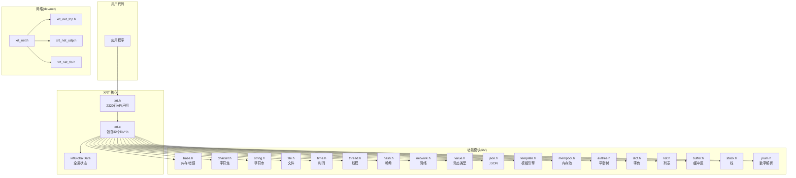
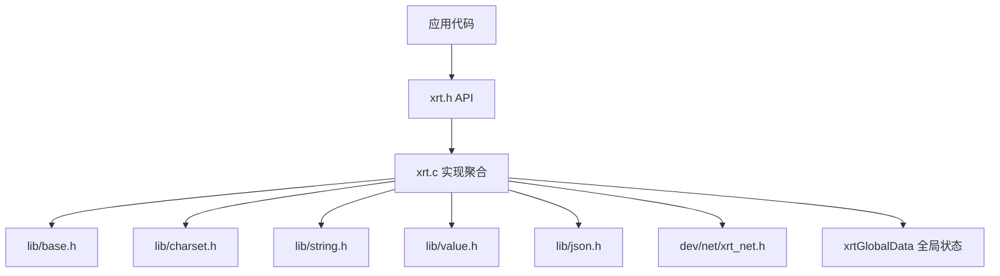
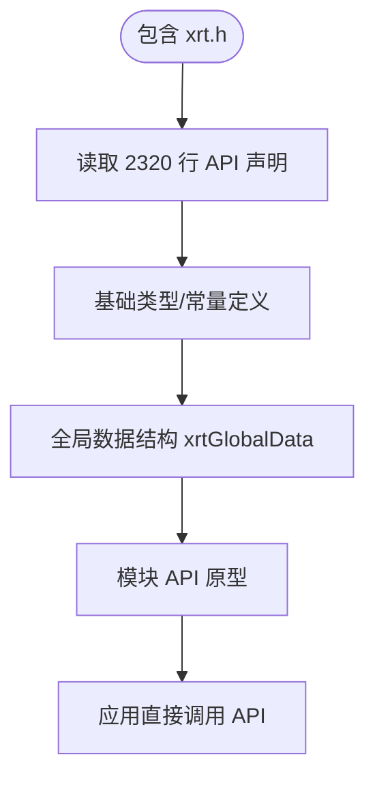
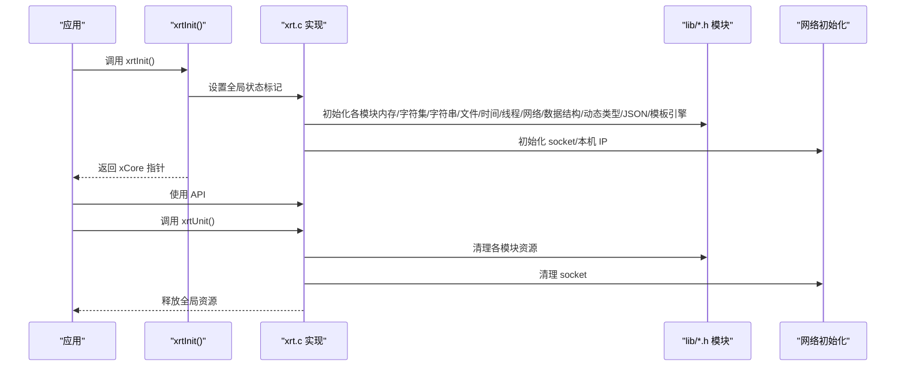
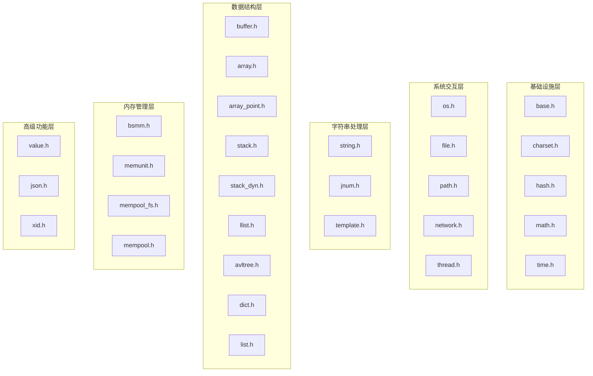
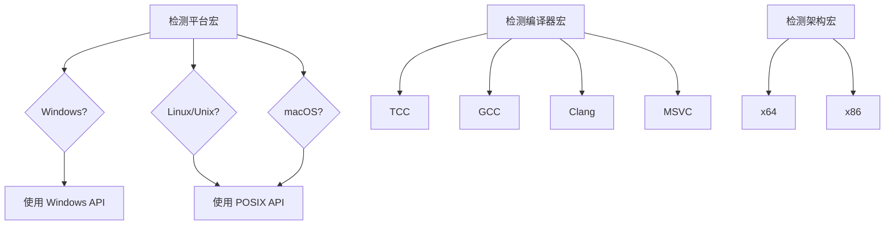
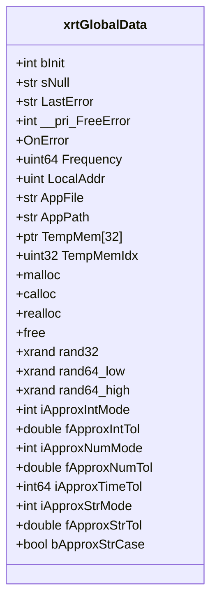
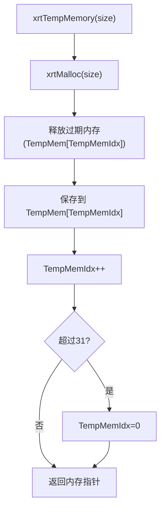
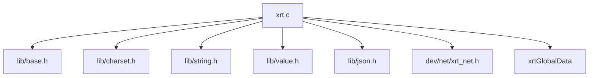

# 整体架构

<cite>
**本文引用的文件**
- [xrt.h](file://xrt.h)
- [xrt.c](file://xrt.c)
- [README.md](file://README.md)
- [平台判断.txt](file://平台判断.txt)
- [数据类型约定.txt](file://数据类型约定.txt)
- [lib/base.h](file://lib/base.h)
- [lib/suplib.h](file://lib/suplib.h)
- [lib/charset.h](file://lib/charset.h)
- [lib/string.h](file://lib/string.h)
- [lib/value.h](file://lib/value.h)
- [lib/json.h](file://lib/json.h)
- [dev/net/xrt_net.h](file://dev/net/xrt_net.h)
</cite>

## 目录
1. [简介](#简介)
2. [项目结构](#项目结构)
3. [核心组件](#核心组件)
4. [架构总览](#架构总览)
5. [详细组件分析](#详细组件分析)
6. [依赖关系分析](#依赖关系分析)
7. [性能考量](#性能考量)
8. [故障排查指南](#故障排查指南)
9. [结论](#结论)
10. [附录](#附录)

## 简介
XRT 是一个面向 C 语言的轻量级、高性能、功能完备的运行时库。其核心设计理念包括：
- 单头文件设计：将 2320 行 API 声明集中在 xrt.h 中，引入即用，降低集成成本
- 模块化组织：32 个功能模块按领域拆分，支持按需使用，最小化体积
- 跨平台抽象：通过条件编译屏蔽平台差异，统一支持 Windows、Linux、macOS
- 全局数据结构：xrtGlobalData 作为全局状态中心，承载内存、错误、随机数、临时内存等核心能力
- 实现聚合：xrt.c 通过包含所有 lib/*.h 将各模块实现整合为单一编译单元，简化部署

## 项目结构
XRT 采用“单头文件 + 实现聚合”的组织方式，配合 32 个功能子库实现模块化能力：
- xrt.h：集中定义 2320 行 API 声明，包含基础类型、全局数据结构、各模块 API 原型
- xrt.c：包含平台头文件、全局数据初始化、32 个子库头文件，实现统一初始化与清理
- lib/：32 个功能模块头文件，分别覆盖内存、字符集、字符串、文件、时间、网络、线程、数据结构、内存池、动态类型、JSON、模板引擎等
- dev/net/：网络相关子模块（TCP/UDP/TLS 等），通过 xrt_net.h 聚合
- docs/：33 份 API 文档，覆盖各模块详细用法
- test/：31 个测试模块，覆盖所有功能
- release/：构建产物输出目录
- 平台判断.txt、数据类型约定.txt：辅助说明平台宏与类型约定

图表来源
- [xrt.h](file://xrt.h#L1-L2740)
- [xrt.c](file://xrt.c#L54-L84)
- [lib/base.h](file://lib/base.h#L1-L132)
- [lib/charset.h](file://lib/charset.h#L1-L200)
- [lib/string.h](file://lib/string.h#L1-L200)
- [lib/value.h](file://lib/value.h#L1-L200)
- [lib/json.h](file://lib/json.h#L1-L200)
- [dev/net/xrt_net.h](file://dev/net/xrt_net.h#L1-L14)

章节来源
- [README.md](file://README.md#L355-L398)
- [xrt.h](file://xrt.h#L1-L2740)
- [xrt.c](file://xrt.c#L54-L84)

## 核心组件
- 单头文件设计：xrt.h 集中声明 2320 行 API，覆盖内存、字符集、字符串、文件、时间、线程、网络、数据结构、动态类型、JSON、模板引擎等模块，用户只需包含一个头文件即可使用全部功能
- 实现聚合：xrt.c 通过包含 lib/*.h 将 32 个模块的实现整合，形成单一编译单元，便于打包与分发
- 全局数据结构：xrtGlobalData 作为全局状态中心，包含初始化标记、错误处理、高精度时钟频率、本机 IP、应用路径、32 槽位环形临时内存、内存函数指针、随机数状态、约等于配置等
- 跨平台抽象：通过条件编译宏（如 _WIN32/_WIN64、__unix__/__linux__/__APPLE__ 等）屏蔽平台差异，实现统一 API

章节来源
- [xrt.h](file://xrt.h#L122-L184)
- [xrt.c](file://xrt.c#L88-L186)
- [平台判断.txt](file://平台判断.txt#L4-L14)

## 架构总览
XRT 的架构围绕“单头文件 + 实现聚合 + 全局状态”展开，形成清晰的层次化结构：
- 应用层：通过包含 xrt.h 使用 API
- 抽象层：xrt.h 定义统一 API；xrt.c 聚合实现；平台宏屏蔽差异
- 功能层：32 个 lib/*.h 模块提供具体能力
- 网络扩展层：dev/net/* 提供网络相关能力
- 全局状态层：xrtGlobalData 统一管理全局资源与配置

图表来源
- [xrt.h](file://xrt.h#L209-L2740)
- [xrt.c](file://xrt.c#L54-L84)
- [dev/net/xrt_net.h](file://dev/net/xrt_net.h#L1-L14)

## 详细组件分析

### 单头文件设计模式与 2320 行 API 声明
- 集中声明：xrt.h 将内存、字符集、字符串、文件、时间、线程、网络、数据结构、动态类型、JSON、模板引擎等模块的 API 原型集中定义，形成“一站式”接口
- 类型与常量：统一定义基础类型别名、布尔常量、错误处理常量、时间常量、路径常量等
- 全局 API：提供 xrtInit()/xrtUnit() 初始化与清理，xCore 全局状态访问

图表来源
- [xrt.h](file://xrt.h#L53-L184)

章节来源
- [xrt.h](file://xrt.h#L1-L2740)

### xrt.c 中包含所有模块实现的架构优势
- 实现聚合：xrt.c 通过包含 lib/*.h 将 32 个模块的实现整合，形成单一编译单元，便于打包与分发
- 初始化流程：xrtInit() 负责全局状态初始化、内存函数指针设置、环形临时内存初始化、高精度时钟频率、随机数种子、应用路径、socket 初始化、本机 IP 获取、模板引擎初始化
- 清理流程：xrtUnit() 负责模板引擎清理、应用路径释放、错误信息释放、环形临时内存释放、socket 清理

图表来源
- [xrt.c](file://xrt.c#L88-L226)

章节来源
- [xrt.c](file://xrt.c#L54-L84)
- [xrt.c](file://xrt.c#L88-L186)
- [xrt.c](file://xrt.c#L191-L226)

### 模块化组织结构与职责划分
- 基础设施层（5 个模块）：base、charset、hash、math、time
- 系统交互层（5 个模块）：os、file、path、network、thread
- 字符串处理层（3 个模块）：string、jnum、template
- 数据结构层（9 个模块）：buffer、array、array_point、stack、stack_dyn、llist、avltree、dict、list
- 内存管理层（4 个模块）：bsmm、memunit、mempool_fs、mempool
- 高级功能层（3 个模块）：value、json、xid

图表来源
- [README.md](file://README.md#L72-L133)

章节来源
- [README.md](file://README.md#L72-L133)

### 跨平台抽象层的设计理念与条件编译
- 平台宏：通过 _WIN32/_WIN64、__unix__/__linux__/__APPLE__ 等宏区分平台，实现统一 API
- 编译器宏：通过 __TINYC__/__GNUC__/__clang__/_MSC_VER 等宏适配不同编译器
- 架构宏：通过 __x86_64__/__i386__ 等宏区分 64/32 位
- 条件编译示例：字符串比较、大小写转换、内存查找等 API 根据平台选择对应实现

图表来源
- [平台判断.txt](file://平台判断.txt#L4-L38)

章节来源
- [平台判断.txt](file://平台判断.txt#L4-L38)
- [lib/string.h](file://lib/string.h#L55-L77)
- [lib/suplib.h](file://lib/suplib.h#L5-L32)

### 全局数据结构 xrtGlobalData 的设计
- 初始化标记：bInit 标识是否已初始化
- 全局数据：sNull 指向空值；LastError 存储最近错误信息；OnError 回调
- 高精度时钟：Frequency（Windows 下由 QueryPerformanceFrequency 获取）
- 本机 IP：LocalAddr 用于生成分布式 ID
- 应用信息：AppFile、AppPath
- 环形临时内存：TempMem[32] 32 槽位循环使用；TempMemIdx 当前槽位索引
- 内存函数：malloc/calloc/realloc/free 指针
- 随机数：xrand rand32/rand64_low/rand64_high
- 约等于配置：整数/浮点/时间/字符串的容差模式与阈值

图表来源
- [xrt.h](file://xrt.h#L131-L181)

章节来源
- [xrt.h](file://xrt.h#L122-L184)
- [xrt.c](file://xrt.c#L88-L186)

### 基础模块：内存与错误处理（lib/base.h）
- 内存管理：xrtMalloc/xrtCalloc/xrtRealloc/xrtFree，均委托 xCore.malloc/calloc/realloc/free
- 临时内存：xrtTempMemory 采用 32 槽位环形队列，自动释放过期内存；xrtFreeTempMemory 释放全部临时内存
- 错误处理：xrtSetError/xrtSetErrorU16/xrtSetErrorU32/xrtClearError，支持回调与自动释放

图表来源
- [lib/base.h](file://lib/base.h#L49-L84)

章节来源
- [lib/base.h](file://lib/base.h#L1-L132)

### 字符集模块：多编码互转（lib/charset.h）
- 支持 UTF-8/UTF-16/UTF-32 互转，自动检测编码与 BOM
- 提供编码转换、大小端序转换、编码探测等能力

章节来源
- [lib/charset.h](file://lib/charset.h#L1-L200)

### 字符串模块：统一字符串 API（lib/string.h）
- 提供复制、比较、大小写转换、搜索、裁剪、过滤、格式化、替换、分割、随机字符串、HEX/Base64 编解码、格式化等
- 针对不同平台的字符串比较与大小写转换采用条件编译

章节来源
- [lib/string.h](file://lib/string.h#L1-L200)

### 动态类型系统：Value（lib/value.h）
- 16 种数据类型：Empty/Null/Bool/Int/Float/Text/Time/Point/Func/Array/List/Coll/Table/Struct/Object/Custom
- 26 位引用计数，自动释放；支持父子关联、集合运算、深浅拷贝、调试输出

章节来源
- [lib/value.h](file://lib/value.h#L1-L200)

### JSON 处理：SAX 模式（lib/json.h）
- 采用事件驱动的 SAX 模式解析/生成，支持注释、尾逗号、十六进制、特殊浮点数
- 内置块内存管理器，提升解析效率

章节来源
- [lib/json.h](file://lib/json.h#L1-L200)

### 网络模块：跨平台网络抽象（dev/net/xrt_net.h）
- 通过 xrt_net.h 聚合 TCP/UDP/TLS 等子模块，提供统一网络初始化与清理接口

章节来源
- [dev/net/xrt_net.h](file://dev/net/xrt_net.h#L1-L14)

## 依赖关系分析
- 头文件依赖：xrt.c 通过包含 lib/*.h 聚合实现，形成单编译单元
- 全局依赖：各模块通过 xCore 访问全局状态（内存函数、临时内存、错误处理、随机数等）
- 平台依赖：通过条件编译宏屏蔽平台差异，确保统一 API

图表来源
- [xrt.c](file://xrt.c#L54-L84)

章节来源
- [xrt.c](file://xrt.c#L54-L84)

## 性能考量
- 内存池架构：二叉树索引的固定大小内存块（FSB），分配时间复杂度 O(log n)
- 高效哈希算法：32 位使用 nmhash32x，64 位使用 rapidhash
- AVL 平衡树：字典和集合采用 AVL 树实现，查找/插入/删除均为 O(log n)
- 内联函数优化：关键路径提供 Inline 版本，减少函数调用开销
- PCG 随机数：使用 PCG 算法生成高质量伪随机数，支持 32/64 位
- 256 元素内存页：内存管理单元采用 256 元素/页设计，快速分配和释放
- 环形临时内存：32 槽位循环使用，自动释放，消除内存泄漏风险

## 故障排查指南
- 初始化问题：确认调用 xrtInit() 并正确处理返回值；检查 xCore.bInit 标记
- 内存泄漏：优先使用 xrtTempMemory 与引用计数管理；避免重复释放
- 错误信息：通过 xrtSetError/xrtClearError 获取与清理错误；必要时设置 OnError 回调
- 平台差异：检查平台宏定义，确保条件编译分支正确
- 网络问题：确认网络模块初始化与清理流程；检查 socket 初始化与清理

章节来源
- [xrt.c](file://xrt.c#L88-L186)
- [xrt.c](file://xrt.c#L191-L226)
- [lib/base.h](file://lib/base.h#L88-L132)

## 结论
XRT 通过单头文件设计与实现聚合，实现了“引入即用”的便捷性；通过 32 个模块化的功能库，提供了从基础内存管理到高级动态类型、JSON、模板引擎的完整能力链；通过跨平台抽象与条件编译，统一了 Windows、Linux、macOS 的开发体验。全局数据结构 xrtGlobalData 将内存、错误、随机数、临时内存等核心能力集中管理，配合环形临时内存与引用计数机制，有效降低了内存管理复杂度与泄漏风险。整体架构简洁、可维护性强，适合在多种场景下使用。

## 附录
- 数据类型约定：xrt.h 中对常用类型进行了明确约定，如 str、u8str、u16str、u32str、xtime、xvalue 等
- 构建与测试：README.md 提供了 Windows/Linux/macOS 的构建脚本与测试方法

章节来源
- [数据类型约定.txt](file://数据类型约定.txt#L1-L23)
- [README.md](file://README.md#L211-L229)
- [README.md](file://README.md#L667-L679)