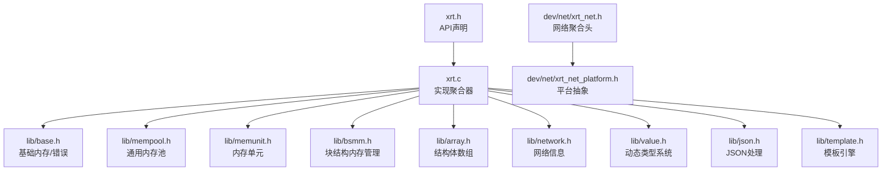
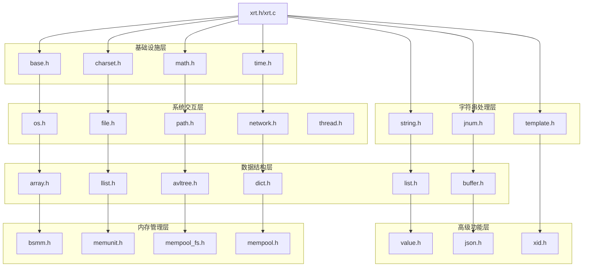
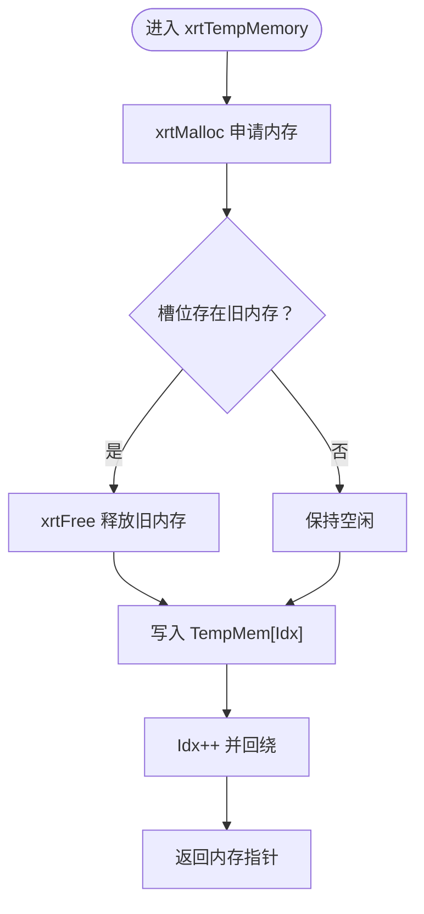
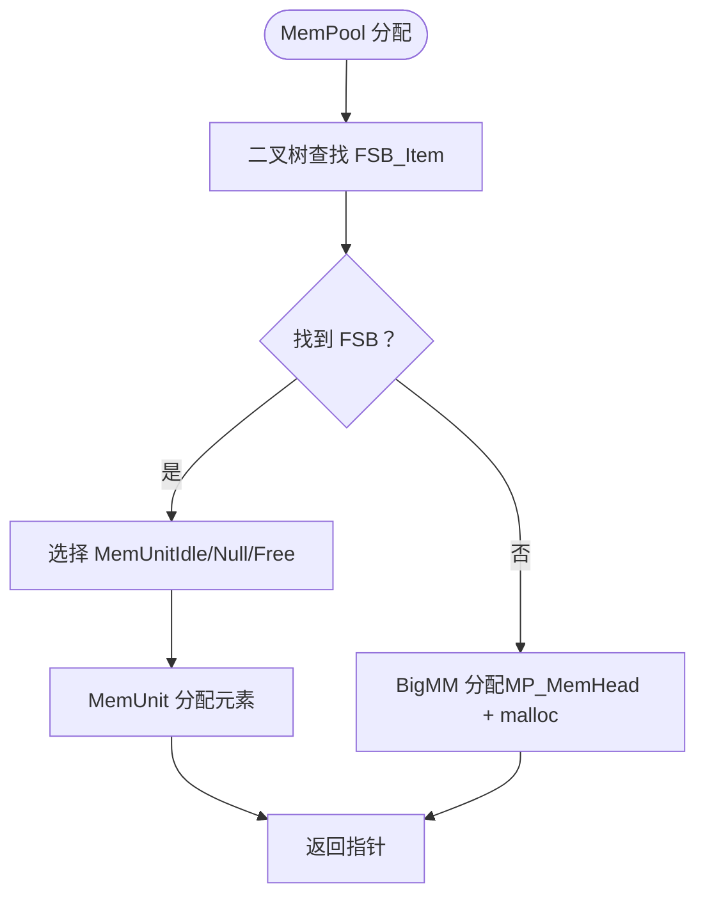
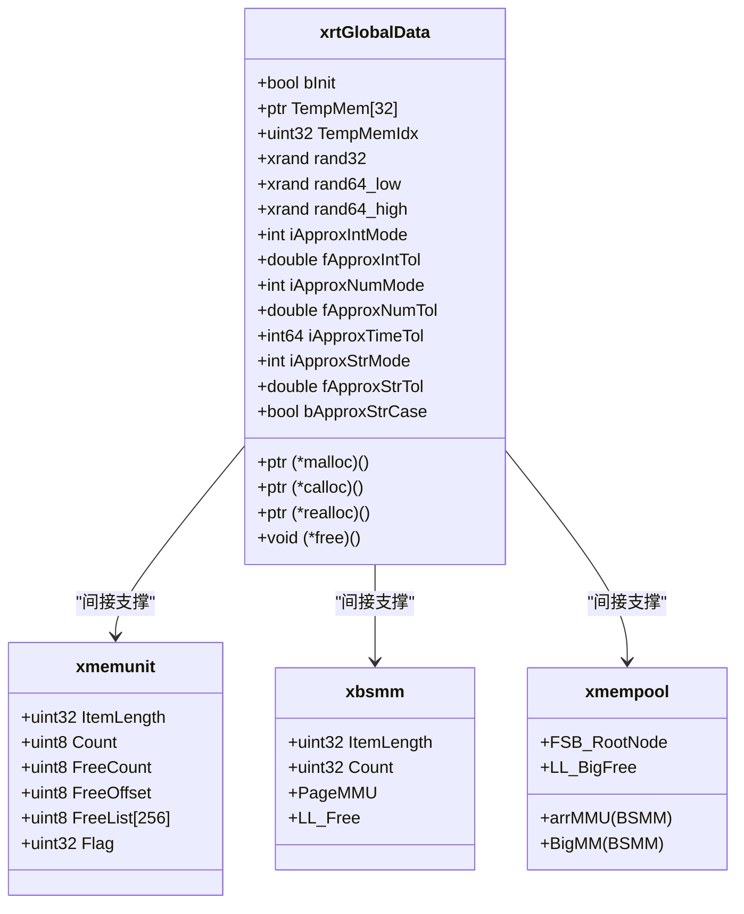
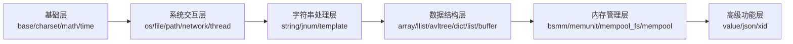
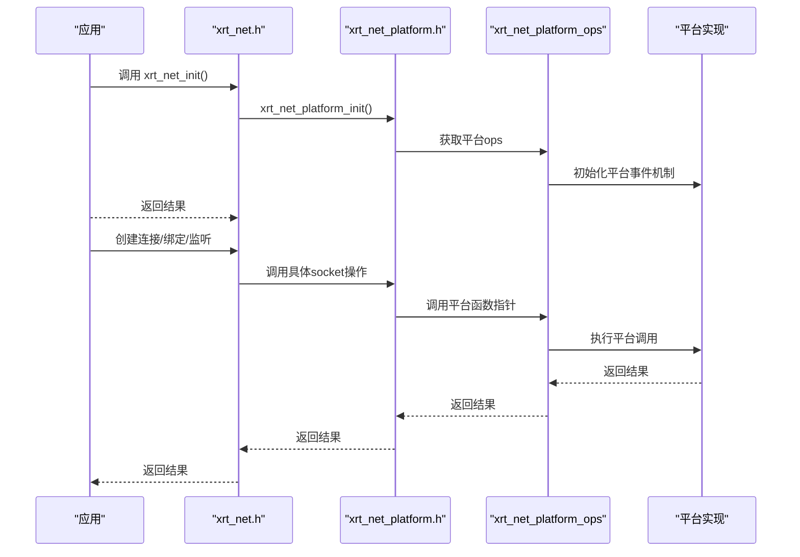
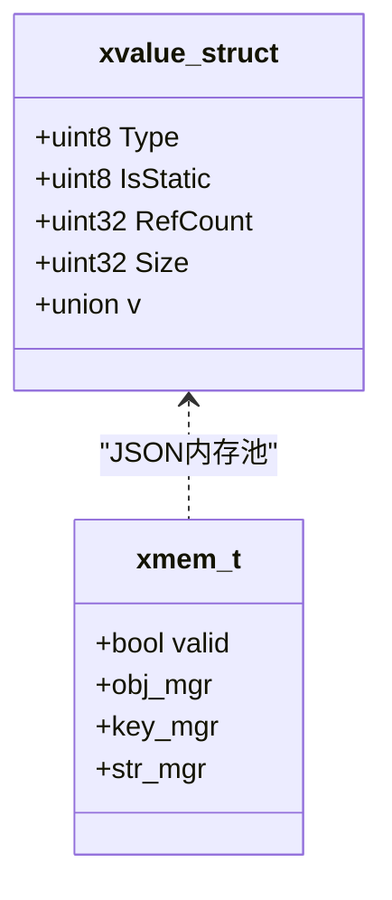
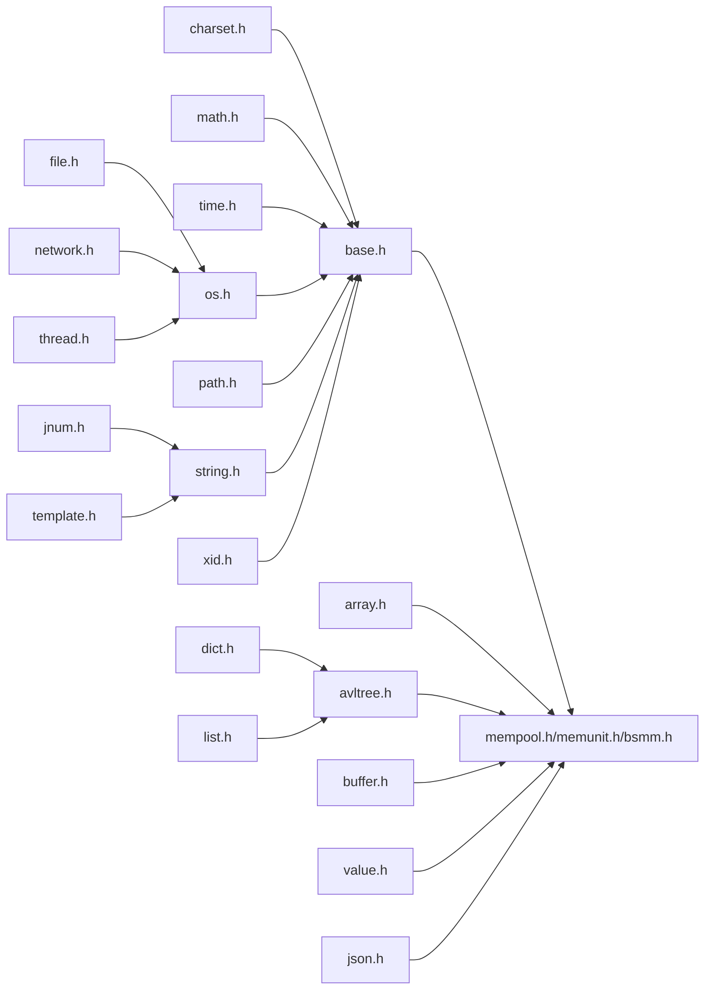

# 架构设计

<cite>
**本文引用的文件**
- [xrt.h](file://xrt.h)
- [xrt.c](file://xrt.c)
- [lib/base.h](file://lib/base.h)
- [lib/mempool.h](file://lib/mempool.h)
- [lib/memunit.h](file://lib/memunit.h)
- [lib/bsmm.h](file://lib/bsmm.h)
- [lib/array.h](file://lib/array.h)
- [lib/network.h](file://lib/network.h)
- [dev/net/xrt_net.h](file://dev/net/xrt_net.h)
- [dev/net/xrt_net_platform.h](file://dev/net/xrt_net_platform.h)
- [lib/value.h](file://lib/value.h)
- [lib/json.h](file://lib/json.h)
- [lib/template.h](file://lib/template.h)
- [README.md](file://README.md)
</cite>

## 目录
1. [引言](#引言)
2. [项目结构](#项目结构)
3. [核心组件](#核心组件)
4. [架构总览](#架构总览)
5. [详细组件分析](#详细组件分析)
6. [依赖分析](#依赖分析)
7. [性能考量](#性能考量)
8. [故障排查指南](#故障排查指南)
9. [结论](#结论)
10. [附录](#附录)

## 引言
本架构设计文档面向XRT项目，聚焦其“单头文件设计”“模块化组织”“跨平台抽象层”等核心理念，系统阐述内存管理架构（32槽位环形临时内存、多级内存池、26位引用计数）、数据结构层的分层组织、模块间依赖与交互模式，并给出系统边界、组件分解图与数据流分析，同时讨论技术决策、权衡与约束，以及性能优化策略与扩展性设计。

## 项目结构
XRT采用“单头文件 + 多子库”的组织方式：
- 单头文件入口：xrt.h，集中声明所有API；xrt.c作为实现聚合器，统一包含各子库头文件，形成“单文件即可用”的体验。
- 子库模块：lib/ 下的32个功能模块，按功能域划分为基础设施层、系统交互层、字符串处理层、数据结构层、内存管理层、高级功能层。
- 网络模块：dev/net/ 提供跨平台网络抽象，通过平台适配层屏蔽底层差异。
- 文档与测试：docs/ 提供详尽API文档，test/ 提供31个测试模块覆盖。

图表来源
- [xrt.c](file://xrt.c#L54-L84)
- [xrt.h](file://xrt.h#L1-L200)
- [lib/base.h](file://lib/base.h#L1-L132)
- [lib/mempool.h](file://lib/mempool.h#L1-L120)
- [lib/memunit.h](file://lib/memunit.h#L1-L60)
- [lib/bsmm.h](file://lib/bsmm.h#L1-L50)
- [lib/array.h](file://lib/array.h#L1-L80)
- [lib/network.h](file://lib/network.h#L1-L40)
- [lib/value.h](file://lib/value.h#L1-L120)
- [lib/json.h](file://lib/json.h#L1-L80)
- [lib/template.h](file://lib/template.h#L1-L60)
- [dev/net/xrt_net.h](file://dev/net/xrt_net.h#L1-L14)
- [dev/net/xrt_net_platform.h](file://dev/net/xrt_net_platform.h#L1-L44)

章节来源
- [README.md](file://README.md#L355-L398)
- [xrt.c](file://xrt.c#L54-L84)

## 核心组件
- 全局运行时与初始化
  - 全局数据结构xrtGlobalData集中存放全局状态、内存函数指针、环形临时内存槽位、随机数状态、约等于配置等。
  - 初始化流程负责设置内存函数、环形临时内存、高精度时钟、随机种子、约等于配置、应用路径、网络初始化、XID本地地址等。
  - 引用计数机制确保xCore生命周期可控，避免重复初始化与泄漏。
- 基础内存与临时内存
  - 基础内存API封装标准库函数，提供错误回调与统一释放逻辑。
  - 环形临时内存（32槽位）自动释放上一次分配，适合函数内临时返回值，降低泄漏风险。
- 内存管理层
  - BSMM：块结构内存管理，256元素/页，释放链表复用，适合固定大小结构体高频分配。
  - MemUnit：256元素/页的内存单元，支持GC标记回收，快速批量释放。
  - MemPool：通用内存池，二叉树索引FSB（固定大小区块），小内存O(log n)查找+O(1)分配；大内存走BigMM链表复用。
- 数据结构层
  - 数组、链表、AVL树、字典、列表等，均以内存池或BSMM/MemUnit为基础，保证高性能与低碎片。
- 高级功能层
  - Value动态类型系统：16种类型，26位引用计数，GC标记回收，父子关联，深浅拷贝。
  - JSON：SAX模式解析/生成，支持注释、尾逗号、十六进制、特殊浮点数，低内存占用。
  - 模板引擎：完整语法（if/for/foreach/define/include/script），支持子模板嵌套与脚本扩展。
- 网络模块
  - 抽象平台差异，统一poll/add/remove/destroy/wakeup等操作接口，屏蔽io_uring/IOCP等底层细节。

章节来源
- [xrt.h](file://xrt.h#L120-L185)
- [xrt.c](file://xrt.c#L87-L186)
- [lib/base.h](file://lib/base.h#L4-L132)
- [lib/bsmm.h](file://lib/bsmm.h#L23-L94)
- [lib/memunit.h](file://lib/memunit.h#L4-L143)
- [lib/mempool.h](file://lib/mempool.h#L35-L145)
- [lib/value.h](file://lib/value.h#L32-L96)
- [lib/json.h](file://lib/json.h#L1-L200)
- [lib/template.h](file://lib/template.h#L1-L120)
- [dev/net/xrt_net_platform.h](file://dev/net/xrt_net_platform.h#L12-L43)

## 架构总览
XRT采用“单头文件 + 子库模块”的分层架构：
- 基础设施层：内存、字符集、数学、时间等，提供跨平台抽象与统一API。
- 系统交互层：OS、文件、路径、网络、线程，封装平台差异。
- 字符串处理层：字符串、数字转换、模板引擎。
- 数据结构层：数组、链表、树、字典、列表等，支撑业务模型。
- 内存管理层：BSMM、MemUnit、FSB内存池、通用内存池，形成多级内存池架构。
- 高级功能层：Value动态类型、JSON、模板引擎。

图表来源
- [xrt.c](file://xrt.c#L54-L84)
- [README.md](file://README.md#L72-L133)

## 详细组件分析

### 内存管理架构（32槽位环形临时内存、多级内存池、26位引用计数）
- 环形临时内存
  - 32个槽位循环使用，每次分配先释放过期槽位，再写入新指针，Idx自增并回绕。
  - 释放时遍历32槽位统一释放，Idx清零。
  - 适合函数内临时返回值，避免泄漏。
- 多级内存池
  - BSMM：固定大小结构体分配，256元素/页，释放链表复用，提升缓存局部性。
  - MemUnit：256元素/页，支持GC标记位，快速批量回收，适合高频小对象。
  - MemPool：二叉树索引FSB（固定大小区块），小内存O(log n)查找+O(1)分配；大内存走BigMM链表复用，减少碎片。
- 26位引用计数
  - Value类型系统采用26位引用计数，超过上限自动转为静态值，避免溢出。
  - 引用计数归零时触发递归释放，自动清理数组/列表/集合/字典等复合类型。
- 数据结构层的内存支撑
  - 数组、链表、AVL树、字典、列表等均以内存池或BSMM/MemUnit为基础，保证低碎片与高性能。

图表来源
- [lib/base.h](file://lib/base.h#L49-L84)

图表来源
- [lib/mempool.h](file://lib/mempool.h#L147-L261)

图表来源
- [xrt.h](file://xrt.h#L120-L185)
- [lib/memunit.h](file://lib/memunit.h#L4-L19)
- [lib/bsmm.h](file://lib/bsmm.h#L23-L31)
- [lib/mempool.h](file://lib/mempool.h#L35-L40)

章节来源
- [lib/base.h](file://lib/base.h#L49-L84)
- [lib/mempool.h](file://lib/mempool.h#L35-L145)
- [lib/memunit.h](file://lib/memunit.h#L4-L143)
- [lib/bsmm.h](file://lib/bsmm.h#L23-L94)
- [lib/value.h](file://lib/value.h#L32-L96)

### 数据结构层组织（从基础设施到高级功能）
- 基础设施层：base、charset、math、time，提供跨平台抽象与统一API。
- 系统交互层：os、file、path、network、thread，封装平台差异。
- 字符串处理层：string、jnum、template，提供字符串操作、数字转换与模板引擎。
- 数据结构层：array、llist、avltree、dict、list、buffer，支撑业务模型。
- 内存管理层：bsmm、memunit、mempool_fs、mempool，形成多级内存池架构。
- 高级功能层：value、json、xid，提供动态类型、JSON处理与分布式ID。

图表来源
- [README.md](file://README.md#L72-L133)

章节来源
- [README.md](file://README.md#L72-L133)

### 网络模块与跨平台抽象
- 平台抽象层
  - 定义平台操作函数指针集合（poll/add/remove/destroy/wakeup），通过xrt_net_platform_ops统一调度。
  - 提供socket通用操作封装（创建、关闭、非阻塞、复用、绑定、监听、接受、连接、收发等）。
- 网络聚合头
  - 聚合TCP/UDP/TLS等子模块，提供统一初始化与清理接口。
- 交互模式
  - Poller统一事件循环，连接对象按平台实现注册/注销，支持唤醒与销毁。

图表来源
- [dev/net/xrt_net.h](file://dev/net/xrt_net.h#L10-L13)
- [dev/net/xrt_net_platform.h](file://dev/net/xrt_net_platform.h#L12-L43)

章节来源
- [dev/net/xrt_net.h](file://dev/net/xrt_net.h#L1-L14)
- [dev/net/xrt_net_platform.h](file://dev/net/xrt_net_platform.h#L1-L44)

### 动态类型系统与JSON/SAX处理
- 动态类型系统（Value）
  - 16种类型，26位引用计数，GC标记回收，父子关联，深浅拷贝，自动释放。
- JSON处理（SAX模式）
  - 事件驱动解析/生成，支持注释、尾逗号、十六进制、特殊浮点数，低内存占用。
- 模板引擎
  - 完整语法：if/for/foreach/define/include/script，支持子模板嵌套与脚本扩展。

图表来源
- [lib/value.h](file://lib/value.h#L32-L96)
- [lib/json.h](file://lib/json.h#L69-L75)

章节来源
- [lib/value.h](file://lib/value.h#L32-L96)
- [lib/json.h](file://lib/json.h#L1-L200)
- [lib/template.h](file://lib/template.h#L1-L120)

## 依赖分析
- 模块内聚与耦合
  - 基础设施层（base/charset/math/time）低耦合，向上提供统一抽象。
  - 系统交互层（os/file/path/network/thread）依赖基础设施层，向下依赖平台实现。
  - 数据结构层（array/llist/avltree/dict/list/buffer）依赖内存管理层，保证高性能与低碎片。
  - 内存管理层（bsmm/memunit/mempool_fs/mempool）相互配合，形成多级内存池。
  - 高级功能层（value/json/template）依赖数据结构层与内存管理层。
- 外部依赖
  - 标准C库；网络模块在不同平台使用不同的系统API（Windows的Winsock/IOCP，Linux的epoll/io_uring等），通过平台抽象层屏蔽差异。
- 循环依赖
  - 通过头文件聚合与前置声明避免循环依赖；网络模块通过平台抽象层解耦。

图表来源
- [xrt.c](file://xrt.c#L54-L84)
- [lib/mempool.h](file://lib/mempool.h#L35-L145)
- [lib/memunit.h](file://lib/memunit.h#L4-L19)
- [lib/bsmm.h](file://lib/bsmm.h#L23-L31)

章节来源
- [xrt.c](file://xrt.c#L54-L84)

## 性能考量
- 内存池架构
  - 二叉树索引FSB，小内存分配O(log n)；256元素/页设计，提升缓存命中率。
  - 大内存走BigMM链表复用，减少碎片与系统调用。
- 高效哈希算法
  - 32位使用nmhash32x，64位使用rapidhash，满足不同场景需求。
- AVL平衡树
  - 字典与集合采用AVL树，查找/插入/删除均为O(log n)。
- 内联函数优化
  - 关键路径提供_inline版本，减少函数调用开销。
- PCG随机数
  - 使用PCG算法生成高质量伪随机数，支持种子设置。
- 临时内存
  - 32槽位环形自动释放，避免泄漏与频繁系统调用。

章节来源
- [README.md](file://README.md#L61-L69)
- [lib/mempool.h](file://lib/mempool.h#L35-L118)
- [lib/bsmm.h](file://lib/bsmm.h#L62-L81)
- [lib/memunit.h](file://lib/memunit.h#L22-L41)

## 故障排查指南
- 内存相关
  - 环形临时内存泄漏：确认是否正确使用xrtFreeTempMemory或在xrtUnit中释放。
  - 内存池异常：检查FSB查找与MemUnit链表状态，关注LL_Idle/LL_Full/LL_Null/LL_Free的状态迁移。
  - 引用计数异常：检查xvoAddRef/xvoUnref配对，避免越界或重复释放。
- 网络相关
  - 平台初始化失败：检查xrt_net_platform_init返回值，确认平台事件机制可用。
  - socket操作失败：逐项检查创建、绑定、监听、接受、收发等步骤的返回值。
- 字符串与编码
  - 字符集转换失败：确认输入编码与BOM处理，必要时使用自动检测函数。
- JSON/SAX
  - 解析错误：根据错误码定位问题，检查注释、尾逗号、特殊字符等配置。

章节来源
- [lib/base.h](file://lib/base.h#L74-L132)
- [lib/mempool.h](file://lib/mempool.h#L121-L145)
- [lib/value.h](file://lib/value.h#L59-L96)
- [dev/net/xrt_net_platform.h](file://dev/net/xrt_net_platform.h#L27-L43)

## 结论
XRT通过“单头文件 + 模块化子库”的设计，在保持零外部依赖与跨平台兼容的同时，提供了高性能、低内存占用的基础设施能力。其多级内存池架构（BSMM/MemUnit/MemPool）与26位引用计数相结合，有效降低了碎片与泄漏风险；数据结构层以内存池为基础，确保了O(log n)的查找与稳定的性能表现；网络模块通过平台抽象层屏蔽底层差异，使上层代码一次编写多平台运行。整体架构在可维护性、可扩展性与性能之间取得了良好平衡。

## 附录
- 系统边界
  - 入口：xrt.h/xrt.c
  - 边界：平台抽象层（dev/net/xrt_net_platform.h）隔离底层差异
  - 边界：内存管理层（lib/bsmm.h、lib/memunit.h、lib/mempool.h）向上提供统一接口
- 扩展性建议
  - 新增模块遵循现有命名与组织方式，优先使用内存池与BSMM/MemUnit。
  - 网络功能新增平台实现时，遵循平台抽象层接口规范。
  - 高级功能模块尽量复用数据结构层与内存管理层，减少重复实现。