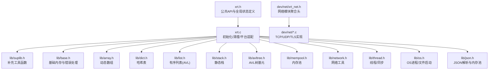
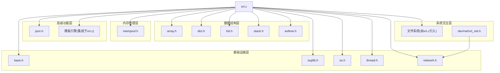
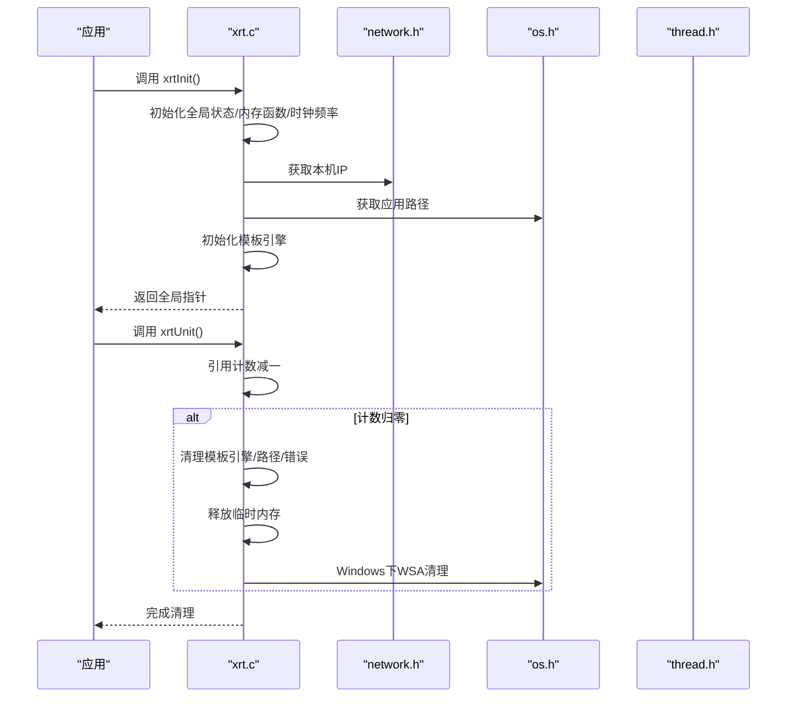
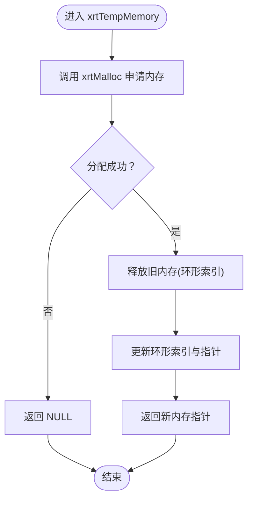
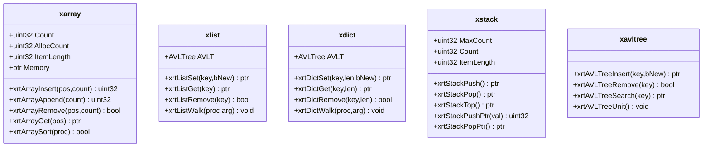
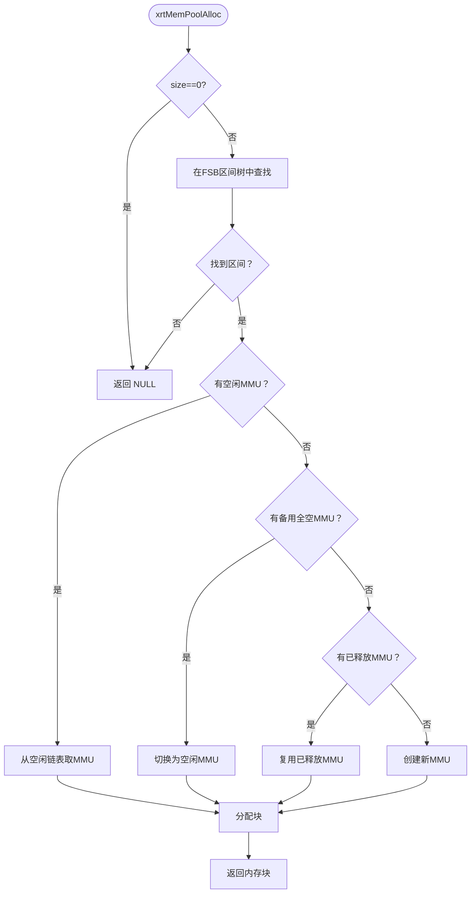
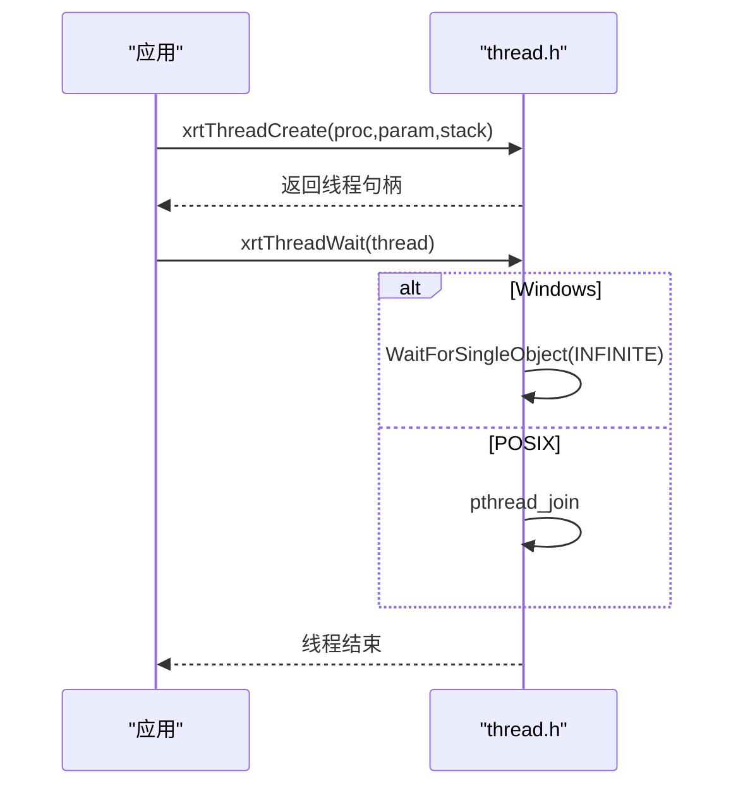
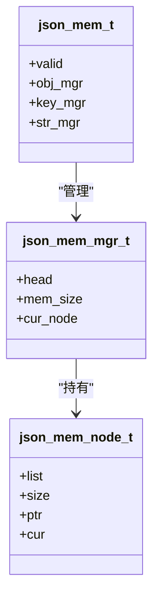
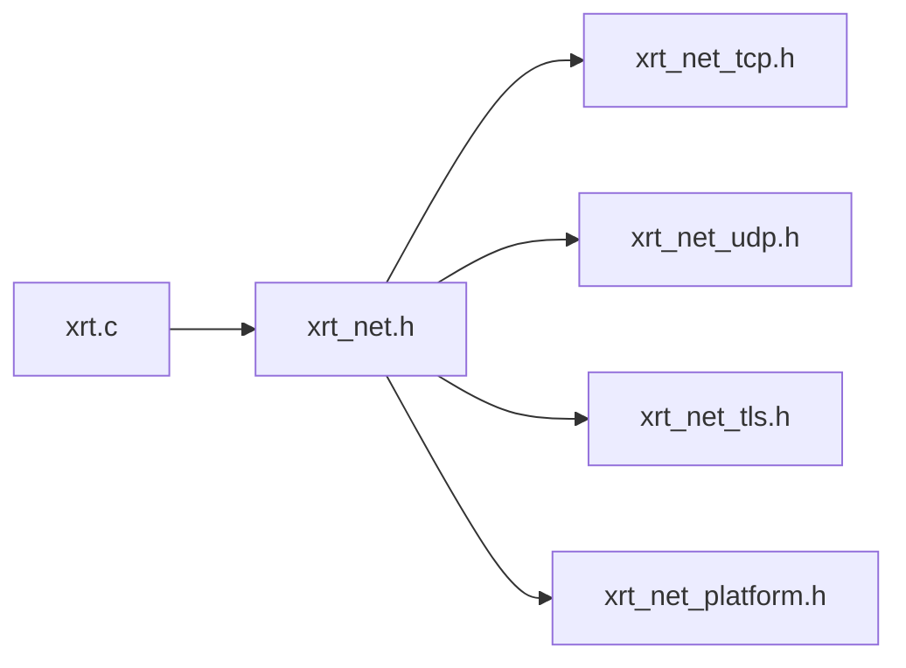
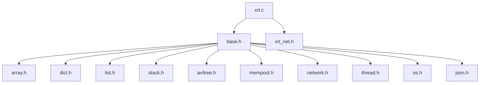

# 模块设计模式

<cite>
**本文档引用的文件**
- [xrt.h](file://xrt.h)
- [xrt.c](file://xrt.c)
- [suplib.h](file://lib/suplib.h)
- [base.h](file://lib/base.h)
- [array.h](file://lib/array.h)
- [list.h](file://lib/list.h)
- [dict.h](file://lib/dict.h)
- [stack.h](file://lib/stack.h)
- [avltree.h](file://lib/avltree.h)
- [mempool.h](file://lib/mempool.h)
- [network.h](file://lib/network.h)
- [thread.h](file://lib/thread.h)
- [os.h](file://lib/os.h)
- [json.h](file://lib/json.h)
- [xrt_net.h](file://dev/net/xrt_net.h)
</cite>

## 目录
1. [引言](#引言)
2. [项目结构](#项目结构)
3. [核心组件](#核心组件)
4. [架构总览](#架构总览)
5. [详细组件分析](#详细组件分析)
6. [依赖分析](#依赖分析)
7. [性能考虑](#性能考虑)
8. [故障排查指南](#故障排查指南)
9. [结论](#结论)
10. [附录](#附录)

## 引言
本文件面向XRT项目的模块设计模式，系统化阐述32个功能模块的统一设计原则：接口定义、实现分离、依赖管理、生命周期与资源清理、分层架构与解耦策略、可扩展与插件化设计。通过对基础设施层、系统交互层、数据处理层、数据结构层、内存管理层、高级功能层的梳理，帮助开发者快速理解模块职责边界与协作方式，并提供最佳实践与开发指导。

## 项目结构
XRT采用“头文件声明 + 子库实现”的组织方式：
- 核心入口与全局状态：xrt.h/xrt.c
- 子库模块：lib/*.h（如 array.h、dict.h、mempool.h、network.h 等）
- 平台/网络扩展：dev/net/*（如 xrt_net.h）
- 文档与测试：docs/*、test/*

图表来源
- [xrt.h](file://xrt.h#L1-L2740)
- [xrt.c](file://xrt.c#L54-L84)
- [suplib.h](file://lib/suplib.h#L1-L55)
- [base.h](file://lib/base.h#L1-L132)
- [array.h](file://lib/array.h#L1-L180)
- [dict.h](file://lib/dict.h#L1-L204)
- [list.h](file://lib/list.h#L1-L188)
- [stack.h](file://lib/stack.h#L1-L135)
- [avltree.h](file://lib/avltree.h#L1-L126)
- [mempool.h](file://lib/mempool.h#L1-L200)
- [network.h](file://lib/network.h#L1-L214)
- [thread.h](file://lib/thread.h#L1-L200)
- [os.h](file://lib/os.h#L1-L90)
- [json.h](file://lib/json.h#L1-L200)
- [xrt_net.h](file://dev/net/xrt_net.h#L1-L14)

章节来源
- [xrt.c](file://xrt.c#L54-L84)
- [xrt.h](file://xrt.h#L1-L2740)

## 核心组件
- 全局状态与生命周期
  - 全局数据结构：xrtGlobalData，集中存放内存函数指针、错误回调、时钟频率、本地IP、应用路径、临时环形内存等。
  - 生命周期：xrtInit() 初始化全局状态、随机数、模板引擎、Socket；xrtUnit() 引用计数回收、清理模板引擎与临时内存、释放路径与错误信息、WSA清理。
- 基础设施层
  - 内存与错误：base.h 提供统一的内存分配/释放与错误设置/清理。
  - 平台补充：suplib.h 提供memmem与宽字符长度等补充能力。
- 系统交互层
  - OS进程/文件：os.h 提供跨平台进程启动与打开文件。
  - 线程与同步：thread.h 提供跨平台线程创建/等待/停止/销毁，条件变量与信号量封装。
  - 网络工具：network.h 提供本机IP/MAC获取与地址解析。
- 数据处理层
  - 字符串/编码：charset相关API（见xrt.h），配合string/path/time等模块使用。
  - 文件系统：file.h（由xrt.c引入）提供文件读写、目录扫描与属性操作。
- 数据结构层
  - 数组：array.h 提供动态数组的增删改查与排序。
  - 列表/字典：list.h/dict.h 基于AVL树实现有序列表与哈希表，提供键值存取与遍历。
  - 栈：stack.h 提供静态栈的压入/弹出与指针访问。
  - AVL树：avltree.h 提供AVL树的插入/删除/查找与内存池节点管理。
- 内存管理层
  - mempool.h 提供分层内存池（FSB区间树 + MMU链表），支持小/大块内存高效分配与回收。
- 高级功能层
  - JSON：json.h 提供块内存池加速解析，支持配置项与调试宏。
  - 模板引擎：xrt.c中调用xte_private_init/unit，表明模板引擎作为高级功能模块集成。

章节来源
- [xrt.h](file://xrt.h#L122-L184)
- [xrt.c](file://xrt.c#L87-L226)
- [base.h](file://lib/base.h#L1-L132)
- [suplib.h](file://lib/suplib.h#L1-L55)
- [os.h](file://lib/os.h#L1-L90)
- [thread.h](file://lib/thread.h#L1-L200)
- [network.h](file://lib/network.h#L1-L214)
- [array.h](file://lib/array.h#L1-L180)
- [list.h](file://lib/list.h#L1-L188)
- [dict.h](file://lib/dict.h#L1-L204)
- [stack.h](file://lib/stack.h#L1-L135)
- [avltree.h](file://lib/avltree.h#L1-L126)
- [mempool.h](file://lib/mempool.h#L1-L200)
- [json.h](file://lib/json.h#L1-L200)

## 架构总览
XRT采用“核心入口 + 子库模块”的分层设计：
- 基础设施层：base/suplib/os/thread/network
- 数据结构层：array/dict/list/stack/avltree
- 内存管理层：mempool
- 高级功能层：json/模板引擎
- 系统交互层：文件系统（由xrt.c引入）、网络模块聚合头（dev/net）

图表来源
- [xrt.c](file://xrt.c#L54-L84)
- [xrt_net.h](file://dev/net/xrt_net.h#L1-L14)

## 详细组件分析

### 组件A：全局状态与生命周期管理
- 设计要点
  - 全局状态集中化：xrtGlobalData统一管理内存函数、错误回调、时钟频率、本地IP、应用路径、临时环形内存。
  - 引用计数：xrtInit/xrtUnit成对出现，确保多处调用的安全释放。
  - 平台适配：Windows下初始化/清理Socket，读取本机IP，记录应用路径。
- 生命周期流程

图表来源
- [xrt.c](file://xrt.c#L87-L226)
- [network.h](file://lib/network.h#L39-L70)
- [os.h](file://lib/os.h#L55-L90)

章节来源
- [xrt.h](file://xrt.h#L122-L184)
- [xrt.c](file://xrt.c#L87-L226)

### 组件B：内存与错误处理（base/suplib）
- 设计要点
  - 统一内存接口：xrtMalloc/Calloc/Realloc/Free，错误通过xrtSetError/xrtClearError上报。
  - 临时内存：环形队列式临时内存，按索引循环覆盖，适合短生命周期对象。
  - 平台补充：Windows下提供memmem，宽字符串长度函数。
- 流程图（临时内存）

图表来源
- [base.h](file://lib/base.h#L49-L84)
- [suplib.h](file://lib/suplib.h#L5-L32)

章节来源
- [base.h](file://lib/base.h#L1-L132)
- [suplib.h](file://lib/suplib.h#L1-L55)

### 组件C：数据结构层（数组/列表/字典/栈/AVL树）
- 设计要点
  - 数组：动态扩容、中间插入/末尾追加、交换、删除、排序。
  - 列表：基于AVL树的有序列表，支持键值存取与遍历。
  - 字典：基于AVL树的哈希表，键值对存储与遍历。
  - 栈：静态栈，支持指针与数据两种压入/弹出方式。
  - AVL树：通用树基元，支持插入/删除/查找与节点内存池管理。
- 类图（数据结构族）

图表来源
- [array.h](file://lib/array.h#L1-L180)
- [list.h](file://lib/list.h#L1-L188)
- [dict.h](file://lib/dict.h#L1-L204)
- [stack.h](file://lib/stack.h#L1-L135)
- [avltree.h](file://lib/avltree.h#L1-L126)

章节来源
- [array.h](file://lib/array.h#L1-L180)
- [list.h](file://lib/list.h#L1-L188)
- [dict.h](file://lib/dict.h#L1-L204)
- [stack.h](file://lib/stack.h#L1-L135)
- [avltree.h](file://lib/avltree.h#L1-L126)

### 组件D：内存池（mempool）
- 设计要点
  - 分层区间树（FSB）：根据请求大小选择合适区间，减少碎片。
  - MMU链表：管理固定大小块的可用性，支持空闲/占用/备用链表。
  - Big内存：超过阈值的大块内存单独管理。
- 流程图（分配路径）

图表来源
- [mempool.h](file://lib/mempool.h#L147-L200)

章节来源
- [mempool.h](file://lib/mempool.h#L1-L200)

### 组件E：系统交互层（OS/线程/网络）
- 设计要点
  - OS：跨平台进程启动、打开文件、等待子进程退出。
  - 线程：跨平台线程创建/等待/停止/强制终止，条件变量与信号量封装。
  - 网络：本机IP/MAC获取，地址解析。
- 时序图（线程等待）

图表来源
- [thread.h](file://lib/thread.h#L36-L108)
- [os.h](file://lib/os.h#L5-L90)

章节来源
- [os.h](file://lib/os.h#L1-L90)
- [thread.h](file://lib/thread.h#L1-L200)
- [network.h](file://lib/network.h#L1-L214)

### 组件F：高级功能层（JSON/模板引擎）
- 设计要点
  - JSON：块内存池（obj/key/str三类管理器）加速解析，支持多项解析配置与调试宏。
  - 模板引擎：在xrtInit中初始化，在xrtUnit中清理，保证生命周期与全局状态一致。
- 类图（JSON内存池）

图表来源
- [json.h](file://lib/json.h#L23-L74)

章节来源
- [json.h](file://lib/json.h#L1-L200)
- [xrt.c](file://xrt.c#L182-L201)

### 组件G：网络模块聚合（dev/net）
- 设计要点
  - 聚合头：xrt_net.h 统一包含平台、TCP、UDP、TLS等子模块头文件。
  - 生命周期：xrt_net_init()/xrt_net_cleanup() 与全局初始化/清理配合。
- 依赖关系

图表来源
- [xrt_net.h](file://dev/net/xrt_net.h#L1-L14)

章节来源
- [xrt_net.h](file://dev/net/xrt_net.h#L1-L14)

## 依赖分析
- 模块耦合与内聚
  - 基础设施层（base/suplib/os/thread/network）为上层提供稳定抽象，内聚度高、耦合度低。
  - 数据结构层（array/dict/list/stack/avltree）共享AVL树基元，形成清晰的层次依赖。
  - 内存管理层（mempool）独立于业务逻辑，通过统一内存接口与上层解耦。
  - 高级功能层（json/模板引擎）依赖全局状态与基础内存接口。
- 外部依赖
  - Windows：Winsock、IPHLPAPI、ShellAPI等。
  - Linux：POSIX线程、信号量、ioctl、netdb等。
- 潜在循环依赖
  - 未发现直接循环依赖；各模块通过头文件聚合与实现分离避免环状依赖。

图表来源
- [xrt.c](file://xrt.c#L54-L84)
- [xrt.h](file://xrt.h#L1-L2740)

章节来源
- [xrt.c](file://xrt.c#L54-L84)
- [xrt.h](file://xrt.h#L1-L2740)

## 性能考虑
- 内存分配
  - 使用统一内存接口与临时环形内存降低碎片与调用开销。
  - 内存池按区间树与MMU链表组织，显著提升小块频繁分配/回收性能。
- 数据结构
  - AVL树保证O(logN)操作，列表/字典适合键值存取场景。
  - 数组支持批量扩容与qsort排序，适合数据处理流水线。
- 线程与同步
  - 跨平台线程封装减少平台差异带来的性能损耗。
  - 条件变量/信号量封装简化同步逻辑，避免竞态。
- JSON解析
  - 块内存池减少频繁分配，适合高频解析场景；合理配置解析选项可平衡严格性与性能。

## 故障排查指南
- 内存相关
  - 使用xrtSetError上报错误，结合xrtLastError查看最近错误；必要时启用xrtClearError清理。
  - 检查临时内存是否正确释放（xrtFreeTempMemory），避免泄漏。
- 线程问题
  - 使用xrtThreadStop设置停止标志，配合xrtThreadShouldStop轮询；避免强制终止导致资源不一致。
  - 跨平台等待超时使用xrtThreadWaitTimeout，POSIX回退方案会轮询检查。
- 网络问题
  - 本机IP/MAC获取失败时检查平台API可用性与权限；Windows下确保IPHLPAPI可用。
- JSON解析
  - 根据JSON_ERROR_PRINT_ENABLE开启错误打印，定位解析异常位置；调整解析配置项以适配输入格式。

章节来源
- [base.h](file://lib/base.h#L88-L132)
- [thread.h](file://lib/thread.h#L112-L157)
- [network.h](file://lib/network.h#L74-L139)
- [json.h](file://lib/json.h#L140-L163)

## 结论
XRT通过“统一接口 + 实现分离 + 分层架构 + 生命周期管理 + 内存池优化”构建了高内聚、低耦合的模块体系。基础设施层提供稳定抽象，数据结构层与内存管理层支撑高性能数据处理，系统交互层与高级功能层满足复杂应用场景。遵循本文的设计模式与最佳实践，可高效扩展新模块并保持系统的稳定性与可维护性。

## 附录
- 模块清单与职责（示意）
  - 基础设施：base/suplib/os/thread/network
  - 数据结构：array/dict/list/stack/avltree
  - 内存管理：mempool
  - 高级功能：json/模板引擎
  - 系统交互：文件系统（由xrt.c引入）、dev/net网络模块
- 扩展与插件化建议
  - 新模块遵循“头文件声明 + 子库实现”的模式，通过xrt.c统一引入。
  - 与全局状态交互时，优先使用xCore提供的内存与错误接口。
  - 对外暴露稳定的API，内部实现可演进，保持接口不变。
- 最佳实践
  - 初始化顺序：先xrtInit，再使用各模块API；清理时先释放业务资源，最后xrtUnit。
  - 资源清理：线程/文件/网络句柄均需显式释放；临时内存及时清理。
  - 错误处理：统一通过xrtSetError上报，避免静默失败。
  - 性能优化：热点路径使用内存池与临时内存；数据结构选择与算法复杂度权衡。