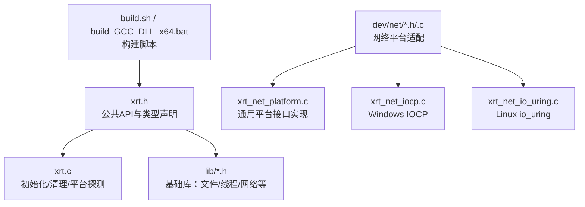
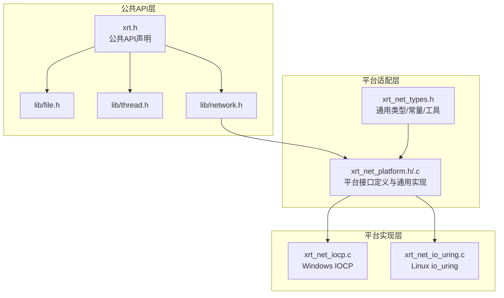
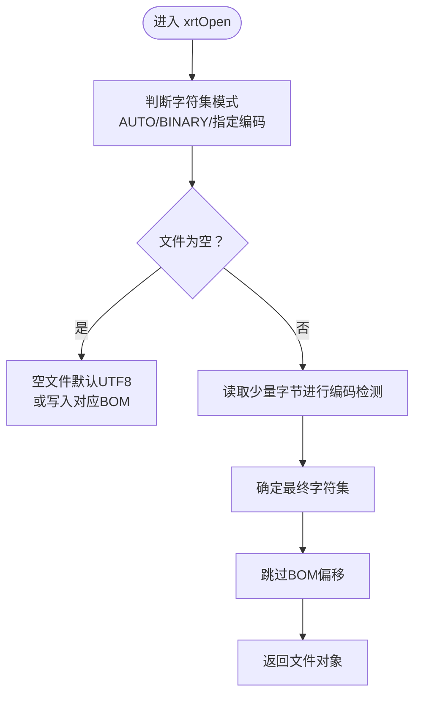
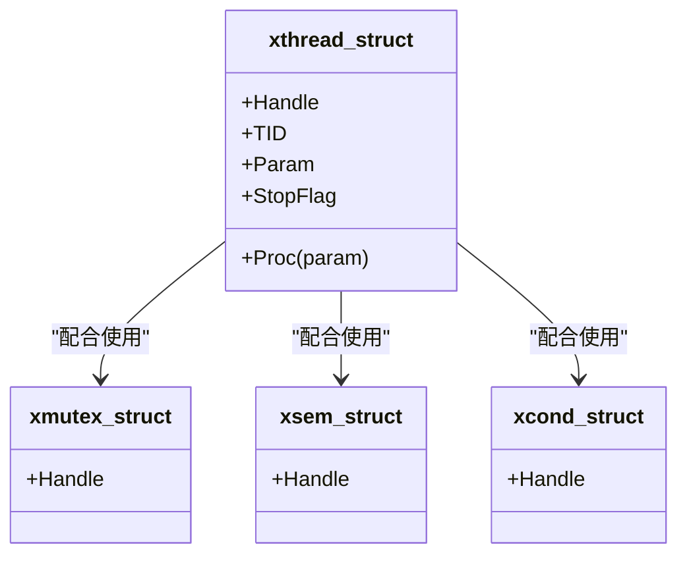
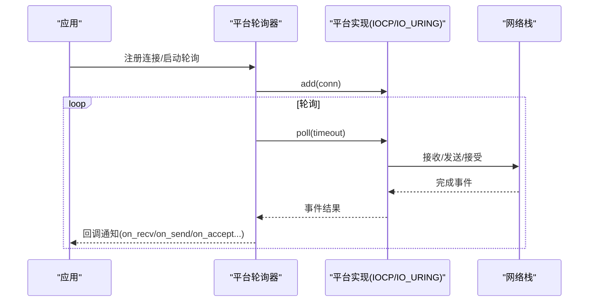
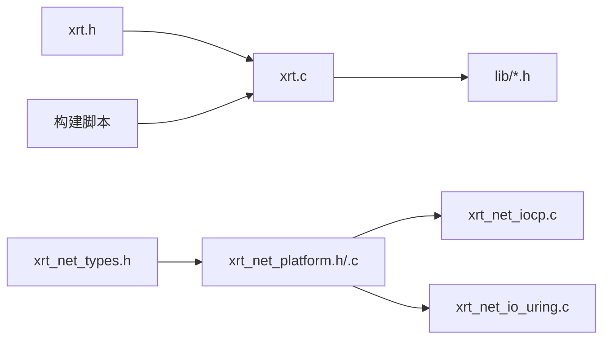

# 跨平台抽象层

<cite>
**本文档引用的文件**
- [xrt.h](file://xrt.h)
- [xrt.c](file://xrt.c)
- [xrt_net_platform.h](file://dev/net/xrt_net_platform.h)
- [xrt_net_platform.c](file://dev/net/xrt_net_platform.c)
- [xrt_net_types.h](file://dev/net/xrt_net_types.h)
- [xrt_net_io_uring.c](file://dev/net/xrt_net_io_uring.c)
- [xrt_net_iocp.c](file://dev/net/xrt_net_iocp.c)
- [os.h](file://lib/os.h)
- [file.h](file://lib/file.h)
- [thread.h](file://lib/thread.h)
- [network.h](file://lib/network.h)
- [rwlock_api.h](file://dev/rwlock_api.h)
- [build.sh](file://build.sh)
- [build_GCC_DLL_x64.bat](file://build_GCC_DLL_x64.bat)
</cite>

## 目录
1. [引言](#引言)
2. [项目结构](#项目结构)
3. [核心组件](#核心组件)
4. [架构总览](#架构总览)
5. [详细组件分析](#详细组件分析)
6. [依赖关系分析](#依赖关系分析)
7. [性能考虑](#性能考虑)
8. [故障排查指南](#故障排查指南)
9. [结论](#结论)
10. [附录](#附录)

## 引言
本文件面向XRT项目的跨平台抽象层，系统性阐述其如何通过条件编译实现Windows、Linux、macOS的统一支持；如何组织平台特定代码并通过编译时选择机制进行切换；如何封装系统调用（文件操作、网络通信、线程管理等）以保持API一致性；以及在保持一致性的前提下如何充分利用各平台特性。同时提供平台兼容性测试方法、移植指南与性能优化策略。

## 项目结构
XRT采用“公共头文件 + 条件编译 + 平台适配模块”的组织方式：
- 公共API集中在顶层头文件中声明，统一对外暴露。
- 平台差异通过预处理器宏在编译期裁剪，避免运行时分支。
- 网络子系统进一步细分为通用类型与平台实现（IOCP、io_uring），通过平台接口统一调度。
- 核心库按功能域拆分，每个域内部也遵循条件编译策略。

图示来源
- [xrt.h](file://xrt.h#L1-L200)
- [xrt.c](file://xrt.c#L1-L120)
- [xrt_net_platform.c](file://dev/net/xrt_net_platform.c#L1-L120)
- [xrt_net_iocp.c](file://dev/net/xrt_net_iocp.c#L1-L80)
- [xrt_net_io_uring.c](file://dev/net/xrt_net_io_uring.c#L1-L80)

章节来源
- [xrt.h](file://xrt.h#L1-L200)
- [xrt.c](file://xrt.c#L1-L120)

## 核心组件
- 全局初始化与清理：负责平台探测、时钟频率初始化、套接字初始化、应用路径解析、模板引擎初始化等。
- 文件抽象：统一的文件对象与API，屏蔽Windows句柄与POSIX文件描述符差异，并内置字符集与BOM处理。
- 线程与同步：跨平台线程、互斥体、信号量、条件变量封装，兼容Windows与POSIX。
- 网络抽象：统一的连接、地址、缓冲区模型，平台侧通过IOCP（Windows）或io_uring（Linux）实现高性能事件驱动。
- OS工具：跨平台运行外部程序、打开文件、等待进程退出等。

章节来源
- [xrt.c](file://xrt.c#L80-L226)
- [file.h](file://lib/file.h#L1-L120)
- [thread.h](file://lib/thread.h#L35-L120)
- [xrt_net_platform.h](file://dev/net/xrt_net_platform.h#L1-L44)
- [xrt_net_platform.c](file://dev/net/xrt_net_platform.c#L1-L120)

## 架构总览
XRT的跨平台抽象由“公共API层 + 平台适配层 + 平台实现层”构成：
- 公共API层：对外统一的函数签名与语义，隐藏平台差异。
- 平台适配层：定义平台操作接口与平台选择逻辑，保证上层无感知切换。
- 平台实现层：针对具体平台（Windows/POSIX）的具体实现（IOCP/io_uring等）。

图示来源
- [xrt.h](file://xrt.h#L649-L849)
- [xrt_net_platform.h](file://dev/net/xrt_net_platform.h#L1-L44)
- [xrt_net_platform.c](file://dev/net/xrt_net_platform.c#L1-L120)
- [xrt_net_types.h](file://dev/net/xrt_net_types.h#L1-L120)
- [xrt_net_iocp.c](file://dev/net/xrt_net_iocp.c#L1-L80)
- [xrt_net_io_uring.c](file://dev/net/xrt_net_io_uring.c#L1-L80)

## 详细组件分析

### 条件编译与平台选择机制
- 平台判定：通过预处理器宏判断目标平台（如Windows、Linux），在编译期引入相应头文件与实现。
- 构建脚本：提供GCC构建共享库与Windows DLL的脚本，分别设置必要的链接库与宏定义。
- 典型用法：
  - Windows：引入Winsock、Windows API、链接系统库。
  - POSIX：引入POSIX socket、线程、信号等头文件。
  - 特定实现：Windows启用IOCP，Linux启用io_uring。

章节来源
- [xrt.c](file://xrt.c#L8-L38)
- [build.sh](file://build.sh#L1-L5)
- [build_GCC_DLL_x64.bat](file://build_GCC_DLL_x64.bat#L1-L7)

### 文件系统抽象与字符集处理
- 统一文件对象：Windows使用句柄，Linux使用文件描述符，统一通过结构体封装。
- 字符集与BOM：支持自动识别与手动指定编码，自动处理BOM，读写时进行编码转换。
- API一致性：打开、关闭、定位、读写、复制移动删除、扫描目录等均提供统一接口。

图示来源
- [file.h](file://lib/file.h#L17-L278)

章节来源
- [file.h](file://lib/file.h#L17-L278)

### 线程与同步原语
- 线程：创建、等待、超时等待、停止信号、强制终止、挂起/恢复、状态查询、当前线程ID、让出。
- 互斥体：创建、销毁、初始化、释放、锁定、尝试锁定、解锁。
- 信号量：创建、销毁、初始化、释放、等待、尝试等待、带超时等待、批量释放。
- 条件变量：创建、销毁、初始化、释放、等待、带超时等待、唤醒单个/广播。
- 平台差异：Windows使用CRITICAL_SECTION/CONDITION_VARIABLE/信号量；POSIX使用pthread互斥/条件变量/信号量。

图示来源
- [thread.h](file://lib/thread.h#L780-L749)

章节来源
- [thread.h](file://lib/thread.h#L35-L120)
- [thread.h](file://lib/thread.h#L307-L591)
- [thread.h](file://lib/thread.h#L594-L749)

### 网络通信抽象与平台实现
- 通用类型：地址、连接、缓冲区、事件、结果码、配置等。
- 平台接口：统一的poll/add/remove/destroy/wakeup等操作函数指针，屏蔽Windows与Linux差异。
- 平台实现：
  - Windows：IOCP，使用完成端口与重叠I/O实现异步收发与接受。
  - Linux：io_uring，使用内核异步I/O队列实现高性能事件驱动。
- 事件回调：接收、发送、接受、关闭、错误等事件通过回调通知上层。

图示来源
- [xrt_net_platform.h](file://dev/net/xrt_net_platform.h#L1-L44)
- [xrt_net_platform.c](file://dev/net/xrt_net_platform.c#L1-L120)
- [xrt_net_iocp.c](file://dev/net/xrt_net_iocp.c#L16-L72)
- [xrt_net_io_uring.c](file://dev/net/xrt_net_io_uring.c#L17-L72)

章节来源
- [xrt_net_types.h](file://dev/net/xrt_net_types.h#L27-L98)
- [xrt_net_platform.h](file://dev/net/xrt_net_platform.h#L1-L44)
- [xrt_net_platform.c](file://dev/net/xrt_net_platform.c#L1-L120)
- [xrt_net_iocp.c](file://dev/net/xrt_net_iocp.c#L1-L80)
- [xrt_net_io_uring.c](file://dev/net/xrt_net_io_uring.c#L1-L80)

### OS工具与系统集成
- 运行外部程序：Windows使用CreateProcess，Linux使用fork+exec。
- 打开文件：Windows使用ShellExecute，Linux使用xdg-open。
- 等待进程结束：Windows使用WaitForSingleObject，Linux使用waitpid。
- 本机信息：主机名、IP、原始IP、MAC地址等，针对Windows与POSIX分别实现。

章节来源
- [os.h](file://lib/os.h#L4-L90)
- [network.h](file://lib/network.h#L4-L214)

### 读写锁抽象（高性能、高可靠性）
- 设计原则：跨平台支持（Windows SRWLOCK + Linux pthread_rwlock）、高性能、高可靠性、公平性、调试支持。
- 功能：读写锁、尝试获取、降级/升级、调试辅助。

章节来源
- [rwlock_api.h](file://dev/rwlock_api.h#L1-L93)

## 依赖关系分析
- 公共API依赖：xrt.h声明所有公共接口，xrt.c实现初始化与清理，并包含各子库头文件。
- 平台依赖：网络子系统通过平台接口统一调度，Windows与Linux分别链接对应实现。
- 构建依赖：构建脚本设置宏与链接库，确保平台相关符号可用。

图示来源
- [xrt.h](file://xrt.h#L649-L849)
- [xrt.c](file://xrt.c#L50-L84)
- [xrt_net_types.h](file://dev/net/xrt_net_types.h#L1-L120)
- [xrt_net_platform.h](file://dev/net/xrt_net_platform.h#L1-L44)
- [xrt_net_iocp.c](file://dev/net/xrt_net_iocp.c#L1-L80)
- [xrt_net_io_uring.c](file://dev/net/xrt_net_io_uring.c#L1-L80)
- [build.sh](file://build.sh#L1-L5)
- [build_GCC_DLL_x64.bat](file://build_GCC_DLL_x64.bat#L1-L7)

章节来源
- [xrt.c](file://xrt.c#L50-L84)
- [xrt_net_platform.c](file://dev/net/xrt_net_platform.c#L1-L120)

## 性能考虑
- 事件驱动：Windows使用IOCP、Linux使用io_uring，减少线程上下文切换与系统调用开销。
- 零拷贝与缓冲：网络缓冲区动态扩容与消费，避免频繁分配；可结合平台特性进一步优化。
- 线程池与并发：平台实现中可配置线程数，合理设置以提升吞吐。
- 字符集转换：尽量减少不必要的转换，优先使用UTF-8；对大文件读写可考虑映射或分块处理。
- 构建优化：使用链接时垃圾回收与函数/数据段分离，减小二进制体积与加载时间。

## 故障排查指南
- 初始化问题：确认平台初始化（如WSAStartup、时钟频率、套接字）是否成功。
- 文件操作：检查字符集与BOM设置，确保读写路径一致；关注返回的错误码与LastError。
- 线程同步：检查锁的使用顺序，避免死锁；POSIX平台注意超时等待的回退策略。
- 网络事件：确认平台实现是否正确注册连接；检查事件回调是否被触发；关注AGAIN/TIMEOUT/CLOSED等状态。
- 平台差异：Windows与Linux在非阻塞、错误码、句柄/描述符等方面存在差异，需针对性处理。

章节来源
- [xrt.c](file://xrt.c#L116-L186)
- [file.h](file://lib/file.h#L4-L14)
- [thread.h](file://lib/thread.h#L112-L157)
- [xrt_net_platform.c](file://dev/net/xrt_net_platform.c#L15-L36)

## 结论
XRT通过明确的条件编译策略与平台适配层，实现了Windows、Linux、macOS的统一支持。公共API层保持稳定，平台差异被有效隔离；网络子系统通过IOCP与io_uring实现高性能事件驱动；文件、线程、同步等核心系统功能在跨平台上保持一致的语义与行为。建议在移植与测试过程中重点关注平台差异、字符集与BOM处理、事件驱动的回调一致性，以及构建优化与性能调优。

## 附录
- 平台兼容性测试方法
  - 在Windows、Linux、macOS分别编译并运行单元测试与集成测试。
  - 使用不同字符集文件验证编码转换与BOM处理。
  - 压力测试网络事件驱动，验证IOCP与io_uring在高并发下的稳定性。
  - 对比POSIX超时等待的回退策略与Windows原生实现的差异。
- 移植指南
  - 新增平台时，先在平台适配层定义统一接口，再实现对应平台实现。
  - 严格遵守API一致性，避免在公共API中引入平台特有行为。
  - 对于系统调用差异，集中封装在平台适配层，保持上层透明。
- 跨平台性能优化
  - 优先使用平台原生异步I/O（IOCP/io_uring）。
  - 合理设置缓冲区容量与增长策略，减少内存分配。
  - 在POSIX平台利用glibc特性（如带超时join）优化等待逻辑。
  - 构建阶段启用链接时垃圾回收与函数/数据段分离。