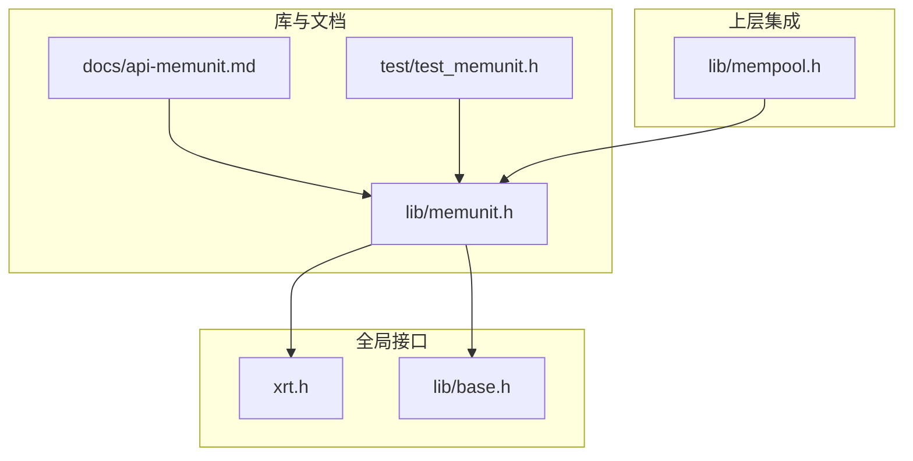
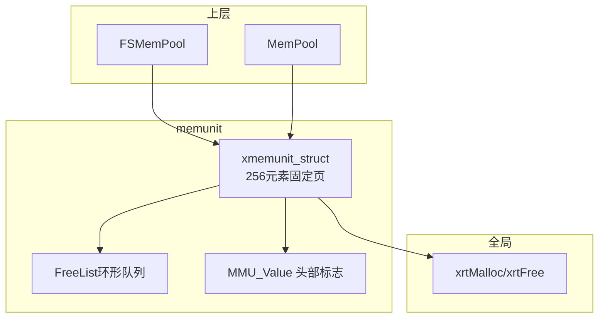
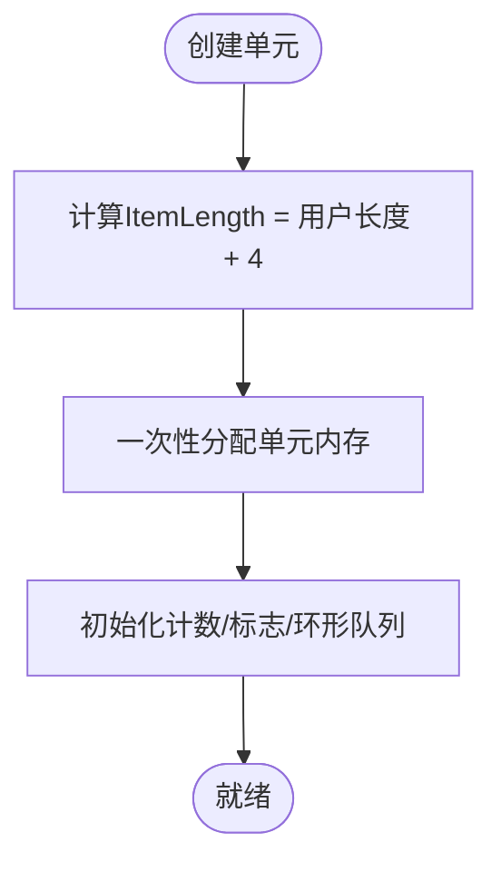
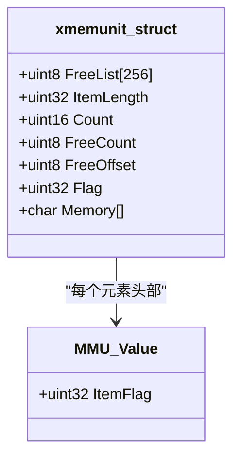
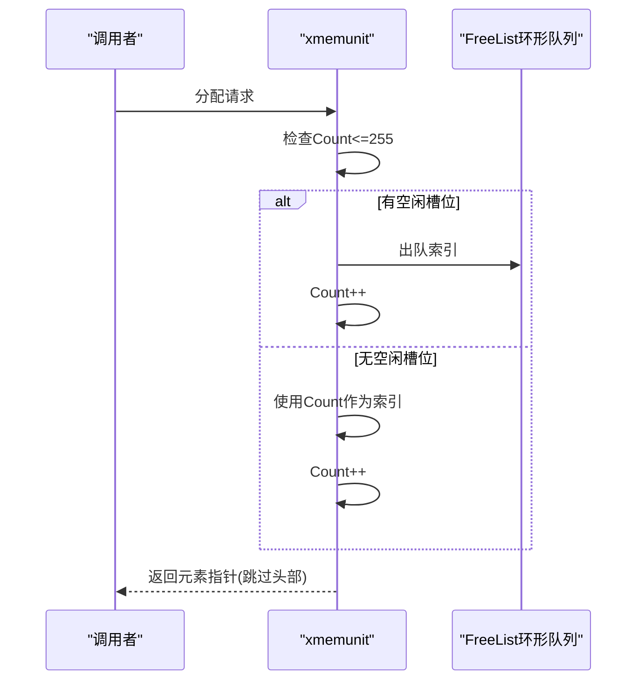
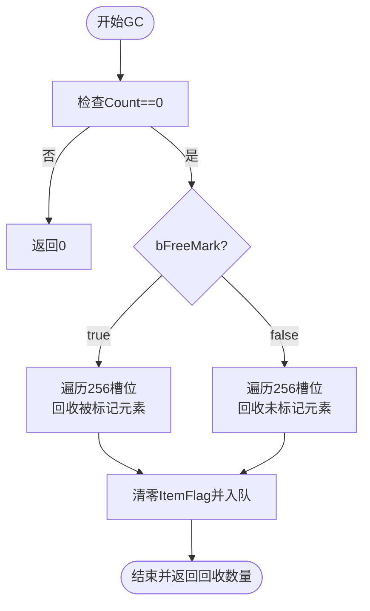

# 内存单元管理模块(memunit)

<cite>
**本文引用的文件列表**
- [memunit.h](file://lib/memunit.h)
- [api-memunit.md](file://docs/api-memunit.md)
- [test_memunit.h](file://test/test_memunit.h)
- [xrt.h](file://xrt.h)
- [base.h](file://lib/base.h)
- [mempool.h](file://lib/mempool.h)
</cite>

## 目录
1. [简介](#简介)
2. [项目结构](#项目结构)
3. [核心组件](#核心组件)
4. [架构总览](#架构总览)
5. [组件详解](#组件详解)
6. [依赖关系分析](#依赖关系分析)
7. [性能考量](#性能考量)
8. [故障排查指南](#故障排查指南)
9. [结论](#结论)
10. [附录](#附录)

## 简介
本文件系统化梳理内存单元管理模块(memunit)的设计与实现，重点覆盖：
- 256字节页管理的设计理念与实现原理
- 内存页划分策略、单元大小标准化与内存对齐机制
- 垃圾回收(GC)标记回收的工作流程（触发条件、回收算法、批量回收优化）
- 内存单元的分配与释放机制、碎片检测与处理
- 内存使用效率分析、GC性能调优与内存泄漏预防
- 大型应用中的最佳实践与性能监控建议

memunit是XRT库的底层内存管理单元，每个单元管理固定256个固定大小元素，是FSMemPool与MemPool等上层组件的基础。

**章节来源**
- [api-memunit.md](file://docs/api-memunit.md#L22-L33)

## 项目结构
memunit位于lib目录下，配套文档位于docs目录，测试位于test目录；其对外接口与全局内存函数由xrt.h与lib/base.h提供。

**图表来源**
- [memunit.h](file://lib/memunit.h#L1-L143)
- [api-memunit.md](file://docs/api-memunit.md#L1-L662)
- [test_memunit.h](file://test/test_memunit.h#L1-L253)
- [xrt.h](file://xrt.h#L1260-L1275)
- [base.h](file://lib/base.h#L1-L132)
- [mempool.h](file://lib/mempool.h#L1-L200)

**章节来源**
- [memunit.h](file://lib/memunit.h#L1-L143)
- [api-memunit.md](file://docs/api-memunit.md#L1-L662)
- [test_memunit.h](file://test/test_memunit.h#L1-L253)
- [xrt.h](file://xrt.h#L1260-L1275)
- [base.h](file://lib/base.h#L1-L132)
- [mempool.h](file://lib/mempool.h#L1-L200)

## 核心组件
- 内存单元结构体：管理256个元素的固定页，包含环形空闲槽位队列、元素长度、计数、标志位前缀等。
- 标志位结构：每个元素头部4字节，承载使用状态、GC标记与索引信息。
- 分配与释放：基于环形队列的空闲槽位复用，保证O(1)时间复杂度。
- 垃圾回收：支持标记-清除，按“被标记回收”或“未标记回收”两种模式批量回收。

**章节来源**
- [memunit.h](file://lib/memunit.h#L21-L86)
- [api-memunit.md](file://docs/api-memunit.md#L82-L130)

## 架构总览
memunit作为底层组件，向上层FSMemPool/MemPool提供固定页内存池能力；其标志位与环形队列设计使得分配/释放与GC均能在常数时间内完成。

**图表来源**
- [mempool.h](file://lib/mempool.h#L147-L200)
- [memunit.h](file://lib/memunit.h#L1-L143)
- [xrt.h](file://xrt.h#L1260-L1275)

## 组件详解

### 256字节页管理与内存对齐
- 设计理念
  - 固定容量：每个单元最多容纳256个元素，便于批量化管理与统计。
  - 元素标准化：每个元素头部4字节用于标志位，用户数据长度为iItemLength。
  - 对齐与布局：内存布局紧凑，头部标志紧随柔性数组Memory，元素按固定步长ItemLength排列。
- 划分策略
  - 单元总大小 = sizeof(xmemunit_struct) + 256 * (iItemLength + 4)，一次性分配，减少碎片。
  - 索引定位：元素地址 = Memory + idx * ItemLength，索引由ItemFlag低位携带。
- 对齐机制
  - 通过在iItemLength基础上加4字节，确保每个元素头部对齐，简化指针计算与标志位读取。

**图表来源**
- [memunit.h](file://lib/memunit.h#L5-L19)
- [api-memunit.md](file://docs/api-memunit.md#L34-L52)

**章节来源**
- [memunit.h](file://lib/memunit.h#L5-L19)
- [api-memunit.md](file://docs/api-memunit.md#L34-L52)

### 标志位与索引编码
- 标志位布局（32位）
  - U(31位)：使用中标志
  - G(30位)：GC标记位
  - ID/Index(29-0)：元素索引（低8位）
- 标志位前缀
  - Flag字段由上层管理器下发，作为高位扩展，与索引共同构成唯一标识。
- 索引提取
  - 通过ItemFlag & 0xFF即可得到元素索引，用于快速定位与释放。

**图表来源**
- [api-memunit.md](file://docs/api-memunit.md#L82-L130)
- [memunit.h](file://lib/memunit.h#L38-L40)

**章节来源**
- [api-memunit.md](file://docs/api-memunit.md#L56-L78)
- [memunit.h](file://lib/memunit.h#L38-L40)

### 分配与释放机制
- 分配策略
  - 优先复用：若FreeCount>0，从环形队列取索引进行复用。
  - 新分配：否则使用Count作为新索引，并递增Count。
  - 边界：Count>255时拒绝分配。
- 释放策略
  - 通过指针或索引释放，均将索引写入环形队列尾部，更新FreeCount与Count。
  - 若Count归零，重置FreeCount与FreeOffset，避免悬挂状态。
- 时间复杂度
  - 分配/释放均为O(1)，环形队列保证常数时间访问与插入。

**图表来源**
- [memunit.h](file://lib/memunit.h#L21-L41)

**章节来源**
- [memunit.h](file://lib/memunit.h#L21-L86)
- [api-memunit.md](file://docs/api-memunit.md#L200-L270)

### 垃圾回收(GC)工作流
- 触发条件
  - 仅当Count==0时允许执行GC，避免在活跃使用期间破坏数据。
- 回收模式
  - bFreeMark=true：回收“被标记”的元素
  - bFreeMark=false：回收“未被标记”的元素（标准Mark-Sweep）
- 批量回收优化
  - 遍历256个槽位，按模式筛选并批量写入FreeList，随后清零对应元素的ItemFlag。
  - 自动清理保留元素的GC标记位，避免残留状态。
- 性能特性
  - 单次GC遍历256个槽位，时间复杂度O(1)（固定上限），适合高频调用。

**图表来源**
- [memunit.h](file://lib/memunit.h#L88-L140)

**章节来源**
- [memunit.h](file://lib/memunit.h#L88-L140)
- [api-memunit.md](file://docs/api-memunit.md#L357-L437)

### 内存碎片检测与处理
- 碎片成因
  - 高频分配/释放导致空闲槽位分散，但memunit采用环形队列复用，天然降低外部碎片风险。
- 检测方法
  - 通过Count与FreeCount的差值评估活跃度；当Count接近256且频繁释放时，可观察FreeCount变化。
- 处理策略
  - 使用GC回收未使用元素，使FreeList保持可用性。
  - 在上层池化组件中，结合空闲页与全空页的切换，进一步减少碎片。

**章节来源**
- [test_memunit.h](file://test/test_memunit.h#L104-L191)
- [memunit.h](file://lib/memunit.h#L32-L61)

### 内存使用效率分析
- 单元利用率
  - 每单元256个元素，元素头部4字节，有效载荷越大，头部开销占比越低。
- 内存占用
  - 单元总占用 = 固定头 + 256*(用户长度+4)，适合固定大小对象的高吞吐场景。
- 访问局部性
  - 元素连续存储，提升缓存命中率，有利于高频访问对象池。

**章节来源**
- [api-memunit.md](file://docs/api-memunit.md#L178-L181)

### GC性能调优指南
- 调整周期
  - 在低峰期执行GC(bFreeMark=false)，减少运行时抖动。
- 标记策略
  - 仅标记可达对象，避免过度标记导致保留过多。
- 批量回收
  - 利用GC的批量回收能力，在一次GC中清理大量未使用元素。

**章节来源**
- [api-memunit.md](file://docs/api-memunit.md#L396-L430)

### 内存泄漏预防
- 必须成对释放
  - 每次分配都应有对应的释放，确保FreeCount与Count平衡。
- 指针有效性
  - 释放前校验ItemFlag的USE位，避免重复释放。
- 上层约束
  - 在上层池化组件中，统一入口管理生命周期，防止跨层误用。

**章节来源**
- [memunit.h](file://lib/memunit.h#L49-L84)

### 大型应用最佳实践
- 选择合适的上层组件
  - 一般优先使用FSMemPool或MemPool，避免直接使用memunit。
- 容量规划
  - 通过Count与ItemLength估算单元数量，预留一定冗余。
- GC周期管理
  - 在业务低负载时段执行GC，减少对主线程的影响。
- 监控建议
  - 统计Count/FreeCount变化趋势，识别异常增长或泄漏迹象。

**章节来源**
- [api-memunit.md](file://docs/api-memunit.md#L525-L553)
- [api-memunit.md](file://docs/api-memunit.md#L589-L632)

## 依赖关系分析
- memunit依赖全局内存接口(xrtMalloc/xrtFree)进行一次性分配与销毁。
- mempool在构建时使用memunit创建固定页，并通过Flag与索引实现跨页管理。
- 标志位常量定义于xrt.h，供memunit与上层组件共享。

**图表来源**
- [xrt.h](file://xrt.h#L1260-L1275)
- [base.h](file://lib/base.h#L1-L132)
- [memunit.h](file://lib/memunit.h#L1-L143)
- [mempool.h](file://lib/mempool.h#L1-L200)

**章节来源**
- [xrt.h](file://xrt.h#L1260-L1275)
- [base.h](file://lib/base.h#L1-L132)
- [memunit.h](file://lib/memunit.h#L1-L143)
- [mempool.h](file://lib/mempool.h#L1-L200)

## 性能考量
- 时间复杂度
  - 分配/释放：O(1)
  - GC：O(1)（固定256槽位）
- 空间开销
  - 头部4字节标志位，对大对象影响较小；对小对象需权衡头部占比。
- 缓存友好
  - 元素连续存储，适合高频访问场景。

[本节为通用性能讨论，不直接分析具体文件]

## 故障排查指南
- 分配失败
  - 检查Count是否已达256；确认iItemLength是否合理。
- 释放失败
  - 检查ItemFlag的USE位是否为1；确认指针是否来自该单元。
- GC无效
  - 确认Count==0；检查bFreeMark模式与标记逻辑。
- 泄漏迹象
  - Count持续增长且FreeCount长期为0；结合上层组件检查生命周期管理。

**章节来源**
- [memunit.h](file://lib/memunit.h#L24-L29)
- [memunit.h](file://lib/memunit.h#L49-L52)
- [memunit.h](file://lib/memunit.h#L94-L96)
- [test_memunit.h](file://test/test_memunit.h#L207-L241)

## 结论
memunit以“256元素固定页”为核心，通过紧凑布局与环形队列实现O(1)的分配/释放与GC，适合固定大小对象的高吞吐场景。配合上层池化组件，可在大型应用中实现高效、可控的内存管理。实践中应重视GC周期管理、容量规划与生命周期约束，以获得稳定性能与良好可维护性。

[本节为总结性内容，不直接分析具体文件]

## 附录
- 关键API与数据结构参考
  - 创建/销毁：xrtMemUnitCreate/xrtMemUnitDestroy
  - 分配/释放：xrtMemUnitAlloc/xrtMemUnitFree/xrtMemUnitFreeIdx
  - 标记/回收：xrtMemUnitGC_Mark/xrtMemUnitGC
  - 数据结构：MMU_Value、xmemunit_struct

**章节来源**
- [api-memunit.md](file://docs/api-memunit.md#L132-L196)
- [api-memunit.md](file://docs/api-memunit.md#L200-L354)
- [api-memunit.md](file://docs/api-memunit.md#L357-L437)