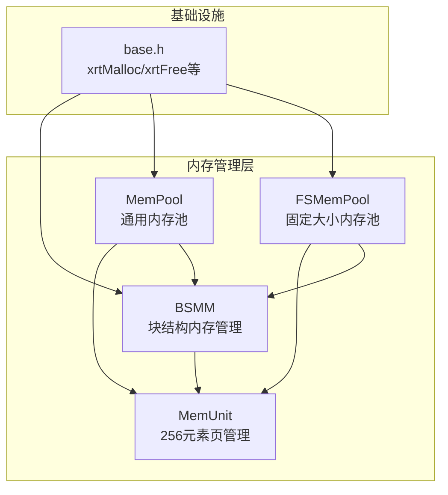
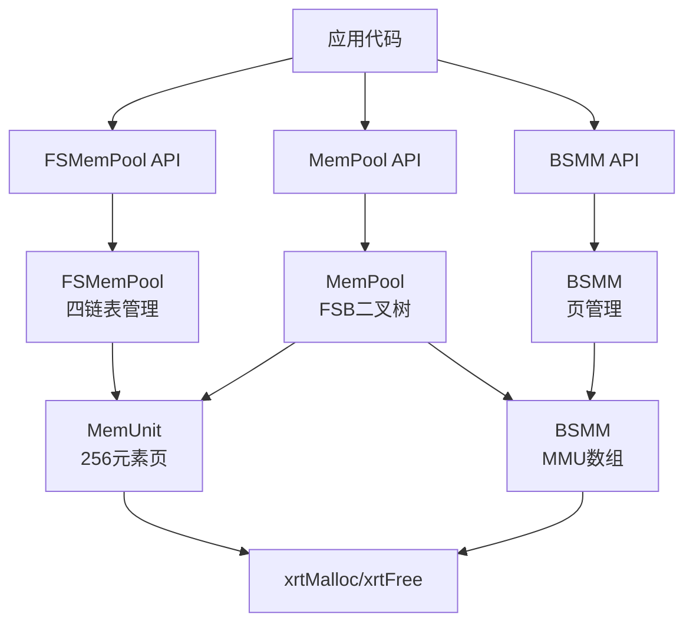
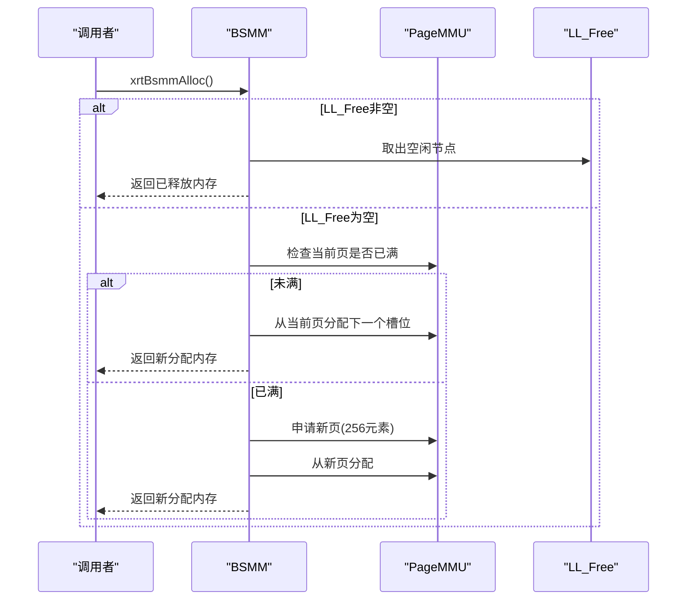
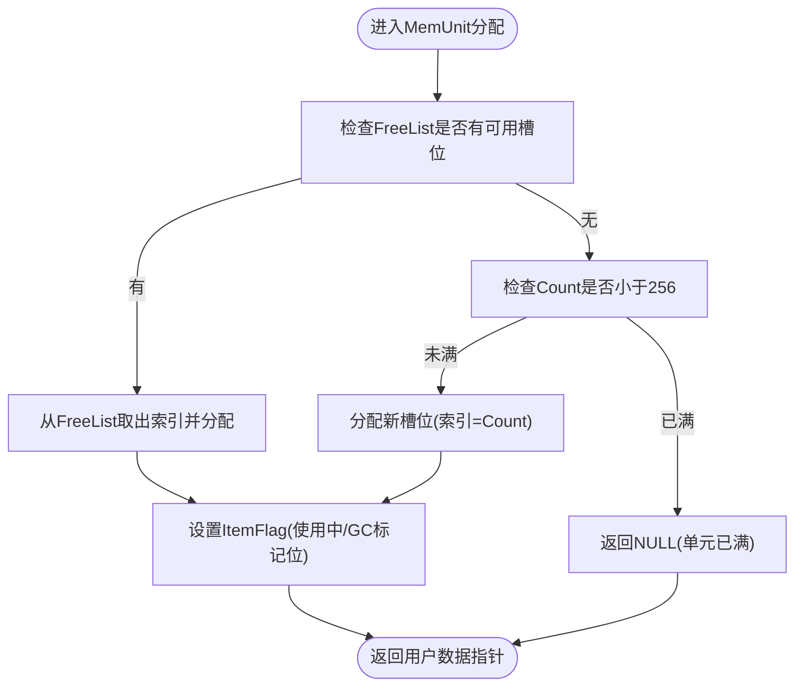
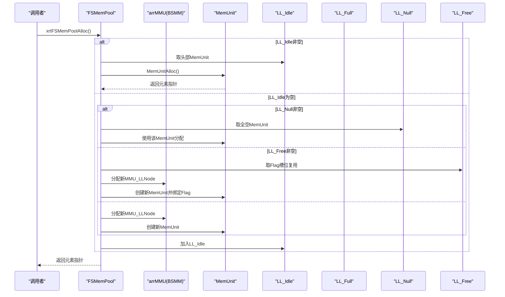
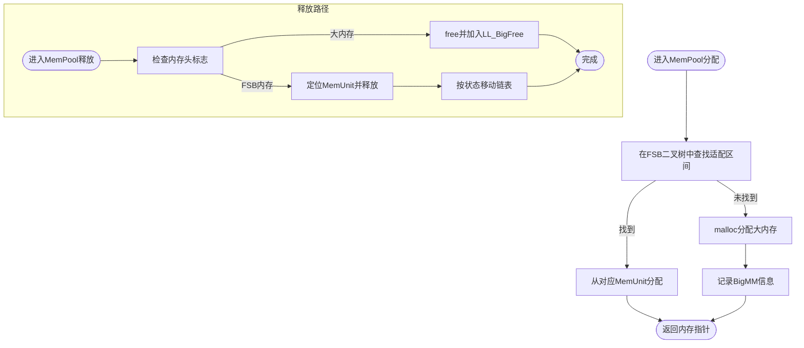
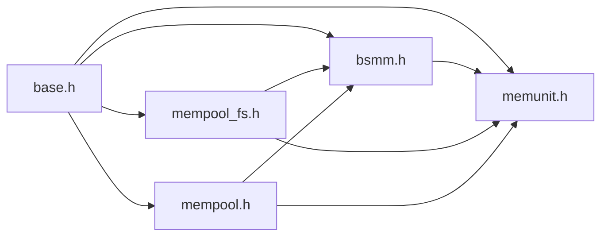

# 内存管理层

<cite>
**本文档引用的文件**
- [lib/bsmm.h](file://lib/bsmm.h)
- [lib/memunit.h](file://lib/memunit.h)
- [lib/mempool_fs.h](file://lib/mempool_fs.h)
- [lib/mempool.h](file://lib/mempool.h)
- [lib/base.h](file://lib/base.h)
- [docs/api-bsmm.md](file://docs/api-bsmm.md)
- [docs/api-memunit.md](file://docs/api-memunit.md)
- [docs/api-mempool-fs.md](file://docs/api-mempool-fs.md)
- [docs/api-mempool.md](file://docs/api-mempool.md)
- [test/test_bsmm.h](file://test/test_bsmm.h)
- [test/test_memunit.h](file://test/test_memunit.h)
- [test/test_mempool_fs.h](file://test/test_mempool_fs.h)
- [test/test_mempool.h](file://test/test_mempool.h)
</cite>

## 目录
1. [简介](#简介)
2. [项目结构](#项目结构)
3. [核心组件](#核心组件)
4. [架构概览](#架构概览)
5. [详细组件分析](#详细组件分析)
6. [依赖关系分析](#依赖关系分析)
7. [性能考虑](#性能考虑)
8. [故障排查指南](#故障排查指南)
9. [结论](#结论)
10. [附录](#附录)

## 简介
本文件系统性阐述XRT内存管理层的四大模块：块结构内存管理（BSMM）、内存单元（MemUnit）、固定大小内存池（FSMemPool）与通用内存池（MemPool）。重点解析其256元素/页设计、释放链表复用、GC标记回收、空闲/满载链表分组与智能分配策略，并结合底层原理、碎片化处理与性能优化策略，提供内存使用模式分析、泄漏检测与调优指导，以及大规模应用的最佳实践。

## 项目结构
XRT内存管理层位于lib目录，配套文档在docs目录，测试样例在test目录。四大模块协同工作，形成从底层页管理到高层对象池的完整内存管理栈。

**图表来源**
- [lib/bsmm.h](file://lib/bsmm.h#L1-L94)
- [lib/memunit.h](file://lib/memunit.h#L1-L143)
- [lib/mempool_fs.h](file://lib/mempool_fs.h#L1-L257)
- [lib/mempool.h](file://lib/mempool.h#L1-L468)
- [lib/base.h](file://lib/base.h#L1-L132)

**章节来源**
- [lib/bsmm.h](file://lib/bsmm.h#L1-L94)
- [lib/memunit.h](file://lib/memunit.h#L1-L143)
- [lib/mempool_fs.h](file://lib/mempool_fs.h#L1-L257)
- [lib/mempool.h](file://lib/mempool.h#L1-L468)
- [lib/base.h](file://lib/base.h#L1-L132)

## 核心组件
- BSMM（块结构内存管理）：每页256个元素，按需分配新页，空闲链表复用，O(1)分配/释放，无碎片。
- MemUnit（内存单元）：256元素固定页，环形空闲队列复用，GC标记回收，元数据头记录状态与索引。
- FSMemPool（固定大小内存池）：四链表管理（Idle/Full/Null/Free），智能复用Flag槽位，无限容量，GC支持。
- MemPool（通用内存池）：二叉树索引FSB（固定大小区块），多级分块管理，支持小内存（1-512B）与大内存（1-4096B）方案，GC支持。

**章节来源**
- [docs/api-bsmm.md](file://docs/api-bsmm.md#L21-L31)
- [docs/api-memunit.md](file://docs/api-memunit.md#L22-L33)
- [docs/api-mempool-fs.md](file://docs/api-mempool-fs.md#L21-L32)
- [docs/api-mempool.md](file://docs/api-mempool.md#L22-L33)

## 架构概览
四大模块的层次关系与协作方式如下：

**图表来源**
- [lib/mempool_fs.h](file://lib/mempool_fs.h#L24-L33)
- [lib/mempool.h](file://lib/mempool.h#L35-L37)
- [lib/bsmm.h](file://lib/bsmm.h#L24-L29)
- [lib/base.h](file://lib/base.h#L5-L45)

## 详细组件分析

### BSMM（块结构内存管理）
- 设计要点
  - 每页256个元素，按需分配新页，避免碎片。
  - 空闲链表复用已释放内存，提升局部性与性能。
  - 分配/释放均为O(1)，适合高频对象池场景。
- 关键数据结构
  - xbsmm_struct：包含ItemLength、Count、PageMMU（指针数组）、LL_Free（空闲链表）。
  - MemPtr_LLNode：空闲指针单向链表节点。
- 分配流程
  - 优先从LL_Free复用；若无空闲则从当前页分配；若页满则申请新页。
- 释放流程
  - 将指针加入LL_Free，不立即释放物理内存，待销毁时统一释放。

**图表来源**
- [lib/bsmm.h](file://lib/bsmm.h#L52-L82)

**章节来源**
- [lib/bsmm.h](file://lib/bsmm.h#L1-L94)
- [docs/api-bsmm.md](file://docs/api-bsmm.md#L21-L31)
- [test/test_bsmm.h](file://test/test_bsmm.h#L12-L434)

### MemUnit（内存单元）
- 设计要点
  - 每页固定256个元素，环形空闲队列（FreeList）管理可复用槽位。
  - 元数据头MMU_Value记录使用状态、GC标记与元素索引。
  - 分配/释放O(1)，支持GC标记-清除。
- 关键数据结构
  - xmemunit_struct：包含FreeList、ItemLength、Count、FreeCount、FreeOffset、Flag与Memory。
  - MMU_Value：4字节标志位，包含使用状态、GC标记与索引。
- 分配策略
  - 优先复用FreeList；否则分配新槽位（索引=Count）。
- 释放策略
  - 将索引进FreeList，支持按指针或索引释放。
- GC机制
  - 标记阶段：对活跃对象设置GC标记。
  - 清除阶段：按模式回收被标记/未标记对象。

**图表来源**
- [lib/memunit.h](file://lib/memunit.h#L22-L41)
- [lib/memunit.h](file://lib/memunit.h#L44-L86)

**章节来源**
- [lib/memunit.h](file://lib/memunit.h#L1-L143)
- [docs/api-memunit.md](file://docs/api-memunit.md#L22-L33)
- [test/test_memunit.h](file://test/test_memunit.h#L12-L253)

### FSMemPool（固定大小内存池）
- 设计要点
  - 基于MemUnit与BSMM，实现无限容量的固定大小对象池。
  - 四链表管理：LL_Idle（有空闲）、LL_Full（已满）、LL_Null（全空备用）、LL_Free（已释放Flag槽位复用）。
  - 智能复用：优先使用LL_Null，其次复用LL_Free槽位，最后创建新MemUnit。
- 关键数据结构
  - xfsmempool_struct：包含ItemLength、arrMMU（BSMM管理MMU_LLNode）、LL_Idle/LL_Full/LL_Null/LL_Free。
  - MMU_LLNode：双向链表节点，保存Flag与xmemunit指针。
- 分配流程
  - 从LL_Idle头部MemUnit分配；若无空闲则优先LL_Null，其次LL_Free，最后创建新MemUnit。
  - 若MemUnit即将满载，移动至LL_Full。
- 释放流程
  - 通过指针前4字节的ItemFlag提取所属MemUnit与索引，调用MemUnit释放。
  - 满载MemUnit移至LL_Idle；清空MemUnit移至LL_Null或LL_Free。

**图表来源**
- [lib/mempool_fs.h](file://lib/mempool_fs.h#L52-L125)
- [lib/mempool_fs.h](file://lib/mempool_fs.h#L178-L198)

**章节来源**
- [lib/mempool_fs.h](file://lib/mempool_fs.h#L1-L257)
- [docs/api-mempool-fs.md](file://docs/api-mempool-fs.md#L21-L32)
- [test/test_mempool_fs.h](file://test/test_mempool_fs.h#L12-L832)

### MemPool（通用内存池）
- 设计要点
  - 支持可变大小内存分配，内置小内存（1-512B）与大内存（1-4096B）两套预设方案。
  - FSB（固定大小区块）二叉树索引，快速定位适配的MemUnit链表。
  - 大内存超范围时使用malloc，记录信息于BigMM，支持GC。
- 关键数据结构
  - FSB_Item：二叉树节点，管理LL_Idle/LL_Full/LL_Null/LL_Free。
  - xmempool_struct：包含FSB_Memory、FSB_RootNode、arrMMU（BSMM）、BigMM（BSMM）、LL_BigFree。
- 分配流程
  - 在FSB二叉树中查找匹配区间，从对应MemUnit分配；若未找到则malloc并记录BigMM。
- 释放流程
  - 大内存：free并加入LL_BigFree复用。
  - FSB内存：通过ItemFlag定位MemUnit，释放后按状态移动链表。
- GC流程
  - 遍历FSB链表执行MemUnitGC，随后递归左右子树；最后清理BigMM。

**图表来源**
- [lib/mempool.h](file://lib/mempool.h#L148-L261)
- [lib/mempool.h](file://lib/mempool.h#L335-L385)

**章节来源**
- [lib/mempool.h](file://lib/mempool.h#L1-L468)
- [docs/api-mempool.md](file://docs/api-mempool.md#L22-L33)
- [test/test_mempool.h](file://test/test_mempool.h#L25-L187)

## 依赖关系分析
- 组件耦合
  - BSMM为底层页管理器，被MemUnit与FSMemPool共享使用。
  - MemUnit为FSMemPool与MemPool的共同基础。
  - MemPool同时依赖BSMM与MemUnit，实现FSB索引与大内存兜底。
- 外部依赖
  - 所有模块均通过base.h封装的xrtMalloc/xrtFree进行系统内存交互。
- 潜在循环依赖
  - 模块间通过指针与回调组织，未见直接循环包含；链表结构避免了循环引用。

**图表来源**
- [lib/base.h](file://lib/base.h#L5-L45)
- [lib/bsmm.h](file://lib/bsmm.h#L1-L94)
- [lib/memunit.h](file://lib/memunit.h#L1-L143)
- [lib/mempool_fs.h](file://lib/mempool_fs.h#L1-L257)
- [lib/mempool.h](file://lib/mempool.h#L1-L468)

**章节来源**
- [lib/base.h](file://lib/base.h#L1-L132)
- [lib/bsmm.h](file://lib/bsmm.h#L1-L94)
- [lib/memunit.h](file://lib/memunit.h#L1-L143)
- [lib/mempool_fs.h](file://lib/mempool_fs.h#L1-L257)
- [lib/mempool.h](file://lib/mempool.h#L1-L468)

## 性能考虑
- 时间复杂度
  - BSMM/FSMemPool/MemUnit分配/释放均为O(1)。
  - MemPool分配涉及FSB二叉树查找，平均O(log n)。
- 空间效率
  - 256元素/页设计减少碎片，提高缓存命中率。
  - 空闲链表与环形队列降低分配开销。
- 碎片化处理
  - 固定大小分配（BSMM/FSMemPool/MemUnit）天然无碎片。
  - MemPool通过FSB与大内存兜底平衡碎片与灵活性。
- 性能优化建议
  - 优先选择与对象大小匹配的模块：固定大小用FSMemPool，可变大小用MemPool。
  - 大量短生命周期对象使用FSMemPool，减少系统malloc压力。
  - 合理设置GC周期，避免频繁标记-清除带来的暂停。
  - 批量分配/释放可减少链表移动与页切换成本。

[本节为通用性能讨论，无需特定文件引用]

## 故障排查指南
- 常见问题
  - 跨池释放：FSMemPool/MemPool释放时必须使用对应池的Alloc结果，否则ItemFlag不匹配导致未定义行为。
  - 悬挂指针：释放后继续使用原指针，应立即将其置空。
  - 池耗尽：MemUnit达到256上限或FSMemPool/FSPB满载，需扩容或回收。
- 检测手段
  - 使用GC标记-清除验证内存泄漏：标记根对象，执行GC，统计回收数量。
  - 观察链表状态：FSMemPool的LL_Idle/LL_Full/LL_Null/LL_Free分布是否合理。
  - 压力测试：1000万次分配/释放测试，观察耗时与内存占用。
- 定位步骤
  - 确认分配/释放路径是否匹配同一池。
  - 检查ItemFlag高16位（Flag）与低8位（索引）是否正确。
  - 使用测试用例验证链表移动逻辑（满载/清空转移）。

**章节来源**
- [docs/api-mempool-fs.md](file://docs/api-mempool-fs.md#L636-L666)
- [docs/api-memunit.md](file://docs/api-memunit.md#L590-L632)
- [test/test_mempool_fs.h](file://test/test_mempool_fs.h#L506-L594)
- [test/test_mempool.h](file://test/test_mempool.h#L25-L187)

## 结论
XRT内存管理层通过BSMM、MemUnit、FSMemPool与MemPool的分层设计，实现了从底层页管理到高层对象池的高效内存管理。256元素/页与空闲链表复用确保了极高的分配/释放性能与无碎片特性；FSB二叉树与四链表管理进一步提升了可扩展性与资源利用率。配合GC标记-清除机制，可在大规模应用中实现稳定、可控的内存使用模式。

[本节为总结性内容，无需特定文件引用]

## 附录

### 内存池选择指南
- 固定大小对象池：FSMemPool（无限容量、四链表管理、GC支持）
- 可变大小对象池：MemPool（FSB二叉树、小/大内存预设、GC支持）
- 简单固定大小：BSMM（最底层、无GC）
- 高性能固定页：MemUnit（256元素页、GC支持）

**章节来源**
- [docs/api-bsmm.md](file://docs/api-bsmm.md#L572-L583)
- [docs/api-memunit.md](file://docs/api-memunit.md#L636-L645)
- [docs/api-mempool-fs.md](file://docs/api-mempool-fs.md#L706-L717)
- [docs/api-mempool.md](file://docs/api-mempool.md#L707-L717)

### 大规模应用最佳实践
- 对象池化：高频创建/销毁的对象使用FSMemPool，减少系统调用。
- 分层管理：小对象用FSMemPool，大对象用MemPool，避免碎片。
- GC策略：定期GC，标记根集，避免长周期持有无用对象。
- 监控与压测：持续监控链表分布与GC回收效果，进行容量与性能调优。

[本节为通用最佳实践，无需特定文件引用]