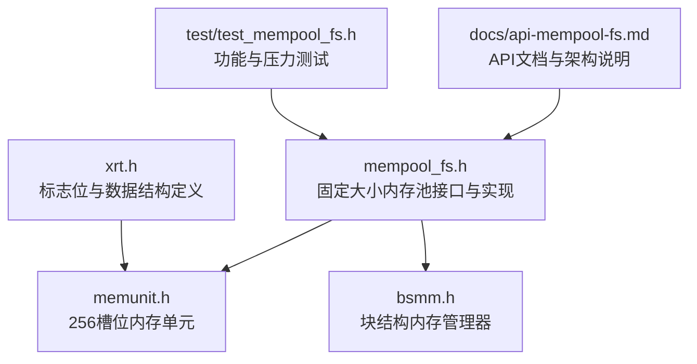
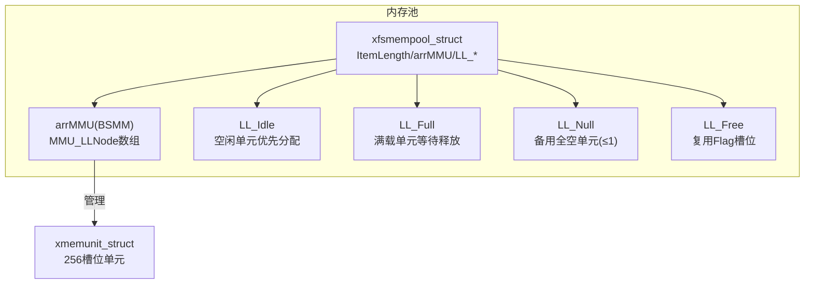
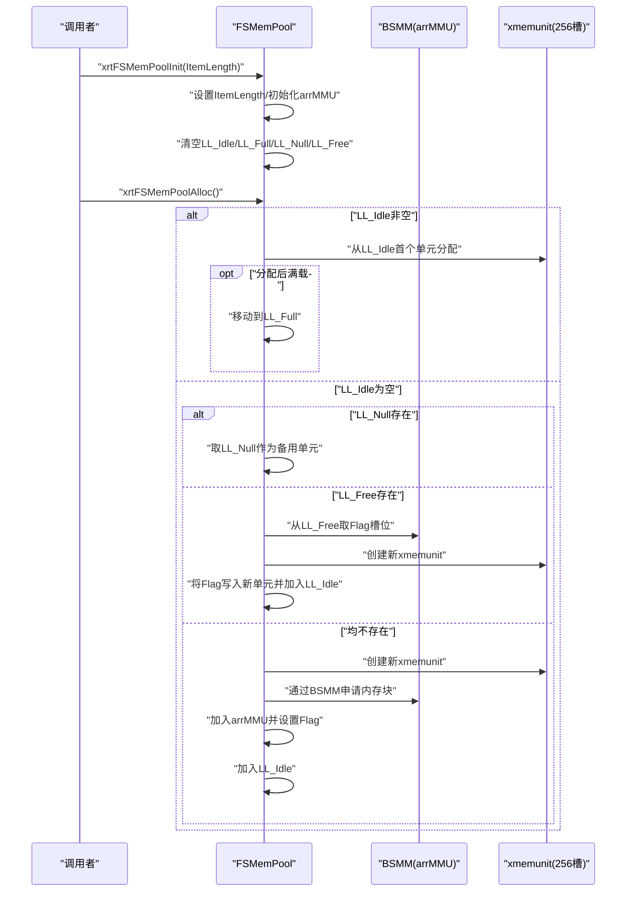
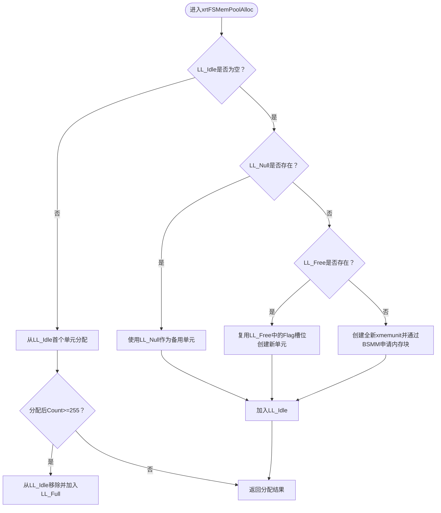
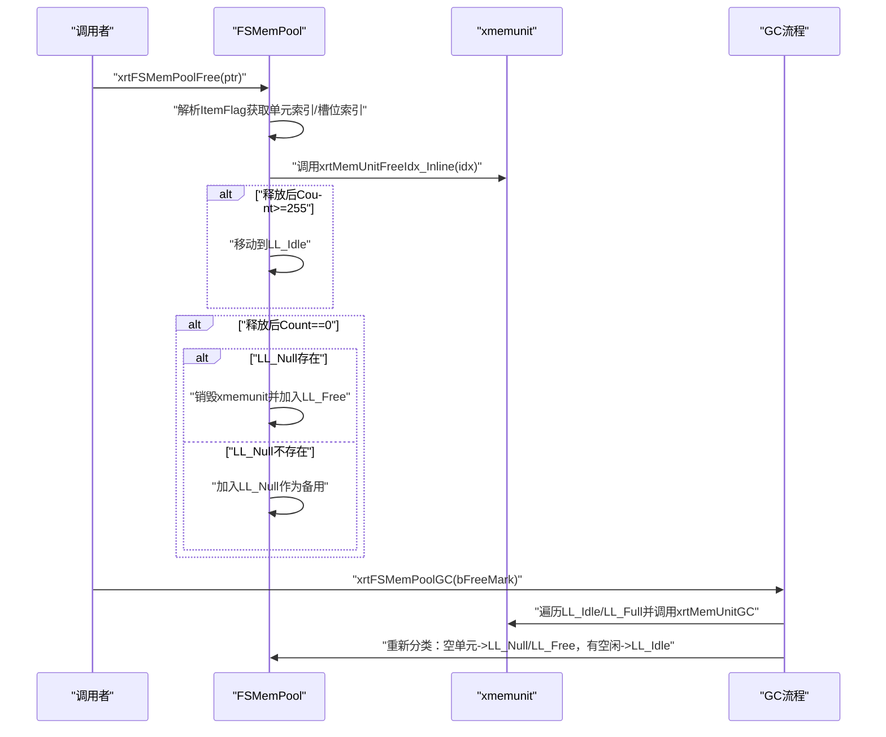
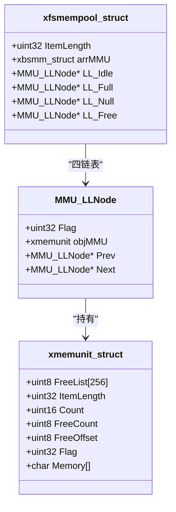
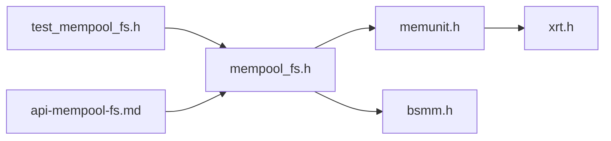

# 固定大小内存池模块(mempool_fs)

<cite>
**本文档引用的文件**
- [lib/mempool_fs.h](file://lib/mempool_fs.h)
- [lib/memunit.h](file://lib/memunit.h)
- [lib/bsmm.h](file://lib/bsmm.h)
- [xrt.h](file://xrt.h)
- [docs/api-mempool-fs.md](file://docs/api-mempool-fs.md)
- [test/test_mempool_fs.h](file://test/test_mempool_fs.h)
</cite>

## 目录
1. [简介](#简介)
2. [项目结构](#项目结构)
3. [核心组件](#核心组件)
4. [架构总览](#架构总览)
5. [详细组件分析](#详细组件分析)
6. [依赖关系分析](#依赖关系分析)
7. [性能考量](#性能考量)
8. [故障排除指南](#故障排除指南)
9. [结论](#结论)
10. [附录](#附录)

## 简介
本文件系统化阐述固定大小内存池模块(mempool_fs)的设计与实现，重点覆盖以下方面：
- 空闲/满载/备用/可复用链表的分组管理策略
- 内存块的分类管理、智能分配算法与负载均衡机制
- 初始化流程、容量扩展策略与内存回收机制
- 固定大小分配带来的优势：分配速度优化、内存碎片减少、缓存局部性提升
- 内存池大小选择指南、不同应用场景下的性能对比与优化建议
- 实时系统与高性能计算中的应用实例与故障排除

## 项目结构
mempool_fs位于lib目录下，配合memunit与bsmm共同实现“按256槽位分块”的固定大小对象池，并通过四链表(LL_Idle/LL_Full/LL_Null/LL_Free)实现高效调度与复用。

图表来源
- [lib/mempool_fs.h](file://lib/mempool_fs.h#L1-L257)
- [lib/memunit.h](file://lib/memunit.h#L1-L143)
- [lib/bsmm.h](file://lib/bsmm.h#L1-L94)
- [xrt.h](file://xrt.h#L1260-L1459)
- [docs/api-mempool-fs.md](file://docs/api-mempool-fs.md#L1-L735)
- [test/test_mempool_fs.h](file://test/test_mempool_fs.h#L1-L832)

章节来源
- [lib/mempool_fs.h](file://lib/mempool_fs.h#L1-L257)
- [lib/memunit.h](file://lib/memunit.h#L1-L143)
- [lib/bsmm.h](file://lib/bsmm.h#L1-L94)
- [xrt.h](file://xrt.h#L1260-L1459)
- [docs/api-mempool-fs.md](file://docs/api-mempool-fs.md#L1-L735)
- [test/test_mempool_fs.h](file://test/test_mempool_fs.h#L1-L832)

## 核心组件
- 固定大小内存池结构体：xfsmempool_struct，包含元素大小(ItemLength)、MMU数组(arrMMU)、四条链表头指针(LL_Idle/LL_Full/LL_Null/LL_Free)。
- 内存单元结构体：xmemunit_struct，每个单元固定256个槽位，采用循环空闲列表(FreeList)与计数器实现O(1)分配/释放。
- 块结构内存管理器：xbsmm_struct，负责为MMU节点分配连续内存块，支持按需扩容与空闲块复用。
- 标志位与数据头：MMU_Value，通过ItemFlag高26位存储所属单元标识，低8位存储槽位索引；另有GC标记位。

章节来源
- [lib/mempool_fs.h](file://lib/mempool_fs.h#L1349-L1381)
- [lib/memunit.h](file://lib/memunit.h#L1278-L1335)
- [lib/bsmm.h](file://lib/bsmm.h#L1-L94)
- [xrt.h](file://xrt.h#L1260-L1287)

## 架构总览
mempool_fs以“链表+数组”的组合方式组织内存单元，形成如下四类链表：
- LL_Idle：有空闲槽位的内存单元，优先从这里分配
- LL_Full：已满载的内存单元，不再分配，等待释放
- LL_Null：全空的内存单元（最多保留1个），作为备用，避免临界状态频繁创建/销毁
- LL_Free：已释放的Flag槽位，复用Flag避免冲突

图表来源
- [lib/mempool_fs.h](file://lib/mempool_fs.h#L1349-L1381)
- [lib/bsmm.h](file://lib/bsmm.h#L1-L94)
- [lib/memunit.h](file://lib/memunit.h#L1278-L1335)

章节来源
- [docs/api-mempool-fs.md](file://docs/api-mempool-fs.md#L33-L72)
- [lib/mempool_fs.h](file://lib/mempool_fs.h#L1349-L1381)

## 详细组件分析

### 组件A：内存池初始化与容量扩展
- 初始化：设置ItemLength，初始化arrMMU为BSMM，清空四链表头指针。
- 容量扩展：当LL_Idle为空且无可用Flag槽位时，优先尝试复用LL_Null（备用单元），其次复用LL_Free中的Flag槽位创建新单元，最后通过BSMM申请新的内存块并创建xmemunit。
- Flag复用：通过LL_Free保存已释放的Flag槽位，避免新单元Flag冲突。

图表来源
- [lib/mempool_fs.h](file://lib/mempool_fs.h#L24-L125)
- [lib/bsmm.h](file://lib/bsmm.h#L52-L82)
- [lib/memunit.h](file://lib/memunit.h#L5-L19)

章节来源
- [lib/mempool_fs.h](file://lib/mempool_fs.h#L24-L125)
- [lib/bsmm.h](file://lib/bsmm.h#L52-L82)

### 组件B：智能分配算法与负载均衡
- 分配优先级：优先从LL_Idle头部单元分配；若该单元即将满载则移动至LL_Full。
- 备用单元策略：当LL_Idle为空且无可用Flag槽位时，优先使用LL_Null（最多1个），避免频繁创建/销毁导致抖动。
- 负载均衡：通过LL_Idle与LL_Full的动态转移，确保活跃单元集中在LL_Idle，减少分配路径复杂度。

图表来源
- [lib/mempool_fs.h](file://lib/mempool_fs.h#L52-L125)

章节来源
- [lib/mempool_fs.h](file://lib/mempool_fs.h#L52-L125)

### 组件C：内存回收与GC机制
- 释放流程：根据指针前4字节的ItemFlag提取单元索引与槽位索引，调用对应xmemunit释放；若释放后单元从满载转为空闲则移动至LL_Idle；若单元完全清空则进入LL_Null或LL_Free。
- GC流程：遍历LL_Idle与LL_Full中的所有xmemunit，调用xrtMemUnitGC进行标记回收；随后重新分类：空单元进入LL_Null/LL_Free，有空闲的进入LL_Idle。

图表来源
- [lib/mempool_fs.h](file://lib/mempool_fs.h#L128-L254)
- [lib/memunit.h](file://lib/memunit.h#L89-L140)

章节来源
- [lib/mempool_fs.h](file://lib/mempool_fs.h#L128-L254)
- [lib/memunit.h](file://lib/memunit.h#L89-L140)

### 组件D：数据结构与标志位
- MMU_LLNode：链表节点，保存Flag、指向的xmemunit以及前后指针。
- xmemunit_struct：256槽位单元，包含FreeList、Count、FreeCount、FreeOffset与Flag前缀。
- 标志位定义：MMU_FLAG_MASK、MMU_FLAG_USE、MMU_FLAG_GC等，用于区分使用状态与GC标记。

图表来源
- [xrt.h](file://xrt.h#L1260-L1287)
- [lib/mempool_fs.h](file://lib/mempool_fs.h#L1349-L1357)

章节来源
- [xrt.h](file://xrt.h#L1260-L1287)
- [lib/mempool_fs.h](file://lib/mempool_fs.h#L1349-L1357)

## 依赖关系分析
- mempool_fs依赖memunit实现256槽位单元的分配/释放与GC；依赖bsmm实现MMU节点的数组管理与内存块分配。
- memunit依赖xrt.h中的标志位定义与内存分配接口。
- 测试用例覆盖创建/分配/释放/全量分配/压力测试/GC等完整生命周期。

图表来源
- [lib/mempool_fs.h](file://lib/mempool_fs.h#L1-L257)
- [lib/memunit.h](file://lib/memunit.h#L1-L143)
- [lib/bsmm.h](file://lib/bsmm.h#L1-L94)
- [xrt.h](file://xrt.h#L1260-L1459)
- [test/test_mempool_fs.h](file://test/test_mempool_fs.h#L1-L832)
- [docs/api-mempool-fs.md](file://docs/api-mempool-fs.md#L1-L735)

章节来源
- [lib/mempool_fs.h](file://lib/mempool_fs.h#L1-L257)
- [lib/memunit.h](file://lib/memunit.h#L1-L143)
- [lib/bsmm.h](file://lib/bsmm.h#L1-L94)
- [xrt.h](file://xrt.h#L1260-L1459)
- [test/test_mempool_fs.h](file://test/test_mempool_fs.h#L1-L832)
- [docs/api-mempool-fs.md](file://docs/api-mempool-fs.md#L1-L735)

## 性能考量
- 分配速度优化：固定大小分配+256槽位单元+循环空闲列表，典型O(1)分配；四链表优先级降低查找成本。
- 内存碎片减少：同一大小对象统一管理，避免可变大小分配导致的外部碎片。
- 缓存局部性提升：相邻槽位在物理上连续，结合链表头优先分配策略，提高CPU缓存命中率。
- 扩容与复用：通过LL_Null与LL_Free减少频繁创建/销毁；BSMM按需申请内存块，避免一次性大块分配带来的浪费。
- GC支持：在需要对象生命周期管理的场景，GC可显著降低手动管理成本。

章节来源
- [docs/api-mempool-fs.md](file://docs/api-mempool-fs.md#L25-L31)
- [lib/mempool_fs.h](file://lib/mempool_fs.h#L52-L125)
- [lib/memunit.h](file://lib/memunit.h#L21-L86)

## 故障排除指南
- 现象：分配失败返回NULL
  - 排查：确认ItemLength是否合理；检查LL_Idle/LL_Null/LL_Free状态；确认BSMM是否成功扩容。
  - 参考：分配流程与错误处理路径。
- 现象：释放后内存未回收
  - 排查：确认是否正确传入原指针（去掉头部4字节的ItemFlag）；检查GC标记是否影响回收。
  - 参考：释放流程与GC分类逻辑。
- 现象：频繁抖动或性能下降
  - 排查：观察LL_Idle/LL_Full分布是否失衡；是否过度依赖LL_Null；是否需要预估容量并减少扩容次数。
  - 参考：备用单元策略与容量扩展流程。
- 现象：跨池释放导致未定义行为
  - 排查：确保释放指针来自同一内存池；避免将不同池创建的对象互相释放。
  - 参考：ItemFlag中单元索引与槽位索引的提取逻辑。

章节来源
- [lib/mempool_fs.h](file://lib/mempool_fs.h#L52-L221)
- [lib/memunit.h](file://lib/memunit.h#L44-L86)
- [test/test_mempool_fs.h](file://test/test_mempool_fs.h#L1-L832)

## 结论
mempool_fs通过“256槽位单元+四链表+BSMM数组”的组合，实现了固定大小对象池的高性能与可扩展性。其核心优势在于：
- O(1)分配与释放
- 无外部碎片
- GC支持与对象生命周期管理
- 智能复用与备用单元策略，降低抖动风险

在高频对象分配、链表/树节点池化、带GC的对象堆等场景中具有显著价值。

## 附录

### 内存池大小选择指南
- 选择固定大小对象池的前提：对象大小一致、数量可能超过256、需要GC支持。
- 不适用场景：对象大小不固定（应考虑通用内存池）、对象数量固定且较少（数组更合适）、需要键值查找（字典更合适）。

章节来源
- [docs/api-mempool-fs.md](file://docs/api-mempool-fs.md#L602-L632)

### 应用实例
- 高频消息/事件对象池：创建全局池，集中分配与释放，降低系统调用开销。
- 链表/树节点池：构建与销毁频繁，使用池化显著提升吞吐。
- 带GC的对象堆：通过GC标记-清除，简化对象生命周期管理。

章节来源
- [docs/api-mempool-fs.md](file://docs/api-mempool-fs.md#L438-L598)
- [test/test_mempool_fs.h](file://test/test_mempool_fs.h#L12-L832)