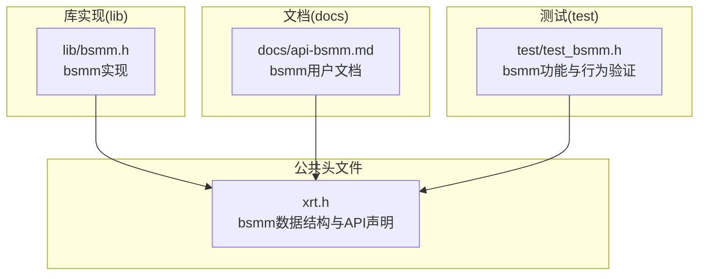
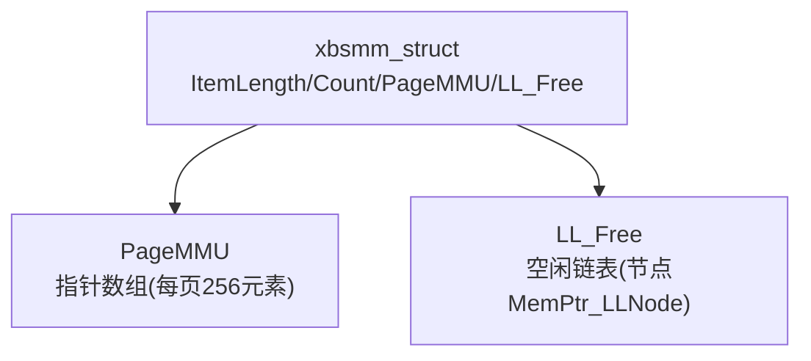
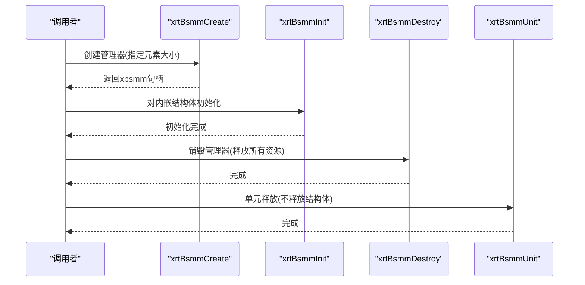
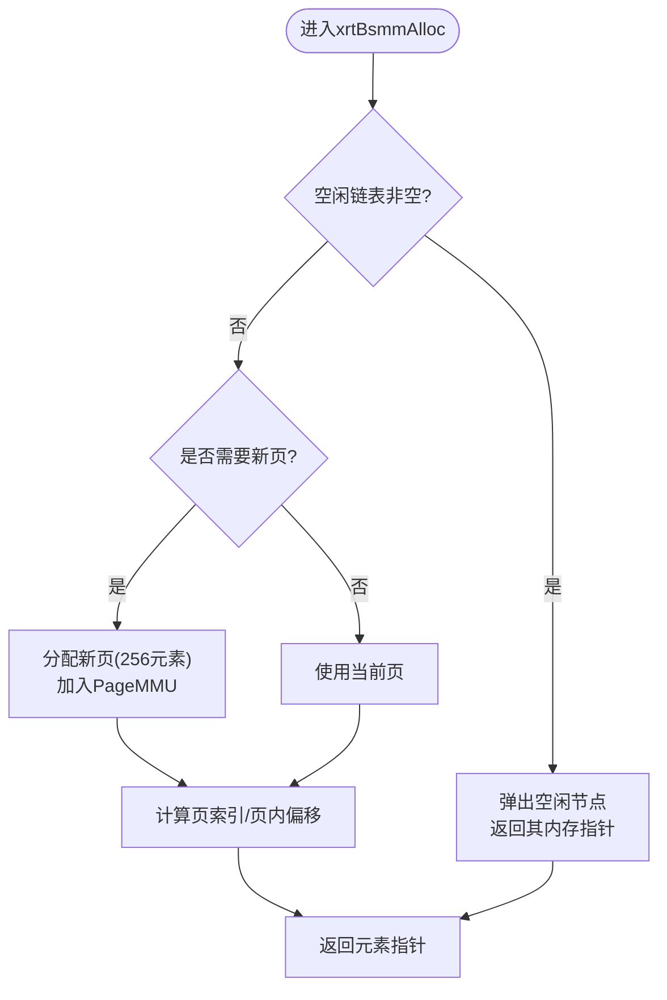
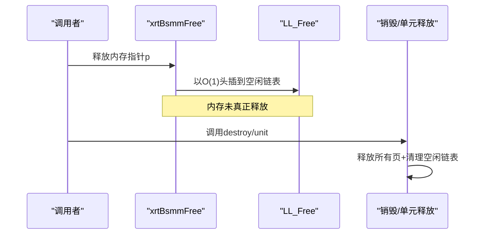
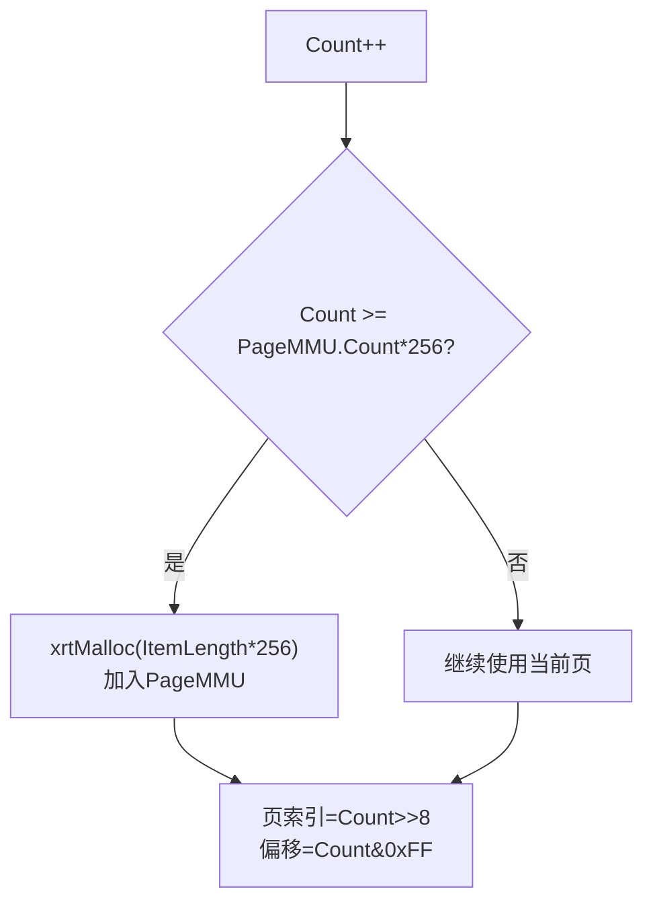
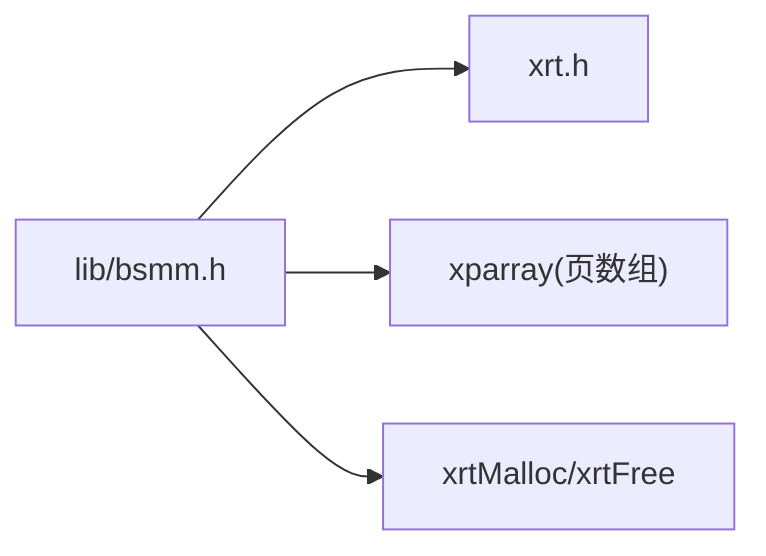

# 块结构内存管理模块(bsmm)

<cite>
**本文引用的文件**
- [lib/bsmm.h](file://lib/bsmm.h)
- [xrt.h](file://xrt.h)
- [docs/api-bsmm.md](file://docs/api-bsmm.md)
- [test/test_bsmm.h](file://test/test_bsmm.h)
</cite>

## 目录
1. [简介](#简介)
2. [项目结构](#项目结构)
3. [核心组件](#核心组件)
4. [架构总览](#架构总览)
5. [详细组件分析](#详细组件分析)
6. [依赖关系分析](#依赖关系分析)
7. [性能考量](#性能考量)
8. [故障排查指南](#故障排查指南)
9. [结论](#结论)
10. [附录](#附录)

## 简介
bsmm（Blocks Struct Memory Management）是一个面向“频繁分配与释放”的固定大小结构体内存池。其核心设计围绕“每页256元素”的分页管理与“空闲链表优先复用”两大机制展开，确保分配与释放均为O(1)，且无内存碎片。

- 关键特性
  - 每页256个元素，按需分配新页
  - 释放内存进入空闲链表，优先复用
  - O(1)分配/释放，无碎片
  - 适用于对象池、节点池等高频生命周期场景

- 适用场景
  - 游戏/实时系统中的临时对象池
  - 链表/树节点的快速分配与回收
  - 高并发下对吞吐敏感的短生命周期对象

## 项目结构
bsmm位于lib目录下，核心API声明在xrt.h中，配套文档在docs目录，测试样例在test目录。

**图表来源**
- [lib/bsmm.h](file://lib/bsmm.h#L1-L94)
- [xrt.h](file://xrt.h#L1209-L1252)
- [docs/api-bsmm.md](file://docs/api-bsmm.md#L1-L666)
- [test/test_bsmm.h](file://test/test_bsmm.h#L1-L434)

**章节来源**
- [lib/bsmm.h](file://lib/bsmm.h#L1-L94)
- [xrt.h](file://xrt.h#L1209-L1252)
- [docs/api-bsmm.md](file://docs/api-bsmm.md#L1-L666)
- [test/test_bsmm.h](file://test/test_bsmm.h#L1-L434)

## 核心组件
- 数据结构
  - MemPtr_LLNode：空闲内存指针单向链表节点（内部）
  - xbsmm_struct：bsmm管理器主体，包含元素大小、计数、页数组(PageMMU)、空闲链表(LL_Free)
- 生命周期管理
  - xrtBsmmCreate/xrtBsmmDestroy：创建/销毁管理器
  - xrtBsmmInit/xrtBsmmUnit：初始化/单元级释放（不释放管理器自身）
- 分配与回收
  - xrtBsmmAlloc：优先从空闲链表复用，否则从当前页或新增页分配
  - xrtBsmmFree：将内存指针压入空闲链表，延迟真正释放

**章节来源**
- [xrt.h](file://xrt.h#L1209-L1252)
- [lib/bsmm.h](file://lib/bsmm.h#L5-L91)
- [docs/api-bsmm.md](file://docs/api-bsmm.md#L48-L83)

## 架构总览
bsmm采用“页数组+空闲链表”的两级结构：
- 页数组(PageMMU)：每页固定256个元素，按需增长
- 空闲链表(LL_Free)：释放的元素指针以O(1)方式复用

**图表来源**
- [xrt.h](file://xrt.h#L1215-L1221)
- [lib/bsmm.h](file://lib/bsmm.h#L24-L49)

**章节来源**
- [xrt.h](file://xrt.h#L1215-L1221)
- [lib/bsmm.h](file://lib/bsmm.h#L24-L49)

## 详细组件分析

### 生命周期管理：创建/销毁与初始化/单元释放
- 创建与销毁
  - xrtBsmmCreate：分配管理器结构体并初始化
  - xrtBsmmDestroy：单元释放+释放管理器自身
- 初始化与单元释放
  - xrtBsmmInit：对内嵌结构体进行初始化
  - xrtBsmmUnit：释放页数组与空闲链表，保留管理器结构体

**图表来源**
- [lib/bsmm.h](file://lib/bsmm.h#L5-L21)
- [lib/bsmm.h](file://lib/bsmm.h#L24-L49)

**章节来源**
- [lib/bsmm.h](file://lib/bsmm.h#L5-L21)
- [lib/bsmm.h](file://lib/bsmm.h#L24-L49)

### 分配流程：空闲链表优先与按需扩页
- 优先策略：若空闲链表非空，直接弹出节点并返回对应内存
- 扩页条件：当已分配计数达到当前页数×256时，分配新页
- 计算定位：通过位运算快速计算页索引与页内偏移

**图表来源**
- [lib/bsmm.h](file://lib/bsmm.h#L52-L82)

**章节来源**
- [lib/bsmm.h](file://lib/bsmm.h#L52-L82)

### 回收流程：空闲链表复用与延迟释放
- xrtBsmmFree将指针封装为MemPtr_LLNode节点，插入LL_Free头部
- 真正释放发生在destroy/unit阶段

**图表来源**
- [lib/bsmm.h](file://lib/bsmm.h#L85-L91)
- [lib/bsmm.h](file://lib/bsmm.h#L33-L49)

**章节来源**
- [lib/bsmm.h](file://lib/bsmm.h#L85-L91)
- [lib/bsmm.h](file://lib/bsmm.h#L33-L49)

### PageMMU动态扩展机制
- 扩展触发：Count达到PageMMU.Count×256时分配新页
- 扩展粒度：每次新增一页，承载256个元素
- 索引规则：高位页索引、低位页内偏移，通过位运算快速定位

**图表来源**
- [lib/bsmm.h](file://lib/bsmm.h#L63-L81)

**章节来源**
- [lib/bsmm.h](file://lib/bsmm.h#L63-L81)

### 空闲链表高效复用策略
- 复用优先：分配时优先从LL_Free弹出节点，避免系统调用
- O(1)操作：头插/头删均摊O(1)，减少遍历成本
- 延迟释放：统一在destroy/unit阶段释放，降低碎片风险

**章节来源**
- [lib/bsmm.h](file://lib/bsmm.h#L54-L61)
- [lib/bsmm.h](file://lib/bsmm.h#L87-L91)

### 内存碎片最小化处理
- 固定大小：所有元素大小一致，天然无碎片
- 页内连续：同一页内元素地址连续，局部性好
- 释放即复用：避免长期持有导致的外部碎片

**章节来源**
- [docs/api-bsmm.md](file://docs/api-bsmm.md#L25-L31)

### 高并发场景下的性能表现分析
- 优势
  - 分配/释放O(1)，锁竞争低
  - 空闲链表复用减少系统调用
  - 页内顺序分配，缓存友好
- 注意事项
  - 多线程下需自行加锁保护
  - 避免跨线程传递已释放指针
  - 控制元素大小以适配CPU缓存行

**章节来源**
- [docs/api-bsmm.md](file://docs/api-bsmm.md#L25-L31)

### 内存使用模式优化建议
- 选择合适场景：高频创建销毁的固定大小对象
- 复用管理器：避免反复创建/销毁管理器
- 避免悬挂指针：释放后及时置空或重新分配
- 合理预估容量：减少扩页次数

**章节来源**
- [docs/api-bsmm.md](file://docs/api-bsmm.md#L586-L647)

### 常见问题与解决方案
- 问题：分配失败
  - 可能原因：内存不足或页数组追加失败
  - 解决：检查系统可用内存与ItemLength
- 问题：重复释放
  - 可能原因：同一指针多次free
  - 解决：确保唯一释放路径
- 问题：悬挂指针访问
  - 可能原因：释放后继续使用原指针
  - 解决：释放后置空或立即复用

**章节来源**
- [lib/bsmm.h](file://lib/bsmm.h#L65-L73)
- [docs/api-bsmm.md](file://docs/api-bsmm.md#L619-L647)

### 实际使用示例（最佳实践）
- 对象池模式：创建管理器，循环分配/释放，最后统一销毁
- 链表/树节点：使用内嵌管理器，避免全局管理器带来的锁争用
- 性能基准：参考测试用例对分配/释放/复用行为的验证

**章节来源**
- [test/test_bsmm.h](file://test/test_bsmm.h#L12-L434)
- [docs/api-bsmm.md](file://docs/api-bsmm.md#L374-L568)

## 依赖关系分析
bsmm依赖于指针数组xparray（PageMMU）与基础内存分配接口xrtMalloc/xrtFree；其内部还依赖MemPtr_LLNode作为空闲链表节点。

**图表来源**
- [lib/bsmm.h](file://lib/bsmm.h#L1-L94)
- [xrt.h](file://xrt.h#L1209-L1252)

**章节来源**
- [lib/bsmm.h](file://lib/bsmm.h#L1-L94)
- [xrt.h](file://xrt.h#L1209-L1252)

## 性能考量
- 时间复杂度
  - 分配/释放：O(1)
  - 扩页：摊销O(1)，因按256元素步长增长
- 空间复杂度
  - 额外开销：空闲链表节点与页数组指针
- 缓存与局部性
  - 页内顺序分配，提升缓存命中
- 并发与锁
  - bsmm本身无内置锁，需应用层加锁

[本节为通用性能讨论，无需特定文件引用]

## 故障排查指南
- 现象：分配返回NULL
  - 排查：确认ItemLength合理、系统内存充足
- 现象：复用后数据异常
  - 排查：确认未在释放后继续使用原指针
- 现象：内存泄漏
  - 排查：确保调用xrtBsmmDestroy或xrtBsmmUnit释放所有资源

**章节来源**
- [lib/bsmm.h](file://lib/bsmm.h#L65-L73)
- [lib/bsmm.h](file://lib/bsmm.h#L33-L49)
- [docs/api-bsmm.md](file://docs/api-bsmm.md#L619-L647)

## 结论
bsmm通过“每页256元素”与“空闲链表复用”实现了极简高效的固定大小结构体内存池。其O(1)分配/释放与无碎片特性，使其非常适合高频生命周期对象的场景。在高并发环境下，应结合业务加锁策略与合理的元素大小设计，以获得最佳性能与稳定性。

[本节为总结性内容，无需特定文件引用]

## 附录
- API速查
  - 创建/销毁：xrtBsmmCreate/xrtBsmmDestroy
  - 初始化/单元释放：xrtBsmmInit/xrtBsmmUnit
  - 分配/释放：xrtBsmmAlloc/xrtBsmmFree
  - 按索引访问（不推荐常规使用）：xrtBsmmGetPtr_Inline

**章节来源**
- [docs/api-bsmm.md](file://docs/api-bsmm.md#L86-L372)
- [xrt.h](file://xrt.h#L1224-L1252)