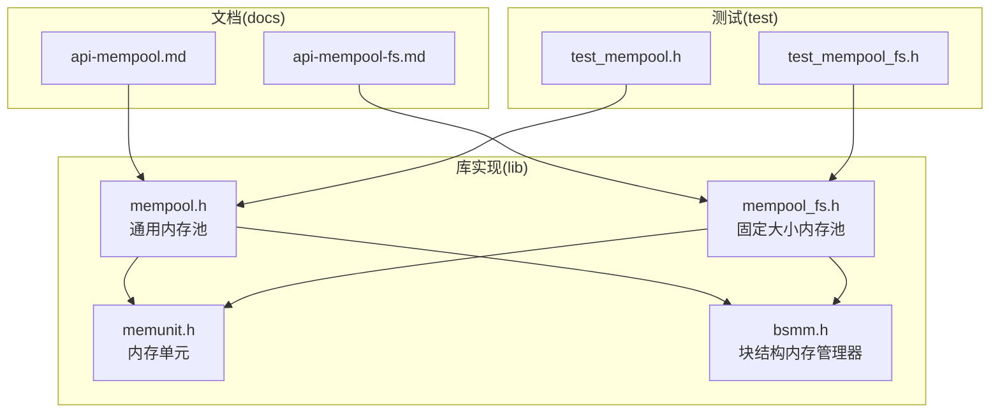
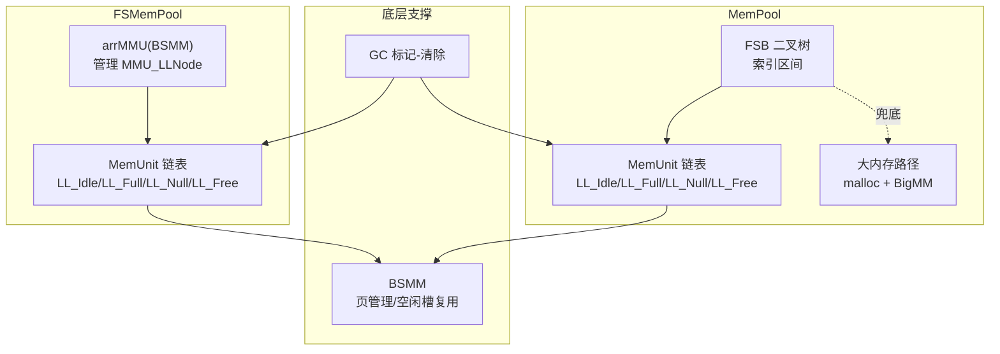
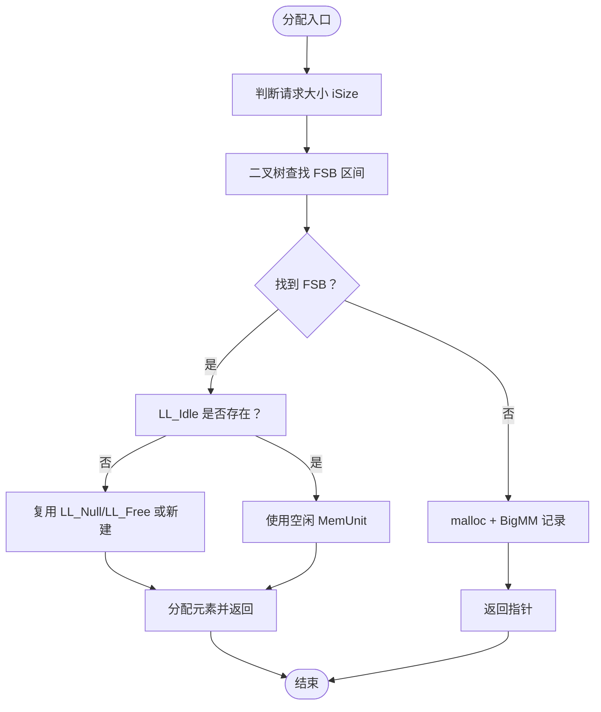
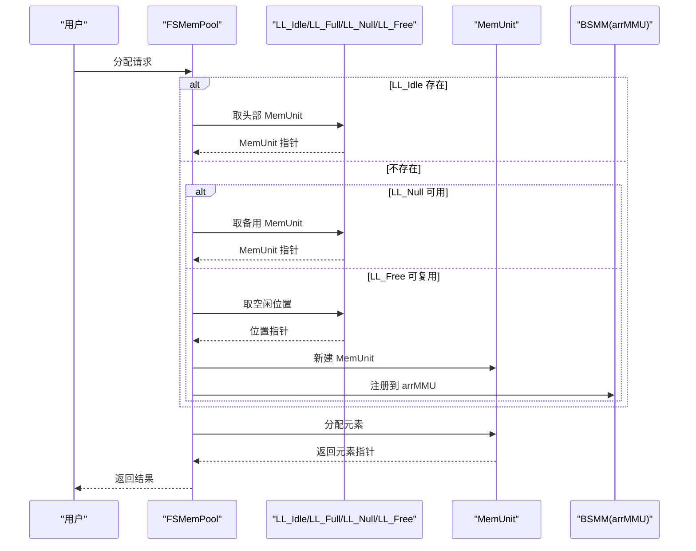
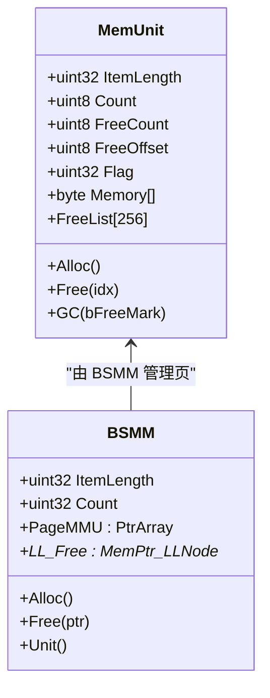
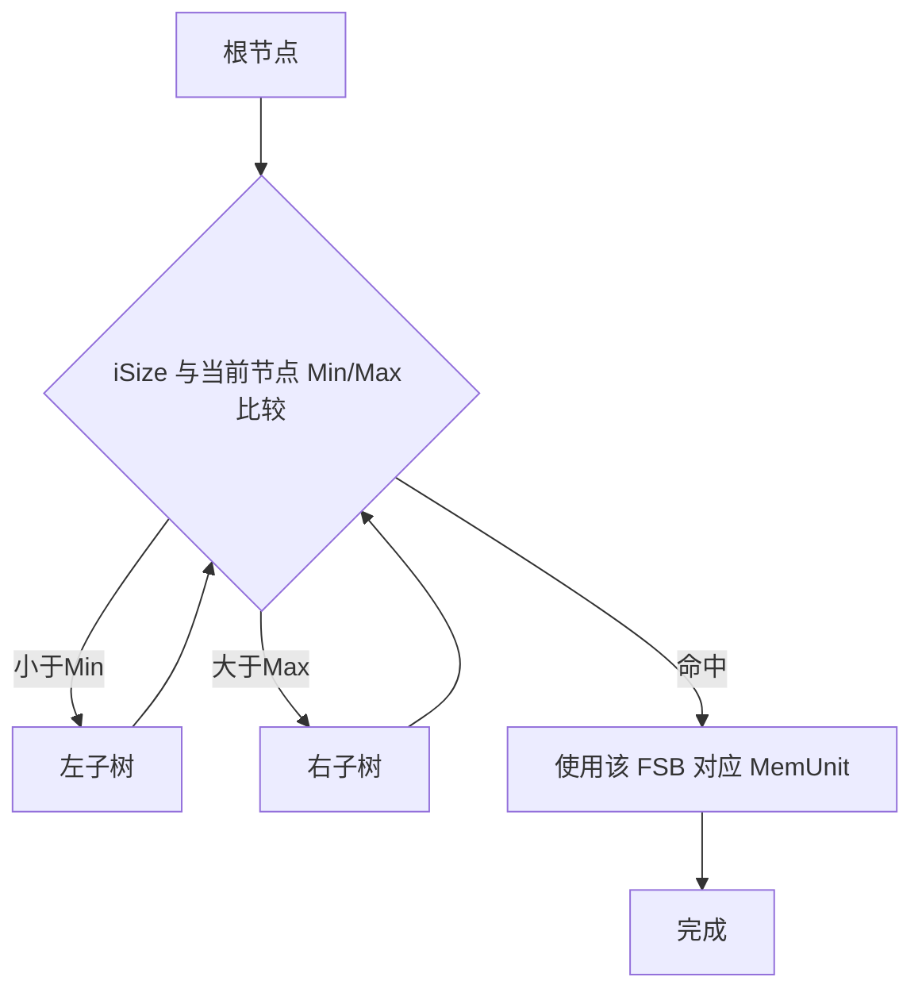
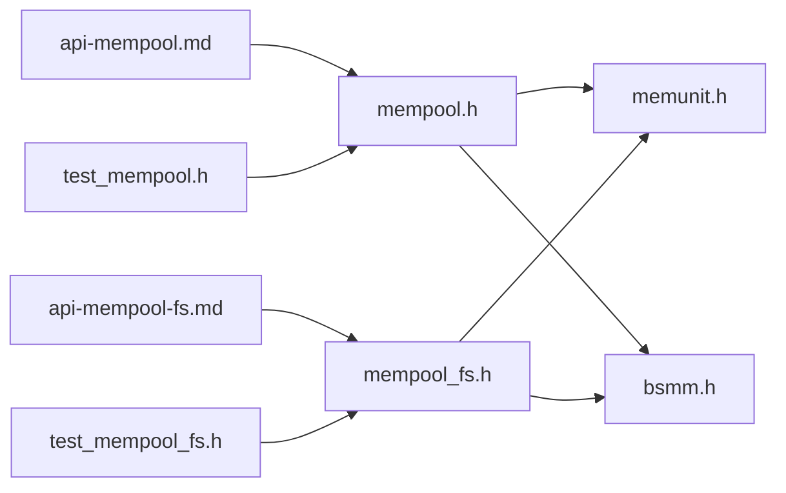

# 通用内存池模块(mempool)

<cite>
**本文档引用的文件**
- [lib/mempool.h](file://lib/mempool.h)
- [lib/mempool_fs.h](file://lib/mempool_fs.h)
- [lib/memunit.h](file://lib/memunit.h)
- [lib/bsmm.h](file://lib/bsmm.h)
- [docs/api-mempool.md](file://docs/api-mempool.md)
- [docs/api-mempool-fs.md](file://docs/api-mempool-fs.md)
- [test/test_mempool.h](file://test/test_mempool.h)
- [test/test_mempool_fs.h](file://test/test_mempool_fs.h)
</cite>

## 目录
1. [简介](#简介)
2. [项目结构](#项目结构)
3. [核心组件](#核心组件)
4. [架构总览](#架构总览)
5. [详细组件分析](#详细组件分析)
6. [依赖关系分析](#依赖关系分析)
7. [性能考量](#性能考量)
8. [故障排查指南](#故障排查指南)
9. [结论](#结论)
10. [附录](#附录)

## 简介
本文件系统化阐述 XRT 库中的通用内存池模块（MemPool）与固定大小内存池（FSMemPool）的设计与实现，重点覆盖：
- 二叉树索引 FSB（Free Storage Block）的内存管理算法：索引策略、查找路径与分配优化
- 多级分块管理：小/中/大内存的分类与兜底策略、碎片控制与利用率优化
- 动态调整机制：内存池大小自适应扩展、内存压力检测与回收策略
- 性能分析与监控：性能指标、使用模式观测与大规模应用最佳实践
- 实战案例与调优经验：复杂场景下的使用建议与性能优化技巧

## 项目结构
- lib 目录提供核心实现：mempool.h、mempool_fs.h、memunit.h、bsmm.h
- docs 目录提供官方 API 文档：api-mempool.md、api-mempool-fs.md
- test 目录提供功能与压力测试：test_mempool.h、test_mempool_fs.h

**图表来源**
- [lib/mempool.h](file://lib/mempool.h#L1-L468)
- [lib/mempool_fs.h](file://lib/mempool_fs.h#L1-L257)
- [lib/memunit.h](file://lib/memunit.h#L1-L143)
- [lib/bsmm.h](file://lib/bsmm.h#L1-L94)
- [docs/api-mempool.md](file://docs/api-mempool.md#L1-L996)
- [docs/api-mempool-fs.md](file://docs/api-mempool-fs.md#L1-L735)
- [test/test_mempool.h](file://test/test_mempool.h#L1-L187)
- [test/test_mempool_fs.h](file://test/test_mempool_fs.h#L1-L832)

**章节来源**
- [lib/mempool.h](file://lib/mempool.h#L1-L468)
- [lib/mempool_fs.h](file://lib/mempool_fs.h#L1-L257)
- [lib/memunit.h](file://lib/memunit.h#L1-L143)
- [lib/bsmm.h](file://lib/bsmm.h#L1-L94)
- [docs/api-mempool.md](file://docs/api-mempool.md#L1-L996)
- [docs/api-mempool-fs.md](file://docs/api-mempool-fs.md#L1-L735)
- [test/test_mempool.h](file://test/test_mempool.h#L1-L187)
- [test/test_mempool_fs.h](file://test/test_mempool_fs.h#L1-L832)

## 核心组件
- 通用内存池（MemPool）
  - 支持可变大小分配，基于 FSB 二叉树索引与 MemUnit 管理
  - 提供 iCustom=1/2 的预设方案（小/大内存区间），超出范围使用大内存路径
  - 支持 GC 标记-清除回收
- 固定大小内存池（FSMemPool）
  - 针对固定大小对象的高性能池化分配，无 256 限制
  - 四链表管理（Idle/Full/Null/Free）避免临界状态抖动
  - 支持 GC 标记-清除回收
- 内存单元（MemUnit）
  - 每个单元固定容纳 256 个槽位，采用位移/掩码记录归属与索引
  - 提供 O(1) 分配与释放，支持 GC
- 块结构内存管理器（BSMM）
  - 管理大型内存页（每页 256 项），按需扩容，支持空闲槽位复用

**章节来源**
- [lib/mempool.h](file://lib/mempool.h#L35-L119)
- [lib/mempool_fs.h](file://lib/mempool_fs.h#L24-L49)
- [lib/memunit.h](file://lib/memunit.h#L5-L86)
- [lib/bsmm.h](file://lib/bsmm.h#L24-L91)

## 架构总览
MemPool 与 FSMemPool 均以“二叉树索引 + 内存单元”为核心，辅以 BSMM 管理底层页与链表复用，形成“小中大三层”的内存管理闭环。

**图表来源**
- [lib/mempool.h](file://lib/mempool.h#L148-L261)
- [lib/mempool_fs.h](file://lib/mempool_fs.h#L52-L125)
- [lib/memunit.h](file://lib/memunit.h#L89-L140)
- [lib/bsmm.h](file://lib/bsmm.h#L52-L91)

## 详细组件分析

### 组件一：通用内存池（MemPool）——二叉树索引与分配优化
- FSB 二叉树索引
  - 通过 MinLength/MaxLength 划分子树，查找复杂度 O(log n)
  - 预设 iCustom=1（4 层树，1-512B）、iCustom=2（5 层树，1-4096B）
- 分配路径
  - 小于等于最大长度：从对应 FSB 的 MemUnit 分配，O(1)
  - 超出范围：malloc + BigMM 记录，便于后续 GC
- 四链表管理
  - LL_Idle：有空闲槽位的 MemUnit（优先分配）
  - LL_Full：已满的 MemUnit（不分配）
  - LL_Null：全空 MemUnit（最多 1 个，备用）
  - LL_Free：已释放的 MemUnit 位置（复用 Flag）
- 动态调整
  - 空闲 MemUnit 即将满载时迁移至 Full
  - 清空 MemUnit 时进入 Null 或 Free，避免临界状态反复创建/销毁
- GC 回收
  - 遍历 Idle/Full，标记后回收未标记内存；再次分类归位

**图表来源**
- [lib/mempool.h](file://lib/mempool.h#L148-L261)
- [lib/mempool.h](file://lib/mempool.h#L264-L385)

**章节来源**
- [lib/mempool.h](file://lib/mempool.h#L35-L119)
- [lib/mempool.h](file://lib/mempool.h#L148-L261)
- [lib/mempool.h](file://lib/mempool.h#L264-L385)
- [docs/api-mempool.md](file://docs/api-mempool.md#L36-L80)

### 组件二：固定大小内存池（FSMemPool）——无限容量与 O(1) 分配
- 设计要点
  - 每个 MemUnit 固定 256 个槽位，无 256 限制
  - 通过 arrMMU（BSMM）管理 MMU_LLNode 数组，按需扩容
  - 四链表管理避免抖动，提升吞吐
- 分配与释放
  - 优先从 LL_Idle 头部分配
  - 释放后若空闲则归位 Null/Free，满载则迁移到 Full
- GC 回收
  - 遍历 Idle/Full，按标记回收并重新分类

**图表来源**
- [lib/mempool_fs.h](file://lib/mempool_fs.h#L52-L125)
- [lib/mempool_fs.h](file://lib/mempool_fs.h#L128-L221)
- [lib/bsmm.h](file://lib/bsmm.h#L52-L91)

**章节来源**
- [lib/mempool_fs.h](file://lib/mempool_fs.h#L24-L49)
- [lib/mempool_fs.h](file://lib/mempool_fs.h#L52-L125)
- [lib/mempool_fs.h](file://lib/mempool_fs.h#L128-L221)
- [lib/bsmm.h](file://lib/bsmm.h#L24-L91)
- [docs/api-mempool-fs.md](file://docs/api-mempool-fs.md#L36-L72)

### 组件三：内存单元（MemUnit）与块结构内存管理器（BSMM）
- MemUnit
  - 每单元 256 槽位，使用 FreeList+FreeOffset 实现 O(1) 复用
  - 通过 Flag 高位携带 MemUnit 编号与元素索引，释放时定位归属
- BSMM
  - 每页 256 项，按需分配内存页
  - 空闲槽位链表复用，降低碎片与系统调用频率

**图表来源**
- [lib/memunit.h](file://lib/memunit.h#L5-L86)
- [lib/memunit.h](file://lib/memunit.h#L89-L140)
- [lib/bsmm.h](file://lib/bsmm.h#L24-L91)

**章节来源**
- [lib/memunit.h](file://lib/memunit.h#L5-L86)
- [lib/memunit.h](file://lib/memunit.h#L89-L140)
- [lib/bsmm.h](file://lib/bsmm.h#L24-L91)

### 组件四：FSB 二叉树索引策略与查找算法
- 索引策略
  - 每个 FSB_item 维护 MinLength/MaxLength，形成二叉搜索树
  - 插入顺序优化避免旋转，保证查找效率
- 查找算法
  - 从根节点出发，依据 iSize 与 Min/Max 比较决定左右分支
  - 命中区间即为目标 FSB，否则走大内存路径
- 分配优化
  - 优先使用 LL_Idle，满载迁移至 LL_Full
  - 清空时进入 LL_Null（若已有备用）或 LL_Free，避免频繁创建/销毁

**图表来源**
- [lib/mempool.h](file://lib/mempool.h#L152-L161)
- [lib/mempool.h](file://lib/mempool.h#L164-L233)

**章节来源**
- [lib/mempool.h](file://lib/mempool.h#L24-L119)
- [lib/mempool.h](file://lib/mempool.h#L152-L161)
- [lib/mempool.h](file://lib/mempool.h#L164-L233)

### 组件五：多级分块管理与碎片控制
- 分类管理
  - 小内存：FSB 二叉树 + MemUnit（低碎片、高局部性）
  - 中等内存：FSB 区间覆盖（减少系统调用）
  - 大内存：malloc + BigMM 记录，避免频繁小块碎片
- 碎片控制
  - 四链表避免临界状态反复创建/销毁
  - 大内存统一管理，便于集中回收
- 利用率优化
  - MemUnit 固定 256 槽位，减少外部碎片
  - BSMM 按页分配，降低系统调用次数

**章节来源**
- [lib/mempool.h](file://lib/mempool.h#L35-L119)
- [lib/mempool_fs.h](file://lib/mempool_fs.h#L24-L49)
- [lib/bsmm.h](file://lib/bsmm.h#L52-L91)

### 组件六：动态调整机制与回收策略
- 动态调整
  - MemUnit 满载迁移至 Full，空闲迁移至 Idle
  - 清空 MemUnit 进入 Null（若已有备用）或 Free，避免抖动
- 回收策略
  - GC 遍历 Idle/Full，按标记回收未标记内存
  - 重新分类：空闲归位 Idle，清空归 Null/Free
- 内存压力检测
  - 通过 arrMMU.Count、BigMM.Count 观察池化规模
  - 通过 FreeCount/FreeOffset 评估复用效率

**章节来源**
- [lib/mempool.h](file://lib/mempool.h#L264-L385)
- [lib/mempool_fs.h](file://lib/mempool_fs.h#L128-L221)
- [lib/memunit.h](file://lib/memunit.h#L89-L140)

## 依赖关系分析
- MemPool 依赖
  - mempool.h 依赖 memunit.h（MemUnit 操作）、bsmm.h（页管理）
  - FSB 二叉树 + 四链表 + BigMM 共同构成分配与回收闭环
- FSMemPool 依赖
  - mempool_fs.h 依赖 memunit.h、bsmm.h
  - arrMMU（BSMM）管理 MMU_LLNode，实现无限容量扩展
- 文档与测试
  - api-mempool.md 与 api-mempool-fs.md 提供接口与使用说明
  - test_mempool.h/test_mempool_fs.h 提供功能验证与压力测试

**图表来源**
- [lib/mempool.h](file://lib/mempool.h#L1-L468)
- [lib/mempool_fs.h](file://lib/mempool_fs.h#L1-L257)
- [lib/memunit.h](file://lib/memunit.h#L1-L143)
- [lib/bsmm.h](file://lib/bsmm.h#L1-L94)
- [docs/api-mempool.md](file://docs/api-mempool.md#L1-L996)
- [docs/api-mempool-fs.md](file://docs/api-mempool-fs.md#L1-L735)
- [test/test_mempool.h](file://test/test_mempool.h#L1-L187)
- [test/test_mempool_fs.h](file://test/test_mempool_fs.h#L1-L832)

**章节来源**
- [lib/mempool.h](file://lib/mempool.h#L1-L468)
- [lib/mempool_fs.h](file://lib/mempool_fs.h#L1-L257)
- [lib/memunit.h](file://lib/memunit.h#L1-L143)
- [lib/bsmm.h](file://lib/bsmm.h#L1-L94)
- [docs/api-mempool.md](file://docs/api-mempool.md#L1-L996)
- [docs/api-mempool-fs.md](file://docs/api-mempool-fs.md#L1-L735)
- [test/test_mempool.h](file://test/test_mempool.h#L1-L187)
- [test/test_mempool_fs.h](file://test/test_mempool_fs.h#L1-L832)

## 性能考量
- 时间复杂度
  - FSB 查找：O(log n)
  - MemUnit 分配/释放：O(1)
  - GC 遍历：O(k)，k 为活跃 MemUnit 数
- 空间复杂度
  - MemUnit 固定 256 槽位，BSMM 按需增长
- 优化建议
  - 优先使用 FSMemPool 处理固定大小对象，获得更佳吞吐
  - 合理设置 iCustom，使常见尺寸落在 FSB 区间内
  - 定期执行 GC，清理未使用对象，维持低碎片
  - 批量分配/释放，减少链表迁移与页扩容

[本节为通用指导，无需列出具体文件来源]

## 故障排查指南
- 常见问题
  - 跨池释放：释放指针不属于当前池，导致定位错误
  - 未标记对象：GC 前未正确标记，导致误回收
  - 池耗尽：FSMemPool 对象数量超过 256 时仍需通过 arrMMU 扩容
- 排查步骤
  - 检查 ItemFlag 高位是否指向正确 MemUnit
  - 确认 GC 标记流程：Mark → Sweep → 清除标记
  - 关注 arrMMU.Count 与 BigMM.Count，评估池化规模
- 测试参考
  - 使用 test_mempool.h/test_mempool_fs.h 验证分配/释放/GC 行为

**章节来源**
- [test/test_mempool.h](file://test/test_mempool.h#L1-L187)
- [test/test_mempool_fs.h](file://test/test_mempool_fs.h#L1-L832)
- [lib/mempool.h](file://lib/mempool.h#L335-L385)
- [lib/mempool_fs.h](file://lib/mempool_fs.h#L199-L221)

## 结论
XRT 的 mempool 与 fsmempool 通过“二叉树索引 + MemUnit + BSMM”的组合，实现了高效、低碎片、可扩展的内存管理。MemPool 面向可变尺寸，FSMemPool 面向固定尺寸对象池化，两者配合可覆盖广泛的应用场景。结合 GC 与四链表策略，可在高并发下保持稳定性能与良好内存利用率。

[本节为总结性内容，无需列出具体文件来源]

## 附录

### 使用场景与最佳实践
- 多类型对象分配：利用 MemPool 的可变尺寸特性，按需分配
- JSON 解析器：节点与字符串分别管理，统一销毁
- 带 GC 的脚本引擎：对象标记与回收周期化执行
- 高频对象池：优先选择 FSMemPool，避免 256 限制
- 避免跨池释放，确保释放指针属于原分配池
- 批量操作：预分配与顺序释放，减少链表迁移

**章节来源**
- [docs/api-mempool.md](file://docs/api-mempool.md#L613-L715)
- [docs/api-mempool-fs.md](file://docs/api-mempool-fs.md#L438-L702)

### 性能分析与监控
- 指标建议
  - 分配/释放延迟分布
  - MemUnit 空闲率（FreeCount/256）
  - arrMMU.Count 与 BigMM.Count 变化趋势
  - GC 回收比例与周期
- 工具与方法
  - 使用测试样例统计分配/释放耗时
  - 观察链表状态变化，定位瓶颈
  - 在大规模应用中定期评估碎片与回收成本

**章节来源**
- [test/test_mempool_fs.h](file://test/test_mempool_fs.h#L507-L531)
- [test/test_mempool_fs.h](file://test/test_mempool_fs.h#L598-L668)