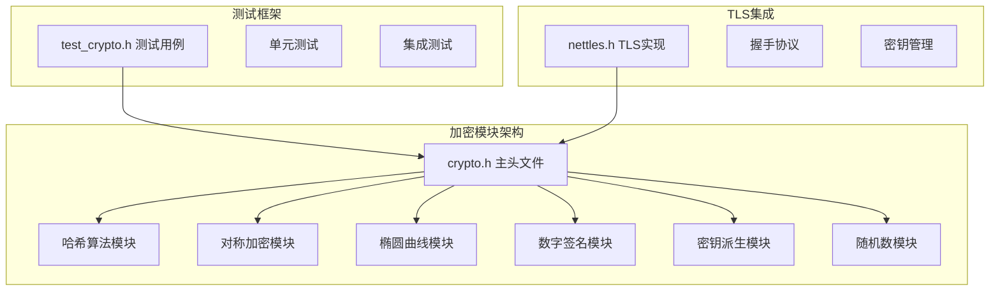
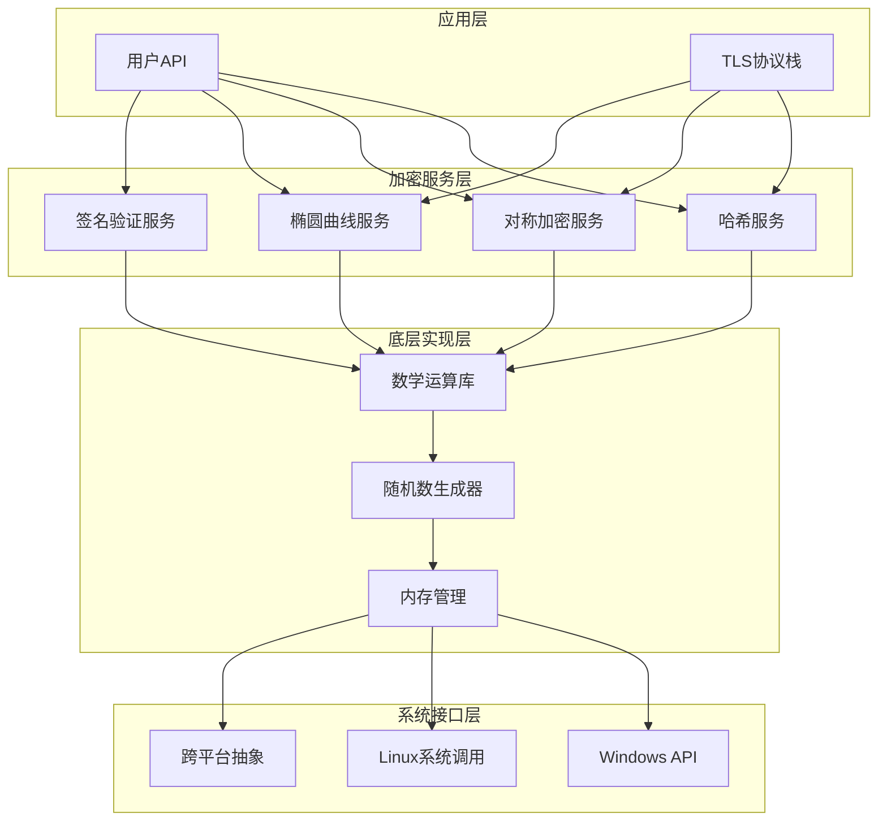
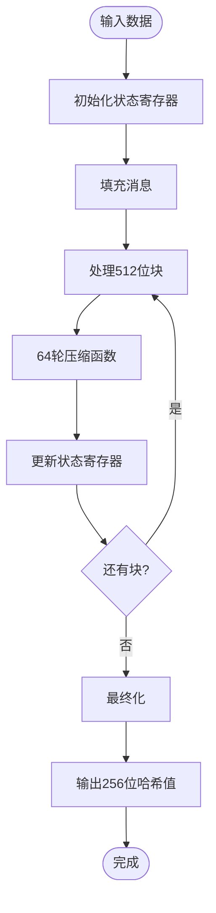
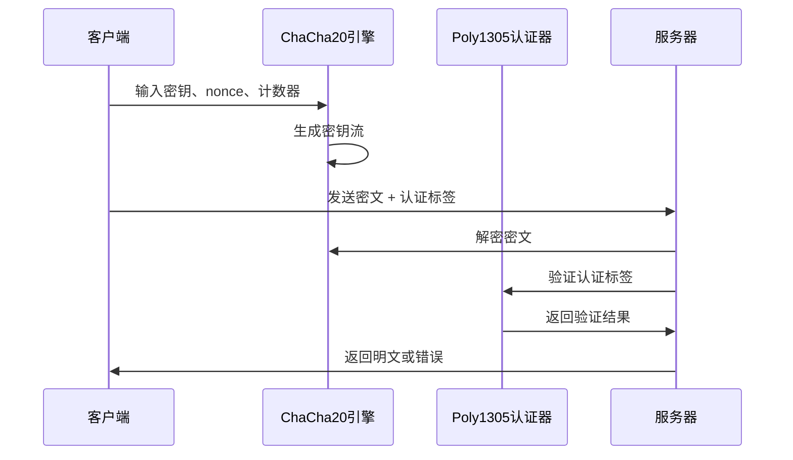
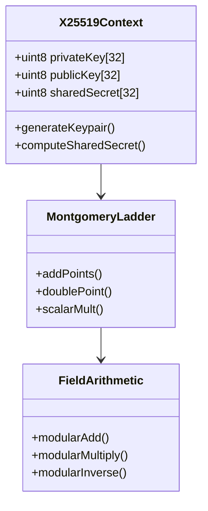
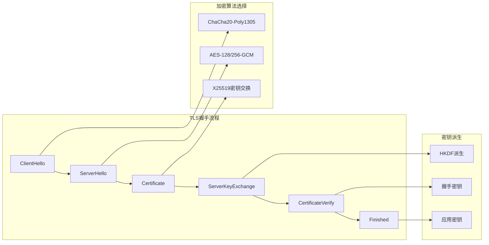
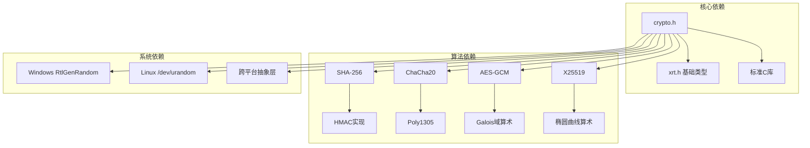

# 加密模块

<cite>
**本文档引用的文件**
- [crypto.h](file://lib/crypto.h)
- [test_crypto.h](file://test/test_crypto.h)
- [xrt.h](file://xrt.h)
- [nettls.h](file://lib/nettls.h)
</cite>

## 目录
1. [简介](#简介)
2. [项目结构](#项目结构)
3. [核心组件](#核心组件)
4. [架构概览](#架构概览)
5. [详细组件分析](#详细组件分析)
6. [依赖关系分析](#依赖关系分析)
7. [性能考虑](#性能考虑)
8. [故障排除指南](#故障排除指南)
9. [结论](#结论)

## 简介

XRT加密模块是一个功能完整的加密算法库，提供了现代密码学所需的核心功能。该模块采用纯C语言实现，不依赖任何外部加密库，完全自包含。

主要特性包括：
- **哈希算法**：SHA-256、SHA-384、SHA-512及其HMAC变体
- **对称加密**：ChaCha20-Poly1305 AEAD、AES-128/256-GCM
- **椭圆曲线密码学**：X25519密钥交换、secp256r1椭圆曲线
- **数字签名**：RSA-PSS、RSA-PKCS1、ECDSA签名验证
- **密钥派生**：HKDF-SHA256、HKDF-SHA384
- **随机数生成**：跨平台安全随机数生成

## 项目结构

加密模块位于XRT项目的核心库中，采用模块化设计：

**图表来源**
- [crypto.h](file://lib/crypto.h#L1-L50)
- [test_crypto.h](file://test/test_crypto.h#L1-L20)
- [nettles.h](file://lib/nettls.h#L1-L50)

**章节来源**
- [crypto.h](file://lib/crypto.h#L1-L100)
- [xrt.h](file://xrt.h#L1-L100)

## 核心组件

### 哈希算法模块

加密模块实现了完整的哈希算法族，包括SHA家族的各种变体：

#### SHA-256实现
- **算法特性**：基于Brad Conte的公共领域实现
- **性能优化**：使用常量时间实现，支持流式处理
- **应用场景**：消息摘要、数据完整性校验

#### SHA-512/SHA-384实现
- **算法特性**：支持64位字长，提供更高安全性
- **内存布局**：复用xsha512_ctx上下文结构
- **兼容性**：SHA-384作为SHA-512的截断版本

#### HMAC实现
- **通用接口**：支持SHA-256、SHA-384、SHA-512
- **安全特性**：常量时间比较，防止侧信道攻击
- **密钥处理**：自动处理密钥长度超过块大小的情况

**章节来源**
- [crypto.h](file://lib/crypto.h#L20-L175)
- [crypto.h](file://lib/crypto.h#L215-L481)

### 对称加密模块

#### ChaCha20-Poly1305 AEAD
- **算法标准**：符合RFC 8439规范
- **性能优势**：硬件无关，适合移动设备
- **安全特性**：同时提供保密性和完整性保护
- **实现细节**：包含Poly1305认证标签生成

#### AES-GCM实现
- **算法支持**：AES-128-GCM和AES-256-GCM
- **性能优化**：使用GF(2^128)域算术
- **密钥管理**：支持12字节随机IV
- **错误处理**：常量时间标签验证

**章节来源**
- [crypto.h](file://lib/crypto.h#L485-L861)
- [crypto.h](file://lib/crypto.h#L865-L1412)

### 椭圆曲线密码学

#### X25519密钥交换
- **算法标准**：基于RFC 7748的Curve25519
- **实现特点**：使用Montgomery ladder算法
- **安全性**：抵抗侧信道攻击
- **性能优化**：32位无符号整数运算

#### secp256r1椭圆曲线
- **标准支持**：NIST P-256曲线
- **坐标系统**：Jacobian坐标系提高效率
- **算术运算**：完整的模p和模n算术
- **应用场景**：ECDH密钥交换和ECDSA签名

**章节来源**
- [crypto.h](file://lib/crypto.h#L1615-L1876)
- [crypto.h](file://lib/crypto.h#L2715-L3310)

### 数字签名模块

#### RSA签名验证
- **算法支持**：RSA-PSS和RSA-PKCS1 v1.5
- **哈希集成**：支持SHA-256、SHA-384、SHA-512
- **实现特点**：使用axTLS大整数库
- **安全保证**：常量时间比较

#### ECDSA签名验证
- **曲线支持**：secp256r1椭圆曲线
- **DER编码**：完整的ASN.1 DER解析
- **验证流程**：双点加法和标量乘法

**章节来源**
- [crypto.h](file://lib/crypto.h#L2470-L2711)
- [crypto.h](file://lib/crypto.h#L3225-L3310)

### 密钥派生模块

#### HKDF实现
- **标准符合**：RFC 5869 HMAC-based Key Derivation Function
- **哈希支持**：SHA-256和SHA-384变体
- **扩展功能**：可配置盐值和信息参数
- **应用场景**：从主密钥派生会话密钥

**章节来源**
- [crypto.h](file://lib/crypto.h#L1462-L1611)

### 随机数模块

#### 跨平台随机数
- **Windows实现**：使用RtlGenRandom系统函数
- **Linux实现**：读取/dev/urandom设备
- **回退机制**：内置PCG随机数生成器
- **安全保证**：符合加密安全随机数要求

**章节来源**
- [crypto.h](file://lib/crypto.h#L1416-L1458)

## 架构概览

加密模块采用分层架构设计，确保模块间的松耦合和高内聚：

**图表来源**
- [crypto.h](file://lib/crypto.h#L1-L50)
- [nettles.h](file://lib/nettls.h#L1-L100)

## 详细组件分析

### SHA-256算法实现

SHA-256是加密模块的核心组件之一，实现了完整的SHA-256哈希算法：

**图表来源**
- [crypto.h](file://lib/crypto.h#L52-L167)

#### 关键实现特性
- **常量时间实现**：避免分支预测攻击
- **流式处理**：支持任意长度数据的分块处理
- **内存优化**：最小化内存占用和缓存失效
- **性能优化**：使用内联函数和编译器优化

**章节来源**
- [crypto.h](file://lib/crypto.h#L52-L167)

### ChaCha20-Poly1305实现

ChaCha20-Poly1305是现代AEAD加密的标准选择：

**图表来源**
- [crypto.h](file://lib/crypto.h#L794-L861)

#### 安全特性
- **AEAD模式**：同时提供保密性和完整性
- **常量时间**：标签验证使用常量时间算法
- **随机性**：12字节随机nonce确保唯一性
- **性能**：硬件无关的高性能实现

**章节来源**
- [crypto.h](file://lib/crypto.h#L794-L861)

### X25519密钥交换

X25519实现了基于Curve25519的密钥交换协议：

**图表来源**
- [crypto.h](file://lib/crypto.h#L1615-L1876)

#### 算法优势
- **安全性**：抵抗侧信道攻击和弱密钥攻击
- **性能**：Montgomery ladder算法提供常量时间执行
- **标准化**：符合RFC 7748标准
- **实现优化**：使用32位无符号整数运算

**章节来源**
- [crypto.h](file://lib/crypto.h#L1615-L1876)

### TLS协议集成

加密模块深度集成了TLS 1.3和TLS 1.2协议：

**图表来源**
- [nettles.h](file://lib/nettls.h#L853-L1164)

**章节来源**
- [nettles.h](file://lib/nettls.h#L853-L1164)

## 依赖关系分析

加密模块的设计遵循低耦合高内聚的原则：

**图表来源**
- [crypto.h](file://lib/crypto.h#L1-L50)
- [xrt.h](file://xrt.h#L83-L138)

### 内部依赖关系

加密模块内部的组件间依赖关系清晰明确：

- **基础类型依赖**：所有算法实现都依赖xrt.h中的基础类型定义
- **数学运算依赖**：椭圆曲线算法依赖通用的模算术实现
- **随机数依赖**：所有需要随机性的算法都依赖统一的随机数生成器
- **内存管理依赖**：使用XRT框架的内存管理函数

**章节来源**
- [crypto.h](file://lib/crypto.h#L1-L50)
- [xrt.h](file://xrt.h#L170-L230)

## 性能考虑

加密模块在设计时充分考虑了性能优化：

### 算法性能优化

| 算法 | 性能特点 | 适用场景 |
|------|----------|----------|
| SHA-256 | 常量时间实现，流水线友好 | 消息摘要，完整性校验 |
| ChaCha20 | 硬件无关，SIMD友好 | 移动设备，嵌入式系统 |
| AES-GCM | 硬件AES加速支持 | 服务器，高性能应用 |
| X25519 | Montgomery ladder算法 | 密钥交换，TLS连接 |

### 内存使用优化

- **零拷贝设计**：尽量减少数据复制操作
- **流式处理**：支持任意大小数据的分块处理
- **内存池管理**：使用XRT框架的内存池减少分配开销

### 并发安全性

- **线程安全**：所有公共API都是线程安全的
- **无状态算法**：SHA-256等算法无内部状态
- **状态隔离**：每个上下文都有独立的状态存储

## 故障排除指南

### 常见问题诊断

#### 加密算法测试失败

当遇到加密算法测试失败时，可以按照以下步骤排查：

1. **检查输入数据**：确认测试向量的正确性
2. **验证算法实现**：对比标准算法规范
3. **检查边界条件**：测试空输入、超长输入等边界情况

#### TLS握手失败

TLS握手失败的常见原因：

1. **证书验证失败**：检查证书链和信任根
2. **密钥交换失败**：验证椭圆曲线参数
3. **协议版本不兼容**：确认客户端和服务器支持的版本

#### 性能问题

如果遇到性能问题：

1. **算法选择**：根据目标平台选择最适合的算法
2. **硬件加速**：启用可用的硬件加密加速
3. **内存优化**：检查内存使用模式和缓存效率

**章节来源**
- [test_crypto.h](file://test/test_crypto.h#L1-L587)

## 结论

XRT加密模块是一个设计精良、实现完善的加密算法库。其主要优势包括：

### 技术优势
- **完整性**：实现了现代密码学所需的完整算法集合
- **安全性**：采用经过验证的安全算法和实现
- **性能**：针对不同平台进行了专门的性能优化
- **可维护性**：清晰的代码结构和完整的文档

### 应用价值
- **TLS集成**：为网络通信提供安全基础
- **数据保护**：为企业数据提供加密保护
- **数字签名**：支持身份认证和数据完整性验证
- **密钥管理**：提供灵活的密钥派生和管理功能

### 发展前景
随着网络安全需求的不断增长，该加密模块将继续演进，支持更多现代加密算法和协议，为XRT生态系统提供坚实的安全基础。