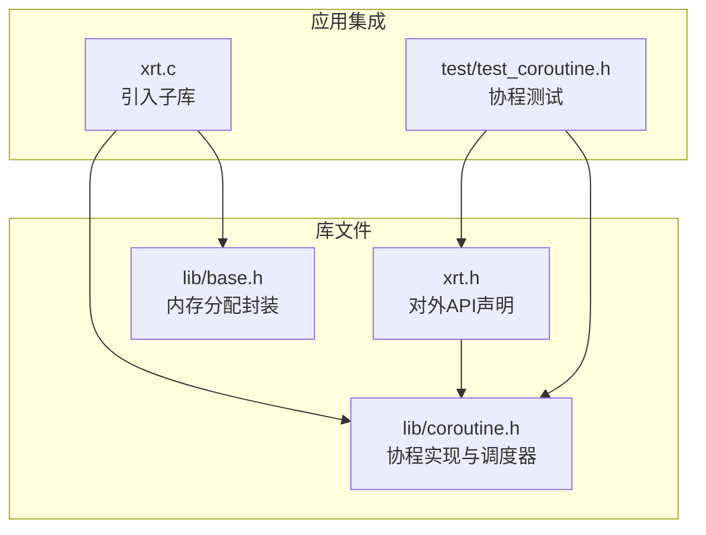
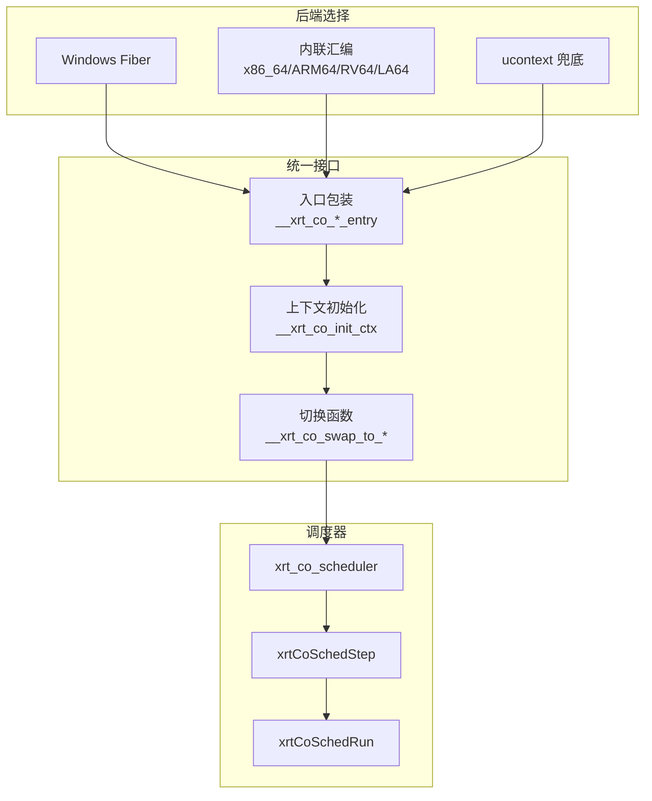
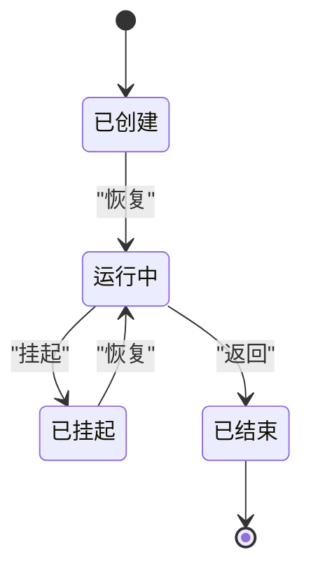
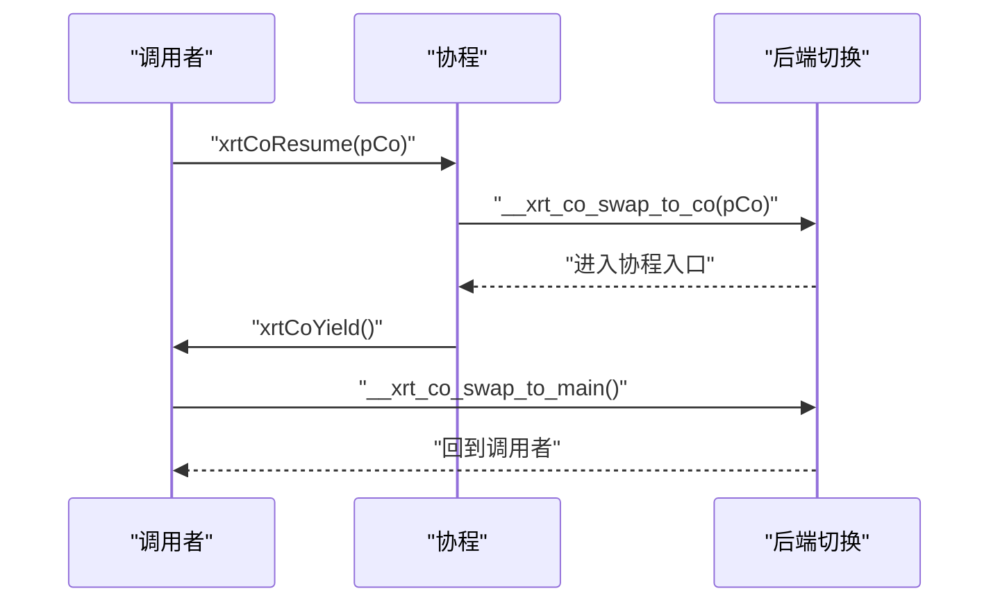
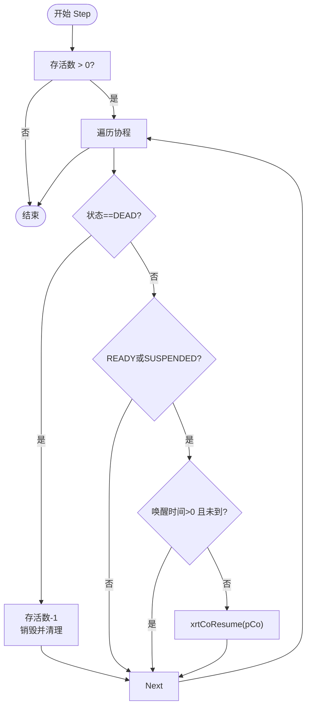
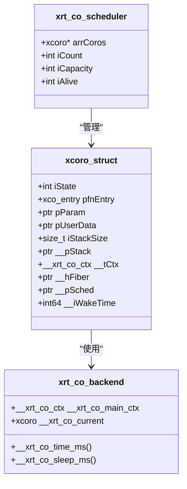
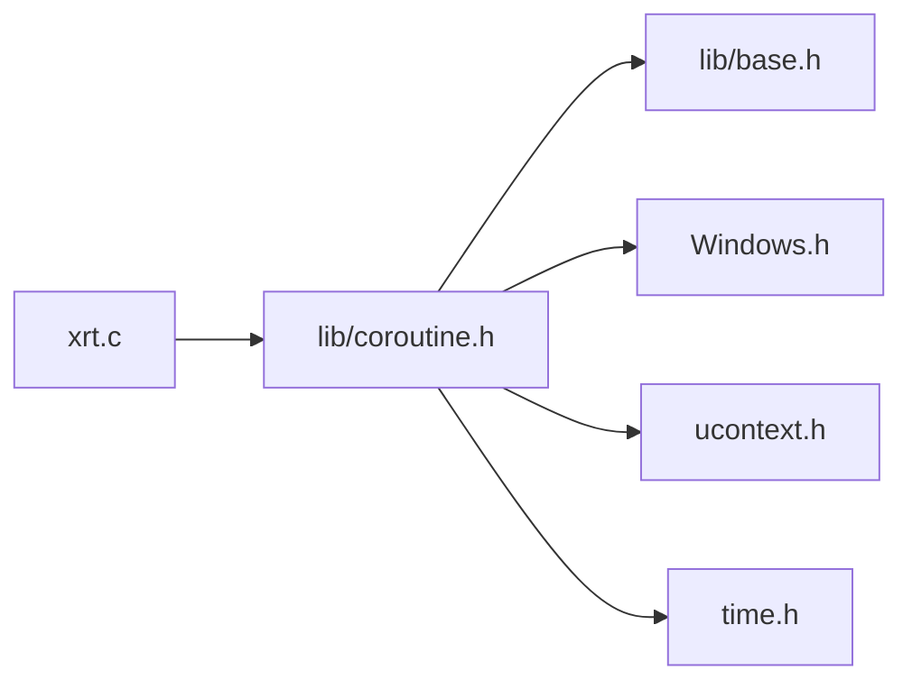

# 协程库

<cite>
**本文档引用的文件**
- [lib/coroutine.h](file://lib/coroutine.h)
- [xrt.h](file://xrt.h)
- [xrt.c](file://xrt.c)
- [lib/base.h](file://lib/base.h)
- [test/test_coroutine.h](file://test/test_coroutine.h)
</cite>

## 目录
1. [简介](#简介)
2. [项目结构](#项目结构)
3. [核心组件](#核心组件)
4. [架构总览](#架构总览)
5. [详细组件分析](#详细组件分析)
6. [依赖关系分析](#依赖关系分析)
7. [性能考虑](#性能考虑)
8. [故障排除指南](#故障排除指南)
9. [结论](#结论)

## 简介
本协程库提供了跨平台的用户态轻量级协程实现，支持在 Windows（Fiber）、Linux（GCC/Clang）等平台上通过内联汇编或 ucontext 实现高效的协程切换。库内置一个简单的调度器，支持协程的创建、恢复、挂起、睡眠以及批量调度运行。

## 项目结构
协程库位于 lib 目录下的 coroutine.h，对外 API 在 xrt.h 中声明，并在 xrt.c 中被引入到主库中。测试用例位于 test/test_coroutine.h。

**图表来源**
- [lib/coroutine.h](file://lib/coroutine.h#L1-L670)
- [xrt.h](file://xrt.h#L1110-L1202)
- [xrt.c](file://xrt.c#L48-L87)
- [lib/base.h](file://lib/base.h#L1-L132)
- [test/test_coroutine.h](file://test/test_coroutine.h#L1-L304)

**章节来源**
- [lib/coroutine.h](file://lib/coroutine.h#L1-L670)
- [xrt.h](file://xrt.h#L1110-L1202)
- [xrt.c](file://xrt.c#L48-L87)
- [lib/base.h](file://lib/base.h#L1-L132)
- [test/test_coroutine.h](file://test/test_coroutine.h#L1-L304)

## 核心组件
- 协程上下文与状态
  - 状态枚举：READY、RUNNING、SUSPENDED、DEAD
  - 默认栈大小、最小/最大栈保护
  - 协程结构体包含状态、入口函数、参数、用户数据、栈大小、栈指针、上下文、Fiber句柄、所属调度器、唤醒时间戳等字段
- 协程生命周期 API
  - 创建/销毁协程
  - 恢复/挂起协程
  - 查询状态与当前协程
  - 设置/获取用户数据
- 协程调度器
  - 创建/销毁调度器
  - Spawn 新协程
  - Step 调度一轮
  - Run 持续调度直至结束
  - 查询存活协程数
  - 协程睡眠（配合调度器）

**章节来源**
- [xrt.h](file://xrt.h#L1110-L1202)
- [lib/coroutine.h](file://lib/coroutine.h#L401-L667)

## 架构总览
协程库采用“后端自动选择 + 统一接口”的设计：
- 后端选择策略：Windows 使用 Fiber；Linux/GCC/Clang 使用内联汇编（x86_64/ARM64/RISC-V/LoongArch64）；其他或兜底使用 ucontext
- 统一入口包装：无论哪种后端，协程入口均通过统一的包装函数执行，内部从全局状态读取当前协程并调用用户入口
- 上下文切换：Fiber 直接切换；汇编后端通过寄存器保存/恢复实现；ucontext 使用 getcontext/makecontext/swapcontext
- 调度器：维护协程数组，按状态与唤醒时间进行调度，支持存活计数与空闲短休眠

**图表来源**
- [lib/coroutine.h](file://lib/coroutine.h#L7-L28)
- [lib/coroutine.h](file://lib/coroutine.h#L80-L110)
- [lib/coroutine.h](file://lib/coroutine.h#L115-L311)
- [lib/coroutine.h](file://lib/coroutine.h#L361-L395)
- [lib/coroutine.h](file://lib/coroutine.h#L517-L670)

## 详细组件分析

### 协程状态与生命周期
- 状态管理
  - 状态更新：入口执行后设置 DEAD；挂起时设置 SUSPENDED；恢复时设置 RUNNING
  - 状态查询：xrtCoGetState 返回当前状态
  - 当前协程：xrtCoGetCurrent 返回正在运行的协程或 NULL
- 生命周期
  - 创建：xrtCoCreate 分配结构体、校验/限制栈大小、按后端初始化上下文
  - 销毁：xrtCoDestroy 释放栈/上下文/Fiber，释放结构体
  - 恢复：xrtCoResume 将当前协程标记为 RUNNING，调用后端切换至协程
  - 挂起：xrtCoYield 将当前协程标记为 SUSPENDED，切换回主上下文

**图表来源**
- [xrt.h](file://xrt.h#L1112-L1116)
- [lib/coroutine.h](file://lib/coroutine.h#L461-L490)

**章节来源**
- [xrt.h](file://xrt.h#L1112-L1178)
- [lib/coroutine.h](file://lib/coroutine.h#L401-L513)

### 后端实现与切换机制
- Windows Fiber
  - 使用 CreateFiber/ConvertThreadToFiber 创建/转换主线程为 Fiber
  - SwitchToFiber 实现协程切换
- 内联汇编（x86_64/ARM64/RISC-V/LoongArch64）
  - 保存/恢复各自平台的调用约定寄存器
  - 通过跳转到入口地址实现切换
- ucontext 兜底
  - getcontext/makecontext/swapcontext 管理上下文
  - 动态分配 ucontext_t 并绑定到协程结构体

**图表来源**
- [lib/coroutine.h](file://lib/coroutine.h#L96-L108)
- [lib/coroutine.h](file://lib/coroutine.h#L130-L155)
- [lib/coroutine.h](file://lib/coroutine.h#L347-L355)
- [lib/coroutine.h](file://lib/coroutine.h#L385-L393)
- [lib/coroutine.h](file://lib/coroutine.h#L483-L490)

**章节来源**
- [lib/coroutine.h](file://lib/coroutine.h#L80-L110)
- [lib/coroutine.h](file://lib/coroutine.h#L115-L204)
- [lib/coroutine.h](file://lib/coroutine.h#L208-L311)
- [lib/coroutine.h](file://lib/coroutine.h#L361-L395)

### 协程调度器
- 数据结构
  - 维护协程数组、容量、数量、存活数
- 调度流程
  - Step：遍历协程，过滤 DEAD；只处理 READY/SUSPENDED；检查唤醒时间；恢复协程
  - Run：循环 Step，若全部协程在等待则短暂休眠避免忙等
- 辅助
  - Spawn：扩容并创建协程，加入数组，增加存活数
  - 销毁：遍历销毁并清空数组
  - 睡眠：xrtCoSleep 设置唤醒时间戳并挂起

**图表来源**
- [lib/coroutine.h](file://lib/coroutine.h#L588-L620)
- [lib/coroutine.h](file://lib/coroutine.h#L623-L650)

**章节来源**
- [lib/coroutine.h](file://lib/coroutine.h#L517-L670)

### API 与数据模型
- 协程 API
  - 创建/销毁、恢复/挂起、状态查询、当前协程、用户数据
- 调度器 API
  - 创建/销毁、Spawn、Step、Run、存活数查询、协程睡眠
- 数据模型
  - 协程结构体包含状态、入口、参数、用户数据、栈大小、栈指针、上下文、Fiber句柄、调度器指针、唤醒时间戳

**图表来源**
- [xrt.h](file://xrt.h#L1131-L1146)
- [lib/coroutine.h](file://lib/coroutine.h#L36-L48)
- [lib/coroutine.h](file://lib/coroutine.h#L54-L75)

**章节来源**
- [xrt.h](file://xrt.h#L1110-L1202)
- [lib/coroutine.h](file://lib/coroutine.h#L36-L75)

## 依赖关系分析
- 外部依赖
  - Windows：Windows.h（Fiber/Win32 API）
  - POSIX：ucontext.h（ucontext 兜底）、time.h（单调时钟）、signal.h（信号处理）
- 内部依赖
  - xrt.c 引入协程库头文件
  - 协程库使用 lib/base.h 提供的内存分配封装
- 耦合性
  - 协程库与调度器低耦合，调度器通过 API 操作协程
  - 后端切换逻辑与上层 API 解耦，通过统一包装函数抽象

**图表来源**
- [xrt.c](file://xrt.c#L48-L87)
- [lib/coroutine.h](file://lib/coroutine.h#L30-L32)
- [lib/base.h](file://lib/base.h#L1-L132)

**章节来源**
- [xrt.c](file://xrt.c#L48-L87)
- [lib/coroutine.h](file://lib/coroutine.h#L30-L32)

## 性能考虑
- 栈大小
  - 默认 64KB，最小 8KB，最大 8MB，避免过大/过小导致性能或栈溢出问题
- 切换成本
  - 汇编后端直接保存/恢复寄存器，切换开销低
  - ucontext 作为兜底方案，性能略低但兼容性好
- 调度策略
  - Step 遍历协程，按状态与唤醒时间筛选，避免无效恢复
  - Run 在全部协程等待时短休眠，降低 CPU 占用
- 内存管理
  - 协程栈按需分配，Fiber 后端由系统管理栈，减少手动内存操作

[本节为通用指导，无需特定文件分析]

## 故障排除指南
- 协程状态异常
  - 确认协程状态为 READY 或 SUSPENDED 才能恢复
  - 避免在协程内部再次调用恢复（不支持嵌套）
- 栈相关问题
  - 栈大小超出范围会被限制到默认/边界值
  - 汇编后端需要正确对齐栈顶
- 调度器问题
  - DEAD 协程会在 Step 中自动清理并减少存活数
  - 若所有协程都在等待，Run 会短休眠避免忙等
- 测试验证
  - 基础创建/销毁、单协程 resume/yield、多协程交替、参数传递、UserData、GetCurrent、调度器基础、CoSleep 时序与耗时

**章节来源**
- [lib/coroutine.h](file://lib/coroutine.h#L461-L490)
- [lib/coroutine.h](file://lib/coroutine.h#L588-L650)
- [test/test_coroutine.h](file://test/test_coroutine.h#L88-L301)

## 结论
该协程库通过后端自动选择与统一接口设计，在多平台实现了高效、简洁的用户态协程能力，并提供了基础调度器以支持协程的并发调度与睡眠等待。其 API 设计清晰，状态管理明确，适合在高性能网络与异步场景中使用。