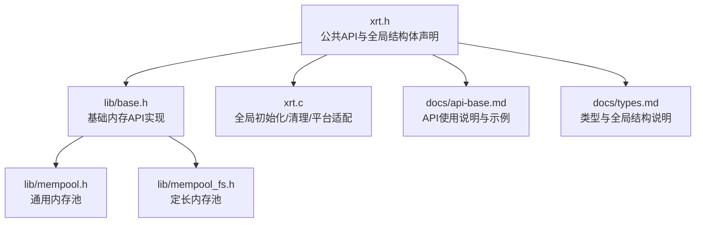
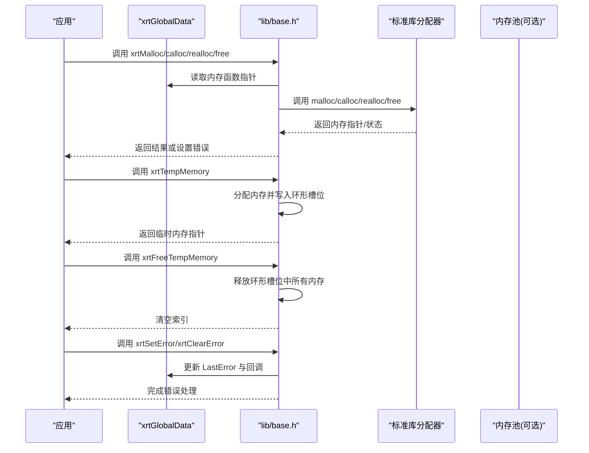
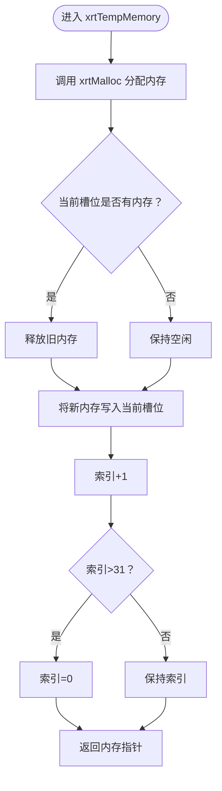
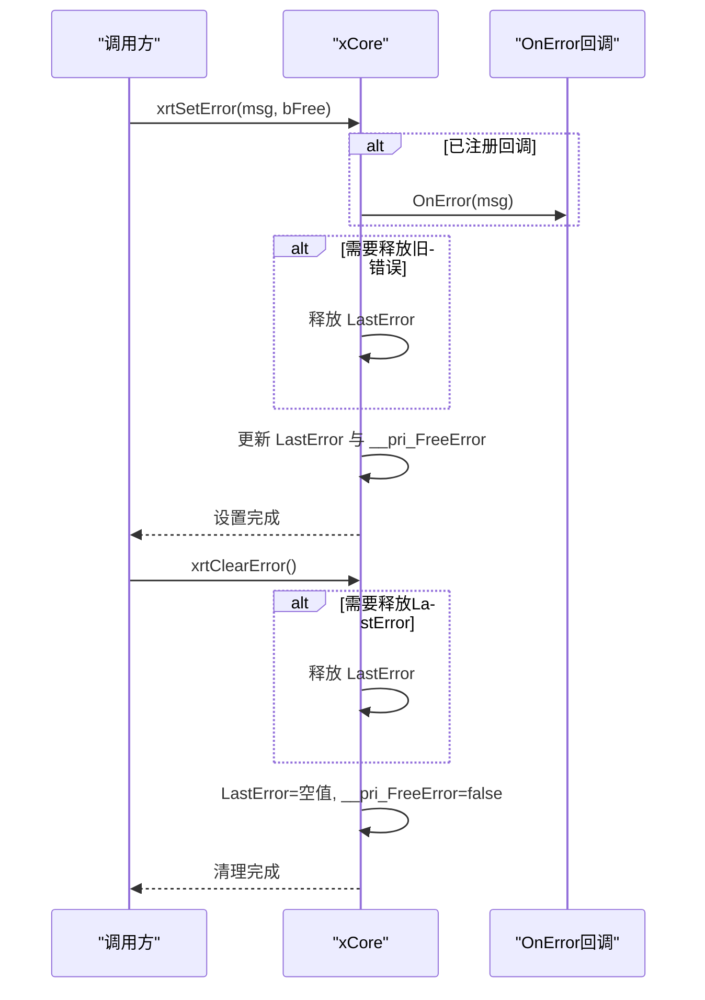
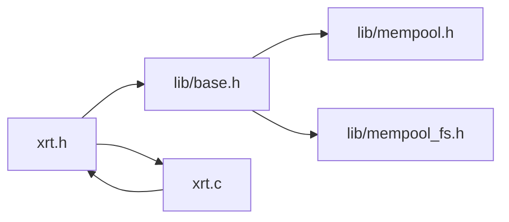

# 内存管理模块

<cite>
**本文引用的文件**
- [xrt.h](file://xrt.h)
- [xrt.c](file://xrt.c)
- [lib/base.h](file://lib/base.h)
- [docs/api-base.md](file://docs/api-base.md)
- [docs/types.md](file://docs/types.md)
- [lib/mempool.h](file://lib/mempool.h)
- [lib/mempool_fs.h](file://lib/mempool_fs.h)
</cite>

## 目录
1. [简介](#简介)
2. [项目结构](#项目结构)
3. [核心组件](#核心组件)
4. [架构总览](#架构总览)
5. [详细组件分析](#详细组件分析)
6. [依赖关系分析](#依赖关系分析)
7. [性能考量](#性能考量)
8. [故障排查指南](#故障排查指南)
9. [结论](#结论)
10. [附录](#附录)

## 简介
本文件聚焦于XRT内存管理模块，系统性阐述以下主题：
- 基础内存分配API（xrtMalloc、xrtCalloc、xrtRealloc、xrtFree）的实现原理与使用方法
- 临时内存管理机制（xrtTempMemory、xrtFreeTempMemory）的32槽位环形缓冲区设计与线程安全性
- 错误处理机制（xrtSetError、xrtClearError）的工作原理与回调函数注册
- 内存管理最佳实践（内存泄漏预防、性能优化建议、跨平台兼容性注意事项）
- 结合官方文档与源码的示例路径，帮助快速定位参考实现

## 项目结构
XRT采用“头文件声明 + 子库实现”的组织方式。内存管理相关接口在公共头文件中声明，在lib/base.h中实现，并由xrt.c负责初始化与全局状态管理。

图表来源
- [xrt.h](file://xrt.h#L120-L185)
- [lib/base.h](file://lib/base.h#L1-L132)
- [xrt.c](file://xrt.c#L87-L186)
- [lib/mempool.h](file://lib/mempool.h#L1-L468)
- [lib/mempool_fs.h](file://lib/mempool_fs.h#L1-L257)
- [docs/api-base.md](file://docs/api-base.md#L889-L1066)
- [docs/types.md](file://docs/types.md#L462-L537)

章节来源
- [xrt.h](file://xrt.h#L120-L185)
- [lib/base.h](file://lib/base.h#L1-L132)
- [xrt.c](file://xrt.c#L87-L186)

## 核心组件
- 全局数据结构xrtGlobalData：集中存放全局状态、内存函数指针、临时内存环、错误回调与随机数状态等。
- 基础内存API：封装标准库分配器，统一错误上报与释放行为。
- 临时内存环：32槽位环形缓冲区，自动管理短期临时数据生命周期。
- 错误处理：统一设置/清除错误消息，支持回调通知与多编码错误消息设置。
- 内存池：提供通用内存池与定长内存池，降低碎片与提升吞吐。

章节来源
- [xrt.h](file://xrt.h#L120-L185)
- [lib/base.h](file://lib/base.h#L1-L132)
- [xrt.c](file://xrt.c#L87-L186)

## 架构总览
下图展示了内存管理模块的调用关系与数据流。

图表来源
- [lib/base.h](file://lib/base.h#L1-L132)
- [xrt.c](file://xrt.c#L87-L186)
- [xrt.h](file://xrt.h#L120-L185)

## 详细组件分析

### 基础内存分配API
- xrtMalloc：封装标准malloc，失败时设置错误并返回NULL。
- xrtCalloc：封装标准calloc，失败时设置错误并返回NULL。
- xrtRealloc：封装标准realloc，失败时设置错误并返回NULL。
- xrtFree：安全释放，避免对NULL与空值指针重复释放。

实现要点
- 统一通过xCore.malloc/calloc/realloc/free调用底层分配器。
- 失败时调用xrtSetError上报错误信息。
- xrtFree内部对NULL与空值指针进行保护。

章节来源
- [lib/base.h](file://lib/base.h#L1-L46)
- [docs/api-base.md](file://docs/api-base.md#L354-L466)

### 临时内存管理（环形缓冲区）
- xrtTempMemory：每次调用分配一块内存，并写入当前槽位；若该槽位已有内存则先释放；索引递增，超过31后回绕至0。
- xrtFreeTempMemory：遍历32个槽位，逐个释放并清空索引。

设计与线程安全性
- 环形缓冲区容量固定为32，适合短期、小规模临时数据。
- 由于使用全局数组与索引，非线程安全；多线程环境下应自行同步或避免并发调用。
- 适用于批量短生命周期对象的快速复用，避免频繁分配释放带来的碎片与开销。

图表来源
- [lib/base.h](file://lib/base.h#L49-L84)

章节来源
- [lib/base.h](file://lib/base.h#L49-L84)
- [docs/types.md](file://docs/types.md#L462-L537)

### 错误处理机制
- xrtSetError：触发回调（若已注册），释放旧错误消息（若需要），更新LastError与释放标记。
- xrtSetErrorU16/U32：将UTF-16/UTF-32错误消息转换为UTF-8后再设置。
- xrtClearError：释放LastError（若需要），并将LastError重置为空值。

回调注册
- 通过xCore.OnError注册回调函数，发生错误时自动调用。
- 支持两种错误消息管理模式：常量字符串（不释放）与动态字符串（由XRT负责释放）。

图表来源
- [lib/base.h](file://lib/base.h#L88-L132)
- [xrt.h](file://xrt.h#L130-L143)

章节来源
- [lib/base.h](file://lib/base.h#L88-L132)
- [docs/api-base.md](file://docs/api-base.md#L926-L962)

### 内存池（可选增强）
- 通用内存池：按大小区间组织FSB（Flexible Size Block）树，小内存走FSB，大内存走独立链表，减少碎片并提升吞吐。
- 定长内存池：固定块大小，适合大量相同尺寸对象的高效分配与回收。

章节来源
- [lib/mempool.h](file://lib/mempool.h#L1-L468)
- [lib/mempool_fs.h](file://lib/mempool_fs.h#L1-L257)

## 依赖关系分析
- xrt.h声明公共API与全局结构体，lib/base.h实现基础内存API，xrt.c负责全局初始化与平台适配。
- 错误处理与临时内存均依赖xCore全局状态。
- 内存池作为可选高级特性，与基础API解耦。

图表来源
- [xrt.h](file://xrt.h#L120-L185)
- [lib/base.h](file://lib/base.h#L1-L132)
- [xrt.c](file://xrt.c#L87-L186)
- [lib/mempool.h](file://lib/mempool.h#L1-L468)
- [lib/mempool_fs.h](file://lib/mempool_fs.h#L1-L257)

章节来源
- [xrt.h](file://xrt.h#L120-L185)
- [lib/base.h](file://lib/base.h#L1-L132)
- [xrt.c](file://xrt.c#L87-L186)

## 性能考量
- 临时内存环：适合短期内大量小对象的快速复用，但注意不要超过32次循环使用，否则会覆盖旧内存。
- 预分配策略：对于高频使用的缓冲区，建议一次性预分配并复用，减少频繁分配释放。
- 内存池：对大量小对象或固定尺寸对象，使用内存池可显著降低碎片与系统调用开销。
- 错误处理成本：回调与字符串转换存在额外开销，应在关键路径谨慎使用。

章节来源
- [docs/api-base.md](file://docs/api-base.md#L1010-L1066)
- [docs/types.md](file://docs/types.md#L462-L537)

## 故障排查指南
- 内存泄漏
  - 确保所有xrtMalloc/xrtCalloc/xrtRealloc返回值非NULL且正确释放。
  - 对于临时内存，确认未超出32次循环使用导致覆盖。
- 线程安全
  - 临时内存环与错误状态均为线程不安全，多线程环境需自行同步或避免并发调用。
- 错误处理
  - 若使用动态错误消息，确保bFree参数正确传递，避免重复释放或泄漏。
  - 注册回调后，注意回调中的异常处理，避免回调中再次触发错误导致死循环。

章节来源
- [lib/base.h](file://lib/base.h#L49-L84)
- [lib/base.h](file://lib/base.h#L88-L132)
- [docs/api-base.md](file://docs/api-base.md#L926-L962)

## 结论
XRT内存管理模块通过统一的API封装与全局状态管理，提供了简洁、一致的内存分配与释放体验。临时内存环与错误处理机制进一步提升了易用性与可观测性。结合内存池与预分配策略，可在性能敏感场景获得更佳表现。实际使用中需关注线程安全性与错误处理细节，以避免潜在问题。

## 附录
- 示例参考（示例代码请参见以下路径，避免直接粘贴仓库内容）
  - 基础内存分配与安全使用：[示例路径](file://docs/api-base.md#L966-L1006)
  - 临时内存环使用与性能对比：[示例路径](file://docs/api-base.md#L1014-L1049)
  - 错误处理与回调注册：[示例路径](file://docs/api-base.md#L928-L962)
  - 临时内存环使用示例：[示例路径](file://docs/types.md#L462-L486)
  - 自定义内存函数替换：[示例路径](file://docs/types.md#L500-L537)