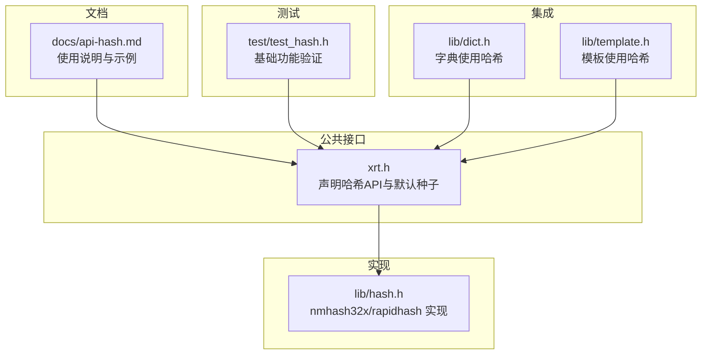
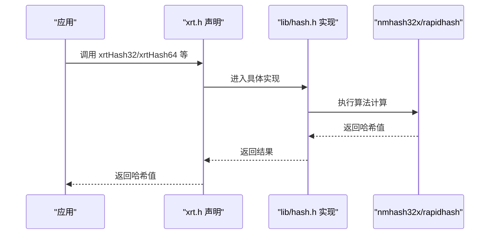
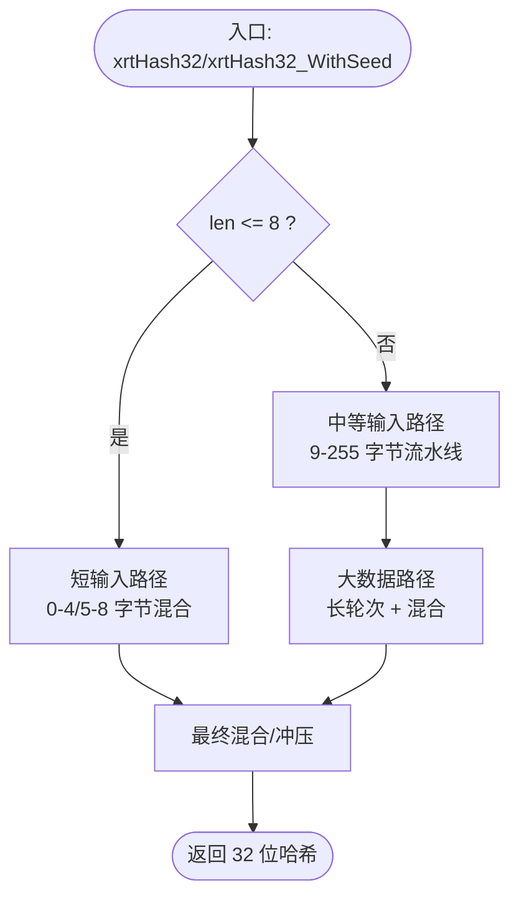
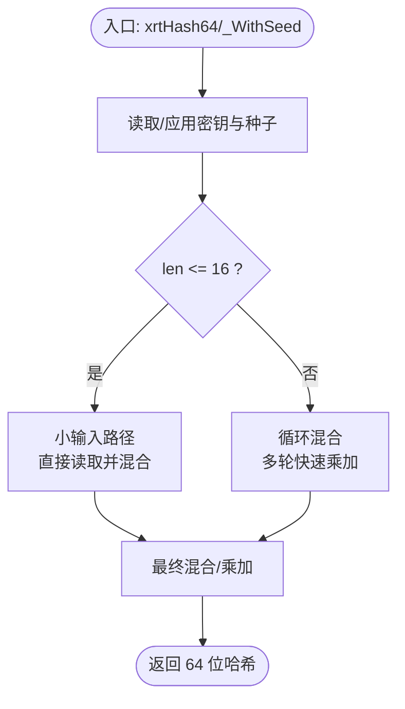
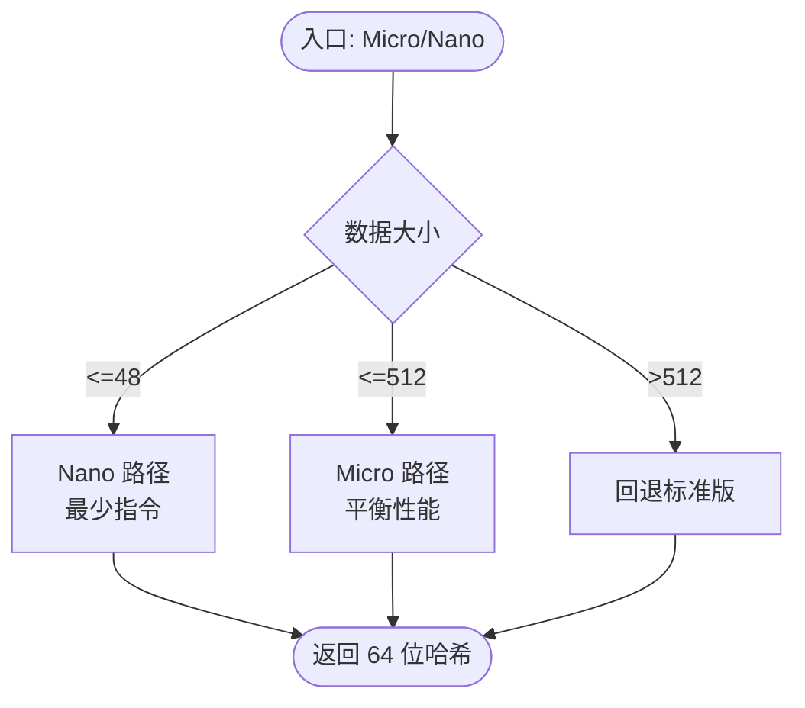
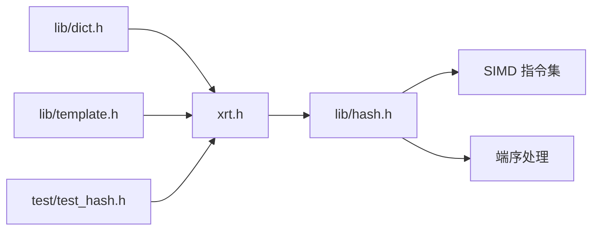

# 哈希计算模块

<cite>
**本文引用的文件**
- [lib/hash.h](file://lib/hash.h)
- [docs/api-hash.md](file://docs/api-hash.md)
- [xrt.h](file://xrt.h)
- [test/test_hash.h](file://test/test_hash.h)
- [lib/dict.h](file://lib/dict.h)
- [lib/template.h](file://lib/template.h)
</cite>

## 目录
1. [简介](#简介)
2. [项目结构](#项目结构)
3. [核心组件](#核心组件)
4. [架构总览](#架构总览)
5. [详细组件分析](#详细组件分析)
6. [依赖关系分析](#依赖关系分析)
7. [性能考量](#性能考量)
8. [故障排查指南](#故障排查指南)
9. [结论](#结论)
10. [附录](#附录)

## 简介
本文件系统性梳理 XRT 哈希计算模块，覆盖 32 位与 64 位哈希算法、API 使用方式、参数配置、返回值处理、适用场景与性能特征，并给出最佳实践与优化建议。模块基于高性能哈希算法实现，支持多种变体与平台特性，满足从嵌入式到高性能计算的不同需求。

## 项目结构
哈希模块位于 lib/hash.h，对外通过 xrt.h 暴露统一 API；文档位于 docs/api-hash.md；测试位于 test/test_hash.h；其他模块如字典与模板内部也直接调用哈希 API。

图表来源
- [lib/hash.h](file://lib/hash.h#L594-L602)
- [xrt.h](file://xrt.h#L941-L962)
- [docs/api-hash.md](file://docs/api-hash.md#L1-L643)
- [test/test_hash.h](file://test/test_hash.h#L5-L26)
- [lib/dict.h](file://lib/dict.h#L5-L7)
- [lib/template.h](file://lib/template.h#L168-L168)

章节来源
- [lib/hash.h](file://lib/hash.h#L594-L602)
- [xrt.h](file://xrt.h#L941-L962)
- [docs/api-hash.md](file://docs/api-hash.md#L1-L643)
- [test/test_hash.h](file://test/test_hash.h#L5-L26)

## 核心组件
- 32 位哈希：xrtHash32、xrtHash32_WithSeed，基于 nmhash32x 算法，支持 SIMD 向量化加速（SSE2/AVX2/AVX512），适用于哈希表、数据校验等。
- 64 位哈希：xrtHash64、xrtHash64_WithSeed（标准版）、xrtHash64_Micro/Micro_WithSeed（Micro 版）、xrtHash64_Nano/Nano_WithSeed（Nano 版），基于 rapidhash 算法，提供三种变体以适配不同场景与资源约束。
- 默认种子：HASH32_SEED（32 位默认 0）、HASH64_SEED（64 位默认固定值），可通过 WithSeed 接口指定自定义种子。

章节来源
- [lib/hash.h](file://lib/hash.h#L594-L602)
- [lib/hash.h](file://lib/hash.h#L1205-L1231)
- [xrt.h](file://xrt.h#L938-L954)

## 架构总览
哈希模块采用“公共接口 + 内核实现 + 文档与测试”的分层设计。公共接口在 xrt.h 中声明，具体实现集中在 lib/hash.h，文档与示例在 docs/api-hash.md，测试在 test/test_hash.h。字典与模板等上层模块通过宏或直接调用哈希 API。

图表来源
- [xrt.h](file://xrt.h#L941-L962)
- [lib/hash.h](file://lib/hash.h#L594-L602)
- [lib/hash.h](file://lib/hash.h#L1205-L1231)

## 详细组件分析

### 32 位哈希：nmhash32x
- 算法来源与版本：基于 smhasher 项目，版本 2.0，强调高质量与 SIMD 加速。
- 关键实现要点
  - 小数据路径：针对 0~4 字节与 5~8 字节的快速混合，使用常量乘加与位移组合，确保短输入的均匀性。
  - 中等数据路径：9~255 字节采用双累加器流水线与多轮混合，提升吞吐。
  - 大数据路径：超过阈值时进入长轮次处理，最后进行“冲压”混合（avalanche）以获得高质量输出。
  - SIMD 向量化：根据编译器与平台自动选择 SSE2/AVX2/AVX512，显著提升大块数据处理速度。
  - 端序处理：内置小端/大端读取函数，保证跨平台一致性。
- API
  - xrtHash32(key, len)：使用默认种子 HASH32_SEED。
  - xrtHash32_WithSeed(key, len, seed)：自定义种子。
- 典型用途：哈希表键计算、数据校验、布隆过滤器多哈希等。

图表来源
- [lib/hash.h](file://lib/hash.h#L546-L582)
- [lib/hash.h](file://lib/hash.h#L400-L527)
- [lib/hash.h](file://lib/hash.h#L371-L398)

章节来源
- [lib/hash.h](file://lib/hash.h#L23-L41)
- [lib/hash.h](file://lib/hash.h#L546-L582)
- [lib/hash.h](file://lib/hash.h#L400-L527)
- [lib/hash.h](file://lib/hash.h#L371-L398)

### 64 位哈希：rapidhash（标准版）
- 算法来源与版本：基于 wyhash 优化，版本 3.0，强调极致性能与高质量分布。
- 关键实现要点
  - 读取与端序：提供快速读取函数，自动处理大小端。
  - 乘加混合：rapid_mum 实现 64×64→128 乘法，支持快速与保护两种模式。
  - 主流程：rapidhash_internal 根据输入长度选择不同处理路径，包含多轮混合与最终混合。
  - 种子与密钥：使用内置密钥数组，WithSeed 可指定自定义种子。
- API
  - xrtHash64(key, len)：标准版，使用默认种子 0。
  - xrtHash64_WithSeed(key, len, seed)：自定义种子。
- 典型用途：大数据哈希、稳定序列化、缓存键生成等。

图表来源
- [lib/hash.h](file://lib/hash.h#L1133-L1135)
- [lib/hash.h](file://lib/hash.h#L1205-L1213)
- [lib/hash.h](file://lib/hash.h#L868-L977)

章节来源
- [lib/hash.h](file://lib/hash.h#L621-L657)
- [lib/hash.h](file://lib/hash.h#L755-L763)
- [lib/hash.h](file://lib/hash.h#L868-L977)
- [lib/hash.h](file://lib/hash.h#L1205-L1213)

### 64 位哈希：rapidhash（Micro/Nano 变体）
- Micro 版：面向 HPC/服务器，指令数约 140 条，适合 16–512 字节，对 1KB 以上略慢 15–20%，无栈使用。
- Nano 版：面向嵌入式/移动端，指令数小于 100 条，适合 1–48 字节，对更大输入可能明显更慢。
- API
  - xrtHash64_Micro/_WithSeed
  - xrtHash64_Nano/_WithSeed

图表来源
- [lib/hash.h](file://lib/hash.h#L1152-L1168)
- [lib/hash.h](file://lib/hash.h#L1181-L1201)
- [docs/api-hash.md](file://docs/api-hash.md#L500-L507)

章节来源
- [lib/hash.h](file://lib/hash.h#L1137-L1201)
- [docs/api-hash.md](file://docs/api-hash.md#L254-L346)

### 常量与默认种子
- HASH32_SEED：32 位默认种子，值为 0。
- HASH64_SEED：64 位默认种子，值为固定无符号整型常量。
- 作用：xrtHash32 默认使用该种子；xrtHash64 默认使用 0 种子（标准版）。

章节来源
- [xrt.h](file://xrt.h#L938-L954)

### API 使用方法与参数配置
- 32 位
  - xrtHash32(key, len)：key 指向数据，len 为字节数。
  - xrtHash32_WithSeed(key, len, seed)：seed 为 32 位无符号整数。
- 64 位
  - xrtHash64(key, len)：标准版。
  - xrtHash64_WithSeed(key, len, seed)：seed 为 64 位无符号整数。
  - xrtHash64_Micro/_WithSeed、xrtHash64_Nano/_WithSeed：分别对应 Micro/Nano 变体。
- 返回值
  - 32 位：uint32。
  - 64 位：uint64。
- 示例与场景
  - 文档提供了字符串、二进制数据、文件校验、布隆过滤器、缓存键生成等典型用法。

章节来源
- [docs/api-hash.md](file://docs/api-hash.md#L64-L160)
- [docs/api-hash.md](file://docs/api-hash.md#L163-L346)
- [docs/api-hash.md](file://docs/api-hash.md#L350-L494)

### 在数据结构与密码学中的应用
- 数据结构
  - 字典：字典模块通过宏直接使用 xrtHash64 或 xrtHash32 生成键哈希，用于桶定位与冲突处理。
  - 模板：模板系统在对象与缓冲区哈希计算中使用 xrtHash32，提升查找效率。
- 密码学应用
  - 文档未提供密码学哈希（如 SHA 系列）。本模块为通用散列，不适用于密码学安全场景（碰撞攻击防护可使用 WithSeed 与随机种子）。

章节来源
- [lib/dict.h](file://lib/dict.h#L5-L7)
- [lib/template.h](file://lib/template.h#L168-L168)
- [docs/api-hash.md](file://docs/api-hash.md#L563-L591)

## 依赖关系分析
- 外部依赖
  - 平台内建 SIMD 指令集：SSE2/AVX2/AVX512，由编译器与平台自动检测启用。
  - 平台内建端序转换：在非小端平台上自动进行字节序转换。
- 内部耦合
  - xrt.h 声明对外 API，lib/hash.h 实现算法细节，test/test_hash.h 进行基本功能验证。
  - 上层模块（如字典、模板）直接依赖哈希 API，形成稳定的接口契约。

图表来源
- [xrt.h](file://xrt.h#L941-L962)
- [lib/hash.h](file://lib/hash.h#L61-L69)
- [lib/hash.h](file://lib/hash.h#L196-L225)
- [lib/dict.h](file://lib/dict.h#L5-L7)
- [lib/template.h](file://lib/template.h#L168-L168)
- [test/test_hash.h](file://test/test_hash.h#L5-L26)

章节来源
- [lib/hash.h](file://lib/hash.h#L61-L69)
- [lib/hash.h](file://lib/hash.h#L196-L225)
- [xrt.h](file://xrt.h#L941-L962)

## 性能考量
- 选择建议
  - 小数据（≤48 字节）：优先 Nano。
  - 中等数据（49–512 字节）：优先 Micro。
  - 大数据（>512 字节）：优先标准版 xrtHash64。
- SIMD 加速：在支持 SSE2/AVX2/AVX512 的平台上自动启用，显著提升大块数据处理速度。
- 种子影响：WithSeed 可改变输出，适合抗碰撞攻击与多哈希场景，但会增加少量开销。
- 缓存友好：Micro/Nano 在小数据场景下减少缓存压力，标准版在大数据场景下更优。

章节来源
- [docs/api-hash.md](file://docs/api-hash.md#L500-L536)
- [lib/hash.h](file://lib/hash.h#L130-L140)
- [lib/hash.h](file://lib/hash.h#L1137-L1201)

## 故障排查指南
- 输入为空或长度为 0
  - 行为：仍返回有效哈希值，符合预期。
  - 建议：在业务层明确处理空输入，避免误判。
- 端序问题
  - 行为：内部已自动处理大小端，跨平台一致。
  - 建议：无需手动处理端序，保持数据原样传入。
- 种子一致性
  - 行为：WithSeed 可控，但需在不同进程/机器上保持种子一致才能得到相同结果。
  - 建议：稳定场景使用固定种子；安全场景使用随机种子并妥善保存。
- 性能异常
  - 行为：在小数据场景使用标准版可能导致性能不如 Micro/Nano。
  - 建议：按数据大小选择合适变体，或在运行时动态选择。

章节来源
- [docs/api-hash.md](file://docs/api-hash.md#L103-L107)
- [lib/hash.h](file://lib/hash.h#L196-L225)
- [docs/api-hash.md](file://docs/api-hash.md#L540-L591)

## 结论
XRT 哈希模块以 nmhash32x 与 rapidhash 为核心，提供高吞吐、高质量的 32/64 位哈希能力，并通过多种变体适配不同应用场景。通过合理的种子策略与变体选择，可在稳定性、安全性与性能之间取得良好平衡。建议在实际项目中结合数据规模与平台特性，选择合适的 API 与参数配置。

## 附录
- 常用示例路径
  - 32 位基础示例：见文档示例路径
  - 64 位基础示例：见文档示例路径
  - 布隆过滤器多哈希：见文档示例路径
  - 缓存键生成：见文档示例路径
- 集成参考
  - 字典模块键哈希：见宏定义路径
  - 模板模块哈希：见模板使用路径

章节来源
- [docs/api-hash.md](file://docs/api-hash.md#L80-L154)
- [docs/api-hash.md](file://docs/api-hash.md#L181-L250)
- [docs/api-hash.md](file://docs/api-hash.md#L419-L464)
- [docs/api-hash.md](file://docs/api-hash.md#L468-L494)
- [lib/dict.h](file://lib/dict.h#L5-L7)
- [lib/template.h](file://lib/template.h#L168-L168)