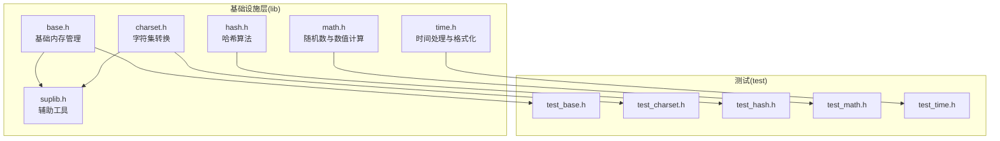
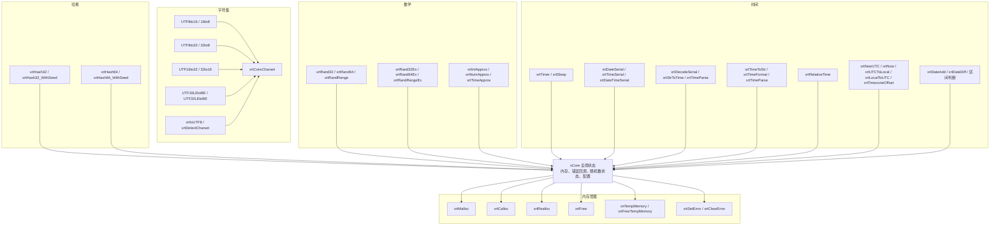
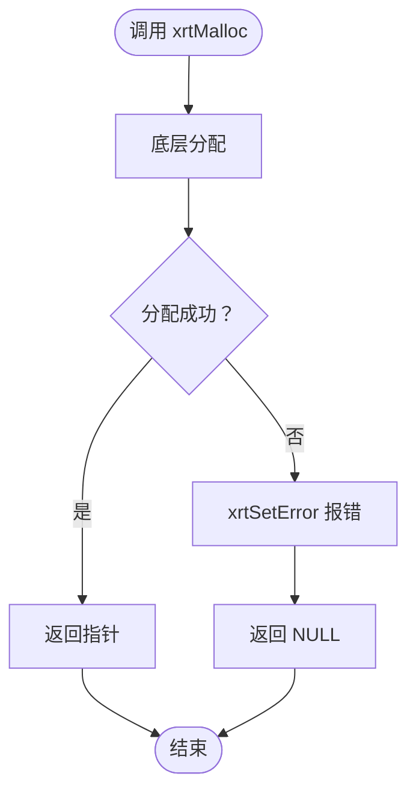
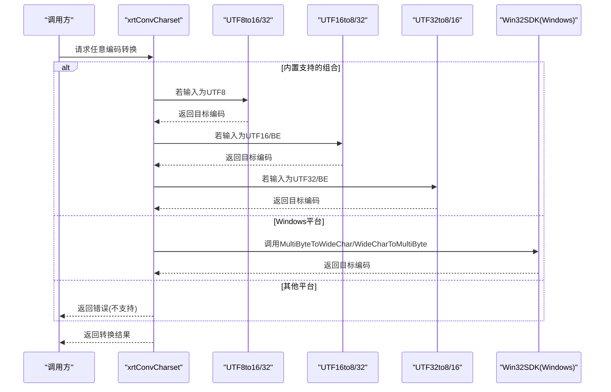
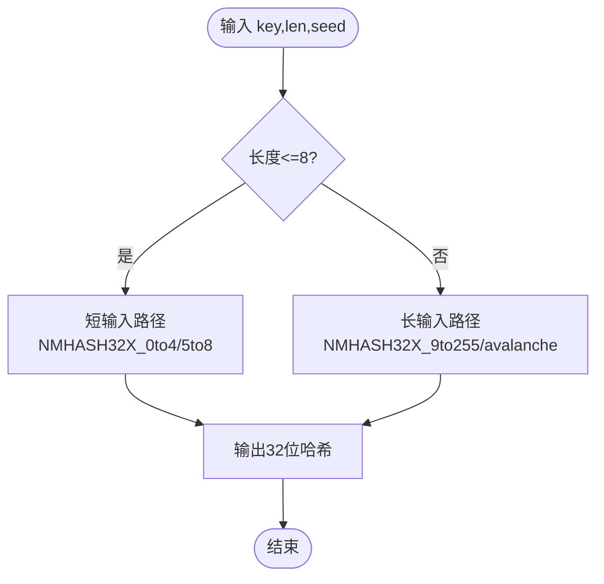
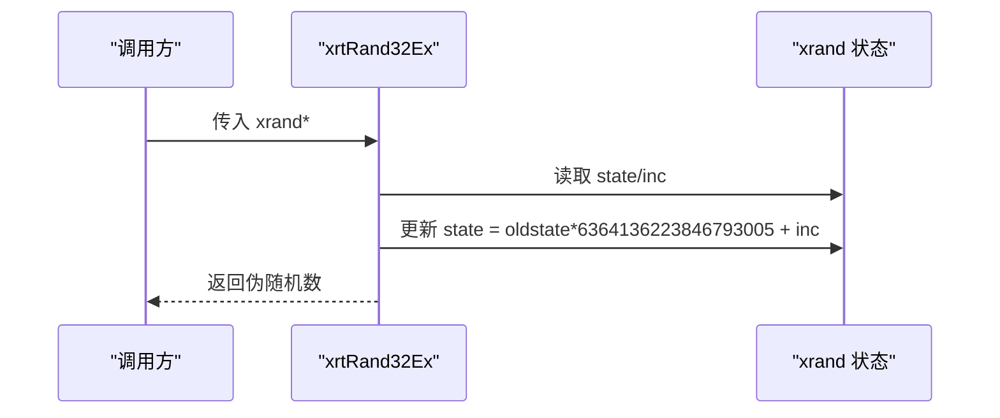
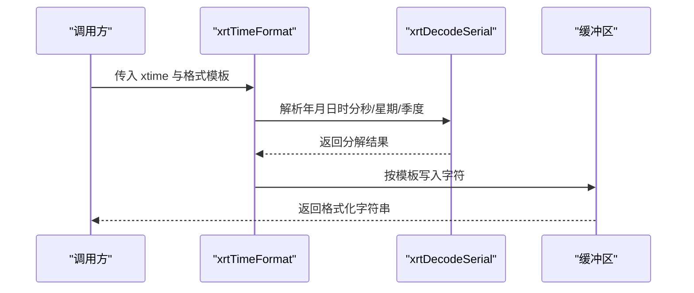
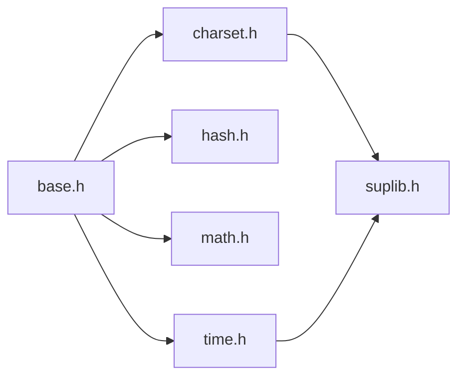

# 基础设施层

<cite>
**本文引用的文件**
- [lib/base.h](file://lib/base.h)
- [lib/charset.h](file://lib/charset.h)
- [lib/hash.h](file://lib/hash.h)
- [lib/math.h](file://lib/math.h)
- [lib/time.h](file://lib/time.h)
- [lib/suplib.h](file://lib/suplib.h)
- [test/test_charset.h](file://test/test_charset.h)
- [test/test_hash.h](file://test/test_hash.h)
- [test/test_math.h](file://test/test_math.h)
- [test/test_time.h](file://test/test_time.h)
- [test/test_base.h](file://test/test_base.h)
</cite>

## 目录
1. [简介](#简介)
2. [项目结构](#项目结构)
3. [核心组件](#核心组件)
4. [架构总览](#架构总览)
5. [详细组件分析](#详细组件分析)
6. [依赖关系分析](#依赖关系分析)
7. [性能考量](#性能考量)
8. [故障排查指南](#故障排查指南)
9. [结论](#结论)
10. [附录](#附录)

## 简介
本文件系统性梳理XRT基础设施层中基础内存管理(base)、字符集转换(charset)、哈希(hash)、数学(math)、时间(time)五大模块的设计与实现，覆盖API接口、内部原理、使用场景与最佳实践。文档同时提供基于仓库测试用例的示例路径，帮助读者快速理解与应用。

## 项目结构
基础设施层位于lib目录下，各模块以独立头文件形式提供API与实现细节；test目录包含对应模块的测试用例，用于演示典型用法与行为验证。

图表来源
- [lib/base.h](file://lib/base.h#L1-L132)
- [lib/charset.h](file://lib/charset.h#L1-L908)
- [lib/hash.h](file://lib/hash.h#L1-L1234)
- [lib/math.h](file://lib/math.h#L1-L175)
- [lib/time.h](file://lib/time.h#L1-L1403)
- [lib/suplib.h](file://lib/suplib.h#L1-L55)
- [test/test_base.h](file://test/test_base.h#L1-L13)
- [test/test_charset.h](file://test/test_charset.h#L1-L101)
- [test/test_hash.h](file://test/test_hash.h#L1-L26)
- [test/test_math.h](file://test/test_math.h#L1-L145)
- [test/test_time.h](file://test/test_time.h#L1-L272)

章节来源
- [lib/base.h](file://lib/base.h#L1-L132)
- [lib/charset.h](file://lib/charset.h#L1-L908)
- [lib/hash.h](file://lib/hash.h#L1-L1234)
- [lib/math.h](file://lib/math.h#L1-L175)
- [lib/time.h](file://lib/time.h#L1-L1403)
- [lib/suplib.h](file://lib/suplib.h#L1-L55)
- [test/test_base.h](file://test/test_base.h#L1-L13)
- [test/test_charset.h](file://test/test_charset.h#L1-L101)
- [test/test_hash.h](file://test/test_hash.h#L1-L26)
- [test/test_math.h](file://test/test_math.h#L1-L145)
- [test/test_time.h](file://test/test_time.h#L1-L272)

## 核心组件
- 基础内存管理(base)：提供统一的内存分配、重分配、释放与临时内存管理，以及线程不安全的错误设置/清除机制。
- 字符集转换(charset)：提供UTF-8/UTF-16/UTF-32互转、大端序/小端序转换、任意编码组合转换、编码检测与字符串处理。
- 哈希(hash)：提供高性能32位与64位哈希计算，采用NMHASH32X与rapidhash算法，支持带种子与不带种子版本。
- 数学(math)：提供PCG随机数生成器（32/64位）、范围随机数、线程安全Ex版本与整数/浮点/时间近似比较。
- 时间(time)：提供高精度计时、睡眠、日期/时间构建与解析、格式化/解析、相对时间描述、UTC与本地时区转换、区间判断等。

章节来源
- [lib/base.h](file://lib/base.h#L1-L132)
- [lib/charset.h](file://lib/charset.h#L1-L908)
- [lib/hash.h](file://lib/hash.h#L1-L1234)
- [lib/math.h](file://lib/math.h#L1-L175)
- [lib/time.h](file://lib/time.h#L1-L1403)

## 架构总览
基础设施层围绕“统一内存管理”“高效字符集转换”“高性能哈希”“可靠随机数”“跨平台时间处理”五大能力构建，形成稳定的基础支撑。

图表来源
- [lib/base.h](file://lib/base.h#L1-L132)
- [lib/charset.h](file://lib/charset.h#L1-L908)
- [lib/hash.h](file://lib/hash.h#L1-L1234)
- [lib/math.h](file://lib/math.h#L1-L175)
- [lib/time.h](file://lib/time.h#L1-L1403)

## 详细组件分析

### 基础内存管理(base)
- 核心API
  - 分配/重分配/释放：xrtMalloc、xrtCalloc、xrtRealloc、xrtFree
  - 临时内存：xrtTempMemory（环形索引，最多32块，超出自动释放旧块）、xrtFreeTempMemory（清空）
  - 错误处理：xrtSetError、xrtSetErrorU16、xrtSetErrorU32、xrtClearError
- 实现要点
  - 所有分配失败均通过xrtSetError上报错误，调用方需检查返回值或错误状态
  - 临时内存为线程不安全，适合单线程或单次请求内的短生命周期对象
  - 释放逻辑先判空再调用底层free，避免重复释放
- 使用建议
  - 优先使用xrtMalloc/xrtCalloc进行显式分配，配合xrtFree释放
  - 临时内存适合中间缓冲区，避免长期持有
  - 错误处理应结合xrtClearError清理历史错误

图表来源
- [lib/base.h](file://lib/base.h#L5-L13)
- [lib/base.h](file://lib/base.h#L88-L132)

章节来源
- [lib/base.h](file://lib/base.h#L1-L132)

### 字符集转换(charset)
- 核心API
  - UTF互转：xrtUTF8to16、xrtUTF8to32、xrtUTF16to8、xrtUTF16to32、xrtUTF32to8、xrtUTF32to16
  - 大端序转换：xrtUTF16LEtoBE、xrtUTF32LEtoBE
  - 任意编码转换：xrtConvCharset（内置UTF8/16/32及其BE变体互转，Windows平台可借助Win32SDK）
  - 编码检测：xrtIsUTF8、xrtDetectCharset（支持BOM识别与启发式判断）
- 实现要点
  - 内部使用字节额外长度表快速判定UTF编码长度与代理对
  - 超出目标编码范围的字符按策略替换（如UTF-16中使用替代码点）
  - Windows平台对非OEM编码提供Win32SDK路径，其他平台内置方案有限
- 性能与兼容性
  - 对超长字符串建议分段处理，避免一次性分配过大内存
  - 跨平台兼容：Windows默认支持多字节编码，非Windows平台内置仅限UTF系列
  - 大端序转换为就地操作，注意源参数bSrcRevise控制是否原地翻转

图表来源
- [lib/charset.h](file://lib/charset.h#L488-L710)

章节来源
- [lib/charset.h](file://lib/charset.h#L1-L908)

### 哈希(hash)
- 核心API
  - 32位哈希：xrtHash32、xrtHash32_WithSeed
  - 64位哈希：xrtHash64、xrtHash64_WithSeed
- 实现要点
  - 32位：NMHASH32X（基于nmhash32x，含短输入优化与长输入流水线）
  - 64位：rapidhash（基于wyhash，支持保护模式与内联优化）
  - 自动选择向量化路径（SSE2/AVX2/AVX512），在不支持的平台回退标量
  - 端序处理与对齐要求由内部宏控制
- 使用建议
  - 作为哈希表键值时建议使用带种子版本，提升抗碰撞能力
  - 长度敏感场景建议传入准确长度，避免误判

图表来源
- [lib/hash.h](file://lib/hash.h#L547-L582)

章节来源
- [lib/hash.h](file://lib/hash.h#L1-L1234)

### 数学(math)
- 核心API
  - 随机数：xrtRand32、xrtRand64、xrtRandRange（线程不安全）
  - 线程安全版本：xrtRand32Ex、xrtRand64Ex、xrtRandRangeEx（调用者管理状态）
  - 近似比较：xrtIntApprox、xrtNumApprox、xrtTimeApprox
- 实现要点
  - PCG算法，提供良好的统计特性与速度
  - Ex版本通过自管状态实现线程安全，适合并发场景
  - 近似比较支持两种模式：百分比容差与绝对差值容差
- 使用建议
  - 多线程环境优先使用Ex版本
  - 近似比较需根据业务设定合理容差

图表来源
- [lib/math.h](file://lib/math.h#L58-L101)

章节来源
- [lib/math.h](file://lib/math.h#L1-L175)

### 时间(time)
- 核心API
  - 高精度计时：xrtTimer（秒级，跨平台）
  - 延时：xrtSleep（毫秒）
  - 日期/时间构建：xrtDateSerial、xrtTimeSerial、xrtDateTimeSerial
  - 解析与格式化：xrtDecodeSerial、xrtTimeToStr、xrtTimeFormat、xrtTimeParse、xrtStrToTime
  - 相对时间：xrtRelativeTime
  - 时区：xrtNowUTC、xrtNow、xrtUTCToLocal、xrtLocalToUTC、xrtTimezoneOffset
  - 区间与边界：xrtDateAdd、xrtDateDiff、xrtTimeInRange、xrtTimeRangeOverlap、xrtFirstDayOfMonth/Year、xrtLastDayOfMonth/Year、xrtFirst/LastDayOfWeek、xrtWeekOfYear、xrtWeekOfMonth
- 实现要点
  - 时间以统一的xtime内部表示（秒级），通过常量换算不同粒度
  - 跨平台：Windows使用QueryPerformanceCounter/GetTickCount64，其他平台使用clock_gettime
  - 相对时间描述按秒/分/时/天/月/年分级显示
  - 时区偏移通过本地与UTC时间差计算
- 使用建议
  - 需要高精度测量时使用xrtTimer配合xrtSleep
  - 格式化/解析建议使用xrtTimeFormat/xrtTimeParse，支持灵活模板
  - 时区转换建议统一使用UTC存储，本地展示时再转换

图表来源
- [lib/time.h](file://lib/time.h#L1196-L1253)

章节来源
- [lib/time.h](file://lib/time.h#L1-L1403)

## 依赖关系分析
- 模块内聚与耦合
  - base与所有模块存在间接耦合（错误上报、内存分配、格式化输出）
  - charset与time在字符串处理与格式化上存在交集
  - math与time在随机种子与时间相关场景可能协作
- 外部依赖
  - Windows平台：charset在某些编码转换路径依赖Win32SDK
  - 时间模块：依赖系统时钟与线程安全的本地/UTC转换接口

图表来源
- [lib/base.h](file://lib/base.h#L1-L132)
- [lib/charset.h](file://lib/charset.h#L1-L908)
- [lib/hash.h](file://lib/hash.h#L1-L1234)
- [lib/math.h](file://lib/math.h#L1-L175)
- [lib/time.h](file://lib/time.h#L1-L1403)
- [lib/suplib.h](file://lib/suplib.h#L1-L55)

章节来源
- [lib/base.h](file://lib/base.h#L1-L132)
- [lib/charset.h](file://lib/charset.h#L1-L908)
- [lib/hash.h](file://lib/hash.h#L1-L1234)
- [lib/math.h](file://lib/math.h#L1-L175)
- [lib/time.h](file://lib/time.h#L1-L1403)
- [lib/suplib.h](file://lib/suplib.h#L1-L55)

## 性能考量
- 内存管理
  - 临时内存采用环形队列，避免频繁分配/释放带来的碎片化，但线程不安全，需谨慎使用
  - 分配失败立即设置错误，建议在调用链上尽早检查返回值
- 字符集转换
  - UTF互转使用查表与就地计算，避免复杂状态机；对超长字符串建议分段处理
  - Windows平台可利用Win32SDK加速多字节与UTF16互转
- 哈希
  - 自动选择向量化路径，短输入走快速路径，长输入走流水线；端序与对齐由宏自动处理
- 数学
  - PCG算法在多平台保持一致性能与质量；Ex版本适合并发
- 时间
  - 高精度计时在Windows使用高分辨率计数器，在其他平台使用单调时钟；格式化/解析采用模板驱动，减少分支

[本节为通用性能讨论，不直接分析具体文件]

## 故障排查指南
- 内存相关
  - 现象：分配失败返回NULL
  - 排查：检查xrtLastError（通过xrtSetError设置），确认是否调用了xrtClearError清理
  - 建议：对所有xrtMalloc/xrtCalloc/xrtRealloc返回值进行判空
- 字符集转换
  - 现象：转换后出现替换字符或长度异常
  - 排查：使用xrtIsUTF8检测输入合法性，使用xrtDetectCharset判断编码
  - 建议：Windows平台优先使用UTF8/UTF16互转，避免非OEM编码
- 哈希
  - 现象：哈希冲突率高
  - 排查：确认是否使用带种子版本；核对输入长度是否正确
- 数学
  - 现象：并发场景随机数重复
  - 排查：改用Ex版本并自行管理xrand状态
- 时间
  - 现象：相对时间显示异常或时区偏差
  - 排查：使用xrtTimezoneOffset校验偏移，确保UTC与本地转换一致

章节来源
- [lib/base.h](file://lib/base.h#L88-L132)
- [lib/charset.h](file://lib/charset.h#L714-L738)
- [lib/time.h](file://lib/time.h#L773-L798)

## 结论
XRT基础设施层在内存、字符集、哈希、数学与时间五个方面提供了统一、高效且跨平台的能力。通过清晰的API设计与完善的错误处理机制，开发者可在保证性能的同时获得良好的可维护性与可移植性。建议在生产环境中：
- 明确内存生命周期，善用临时内存但避免跨线程共享
- 在字符集转换中优先使用UTF系列并在Windows平台充分利用系统能力
- 哈希计算统一使用带种子版本，提高稳定性
- 并发场景使用数学模块的Ex版本
- 时间处理统一使用UTC存储，按需转换

[本节为总结性内容，不直接分析具体文件]

## 附录
- 示例路径（基于测试用例）
  - 基础内存管理：[test_base.h](file://test/test_base.h#L1-L13)
  - 字符集转换：[test_charset.h](file://test/test_charset.h#L1-L101)
  - 哈希：[test_hash.h](file://test/test_hash.h#L1-L26)
  - 数学：[test_math.h](file://test/test_math.h#L1-L145)
  - 时间：[test_time.h](file://test/test_time.h#L1-L272)