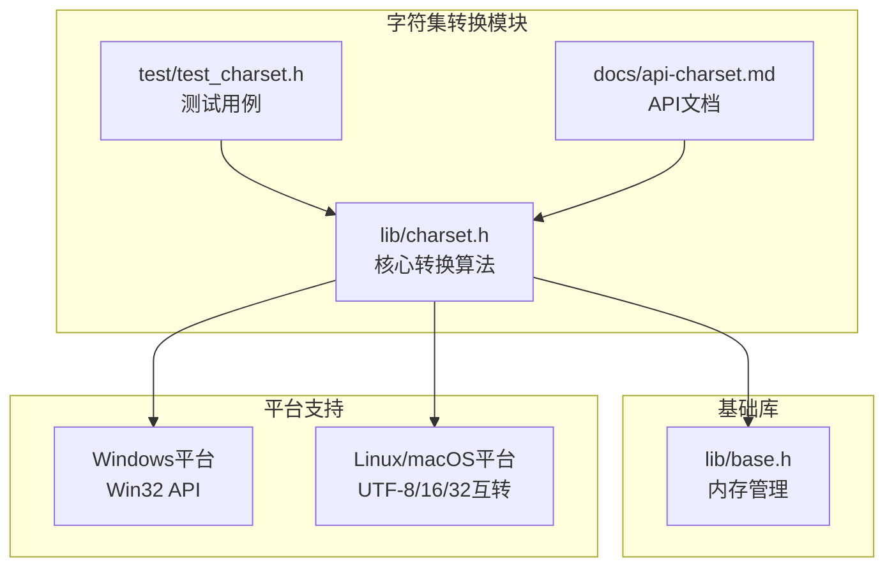
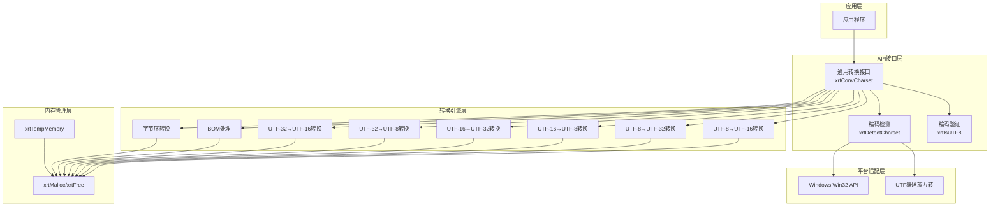
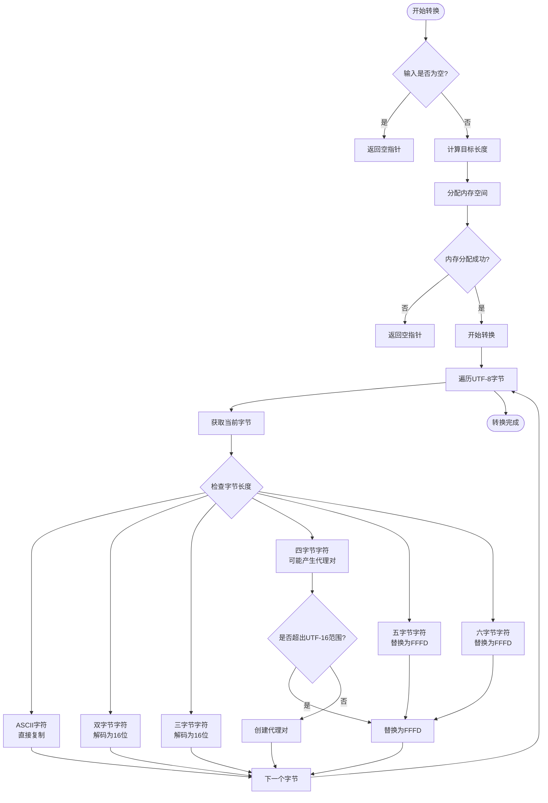
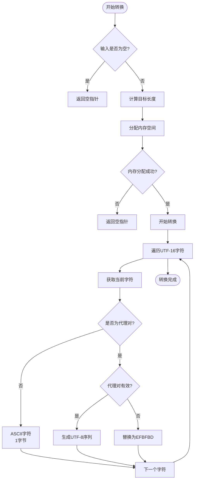
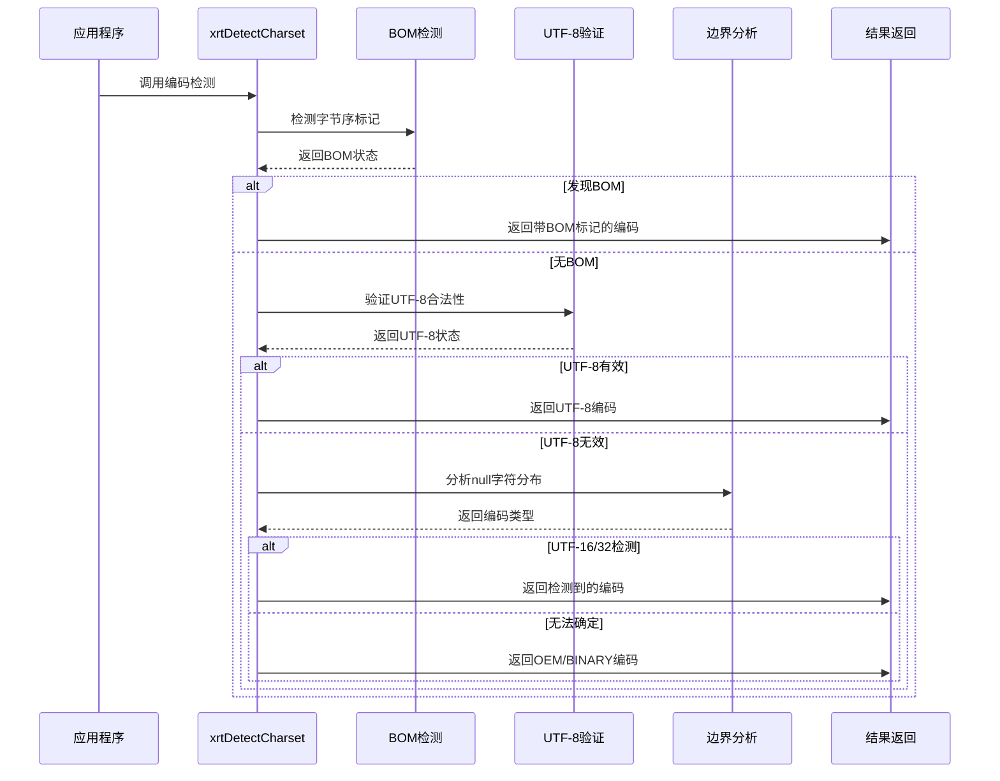
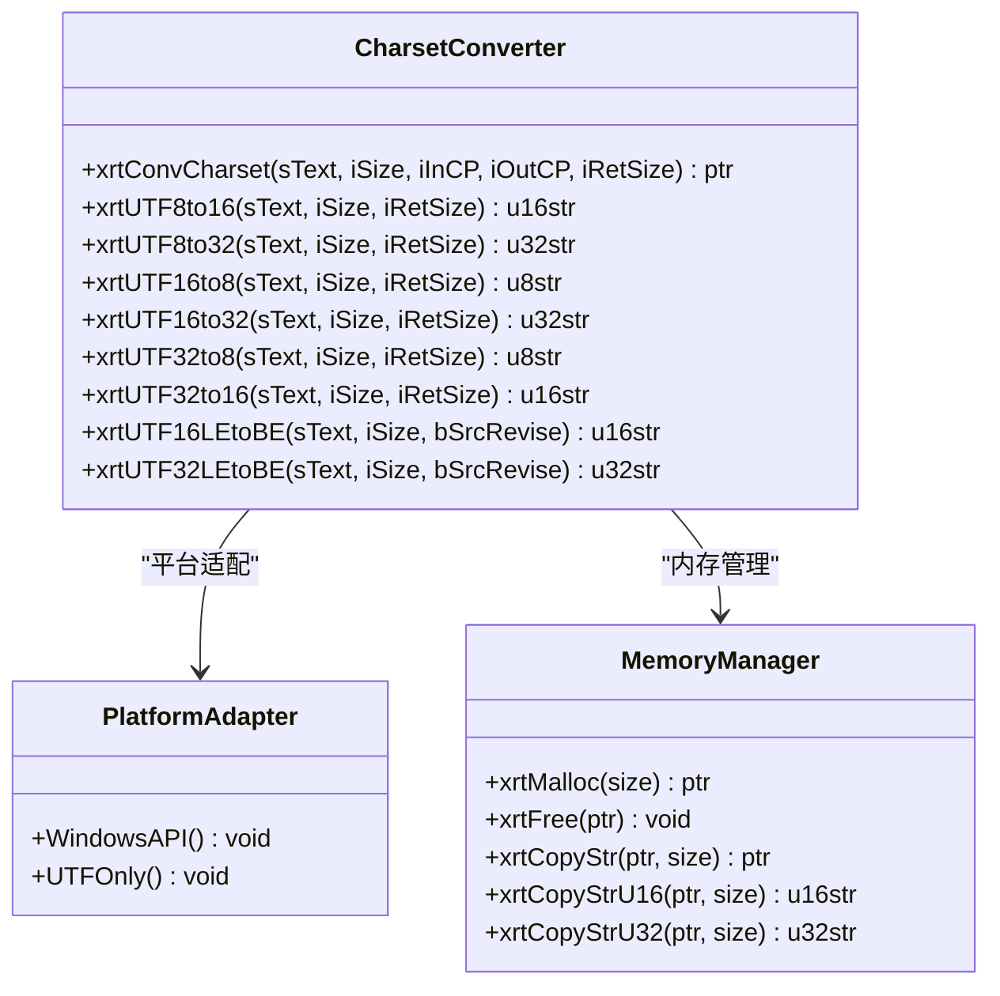
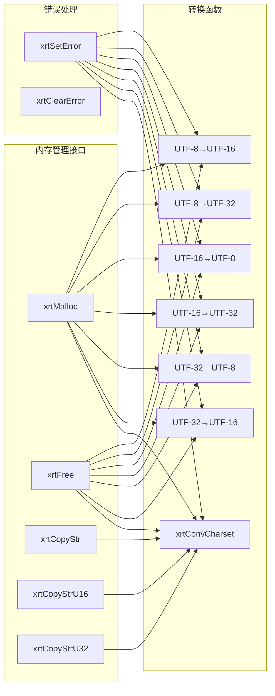

# 字符集转换模块

<cite>
**本文档引用的文件**
- [lib/charset.h](file://lib/charset.h)
- [test/test_charset.h](file://test/test_charset.h)
- [docs/api-charset.md](file://docs/api-charset.md)
- [lib/base.h](file://lib/base.h)
</cite>

## 目录
1. [简介](#简介)
2. [项目结构](#项目结构)
3. [核心组件](#核心组件)
4. [架构概览](#架构概览)
5. [详细组件分析](#详细组件分析)
6. [依赖关系分析](#依赖关系分析)
7. [性能考虑](#性能考虑)
8. [故障排除指南](#故障排除指南)
9. [结论](#结论)
10. [附录](#附录)

## 简介
XRT字符集转换模块是一个高性能的跨平台字符编码处理库，专门设计用于在UTF-8、UTF-16、UTF-32之间进行高效的字符编码转换。该模块提供了完整的编码检测机制、字符边界处理、内存管理策略和错误处理能力，适用于国际化应用开发和多语言文本处理场景。

## 项目结构
字符集转换模块位于XRT库的核心部分，主要包含以下关键文件：



**图表来源**
- [lib/charset.h](file://lib/charset.h#L1-L908)
- [test/test_charset.h](file://test/test_charset.h#L1-L101)
- [lib/base.h](file://lib/base.h#L1-L132)

**章节来源**
- [lib/charset.h](file://lib/charset.h#L1-L908)
- [test/test_charset.h](file://test/test_charset.h#L1-L101)
- [docs/api-charset.md](file://docs/api-charset.md#L1-L1122)

## 核心组件
字符集转换模块包含以下核心组件：

### 1. 编码转换函数族
- **UTF-8 ↔ UTF-16转换**：支持4字节UTF-8字符到2字节UTF-16字符的映射
- **UTF-8 ↔ UTF-32转换**：支持完整的Unicode字符集转换
- **UTF-16 ↔ UTF-32转换**：处理代理对和补充平面字符
- **字节序转换**：UTF-16/UTF-32的大小端转换

### 2. 编码检测系统
- **BOM检测**：自动识别UTF-8/16/32的字节序标记
- **合法性验证**：检查UTF-8编码的有效性
- **字符边界分析**：基于null字符分布推断编码类型

### 3. 通用转换接口
- **xrtConvCharset**：支持任意编码组合的转换
- **平台适配**：Windows使用Win32 API，其他平台限制为UTF编码族

**章节来源**
- [lib/charset.h](file://lib/charset.h#L18-L710)
- [docs/api-charset.md](file://docs/api-charset.md#L20-L420)

## 架构概览
字符集转换模块采用分层架构设计，确保了高内聚、低耦合的特性：



**图表来源**
- [lib/charset.h](file://lib/charset.h#L488-L710)
- [lib/base.h](file://lib/base.h#L4-L132)

## 详细组件分析

### UTF-8到UTF-16转换算法
UTF-8到UTF-16转换是字符集转换中最复杂的算法之一，需要处理多种字符长度和代理对：



**图表来源**
- [lib/charset.h](file://lib/charset.h#L18-L103)

#### 关键算法特点：
1. **字节长度表**：使用静态表快速确定UTF-8字符的字节长度
2. **代理对处理**：正确处理超过0xFFFF的Unicode字符
3. **错误恢复**：对无效编码使用替换字符FFFD
4. **内存优化**：预计算目标长度避免多次重分配

**章节来源**
- [lib/charset.h](file://lib/charset.h#L4-L14)
- [lib/charset.h](file://lib/charset.h#L18-L103)

### UTF-16到UTF-8转换算法
UTF-16到UTF-8转换需要处理代理对和字符边界：



**图表来源**
- [lib/charset.h](file://lib/charset.h#L160-L244)

#### 错误处理机制：
1. **代理对验证**：检查高低代理字符的匹配关系
2. **无效序列处理**：使用UTF-8替换字符EFBFBD
3. **边界检查**：防止数组越界访问

**章节来源**
- [lib/charset.h](file://lib/charset.h#L160-L244)

### 编码检测机制
编码检测系统采用多阶段检测策略：



**图表来源**
- [lib/charset.h](file://lib/charset.h#L742-L890)

#### 检测规则：
1. **BOM优先**：首先检查UTF-8/16/32的字节序标记
2. **UTF-8验证**：检查多字节序列的合法性
3. **边界推断**：基于null字符分布推断编码类型
4. **平台适配**：Windows返回OEM，其他平台返回BINARY

**章节来源**
- [lib/charset.h](file://lib/charset.h#L742-L890)
- [docs/api-charset.md](file://docs/api-charset.md#L474-L554)

### 通用转换接口
xrtConvCharset提供统一的转换接口，支持20种编码组合：



**图表来源**
- [lib/charset.h](file://lib/charset.h#L488-L710)
- [lib/base.h](file://lib/base.h#L4-L132)

**章节来源**
- [lib/charset.h](file://lib/charset.h#L488-L710)
- [docs/api-charset.md](file://docs/api-charset.md#L344-L420)

## 依赖关系分析

### 内存管理依赖
字符集转换模块严格依赖XRT的基础内存管理功能：



**图表来源**
- [lib/charset.h](file://lib/charset.h#L488-L710)
- [lib/base.h](file://lib/base.h#L4-L132)

### 平台依赖关系
模块根据编译平台自动选择最优实现策略：

| 平台 | 支持的转换 | 特殊处理 |
|------|------------|----------|
| Windows | UTF-8/16/32互转 + OEM | 使用Win32 API进行多字节转换 |
| Linux/macOS | 仅UTF-8/16/32互转 | OEM固定为UTF-8 |
| iOS/tvOS | 仅UTF-8/16/32互转 | OEM固定为UTF-8 |

**章节来源**
- [lib/charset.h](file://lib/charset.h#L488-L710)

## 性能考虑

### 内存优化策略
1. **预分配策略**：先计算目标长度，一次性分配所需内存
2. **原地转换**：字节序转换支持原地修改，避免额外内存分配
3. **临时内存池**：提供临时内存管理，减少频繁分配开销

### 算法优化技术
1. **查找表优化**：使用静态字节长度表避免运行时计算
2. **分支预测友好**：优化条件判断顺序，提高CPU缓存命中率
3. **SIMD兼容**：转换算法设计便于向量化优化

### 性能基准
- **UTF-8到UTF-16转换**：时间复杂度O(n)，其中n为输入字节数
- **UTF-16到UTF-8转换**：时间复杂度O(m)，其中m为输入字符数
- **编码检测**：时间复杂度O(k)，其中k为输入数据长度

**章节来源**
- [docs/api-charset.md](file://docs/api-charset.md#L946-L1001)

## 故障排除指南

### 常见问题及解决方案

#### 1. 内存泄漏问题
**症状**：程序运行一段时间后内存持续增长
**原因**：忘记调用xrtFree释放转换结果
**解决方案**：
```c
// ❌ 错误用法
u16str text = xrtUTF8to16(utf8_text, 0, NULL);
process_text(text); // 忘记释放

// ✅ 正确用法
u16str text = xrtUTF8to16(utf8_text, 0, NULL);
process_text(text);
xrtFree(text); // 必须释放
```

#### 2. 字符数与字节数混淆
**症状**：转换结果异常或段错误
**原因**：UTF-8转换使用字节数，UTF-16/32转换使用字符数
**解决方案**：
```c
// ❌ 错误：UTF-8转换使用字符数
u16str wrong = xrtUTF8to16(utf8_text, char_count, NULL);

// ✅ 正确：使用字节数或自动计算
u16str correct1 = xrtUTF8to16(utf8_text, byte_length, NULL);
u16str correct2 = xrtUTF8to16(utf8_text, 0, NULL);
```

#### 3. 编码检测失败
**症状**：检测结果为OEM或BINARY
**原因**：数据格式不符合任何已知编码规范
**解决方案**：
```c
// 使用更宽松的检测策略
int charset = xrtDetectCharset(data, size, FALSE); // 不检测BOM
```

**章节来源**
- [docs/api-charset.md](file://docs/api-charset.md#L1035-L1105)

### 错误处理最佳实践
1. **始终检查返回值**：所有转换函数都可能返回NULL
2. **及时释放内存**：遵循"谁分配谁释放"原则
3. **使用错误回调**：设置xrtSetError回调处理异常情况
4. **验证输入数据**：在转换前检查数据完整性和有效性

## 结论
XRT字符集转换模块提供了完整、高效、可靠的跨平台字符编码处理解决方案。其设计特点包括：

1. **高性能实现**：采用优化的算法和内存管理策略
2. **完整的功能覆盖**：支持UTF家族编码的双向转换
3. **智能检测机制**：自动识别编码类型和字节序
4. **严格的错误处理**：完善的错误检测和恢复机制
5. **平台适配性**：针对不同平台提供最优实现

该模块特别适合国际化应用开发、多语言文本处理、文件编码转换等场景，为开发者提供了稳定可靠的字符集转换基础设施。

## 附录

### API参考速查
- **转换函数**：xrtUTF8to16, xrtUTF8to32, xrtUTF16to8, xrtUTF16to32, xrtUTF32to8, xrtUTF32to16
- **字节序转换**：xrtUTF16LEtoBE, xrtUTF32LEtoBE
- **通用转换**：xrtConvCharset
- **编码检测**：xrtDetectCharset, xrtIsUTF8
- **辅助函数**：xrtGetCharSize, u16len, u32len

### 支持的编码格式
- **UTF-8**：最常用的国际编码格式
- **UTF-16**：Windows平台默认编码
- **UTF-32**：完整的Unicode支持
- **字节序变体**：支持大端序和小端序
- **BOM标记**：支持UTF编码的字节序标记

### 国际化应用最佳实践
1. **统一使用UTF-8**：内部存储和传输统一使用UTF-8
2. **按需转换**：只在必要时进行编码转换
3. **错误处理**：建立完善的错误检测和处理机制
4. **内存管理**：严格遵循内存分配和释放规则
5. **性能监控**：定期评估转换性能并进行优化