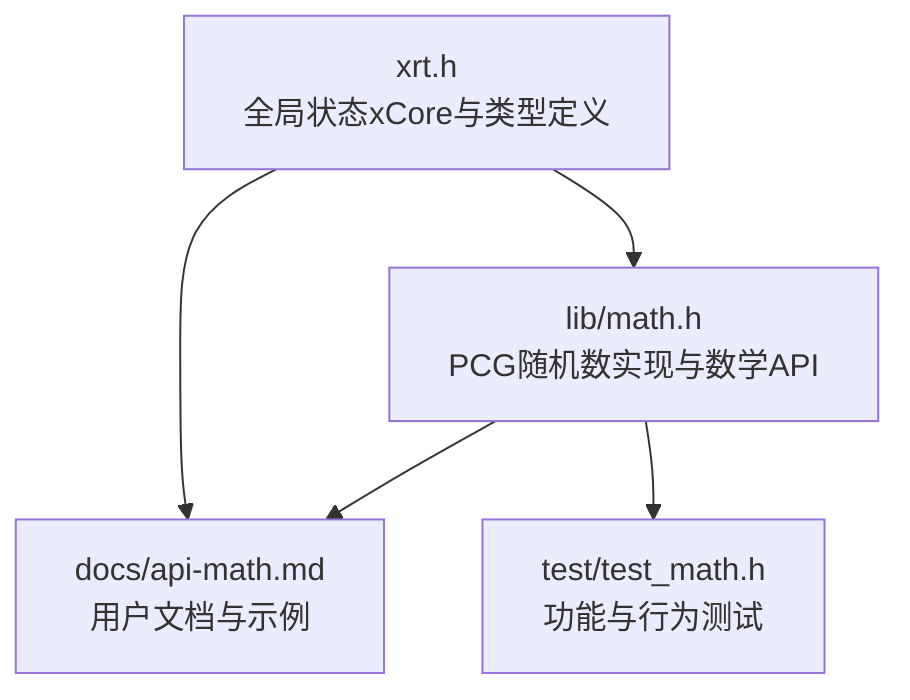
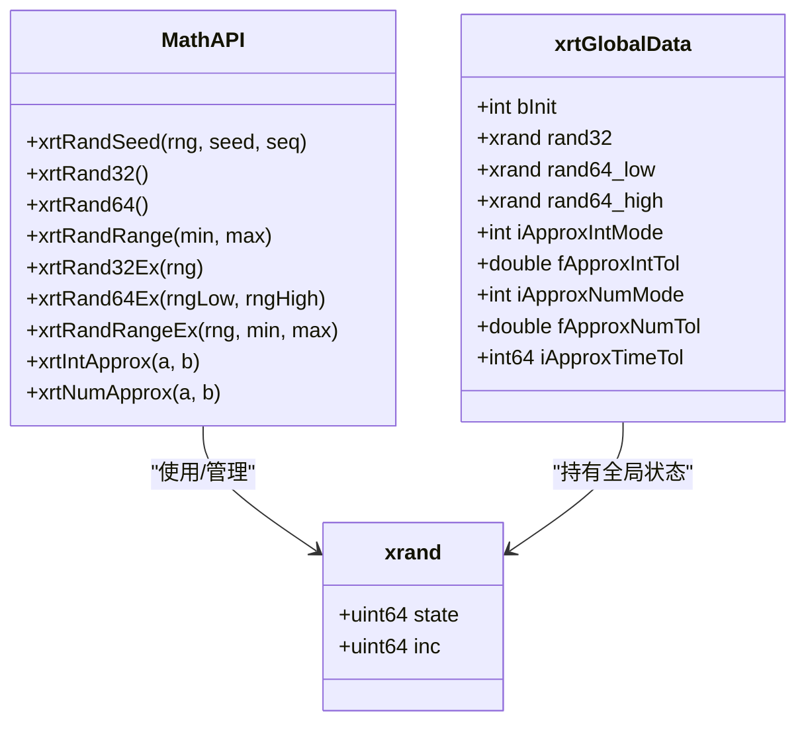
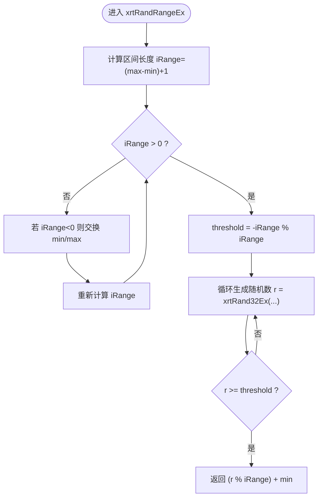
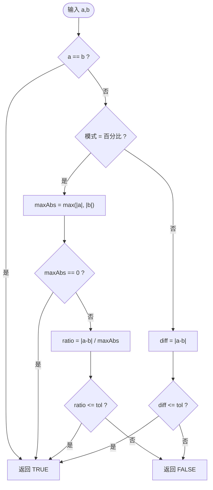
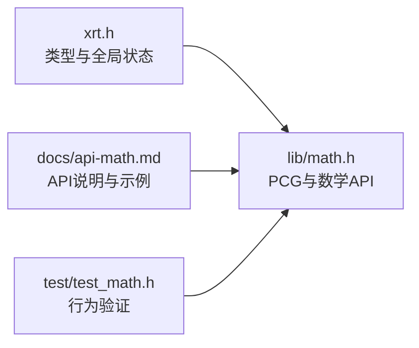

# 数学运算模块

<cite>
**本文引用的文件列表**
- [lib/math.h](file://lib/math.h)
- [docs/api-math.md](file://docs/api-math.md)
- [test/test_math.h](file://test/test_math.h)
- [xrt.h](file://xrt.h)
</cite>

## 目录
1. [简介](#简介)
2. [项目结构](#项目结构)
3. [核心组件](#核心组件)
4. [架构总览](#架构总览)
5. [组件详解](#组件详解)
6. [依赖关系分析](#依赖关系分析)
7. [性能与精度考量](#性能与精度考量)
8. [安全性与密码学应用](#安全性与密码学应用)
9. [故障排查指南](#故障排查指南)
10. [结论](#结论)
11. [附录](#附录)

## 简介
本文件系统性梳理 XRT 数学运算模块，重点覆盖随机数生成算法（PCG）、API 使用方式、参数范围与精度、质量保证与性能特性，并结合游戏开发、模拟仿真与密码学场景给出实践建议与注意事项。文档同时提供面向初学者的渐进式讲解与面向专家的代码级分析，辅以可视化图示帮助理解。

## 项目结构
数学运算模块位于 lib/math.h，配套文档在 docs/api-math.md，测试用例在 test/test_math.h；全局状态与类型定义在 xrt.h 中。

图表来源
- [lib/math.h](file://lib/math.h#L44-L175)
- [docs/api-math.md](file://docs/api-math.md#L1-L1237)
- [test/test_math.h](file://test/test_math.h#L1-L145)
- [xrt.h](file://xrt.h#L124-L181)

章节来源
- [lib/math.h](file://lib/math.h#L44-L175)
- [docs/api-math.md](file://docs/api-math.md#L1-L1237)
- [test/test_math.h](file://test/test_math.h#L1-L145)
- [xrt.h](file://xrt.h#L124-L181)

## 核心组件
- PCG 随机数生成器（xrand 状态结构）
- 基础 API（线程不安全，使用全局状态）
- Ex 版本 API（线程安全，调用者管理状态）
- 约等于比较（整数、浮点、时间）

章节来源
- [lib/math.h](file://lib/math.h#L44-L175)
- [xrt.h](file://xrt.h#L124-L181)

## 架构总览
XRT 数学模块采用“PCG 算法 + 全局/独立状态”的设计，既满足高性能需求，又兼顾线程安全与可重现性。

图表来源
- [lib/math.h](file://lib/math.h#L44-L175)
- [xrt.h](file://xrt.h#L124-L181)

## 组件详解

### 随机数生成器（PCG）
- 状态结构：xrand 含 state 与 inc，分别控制状态演进与序列偏移。
- 初始化：xrtRandSeed 将 inc 设为奇数（seq<<1|1），随后两次迭代以播种 state。
- 32 位生成：基于线性同余与异或旋转，输出 32 位伪随机数。
- 64 位生成：组合两个 32 位生成器（高位/低位）得到 64 位。
- 范围生成：xrtRandRangeEx 使用无偏差拒绝采样，确保均匀分布。

图表来源
- [lib/math.h](file://lib/math.h#L81-L101)

章节来源
- [lib/math.h](file://lib/math.h#L44-L101)

### API 分类与使用要点
- 基础 API（线程不安全）
  - xrtRand32/xrtRand64/xrtRandRange：内部使用全局状态，适合单线程或已加锁场景。
  - 优点：调用简单、性能高；缺点：多线程下需自行同步。
- Ex 版本 API（线程安全）
  - xrtRand32Ex/xrtRand64Ex/xrtRandRangeEx：由调用者管理 xrand 状态，适合多线程。
  - 64 位 Ex 需两个独立 xrand 实例分别生成高低 32 位。
- 种子与可重现性
  - 使用 xrtRandSeed 固定 seed 与 seq 可获得完全可重现的序列，便于测试与调试。
- 范围与边界
  - xrtRandRangeRangeEx 包含两端边界；当 min>max 时自动交换。
- 性能与质量
  - PCG32/PCG64 周期长、速度快、通过多项随机性测试，优于标准 rand()。

章节来源
- [docs/api-math.md](file://docs/api-math.md#L66-L405)
- [lib/math.h](file://lib/math.h#L44-L101)

### 约等于比较
- xrtIntApprox：支持差值模式与百分比模式，容差可配置。
- xrtNumApprox：对浮点数进行近似比较，同样支持两种模式。
- 时间约等于：配合时间类型进行容差比较（在测试用例中体现）。

图表来源
- [lib/math.h](file://lib/math.h#L130-L173)

章节来源
- [lib/math.h](file://lib/math.h#L130-L173)
- [test/test_math.h](file://test/test_math.h#L76-L143)

## 依赖关系分析
- lib/math.h 依赖 xrt.h 中的全局状态与类型定义（xrand、xrtGlobalData）。
- 文档与测试用例共同约束 API 行为与使用规范。
- 无循环依赖，模块内聚性强，耦合度低。

图表来源
- [xrt.h](file://xrt.h#L124-L181)
- [lib/math.h](file://lib/math.h#L44-L175)
- [docs/api-math.md](file://docs/api-math.md#L1-L1237)
- [test/test_math.h](file://test/test_math.h#L1-L145)

章节来源
- [xrt.h](file://xrt.h#L124-L181)
- [lib/math.h](file://lib/math.h#L44-L175)
- [docs/api-math.md](file://docs/api-math.md#L1-L1237)
- [test/test_math.h](file://test/test_math.h#L1-L145)

## 性能与精度考量
- 算法质量
  - PCG 为高质量伪随机数生成器，周期长、速度较快，通过多项随机性测试。
- 性能特性
  - Ex 版本 API 无全局锁，多线程下吞吐更高；基础 API 在单线程下开销更低。
- 精度与分布
  - 范围生成使用无偏差拒绝采样，避免模运算偏差；64 位生成通过高低位拼接保持均匀性。
- 线程安全
  - 基础 API 使用全局状态，多线程需外部同步；Ex 版本通过独立状态天然线程安全。

章节来源
- [docs/api-math.md](file://docs/api-math.md#L1148-L1165)
- [lib/math.h](file://lib/math.h#L81-L101)

## 安全性与密码学应用
- 伪随机 vs 真随机
  - 伪随机：确定性算法，可重现，适合游戏、仿真、测试；不适合密码学密钥生成。
  - 真随机：来自物理过程（如热噪声、量子效应），不可预测，适合密钥与随机盐。
- 密码学注意事项
  - 不应直接将本模块用于生成加密密钥、随机盐或一次性口令。
  - 若需密码学安全的随机数，请使用系统提供的 CSPRNG 接口（例如 Windows BCryptGenRandom、OpenSSL RAND_bytes 等）。
- 可重现性与调试
  - 在测试与调试阶段，可通过固定种子与序列获得可重现的随机序列，有助于定位问题。

章节来源
- [docs/api-math.md](file://docs/api-math.md#L1148-L1165)
- [docs/api-math.md](file://docs/api-math.md#L846-L876)

## 故障排查指南
- 忘记初始化
  - 症状：首次调用结果不稳定或异常。
  - 处理：确保在使用前调用初始化函数。
- 范围理解错误
  - 症状：期望半开区间但得到闭区间。
  - 处理：明确 xrtRandRangeRangeEx 包含两端；如需半开区间，调整边界。
- 重复初始化导致结果相同
  - 症状：每次调用返回相同序列。
  - 处理：仅在程序启动时初始化一次，后续复用同一状态对象。
- 模运算偏差
  - 症状：某些取值出现频率略高。
  - 处理：使用 xrtRandRangeRangeEx 等无偏差 API，避免直接对 32 位结果取模。

章节来源
- [docs/api-math.md](file://docs/api-math.md#L1167-L1219)
- [docs/api-math.md](file://docs/api-math.md#L880-L911)
- [docs/api-math.md](file://docs/api-math.md#L1096-L1144)

## 结论
XRT 数学模块以 PCG 算法为核心，提供了高性能、可重现且线程安全的随机数生成能力。其 API 设计兼顾易用性与扩展性，适合游戏开发、模拟仿真与测试场景。对于密码学用途，应另行使用系统提供的 CSPRNG 接口，以满足不可预测性与安全性要求。

## 附录

### API 使用示例路径
- 基础随机数（线程不安全）
  - 示例路径：[docs/api-math.md](file://docs/api-math.md#L85-L107)
- Ex 版本（线程安全）
  - 示例路径：[docs/api-math.md](file://docs/api-math.md#L130-L160)
- 范围随机数（线程不安全）
  - 示例路径：[docs/api-math.md](file://docs/api-math.md#L230-L264)
- Ex 版本范围随机数（线程安全）
  - 示例路径：[docs/api-math.md](file://docs/api-math.md#L384-L404)
- 64 位随机数（线程不安全）
  - 示例路径：[docs/api-math.md](file://docs/api-math.md#L182-L203)
- 64 位 Ex 版本（线程安全）
  - 示例路径：[docs/api-math.md](file://docs/api-math.md#L336-L358)
- 约等于比较（整数/浮点/时间）
  - 示例路径：[test/test_math.h](file://test/test_math.h#L76-L143)

### 应用场景参考
- 游戏开发
  - 随机掉落、属性浮动、AI 行为随机化、地图生成等。
- 模拟仿真
  - 蒙特卡洛模拟、随机扰动、抽样与统计分析。
- 密码学
  - 不适用。请使用系统 CSPRNG 接口生成密钥与随机盐。

章节来源
- [docs/api-math.md](file://docs/api-math.md#L531-L780)
- [test/test_math.h](file://test/test_math.h#L5-L71)