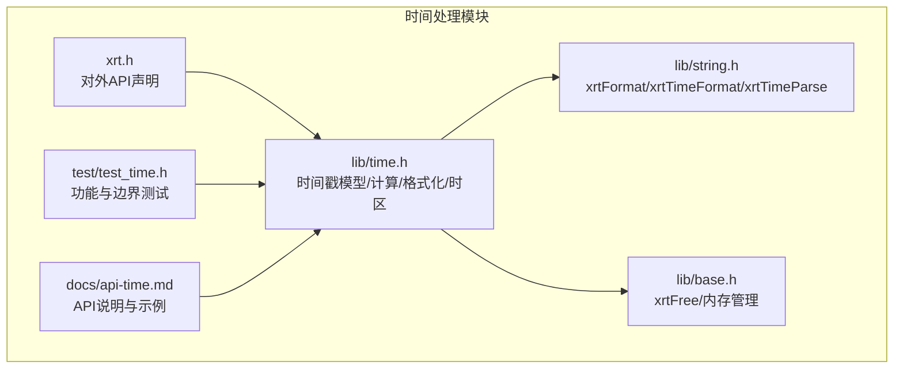
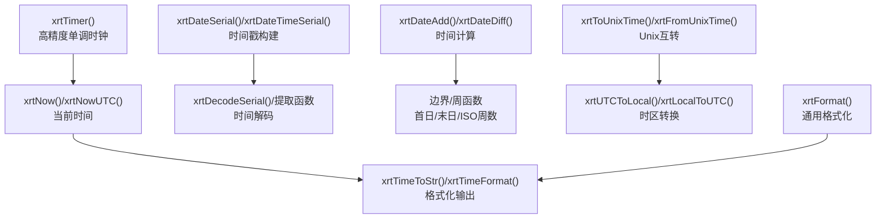
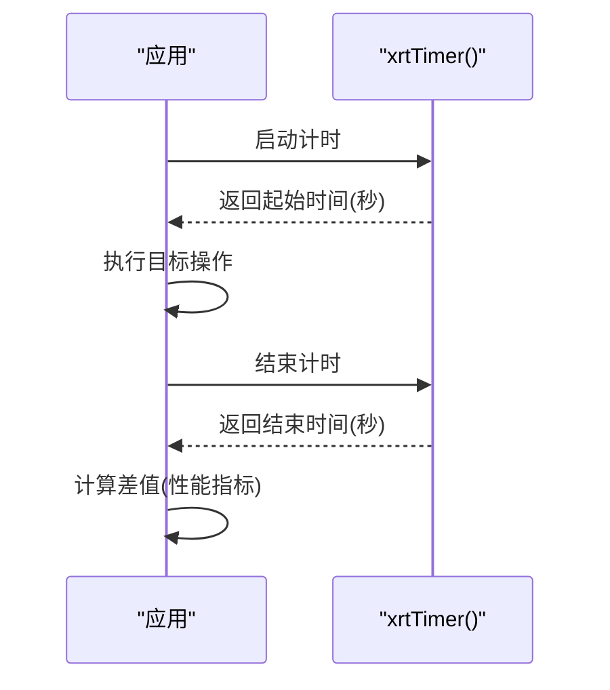
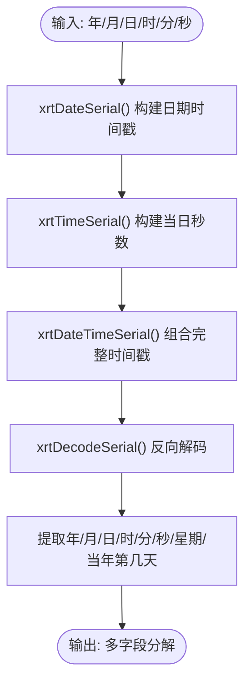
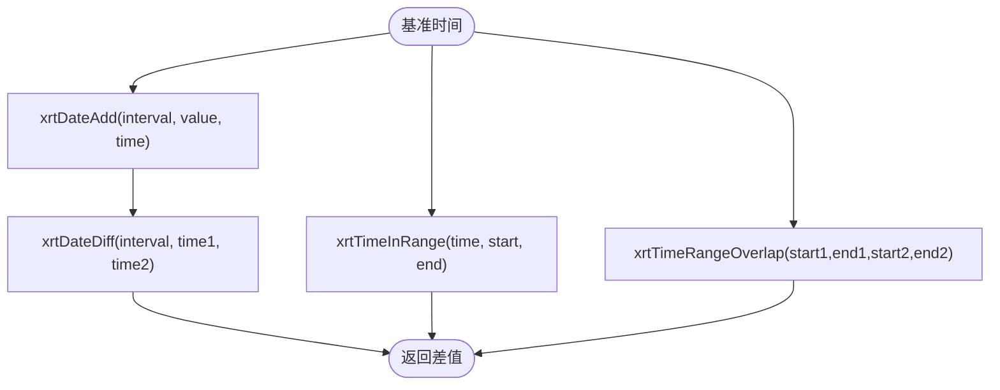
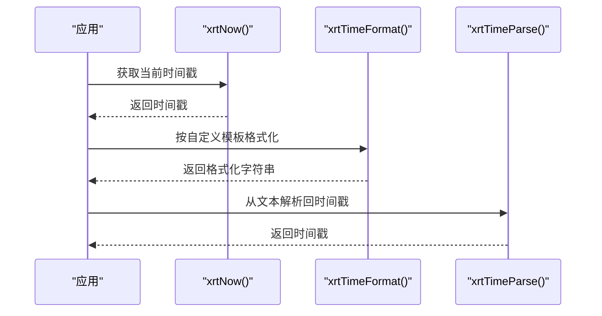
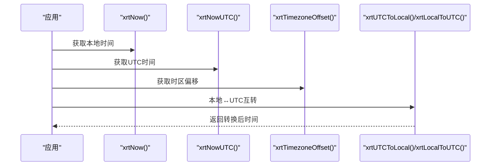
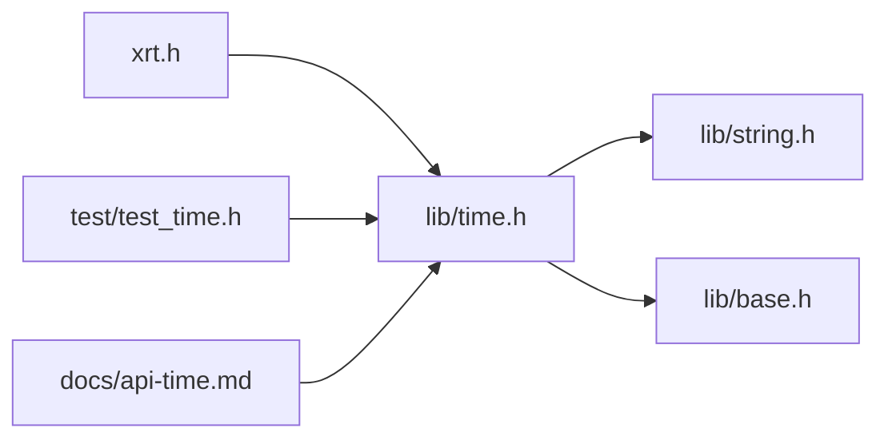

# 时间处理模块

<cite>
**本文引用的文件**
- [lib/time.h](file://lib/time.h)
- [docs/api-time.md](file://docs/api-time.md)
- [test/test_time.h](file://test/test_time.h)
- [lib/string.h](file://lib/string.h)
- [xrt.h](file://xrt.h)
- [lib/base.h](file://lib/base.h)
</cite>

## 目录
1. [简介](#简介)
2. [项目结构](#项目结构)
3. [核心组件](#核心组件)
4. [架构总览](#架构总览)
5. [详细组件分析](#详细组件分析)
6. [依赖关系分析](#依赖关系分析)
7. [性能考量](#性能考量)
8. [故障排查指南](#故障排查指南)
9. [结论](#结论)
10. [附录](#附录)

## 简介
本文件系统化梳理XRT时间处理模块的设计与实现，覆盖时间戳模型、日期格式化、时间计算、跨平台一致性与本地化支持、时区处理与精度控制，并给出在日志记录、定时任务与性能监控中的最佳实践与应用示例路径。

## 项目结构
时间处理模块主要由以下部分组成：
- 核心实现：lib/time.h 提供时间戳模型、时间构建/提取/解码、时间计算、格式化、时区与Unix时间戳互转、周与边界日期等能力。
- 文档说明：docs/api-time.md 提供API清单、常量定义、使用示例与格式化规范。
- 测试用例：test/test_time.h 展示各API的典型用法与边界行为验证。
- 辅助能力：lib/string.h 提供字符串格式化与解析（xrtFormat/xrtTimeFormat/xrtTimeParse），lib/base.h 提供内存管理（xrtFree），xrt.h 暴露对外API接口。

**图表来源**
- [lib/time.h](file://lib/time.h#L1-L1403)
- [lib/string.h](file://lib/string.h#L709-L908)
- [lib/base.h](file://lib/base.h#L41-L45)
- [xrt.h](file://xrt.h#L584-L629)
- [test/test_time.h](file://test/test_time.h#L1-L272)
- [docs/api-time.md](file://docs/api-time.md#L1-L2706)

**章节来源**
- [lib/time.h](file://lib/time.h#L1-L1403)
- [docs/api-time.md](file://docs/api-time.md#L1-L2706)
- [test/test_time.h](file://test/test_time.h#L1-L272)
- [lib/string.h](file://lib/string.h#L709-L908)
- [lib/base.h](file://lib/base.h#L41-L45)
- [xrt.h](file://xrt.h#L584-L629)

## 核心组件
- 时间戳模型与单位常量：以“秒”为基本单位，提供分钟、小时、日、年、闰年、400年周期与1970-01-01基准常量，支撑统一的时间运算。
- 时间获取与延时：xrtTimer提供高精度单调时钟；xrtSleep提供毫秒级延时。
- 时间构建与解码：xrtDateSerial/xrtTimeSerial/xrtDateTimeSerial构建时间戳；xrtDecodeSerial与提取函数（xrtYear/Month/Day/Hour/Minute/Second/Weekday/DayOfYear）完成反向解析。
- 时间计算：xrtDateAdd按年/月/日/时/分/秒/季度/周进行累加；xrtDateDiff计算差值（不支持周）。
- 格式化与解析：内置格式化（xrtTimeToStr）、自定义格式化（xrtTimeFormat）、字符串解析（xrtStrToTime/xrtTimeParse）。
- 时区与Unix时间戳：xrtNowUTC、xrtTimezoneOffset、xrtUTCToLocal、xrtLocalToUTC、xrtToUnixTime、xrtFromUnixTime。
- 边界与周：月份/年份边界（首日/末日）、ISO周数、当月/当年第几周、同日/同月/同年判断、区间包含与重叠判断。

**章节来源**
- [lib/time.h](file://lib/time.h#L35-L800)
- [docs/api-time.md](file://docs/api-time.md#L31-L2706)

## 架构总览
时间模块采用“统一时间戳 + 跨平台适配”的设计，通过平台条件编译保证高精度计时与线程安全的本地/UTC时间获取；通过常量与算法确保日期计算的正确性与可移植性；通过字符串模块提供灵活的格式化与解析能力。

**图表来源**
- [lib/time.h](file://lib/time.h#L5-L22)
- [lib/time.h](file://lib/time.h#L364-L404)
- [lib/time.h](file://lib/time.h#L454-L473)
- [lib/time.h](file://lib/time.h#L100-L140)
- [lib/time.h](file://lib/time.h#L296-L359)
- [lib/time.h](file://lib/time.h#L478-L560)
- [lib/time.h](file://lib/time.h#L642-L653)
- [lib/time.h](file://lib/time.h#L747-L798)
- [lib/string.h](file://lib/string.h#L709-L728)

## 详细组件分析

### 时间戳模型与单位常量
- 设计要点：以秒为原子单位，辅以分钟/小时/日/年/闰年/400年周期/1970-01-01基准，避免浮点误差并简化跨平台差异。
- 关键常量：XRT_TIME_MINUTE、XRT_TIME_HOUR、XRT_TIME_DAY、XRT_TIME_YEAR、XRT_TIME_LEAPYEAR、XRT_TIME_400YEAR、XRT_TIME_19700101。
- 优势：统一的加减与差值计算，便于实现xrtDateAdd/xrtDateDiff；便于与Unix时间戳互转。

**章节来源**
- [docs/api-time.md](file://docs/api-time.md#L31-L66)
- [lib/time.h](file://lib/time.h#L35-L43)

### 高精度计时与延时
- xrtTimer：Windows使用高性能计数器，类Unix使用单调时钟，返回秒级浮点数，适合性能测量与时间间隔统计。
- xrtSleep：跨平台毫秒级延时，Windows使用Sleep，类Unix使用usleep。

**图表来源**
- [lib/time.h](file://lib/time.h#L5-L22)
- [docs/api-time.md](file://docs/api-time.md#L171-L214)

**章节来源**
- [lib/time.h](file://lib/time.h#L5-L36)
- [docs/api-time.md](file://docs/api-time.md#L171-L252)

### 时间构建与解码
- 构建：xrtDateSerial支持公元前与公元时间；xrtDateTimeSerial组合日期与时间；xrtTimeSerial仅取当日秒数。
- 解码：xrtDecodeSerial一次性提取年、月、日、时、分、秒、星期、当年第几天；单字段提取函数提供便捷访问。
- 闰年与月份天数：xrtIsLeapYear、xrtDaysInMonth、xrtDaysInYear保障日期边界正确性。

**图表来源**
- [lib/time.h](file://lib/time.h#L100-L140)
- [lib/time.h](file://lib/time.h#L296-L359)
- [lib/time.h](file://lib/time.h#L41-L87)

**章节来源**
- [lib/time.h](file://lib/time.h#L92-L140)
- [lib/time.h](file://lib/time.h#L296-L359)
- [lib/time.h](file://lib/time.h#L41-L87)

### 时间计算与区间判断
- 累加：xrtDateAdd支持年/月/日/时/分/秒/季度/周，月/年处理考虑闰年与边界。
- 差值：xrtDateDiff支持年/月/日/时/分/秒/季度，不支持周。
- 区间：xrtTimeInRange判断时间是否在闭区间内；xrtTimeRangeOverlap判断两区间是否重叠。

**图表来源**
- [lib/time.h](file://lib/time.h#L478-L560)
- [lib/time.h](file://lib/time.h#L626-L637)

**章节来源**
- [lib/time.h](file://lib/time.h#L478-L560)
- [lib/time.h](file://lib/time.h#L626-L637)

### 格式化与解析
- 内置格式化：xrtTimeToStr支持YYYY-MM-DD HH:MM:SS、YYYY-MM-DD、HH:MM:SS三种标准格式。
- 自定义格式化：xrtTimeFormat支持yyyy、mm、dd、hh、nn、ss、AP/AM、星期、月份全称/简称、季度等占位符，兼容VB风格上下文识别。
- 字符串解析：xrtStrToTime支持多种常见格式；xrtTimeParse支持自定义格式，具备冗余前缀跳过与锚点定位能力。

**图表来源**
- [lib/time.h](file://lib/time.h#L454-L473)
- [lib/time.h](file://lib/time.h#L1213-L1253)
- [lib/time.h](file://lib/time.h#L1255-L1454)
- [docs/api-time.md](file://docs/api-time.md#L558-L780)

**章节来源**
- [lib/time.h](file://lib/time.h#L454-L473)
- [lib/time.h](file://lib/time.h#L1213-L1253)
- [lib/time.h](file://lib/time.h#L1255-L1454)
- [docs/api-time.md](file://docs/api-time.md#L558-L780)

### 时区处理与Unix时间戳
- UTC与本地时间：xrtNowUTC获取UTC时间；xrtUTCToLocal/xrtLocalToUTC双向转换；xrtTimezoneOffset获取本地时区偏移（秒）。
- Unix时间戳：xrtToUnixTime/xrtFromUnixTime在1970-01-01基准上进行转换，便于与外部系统对接。

**图表来源**
- [lib/time.h](file://lib/time.h#L747-L798)
- [lib/time.h](file://lib/time.h#L618-L629)
- [lib/time.h](file://lib/time.h#L642-L653)

**章节来源**
- [lib/time.h](file://lib/time.h#L747-L798)
- [lib/time.h](file://lib/time.h#L618-L653)

### 边界日期与周相关函数
- 月份/年份边界：xrtFirstDayOfMonth/xrtLastDayOfMonth、xrtFirstDayOfYear/xrtLastDayOfYear。
- 周相关：ISO周数（xrtWeekOfYear）、当月周数（xrtWeekOfMonth）、周边界（xrtFirstDayOfWeek/xrtLastDayOfWeek）。
- 同一粒度判断：xrtIsSameDay/xrtIsSameMonth/xrtIsSameYear。

**章节来源**
- [lib/time.h](file://lib/time.h#L658-L742)
- [lib/time.h](file://lib/time.h#L595-L621)

## 依赖关系分析
- 模块内聚：时间模块内部高度内聚，围绕统一时间戳模型展开，通过常量与算法保证一致性。
- 跨平台耦合：xrtTimer/xrtSleep/xrtNow/xrtNowUTC等通过条件编译屏蔽平台差异。
- 与字符串模块协作：格式化/解析依赖lib/string.h的xrtFormat与内部格式化引擎。
- 内存管理：字符串输出均需使用xrtFree释放，遵循lib/base.h的内存管理约定。

**图表来源**
- [lib/time.h](file://lib/time.h#L1-L1403)
- [lib/string.h](file://lib/string.h#L709-L908)
- [lib/base.h](file://lib/base.h#L41-L45)
- [xrt.h](file://xrt.h#L584-L629)
- [test/test_time.h](file://test/test_time.h#L1-L272)
- [docs/api-time.md](file://docs/api-time.md#L1-L2706)

**章节来源**
- [lib/time.h](file://lib/time.h#L1-L1403)
- [lib/string.h](file://lib/string.h#L709-L908)
- [lib/base.h](file://lib/base.h#L41-L45)
- [xrt.h](file://xrt.h#L584-L629)
- [test/test_time.h](file://test/test_time.h#L1-L272)
- [docs/api-time.md](file://docs/api-time.md#L1-L2706)

## 性能考量
- 高精度计时：xrtTimer使用平台最优单调时钟，避免系统时间回拨影响，适合短时延测量与性能分析。
- 时间计算复杂度：基于整数运算与常量查表，时间复杂度低；xrtDateAdd对月/年的处理涉及循环与闰年判断，通常为常数级开销。
- 格式化成本：xrtTimeFormat内部采用占位符解析与字符串拼接，建议在高频场景复用模板与缓存中间态。
- 内存管理：字符串输出需及时释放，避免泄漏；必要时结合临时内存池减少频繁分配。

[本节为通用指导，无需特定文件引用]

## 故障排查指南
- 错误设置与清理：使用xrtSetError/xrtClearError记录与清理错误状态；注意错误字符串释放策略。
- 内存释放：所有通过格式化/解析返回的字符串需调用xrtFree；测试中常见遗漏导致内存泄漏。
- 时区偏差：若发现UTC与本地时间偏差，检查xrtTimezoneOffset与夏令时设置；必要时统一使用UTC存储与展示。
- 解析失败：xrtStrToTime/xrtTimeParse返回0表示解析失败，需检查输入格式与占位符匹配。

**章节来源**
- [lib/base.h](file://lib/base.h#L89-L132)
- [lib/time.h](file://lib/time.h#L102-L104)
- [test/test_time.h](file://test/test_time.h#L172-L269)

## 结论
XRT时间处理模块通过统一的时间戳模型、完善的日期计算与格式化能力、跨平台一致的高精度计时与线程安全的时间获取，以及灵活的时区与Unix时间戳互转，为日志、定时任务与性能监控等场景提供了坚实基础。遵循本文的最佳实践与排错建议，可在多平台上稳定地实现时间相关的业务逻辑。

[本节为总结性内容，无需特定文件引用]

## 附录

### 最佳实践清单
- 日志记录
  - 使用xrtNowUTC记录UTC时间戳，配合xrtUTCToLocal在展示层转换。
  - 使用xrtTimeFormat生成人类可读的本地化时间字符串，避免直接依赖系统区域设置。
  - 对高频日志，优先使用xrtTimeToStr的内置格式，减少格式化开销。
- 定时任务
  - 使用xrtTimer进行任务执行时长测量，避免使用非单调时钟。
  - 使用xrtDateAdd设定任务触发时间，注意月/年边界与闰年。
- 性能监控
  - 使用xrtTimer测量关键路径耗时，结合xrtTimeFormat输出报告。
  - 使用xrtDateDiff计算统计周期内的事件间隔分布。

### 代码示例路径
- 高精度计时与延时：参见示例路径
  - [docs/api-time.md](file://docs/api-time.md#L188-L209)
  - [docs/api-time.md](file://docs/api-time.md#L234-L247)
- 时间构建与解码：参见示例路径
  - [docs/api-time.md](file://docs/api-time.md#L319-L339)
  - [docs/api-time.md](file://docs/api-time.md#L361-L379)
  - [docs/api-time.md](file://docs/api-time.md#L404-L425)
- 时间计算与区间判断：参见示例路径
  - [docs/api-time.md](file://docs/api-time.md#L457-L496)
  - [docs/api-time.md](file://docs/api-time.md#L518-L549)
- 格式化与解析：参见示例路径
  - [docs/api-time.md](file://docs/api-time.md#L582-L589)
  - [docs/api-time.md](file://docs/api-time.md#L617-L645)
  - [docs/api-time.md](file://docs/api-time.md#L701-L748)
  - [docs/api-time.md](file://docs/api-time.md#L781-L809)
- 时区与Unix时间戳：参见示例路径
  - [docs/api-time.md](file://docs/api-time.md#L149-L167)
  - [docs/api-time.md](file://docs/api-time.md#L120-L133)
  - [docs/api-time.md](file://docs/api-time.md#L83-L101)
  - [docs/api-time.md](file://docs/api-time.md#L2192-L2243)