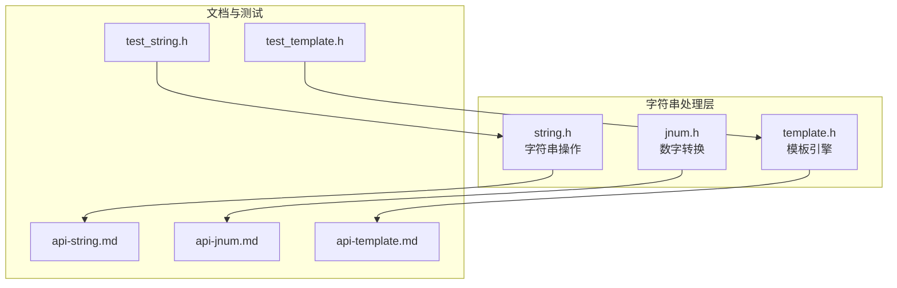
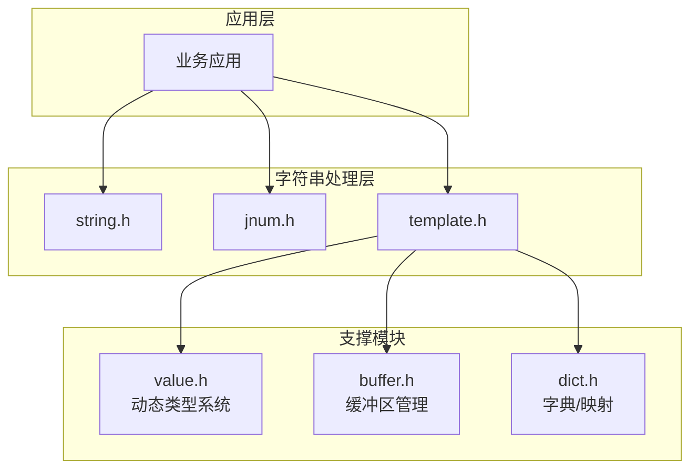
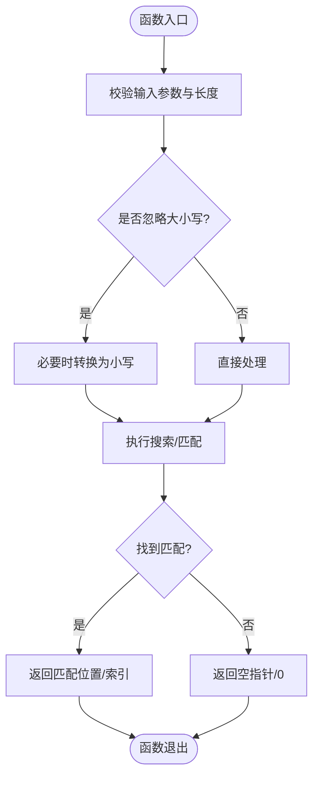
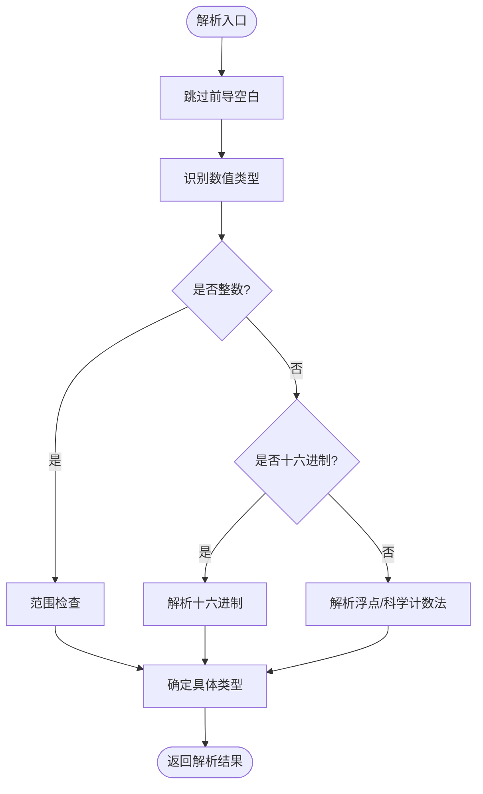
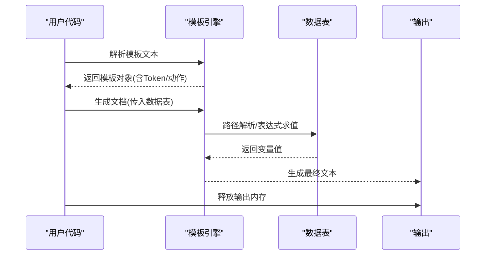
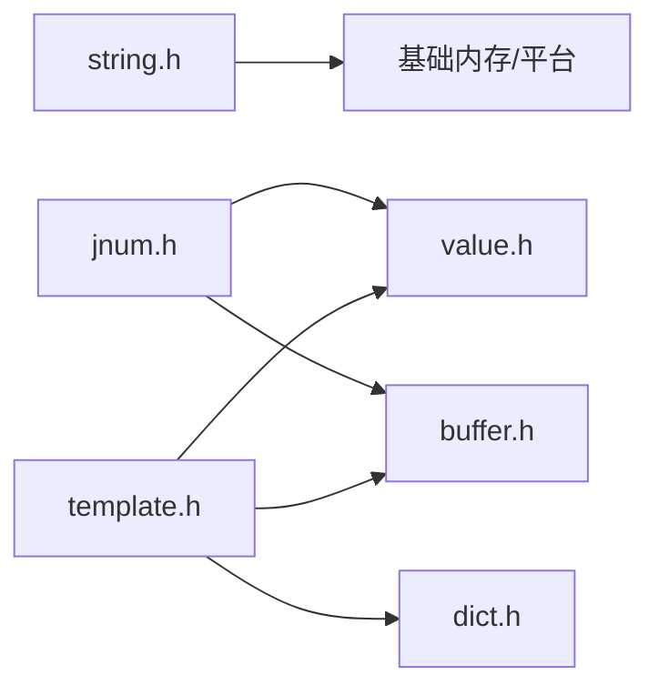

# 字符串处理层

<cite>
**本文档引用的文件**
- [lib/string.h](file://lib/string.h)
- [lib/jnum.h](file://lib/jnum.h)
- [lib/template.h](file://lib/template.h)
- [docs/api-string.md](file://docs/api-string.md)
- [docs/api-jnum.md](file://docs/api-jnum.md)
- [docs/api-template.md](file://docs/api-template.md)
- [test/test_string.h](file://test/test_string.h)
- [test/test_template.h](file://test/test_template.h)
</cite>

## 目录
1. [简介](#简介)
2. [项目结构](#项目结构)
3. [核心组件](#核心组件)
4. [架构概览](#架构概览)
5. [详细组件分析](#详细组件分析)
6. [依赖关系分析](#依赖关系分析)
7. [性能考量](#性能考量)
8. [故障排除指南](#故障排除指南)
9. [结论](#结论)
10. [附录](#附录)

## 简介
本文件系统性梳理XRT字符串处理层的三大核心模块：字符串操作(string)、数字转换(jnum)与模板引擎(template)，重点阐述各模块的算法实现、性能特征与使用场景，并提供丰富的代码示例路径与最佳实践建议。目标读者既包括需要快速上手的开发者，也包括希望深入理解实现细节的技术人员。

## 项目结构
字符串处理层位于lib目录下，分别提供独立的头文件接口与配套的API文档与测试用例：
- 字符串处理模块：lib/string.h + docs/api-string.md + test/test_string.h
- 数字转换模块：lib/jnum.h + docs/api-jnum.md
- 模板引擎模块：lib/template.h + docs/api-template.md + test/test_template.h

**图表来源**
- [lib/string.h](file://lib/string.h#L1-L1552)
- [lib/jnum.h](file://lib/jnum.h#L1-L1667)
- [lib/template.h](file://lib/template.h#L1-L2989)
- [docs/api-string.md](file://docs/api-string.md#L1-L1959)
- [docs/api-jnum.md](file://docs/api-jnum.md#L1-L569)
- [docs/api-template.md](file://docs/api-template.md#L1-L1379)
- [test/test_string.h](file://test/test_string.h#L1-L190)
- [test/test_template.h](file://test/test_template.h#L1-L628)

**章节来源**
- [lib/string.h](file://lib/string.h#L1-L1552)
- [lib/jnum.h](file://lib/jnum.h#L1-L1667)
- [lib/template.h](file://lib/template.h#L1-L2989)

## 核心组件
- 字符串操作(string)：提供复制、比较、大小写转换、搜索、裁剪、过滤、格式化、替换、分割与编码解码等能力，全面支持UTF-8多字节字符处理。
- 数字转换(jnum)：提供高性能整数/浮点数与字符串之间的转换，支持多种进制格式与JSON数字规范，具备自动类型识别与边界处理。
- 模板引擎(template)：提供轻量级模板语法，支持变量替换、条件判断、循环控制、子模板与包含等企业级应用所需的功能，并内置路径解析与表达式求值。

**章节来源**
- [docs/api-string.md](file://docs/api-string.md#L1-L200)
- [docs/api-jnum.md](file://docs/api-jnum.md#L1-L120)
- [docs/api-template.md](file://docs/api-template.md#L1-L120)

## 架构概览
字符串处理层采用“模块化接口 + 文档驱动 + 测试验证”的设计，各模块职责清晰、耦合度低，便于独立演进与集成。

**图表来源**
- [lib/string.h](file://lib/string.h#L1-L1552)
- [lib/jnum.h](file://lib/jnum.h#L1-L1667)
- [lib/template.h](file://lib/template.h#L1-L2989)

## 详细组件分析

### 字符串操作模块(string)
- 复制与内存管理
  - 提供UTF-8/UTF-16/UTF-32字符串复制，以及内存块复制，返回值均需通过统一的释放接口释放。
  - 支持原地修改与新建副本两种模式，灵活适配不同性能需求。
- 比较与搜索
  - 支持大小写敏感/不敏感比较，内部基于平台差异选择最优实现。
  - 提供子串查找与位置查询，支持UTF-8多字节字符的正确处理。
- 裁剪与过滤
  - 左/右/双向裁剪，支持自定义字符集与UTF-8多字节字符。
  - 过滤功能可按字符集移除指定字符，返回被过滤数量。
- 格式化与替换
  - 提供基于标准格式串的格式化输出，返回值需释放。
  - 替换支持全量替换，计算新长度并一次性分配内存，避免多次realloc。
- 分割与通配符
  - 支持按分隔符分割为字符串数组，支持原地修改与新建副本。
  - 通配符匹配支持*与?，其中?匹配完整UTF-8字符，时间复杂度O(n*m)。
- 编码解码与工具
  - 提供十六进制与Base64编解码，支持自定义字符表。
  - 提供随机字符串生成、相似度计算与约等于判断等实用工具。

**图表来源**
- [lib/string.h](file://lib/string.h#L155-L204)
- [lib/string.h](file://lib/string.h#L420-L451)

**章节来源**
- [lib/string.h](file://lib/string.h#L1-L1552)
- [docs/api-string.md](file://docs/api-string.md#L59-L200)
- [test/test_string.h](file://test/test_string.h#L1-L190)

### 数字转换模块(jnum)
- 类型与联合体
  - 定义了完整的数值类型枚举与联合体，涵盖布尔、32/64位整数、十六进制与双精度浮点。
- 整数与十六进制格式化
  - 提供32/64位整数与无符号整数的字符串转换，支持带前缀的十六进制输出。
  - 采用用户提供的缓冲区，避免额外内存分配，提升性能。
- 浮点数格式化
  - 提供双精度浮点数的字符串转换，支持智能精度与无尾零输出。
- 解析与类型识别
  - 支持字符串到数值的解析，自动识别十进制、十六进制、科学计数法与正负号。
  - 根据数值范围自动选择合适的类型，超出范围时降级为浮点类型。
- 性能与精度
  - 相比标准库函数，具备更高的性能与更准确的边界处理。
  - 浮点数遵循IEEE 754双精度规范，提供特殊值的字符串表示。

**图表来源**
- [lib/jnum.h](file://lib/jnum.h#L214-L270)
- [lib/jnum.h](file://lib/jnum.h#L274-L290)

**章节来源**
- [lib/jnum.h](file://lib/jnum.h#L1-L1667)
- [docs/api-jnum.md](file://docs/api-jnum.md#L1-L569)

### 模板引擎模块(template)
- 语法与Token
  - 支持变量替换、条件判断、循环控制、子模板与包含等语法，内置标识符列表与关键字注册。
  - 词法分析阶段将模板文本转换为Token列表，支持自定义括号与转义规则。
- 路径解析与表达式
  - 提供点号与数组索引的路径解析，支持嵌套属性访问与混合访问。
  - 表达式解析器支持比较、逻辑运算与括号分组，内置AST缓存提升重复表达式的执行效率。
- 模板生成
  - 将Token列表编译为动作列表，结合数据表生成最终文本，支持子模板与包含模板的组合。
  - 提供循环次数限制与错误处理机制，保障安全性与稳定性。

**图表来源**
- [lib/template.h](file://lib/template.h#L470-L587)
- [lib/template.h](file://lib/template.h#L591-L773)

**章节来源**
- [lib/template.h](file://lib/template.h#L1-L2989)
- [docs/api-template.md](file://docs/api-template.md#L1-L1379)
- [test/test_template.h](file://test/test_template.h#L1-L628)

## 依赖关系分析
- 字符串模块依赖基础内存分配与平台差异实现，确保跨平台兼容性。
- 数字模块依赖动态类型系统与缓冲区管理，保证数值转换的高效与安全。
- 模板引擎模块依赖动态类型系统、字典与缓冲区管理，支撑复杂的模板渲染与数据绑定。

**图表来源**
- [lib/string.h](file://lib/string.h#L1-L1552)
- [lib/jnum.h](file://lib/jnum.h#L1-L1667)
- [lib/template.h](file://lib/template.h#L1-L2989)

**章节来源**
- [lib/string.h](file://lib/string.h#L1-L1552)
- [lib/jnum.h](file://lib/jnum.h#L1-L1667)
- [lib/template.h](file://lib/template.h#L1-L2989)

## 性能考量
- 字符串处理
  - 大小写转换与搜索算法针对UTF-8多字节字符进行优化，避免字节级错误处理。
  - 替换与分割采用一次性内存分配策略，减少多次realloc带来的开销。
- 数字转换
  - 采用用户提供的缓冲区，避免额外内存分配；整数转换使用快速路径与查表优化。
  - 浮点数转换支持智能精度，避免冗余的尾随零输出。
- 模板引擎
  - 表达式AST缓存机制显著降低重复表达式的解析成本。
  - 循环次数限制与错误定位有助于在大规模渲染场景下的稳定运行。

**章节来源**
- [docs/api-string.md](file://docs/api-string.md#L364-L423)
- [docs/api-jnum.md](file://docs/api-jnum.md#L364-L423)
- [docs/api-template.md](file://docs/api-template.md#L1213-L1292)

## 故障排除指南
- 字符串模块
  - 确保返回的字符串指针使用统一的释放接口，避免内存泄漏。
  - 使用通配符匹配时，注意?匹配完整UTF-8字符，避免按字节误判。
- 数字模块
  - 解析前检查返回值与类型，避免使用错误的联合体成员。
  - 缓冲区大小不足会导致溢出，需根据数值范围预留足够空间。
- 模板引擎
  - 语法错误（如未闭合的语句块）会在解析阶段报告，需根据错误描述定位问题。
  - 循环次数超限会自动截断，可通过调整模板逻辑避免。

**章节来源**
- [docs/api-string.md](file://docs/api-string.md#L488-L520)
- [docs/api-jnum.md](file://docs/api-jnum.md#L488-L520)
- [docs/api-template.md](file://docs/api-template.md#L1295-L1348)

## 结论
XRT字符串处理层通过模块化设计与完善的API文档，提供了从字符串操作、数字转换到模板渲染的一体化解决方案。其在性能、兼容性与易用性方面均有出色表现，适合在企业级应用中承担高频字符串处理与模板渲染任务。建议在实际项目中结合测试用例与最佳实践，合理选择模块与参数，以获得最优的开发体验与运行性能。

## 附录
- 代码示例路径
  - 字符串处理：参见测试文件中的示例调用路径
    - [test/test_string.h](file://test/test_string.h#L1-L190)
  - 模板引擎：参见测试文件中的示例调用路径
    - [test/test_template.h](file://test/test_template.h#L1-L628)
- 相关文档
  - 字符串处理API文档：[docs/api-string.md](file://docs/api-string.md#L1-L1959)
  - 数字转换API文档：[docs/api-jnum.md](file://docs/api-jnum.md#L1-L569)
  - 模板引擎API文档：[docs/api-template.md](file://docs/api-template.md#L1-L1379)