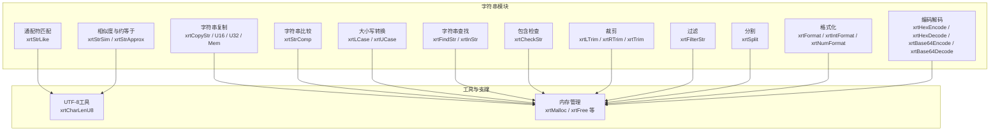
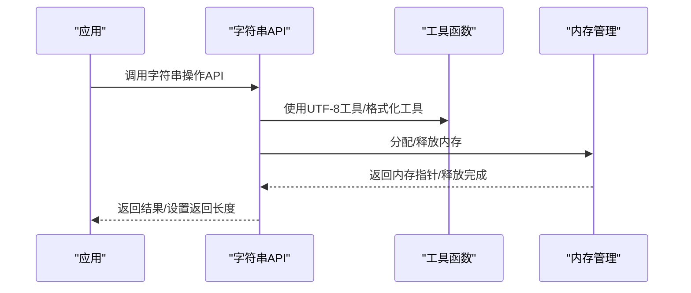
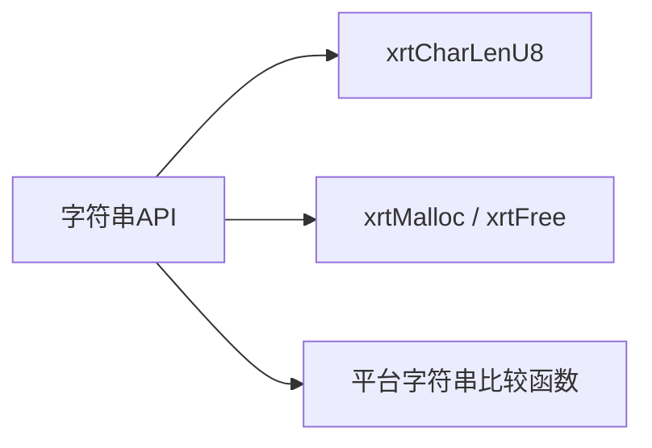

# 字符串操作模块

<cite>
**本文引用的文件列表**
- [lib/string.h](file://lib/string.h)
- [docs/api-string.md](file://docs/api-string.md)
- [test/test_string.h](file://test/test_string.h)
- [xrt.h](file://xrt.h)
- [lib/base.h](file://lib/base.h)
</cite>

## 目录
1. [简介](#简介)
2. [项目结构](#项目结构)
3. [核心组件](#核心组件)
4. [架构概览](#架构概览)
5. [详细组件分析](#详细组件分析)
6. [依赖关系分析](#依赖关系分析)
7. [性能考量](#性能考量)
8. [故障排查指南](#故障排查指南)
9. [结论](#结论)
10. [附录](#附录)

## 简介
本文件系统性梳理XRT字符串操作模块，覆盖字符串复制、比较、大小写转换、查找、包含检查、裁剪、过滤、分割、格式化、编码解码、通配符匹配、相似度与约等于等核心能力，并深入解析UTF-8多字节字符的识别与处理策略。文档同时提供丰富的使用场景与最佳实践建议，帮助开发者在保证正确性的前提下获得高性能的字符串处理体验。

## 项目结构
XRT字符串模块主要由以下部分组成：
- 字符串核心API：复制、比较、大小写转换、查找、包含检查、裁剪、过滤、分割、格式化、编码解码、通配符匹配、相似度与约等于
- UTF-8工具函数：字符长度检测
- 内存管理：统一的内存分配与释放接口
- 文档与测试：官方API文档与单元测试用例

图表来源
- [lib/string.h](file://lib/string.h#L5-L1552)
- [xrt.h](file://xrt.h#L417-L427)
- [lib/base.h](file://lib/base.h#L5-L45)

章节来源
- [lib/string.h](file://lib/string.h#L1-L1552)
- [docs/api-string.md](file://docs/api-string.md#L1-L800)
- [xrt.h](file://xrt.h#L417-L427)
- [lib/base.h](file://lib/base.h#L5-L45)

## 核心组件
- 字符串复制：支持UTF-8、UTF-16、UTF-32及通用内存复制，返回值需使用统一释放接口
- 字符串比较：支持大小写敏感/不敏感比较，跨平台兼容
- 大小写转换：ASCII范围内的字母转换，多字节字符保持不变
- 字符串查找：基于底层memmem的子串查找，支持大小写不敏感
- 包含检查：逐字节扫描，支持UTF-8多字节字符的完整匹配
- 裁剪与过滤：支持自定义字符集，正确处理UTF-8多字节字符边界
- 分割：灵活的分隔符处理，支持破坏性与非破坏性两种模式
- 格式化：整数与浮点数格式化，支持千分位、前导零、进制转换、百分比等
- 编码解码：HEX与Base64编解码，内置标准表与可选自定义表
- 通配符匹配：贪婪算法，?匹配完整UTF-8字符，*匹配任意字符序列
- 相似度与约等于：Levenshtein编辑距离相似度，支持阈值与通配符两种模式

章节来源
- [lib/string.h](file://lib/string.h#L5-L1552)
- [docs/api-string.md](file://docs/api-string.md#L59-L800)

## 架构概览
字符串模块采用“统一内存管理 + 工具函数 + 核心算法”的分层设计：
- 工具层：UTF-8字符长度检测、内存分配与错误处理
- 算法层：字符串查找、匹配、格式化、相似度计算
- 接口层：面向用户的API，提供线程安全与资源管理语义

图表来源
- [lib/string.h](file://lib/string.h#L5-L1552)
- [xrt.h](file://xrt.h#L417-L427)
- [lib/base.h](file://lib/base.h#L5-L45)

## 详细组件分析

### 字符串复制
- 功能：复制UTF-8、UTF-16、UTF-32及通用内存块
- 特性：自动计算长度、线程安全、返回值需释放
- 使用要点：bSrcRevise为false时需调用统一释放接口；U16/U32复制以字符数为单位

章节来源
- [lib/string.h](file://lib/string.h#L16-L46)
- [docs/api-string.md](file://docs/api-string.md#L59-L166)

### 字符串比较
- 功能：大小写敏感/不敏感比较
- 实现：跨平台调用stricmp/strcasecmp等系统函数
- 使用要点：iSize为0时比较全部；bCase控制是否忽略大小写

章节来源
- [lib/string.h](file://lib/string.h#L51-L78)
- [docs/api-string.md](file://docs/api-string.md#L215-L271)

### 大小写转换
- 功能：将字符串转为全小写或全大写
- 实现：仅对ASCII范围内的字母进行转换，多字节字符保持不变
- 使用要点：bSrcRevise控制是否就地修改；注意内存释放语义

章节来源
- [lib/string.h](file://lib/string.h#L83-L150)
- [docs/api-string.md](file://docs/api-string.md#L274-L357)

### 字符串查找与包含检查
- 查找：xrtFindStr返回子串指针，xrtInStr返回1基索引
- 包含检查：xrtCheckStr检查是否包含指定字符集合，支持UTF-8多字节字符
- 实现：查找基于memmem；包含检查逐字节扫描并识别多字节字符

章节来源
- [lib/string.h](file://lib/string.h#L155-L273)
- [docs/api-string.md](file://docs/api-string.md#L361-L506)

### 裁剪与过滤
- 裁剪：xrtLTrim/xrtRTrim/xrtTrim，支持自定义字符集与UTF-8多字节字符边界
- 过滤：xrtFilterStr，移除指定字符集中的字符，支持多字节字符整体过滤
- 实现：通过位掩码识别UTF-8字符边界，避免截断多字节字符

章节来源
- [lib/string.h](file://lib/string.h#L278-L705)
- [docs/api-string.md](file://docs/api-string.md#L625-L800)

### 分割
- 功能：按分隔符分割字符串，返回动态数组
- 特性：支持破坏性与非破坏性两种模式；空分隔符与空字符串的特殊处理
- 使用要点：返回数组需释放；注意内存布局与空元素处理

章节来源
- [lib/string.h](file://lib/string.h#L776-L900)
- [docs/api-string.md](file://docs/api-string.md#L800-L900)

### 格式化
- 字符串格式化：xrtFormat
- 数值格式化：xrtIntFormat（整数）、xrtNumFormat（浮点数）
- 特性：支持千分位、前导零、进制转换（2/8/10/16）、百分比、正号显示

章节来源
- [lib/string.h](file://lib/string.h#L709-L1451)
- [docs/api-string.md](file://docs/api-string.md#L900-L1451)

### 编码解码
- HEX：xrtHexEncode/xrtHexDecode
- Base64：xrtBase64Encode/xrtBase64Decode，支持自定义编码表
- 特性：HEX按字节映射；Base64按4输入字节映射为3输出字节，自动处理填充

章节来源
- [lib/string.h](file://lib/string.h#L929-L1063)
- [docs/api-string.md](file://docs/api-string.md#L1451-L1552)

### 通配符匹配
- 功能：xrtStrLike，支持*与?通配符
- 算法：贪婪匹配，?匹配完整UTF-8字符，*匹配任意字符序列
- 复杂度：最坏O(n*m)，空间O(1)

章节来源
- [lib/string.h](file://lib/string.h#L1069-L1157)
- [docs/api-string.md](file://docs/api-string.md#L510-L622)

### 相似度与约等于
- 相似度：xrtStrSim，基于Levenshtein编辑距离，返回0.0-1.0
- 约等于：xrtStrApprox，支持通配符与相似度两种模式，阈值可配置
- 性能：相似度计算使用一维DP，空间O(min(m,n))

章节来源
- [lib/string.h](file://lib/string.h#L1456-L1550)
- [docs/api-string.md](file://docs/api-string.md#L1550-L1552)

## 依赖关系分析
- 工具函数依赖：xrtCharLenU8用于通配符匹配与裁剪/过滤中的UTF-8字符边界识别
- 内存管理依赖：所有返回新内存的API均依赖统一的内存分配/释放接口
- 平台兼容：字符串比较在Windows与类Unix平台分别调用系统函数

图表来源
- [lib/string.h](file://lib/string.h#L1069-L1157)
- [xrt.h](file://xrt.h#L417-L427)
- [lib/base.h](file://lib/base.h#L5-L45)

章节来源
- [lib/string.h](file://lib/string.h#L1069-L1157)
- [xrt.h](file://xrt.h#L417-L427)
- [lib/base.h](file://lib/base.h#L5-L45)

## 性能考量
- 字符串查找：xrtFindStr/xrtInStr基于memmem，适合一般场景；若频繁在超长文本中查找，可考虑预处理或构建索引
- 通配符匹配：xrtStrLike为贪婪算法，最坏O(n*m)；对?匹配完整UTF-8字符，避免字节级误判
- 裁剪与过滤：逐字节扫描，多字节字符按整体处理，避免截断；对于超长字符串，建议优先选择破坏性版本以减少内存拷贝
- 相似度计算：xrtStrSim使用一维DP，空间O(min(m,n))，适合中等长度字符串；对极长字符串可考虑分段或阈值提前终止
- 编码解码：HEX与Base64均为线性复杂度；Base64解码包含校验与填充处理，异常输入会触发错误设置

章节来源
- [lib/string.h](file://lib/string.h#L1069-L1550)
- [docs/api-string.md](file://docs/api-string.md#L510-L622)

## 故障排查指南
- 内存泄漏：确保调用返回新内存的API后，按约定释放；破坏性API通常无需释放
- 错误信息：统一通过错误设置接口记录；可通过错误查询接口获取
- UTF-8异常：遇到孤立的续字节或异常字节时，模块会跳过处理；如出现乱码，检查输入编码与边界
- 通配符匹配失败：确认模式与大小写设置；?匹配完整UTF-8字符，*匹配任意序列

章节来源
- [lib/base.h](file://lib/base.h#L88-L132)
- [lib/string.h](file://lib/string.h#L1069-L1157)

## 结论
XRT字符串模块提供了全面而高效的字符串处理能力，覆盖复制、比较、转换、查找、裁剪、过滤、分割、格式化、编码解码、通配符匹配与相似度计算等常用场景。其对UTF-8多字节字符的正确识别与处理，以及统一的内存管理与错误处理机制，使得在多语言环境下也能稳定运行。建议在实际使用中结合具体场景选择合适的API，并遵循内存释放与错误处理的最佳实践。

## 附录

### 常见使用场景与示例路径
- 大小写不敏感比较：参考测试用例中的大小写比较示例
- Unicode字符处理：参考通配符匹配与裁剪/过滤对UTF-8字符边界的处理
- 内存优化技巧：优先使用破坏性API减少拷贝；合理设置分隔符与字符集

章节来源
- [test/test_string.h](file://test/test_string.h#L5-L190)
- [docs/api-string.md](file://docs/api-string.md#L510-L800)