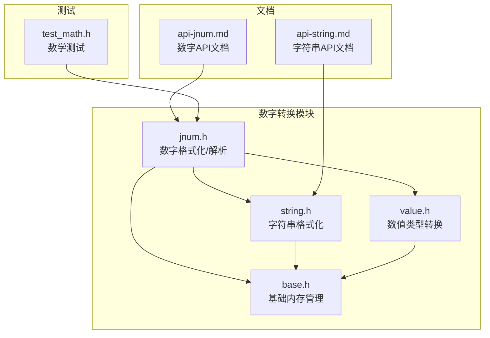
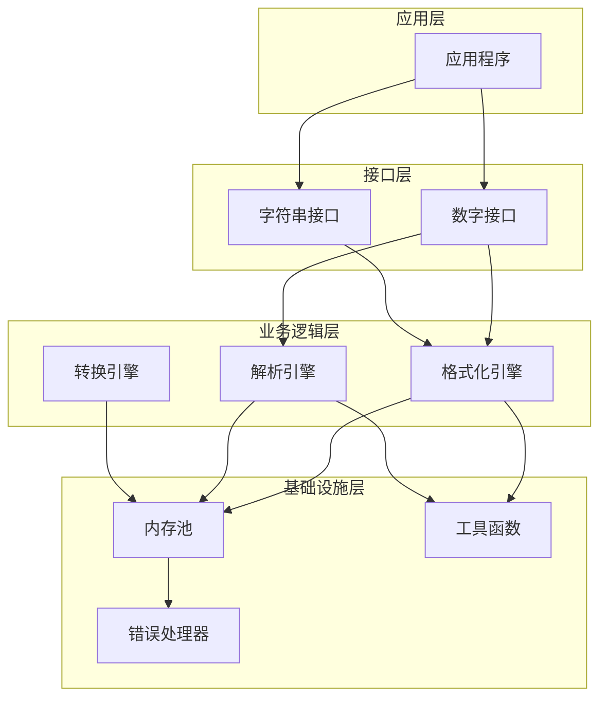
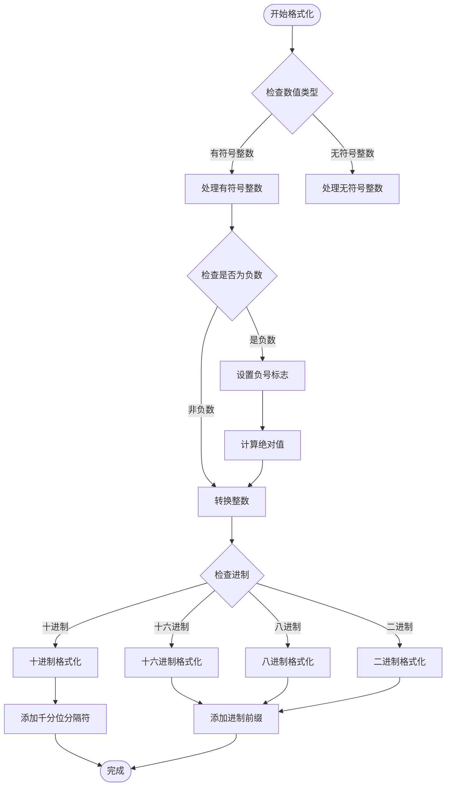
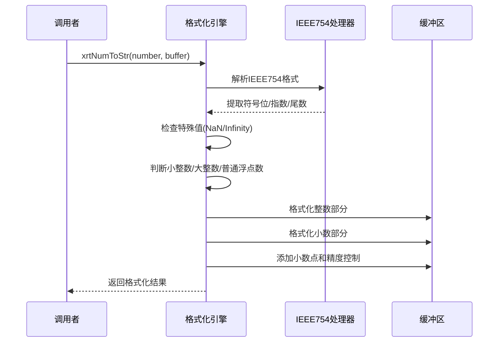
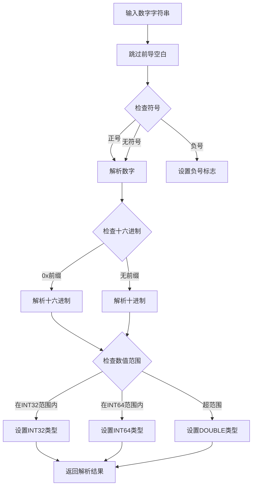
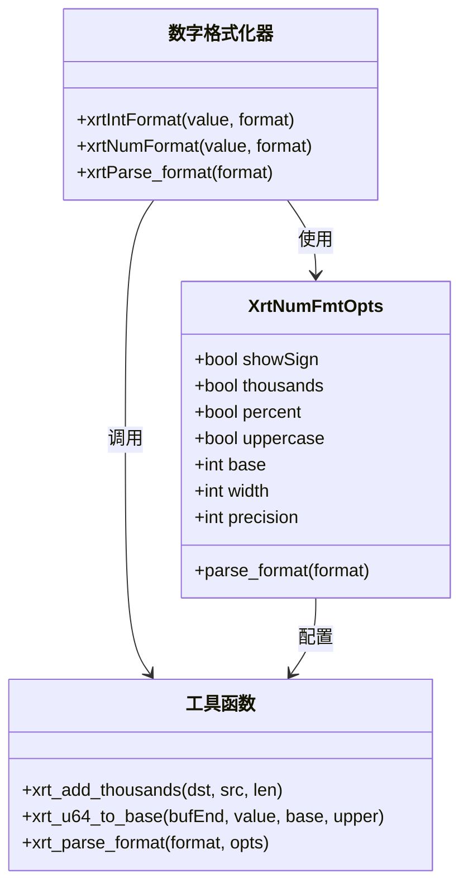
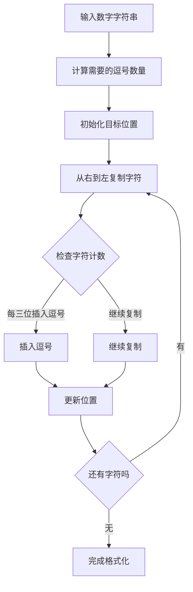
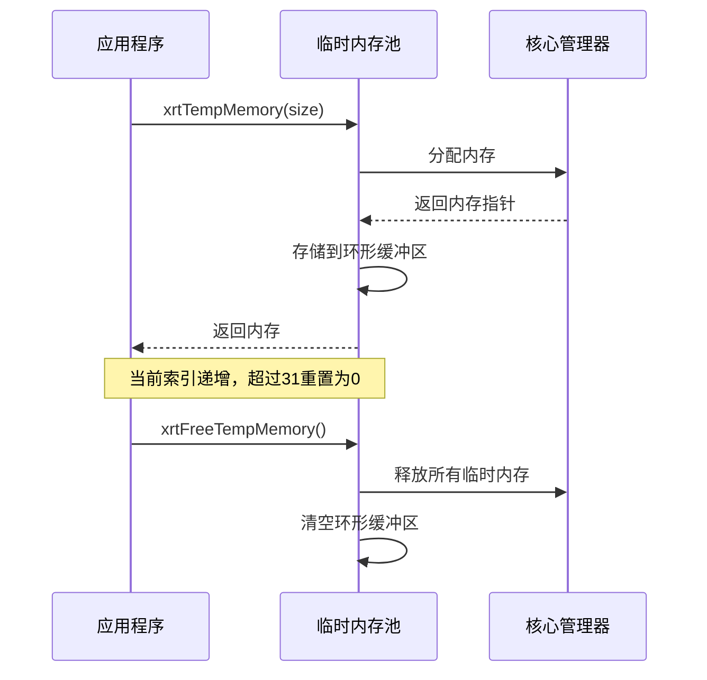
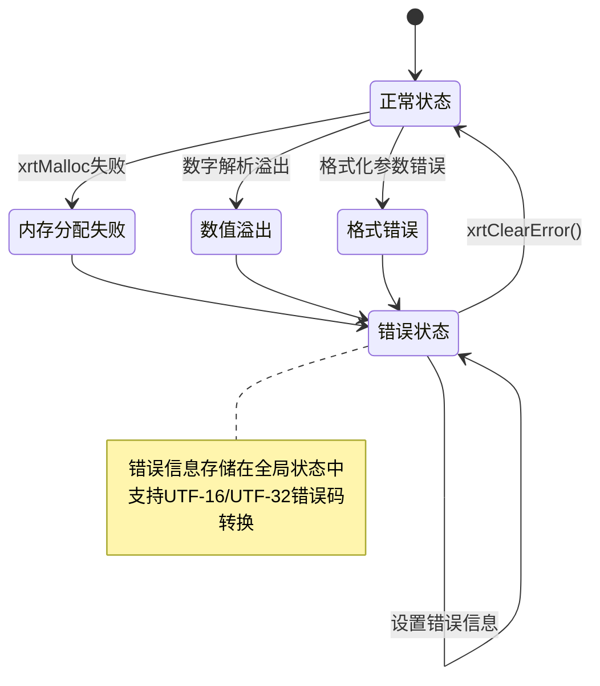
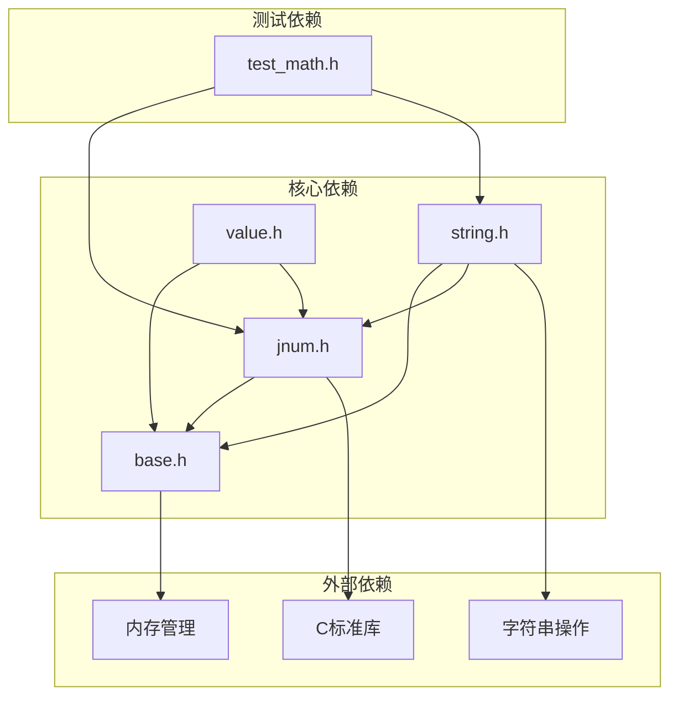

# 数字转换模块

<cite>
**本文档引用的文件**
- [lib/jnum.h](file://lib/jnum.h)
- [lib/string.h](file://lib/string.h)
- [lib/base.h](file://lib/base.h)
- [lib/value.h](file://lib/value.h)
- [docs/api-jnum.md](file://docs/api-jnum.md)
- [docs/api-string.md](file://docs/api-string.md)
- [test/test_math.h](file://test/test_math.h)
</cite>

## 目录
1. [简介](#简介)
2. [项目结构](#项目结构)
3. [核心组件](#核心组件)
4. [架构概览](#架构概览)
5. [详细组件分析](#详细组件分析)
6. [依赖关系分析](#依赖关系分析)
7. [性能考虑](#性能考虑)
8. [故障排除指南](#故障排除指南)
9. [结论](#结论)
10. [附录](#附录)

## 简介
XRT数字转换模块是XRT库中负责数值格式化、解析和进制转换的核心子系统。该模块提供了高性能的整数和浮点数格式化输出，支持十进制、十六进制、八进制、二进制等多种进制转换；实现了从字符串到各种数值类型的智能解析；集成了国际化数字格式化支持，包括千分位分隔符、小数点符号等本地化处理；具备完善的精度控制、溢出处理和错误恢复机制。

## 项目结构
数字转换模块主要分布在以下核心文件中：



**图表来源**
- [lib/jnum.h](file://lib/jnum.h#L1-L175)
- [lib/string.h](file://lib/string.h#L1-L200)
- [lib/base.h](file://lib/base.h#L1-L132)

**章节来源**
- [lib/jnum.h](file://lib/jnum.h#L1-L175)
- [lib/string.h](file://lib/string.h#L1-L200)
- [lib/base.h](file://lib/base.h#L1-L132)

## 核心组件
数字转换模块由四个核心组件构成：

### 1. 数字格式化引擎
- **整数格式化**：支持32位和64位整数的十进制格式化
- **十六进制格式化**：支持无符号整数的十六进制格式化
- **浮点数格式化**：支持双精度浮点数的科学计数法和普通格式化
- **进制转换**：支持2、8、10、16进制的任意转换

### 2. 数字解析引擎
- **多格式解析**：支持十进制整数、十六进制、浮点数、科学计数法
- **类型自动识别**：根据数值范围自动识别INT32、INT64、DOUBLE类型
- **十六进制解析**：支持0xFF格式的十六进制数解析
- **溢出检测**：完整的溢出检测和处理机制

### 3. 国际化格式化
- **千分位分隔符**：支持自定义千分位分隔符
- **小数点符号**：支持本地化的小数点符号
- **百分比格式**：支持百分比格式化和解析
- **正负号显示**：可配置的正负号显示策略

### 4. 内存管理与错误处理
- **临时内存池**：高效的临时内存分配和回收
- **错误状态管理**：完整的错误状态跟踪和报告
- **内存泄漏防护**：严格的内存分配和释放管理

**章节来源**
- [lib/jnum.h](file://lib/jnum.h#L292-L466)
- [lib/string.h](file://lib/string.h#L1165-L1272)
- [lib/base.h](file://lib/base.h#L49-L132)

## 架构概览
数字转换模块采用分层架构设计，各组件职责清晰，耦合度低：



**图表来源**
- [lib/jnum.h](file://lib/jnum.h#L1000-L1199)
- [lib/string.h](file://lib/string.h#L1344-L1451)
- [lib/base.h](file://lib/base.h#L49-L84)

## 详细组件分析

### 数字格式化引擎

#### 整数格式化实现
整数格式化引擎提供了多种进制的格式化能力：



**图表来源**
- [lib/jnum.h](file://lib/jnum.h#L292-L361)
- [lib/jnum.h](file://lib/jnum.h#L436-L466)
- [lib/string.h](file://lib/string.h#L1274-L1342)

#### 浮点数格式化实现
浮点数格式化采用了IEEE 754标准的双精度浮点数处理：



**图表来源**
- [lib/jnum.h](file://lib/jnum.h#L1002-L1066)

**章节来源**
- [lib/jnum.h](file://lib/jnum.h#L292-L466)
- [lib/string.h](file://lib/string.h#L1274-L1451)

### 数字解析引擎

#### 数字解析算法
数字解析引擎实现了高效的数字字符串解析：



**图表来源**
- [lib/jnum.h](file://lib/jnum.h#L1440-L1586)
- [lib/jnum.h](file://lib/jnum.h#L1068-L1104)

#### 类型识别机制
解析引擎具备智能的类型识别能力：

| 数值范围 | 类型识别 | 处理方式 |
|---------|---------|---------|
| -2,147,483,648 到 2,147,483,647 | JNUM_INT | 直接存储为32位整数 |
| -9,223,372,036,854,775,808 到 9,223,372,036,854,775,807 | JNUM_LINT | 存储为64位整数 |
| 超出64位范围 | JNUM_DOUBLE | 转换为双精度浮点数 |
| 十六进制数 | JNUM_HEX/LHEX | 识别为十六进制类型 |

**章节来源**
- [lib/jnum.h](file://lib/jnum.h#L1440-L1586)
- [docs/api-jnum.md](file://docs/api-jnum.md#L212-L270)

### 国际化格式化支持

#### 格式化选项系统
字符串格式化模块提供了灵活的格式化选项：



**图表来源**
- [lib/string.h](file://lib/string.h#L1169-L1226)
- [lib/string.h](file://lib/string.h#L1255-L1272)

#### 千分位分隔符处理
千分位分隔符的处理采用了高效的算法：



**图表来源**
- [lib/string.h](file://lib/string.h#L1255-L1272)

**章节来源**
- [lib/string.h](file://lib/string.h#L1165-L1272)
- [docs/api-string.md](file://docs/api-string.md#L1171-L1237)

### 内存管理与错误处理

#### 临时内存池设计
XRT采用了高效的临时内存池机制：



**图表来源**
- [lib/base.h](file://lib/base.h#L49-L84)

#### 错误处理机制
完整的错误处理体系确保了系统的稳定性：



**图表来源**
- [lib/base.h](file://lib/base.h#L88-L132)

**章节来源**
- [lib/base.h](file://lib/base.h#L49-L132)

## 依赖关系分析

### 组件依赖图
数字转换模块的组件间依赖关系如下：



**图表来源**
- [lib/jnum.h](file://lib/jnum.h#L1-L175)
- [lib/string.h](file://lib/string.h#L1-L200)
- [lib/base.h](file://lib/base.h#L1-L132)

### 关键依赖关系
1. **jnum.h** 依赖于 **base.h** 的内存管理功能
2. **string.h** 同时依赖于 **jnum.h** 和 **base.h**
3. **value.h** 依赖于 **jnum.h** 的数值转换功能
4. **测试模块** 依赖于所有核心模块的功能

**章节来源**
- [lib/jnum.h](file://lib/jnum.h#L1-L175)
- [lib/string.h](file://lib/string.h#L1-L200)
- [lib/value.h](file://lib/value.h#L1-L800)

## 性能考虑

### 性能优化策略
数字转换模块采用了多项性能优化技术：

#### 1. 高效的数字格式化算法
- **查表法**：使用预计算的查找表加速数字转换
- **批量处理**：一次性处理多个数字字符，减少循环开销
- **分支预测优化**：通过算法设计减少条件分支

#### 2. 内存管理优化
- **临时内存池**：避免频繁的内存分配和释放
- **内存复用**：在格式化过程中复用缓冲区
- **零拷贝设计**：在可能的情况下避免不必要的数据复制

#### 3. 缓存友好的数据结构
- **紧凑的数据布局**：减少内存占用和缓存未命中的概率
- **顺序访问模式**：优化CPU缓存性能

### 性能基准测试
模块提供了基本的性能测试框架：

```c
// 性能测试示例
void PerformanceTest() {
    const int iterations = 1000000;
    clock_t start, end;
    
    // 测试整数格式化性能
    start = clock();
    for (int i = 0; i < iterations; i++) {
        char buffer[32];
        xrtI64ToStr(i, buffer);
    }
    end = clock();
    printf("整数格式化: %f 秒\n", ((double)(end - start)) / CLOCKS_PER_SEC);
}
```

**章节来源**
- [lib/jnum.h](file://lib/jnum.h#L94-L118)
- [lib/string.h](file://lib/string.h#L1255-L1272)
- [test/test_math.h](file://test/test_math.h#L1-L145)

## 故障排除指南

### 常见问题及解决方案

#### 1. 内存分配失败
**症状**：格式化函数返回NULL
**原因**：内存不足或内存池耗尽
**解决方案**：
- 检查系统可用内存
- 调用 `xrtFreeTempMemory()` 释放临时内存
- 减少同时进行的格式化操作数量

#### 2. 数值溢出
**症状**：解析结果异常或返回错误
**原因**：输入数值超出目标类型的表示范围
**解决方案**：
- 检查输入数值的有效性
- 使用更大范围的数据类型
- 实现适当的边界检查

#### 3. 格式化精度丢失
**症状**：浮点数格式化结果不准确
**原因**：双精度浮点数的精度限制
**解决方案**：
- 调整精度设置
- 使用更高精度的数据类型
- 实施适当的舍入策略

#### 4. 国际化格式化问题
**症状**：千分位分隔符或小数点符号显示错误
**原因**：本地化设置不正确
**解决方案**：
- 检查系统区域设置
- 显式指定本地化参数
- 验证字符编码设置

**章节来源**
- [lib/base.h](file://lib/base.h#L88-L132)
- [lib/jnum.h](file://lib/jnum.h#L1440-L1586)
- [lib/string.h](file://lib/string.h#L1344-L1451)

## 结论
XRT数字转换模块是一个设计精良、功能完备的数值处理系统。它通过高效的算法实现、完善的错误处理机制和灵活的国际化支持，为应用程序提供了可靠的数字转换能力。模块的分层架构设计确保了良好的可维护性和扩展性，而全面的性能优化策略则保证了在各种应用场景下的高效运行。

该模块特别适合需要高性能数值处理的应用程序，如金融系统、科学计算软件和数据分析工具等。其丰富的API接口和灵活的配置选项能够满足大多数数字格式化和解析需求。

## 附录

### API参考

#### 数字格式化API
- `xrtI32ToStr(int32_t num, char* buffer)` - 32位整数格式化
- `xrtI64ToStr(int64_t num, char* buffer)` - 64位整数格式化
- `xrtU32ToStr(uint32_t num, char* buffer)` - 32位无符号整数十六进制格式化
- `xrtU64ToStr(uint64_t num, char* buffer)` - 64位无符号整数十六进制格式化
- `xrtNumToStr(double num, char* buffer)` - 浮点数格式化

#### 数字解析API
- `xrtParseNum(const char* str, jnum_type_t* type, jnum_value_t* value)` - 数字解析
- `xrtStrToI32(const char* str)` - 字符串转32位整数
- `xrtStrToI64(const char* str)` - 字符串转64位整数
- `xrtStrToNum(const char* str)` - 字符串转浮点数

#### 字符串格式化API
- `xrtIntFormat(int64 value, str format)` - 整数格式化
- `xrtNumFormat(double value, str format)` - 数字格式化
- `xrtParse_format(str format, XrtNumFmtOpts* opts)` - 格式解析

**章节来源**
- [docs/api-jnum.md](file://docs/api-jnum.md#L198-L366)
- [docs/api-string.md](file://docs/api-string.md#L1171-L1237)