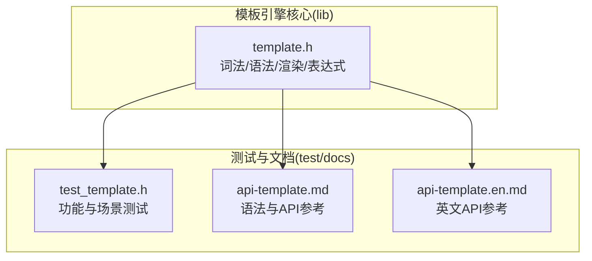
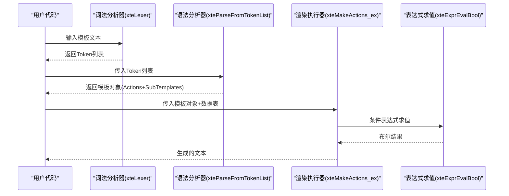
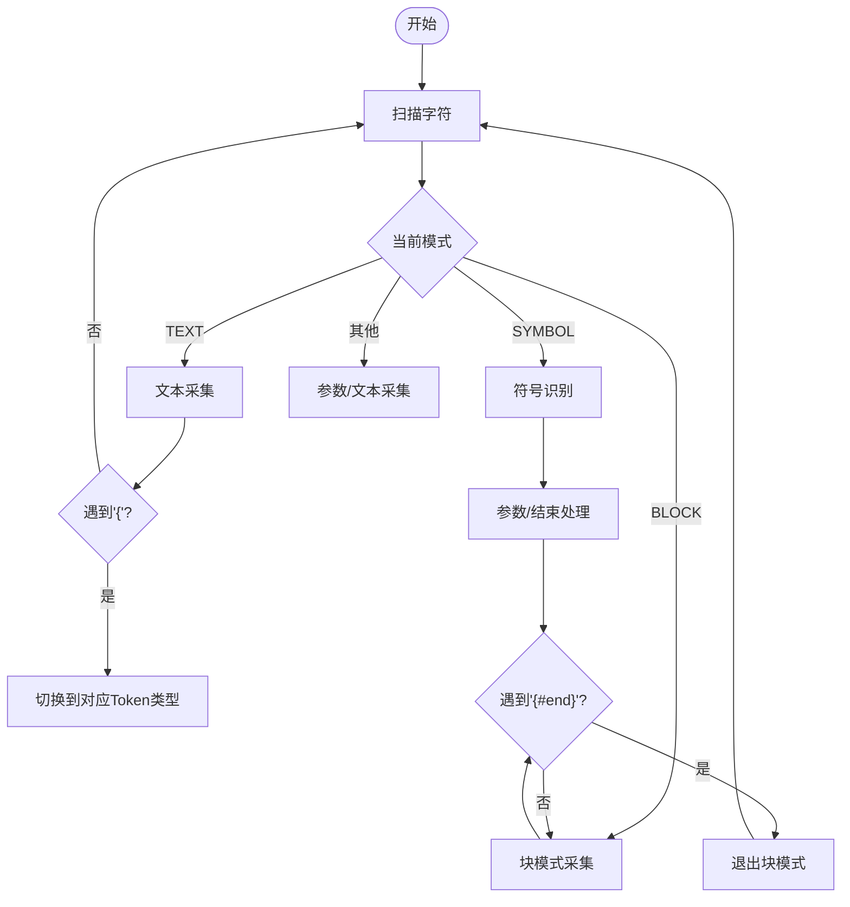
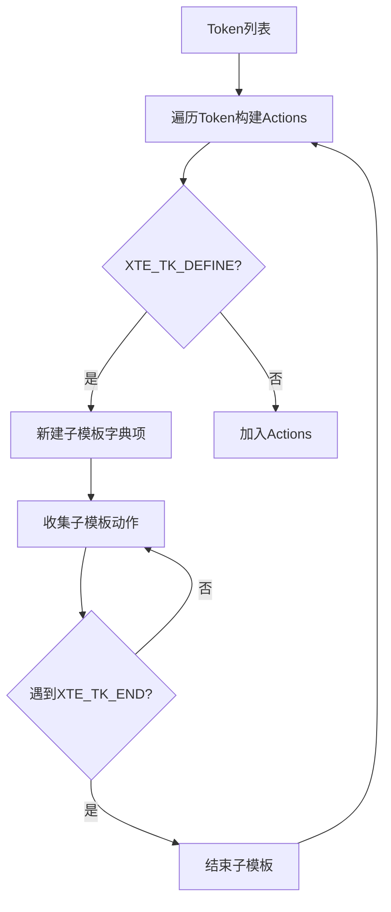
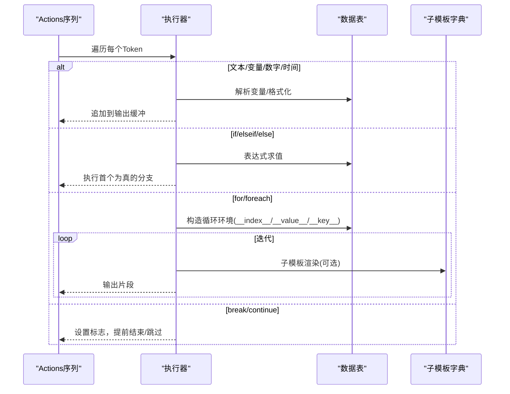
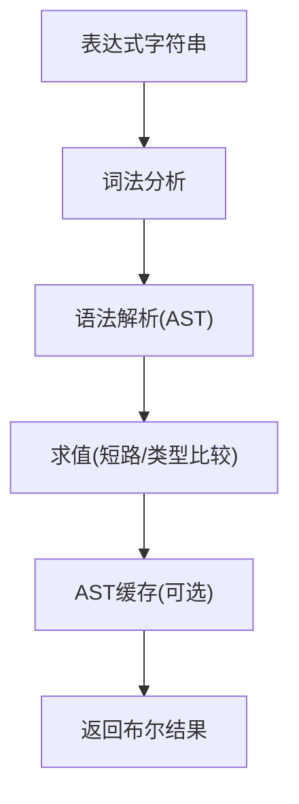
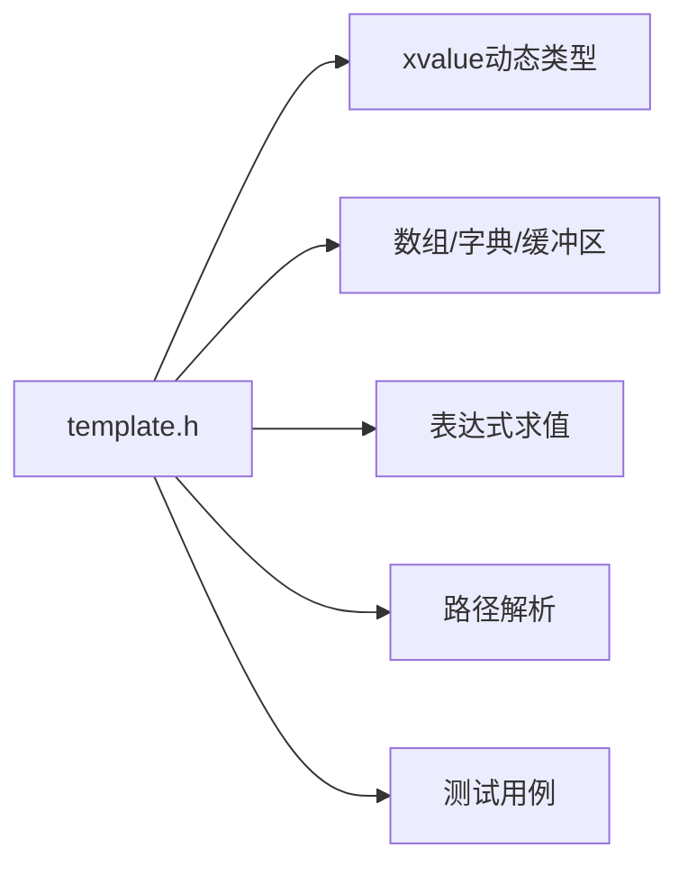

# 模板引擎模块

<cite>
**本文档引用的文件**
- [lib/template.h](file://lib/template.h)
- [test/test_template.h](file://test/test_template.h)
- [docs/api-template.md](file://docs/api-template.md)
- [docs/api-template.en.md](file://docs/api-template.en.md)
</cite>

## 目录
1. [简介](#简介)
2. [项目结构](#项目结构)
3. [核心组件](#核心组件)
4. [架构总览](#架构总览)
5. [详细组件分析](#详细组件分析)
6. [依赖关系分析](#依赖关系分析)
7. [性能考虑](#性能考虑)
8. [故障排查指南](#故障排查指南)
9. [结论](#结论)
10. [附录](#附录)

## 简介
本文件系统性阐述 XRT 模板引擎模块的设计与实现，重点覆盖以下方面：
- 模板语法解析与词法分析（SAX 模式、事件驱动）
- 变量替换、路径解析、数据绑定与渲染流程
- 控制流处理（条件判断、循环、break/continue）
- 子模板嵌套与作用域管理
- 高级特性（表达式 AST 缓存、循环次数限制、错误定位）
- 企业级应用场景（报表生成、邮件模板、代码生成、配置文件生成）
- 性能优化策略与调试技巧

## 项目结构
模板引擎位于 lib 目录下的 template.h，配套测试与文档分别在 test 与 docs 目录中。整体采用“轻量级”设计，核心能力集中在词法/语法解析、表达式求值、渲染执行与错误报告。

图表来源
- [lib/template.h](file://lib/template.h#L1-L120)
- [test/test_template.h](file://test/test_template.h#L1-L628)
- [docs/api-template.md](file://docs/api-template.md#L1-L120)
- [docs/api-template.en.md](file://docs/api-template.en.md#L1-L120)

章节来源
- [lib/template.h](file://lib/template.h#L1-L120)
- [test/test_template.h](file://test/test_template.h#L1-L60)
- [docs/api-template.md](file://docs/api-template.md#L1-L60)

## 核心组件
- 词法分析器：将模板文本切分为 Token 列表，支持转义、注释、符号识别与块模式采集。
- 语法分析器：将 Token 列表转换为可执行的动作序列（Actions），并建立子模板字典。
- 渲染执行器：按动作序列遍历执行，支持变量替换、条件判断、循环、break/continue、子模板调用等。
- 表达式解析器：词法/语法/求值三段式，支持 AST 缓存，提供布尔求值便捷接口。
- 路径解析器：支持 a.b.c、arr[0]、obj["key"] 等多级访问与表/数组混合迭代。
- 错误报告：统一的错误码与定位信息，便于定位语法与运行期问题。

章节来源
- [lib/template.h](file://lib/template.h#L240-L587)
- [lib/template.h](file://lib/template.h#L858-L968)
- [lib/template.h](file://lib/template.h#L1301-L2121)
- [lib/template.h](file://lib/template.h#L2125-L2989)
- [docs/api-template.md](file://docs/api-template.md#L1333-L1348)

## 架构总览
模板引擎采用“事件驱动”的 SAX 模式：词法阶段产生 Token 事件，语法阶段将 Token 转换为可执行动作，渲染阶段按动作序列推进执行。控制流与数据绑定贯穿其中，形成清晰的职责分离。

图表来源
- [lib/template.h](file://lib/template.h#L1049-L1062)
- [lib/template.h](file://lib/template.h#L858-L968)
- [lib/template.h](file://lib/template.h#L1301-L2121)
- [lib/template.h](file://lib/template.h#L2943-L2987)

## 详细组件分析

### 词法分析器（SAX 模式与事件驱动）
- 模式识别：TEXT、COMMENT、VAR、NUM、TIME、BOOL、ARR、PROC、SUBTEMPLATE、SYMBOL（含 BLOCK 模式）。
- 转义规则：支持 {{、\}、\、\: 等语句内转义；注释块不处理转义符。
- 标识符注册：通过关键字列表支持 {#xxx} 语法，内置 if/elseif/else/for/foreach/break/continue/include/define/script 等。
- 错误处理：统一错误码与行列定位，便于定位未闭合语句、参数过多、未定义标识符等问题。

图表来源
- [lib/template.h](file://lib/template.h#L282-L587)
- [lib/template.h](file://lib/template.h#L979-L1015)

章节来源
- [lib/template.h](file://lib/template.h#L240-L587)
- [lib/template.h](file://lib/template.h#L979-L1015)

### 语法分析器（动作序列与子模板）
- 将 Token 列表转换为 Actions（可执行动作序列），同时维护 SubTemplates 字典。
- define 块内收集子模板，else/elseif 也加入相应动作序列。
- 未闭合 define 块会被检测并报告错误。

图表来源
- [lib/template.h](file://lib/template.h#L858-L968)

章节来源
- [lib/template.h](file://lib/template.h#L858-L968)

### 渲染执行器（变量替换、控制流、子模板）
- 支持变量替换（字符串/数字/时间）、布尔条件选择、数组/表迭代、子模板调用、include 引用。
- 控制流：if/elseif/else（嵌套支持）、for（计次循环，含反向与步长修复）、foreach（数组/表迭代，含 break/continue）。
- 作用域：支持根作用域与环境变量，子模板内部可用 __self__ 访问代入值。
- 循环保护：最大迭代次数限制（默认 100,000），防止无限循环。

图表来源
- [lib/template.h](file://lib/template.h#L1301-L2121)

章节来源
- [lib/template.h](file://lib/template.h#L1301-L2121)

### 表达式解析器（AST 缓存与求值）
- 词法：支持数字、字符串、布尔、标识符（含路径）、括号与比较/逻辑运算符。
- 语法：优先级爬升法构建 AST，支持深度限制防止栈溢出。
- 求值：短路求值（and/or），类型安全比较，null 值处理。
- 缓存：表达式 AST 缓存，相同表达式重复求值时复用 AST。

图表来源
- [lib/template.h](file://lib/template.h#L2125-L2989)

章节来源
- [lib/template.h](file://lib/template.h#L2125-L2989)

### 路径解析器（多级访问与表/数组迭代）
- 支持 a.b.c、arr[0]、obj["key"]、arr[0].name 等组合访问。
- 优先在当前作用域查找，其次根作用域，最后环境变量。
- foreach 表迭代使用回调遍历键值对，提供 __key__/__value__ 内置变量。

章节来源
- [lib/template.h](file://lib/template.h#L603-L773)
- [lib/template.h](file://lib/template.h#L1212-L1270)

## 依赖关系分析
- 模板引擎依赖动态类型系统（xvalue）与容器（数组/字典/缓冲区）。
- 表达式求值依赖路径解析与类型判定。
- 渲染执行器依赖表达式求值、路径解析与子模板字典。
- 测试用例覆盖语法、控制流、循环限制、表达式缓存等关键场景。

图表来源
- [lib/template.h](file://lib/template.h#L1-L120)
- [test/test_template.h](file://test/test_template.h#L1-L628)

章节来源
- [lib/template.h](file://lib/template.h#L1-L120)
- [test/test_template.h](file://test/test_template.h#L1-L628)

## 性能考虑
- 重用模板对象：解析一次，多次渲染，避免重复词法/语法开销。
- 表达式 AST 缓存：相同表达式仅解析一次，显著降低重复求值成本。
- 预编译模板：应用启动时预编译常用模板，运行时直接渲染。
- 循环次数限制：默认 100,000 次，防止巨大循环造成资源耗尽。
- 内存管理：统一释放接口（xteLexerFree/xteParseFree/xrtFree），避免泄漏。

章节来源
- [docs/api-template.md](file://docs/api-template.md#L1213-L1294)

## 故障排查指南
- 常见错误码与含义：内存分配失败、Token 列表追加失败、无法识别符号、空符号、参数过多、语句未结束、未定义标识符、缺失参数、define 嵌套、语法错误。
- 定位方法：利用模板对象中的错误行/列/位置信息，结合错误描述快速定位。
- 常见问题：
  - 忘记 {#end}：语法分析阶段会检测并报错。
  - 参数过多/过少：标识符注册时限定参数范围。
  - 未定义标识符：确保在关键字列表中注册 {#xxx}。
  - 循环过大：受最大迭代次数限制，必要时调整数据或算法。

章节来源
- [docs/api-template.md](file://docs/api-template.md#L1333-L1348)
- [lib/template.h](file://lib/template.h#L946-L961)

## 结论
XRT 模板引擎以“事件驱动”的 SAX 模式为核心，实现了从词法到语法再到渲染的完整流水线。其优势在于：
- 清晰的职责分离与可扩展的标识符系统；
- 强大的表达式求值与 AST 缓存；
- 完整的控制流与循环保护；
- 丰富的数据绑定与路径解析能力；
- 面向企业级应用的性能优化与调试支持。

## 附录

### 模板语法参考（节选）
- 变量替换：{$ name : 默认值}、{% age : 格式}、{& time : 格式}
- 条件判断：{#if:表达式}...{#elseif:表达式}...{#else}...{#end}
- 计次循环：{#for:起始:结束:步长}
- 迭代循环：{#foreach:变量名}（数组/表）
- 循环控制：{#break}、{#continue}
- 子模板：{= 名称 : 代入值}、{#define}...{#end}
- 注释：{! 注释内容}

章节来源
- [docs/api-template.md](file://docs/api-template.md#L23-L211)
- [docs/api-template.en.md](file://docs/api-template.en.md#L23-L314)

### 企业级应用场景示例
- 报表生成：使用 foreach 遍历数据集，if/elseif/else 控制样式与汇总。
- 邮件模板：变量替换与条件判断组合，支持个性化内容。
- 代码生成：模板中嵌套字段循环，生成类定义与 getter/setter。
- 配置文件生成：根据数据表生成 JSON/YAML/XML 等结构化配置。

章节来源
- [docs/api-template.md](file://docs/api-template.md#L1096-L1131)
- [docs/api-template.en.md](file://docs/api-template.en.md#L1096-L1131)

### 调试与最佳实践
- 错误处理：解析失败时打印错误描述与行列定位。
- 模板缓存：应用启动时预编译常用模板，运行时直接渲染。
- 表达式缓存：重复表达式自动缓存，减少解析成本。
- 数据准备：统一构造 xvalue 表，保证渲染时键名一致。

章节来源
- [docs/api-template.md](file://docs/api-template.md#L1134-L1211)
- [docs/api-template.md](file://docs/api-template.md#L1213-L1294)