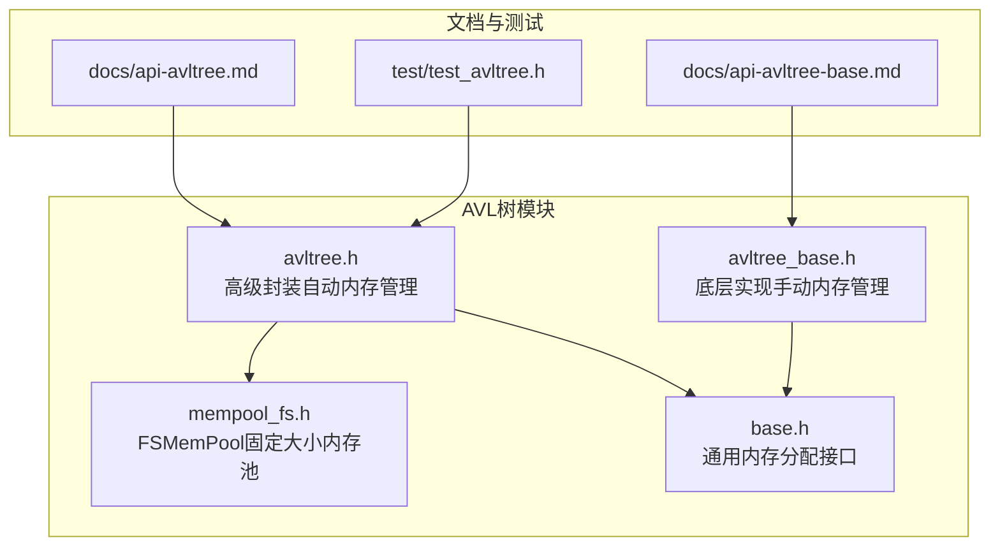
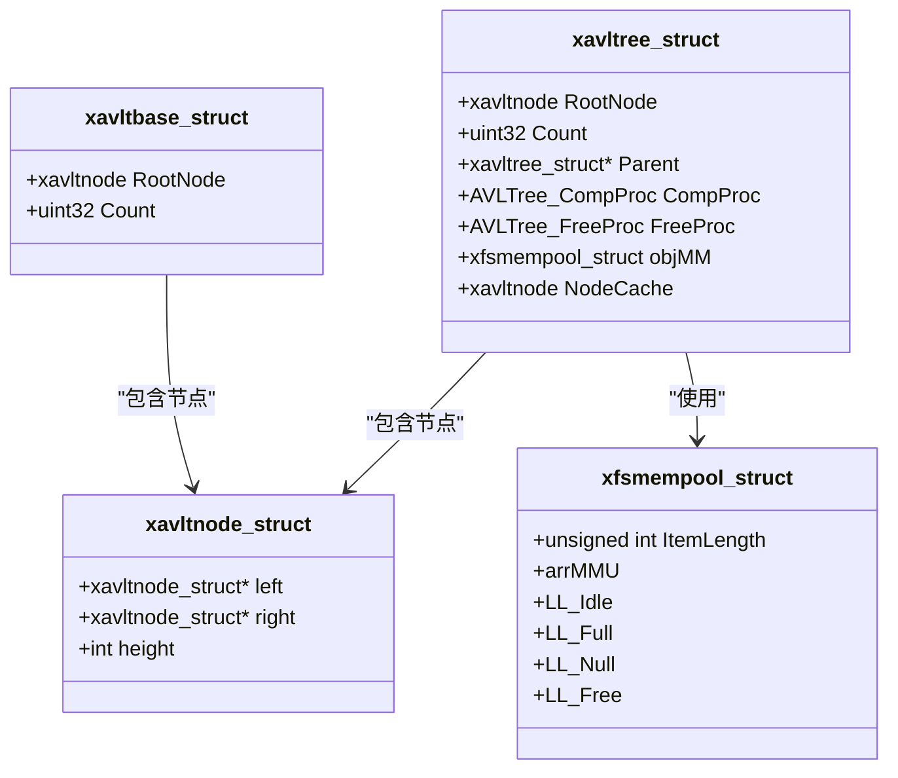
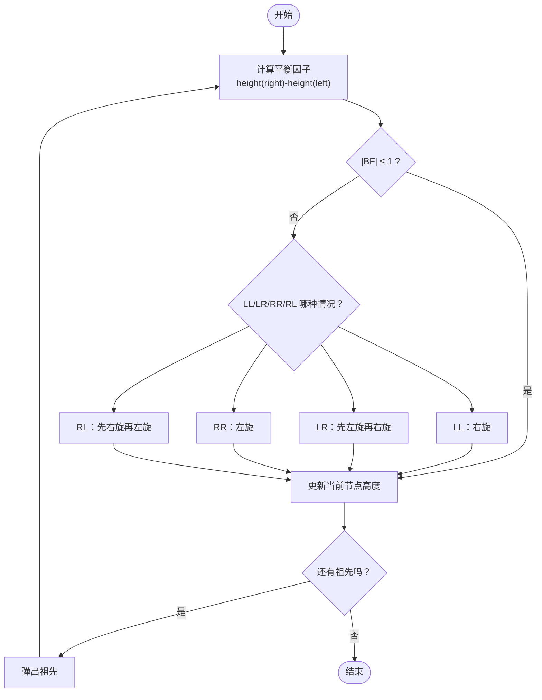
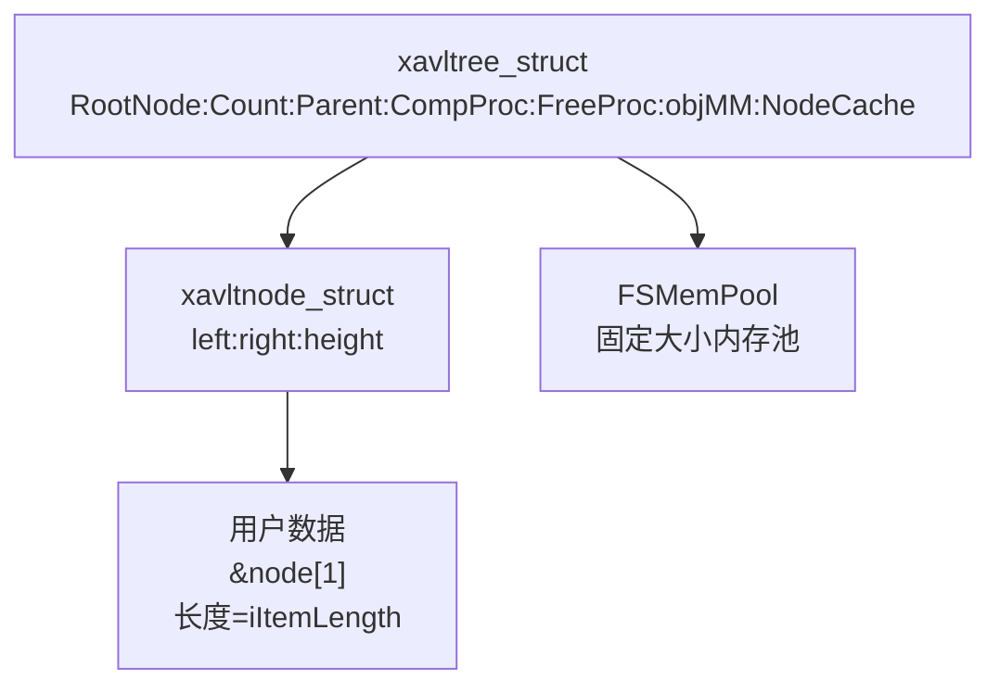
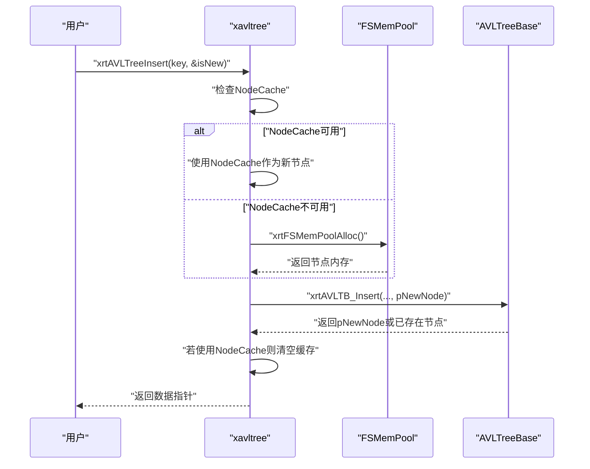
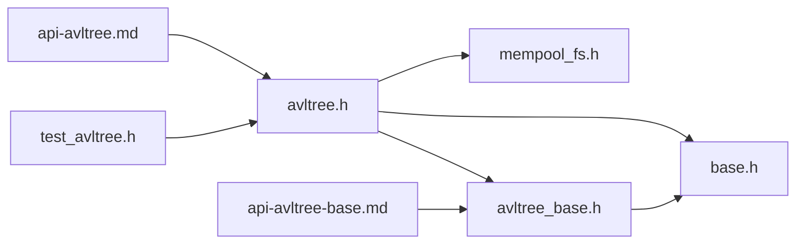

# AVL树模块

<cite>
**本文引用的文件**
- [lib/avltree.h](file://lib/avltree.h)
- [lib/avltree_base.h](file://lib/avltree_base.h)
- [lib/mempool_fs.h](file://lib/mempool_fs.h)
- [lib/base.h](file://lib/base.h)
- [docs/api-avltree.md](file://docs/api-avltree.md)
- [docs/api-avltree-base.md](file://docs/api-avltree-base.md)
- [test/test_avltree.h](file://test/test_avltree.h)
</cite>

## 目录
1. [简介](#简介)
2. [项目结构](#项目结构)
3. [核心组件](#核心组件)
4. [架构概览](#架构概览)
5. [详细组件分析](#详细组件分析)
6. [依赖分析](#依赖分析)
7. [性能考虑](#性能考虑)
8. [故障排查指南](#故障排查指南)
9. [结论](#结论)
10. [附录](#附录)

## 简介
本文件系统性阐述XRT库中的AVL树模块，覆盖AVL树的平衡性质、旋转操作与高度平衡特性；详解avltree与avltree_base两个模块的差异与适用场景；解释节点结构、平衡因子计算与旋转算法实现；详述插入、删除、查找、遍历等API的使用与性能分析；剖析内存管理策略、节点缓存机制与性能特征；并给出最佳实践与典型应用场景（有序存储、范围查询、索引构建）。

## 项目结构
AVL树模块位于lib目录下，核心文件为：
- avltree.h：高级AVL树封装，自动管理节点内存与缓存
- avltree_base.h：底层AVL树实现，用户自行管理节点内存
- mempool_fs.h：固定大小内存池（FSMemPool），为AVL树节点分配提供高效内存管理
- base.h：通用内存分配接口（xrtMalloc/xrtFree等）
- docs/api-avltree(.md) 与 docs/api-avltree-base(.md)：官方API文档
- test/test_avltree.h：AVL树功能测试样例

图表来源
- [lib/avltree.h](file://lib/avltree.h#L1-L126)
- [lib/avltree_base.h](file://lib/avltree_base.h#L1-L423)
- [lib/mempool_fs.h](file://lib/mempool_fs.h#L1-L257)
- [lib/base.h](file://lib/base.h#L1-L132)
- [docs/api-avltree.md](file://docs/api-avltree.md#L1-L940)
- [docs/api-avltree-base.md](file://docs/api-avltree-base.md#L1-L905)
- [test/test_avltree.h](file://test/test_avltree.h#L1-L434)

章节来源
- [lib/avltree.h](file://lib/avltree.h#L1-L126)
- [lib/avltree_base.h](file://lib/avltree_base.h#L1-L423)
- [lib/mempool_fs.h](file://lib/mempool_fs.h#L1-L257)
- [lib/base.h](file://lib/base.h#L1-L132)
- [docs/api-avltree.md](file://docs/api-avltree.md#L1-L940)
- [docs/api-avltree-base.md](file://docs/api-avltree-base.md#L1-L905)
- [test/test_avltree.h](file://test/test_avltree.h#L1-L434)

## 核心组件
- 高级AVL树（xavltree）：封装FSMemPool与节点缓存，自动分配/释放节点，支持父树继承查找与自定义释放回调
- 底层AVL树（xavltbase）：仅提供树结构操作，节点由用户分配与释放，适合自定义内存策略与嵌入式场景
- FSMemPool：固定大小内存池，按节点大小预分配内存块，支持空闲/满载/备用/释放标志链表管理，显著降低频繁分配/释放开销
- 通用内存接口：xrtMalloc/xrtFree等，统一内存管理入口

章节来源
- [lib/avltree.h](file://lib/avltree.h#L24-L59)
- [lib/avltree_base.h](file://lib/avltree_base.h#L101-L120)
- [lib/mempool_fs.h](file://lib/mempool_fs.h#L24-L49)
- [lib/base.h](file://lib/base.h#L5-L45)

## 架构概览
AVL树采用“高层封装 + 底层实现 + 内存池”的分层设计：
- 高层封装（avltree.h）：在xavltree结构体内嵌FSMemPool与节点缓存，提供便捷API与自动内存管理
- 底层实现（avltree_base.h）：提供xavltnode与xavltbase结构，实现AVL平衡逻辑与遍历/迭代器
- 内存池（mempool_fs.h）：为节点分配提供高效内存管理，减少碎片与系统调用
- 通用接口（base.h）：提供统一的内存分配/释放入口

图表来源
- [lib/avltree_base.h](file://lib/avltree_base.h#L78-L111)
- [lib/avltree.h](file://lib/avltree.h#L59-L68)
- [lib/mempool_fs.h](file://lib/mempool_fs.h#L24-L49)

## 详细组件分析

### AVL树平衡性质与旋转算法
- 平衡规则：任意节点左右子树高度差不超过1，确保树高O(log n)
- 平衡因子：height(right) - height(left)，当绝对值>1时触发再平衡
- 四种旋转模式：
  - 左-左（LL）：右旋
  - 左-右（LR）：先左旋再右旋
  - 右-右（RR）：左旋
  - 右-左（RL）：先右旋再左旋
- 再平衡过程：自底向上记录祖先路径，逐层更新高度并按需旋转，直至祖先链回溯完毕

图表来源
- [lib/avltree_base.h](file://lib/avltree_base.h#L5-L134)

章节来源
- [lib/avltree_base.h](file://lib/avltree_base.h#L5-L134)

### 节点结构与数据布局
- 节点结构（xavltnode_struct）：包含left/right指针与height字段
- 数据布局：节点指针指向xavltnode_struct，用户数据位于&node[1]处，长度为iItemLength
- 高级封装（xavltree_struct）：在根节点之上嵌入FSMemPool与节点缓存，支持父树继承查找与自定义释放回调

图表来源
- [lib/avltree_base.h](file://lib/avltree_base.h#L78-L111)
- [lib/avltree.h](file://lib/avltree.h#L59-L68)

章节来源
- [lib/avltree_base.h](file://lib/avltree_base.h#L78-L111)
- [lib/avltree.h](file://lib/avltree.h#L59-L68)

### avltree与avltree_base的差异与适用场景
- avltree（高级封装）
  - 自动内存管理：使用FSMemPool分配/释放节点
  - 节点缓存：优化连续插入性能
  - 继承树：支持Parent指针，Search未命中时在父树查找
  - 自定义释放：支持FreeProc回调
  - 适用：一般业务场景，无需关注内存细节
- avltree_base（底层实现）
  - 手动内存管理：节点由用户分配与释放
  - 更高的灵活性：可接入自定义内存分配器或嵌入式内存
  - 适用：自定义内存策略、嵌入式环境、需要完全控制内存的场景

章节来源
- [docs/api-avltree.md](file://docs/api-avltree.md#L23-L741)
- [docs/api-avltree-base.md](file://docs/api-avltree-base.md#L24-L757)

### 基本操作API与性能分析
- 插入（xrtAVLTreeInsert / xrtAVLTB_Insert）
  - 高级封装：自动分配节点，支持节点缓存，返回数据指针与是否新节点标志
  - 底层实现：要求用户提供已分配的节点，插入后自底向上再平衡
  - 时间复杂度：O(log n)
- 删除（xrtAVLTreeRemove / xrtAVLTB_Remove）
  - 高级封装：删除后自动释放节点内存，可选调用FreeProc
  - 底层实现：返回被删除节点指针，用户负责释放
  - 时间复杂度：O(log n)
- 查找（xrtAVLTreeSearch / xrtAVLTB_Search）
  - 高级封装：支持父树继承查找
  - 底层实现：标准二分查找
  - 时间复杂度：O(log n)
- 遍历（xrtAVLTreeWalk / xrtAVLTB_Walk）
  - 中序遍历保证有序输出
  - 时间复杂度：O(n)

章节来源
- [lib/avltree.h](file://lib/avltree.h#L62-L123)
- [lib/avltree_base.h](file://lib/avltree_base.h#L137-L254)
- [docs/api-avltree.md](file://docs/api-avltree.md#L167-L575)
- [docs/api-avltree-base.md](file://docs/api-avltree-base.md#L272-L485)

### 内存管理策略与节点缓存机制
- FSMemPool工作原理
  - 固定大小内存块：每个节点占用sizeof(xavltnode_struct)+iItemLength字节
  - 四链表管理：LL_Idle（空闲）、LL_Full（满载）、LL_Null（备用）、LL_Free（释放标志复用）
  - 优先使用空闲单元，接近满载则迁移到满载链，清空则进入备用或释放
- 节点缓存（NodeCache）
  - 高级封装在插入前预分配一个节点缓存，连续插入时可直接复用，避免多次分配
  - 缓存使用后清空，等待下次插入复用
- 性能特征
  - 显著降低频繁分配/释放带来的系统调用与碎片
  - 连续插入场景下，节点缓存可进一步减少分配次数

图表来源
- [lib/avltree.h](file://lib/avltree.h#L62-L90)
- [lib/mempool_fs.h](file://lib/mempool_fs.h#L52-L125)

章节来源
- [lib/avltree.h](file://lib/avltree.h#L24-L59)
- [lib/mempool_fs.h](file://lib/mempool_fs.h#L24-L125)

### 迭代器与遍历
- 迭代器（xavltree_iterator）
  - 基于栈的中序遍历，按需创建与销毁
  - 提供IterBegin/IterNext/IterEnd三步式遍历流程
- 遍历回调（Walk/WalkEx）
  - Walk：中序遍历（有序）
  - WalkEx：支持前序/中序/后序回调，便于统计与转换

章节来源
- [lib/avltree_base.h](file://lib/avltree_base.h#L325-L421)
- [docs/api-avltree.md](file://docs/api-avltree.md#L501-L575)
- [docs/api-avltree-base.md](file://docs/api-avltree-base.md#L489-L617)

### 典型应用场景
- 有序数据存储：整数索引、字符串键索引
- 范围查询：利用中序遍历的有序性进行区间扫描
- 索引构建：结合父树（Parent）实现全局/局部索引层次

章节来源
- [docs/api-avltree.md](file://docs/api-avltree.md#L578-L722)
- [docs/api-avltree-base.md](file://docs/api-avltree-base.md#L620-L737)

## 依赖分析
- avltree.h依赖
  - FSMemPool（内存分配/释放）
  - avltree_base（树操作实现）
  - base.h（通用内存接口）
- avltree_base.h依赖
  - base.h（通用内存接口）
- 文档与测试
  - API文档提供使用示例与最佳实践
  - 测试样例验证插入/删除/查找/遍历等流程

图表来源
- [lib/avltree.h](file://lib/avltree.h#L1-L126)
- [lib/avltree_base.h](file://lib/avltree_base.h#L1-L423)
- [lib/mempool_fs.h](file://lib/mempool_fs.h#L1-L257)
- [lib/base.h](file://lib/base.h#L1-L132)
- [docs/api-avltree.md](file://docs/api-avltree.md#L1-L940)
- [docs/api-avltree-base.md](file://docs/api-avltree-base.md#L1-L905)
- [test/test_avltree.h](file://test/test_avltree.h#L1-L434)

章节来源
- [lib/avltree.h](file://lib/avltree.h#L1-L126)
- [lib/avltree_base.h](file://lib/avltree_base.h#L1-L423)
- [lib/mempool_fs.h](file://lib/mempool_fs.h#L1-L257)
- [lib/base.h](file://lib/base.h#L1-L132)
- [docs/api-avltree.md](file://docs/api-avltree.md#L1-L940)
- [docs/api-avltree-base.md](file://docs/api-avltree-base.md#L1-L905)
- [test/test_avltree.h](file://test/test_avltree.h#L1-L434)

## 性能考虑
- 时间复杂度
  - 插入/删除/查找：O(log n)
  - 遍历：O(n)
- 空间复杂度
  - 节点空间：n*(sizeof(xavltnode_struct)+iItemLength)
  - FSMemPool四链表额外开销较小
- 内存优化
  - 使用FSMemPool减少系统调用与碎片
  - 节点缓存降低连续插入的分配次数
  - 自定义释放回调避免内存泄漏
- 查询性能
  - 利用中序遍历的有序性进行范围查询
  - 父树继承查找提升复合索引场景下的查询效率

[本节为通用性能讨论，无需特定文件来源]

## 故障排查指南
- 比较函数设计
  - 返回值必须为负/零/正，避免溢出与错误比较
  - 对于大整型，应使用安全比较方式
- 节点内存管理
  - 高级封装：删除后自动释放，无需手动free
  - 底层实现：删除后返回节点指针，需用户释放
- 父树继承查找
  - Search未命中时会尝试在Parent树查找，注意避免重复键冲突
- 内存池问题
  - FSMemPoolGC可用于回收未标记内存，避免长期运行内存膨胀

章节来源
- [docs/api-avltree.md](file://docs/api-avltree.md#L743-L800)
- [docs/api-avltree-base.md](file://docs/api-avltree-base.md#L760-L800)

## 结论
XRT的AVL树模块通过“高级封装 + 底层实现 + 内存池”的设计，既满足一般业务场景的易用性，又为需要精细控制内存的场景提供灵活实现。FSMemPool与节点缓存机制显著提升了插入性能，平衡性质保证了稳定的O(log n)操作时间。结合父树继承查找与遍历/迭代器能力，AVL树适用于多种数据组织与查询场景。

[本节为总结性内容，无需特定文件来源]

## 附录
- 最佳实践
  - 设计安全的比较函数，避免溢出
  - 选择合适的模块：一般场景用avltree，自定义内存策略用avltree_base
  - 合理使用节点缓存与FSMemPool，避免频繁分配
  - 利用中序遍历进行范围查询与统计
- 示例参考
  - 整数索引与字符串键索引示例
  - 继承树（Parent）示例
  - 自定义内存管理与嵌入式索引示例

章节来源
- [docs/api-avltree.md](file://docs/api-avltree.md#L578-L800)
- [docs/api-avltree-base.md](file://docs/api-avltree-base.md#L620-L800)
- [test/test_avltree.h](file://test/test_avltree.h#L41-L434)