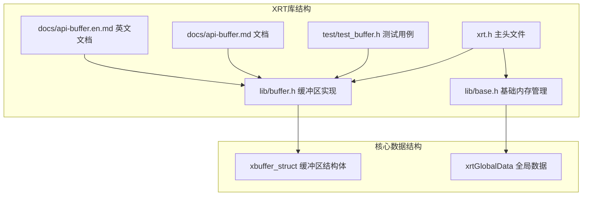
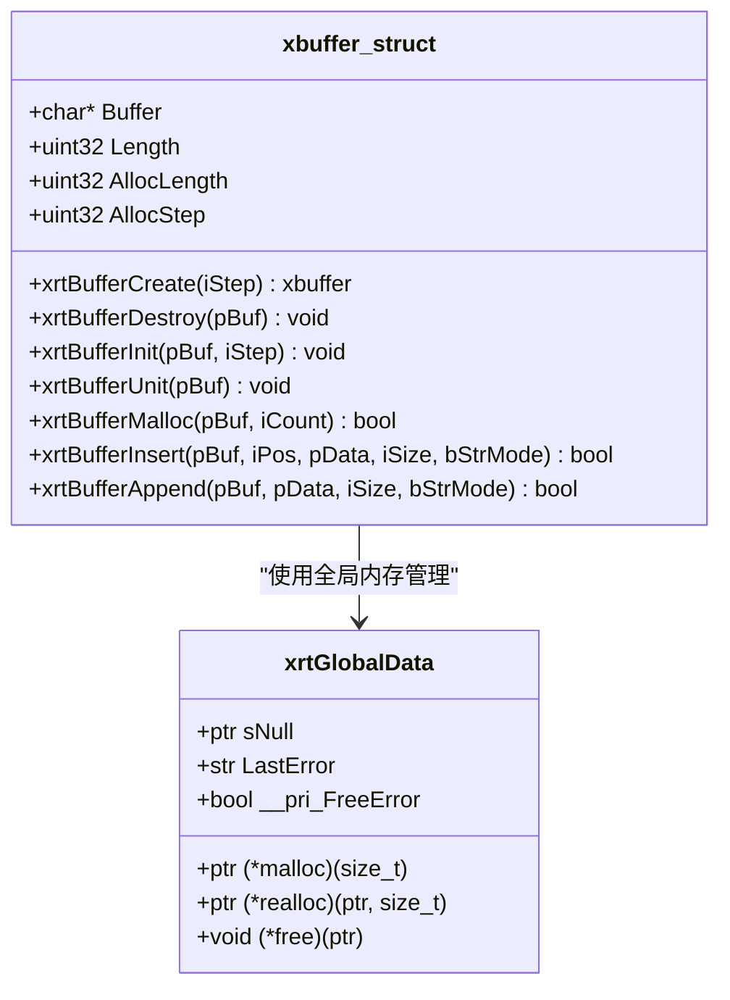
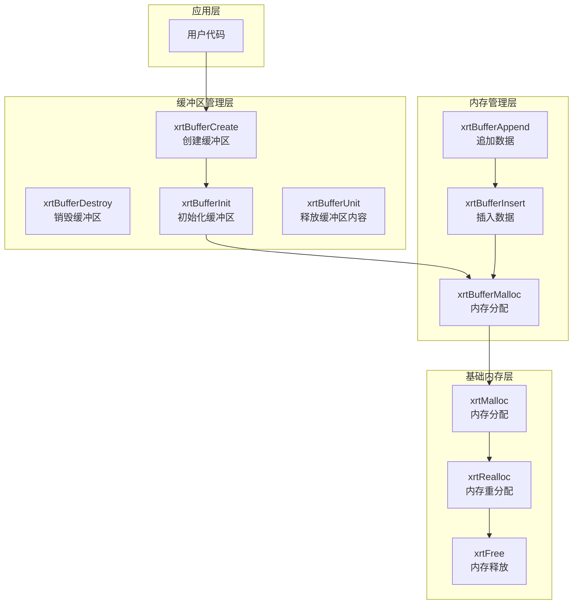
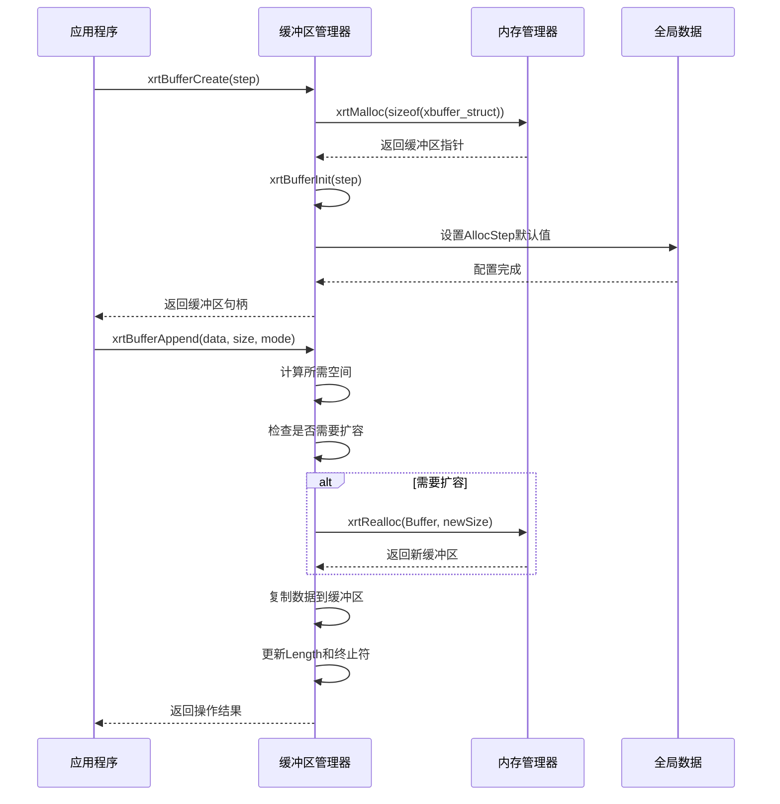
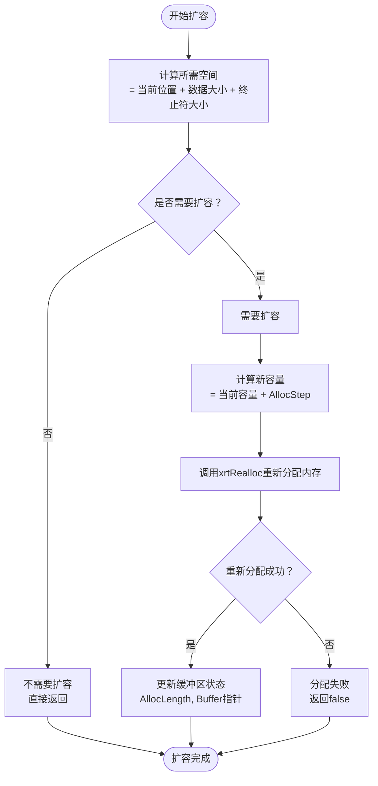
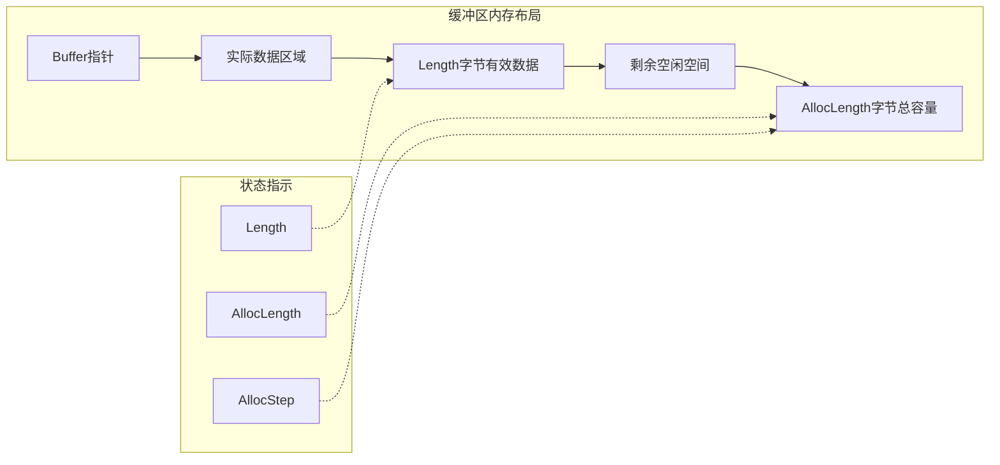
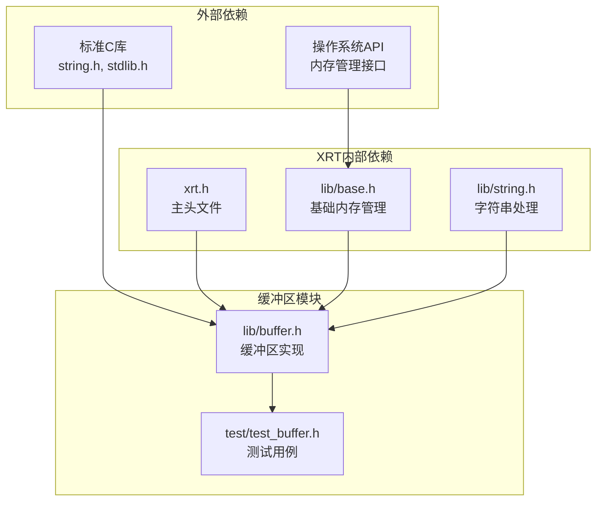
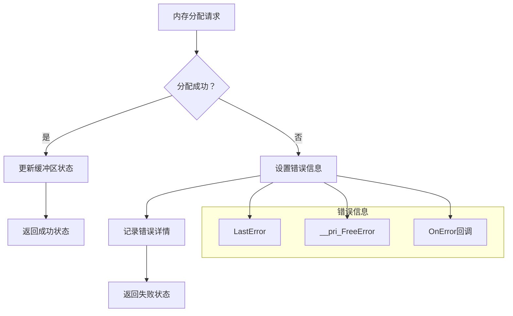

# 动态缓冲区模块

<cite>
**本文档引用的文件**
- [lib/buffer.h](file://lib/buffer.h)
- [xrt.h](file://xrt.h)
- [lib/base.h](file://lib/base.h)
- [test/test_buffer.h](file://test/test_buffer.h)
- [docs/api-buffer.md](file://docs/api-buffer.md)
- [docs/api-buffer.en.md](file://docs/api-buffer.en.md)
- [lib/string.h](file://lib/string.h)
</cite>

## 目录
1. [简介](#简介)
2. [项目结构](#项目结构)
3. [核心组件](#核心组件)
4. [架构概览](#架构概览)
5. [详细组件分析](#详细组件分析)
6. [依赖关系分析](#依赖关系分析)
7. [性能考虑](#性能考虑)
8. [故障排除指南](#故障排除指南)
9. [结论](#结论)
10. [附录](#附录)

## 简介

XRT动态缓冲区模块是一个高效的内存管理库，提供了可变大小的内存缓冲区管理功能。该模块支持二进制数据和多种字符串编码格式，具有自动扩容机制、智能内存分配策略和完善的资源管理功能。模块采用轻量级设计，提供了简洁易用的API接口，适用于各种数据处理场景。

动态缓冲区模块的核心优势包括：
- **自动扩容机制**：根据数据增长需求动态调整内存大小
- **多种字符串模式**：支持ANSI、UTF-8、UTF-16、UTF-32等多种编码格式
- **高效内存管理**：采用步长预分配策略减少频繁内存分配
- **完整的生命周期管理**：提供创建、初始化、销毁等完整管理接口
- **线程安全的错误处理**：内置错误管理和内存分配失败处理机制

## 项目结构

XRT动态缓冲区模块位于XRT库的核心部分，主要文件组织如下：



**图表来源**
- [lib/buffer.h](file://lib/buffer.h#L1-L116)
- [xrt.h](file://xrt.h#L1009-L1052)

**章节来源**
- [lib/buffer.h](file://lib/buffer.h#L1-L116)
- [xrt.h](file://xrt.h#L1009-L1052)

## 核心组件

### xbuffer_struct 结构体

xbuffer_struct是动态缓冲区模块的核心数据结构，定义了完整的缓冲区管理信息：



**图表来源**
- [xrt.h](file://xrt.h#L1022-L1027)
- [xrt.h](file://xrt.h#L131-L181)

### 主要成员变量说明

| 成员变量 | 类型 | 描述 | 默认值 |
|---------|------|------|--------|
| Buffer | char* | 实际数据存储指针 | NULL |
| Length | uint32 | 当前有效数据长度（字节） | 0 |
| AllocLength | uint32 | 已分配的总内存大小（字节） | 0 |
| AllocStep | uint32 | 内存扩容步长（字节） | 65536 |

### 字符串模式常量

动态缓冲区支持多种字符串编码模式：

| 常量 | 值 | 编码格式 | 终止符 | 用途 |
|------|----|----------|--------|------|
| XBUF_BINARY | 0 | 二进制数据 | 无 | 通用二进制数据 |
| XBUF_ANSI | 1 | ANSI/UTF-8 | 1字节`\0` | 文本字符串处理 |
| XBUF_UTF16 | 2 | UTF-16 | 2字节`\0\0` | Unicode文本 |
| XBUF_UTF32 | 4 | UTF-32 | 4字节`\0\0\0\0` | 扩展Unicode字符 |

**章节来源**
- [xrt.h](file://xrt.h#L1012-L1016)
- [xrt.h](file://xrt.h#L1018-L1027)
- [docs/api-buffer.md](file://docs/api-buffer.md#L20-L37)

## 架构概览

动态缓冲区模块采用分层架构设计，实现了清晰的功能分离：



**图表来源**
- [lib/buffer.h](file://lib/buffer.h#L5-L113)
- [lib/base.h](file://lib/base.h#L5-L45)

### 控制流程图



**图表来源**
- [lib/buffer.h](file://lib/buffer.h#L5-L113)
- [lib/base.h](file://lib/base.h#L5-L45)

**章节来源**
- [lib/buffer.h](file://lib/buffer.h#L1-L116)
- [lib/base.h](file://lib/base.h#L1-L132)

## 详细组件分析

### 内存分配与释放机制

动态缓冲区模块实现了高效的内存管理策略：

#### 自动扩容算法



**图表来源**
- [lib/buffer.h](file://lib/buffer.h#L41-L72)

#### 内存释放策略

缓冲区提供了两种释放方式：

1. **完全释放** (`xrtBufferDestroy`)：释放缓冲区结构体和内部数据
2. **内容释放** (`xrtBufferUnit`)：只释放内部数据，保留结构体

### 核心API详解

#### 缓冲区创建与初始化

| API函数 | 参数 | 返回值 | 描述 |
|---------|------|--------|------|
| xrtBufferCreate | uint32 iStep | xbuffer | 创建新的缓冲区管理器 |
| xrtBufferInit | xbuffer pBuf, uint32 iStep | void | 初始化现有缓冲区结构体 |
| xrtBufferDestroy | xbuffer pBuf | void | 完全销毁缓冲区（释放结构体和数据） |
| xrtBufferUnit | xbuffer pBuf | void | 释放缓冲区内容（保留结构体） |

#### 数据操作API

| API函数 | 参数 | 返回值 | 描述 |
|---------|------|--------|------|
| xrtBufferMalloc | xbuffer pBuf, uint32 iCount | bool | 分配指定大小的内存 |
| xrtBufferInsert | xbuffer pBuf, uint32 iPos, ptr pData, uint32 iSize, uint32 bStrMode | bool | 在指定位置插入数据 |
| xrtBufferAppend | xbuffer pBuf, ptr pData, uint32 iSize, uint32 bStrMode | bool | 在缓冲区末尾追加数据 |

#### 参数说明

**字符串模式参数 (bStrMode)**：
- 0：XBUF_BINARY - 二进制模式，不自动添加终止符
- 1：XBUF_ANSI/UTF8 - ANSI或UTF-8字符串，自动添加1字节`\0`
- 2：XBUF_UTF16 - UTF-16字符串，自动添加2字节`\0\0`
- 4：XBUF_UTF32 - UTF-32字符串，自动添加4字节`\0\0\0\0`

**尺寸参数 (iSize)**：
- 0：表示自动计算数据长度
- >0：使用指定的字节数

**章节来源**
- [lib/buffer.h](file://lib/buffer.h#L5-L113)
- [docs/api-buffer.md](file://docs/api-buffer.md#L66-L166)

### 内存布局分析

动态缓冲区采用连续内存布局，数据结构简单明了：



**图表来源**
- [xrt.h](file://xrt.h#L1022-L1027)

### 性能优化特性

#### 步长预分配策略

动态缓冲区采用步长预分配机制，避免频繁的内存分配操作：

- **默认步长**：65536字节（64KB）
- **扩容策略**：每次扩容增加一个步长大小
- **内存效率**：减少内存碎片，提高缓存命中率

#### 边界检查机制

模块实现了完整的边界检查：
- 插入位置验证
- 数据长度验证
- 内存分配失败处理
- 空指针安全检查

**章节来源**
- [lib/buffer.h](file://lib/buffer.h#L28-L30)
- [lib/buffer.h](file://lib/buffer.h#L90-L94)

## 依赖关系分析

动态缓冲区模块的依赖关系清晰明确：



**图表来源**
- [lib/buffer.h](file://lib/buffer.h#L1-L116)
- [lib/base.h](file://lib/base.h#L1-L132)
- [lib/string.h](file://lib/string.h#L1-L200)

### 内部耦合度分析

- **低耦合设计**：缓冲区模块独立于其他XRT组件
- **清晰接口**：所有公共接口都在xrt.h中声明
- **单一职责**：专注于内存缓冲区管理功能

**章节来源**
- [lib/buffer.h](file://lib/buffer.h#L1-L116)
- [xrt.h](file://xrt.h#L1009-L1052)

## 性能考虑

### 内存分配性能

动态缓冲区模块在内存分配方面采用了多项优化策略：

#### 预分配策略
- **批量分配**：每次分配一个步长大小的内存块
- **减少系统调用**：避免频繁的malloc/free调用
- **缓存友好**：连续内存布局提高CPU缓存效率

#### 时间复杂度分析

| 操作 | 最好情况 | 平均情况 | 最坏情况 | 说明 |
|------|----------|----------|----------|------|
| xrtBufferAppend | O(1) | O(1) | O(n) | n为重新分配次数 |
| xrtBufferInsert | O(n) | O(n) | O(n) | 需要移动现有数据 |
| xrtBufferMalloc | O(1) | O(1) | O(n) | n为重新分配次数 |
| 内存释放 | O(1) | O(1) | O(1) | 直接释放 |

### 内存使用优化

#### 空间效率
- **紧凑布局**：数据存储与元数据分离
- **无额外开销**：每个缓冲区仅占用16字节元数据
- **可选终止符**：只有在字符串模式下才添加终止符

#### 内存碎片控制
- **步长分配**：避免小块内存碎片
- **延迟释放**：允许缓冲区复用而非立即释放
- **智能收缩**：提供内存收缩功能避免过度分配

## 故障排除指南

### 常见问题及解决方案

#### 内存分配失败

**症状**：xrtBufferMalloc返回false或抛出异常

**原因分析**：
1. 系统内存不足
2. 超过系统内存限制
3. 内存碎片严重

**解决方案**：
```c
// 检查内存分配结果
if (!xrtBufferMalloc(buf, size)) {
    // 处理错误
    handleError(xrtLastError());
    return false;
}
```

#### 缓冲区越界访问

**症状**：程序崩溃或数据损坏

**预防措施**：
1. 始终检查缓冲区状态
2. 使用边界检查宏
3. 避免直接操作Buffer指针

#### 内存泄漏

**症状**：程序运行时间越长内存占用越大

**诊断方法**：
```c
// 确保正确释放缓冲区
xrtBufferUnit(buf);  // 释放内容
xrtBufferDestroy(buf);  // 释放结构体
```

### 错误处理机制

动态缓冲区模块提供了完善的错误处理机制：



**图表来源**
- [lib/base.h](file://lib/base.h#L88-L132)

**章节来源**
- [lib/base.h](file://lib/base.h#L88-L132)
- [lib/buffer.h](file://lib/buffer.h#L41-L72)

## 结论

XRT动态缓冲区模块是一个设计精良、实现高效的内存管理库。其核心特点包括：

### 主要优势
- **简洁的API设计**：提供直观易用的缓冲区管理接口
- **高效的内存管理**：采用步长预分配策略，减少内存碎片
- **完整的功能覆盖**：支持多种数据类型和字符串编码
- **可靠的错误处理**：内置完善的错误检测和处理机制
- **良好的性能表现**：优化的内存分配算法和缓存友好的布局

### 技术特色
- **自动扩容机制**：根据数据增长需求动态调整内存大小
- **智能内存回收**：提供灵活的内存释放策略
- **多编码支持**：全面支持ANSI、UTF-8、UTF-16、UTF-32等编码格式
- **线程安全考虑**：全局错误状态设计考虑了线程安全性

### 应用建议
动态缓冲区模块适用于以下场景：
- 文本处理和字符串拼接
- 文件内容缓存和处理
- 网络数据接收和组装
- 二进制数据流处理
- 日志和调试信息收集

通过合理使用该模块，开发者可以显著简化内存管理任务，提高代码质量和开发效率。

## 附录

### 使用示例

#### 基本字符串处理
```c
// 创建缓冲区并追加字符串
xbuffer buf = xrtBufferCreate(1024);
xrtBufferAppend(buf, "Hello", 0, XBUF_UTF8);
xrtBufferAppend(buf, " World", 0, XBUF_UTF8);
printf("%s\n", buf->Buffer);  // 输出: Hello World
xrtBufferDestroy(buf);
```

#### 文件内容缓存
```c
// 缓存文件内容
xbuffer cache = xrtBufferCreate(0);
for (int i = 0; i < 1000; i++) {
    str chunk = xrtFormat("Chunk %d data\n", i);
    xrtBufferAppend(cache, chunk, 0, XBUF_BINARY);
    xrtFree(chunk);
}
// 添加终止符
xrtBufferAppend(cache, "\0", 1, XBUF_BINARY);
```

#### 网络数据接收
```c
// 接收网络数据并组装
xbuffer packet = xrtBufferCreate(0);
while (more_data) {
    char buffer[1024];
    int received = recv(socket, buffer, 1024, 0);
    if (received > 0) {
        xrtBufferAppend(packet, buffer, received, XBUF_BINARY);
    }
}
// 处理完整数据包
process_packet(packet->Buffer, packet->Length);
```

### 最佳实践

#### 内存管理最佳实践
1. **及时释放**：使用完毕后立即释放缓冲区
2. **预分配策略**：对于已知大小的数据预先分配内存
3. **避免频繁扩容**：尽量一次性分配足够空间
4. **检查返回值**：始终检查内存分配操作的结果

#### 性能优化建议
1. **选择合适的步长**：根据数据特征选择合适的AllocStep
2. **字符串模式选择**：根据实际需求选择合适的字符串模式
3. **内存修剪**：在不需要时及时修剪多余内存
4. **批量操作**：尽量使用批量追加而非频繁插入

#### 错误处理建议
1. **错误检查**：始终检查API调用的返回值
2. **错误恢复**：在发生错误时进行适当的清理
3. **日志记录**：记录重要的错误信息便于调试
4. **优雅降级**：在内存不足时提供降级策略

**章节来源**
- [docs/api-buffer.md](file://docs/api-buffer.md#L475-L577)
- [test/test_buffer.h](file://test/test_buffer.h#L1-L204)