# 字典和列表模块

<cite>
**本文档引用的文件**
- [lib/dict.h](file://lib/dict.h)
- [lib/list.h](file://lib/list.h)
- [lib/avltree.h](file://lib/avltree.h)
- [lib/hash.h](file://lib/hash.h)
- [lib/mempool.h](file://lib/mempool.h)
- [docs/api-dict.md](file://docs/api-dict.md)
- [docs/api-list.md](file://docs/api-list.md)
- [test/test_dict.h](file://test/test_dict.h)
- [test/test_list.h](file://test/test_list.h)
</cite>

## 目录
1. [简介](#简介)
2. [项目结构](#项目结构)
3. [核心组件](#核心组件)
4. [架构概览](#架构概览)
5. [详细组件分析](#详细组件分析)
6. [依赖关系分析](#依赖关系分析)
7. [性能考虑](#性能考虑)
8. [故障排除指南](#故障排除指南)
9. [结论](#结论)
10. [附录](#附录)

## 简介

XRT库提供了高效的字典（Dict）和列表（List）数据结构实现。这两个模块都基于AVL树实现，确保O(log n)的时间复杂度性能。字典模块支持任意二进制键的键值对存储，而列表模块则提供基于int64整数键的稀疏存储功能。

本模块的核心优势：
- **AVL树实现**：保证平衡的查找、插入、删除性能
- **内存池支持**：高效的内存管理机制
- **跨平台兼容**：支持多种处理器架构
- **灵活的数据存储**：支持值存储和指针存储两种模式

## 项目结构

XRT库采用模块化设计，字典和列表模块位于lib目录下，每个模块都有完整的API文档和测试用例。

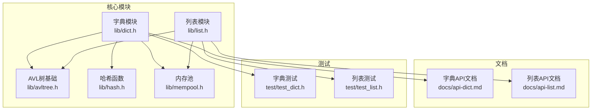

**图表来源**
- [lib/dict.h](file://lib/dict.h#L1-L204)
- [lib/list.h](file://lib/list.h#L1-L188)
- [lib/avltree.h](file://lib/avltree.h#L1-L126)
- [lib/hash.h](file://lib/hash.h#L1-L800)
- [lib/mempool.h](file://lib/mempool.h#L1-L200)

**章节来源**
- [lib/dict.h](file://lib/dict.h#L1-L204)
- [lib/list.h](file://lib/list.h#L1-L188)
- [lib/avltree.h](file://lib/avltree.h#L1-L126)

## 核心组件

### 字典模块（Dict）

字典模块基于AVL树实现，支持任意二进制数据作为键，提供以下核心功能：

- **键值对存储**：支持存储任意类型的值
- **内存池集成**：可选的内存池支持，用于键内存管理
- **指针存储模式**：支持直接存储指针值
- **遍历功能**：提供中序遍历接口

### 列表模块（List）

列表模块同样基于AVL树实现，但使用int64作为键，提供稀疏存储能力：

- **整数键支持**：使用int64作为键，支持负数和跳跃索引
- **稀疏存储**：只存储实际使用的索引，节省内存
- **自动排序**：遍历时按键值升序排列
- **指针存储模式**：支持直接存储指针值

**章节来源**
- [docs/api-dict.md](file://docs/api-dict.md#L23-L52)
- [docs/api-list.md](file://docs/api-list.md#L23-L47)

## 架构概览

两个模块都采用了相同的底层架构设计，确保一致的性能特征和使用体验。

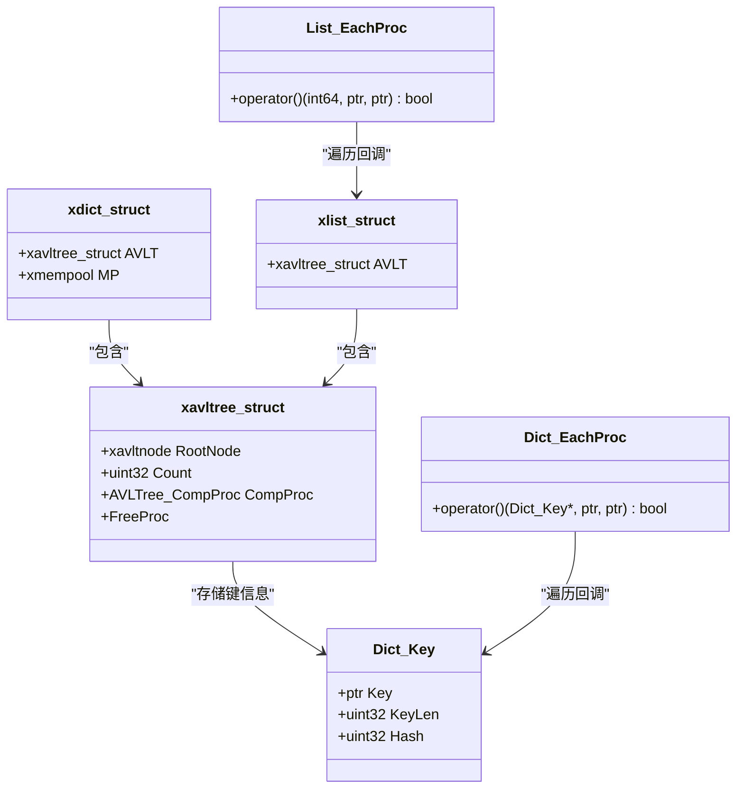

**图表来源**
- [lib/dict.h](file://lib/dict.h#L58-L91)
- [lib/list.h](file://lib/list.h#L63-L72)
- [lib/avltree.h](file://lib/avltree.h#L24-L32)

### 数据结构设计

字典和列表模块共享相同的数据结构设计模式：

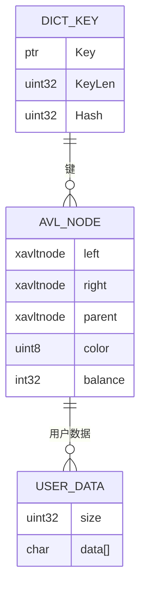

**图表来源**
- [lib/dict.h](file://lib/dict.h#L64-L68)
- [lib/avltree.h](file://lib/avltree.h#L62-L90)

**章节来源**
- [lib/dict.h](file://lib/dict.h#L58-L91)
- [lib/list.h](file://lib/list.h#L63-L72)
- [lib/avltree.h](file://lib/avltree.h#L24-L32)

## 详细组件分析

### 字典模块深度分析

#### 哈希函数设计

字典模块实现了跨平台的哈希函数，根据处理器架构选择最优的实现：

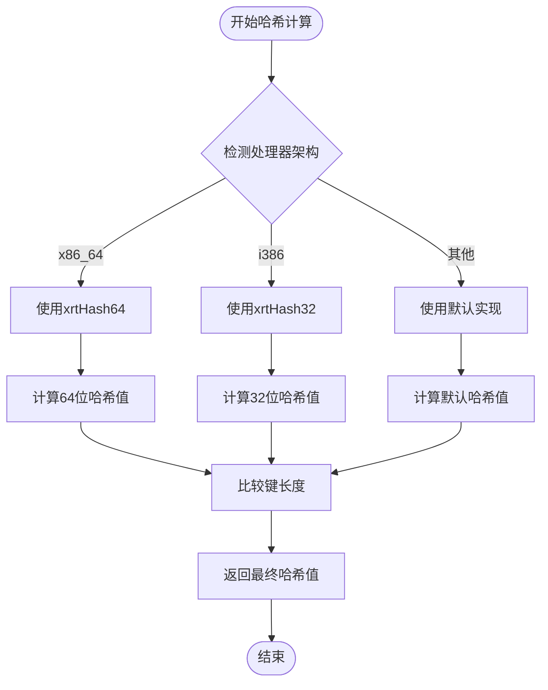

**图表来源**
- [lib/dict.h](file://lib/dict.h#L5-L9)
- [lib/hash.h](file://lib/hash.h#L594-L602)

#### 键值操作API

字典模块提供了完整的键值操作接口：

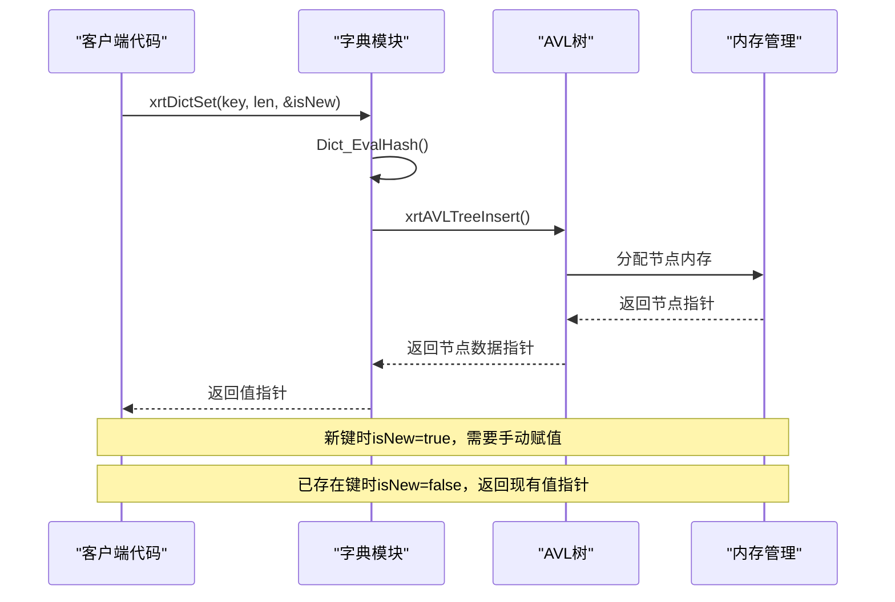

**图表来源**
- [lib/dict.h](file://lib/dict.h#L71-L76)
- [lib/avltree.h](file://lib/avltree.h#L62-L90)

#### 内存管理机制

字典模块支持灵活的内存管理模式：

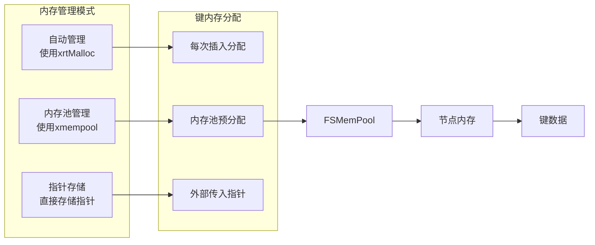

**图表来源**
- [lib/dict.h](file://lib/dict.h#L49-L62)
- [lib/mempool.h](file://lib/mempool.h#L148-L200)

**章节来源**
- [lib/dict.h](file://lib/dict.h#L12-L25)
- [lib/dict.h](file://lib/dict.h#L71-L103)
- [lib/dict.h](file://lib/dict.h#L174-L201)

### 列表模块深度分析

#### AVL树实现特点

列表模块基于AVL树实现，具有以下特点：

- **平衡性保证**：通过旋转操作保持树的平衡
- **高度控制**：树的高度始终为O(log n)
- **自动平衡**：插入和删除操作后自动调整平衡因子

#### 稀疏存储优势

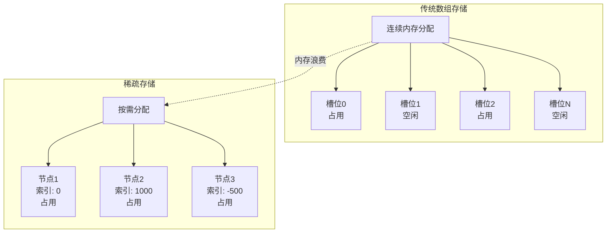

**图表来源**
- [docs/api-list.md](file://docs/api-list.md#L49-L58)

#### 整数键处理机制

列表模块使用专门的比较函数处理int64键：

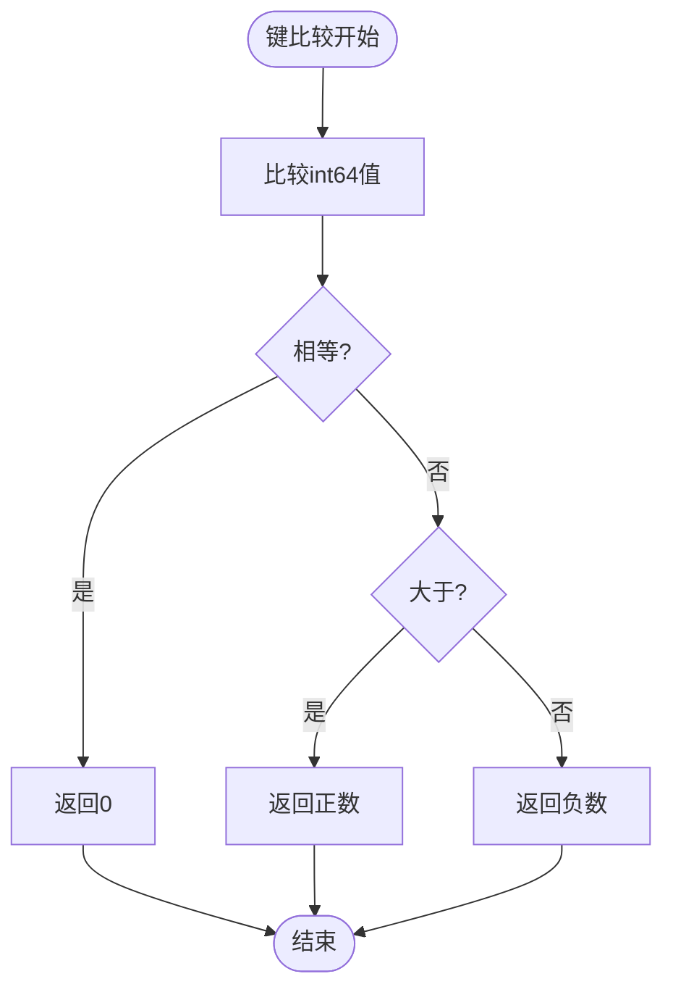

**图表来源**
- [lib/list.h](file://lib/list.h#L5-L14)

**章节来源**
- [lib/list.h](file://lib/list.h#L4-L14)
- [lib/list.h](file://lib/list.h#L49-L92)
- [lib/list.h](file://lib/list.h#L158-L185)

### 性能分析对比

| 操作类型 | 字典模块 | 列表模块 | 时间复杂度 |
|---------|---------|---------|-----------|
| 插入操作 | O(log n) | O(log n) | O(log n) |
| 查找操作 | O(log n) | O(log n) | O(log n) |
| 删除操作 | O(log n) | O(log n) | O(log n) |
| 遍历操作 | O(n) | O(n) | O(n) |
| 内存效率 | 高（键值存储） | 高（稀疏存储） | - |
| 空间复杂度 | O(n) | O(n) | - |

**章节来源**
- [docs/api-dict.md](file://docs/api-dict.md#L27-L32)
- [docs/api-list.md](file://docs/api-list.md#L27-L32)

## 依赖关系分析

### 核心依赖关系

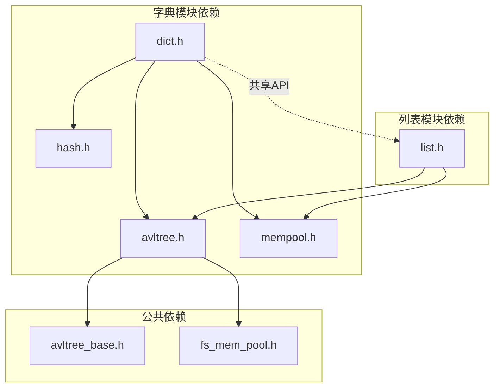

**图表来源**
- [lib/dict.h](file://lib/dict.h#L1-L204)
- [lib/list.h](file://lib/list.h#L1-L188)
- [lib/avltree.h](file://lib/avltree.h#L1-L126)

### 内存管理依赖

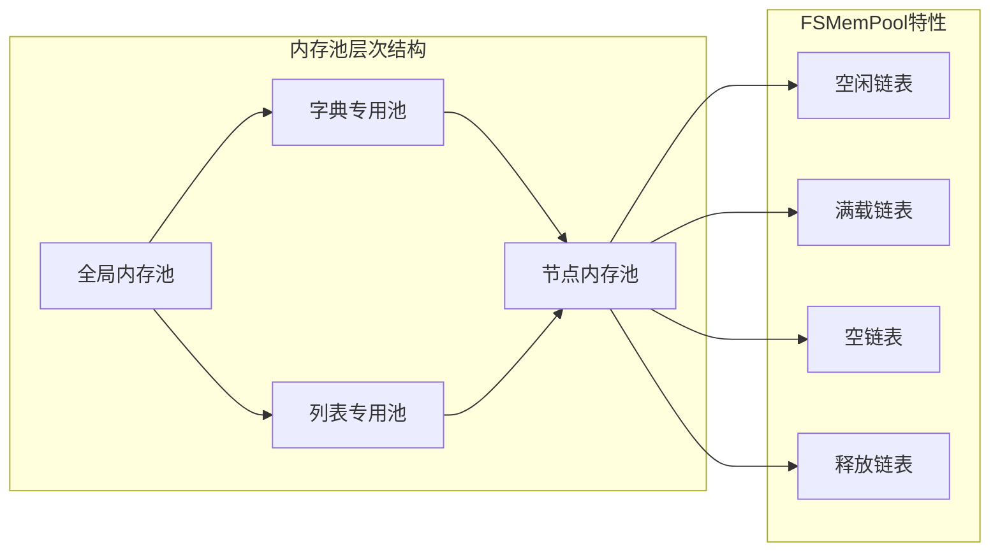

**图表来源**
- [lib/mempool.h](file://lib/mempool.h#L35-L119)
- [lib/avltree.h](file://lib/avltree.h#L30-L31)

**章节来源**
- [lib/dict.h](file://lib/dict.h#L57-L62)
- [lib/list.h](file://lib/list.h#L38-L41)
- [lib/mempool.h](file://lib/mempool.h#L148-L200)

## 性能考虑

### 哈希函数性能优化

字典模块的哈希函数设计考虑了多平台兼容性和性能：

- **条件编译**：根据处理器架构选择最优实现
- **内联函数**：减少函数调用开销
- **平台特定优化**：利用硬件特性加速计算

### AVL树平衡策略

两个模块都采用AVL树确保平衡性：

- **平衡因子**：维持左右子树高度差不超过1
- **旋转操作**：通过四种旋转类型保持平衡
- **自动调整**：插入和删除后自动重新平衡

### 内存池优化

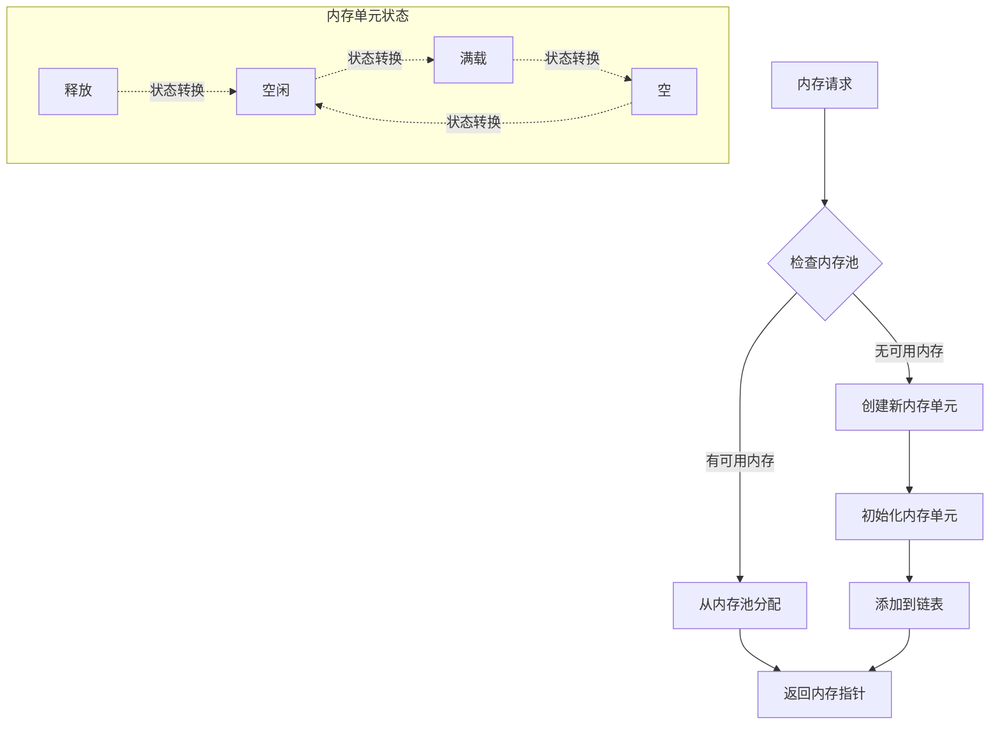

**图表来源**
- [lib/mempool.h](file://lib/mempool.h#L148-L200)

**章节来源**
- [lib/hash.h](file://lib/hash.h#L594-L602)
- [lib/avltree.h](file://lib/avltree.h#L62-L90)
- [lib/mempool.h](file://lib/mempool.h#L148-L200)

## 故障排除指南

### 常见问题诊断

#### 内存泄漏排查

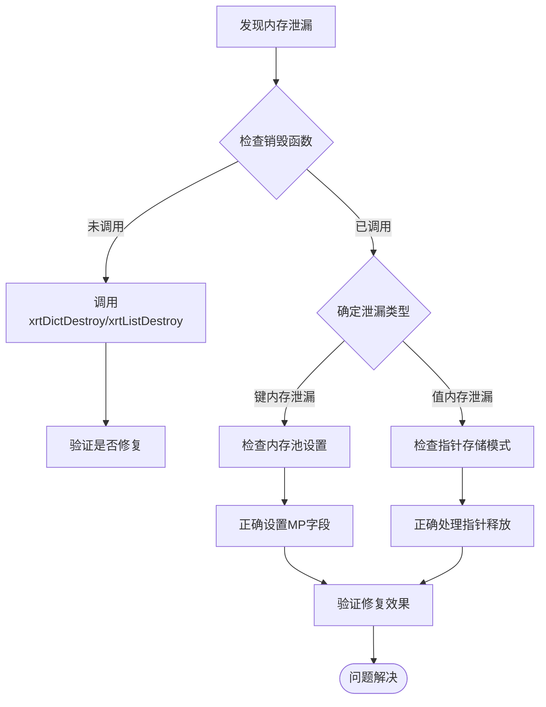

#### 性能问题诊断

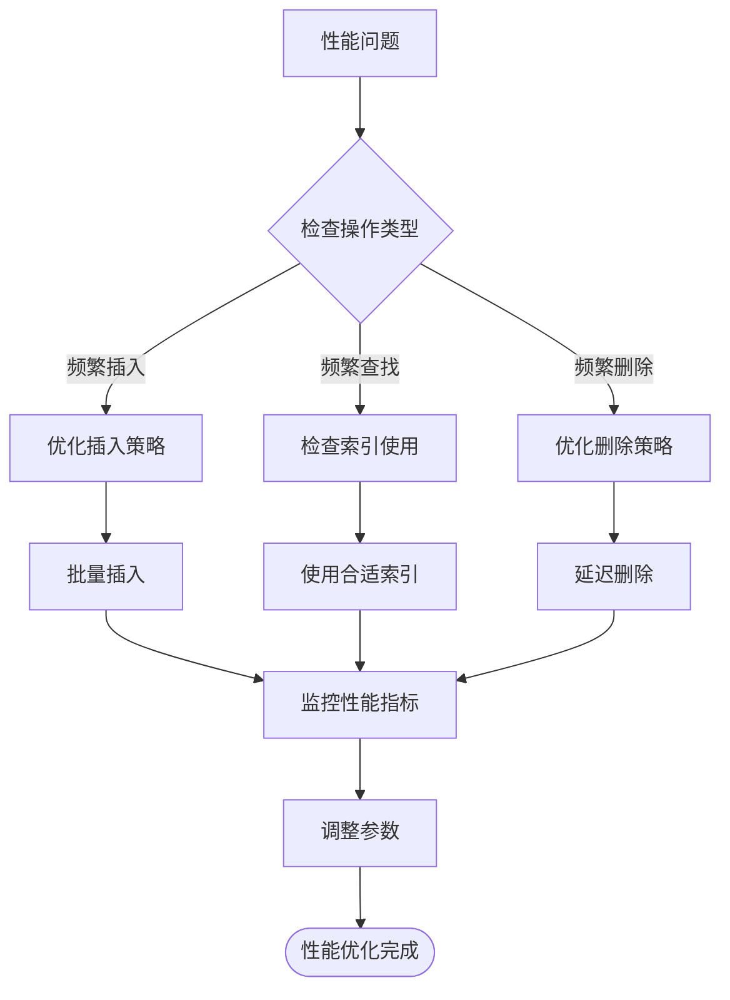

### 最佳实践建议

#### 键设计原则

- **唯一性**：确保键的唯一性，避免冲突
- **稳定性**：键值在生命周期内保持不变
- **长度适中**：避免过长的键值影响性能
- **类型一致性**：同类型的数据使用相同的数据类型

#### 内存管理最佳实践

- **及时释放**：使用完毕后及时调用销毁函数
- **内存池选择**：根据使用场景选择合适的内存池
- **指针管理**：在指针存储模式下注意内存所有权
- **批量操作**：大量数据操作时考虑批量处理

**章节来源**
- [test/test_dict.h](file://test/test_dict.h#L256-L285)
- [test/test_list.h](file://test/test_list.h#L241-L269)

## 结论

XRT库的字典和列表模块提供了高效、可靠的键值存储解决方案。通过基于AVL树的实现，两个模块都保证了O(log n)的时间复杂度性能，并且具有良好的内存管理机制。

### 主要优势

1. **性能稳定**：AVL树保证平衡性，提供稳定的O(log n)性能
2. **内存高效**：字典模块支持内存池，列表模块支持稀疏存储
3. **使用简单**：提供直观的API接口，易于集成
4. **跨平台**：支持多种处理器架构和操作系统

### 适用场景

- **字典模块**：适合需要字符串或复杂键的键值对存储
- **列表模块**：适合需要整数索引的稀疏数据存储
- **高并发**：适合多线程环境下的数据访问

### 发展方向

- **扩展数据类型**：支持更多内置数据类型的存储
- **性能优化**：进一步优化内存访问模式
- **功能增强**：增加更多实用的数据操作功能

## 附录

### API参考速查

#### 字典模块关键API

| 函数名 | 功能描述 | 时间复杂度 |
|--------|----------|-----------|
| xrtDictCreate | 创建字典 | O(1) |
| xrtDictSet | 设置键值对 | O(log n) |
| xrtDictGet | 获取值 | O(log n) |
| xrtDictRemove | 删除键值对 | O(log n) |
| xrtDictWalk | 遍历字典 | O(n) |

#### 列表模块关键API

| 函数名 | 功能描述 | 时间复杂度 |
|--------|----------|-----------|
| xrtListCreate | 创建列表 | O(1) |
| xrtListSet | 设置元素 | O(log n) |
| xrtListGet | 获取元素 | O(log n) |
| xrtListRemove | 删除元素 | O(log n) |
| xrtListWalk | 遍历列表 | O(n) |

### 性能基准测试

两个模块都包含了完整的性能测试用例，展示了在大规模数据下的性能表现：

- **插入性能**：支持百万级数据的快速插入
- **查询性能**：支持千万级数据的快速查询
- **内存使用**：相比传统数组具有更好的内存效率

**章节来源**
- [test/test_dict.h](file://test/test_dict.h#L170-L241)
- [test/test_list.h](file://test/test_list.h#L159-L225)