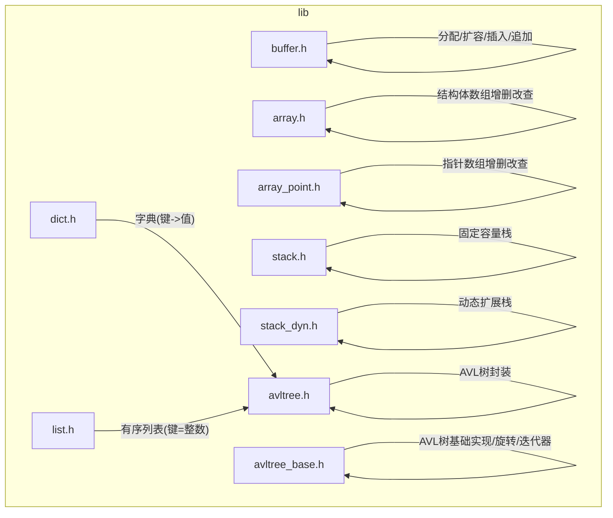
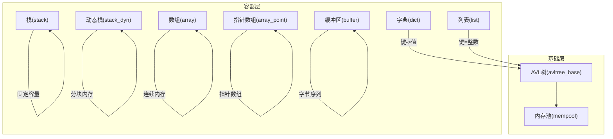
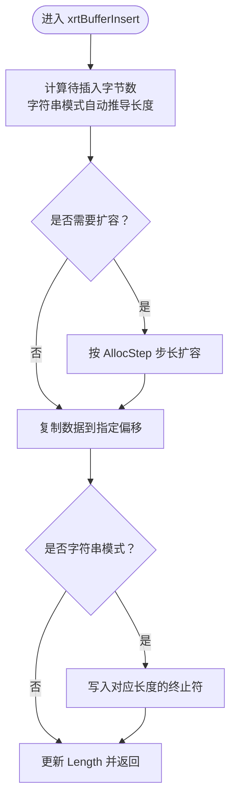
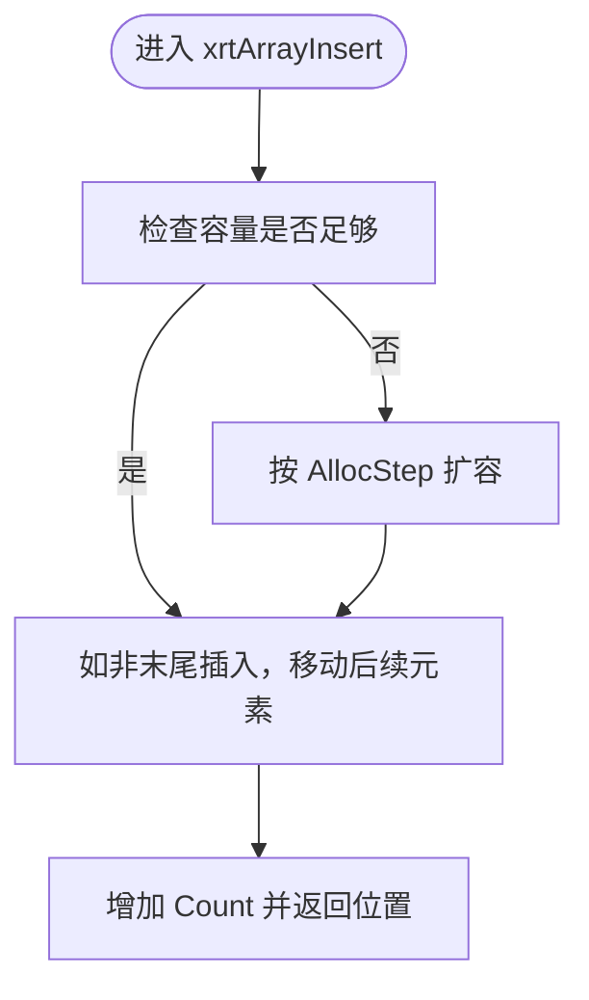
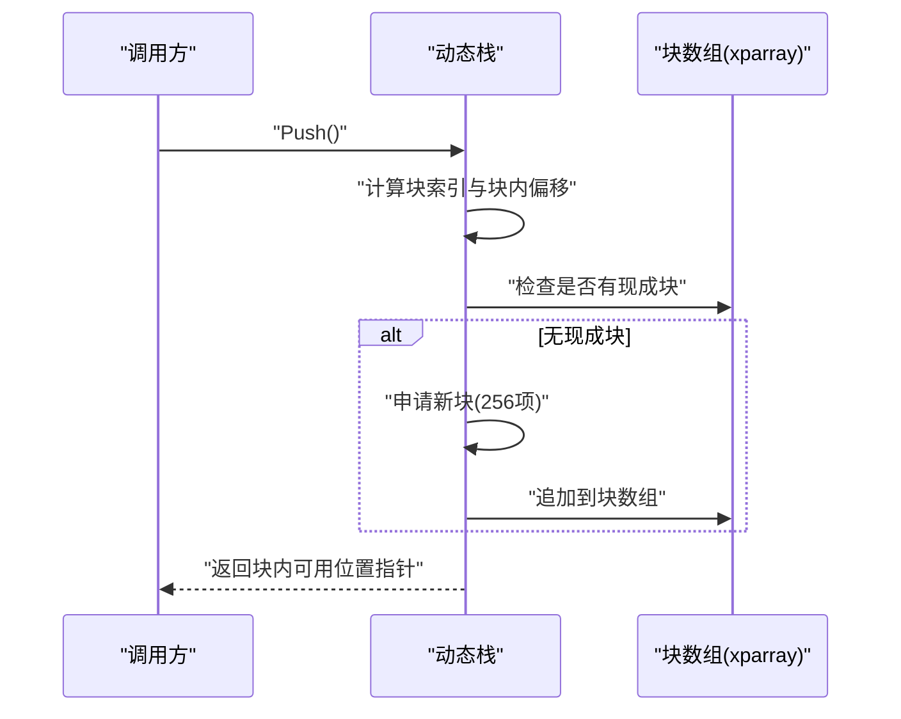
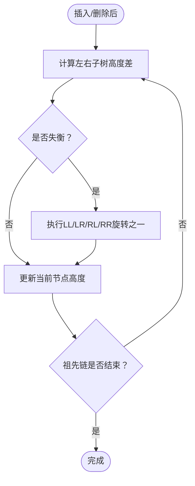
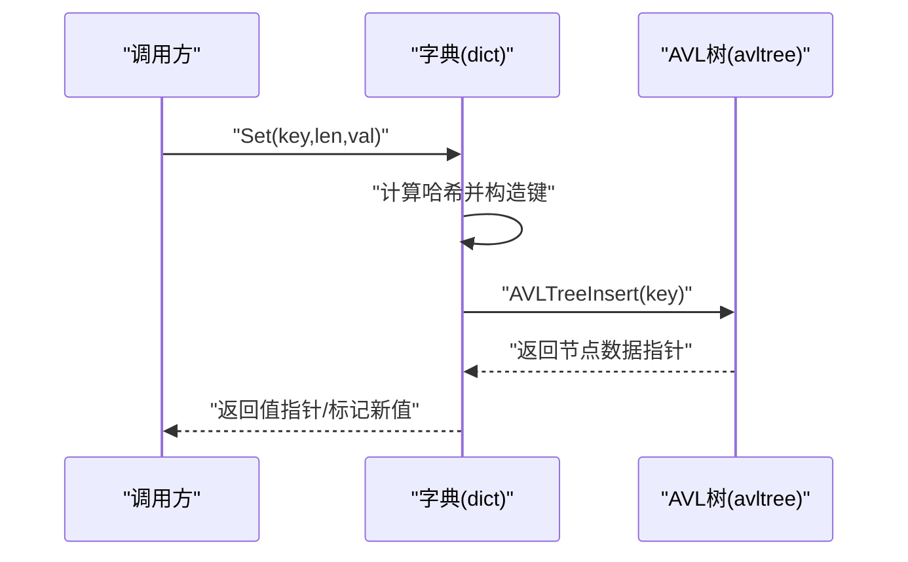
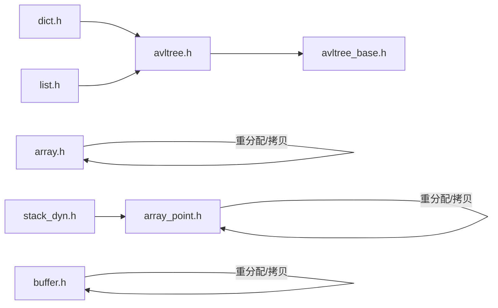

# 数据结构层

<cite>
**本文引用的文件**
- [buffer.h](file://lib/buffer.h)
- [array.h](file://lib/array.h)
- [array_point.h](file://lib/array_point.h)
- [stack.h](file://lib/stack.h)
- [stack_dyn.h](file://lib/stack_dyn.h)
- [avltree.h](file://lib/avltree.h)
- [avltree_base.h](file://lib/avltree_base.h)
- [dict.h](file://lib/dict.h)
- [list.h](file://lib/list.h)
</cite>

## 目录
1. [引言](#引言)
2. [项目结构](#项目结构)
3. [核心组件](#核心组件)
4. [架构总览](#架构总览)
5. [详细组件分析](#详细组件分析)
6. [依赖关系分析](#依赖关系分析)
7. [性能考量](#性能考量)
8. [故障排查指南](#故障排查指南)
9. [结论](#结论)
10. [附录](#附录)

## 引言
本文件面向XRT数据结构层模块，系统化梳理并解释以下子系统的内部实现、时间复杂度、内存布局与使用建议：
- 动态缓冲区模块(buffer)：缓冲区管理与自动扩容机制
- 数组模块(array、array_point)：结构体数组与指针数组操作
- 栈模块(stack、stack_dyn)：静态与动态栈实现
- 链表模块(llist)：双向链表操作（本仓库未包含该文件，详见“章节来源”）
- AVL树模块(avltree、avltree_base)：平衡树实现与节点缓存
- 字典模块(dict)与列表模块(list)：基于AVL树的查找与性能优化

## 项目结构
数据结构层位于lib目录下，采用“按功能分头文件”的组织方式，每个模块提供统一的XXAPI接口风格，内部封装具体实现细节。

图表来源
- [buffer.h](file://lib/buffer.h#L1-L116)
- [array.h](file://lib/array.h#L1-L180)
- [array_point.h](file://lib/array_point.h#L1-L199)
- [stack.h](file://lib/stack.h#L1-L135)
- [stack_dyn.h](file://lib/stack_dyn.h#L1-L162)
- [avltree.h](file://lib/avltree.h#L1-L126)
- [avltree_base.h](file://lib/avltree_base.h#L1-L423)
- [dict.h](file://lib/dict.h#L1-L204)
- [list.h](file://lib/list.h#L1-L188)

章节来源
- [buffer.h](file://lib/buffer.h#L1-L116)
- [array.h](file://lib/array.h#L1-L180)
- [array_point.h](file://lib/array_point.h#L1-L199)
- [stack.h](file://lib/stack.h#L1-L135)
- [stack_dyn.h](file://lib/stack_dyn.h#L1-L162)
- [avltree.h](file://lib/avltree.h#L1-L126)
- [avltree_base.h](file://lib/avltree_base.h#L1-L423)
- [dict.h](file://lib/dict.h#L1-L204)
- [list.h](file://lib/list.h#L1-L188)

## 核心组件
- 动态缓冲区(buffer)：提供按步长增长的连续内存块管理，支持中间插入与字符串模式自动终止符处理
- 结构体数组(array)：按项长度管理的连续内存数组，支持插入、追加、交换、删除与排序
- 指针数组(array_point)：管理指针的数组，支持插入、追加、交换、删除、查找空隙复用与排序
- 静态栈(stack)：在创建时分配固定容量的连续内存，提供压栈/出栈/取栈顶/按位置访问
- 动态栈(stack_dyn)：按256项为块的分块内存策略，延迟释放多余块，降低频繁分配开销
- AVL树(avltree、avltree_base)：平衡二叉搜索树，提供插入/删除/查找/遍历/迭代器
- 字典(dict)：以键值形式存储，内部基于AVL树，提供哈希辅助比较
- 列表(list)：以整型键维护的有序集合，内部同样基于AVL树

章节来源
- [buffer.h](file://lib/buffer.h#L1-L116)
- [array.h](file://lib/array.h#L1-L180)
- [array_point.h](file://lib/array_point.h#L1-L199)
- [stack.h](file://lib/stack.h#L1-L135)
- [stack_dyn.h](file://lib/stack_dyn.h#L1-L162)
- [avltree.h](file://lib/avltree.h#L1-L126)
- [avltree_base.h](file://lib/avltree_base.h#L1-L423)
- [dict.h](file://lib/dict.h#L1-L204)
- [list.h](file://lib/list.h#L1-L188)

## 架构总览
AVL树作为字典与列表等容器的底层实现，提供O(log N)的查找、插入与删除能力；数组与栈提供线性结构的高效随机访问与顺序访问；缓冲区提供可变长字节序列的便捷管理。

图表来源
- [avltree.h](file://lib/avltree.h#L1-L126)
- [avltree_base.h](file://lib/avltree_base.h#L1-L423)
- [dict.h](file://lib/dict.h#L1-L204)
- [list.h](file://lib/list.h#L1-L188)
- [stack.h](file://lib/stack.h#L1-L135)
- [stack_dyn.h](file://lib/stack_dyn.h#L1-L162)
- [array.h](file://lib/array.h#L1-L180)
- [array_point.h](file://lib/array_point.h#L1-L199)
- [buffer.h](file://lib/buffer.h#L1-L116)

## 详细组件分析

### 动态缓冲区模块(buffer)
- 内部结构与内存布局
  - 维护Buffer指针、当前长度Length、分配长度AllocLength、分配步长AllocStep
  - 字符串模式支持ANSI/UTF-16/UTF-32，自动追加相应长度的终止符
- 自动扩容机制
  - 插入或分配时若空间不足，按AllocStep步长进行扩容
  - 支持裁剪：当请求长度小于当前分配长度时，按需收缩并同步Length
- 关键流程
  - 分配：xrtBufferMalloc
  - 中间插入：xrtBufferInsert（自动计算长度、必要时扩容、复制数据、按模式写入终止符）
  - 末尾追加：xrtBufferAppend（委托插入）

图表来源
- [buffer.h](file://lib/buffer.h#L75-L107)

章节来源
- [buffer.h](file://lib/buffer.h#L1-L116)

### 数组模块(array、array_point)
- array：结构体数组
  - 按ItemLength管理连续内存，支持插入、追加、交换、删除、排序
  - 插入时若容量不足，按AllocStep增量扩容；删除时同步更新Count
- array_point：指针数组
  - 存储指针，支持插入、追加、交换、删除、空位复用、排序
  - 插入时若容量不足，按AllocStep增量扩容；空位复用优先策略

图表来源
- [array.h](file://lib/array.h#L77-L99)

章节来源
- [array.h](file://lib/array.h#L1-L180)
- [array_point.h](file://lib/array_point.h#L1-L199)

### 栈模块(stack、stack_dyn)
- stack（静态栈）
  - 创建时一次性分配内存块，Memory紧随结构体之后
  - 提供压栈/出栈/取栈顶/按位置访问，支持直接存放指针或值
- stack_dyn（动态栈）
  - 每块256项，按需分配新块；出栈时若块利用率过低则延迟释放
  - 使用指针数组管理块列表，减少碎片与频繁分配

图表来源
- [stack_dyn.h](file://lib/stack_dyn.h#L44-L68)

章节来源
- [stack.h](file://lib/stack.h#L1-L135)
- [stack_dyn.h](file://lib/stack_dyn.h#L1-L162)

### AVL树模块(avltree、avltree_base)
- avltree：对外封装
  - 提供创建/销毁/初始化/释放、插入/删除/查找、遍历与迭代器
  - 内部使用内存池管理节点，支持节点缓存减少分配
- avltree_base：基础实现
  - 实现AVL旋转与再平衡逻辑，保证树高O(log N)
  - 提供插入/删除/查找、中序遍历与迭代器（显式栈模拟）

图表来源
- [avltree_base.h](file://lib/avltree_base.h#L5-L134)

章节来源
- [avltree.h](file://lib/avltree.h#L1-L126)
- [avltree_base.h](file://lib/avltree_base.h#L1-L423)

### 字典模块(dict)与列表模块(list)
- dict：键->值映射
  - 内部以AVL树存储，键为字节序列，值为用户数据
  - 哈希辅助比较，避免全字节比较开销
- list：整数键有序集合
  - 内部以AVL树存储，键为int64，值为用户数据
  - 提供Set/Get/Remove/Exists/Walk等操作

图表来源
- [dict.h](file://lib/dict.h#L71-L76)
- [avltree.h](file://lib/avltree.h#L62-L90)

章节来源
- [dict.h](file://lib/dict.h#L1-L204)
- [list.h](file://lib/list.h#L1-L188)

## 依赖关系分析
- 字典与列表均依赖AVL树实现，AVL树依赖内存池与比较函数
- 动态栈依赖指针数组管理块列表
- 数组与指针数组依赖重分配与内存拷贝

图表来源
- [dict.h](file://lib/dict.h#L1-L204)
- [list.h](file://lib/list.h#L1-L188)
- [avltree.h](file://lib/avltree.h#L1-L126)
- [avltree_base.h](file://lib/avltree_base.h#L1-L423)
- [stack_dyn.h](file://lib/stack_dyn.h#L1-L162)
- [array_point.h](file://lib/array_point.h#L1-L199)
- [array.h](file://lib/array.h#L1-L180)
- [buffer.h](file://lib/buffer.h#L1-L116)

章节来源
- [dict.h](file://lib/dict.h#L1-L204)
- [list.h](file://lib/list.h#L1-L188)
- [avltree.h](file://lib/avltree.h#L1-L126)
- [avltree_base.h](file://lib/avltree_base.h#L1-L423)
- [stack_dyn.h](file://lib/stack_dyn.h#L1-L162)
- [array_point.h](file://lib/array_point.h#L1-L199)
- [array.h](file://lib/array.h#L1-L180)
- [buffer.h](file://lib/buffer.h#L1-L116)

## 性能考量
- 时间复杂度
  - 动态缓冲区：插入/追加以摊还O(1)，最坏O(N)因重分配
  - 结构体数组/指针数组：中间插入/删除O(N)，末尾操作摊还O(1)
  - 静态栈：O(1)压栈/出栈/取栈顶
  - 动态栈：摊还O(1)压栈/出栈，延迟释放降低碎片
  - AVL树：查找/插入/删除平均O(log N)，最坏O(log N)
  - 字典/列表：基于AVL树，平均O(log N)
- 空间复杂度
  - 动态缓冲区：按AllocStep步长增长，额外常数开销
  - 数组/指针数组：容量与Count正相关，预留AllocStep
  - 动态栈：每块256项，按需增长，延迟释放减少冗余
  - AVL树：节点数N，高度O(log N)，内存池减少碎片
- 优化建议
  - 预估容量：在创建时设置合适的AllocStep/初始容量
  - 避免频繁中间插入/删除：批量操作后一次性插入
  - 使用动态栈替代频繁realloc的栈：降低分配次数
  - 字典/列表键尽量紧凑：减少比较成本
  - 利用迭代器：避免递归遍历带来的栈开销

## 故障排查指南
- 插入失败/返回空指针
  - 检查容量是否足够，确认扩容步长设置合理
  - 对于动态栈，确认块数组追加是否成功
- 出栈后内存未释放
  - 动态栈在利用率低于阈值时才延迟释放，属预期行为
- 查找不到键
  - 确认比较函数与键一致（字典使用哈希+字节比较）
- 性能异常
  - 检查是否频繁在中间插入/删除导致大量memmove
  - 对于字典/列表，确认键类型与比较函数匹配

章节来源
- [stack_dyn.h](file://lib/stack_dyn.h#L58-L62)
- [dict.h](file://lib/dict.h#L106-L111)
- [list.h](file://lib/list.h#L95-L102)

## 结论
XRT数据结构层以AVL树为核心，结合数组、栈与缓冲区，提供了高效且易用的数据结构族。通过合理的容量预估、扩容策略与内存池技术，可在不同场景下取得良好的性能与内存占用平衡。字典与列表通过键的抽象实现了高效的查找与有序存储，适合广泛的应用场景。

## 附录
- 数据结构选择指南
  - 需要可变长字节序列：优先buffer
  - 需要结构体集合且支持随机访问：array
  - 需要指针集合且需空位复用：array_point
  - 需要LIFO且容量固定：stack
  - 需要LIFO且容量动态：stack_dyn
  - 需要键->值映射：dict
  - 需要整数键有序集合：list
- 最佳实践
  - 明确容量与步长，避免频繁扩容
  - 尽量尾部操作，减少中间插入/删除
  - 使用迭代器遍历，避免深度递归
  - 对大对象使用指针数组，减少拷贝